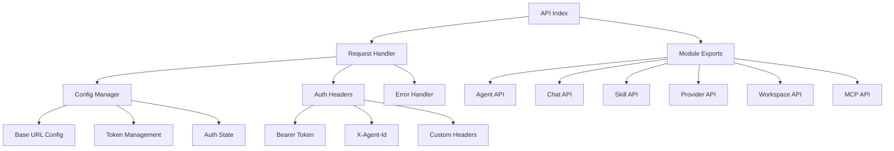

# API 参考

<cite>
**本文引用的文件**
- [API-Reference.md](file://docs/wiki/API-Reference.md)
- [CLI-Commands.md](file://docs/wiki/CLI-Commands.md)
- [_app.py](file://src/copaw/app/_app.py)
- [routers/__init__.py](file://src/copaw/app/routers/__init__.py)
- [routers/agent.py](file://src/copaw/app/routers/agent.py)
- [routers/auth.py](file://src/copaw/app/routers/auth.py)
- [routers/messages.py](file://src/copaw/app/routers/messages.py)
- [routers/files.py](file://src/copaw/app/routers/files.py)
- [routers/settings.py](file://src/copaw/app/routers/settings.py)
- [routers/tasks.py](file://src/copaw/app/routers/tasks.py)
- [routers/workflows.py](file://src/copaw/app/routers/workflows.py)
- [routers/audit.py](file://src/copaw/app/routers/audit.py)
- [routers/dlp.py](file://src/copaw/app/routers/dlp.py)
- [routers/alerts.py](file://src/copaw/app/routers/alerts.py)
- [routers/users.py](file://src/copaw/app/routers/users.py)
- [routers/roles.py](file://src/copaw/app/routers/roles.py)
- [routers/user_groups.py](file://src/copaw/app/routers/user_groups.py)
- [routers/dify.py](file://src/copaw/app/routers/dify.py)
- [main.py](file://src/copaw/cli/main.py)
- [agents_cmd.py](file://src/copaw/cli/agents_cmd.py)
- [chats_cmd.py](file://src/copaw/cli/chats_cmd.py)
- [cron_cmd.py](file://src/copaw/cli/cron_cmd.py)
- [env_cmd.py](file://src/copaw/cli/env_cmd.py)
- [enterprise-users.ts](file://console/src/api/modules/enterprise-users.ts)
- [enterprise-auth.ts](file://console/src/api/modules/enterprise-auth.ts)
- [enterprise-roles.ts](file://console/src/api/modules/enterprise-roles.ts)
- [enterprise-tasks.ts](file://console/src/api/modules/enterprise-tasks.ts)
- [enterprise-workflows.ts](file://console/src/api/modules/enterprise-workflows.ts)
- [enterprise-audit.ts](file://console/src/api/modules/enterprise-audit.ts)
- [enterprise-dlp.ts](file://console/src/api/modules/enterprise-dlp.ts)
- [enterprise-alerts.ts](file://console/src/api/modules/enterprise-alerts.ts)
- [enterprise-groups.ts](file://console/src/api/modules/enterprise-groups.ts)
- [enterprise-dify.ts](file://console/src/api/modules/enterprise-dify.ts)
- [index.ts](file://console/src/api/index.ts)
- [config.ts](file://console/src/api/config.ts)
- [request.ts](file://console/src/api/request.ts)
- [root.ts](file://console/src/api/modules/root.ts)
- [agent.ts](file://console/src/api/modules/agent.ts)
- [agents.ts](file://console/src/api/modules/agents.ts)
- [chat.ts](file://console/src/api/modules/chat.ts)
- [workspace.ts](file://console/src/api/modules/workspace.ts)
- [skill.ts](file://console/src/api/modules/skill.ts)
- [provider.ts](file://console/src/api/modules/provider.ts)
- [mcp.ts](file://console/src/api/modules/mcp.ts)
</cite>

## 更新摘要
**所做更改**
- 新增完整的前端API客户端核心文档，涵盖所有API模块的详细说明
- 新增前端API客户端架构图，展示模块化设计和依赖关系
- 更新认证与授权章节，增加前端认证流程和令牌管理机制
- 新增前端SDK使用示例，包含JavaScript和TypeScript实现
- 扩展WebSocket API章节，增加前端实时通信实现细节
- 新增错误处理章节，专门针对前端API调用的错误处理策略

## 目录
1. [简介](#简介)
2. [基础信息](#基础信息)
3. [认证与授权](#认证与授权)
4. [RESTful API](#restful-api)
5. [WebSocket API](#websocket-api)
6. [CLI 命令参考](#cli-命令参考)
7. [前端API客户端](#前端api客户端)
8. [企业级 API](#企业级-api)
9. [错误处理](#错误处理)
10. [最佳实践](#最佳实践)
11. [版本信息](#版本信息)

## 简介
本文档为 CoPaw 的完整 API 参考，涵盖 RESTful API、WebSocket 接口、CLI 命令、前端API客户端和企业级功能的详细说明。CoPaw 是一个基于 FastAPI 构建的智能体平台，支持多智能体协作、技能管理、渠道集成、企业级权限控制等功能。

## 基础信息
- **基础 URL**: `http://127.0.0.1:8088/api`
- **认证**: 可选的 Bearer Token 认证
- **内容类型**: `application/json`
- **API 版本**: v1
- **WebSocket 地址**: `ws://127.0.0.1:8088/ws`

## 认证与授权
CoPaw 支持多种认证方式，包括单用户模式和企业级模式：

### 认证方式
- **Bearer Token**: 可选的 JWT 令牌认证
- **用户名密码**: 支持用户注册和登录
- **企业级认证**: 支持 MFA 和 RBAC 权限控制

### 认证流程
```bash
# 启用认证
export COPAW_AUTH_ENABLED=true
copaw app

# 使用 Bearer Token
curl -H "Authorization: Bearer YOUR_TOKEN" \
  http://127.0.0.1:8088/api/agents
```

**章节来源**
- [auth.py:43-143](file://src/copaw/app/routers/auth.py#L43-L143)
- [_app.py:517-524](file://src/copaw/app/_app.py#L517-L524)

## RESTful API

### 智能体管理
智能体是 CoPaw 的核心组件，支持创建、配置、管理和监控多个智能体实例。

#### 基础操作
- **GET /api/agents**: 列出所有智能体
- **POST /api/agents**: 创建新智能体
- **GET /api/agents/{agent_id}**: 获取智能体详情
- **PUT /api/agents/{agent_id}**: 更新智能体配置
- **DELETE /api/agents/{agent_id}**: 删除智能体

#### 状态管理
- **PATCH /api/agents/{agent_id}/status**: 启用/禁用智能体
- **GET /api/agents/{agent_id}/status**: 获取智能体状态

#### 配置管理
- **GET /api/agents/{agent_id}/config**: 获取智能体配置
- **PUT /api/agents/{agent_id}/config**: 更新智能体配置

#### 文件管理
- **GET /api/agents/{agent_id}/memory**: 列出记忆文件
- **GET /api/agents/{agent_id}/memory/{md_name}**: 读取记忆文件
- **PUT /api/agents/{agent_id}/memory/{md_name}**: 写入记忆文件
- **GET /api/agents/{agent_id}/files**: 列出工作文件
- **GET /api/agents/{agent_id}/files/{md_name}**: 读取工作文件
- **PUT /api/agents/{agent_id}/files/{md_name}**: 写入工作文件

#### 语言设置
- **GET /api/agents/{agent_id}/language**: 获取智能体语言
- **PUT /api/agents/{agent_id}/language**: 更新智能体语言

**章节来源**
- [agent.py:38-200](file://src/copaw/app/routers/agent.py#L38-L200)

### 聊天 API
CoPaw 提供强大的聊天交互功能，支持流式响应和多会话管理。

#### 消息交互
- **POST /api/chat/message**: 发送消息（支持流式响应）
- **GET /api/chat/history**: 获取对话历史
- **DELETE /api/chat/history**: 清空对话历史
- **POST /api/chat/conversation**: 创建新对话

#### 会话管理
- **GET /api/chats**: 列出聊天会话
- **GET /api/chats/{chat_id}**: 获取聊天详情
- **POST /api/chats**: 创建聊天会话
- **PUT /api/chats/{chat_id}**: 更新聊天名称
- **DELETE /api/chats/{chat_id}**: 删除聊天会话

#### 渠道消息
- **POST /api/messages/send**: 向渠道发送文本消息（智能体主动推送）

**章节来源**
- [messages.py:78-187](file://src/copaw/app/routers/messages.py#L78-L187)

### 技能管理
技能系统允许用户创建、管理和共享各种功能模块。

#### 技能池管理
- **GET /api/skills/pool**: 列出技能池技能
- **DELETE /api/skills/pool/{skill_id}**: 删除技能
- **POST /api/skills/update-builtin**: 更新内置技能

#### 工作区技能
- **GET /api/skills/workspace**: 列出工作区技能
- **POST /api/skills/broadcast**: 广播技能到工作区
- **POST /api/skills/import**: 导入技能

**章节来源**
- [routers/skills.py](file://src/copaw/app/routers/skills.py)

### 模型提供商
CoPaw 支持多种 AI 模型提供商，包括 DashScope、OpenAI、Ollama 等。

#### 提供商管理
- **GET /api/providers**: 列出提供商
- **POST /api/providers/{provider_name}/config**: 配置提供商
- **POST /api/providers/{provider_name}/test**: 测试连接
- **GET /api/providers/{provider_name}/models**: 获取可用模型

**章节来源**
- [routers/providers.py](file://src/copaw/app/routers/providers.py)

### 本地模型
本地模型管理功能允许用户下载和管理本地运行的 AI 模型。

#### 本地模型操作
- **GET /api/local-models**: 列出本地模型
- **POST /api/local-models/download**: 下载模型
- **DELETE /api/local-models/{model_id}**: 删除模型
- **POST /api/local-models/{model_id}/start**: 启动本地模型服务
- **POST /api/local-models/{model_id}/stop**: 停止本地模型服务

**章节来源**
- [routers/local_models.py](file://src/copaw/app/routers/local_models.py)

### 渠道配置
CoPaw 支持多种通信渠道，包括钉钉、飞书、Discord、Telegram 等。

#### 渠道管理
- **GET /api/channel**: 列出渠道
- **POST /api/channel/{channel_name}/config**: 配置渠道
- **POST /api/channel/{channel_name}/test**: 测试渠道连接

**章节来源**
- [routers/channel.py](file://src/copaw/app/routers/channel.py)

### 定时任务
定时任务系统支持基于 Cron 表达式的自动化任务执行。

#### 任务管理
- **GET /api/cronjob**: 列出定时任务
- **POST /api/cronjob**: 创建定时任务
- **PUT /api/cronjob/{job_id}**: 更新定时任务
- **DELETE /api/cronjob/{job_id}**: 删除定时任务
- **POST /api/cronjob/{job_id}/trigger**: 手动触发任务

**章节来源**
- [crons/api.py](file://src/copaw/app/crons/api.py)

### 心跳任务
心跳任务用于定期检查系统状态和执行维护操作。

#### 心跳配置
- **GET /api/heartbeat**: 获取心跳配置
- **PUT /api/heartbeat**: 更新心跳配置

**章节来源**
- [routers/heartbeat.py](file://src/copaw/app/routers/heartbeat.py)

### 环境变量
环境变量管理系统允许动态配置应用参数。

#### 环境变量操作
- **GET /api/envs**: 列出环境变量
- **POST /api/envs**: 设置环境变量
- **DELETE /api/envs/{key}**: 删除环境变量

**章节来源**
- [routers/envs.py](file://src/copaw/app/routers/envs.py)

### 工作区文件
工作区文件管理支持文件的上传、下载和管理。

#### 文件操作
- **GET /api/workspace/files**: 列出文件
- **GET /api/workspace/files/content**: 读取文件内容
- **POST /api/workspace/files/upload**: 上传文件
- **DELETE /api/workspace/files**: 删除文件

**章节来源**
- [routers/workspace.py](file://src/copaw/app/routers/workspace.py)

### MCP 管理
MCP（Model Context Protocol）客户端管理支持与外部工具和服务的集成。

#### MCP 操作
- **GET /api/mcp**: 列出 MCP 客户端
- **POST /api/mcp**: 添加 MCP 客户端
- **DELETE /api/mcp/{client_id}**: 删除 MCP 客户端
- **GET /api/mcp/{client_id}/tools**: 列出 MCP 工具

**章节来源**
- [routers/mcp.py](file://src/copaw/app/routers/mcp.py)

### 安全配置
安全配置管理包括工具守卫、文件保护和技能扫描等功能。

#### 安全设置
- **GET /api/security**: 获取安全配置
- **PUT /api/security**: 更新安全配置
- **GET /api/security/tool-guard/rules**: 获取工具守卫规则
- **POST /api/security/tool-guard/rules**: 添加工具守卫规则

**章节来源**
- [routers/security.py](file://src/copaw/app/routers/security.py)

### 令牌使用统计
令牌使用统计功能提供详细的使用情况报告。

#### 统计查询
- **GET /api/token-usage/summary**: 获取统计摘要
- **GET /api/token-usage/details**: 获取详细记录

**章节来源**
- [routers/token_usage.py](file://src/copaw/app/routers/token_usage.py)

### 控制台状态
控制台状态接口提供系统运行状态信息。

#### 状态查询
- **GET /api/console/status**: 获取控制台状态
- **GET /api/console/system**: 获取系统信息

**章节来源**
- [routers/console.py](file://src/copaw/app/routers/console.py)

## WebSocket API
CoPaw 提供实时通信功能，支持智能体消息的实时推送。

### 连接建立
```javascript
const ws = new WebSocket('ws://127.0.0.1:8088/ws');

ws.onopen = () => {
  ws.send(JSON.stringify({
    type: 'subscribe',
    agent_id: 'default'
  }));
};

ws.onmessage = (event) => {
  const data = JSON.parse(event.data);
  console.log('Received:', data);
};
```

### 消息类型
| 类型 | 方向 | 说明 |
|------|------|------|
| `subscribe` | 客户端→服务器 | 订阅智能体消息 |
| `unsubscribe` | 客户端→服务器 | 取消订阅 |
| `message` | 服务器→客户端 | 新消息 |
| `typing` | 服务器→客户端 | AI 正在输入 |
| `error` | 服务器→客户端 | 错误通知 |

**章节来源**
- [API-Reference.md:710-740](file://docs/wiki/API-Reference.md#L710-L740)

## CLI 命令参考
CoPaw 提供丰富的命令行工具，支持应用管理、智能体操作、聊天管理、定时任务等。

### 基础命令
- **copaw --help**: 显示帮助信息
- **copaw --version**: 显示版本信息

### 应用管理
- **copaw app**: 启动服务（支持 --port、--host、--log-level、--reload 参数）
- **copaw init**: 初始化配置（支持 --defaults、--working-dir、--no-telemetry 参数）

### 智能体管理
- **copaw agents list**: 列出智能体
- **copaw agents chat**: 与智能体通信（支持流式、后台任务、会话复用）

### 聊天管理
- **copaw chats list**: 列出聊天会话
- **copaw chats get**: 获取聊天详情
- **copaw chats create**: 创建聊天会话
- **copaw chats update**: 更新聊天名称
- **copaw chats delete**: 删除聊天会话

### 定时任务
- **copaw cron list**: 列出定时任务
- **copaw cron get**: 获取定时任务详情
- **copaw cron state**: 查看任务状态
- **copaw cron create**: 创建定时任务
- **copaw cron delete**: 删除定时任务
- **copaw cron pause**: 暂停定时任务
- **copaw cron resume**: 恢复定时任务
- **copaw cron run**: 立即运行定时任务

### 环境变量
- **copaw env list**: 列出环境变量
- **copaw env set**: 设置环境变量
- **copaw env delete**: 删除环境变量

### 系统命令
- **copaw daemon start**: 启动守护进程
- **copaw daemon stop**: 停止守护进程
- **copaw daemon status**: 查看守护进程状态
- **copaw shutdown**: 优雅关闭服务
- **copaw update**: 更新应用
- **copaw uninstall**: 卸载应用
- **copaw clean**: 清理缓存与临时文件

### 插件管理
- **copaw plugin list**: 列出插件
- **copaw plugin install**: 安装插件
- **copaw plugin uninstall**: 卸载插件
- **copaw plugin enable**: 启用插件
- **copaw plugin disable**: 禁用插件

### 认证管理
- **copaw auth login**: 用户登录
- **copaw auth logout**: 用户登出
- **copaw auth token**: 获取认证令牌

**章节来源**
- [CLI-Commands.md:1-942](file://docs/wiki/CLI-Commands.md#L1-L942)
- [main.py:95-168](file://src/copaw/cli/main.py#L95-L168)

## 前端API客户端

### 概述
CoPaw 前端API客户端采用模块化设计，提供了完整的HTTP请求封装和认证管理功能。客户端通过统一的请求处理器和模块化的API接口，为控制台界面提供稳定可靠的后端通信能力。

### 架构设计
前端API客户端采用以下核心架构：



**图表来源**
- [index.ts:26-85](file://console/src/api/index.ts#L26-L85)
- [config.ts:32-68](file://console/src/api/config.ts#L32-L68)
- [request.ts:39-58](file://console/src/api/request.ts#L39-L58)

### 核心模块

#### 配置管理 (config.ts)
负责API基础URL、认证令牌和认证状态的管理：

**主要功能**:
- `getApiUrl(path)`: 构建完整的API URL，自动添加 `/api` 前缀
- `getApiToken()`: 获取认证令牌，优先从localStorage获取
- `setAuthToken(token)`: 存储认证令牌
- `clearAuthToken()`: 清除认证令牌
- `setAuthDisabled(disabled)`: 设置认证禁用状态
- `isAuthDisabled()`: 检查认证是否禁用

**章节来源**
- [config.ts:1-68](file://console/src/api/config.ts#L1-L68)

#### 请求处理器 (request.ts)
提供统一的HTTP请求处理和错误处理机制：

**核心特性**:
- 自动添加认证头和Content-Type
- 统一的错误处理和消息提取
- 401状态码的自动重定向处理
- 支持GET、POST、PUT、DELETE、PATCH方法
- 204状态码的特殊处理

**章节来源**
- [request.ts:1-136](file://console/src/api/request.ts#L1-L136)

#### 根API (root.ts)
提供系统基本信息查询：

**接口**:
- `readRoot()`: 获取根目录信息
- `getVersion()`: 获取系统版本

**章节来源**
- [root.ts:1-8](file://console/src/api/modules/root.ts#L1-L8)

#### 智能体API (agent.ts)
管理智能体的健康检查、配置和语言设置：

**主要功能**:
- 健康检查和进程状态查询
- 运行配置管理
- 语言设置和音频模式配置
- 语音转录提供程序管理
- 本地Whisper状态检查

**章节来源**
- [agent.ts:1-86](file://console/src/api/modules/agent.ts#L1-L86)

#### 多智能体管理API (agents.ts)
提供智能体的CRUD操作和文件管理：

**核心接口**:
- `listAgents()`: 列出所有智能体
- `createAgent(agent)`: 创建新智能体
- `updateAgent(agentId, agent)`: 更新智能体配置
- `deleteAgent(agentId)`: 删除智能体
- `reorderAgents(agentIds)`: 重新排序智能体
- `toggleAgentEnabled(agentId, enabled)`: 切换智能体状态
- `listAgentFiles(agentId)`: 列出智能体文件
- `readAgentFile(agentId, filename)`: 读取智能体文件
- `writeAgentFile(agentId, filename, content)`: 写入智能体文件
- `listAgentMemory(agentId)`: 列出智能体记忆文件

**章节来源**
- [agents.ts:1-79](file://console/src/api/modules/agents.ts#L1-L79)

#### 聊天API (chat.ts)
管理聊天会话和文件上传功能：

**功能特性**:
- 文件上传和预览URL生成
- 聊天会话的CRUD操作
- 批量删除聊天会话
- 会话和聊天的历史记录管理
- 实时停止聊天功能

**章节来源**
- [chat.ts:1-137](file://console/src/api/modules/chat.ts#L1-L137)

#### 工作区API (workspace.ts)
提供工作区文件和内存管理：

**主要功能**:
- 工作区文件列表和内容管理
- 工作区打包下载
- 文件上传功能
- 日常记忆文件管理
- 系统提示词文件管理

**章节来源**
- [workspace.ts:1-149](file://console/src/api/modules/workspace.ts#L1-L149)

#### 技能API (skill.ts)
完整的技能管理系统，支持技能的创建、管理、导入和优化：

**核心功能**:
- 技能列表和工作区技能管理
- 技能池技能的CRUD操作
- 技能的批量操作和配置管理
- Hub技能的安装和状态跟踪
- AI技能优化的流式处理
- 技能的上传和下载功能

**章节来源**
- [skill.ts:1-551](file://console/src/api/modules/skill.ts#L1-L551)

#### 提供商API (provider.ts)
管理模型提供商和本地模型配置：

**接口**:
- 提供商列表和配置
- 活跃模型的查询和设置
- 自定义提供商的CRUD操作
- 模型的增删改查
- 连接测试和模型发现
- 本地模型设置配置

**章节来源**
- [provider.ts:1-145](file://console/src/api/modules/provider.ts#L1-L145)

#### MCP API (mcp.ts)
管理MCP客户端和工具：

**功能**:
- MCP客户端的CRUD操作
- 客户端启用状态切换
- 连接MCP服务器的工具列表
- 客户端配置和管理

**章节来源**
- [mcp.ts:1-61](file://console/src/api/modules/mcp.ts#L1-L61)

### API模块导出
前端API客户端通过统一的入口导出所有模块：

**导出结构**:
- 根API模块 (`rootApi`)
- 渠道API模块 (`channelApi`)
- 心跳API模块 (`heartbeatApi`)
- 定时任务API模块 (`cronJobApi`)
- 聊天API模块 (`chatApi`, `sessionApi`)
- 环境变量API模块 (`envApi`)
- 提供商API模块 (`providerApi`)
- 智能体API模块 (`agentApi`, `agentsApi`)
- 技能API模块 (`skillApi`)
- 工作区API模块 (`workspaceApi`)
- 本地模型API模块 (`localModelApi`)
- MCP API模块 (`mcpApi`)
- 令牌使用API模块 (`tokenUsageApi`)
- 工具API模块 (`toolsApi`)
- 安全API模块 (`securityApi`)
- 用户时区API模块 (`userTimezoneApi`)
- 语言API模块 (`languageApi`)

**章节来源**
- [index.ts:1-85](file://console/src/api/index.ts#L1-L85)

### 使用示例

#### 基本API调用
```typescript
import { agentsApi, chatApi, skillApi } from './api';

// 获取智能体列表
try {
  const agents = await agentsApi.listAgents();
  console.log('Agents:', agents);
} catch (error) {
  console.error('Error fetching agents:', error);
}

// 创建新聊天会话
try {
  const newChat = await chatApi.createChat({
    name: 'New Conversation',
    agent_id: 'default'
  });
  console.log('Created chat:', newChat);
} catch (error) {
  console.error('Error creating chat:', error);
}
```

#### 错误处理
```typescript
// 统一的错误处理
try {
  const result = await agentsApi.createAgent(agentData);
} catch (error) {
  if (error.message.includes('401')) {
    // 处理未认证错误
    redirectToLogin();
  } else if (error.message.includes('400')) {
    // 处理参数错误
    showValidationError(error);
  } else {
    // 处理其他错误
    showErrorNotification(error.message);
  }
}
```

**章节来源**
- [request.ts:74-94](file://console/src/api/request.ts#L74-L94)

## 企业级 API

### 企业级认证 API
企业级认证提供更高级别的安全性和管理功能。

#### 认证端点
- **POST /api/enterprise/auth/login**: 企业用户登录（支持 MFA）
- **POST /api/enterprise/auth/register**: 企业用户注册
- **POST /api/enterprise/auth/logout**: 用户登出
- **GET /api/enterprise/auth/me**: 获取当前用户信息
- **PUT /api/enterprise/auth/password**: 修改密码
- **POST /api/enterprise/auth/mfa/setup**: 设置 MFA
- **POST /api/enterprise/auth/mfa/verify**: 验证 MFA

**章节来源**
- [enterprise-auth.ts:1-73](file://console/src/api/modules/enterprise-auth.ts#L1-L73)

### 企业级用户管理 API
用户管理功能支持用户 CRUD 操作、角色分配和状态管理。

#### 用户管理端点
- **GET /api/enterprise/users**: 分页查询用户列表
- **POST /api/enterprise/users**: 创建用户
- **GET /api/enterprise/users/{user_id}**: 获取用户详情
- **PUT /api/enterprise/users/{user_id}**: 更新用户信息
- **DELETE /api/enterprise/users/{user_id}**: 禁用用户
- **GET /api/enterprise/users/{user_id}/roles**: 获取用户角色
- **PUT /api/enterprise/users/{user_id}/roles**: 分配用户角色

**章节来源**
- [enterprise-users.ts:1-85](file://console/src/api/modules/enterprise-users.ts#L1-L85)
- [users.py:70-200](file://src/copaw/app/routers/users.py#L70-L200)

### 企业级权限管理 API
权限管理基于 RBAC 模型，支持细粒度的权限控制。

#### 角色管理端点
- **GET /api/enterprise/roles**: 查询角色列表
- **POST /api/enterprise/roles**: 创建角色
- **GET /api/enterprise/roles/{role_id}**: 获取角色详情
- **PUT /api/enterprise/roles/{role_id}**: 更新角色
- **DELETE /api/enterprise/roles/{role_id}**: 删除角色
- **GET /api/enterprise/roles/{role_id}/permissions**: 获取角色权限
- **PUT /api/enterprise/roles/{role_id}/permissions**: 设置角色权限

#### 权限管理端点
- **GET /api/enterprise/permissions**: 查询权限列表
- **POST /api/enterprise/permissions**: 创建权限

**章节来源**
- [enterprise-roles.ts:1-54](file://console/src/api/modules/enterprise-roles.ts#L1-L54)
- [roles.py:1-259](file://src/copaw/app/routers/roles.py#L1-L259)

### 企业级任务管理 API
任务管理系统支持工作流驱动的任务创建、状态跟踪和评论协作。

#### 任务管理端点
- **GET /api/enterprise/tasks**: 分页查询任务列表
- **POST /api/enterprise/tasks**: 创建任务
- **GET /api/enterprise/tasks/{task_id}**: 获取任务详情
- **PUT /api/enterprise/tasks/{task_id}**: 更新任务
- **PUT /api/enterprise/tasks/{task_id}/status**: 变更任务状态
- **DELETE /api/enterprise/tasks/{task_id}**: 删除任务
- **GET /api/enterprise/tasks/{task_id}/comments**: 获取任务评论
- **POST /api/enterprise/tasks/{task_id}/comments**: 添加任务评论

**章节来源**
- [enterprise-tasks.ts:1-85](file://console/src/api/modules/enterprise-tasks.ts#L1-L85)
- [tasks.py:72-200](file://src/copaw/app/routers/tasks.py#L72-L200)

### 企业级工作流管理 API
工作流管理支持复杂业务流程的定义、执行和监控。

#### 工作流管理端点
- **GET /api/enterprise/workflows**: 分页查询工作流列表
- **POST /api/enterprise/workflows**: 创建工作流
- **GET /api/enterprise/workflows/{workflow_id}**: 获取工作流详情
- **PUT /api/enterprise/workflows/{workflow_id}**: 更新工作流
- **DELETE /api/enterprise/workflows/{workflow_id}**: 删除工作流
- **POST /api/enterprise/workflows/{workflow_id}/execute**: 执行工作流
- **GET /api/enterprise/workflows/{workflow_id}/executions**: 查询工作流执行记录

**章节来源**
- [enterprise-workflows.ts:1-97](file://console/src/api/modules/enterprise-workflows.ts#L1-L97)
- [workflows.py:75-200](file://src/copaw/app/routers/workflows.py#L75-L200)

### 企业级审计日志 API
审计日志提供完整的操作记录和合规性支持。

#### 审计日志端点
- **GET /api/enterprise/audit**: 查询审计日志（支持多条件过滤）

**章节来源**
- [enterprise-audit.ts:1-43](file://console/src/api/modules/enterprise-audit.ts#L1-L43)
- [audit.py:1-65](file://src/copaw/app/routers/audit.py#L1-L65)

### 企业级 DLP 数据防泄漏 API
DLP（数据防泄漏）系统提供规则引擎和事件检测功能。

#### DLP 规则端点
- **GET /api/enterprise/dlp/rules/builtin**: 获取内置规则
- **GET /api/enterprise/dlp/rules**: 查询规则列表
- **POST /api/enterprise/dlp/rules**: 创建规则
- **GET /api/enterprise/dlp/rules/{rule_id}**: 获取规则详情
- **PUT /api/enterprise/dlp/rules/{rule_id}**: 更新规则
- **DELETE /api/enterprise/dlp/rules/{rule_id}**: 删除规则

#### DLP 事件端点
- **GET /api/enterprise/dlp/events**: 查询事件列表

**章节来源**
- [enterprise-dlp.ts:1-42](file://console/src/api/modules/enterprise-dlp.ts#L1-L42)
- [dlp.py:1-229](file://src/copaw/app/routers/dlp.py#L1-L229)

### 企业级告警 API
告警系统支持多渠道通知和阈值监控。

#### 告警规则端点
- **GET /api/enterprise/alerts/rules**: 查询规则列表
- **POST /api/enterprise/alerts/rules**: 创建规则
- **GET /api/enterprise/alerts/rules/{rule_id}**: 获取规则详情
- **PUT /api/enterprise/alerts/rules/{rule_id}**: 更新规则
- **DELETE /api/enterprise/alerts/rules/{rule_id}**: 删除规则

#### 告警事件端点
- **GET /api/enterprise/alerts/events**: 查询事件列表

#### 测试通知端点
- **POST /api/enterprise/alerts/test**: 发送测试通知

**章节来源**
- [enterprise-alerts.ts:1-47](file://console/src/api/modules/enterprise-alerts.ts#L1-L47)
- [alerts.py:1-196](file://src/copaw/app/routers/alerts.py#L1-L196)

### 企业级用户组 API
用户组管理支持组织架构和批量管理功能。

#### 用户组端点
- **GET /api/enterprise/user-groups**: 查询用户组列表
- **POST /api/enterprise/user-groups**: 创建用户组
- **GET /api/enterprise/user-groups/{group_id}**: 获取用户组详情
- **PUT /api/enterprise/user-groups/{group_id}**: 更新用户组
- **DELETE /api/enterprise/user-groups/{group_id}**: 删除用户组
- **GET /api/enterprise/user-groups/{group_id}/members**: 获取用户组成员
- **POST /api/enterprise/user-groups/{group_id}/members**: 添加用户组成员
- **DELETE /api/enterprise/user-groups/{group_id}/members**: 移除用户组成员

**章节来源**
- [enterprise-groups.ts:1-63](file://console/src/api/modules/enterprise-groups.ts#L1-L63)
- [user_groups.py:1-278](file://src/copaw/app/routers/user_groups.py#L1-L278)

### 企业级 Dify 集成 API
Dify 集成提供外部平台连接和工作流同步功能。

#### Dify 连接器端点
- **GET /api/enterprise/dify/connectors**: 查询连接器列表
- **POST /api/enterprise/dify/connectors**: 创建连接器
- **PUT /api/enterprise/dify/connectors/{connector_id}**: 更新连接器
- **DELETE /api/enterprise/dify/connectors/{connector_id}**: 删除连接器

**章节来源**
- [enterprise-dify.ts:1-39](file://console/src/api/modules/enterprise-dify.ts#L1-L39)
- [dify.py:1-40](file://src/copaw/app/routers/dify.py#L1-L40)

## 错误处理
CoPaw 提供标准化的错误响应格式和常见错误码说明。

### 错误响应格式
```json
{
  "error": {
    "code": "VALIDATION_ERROR",
    "message": "Invalid parameter",
    "details": {
      "field": "agent_id",
      "value": "invalid_id"
    }
  }
}
```

### 前端错误处理策略
前端API客户端采用统一的错误处理机制：

**401未认证处理**:
- 自动清除本地存储的认证令牌
- 当认证启用时重定向到登录页面
- 当认证禁用时返回明确的未认证错误

**400参数错误处理**:
- 从响应体中提取详细的错误信息
- 显示用户友好的验证错误消息
- 支持结构化错误字段提取

**通用错误处理**:
- 统一的错误消息格式
- 保留原始响应体用于调试
- 支持自定义错误处理器

**章节来源**
- [API-Reference.md:679-707](file://docs/wiki/API-Reference.md#L679-L707)
- [request.ts:74-94](file://console/src/api/request.ts#L74-L94)

### 常见错误码
| 错误码 | HTTP 状态 | 说明 |
|--------|-----------|------|
| `UNAUTHORIZED` | 401 | 未认证 |
| `FORBIDDEN` | 403 | 无权限 |
| `NOT_FOUND` | 404 | 资源不存在 |
| `VALIDATION_ERROR` | 400 | 参数验证失败 |
| `CONFLICT` | 409 | 资源冲突 |
| `RATE_LIMIT` | 429 | 请求过于频繁 |
| `INTERNAL_ERROR` | 500 | 服务器内部错误 |

## 最佳实践
- **认证安全**: 在生产环境中启用认证并使用强密码策略
- **速率限制**: 在网关层实施速率限制防止滥用
- **监控告警**: 配置 Prometheus 监控和告警通知
- **数据备份**: 定期备份数据库和重要文件
- **日志管理**: 启用详细日志记录便于故障排查
- **性能优化**: 使用本地模型加速常用操作
- **前端缓存**: 合理使用API缓存机制减少重复请求
- **错误恢复**: 实现优雅的错误恢复和重试机制
- **安全传输**: 始终使用HTTPS确保数据传输安全

## 版本信息
- **API 版本**: v1
- **基础 URL**: `http://127.0.0.1:8088/api`
- **企业级 API 基础 URL**: `http://127.0.0.1:8088/api/enterprise`
- **WebSocket 地址**: `ws://127.0.0.1:8088/ws`
- **认证方式**: Bearer Token（可选），支持用户名密码登录与注册
- **企业级功能**: 用户管理、权限控制、任务调度、工作流管理、审计日志、DLP、告警、用户组和 Dify 集成等完整功能模块
- **前端SDK**: 完整的TypeScript API客户端，支持模块化导入和统一错误处理