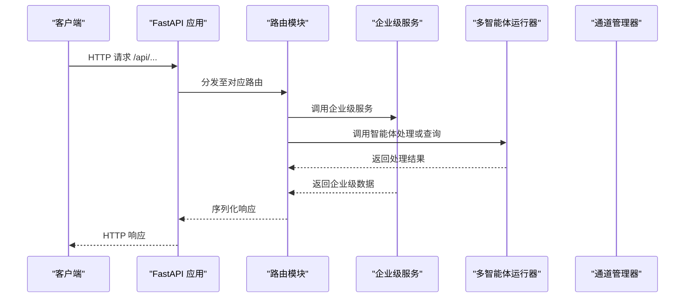
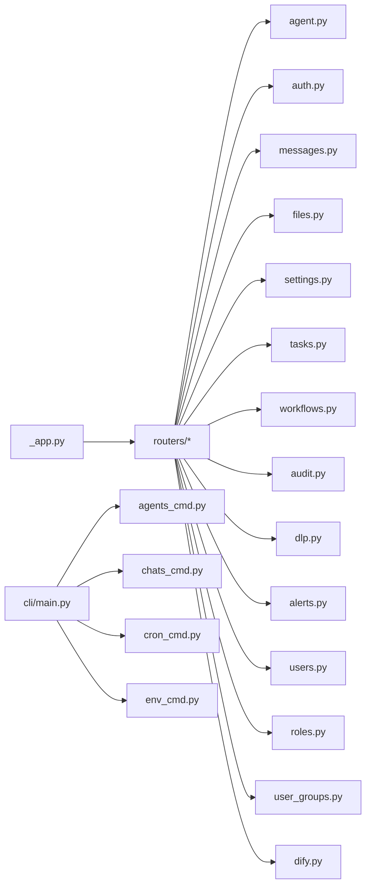

# API 参考

<cite>
**本文引用的文件**
- [API-Reference.md](file://docs/wiki/API-Reference.md)
- [CLI-Commands.md](file://docs/wiki/CLI-Commands.md)
- [_app.py](file://src/copaw/app/_app.py)
- [routers/__init__.py](file://src/copaw/app/routers/__init__.py)
- [routers/agent.py](file://src/copaw/app/routers/agent.py)
- [routers/auth.py](file://src/copaw/app/routers/auth.py)
- [routers/messages.py](file://src/copaw/app/routers/messages.py)
- [routers/files.py](file://src/copaw/app/routers/files.py)
- [routers/settings.py](file://src/copaw/app/routers/settings.py)
- [routers/tasks.py](file://src/copaw/app/routers/tasks.py)
- [routers/workflows.py](file://src/copaw/app/routers/workflows.py)
- [routers/audit.py](file://src/copaw/app/routers/audit.py)
- [routers/dlp.py](file://src/copaw/app/routers/dlp.py)
- [routers/alerts.py](file://src/copaw/app/routers/alerts.py)
- [routers/users.py](file://src/copaw/app/routers/users.py)
- [routers/roles.py](file://src/copaw/app/routers/roles.py)
- [routers/user_groups.py](file://src/copaw/app/routers/user_groups.py)
- [routers/dify.py](file://src/copaw/app/routers/dify.py)
- [main.py](file://src/copaw/cli/main.py)
- [agents_cmd.py](file://src/copaw/cli/agents_cmd.py)
- [chats_cmd.py](file://src/copaw/cli/chats_cmd.py)
- [cron_cmd.py](file://src/copaw/cli/cron_cmd.py)
- [env_cmd.py](file://src/copaw/cli/env_cmd.py)
- [enterprise-users.ts](file://console/src/api/modules/enterprise-users.ts)
- [enterprise-auth.ts](file://console/src/api/modules/enterprise-auth.ts)
- [enterprise-roles.ts](file://console/src/api/modules/enterprise-roles.ts)
- [enterprise-tasks.ts](file://console/src/api/modules/enterprise-tasks.ts)
- [enterprise-workflows.ts](file://console/src/api/modules/enterprise-workflows.ts)
- [enterprise-audit.ts](file://console/src/api/modules/enterprise-audit.ts)
- [enterprise-dlp.ts](file://console/src/api/modules/enterprise-dlp.ts)
- [enterprise-alerts.ts](file://console/src/api/modules/enterprise-alerts.ts)
- [enterprise-groups.ts](file://console/src/api/modules/enterprise-groups.ts)
- [enterprise-dify.ts](file://console/src/api/modules/enterprise-dify.ts)
</cite>

## 更新摘要
**所做更改**
- 新增企业级用户管理API章节，包含用户CRUD、角色分配等功能
- 新增企业级权限管理API章节，包含角色管理、权限分配等功能
- 新增企业级任务管理API章节，包含任务创建、状态变更、评论等功能
- 新增企业级工作流管理API章节，包含工作流定义、执行、查询等功能
- 新增企业级审计日志API章节，包含日志查询、过滤等功能
- 新增企业级DLP数据防泄漏API章节，包含规则管理、事件查询等功能
- 新增企业级告警API章节，包含规则管理、事件查询、测试通知等功能
- 新增企业级用户组API章节，包含组管理、成员管理等功能
- 新增企业级Dify集成API章节，包含连接器管理等功能
- 更新认证与授权章节，增加企业级认证流程说明

## 目录
1. [简介](#简介)
2. [项目结构](#项目结构)
3. [核心组件](#核心组件)
4. [架构总览](#架构总览)
5. [详细组件分析](#详细组件分析)
6. [企业级API](#企业级api)
7. [依赖关系分析](#依赖关系分析)
8. [性能与并发特性](#性能与并发特性)
9. [故障排查指南](#故障排查指南)
10. [结论](#结论)
11. [附录](#附录)

## 简介
本文件为 CoPaw 的公共 API 与 CLI 的完整参考，覆盖以下内容：
- RESTful API：HTTP 方法、URL 模式、请求/响应结构、认证方式、错误码与示例
- WebSocket API：消息格式、事件类型与实时交互模式
- CLI 命令：命令分组、参数、使用示例与最佳实践
- 企业级API：用户管理、权限管理、任务管理、工作流管理、审计日志、DLP、告警、用户组、Dify集成等
- 版本信息、速率限制策略、最佳实践与常见问题排查

## 项目结构
CoPaw 的后端基于 FastAPI 构建，采用模块化路由组织，核心入口负责注册路由、中间件与静态资源；CLI 通过 Click 提供命令行工具，支持应用管理、智能体、聊天、定时任务、环境变量等子命令。

```mermaid
graph TB
subgraph "后端应用"
A["_app.py<br/>应用入口与中间件"]
R["routers/__init__.py<br/>聚合路由"]
M["routers/*<br/>各功能模块路由"]
E["enterprise/*<br/>企业级服务"]
end
subgraph "前端控制台"
C["静态资源与 SPA 路由"]
EU["enterprise-users.ts<br/>用户API"]
EA["enterprise-auth.ts<br/>认证API"]
ER["enterprise-roles.ts<br/>角色API"]
ET["enterprise-tasks.ts<br/>任务API"]
EW["enterprise-workflows.ts<br/>工作流API"]
EAD["enterprise-audit.ts<br/>审计API"]
ED["enterprise-dlp.ts<br/>DLP API"]
EL["enterprise-alerts.ts<br/>告警API"]
EG["enterprise-groups.ts<br/>用户组API"]
EDF["enterprise-dify.ts<br/>Dify API"]
end
subgraph "CLI"
CLI["cli/main.py<br/>命令入口"]
AG["agents_cmd.py"]
CH["chats_cmd.py"]
CR["cron_cmd.py"]
EV["env_cmd.py"]
end
A --> R
R --> M
R --> E
A --> C
EU --> EA --> ER --> ET --> EW --> EAD --> ED --> EL --> EG --> EDF
CLI --> AG
CLI --> CH
CLI --> CR
CLI --> EV
```

**图表来源**
- [_app.py:475-685](file://src/copaw/app/_app.py#L475-L685)
- [routers/__init__.py:1-88](file://src/copaw/app/routers/__init__.py#L1-L88)
- [main.py:95-168](file://src/copaw/cli/main.py#L95-L168)

**章节来源**
- [_app.py:475-685](file://src/copaw/app/_app.py#L475-L685)
- [routers/__init__.py:1-88](file://src/copaw/app/routers/__init__.py#L1-L88)
- [main.py:95-168](file://src/copaw/cli/main.py#L95-L168)

## 核心组件
- 应用入口与中间件
  - 注册 Prometheus 监控、CORS、认证中间件、代理静态资源与 SPA 回退
  - 提供 /api/version 查询版本
- 路由聚合
  - 统一挂载 /api 前缀下的各模块路由（智能体、聊天、技能、提供商、本地模型、定时任务、MCP、文件、安全、Token 统计、控制台状态等）
  - 支持按智能体作用域的路由（/api/agents/{agentId}/...）
  - 企业级路由前缀 /api/enterprise/*
- CLI 命令体系
  - app、init、agents、chats、cron、env、daemon、shutdown、update、uninstall、clean、plugin、auth 等

**章节来源**
- [_app.py:475-685](file://src/copaw/app/_app.py#L475-L685)
- [routers/__init__.py:1-88](file://src/copaw/app/routers/__init__.py#L1-L88)
- [main.py:95-168](file://src/copaw/cli/main.py#L95-L168)

## 架构总览
CoPaw 的 API 以 FastAPI 为核心，结合多智能体运行器与通道系统，提供统一的 REST 与 WebSocket 接口，并通过 CLI 实现运维与自动化任务。



**图表来源**
- [_app.py:475-685](file://src/copaw/app/_app.py#L475-L685)
- [routers/__init__.py:1-88](file://src/copaw/app/routers/__init__.py#L1-L88)

## 详细组件分析

### RESTful API 总览
- 基础信息
  - 基础 URL: http://127.0.0.1:8088/api
  - 认证: 可选 Bearer Token（视部署模式而定）
  - 内容类型: application/json
  - API 版本: v1
- 公共端点
  - GET /api/version：返回当前版本号
  - GET /api/console/status：控制台状态（版本、运行时长、智能体数量、活跃会话数、渠道连接状态）
  - GET /api/console/system：系统信息
- 认证端点
  - POST /api/auth/login：用户名密码登录
  - POST /api/auth/register：首次注册（仅一次）
  - GET /api/auth/status：查询认证是否启用及是否存在用户
  - GET /api/auth/verify：校验 Bearer Token
  - POST /api/auth/update-profile：更新用户名/密码
- 智能体相关
  - GET /api/agents：列出智能体
  - POST /api/agents：创建智能体
  - GET /api/agents/{agent_id}：获取智能体详情
  - PUT /api/agents/{agent_id}：更新智能体
  - DELETE /api/agents/{agent_id}：删除智能体
  - PATCH /api/agents/{agent_id}/status：启用/禁用智能体
  - GET /api/agents/{agent_id}/config：获取智能体配置
  - PUT /api/agents/{agent_id}/config：更新智能体配置
  - GET /api/agents/{agent_id}/status：获取智能体状态
  - GET /api/agents/{agent_id}/memory：列出记忆文件
  - GET /api/agents/{agent_id}/memory/{md_name}：读取记忆文件
  - PUT /api/agents/{agent_id}/memory/{md_name}：写入记忆文件
  - GET /api/agents/{agent_id}/files：列出工作文件
  - GET /api/agents/{agent_id}/files/{md_name}：读取工作文件
  - PUT /api/agents/{agent_id}/files/{md_name}：写入工作文件
  - GET /api/agents/{agent_id}/language：获取智能体语言
  - PUT /api/agents/{agent_id}/language：更新智能体语言
- 聊天与会话
  - POST /api/chat/message：发送消息（支持流式）
  - GET /api/chat/history：获取历史
  - DELETE /api/chat/history：清空历史
  - POST /api/chat/conversation：新建会话
  - GET /api/chats：列出聊天
  - GET /api/chats/{chat_id}：获取聊天详情
  - POST /api/chats：创建聊天
  - PUT /api/chats/{chat_id}：更新聊天名称
  - DELETE /api/chats/{chat_id}：删除聊天
  - POST /api/messages/send：向通道发送文本消息（由智能体主动推送）
- 技能与工作区
  - GET /api/skills/pool：列出技能池技能
  - GET /api/skills/workspace：列出工作区技能
  - POST /api/skills/broadcast：广播技能到工作区
  - POST /api/skills/import：导入技能
  - DELETE /api/skills/pool/{skill_id}：删除技能
  - POST /api/skills/update-builtin：更新内置技能
- 模型与提供商
  - GET /api/providers：列出提供商
  - POST /api/providers/{provider_name}/config：配置提供商
  - POST /api/providers/{provider_name}/test：测试连接
  - GET /api/providers/{provider_name}/models：获取可用模型
- 本地模型
  - GET /api/local-models：列出本地模型
  - POST /api/local-models/download：下载模型
  - DELETE /api/local-models/{model_id}：删除模型
  - POST /api/local-models/{model_id}/start：启动本地模型服务
  - POST /api/local-models/{model_id}/stop：停止本地模型服务
- 定时任务
  - GET /api/cronjob：列出定时任务
  - POST /api/cronjob：创建定时任务
  - PUT /api/cronjob/{job_id}：更新定时任务
  - DELETE /api/cronjob/{job_id}：删除定时任务
  - POST /api/cronjob/{job_id}/trigger：手动触发任务
- 心跳任务
  - GET /api/heartbeat：获取心跳配置
  - PUT /api/heartbeat：更新心跳配置
- 环境变量
  - GET /api/envs：列出环境变量
  - POST /api/envs：设置环境变量
  - DELETE /api/envs/{key}：删除环境变量
- 工作区文件
  - GET /api/workspace/files：列出文件
  - GET /api/workspace/files/content：读取文件内容
  - POST /api/workspace/files/upload：上传文件
  - DELETE /api/workspace/files：删除文件
- MCP 管理
  - GET /api/mcp：列出 MCP 客户端
  - POST /api/mcp：添加 MCP 客户端
  - DELETE /api/mcp/{client_id}：删除 MCP 客户端
  - GET /api/mcp/{client_id}/tools：列出工具
- 安全配置
  - GET /api/security：获取安全配置
  - PUT /api/security：更新安全配置
  - GET /api/security/tool-guard/rules：获取工具守卫规则
  - POST /api/security/tool-guard/rules：添加工具守卫规则
- Token 使用统计
  - GET /api/token-usage/summary：获取统计摘要
  - GET /api/token-usage/details：获取详细记录
- 控制台状态
  - GET /api/console/status：获取控制台状态
  - GET /api/console/system：获取系统信息
- 文件预览
  - GET /api/files/preview/{filepath:path}：预览文件（HEAD/GET）

**章节来源**
- [API-Reference.md:1-795](file://docs/wiki/API-Reference.md#L1-L795)
- [_app.py:594-616](file://src/copaw/app/_app.py#L594-L616)
- [routers/auth.py:1-200](file://src/copaw/app/routers/auth.py#L1-L200)
- [routers/agent.py:1-200](file://src/copaw/app/routers/agent.py#L1-L200)
- [routers/messages.py:1-187](file://src/copaw/app/routers/messages.py#L1-L187)
- [routers/files.py:1-25](file://src/copaw/app/routers/files.py#L1-L25)
- [routers/settings.py:1-59](file://src/copaw/app/routers/settings.py#L1-L59)

### WebSocket API
- 连接地址
  - ws://127.0.0.1:8088/ws
- 订阅与取消订阅
  - 客户端发送订阅消息，指定 agent_id
  - 取消订阅用于停止接收该智能体的消息
- 事件类型
  - subscribe：订阅智能体消息
  - unsubscribe：取消订阅
  - message：新消息
  - typing：AI 正在输入
  - error：错误通知

**章节来源**
- [API-Reference.md:710-740](file://docs/wiki/API-Reference.md#L710-L740)

### 认证与授权
- 认证方式
  - Bearer Token（可选）
  - 登录/注册接口支持用户名密码
- 中间件
  - 单用户模式使用 AuthMiddleware
  - 企业模式使用 EnterpriseAuthMiddleware
- 状态查询
  - /api/auth/status：判断认证是否启用、是否存在用户
  - /api/auth/verify：校验 Token

**章节来源**
- [_app.py:517-524](file://src/copaw/app/_app.py#L517-L524)
- [routers/auth.py:1-200](file://src/copaw/app/routers/auth.py#L1-L200)

### CLI 命令参考
- 基础命令
  - copaw --help / --version
- 应用管理
  - copaw app：启动服务（支持 --port、--host、--log-level、--reload）
  - copaw init：初始化配置（支持 --defaults、--working-dir、--no-telemetry）
- 智能体管理
  - copaw agents list：列出智能体
  - copaw agents chat：与另一智能体通信（支持流式、后台任务、会话复用）
- 聊天管理
  - copaw chats list / get / create / update / delete：管理聊天会话
- 定时任务
  - copaw cron list / get / state / create / delete / pause / resume / run：管理定时任务
- 环境变量
  - copaw env list / set / delete：管理环境变量
- 系统命令
  - copaw daemon start / stop / status：守护进程管理
  - copaw shutdown [--force --timeout]：优雅关闭
  - copaw update [--version --prerelease]：更新
  - copaw uninstall [--purge]：卸载
  - copaw clean [--all --cache --logs --temp]：清理缓存与临时文件
- 插件管理
  - copaw plugin list / install / uninstall / enable / disable：插件生命周期管理
- 认证管理
  - copaw auth login / logout / token：认证相关

**章节来源**
- [CLI-Commands.md:1-942](file://docs/wiki/CLI-Commands.md#L1-L942)
- [main.py:95-168](file://src/copaw/cli/main.py#L95-L168)
- [agents_cmd.py:1-680](file://src/copaw/cli/agents_cmd.py#L1-L680)
- [chats_cmd.py:1-276](file://src/copaw/cli/chats_cmd.py#L1-L276)
- [cron_cmd.py:1-480](file://src/copaw/cli/cron_cmd.py#L1-L480)
- [env_cmd.py:1-99](file://src/copaw/cli/env_cmd.py#L1-L99)

## 企业级API

### 企业级认证API
- 基础URL: /api/enterprise/auth
- 认证端点
  - POST /api/enterprise/auth/login：企业用户登录（支持MFA）
  - POST /api/enterprise/auth/register：企业用户注册
  - POST /api/enterprise/auth/logout：用户登出
  - GET /api/enterprise/auth/me：获取当前用户信息
  - PUT /api/enterprise/auth/password：修改密码
  - POST /api/enterprise/auth/mfa/setup：设置MFA
  - POST /api/enterprise/auth/mfa/verify：验证MFA

**章节来源**
- [enterprise-auth.ts:1-73](file://console/src/api/modules/enterprise-auth.ts#L1-L73)

### 企业级用户管理API
- 基础URL: /api/enterprise/users
- 用户管理端点
  - GET /api/enterprise/users：分页查询用户列表
  - POST /api/enterprise/users：创建用户
  - GET /api/enterprise/users/{user_id}：获取用户详情
  - PUT /api/enterprise/users/{user_id}：更新用户信息
  - DELETE /api/enterprise/users/{user_id}：禁用用户
  - GET /api/enterprise/users/{user_id}/roles：获取用户角色
  - PUT /api/enterprise/users/{user_id}/roles：分配用户角色

**章节来源**
- [enterprise-users.ts:1-85](file://console/src/api/modules/enterprise-users.ts#L1-L85)
- [routers/users.py:1-258](file://src/copaw/app/routers/users.py#L1-L258)

### 企业级权限管理API
- 基础URL: /api/enterprise/roles
- 角色管理端点
  - GET /api/enterprise/roles：查询角色列表
  - POST /api/enterprise/roles：创建角色
  - GET /api/enterprise/roles/{role_id}：获取角色详情
  - PUT /api/enterprise/roles/{role_id}：更新角色
  - DELETE /api/enterprise/roles/{role_id}：删除角色
  - GET /api/enterprise/roles/{role_id}/permissions：获取角色权限
  - PUT /api/enterprise/roles/{role_id}/permissions：设置角色权限
- 权限管理端点
  - GET /api/enterprise/permissions：查询权限列表
  - POST /api/enterprise/permissions：创建权限

**章节来源**
- [enterprise-roles.ts:1-54](file://console/src/api/modules/enterprise-roles.ts#L1-L54)
- [routers/roles.py:1-259](file://src/copaw/app/routers/roles.py#L1-L259)

### 企业级任务管理API
- 基础URL: /api/enterprise/tasks
- 任务管理端点
  - GET /api/enterprise/tasks：分页查询任务列表
  - POST /api/enterprise/tasks：创建任务
  - GET /api/enterprise/tasks/{task_id}：获取任务详情
  - PUT /api/enterprise/tasks/{task_id}：更新任务
  - PUT /api/enterprise/tasks/{task_id}/status：变更任务状态
  - DELETE /api/enterprise/tasks/{task_id}：删除任务
  - GET /api/enterprise/tasks/{task_id}/comments：获取任务评论
  - POST /api/enterprise/tasks/{task_id}/comments：添加任务评论

**章节来源**
- [enterprise-tasks.ts:1-85](file://console/src/api/modules/enterprise-tasks.ts#L1-L85)
- [routers/tasks.py:1-252](file://src/copaw/app/routers/tasks.py#L1-L252)

### 企业级工作流管理API
- 基础URL: /api/enterprise/workflows
- 工作流管理端点
  - GET /api/enterprise/workflows：分页查询工作流列表
  - POST /api/enterprise/workflows：创建工作流
  - GET /api/enterprise/workflows/{workflow_id}：获取工作流详情
  - PUT /api/enterprise/workflows/{workflow_id}：更新工作流
  - DELETE /api/enterprise/workflows/{workflow_id}：删除工作流
  - POST /api/enterprise/workflows/{workflow_id}/execute：执行工作流
  - GET /api/enterprise/workflows/{workflow_id}/executions：查询工作流执行记录

**章节来源**
- [enterprise-workflows.ts:1-97](file://console/src/api/modules/enterprise-workflows.ts#L1-L97)
- [routers/workflows.py:1-210](file://src/copaw/app/routers/workflows.py#L1-L210)

### 企业级审计日志API
- 基础URL: /api/enterprise/audit
- 审计日志端点
  - GET /api/enterprise/audit：查询审计日志（支持多条件过滤）

**章节来源**
- [enterprise-audit.ts:1-43](file://console/src/api/modules/enterprise-audit.ts#L1-L43)
- [routers/audit.py:1-65](file://src/copaw/app/routers/audit.py#L1-L65)

### 企业级DLP数据防泄漏API
- 基础URL: /api/enterprise/dlp
- DLP规则端点
  - GET /api/enterprise/dlp/rules/builtin：获取内置规则
  - GET /api/enterprise/dlp/rules：查询规则列表
  - POST /api/enterprise/dlp/rules：创建规则
  - GET /api/enterprise/dlp/rules/{rule_id}：获取规则详情
  - PUT /api/enterprise/dlp/rules/{rule_id}：更新规则
  - DELETE /api/enterprise/dlp/rules/{rule_id}：删除规则
- DLP事件端点
  - GET /api/enterprise/dlp/events：查询事件列表

**章节来源**
- [enterprise-dlp.ts:1-42](file://console/src/api/modules/enterprise-dlp.ts#L1-L42)
- [routers/dlp.py:1-229](file://src/copaw/app/routers/dlp.py#L1-L229)

### 企业级告警API
- 基础URL: /api/enterprise/alerts
- 告警规则端点
  - GET /api/enterprise/alerts/rules：查询规则列表
  - POST /api/enterprise/alerts/rules：创建规则
  - GET /api/enterprise/alerts/rules/{rule_id}：获取规则详情
  - PUT /api/enterprise/alerts/rules/{rule_id}：更新规则
  - DELETE /api/enterprise/alerts/rules/{rule_id}：删除规则
- 告警事件端点
  - GET /api/enterprise/alerts/events：查询事件列表
- 测试通知端点
  - POST /api/enterprise/alerts/test：发送测试通知

**章节来源**
- [enterprise-alerts.ts:1-47](file://console/src/api/modules/enterprise-alerts.ts#L1-L47)
- [routers/alerts.py:1-196](file://src/copaw/app/routers/alerts.py#L1-L196)

### 企业级用户组API
- 基础URL: /api/enterprise/groups
- 用户组端点
  - GET /api/enterprise/user-groups：查询用户组列表
  - POST /api/enterprise/user-groups：创建用户组
  - GET /api/enterprise/user-groups/{group_id}：获取用户组详情
  - PUT /api/enterprise/user-groups/{group_id}：更新用户组
  - DELETE /api/enterprise/user-groups/{group_id}：删除用户组
  - GET /api/enterprise/user-groups/{group_id}/members：获取用户组成员
  - POST /api/enterprise/user-groups/{group_id}/members：添加用户组成员
  - DELETE /api/enterprise/user-groups/{group_id}/members：移除用户组成员

**章节来源**
- [enterprise-groups.ts:1-63](file://console/src/api/modules/enterprise-groups.ts#L1-L63)
- [routers/user_groups.py:1-214](file://src/copaw/app/routers/user_groups.py#L1-L214)

### 企业级Dify集成API
- 基础URL: /api/enterprise/dify
- Dify连接器端点
  - GET /api/enterprise/dify/connectors：查询连接器列表
  - POST /api/enterprise/dify/connectors：创建连接器
  - PUT /api/enterprise/dify/connectors/{connector_id}：更新连接器
  - DELETE /api/enterprise/dify/connectors/{connector_id}：删除连接器

**章节来源**
- [enterprise-dify.ts:1-39](file://console/src/api/modules/enterprise-dify.ts#L1-L39)
- [routers/dify.py:1-40](file://src/copaw/app/routers/dify.py#L1-L40)

## 依赖关系分析
- 应用层依赖
  - FastAPI 应用注册路由、中间件与静态资源
  - 多智能体运行器根据 X-Agent-Id 动态路由到对应工作空间
  - 通道管理器负责跨渠道消息发送
  - 企业级服务提供用户管理、权限控制、任务调度等核心功能
- 路由层依赖
  - 各模块路由依赖配置加载、工作空间管理、通道注册与工具守卫
  - 企业级路由依赖数据库会话、审计服务、RBAC服务等
- CLI 层依赖
  - 通过 HTTP 客户端调用 /api/* 接口，或直接使用本地存储与环境变量



**图表来源**
- [_app.py:475-685](file://src/copaw/app/_app.py#L475-L685)
- [routers/__init__.py:1-88](file://src/copaw/app/routers/__init__.py#L1-L88)
- [main.py:95-168](file://src/copaw/cli/main.py#L95-L168)

**章节来源**
- [_app.py:475-685](file://src/copaw/app/_app.py#L475-L685)
- [routers/__init__.py:1-88](file://src/copaw/app/routers/__init__.py#L1-L88)
- [main.py:95-168](file://src/copaw/cli/main.py#L95-L168)

## 性能与并发特性
- 流式响应
  - 聊天消息与智能体处理支持流式输出，提升交互体验
- 并发会话
  - 通过唯一会话标识避免并发写入冲突；CLI 提供会话复用与后台任务能力
- 监控与指标
  - Prometheus 监控已集成，提供多租户用量计数器与请求追踪
- 速率限制
  - 仓库未显式声明全局速率限制策略；建议在网关或反向代理层实施
- 企业级并发
  - 企业级API使用数据库事务确保数据一致性
  - 审计服务异步记录操作日志，不影响主业务流程

**章节来源**
- [agents_cmd.py:17-48](file://src/copaw/cli/agents_cmd.py#L17-L48)
- [_app.py:482-511](file://src/copaw/app/_app.py#L482-L511)

## 故障排查指南
- 常见错误码
  - 401 未认证
  - 403 禁止访问
  - 404 资源不存在
  - 400 参数验证失败
  - 409 资源冲突
  - 429 请求过于频繁
  - 500 服务器内部错误
- 认证问题
  - 确认认证是否启用与 Token 是否有效
  - 使用 /api/auth/status 与 /api/auth/verify 检查状态
  - 企业级认证优先检查 /api/enterprise/auth/me
- 通道发送失败
  - 检查目标通道是否已配置与可用
  - 关注 404（通道不存在）与 500（发送异常）
- 文件预览失败
  - 确认路径为绝对路径且文件存在
- 企业级API问题
  - 检查用户权限与角色分配
  - 验证任务状态转换的有效性
  - 确认工作流定义的完整性

**章节来源**
- [API-Reference.md:696-707](file://docs/wiki/API-Reference.md#L696-L707)
- [routers/messages.py:169-186](file://src/copaw/app/routers/messages.py#L169-L186)
- [routers/files.py:18-24](file://src/copaw/app/routers/files.py#L18-L24)

## 结论
本文档提供了 CoPaw 的 REST API、WebSocket、CLI 以及企业级API的完整参考，涵盖认证、路由组织、实时交互、运维命令、企业级功能与排错要点。企业级API包括用户管理、权限控制、任务调度、工作流管理、审计日志、DLP、告警、用户组和Dify集成等完整功能模块。建议在生产环境中结合网关层进行速率限制与 TLS 终止，并通过 CLI 与 API 实现自动化运维与监控。

## 附录
- API 版本
  - v1
- 基础 URL
  - http://127.0.0.1:8088/api
  - http://127.0.0.1:8088/api/enterprise
- WebSocket 地址
  - ws://127.0.0.1:8088/ws
- 认证方式
  - Bearer Token（可选），支持用户名密码登录与注册
  - 企业级支持JWT令牌与MFA认证
- 企业级功能
  - 用户管理：CRUD操作、角色分配、状态管理
  - 权限管理：RBAC模型、权限继承、部门隔离
  - 任务管理：工作流驱动、状态跟踪、评论协作
  - 审计日志：完整操作记录、敏感信息标记
  - DLP：规则引擎、事件检测、自动防护
  - 告警：多渠道通知、阈值监控、测试机制
  - 用户组：组织架构、批量管理、成员协作
  - Dify集成：外部平台连接、工作流同步