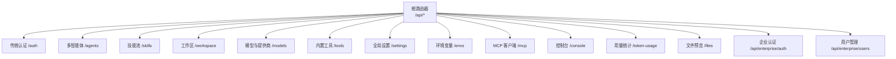
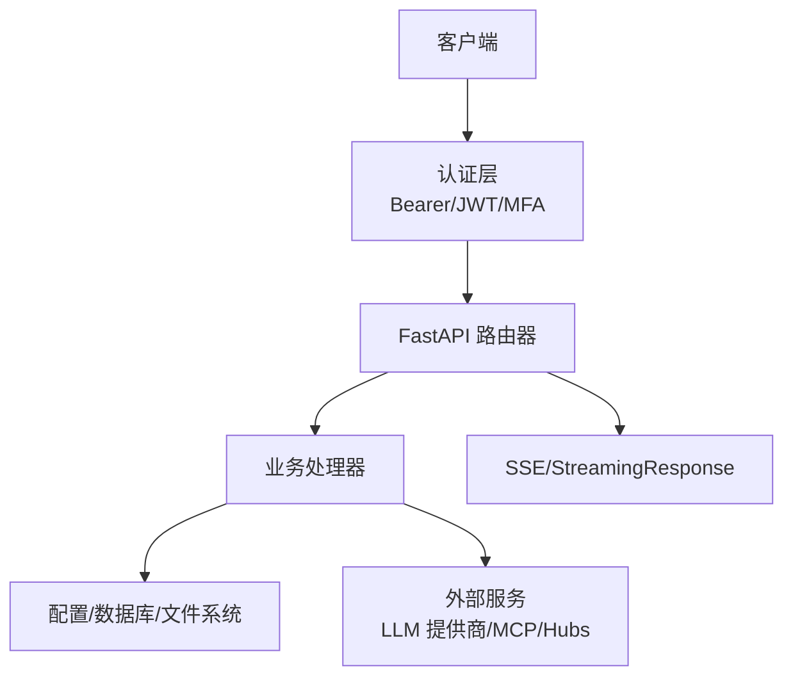
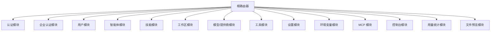
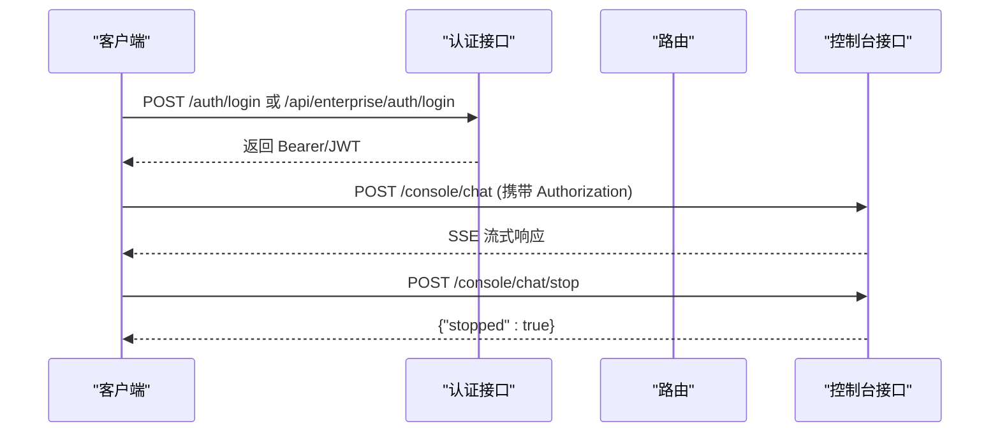

# RESTful API

<cite>
**本文引用的文件**
- [routers/__init__.py](file://src/copaw/app/routers/__init__.py)
- [routers/auth.py](file://src/copaw/app/routers/auth.py)
- [routers/agents.py](file://src/copaw/app/routers/agents.py)
- [routers/skills.py](file://src/copaw/app/routers/skills.py)
- [routers/workspace.py](file://src/copaw/app/routers/workspace.py)
- [routers/providers.py](file://src/copaw/app/routers/providers.py)
- [routers/tools.py](file://src/copaw/app/routers/tools.py)
- [routers/settings.py](file://src/copaw/app/routers/settings.py)
- [routers/envs.py](file://src/copaw/app/routers/envs.py)
- [routers/mcp.py](file://src/copaw/app/routers/mcp.py)
- [routers/console.py](file://src/copaw/app/routers/console.py)
- [routers/token_usage.py](file://src/copaw/app/routers/token_usage.py)
- [routers/files.py](file://src/copaw/app/routers/files.py)
- [routers/enterprise_auth.py](file://src/copaw/app/routers/enterprise_auth.py)
- [routers/users.py](file://src/copaw/app/routers/users.py)
</cite>

## 目录
1. [简介](#简介)
2. [项目结构](#项目结构)
3. [核心组件](#核心组件)
4. [架构总览](#架构总览)
5. [详细组件分析](#详细组件分析)
6. [依赖分析](#依赖分析)
7. [性能考虑](#性能考虑)
8. [故障排查指南](#故障排查指南)
9. [结论](#结论)
10. [附录](#附录)

## 简介
本文件为 CoPaw 的 RESTful API 参考文档，覆盖所有公开路由与企业级扩展接口，包含：
- HTTP 方法、路径模式、请求参数、响应格式与状态码
- 功能说明、使用场景与最佳实践
- 认证机制（Bearer Token、企业版 JWT、MFA）
- 参数校验规则、数据类型与默认值
- 错误处理策略与常见问题解决
- API 版本控制与向后兼容性说明

## 项目结构
CoPaw 使用 FastAPI 组织路由，主入口在根路由器中统一挂载各模块子路由。企业版路由通过独立前缀与中间件进行隔离。

图表来源
- [routers/__init__.py](file://src/copaw/app/routers/__init__.py)

章节来源
- [routers/__init__.py](file://src/copaw/app/routers/__init__.py)

## 核心组件
- 根路由器：统一挂载所有模块路由，支持传统认证与企业版扩展。
- 认证模块：支持传统用户名密码与企业版 JWT（含 MFA），并提供令牌校验与更新资料接口。
- 多智能体模块：提供智能体生命周期管理、工作区文件读写、内存文件列表等。
- 技能模块：提供技能导入、上传、池化、Hub 安装与并发任务状态查询。
- 工作区模块：提供工作区打包下载与 ZIP 合并上传。
- 模型与提供商：提供提供商配置、模型发现、连接测试、活动模型切换。
- 内置工具：提供工具启用/禁用与异步执行开关。
- 全局设置与环境变量：提供 UI 语言与环境变量批量管理。
- MCP 客户端：提供 MCP 客户端配置、工具枚举与启停。
- 控制台：提供聊天流式输出、停止运行、媒体上传与推送消息。
- 用量统计：按日期/模型/提供商聚合 token 使用情况。
- 文件预览：安全地预览服务器上任意文件。

章节来源
- [routers/__init__.py](file://src/copaw/app/routers/__init__.py)
- [routers/auth.py](file://src/copaw/app/routers/auth.py)
- [routers/enterprise_auth.py](file://src/copaw/app/routers/enterprise_auth.py)

## 架构总览
下图展示 API 调用链路与关键中间件：

图表来源
- [routers/auth.py](file://src/copaw/app/routers/auth.py)
- [routers/enterprise_auth.py](file://src/copaw/app/routers/enterprise_auth.py)
- [routers/console.py](file://src/copaw/app/routers/console.py)

## 详细组件分析

### 认证与会话（/auth 与 /api/enterprise/auth）
- 传统认证（/auth）
  - 登录 POST /auth/login：用户名+密码换取 Bearer Token；未启用时返回空 token。
  - 注册 POST /auth/register：仅允许一次注册，需开启认证环境变量；成功返回 token。
  - 状态 GET /auth/status：检查认证是否启用、是否存在用户；企业版优先检测数据库。
  - 校验 GET /auth/verify：校验 Bearer Token 是否有效。
  - 更新资料 POST /auth/update-profile：当前密码校验后可改用户名或密码。
- 企业版认证（/api/enterprise/auth）
  - 登录 POST /api/enterprise/auth/login：支持 MFA，登录成功返回 JWT 与刷新令牌。
  - 注册 POST /api/enterprise/auth/register：管理员或首用户引导注册。
  - 登出 POST /api/enterprise/auth/logout：撤销当前会话。
  - 当前用户 GET /api/enterprise/auth/me：从令牌载荷返回用户信息。
  - 修改密码 PUT /api/enterprise/auth/password：当前密码校验后修改。
  - MFA 设置 POST /api/enterprise/auth/mfa/setup：生成密钥与二维码链接。
  - MFA 验证 POST /api/enterprise/auth/mfa/verify：绑定 MFA。

请求头
- Authorization: Bearer <token>（传统与企业版通用）
- Content-Type: application/json

状态码
- 200 成功；201 创建；400 参数错误；401 未认证/令牌无效；403 禁止；404 未找到；409 冲突；428 缺少 MFA；500 服务器错误；502/503 外部服务异常

章节来源
- [routers/auth.py](file://src/copaw/app/routers/auth.py)
- [routers/enterprise_auth.py](file://src/copaw/app/routers/enterprise_auth.py)

### 多智能体管理（/agents）
- 列表 GET /agents：返回已配置智能体摘要列表。
- 重排 PUT /agents/order：持久化智能体顺序（全量替换）。
- 获取 GET /agents/{agentId}：返回指定智能体完整配置。
- 创建 POST /agents：自动生成短 ID，初始化工作区与内置技能。
- 更新 PUT /agents/{agentId}：部分字段更新并触发热重载。
- 删除 DELETE /agents/{agentId}：删除智能体与工作区（默认智能体不可删）。
- 启停 PATCH /agents/{agentId}/toggle：启用/禁用智能体（默认不可禁用）。
- 工作区文件列表 GET /agents/{agentId}/files：列出工作区 Markdown 文件。
- 读取 GET /agents/{agentId}/files/{filename}：读取工作区 Markdown 文件内容。
- 写入 PUT /agents/{agentId}/files/{filename}：创建/更新工作区 Markdown 文件。
- 内存文件列表 GET /agents/{agentId}/memory：列出智能体内存 Markdown 文件。

参数与校验
- agentId 必填且存在；默认智能体“default”不可删除/禁用。
- 工作区文件读写基于工作目录，自动处理编码与大小限制。

章节来源
- [routers/agents.py](file://src/copaw/app/routers/agents.py)

### 技能与技能池（/skills）
- 列表 GET /skills：返回当前工作区技能清单。
- 强制刷新 POST /skills/refresh：重新对齐清单并返回最新结果。
- Hub 搜索 GET /skills/hub/search：搜索技能 Hub。
- 工作区技能源 GET /skills/workspaces：返回各工作区技能概览。
- 开始从 Hub 安装 POST /skills/hub/install/start：返回安装任务 ID。
- 查询安装状态 GET /skills/hub/install/status/{task_id}：返回任务状态。
- 取消安装 POST /skills/hub/install/cancel/{task_id}：取消安装任务。
- 池化技能列表 GET /skills/pool：返回共享技能池清单。
- 刷新池 POST /skills/pool/refresh：强制对齐池清单。
- 池内置来源 GET /skills/pool/builtin-sources：返回内置候选清单。
- 创建技能 POST /skills：创建工作区技能（可选择启用与覆盖冲突）。
- ZIP 上传 POST /skills/upload：上传 ZIP 并导入（支持重命名映射）。
- 池化技能创建 POST /skills/pool/create：创建共享技能。
- 池化保存 PUT /skills/pool/save：编辑或另存为共享技能。
- ZIP 池上传 POST /skills/pool/upload-zip：上传 ZIP 到池。

并发与安全
- Hub 安装采用异步任务队列，支持取消与扫描安全告警。
- 导入/上传前进行 ZIP 结构与路径合法性校验。

章节来源
- [routers/skills.py](file://src/copaw/app/routers/skills.py)

### 工作区（/workspace）
- 下载 GET /workspace/download：将工作区打包为 ZIP 流式返回。
- 上传 POST /workspace/upload：上传 ZIP 并合并到工作区（不清理非 zip 内容）。

安全
- 上传文件类型限制为 zip；校验路径穿越风险；解压合并到目标目录。

章节来源
- [routers/workspace.py](file://src/copaw/app/routers/workspace.py)

### 模型与提供商（/models）
- 列表 GET /models：返回所有提供商信息。
- 配置 PUT /models/{provider_id}/config：更新提供商 API Key/Base URL/协议类/生成参数。
- 创建自定义提供商 POST /models/custom-providers：新增自定义提供商。
- 连接测试 POST /models/{provider_id}/test：测试连接。
- 发现模型 POST /models/{provider_id}/discover：拉取可用模型列表。
- 测试模型 POST /models/{provider_id}/models/test：测试特定模型连通性。
- 删除自定义提供商 DELETE /models/custom-providers/{provider_id}：移除自定义提供商。
- 添加模型 POST /models/{provider_id}/models：为提供商添加模型。
- 多模态探测 POST /models/{provider_id}/models/{model_id:path}/probe-multimodal：探测图像/视频支持。
- 移除模型 DELETE /models/{provider_id}/models/{model_id:path}：移除模型。
- 配置模型参数 PUT /models/{provider_id}/models/{model_id:path}/config：覆盖提供商级生成参数。
- 获取活动模型 GET /models/active：按作用域（全局/代理/有效）返回当前活跃模型。
- 设置活动模型 PUT /models/active：设置全局或代理的活跃模型并触发热重载。

章节来源
- [routers/providers.py](file://src/copaw/app/routers/providers.py)

### 内置工具（/tools）
- 列表 GET /tools：返回当前代理的内置工具清单及启用状态。
- 启停 PATCH /tools/{tool_name}/toggle：切换工具启用状态。
- 异步执行 PATCH /tools/{tool_name}/async-execution：设置工具异步执行。

章节来源
- [routers/tools.py](file://src/copaw/app/routers/tools.py)

### 全局设置（/settings）
- 获取语言 GET /settings/language：返回 UI 语言。
- 更新语言 PUT /settings/language：设置 UI 语言（en/zh/ja/ru）。

章节来源
- [routers/settings.py](file://src/copaw/app/routers/settings.py)

### 环境变量（/envs）
- 列表 GET /envs：返回所有环境变量。
- 批量保存 PUT /envs：全量替换环境变量（未提供的键将被移除）。
- 删除 DELETE /envs/{key}：删除单个环境变量。

章节来源
- [routers/envs.py](file://src/copaw/app/routers/envs.py)

### MCP 客户端（/mcp）
- 列表 GET /mcp：返回所有 MCP 客户端（敏感值掩码显示）。
- 获取 GET /mcp/{client_key}：返回指定客户端详情。
- 创建 POST /mcp：创建新客户端并触发热重载。
- 更新 PUT /mcp/{client_key}：更新客户端（支持恢复掩码值）。
- 启停 PATCH /mcp/{client_key}/toggle：切换启用状态。
- 删除 DELETE /mcp/{client_key}：删除客户端。
- 工具枚举 GET /mcp/{client_key}/tools：查询远端 MCP 服务器可用工具（连接中/失败/未就绪返回相应状态码）。

章节来源
- [routers/mcp.py](file://src/copaw/app/routers/mcp.py)

### 控制台（/console）
- 聊天 POST /console/chat：SSE 流式聊天；支持断线重连 reconnect=true。
- 停止聊天 POST /console/chat/stop：停止指定聊天任务。
- 上传 POST /console/upload：上传媒体文件至控制台通道目录。
- 推送消息 GET /console/push-messages：获取最近推送消息（可按会话过滤）。

章节来源
- [routers/console.py](file://src/copaw/app/routers/console.py)

### 用量统计（/token-usage）
- 获取汇总 GET /token-usage：按日期/模型/提供商聚合 token 使用量，支持起止日期与过滤。

章节来源
- [routers/token_usage.py](file://src/copaw/app/routers/token_usage.py)

### 文件预览（/files）
- 预览 GET /files/preview/{filepath:path}：安全预览文件（绝对/相对路径均解析为绝对路径，仅允许文件）。

章节来源
- [routers/files.py](file://src/copaw/app/routers/files.py)

### 用户管理（/api/enterprise/users）
- 列表 GET /api/enterprise/users：分页查询用户（支持搜索、状态、部门过滤）。
- 创建 POST /api/enterprise/users：注册用户并记录审计日志。
- 获取 GET /api/enterprise/users/{user_id}：返回用户详情。
- 更新 PUT /api/enterprise/users/{user_id}：更新邮箱/显示名/部门/状态并记录审计。
- 删除 DELETE /api/enterprise/users/{user_id}：软删除（标记为 disabled）。
- 角色列表 GET /api/enterprise/users/{user_id}/roles：返回用户角色。
- 分配角色 PUT /api/enterprise/users/{user_id}/roles：先清空再分配角色并记录审计。

章节来源
- [routers/users.py](file://src/copaw/app/routers/users.py)

## 依赖分析
- 路由组织：根路由器集中 include 各模块路由，形成清晰的命名空间隔离。
- 中间件：企业版路由依赖当前用户中间件，确保鉴权与审计。
- 数据访问：用户管理与企业认证依赖 PostgreSQL 会话；用量统计依赖 token 使用管理器；文件预览依赖本地文件系统。
- 外部集成：模型提供商管理器负责与外部 LLM 服务交互；MCP 客户端管理器负责与 MCP 服务器通信；技能 Hub 导入涉及 ZIP 解析与安全扫描。

图表来源
- [routers/__init__.py](file://src/copaw/app/routers/__init__.py)
- [routers/enterprise_auth.py](file://src/copaw/app/routers/enterprise_auth.py)
- [routers/users.py](file://src/copaw/app/routers/users.py)

## 性能考虑
- SSE 流式响应：控制台聊天使用事件流，避免阻塞；建议客户端及时断开以释放资源。
- 异步任务：技能 Hub 安装采用后台任务，避免阻塞请求；支持取消与回滚。
- 热重载：配置变更后触发异步重载，保证接口可用性。
- ZIP 操作：工作区上传与技能导入采用临时目录与原子替换，降低锁竞争。
- 多模态探测：按需探测，避免频繁调用外部服务。

## 故障排查指南
- 认证相关
  - 401 未认证：检查 Authorization 头是否为 Bearer Token；企业版需确认 JWT 未过期。
  - 403 禁止：传统认证未启用或用户不存在；企业版可能需要 MFA。
  - 428 缺少 MFA：登录时若用户启用 MFA，需提供验证码。
- 智能体相关
  - 404 未找到：agentId 不存在或默认智能体被保护。
  - 500 服务器错误：配置保存或启动失败，检查工作区权限与磁盘空间。
- 技能相关
  - 422 安全扫描失败：技能包包含高危规则，需调整或拒绝导入。
  - 409 冲突：技能名称冲突，按建议重命名。
- 工作区相关
  - 400 参数错误：上传文件类型不符或 ZIP 结构非法。
  - 404 未找到：工作区目录不存在。
- 模型/提供商
  - 404 提供商/模型不存在：请先创建/发现提供商与模型。
  - 502/503 外部服务异常：检查网络与凭据。
- 控制台
  - 503 控制台通道未找到：服务未初始化。
  - 400 参数错误：请求体不符合 AgentRequest 格式。
- 用量统计
  - 400 参数错误：日期格式不正确或起止日期颠倒。

章节来源
- [routers/auth.py](file://src/copaw/app/routers/auth.py)
- [routers/enterprise_auth.py](file://src/copaw/app/routers/enterprise_auth.py)
- [routers/agents.py](file://src/copaw/app/routers/agents.py)
- [routers/skills.py](file://src/copaw/app/routers/skills.py)
- [routers/workspace.py](file://src/copaw/app/routers/workspace.py)
- [routers/providers.py](file://src/copaw/app/routers/providers.py)
- [routers/console.py](file://src/copaw/app/routers/console.py)
- [routers/token_usage.py](file://src/copaw/app/routers/token_usage.py)

## 结论
CoPaw 的 RESTful API 以模块化路由组织，覆盖智能体、技能、工作区、模型、工具、MCP、控制台与企业级用户与认证等核心能力。通过明确的认证策略（Bearer 与企业 JWT）、严格的参数校验与安全扫描、以及异步任务与热重载机制，提供了稳定、可扩展的接口体系。建议在生产环境中结合 MFA、审计日志与限流策略，确保安全性与可观测性。

## 附录

### API 调用序列示例（登录与聊天）

图表来源
- [routers/auth.py](file://src/copaw/app/routers/auth.py)
- [routers/enterprise_auth.py](file://src/copaw/app/routers/enterprise_auth.py)
- [routers/console.py](file://src/copaw/app/routers/console.py)

### 参数校验与默认值要点
- 字符串字段：通常去除前后空白；必填字段缺失将返回 400。
- 数组/对象：未提供时按模块默认行为处理（如空数组/空对象）。
- 日期范围：用量统计接口支持 ISO 日期字符串，非法将被忽略或报错。
- ZIP 上传：最大 100MB（技能）与 10MB（控制台），类型限制严格。

### 错误响应结构
- 通用结构：包含人类可读的 detail 字段与可选上下文（如扫描结果、建议名称）。
- 安全扫描：返回 type、skill_name、max_severity、findings 等字段，便于前端展示。