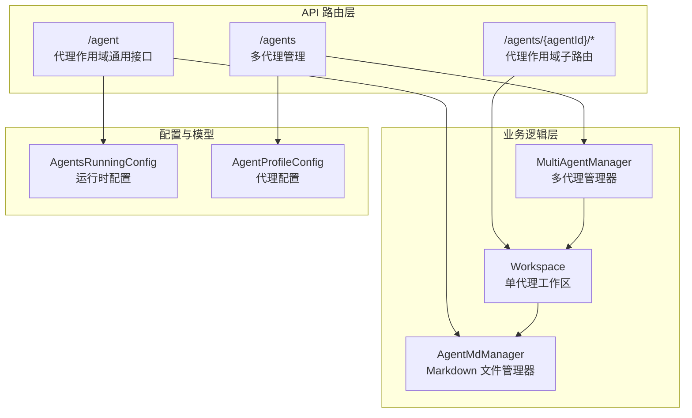
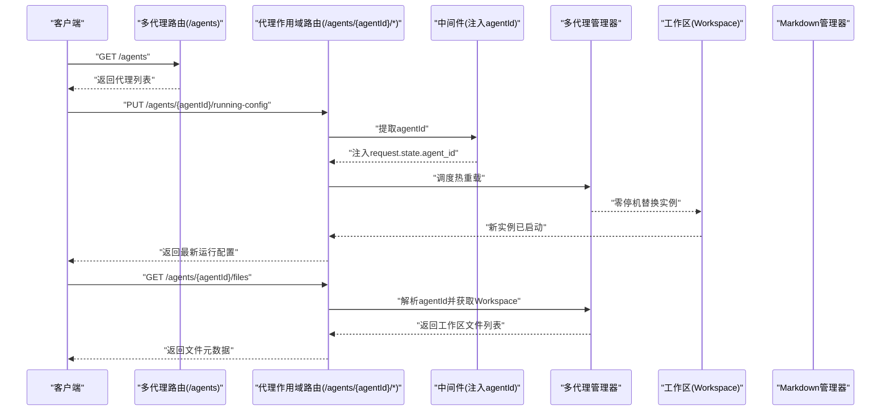
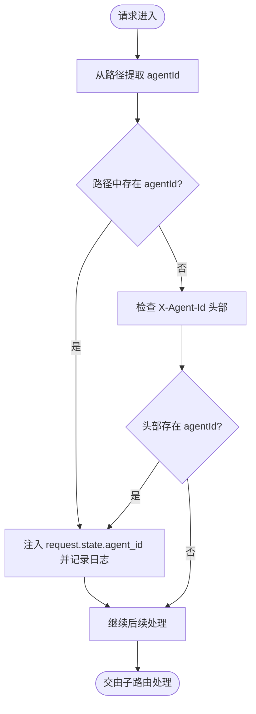
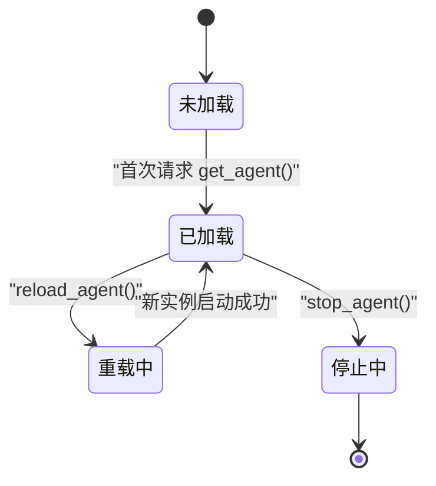
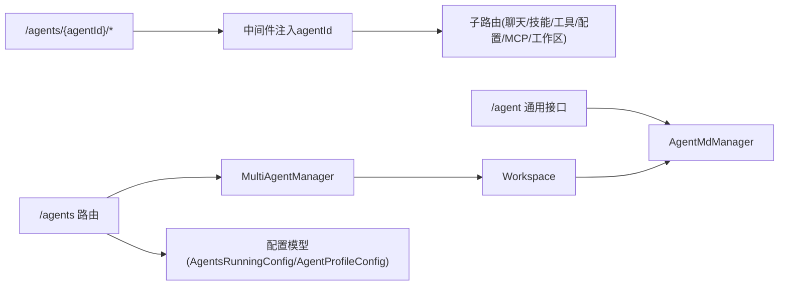

# 代理管理 API

<cite>
**本文引用的文件**
- [agent.py](file://src/copaw/app/routers/agent.py)
- [agents.py](file://src/copaw/app/routers/agents.py)
- [agent_scoped.py](file://src/copaw/app/routers/agent_scoped.py)
- [config.py](file://src/copaw/config/config.py)
- [multi_agent_manager.py](file://src/copaw/app/multi_agent_manager.py)
- [agent_md_manager.py](file://src/copaw/agents/memory/agent_md_manager.py)
- [workspace.py](file://src/copaw/app/workspace/workspace.py)
- [API-Reference.md](file://docs/wiki/API-Reference.md)
- [multi-agent.en.md](file://website/public/docs/multi-agent.en.md)
- [runner.py](file://src/copaw/app/runner/runner.py)
- [exceptions.py](file://src/copaw/exceptions.py)
</cite>

## 目录
1. [简介](#简介)
2. [项目结构](#项目结构)
3. [核心组件](#核心组件)
4. [架构总览](#架构总览)
5. [详细组件分析](#详细组件分析)
6. [依赖分析](#依赖分析)
7. [性能考虑](#性能考虑)
8. [故障排除指南](#故障排除指南)
9. [结论](#结论)
10. [附录](#附录)

## 简介
本文件为 CoPaw 代理管理 API 的权威参考文档，覆盖多代理实例的创建、查询、更新、删除等 CRUD 操作，以及代理配置参数、技能绑定、内存与工作区文件管理、代理作用域路由设计与使用、代理生命周期管理（含热重载）、代理间通信与协作、性能监控与调试接口、错误处理与故障排除等内容。读者可据此完成从“代理初始化”到“配置更新”再到“状态查询”的完整生命周期实践。

## 项目结构
CoPaw 的代理管理 API 主要由以下模块构成：
- 多代理管理路由：提供全局代理 CRUD 与排序、启用/禁用、工作区文件读写等能力
- 代理作用域路由：通过中间件注入 agentId，使下游子路由（聊天、技能、工具、配置、MCP、工作区等）按代理隔离执行
- 配置模型：定义运行时配置 AgentsRunningConfig、系统提示文件列表、语言与音频处理策略等
- 工作区与多代理管理器：负责代理实例的懒加载、零停机热重载、任务跟踪与资源回收
- Markdown 文件管理器：统一管理代理工作区与记忆区的 Markdown 文件读写

图表来源
- [agents.py:36-726](file://src/copaw/app/routers/agents.py#L36-L726)
- [agent.py:19-505](file://src/copaw/app/routers/agent.py#L19-L505)
- [agent_scoped.py:53-92](file://src/copaw/app/routers/agent_scoped.py#L53-L92)
- [multi_agent_manager.py:21-470](file://src/copaw/app/multi_agent_manager.py#L21-L470)
- [workspace.py:50-392](file://src/copaw/app/workspace/workspace.py#L50-L392)
- [agent_md_manager.py:10-126](file://src/copaw/agents/memory/agent_md_manager.py#L10-L126)
- [config.py:497-756](file://src/copaw/config/config.py#L497-L756)

章节来源
- [agents.py:36-726](file://src/copaw/app/routers/agents.py#L36-L726)
- [agent.py:19-505](file://src/copaw/app/routers/agent.py#L19-L505)
- [agent_scoped.py:53-92](file://src/copaw/app/routers/agent_scoped.py#L53-L92)
- [config.py:497-756](file://src/copaw/config/config.py#L497-L756)

## 核心组件
- 多代理管理路由（/agents）
  - 列表、创建、更新、删除、启用/禁用、排序、工作区文件读写、记忆区文件读写等
- 代理作用域路由（/agents/{agentId}/*）
  - 通过中间件注入 agentId，使聊天、技能、工具、配置、MCP、工作区等子路由按代理隔离
- 配置模型
  - AgentsRunningConfig：推理迭代次数、重试策略、并发限制、速率限制、上下文压缩与记忆摘要等
  - AgentProfileConfig：代理名称、描述、语言、系统提示文件列表、运行时配置等
- 工作区与多代理管理器
  - Workspace：封装 Runner、ChannelManager、MemoryManager、MCPClientManager、CronManager 等组件
  - MultiAgentManager：懒加载、零停机热重载、任务跟踪与后台清理
- Markdown 文件管理器
  - 统一管理工作区与记忆区的 Markdown 文件列表、读取、写入

章节来源
- [agents.py:152-726](file://src/copaw/app/routers/agents.py#L152-L726)
- [agent_scoped.py:15-92](file://src/copaw/app/routers/agent_scoped.py#L15-L92)
- [config.py:497-756](file://src/copaw/config/config.py#L497-L756)
- [workspace.py:50-392](file://src/copaw/app/workspace/workspace.py#L50-L392)
- [agent_md_manager.py:10-126](file://src/copaw/agents/memory/agent_md_manager.py#L10-L126)

## 架构总览
下图展示了代理管理 API 的整体交互流程：客户端通过多代理路由进行全局操作；通过代理作用域路由访问具体代理的子功能；中间件注入 agentId 实现上下文隔离；多代理管理器负责实例化与热重载；工作区聚合各子系统；配置模型贯穿运行期行为控制。

图表来源
- [agents.py:200-438](file://src/copaw/app/routers/agents.py#L200-L438)
- [agent_scoped.py:15-51](file://src/copaw/app/routers/agent_scoped.py#L15-L51)
- [multi_agent_manager.py:38-319](file://src/copaw/app/multi_agent_manager.py#L38-L319)
- [agent_md_manager.py:21-126](file://src/copaw/agents/memory/agent_md_manager.py#L21-L126)

## 详细组件分析

### 多代理管理 API（/agents）
- 列出所有代理
  - 方法与路径：GET /agents
  - 返回：代理简要信息列表（含 id、name、description、workspace_dir、enabled）
- 保存代理顺序
  - 方法与路径：PUT /agents/order
  - 请求体：包含 agent_ids 的数组
  - 行为：持久化配置中已配置代理的完整顺序
- 获取指定代理详情
  - 方法与路径：GET /agents/{agentId}
  - 返回：完整的 AgentProfileConfig
- 创建新代理
  - 方法与路径：POST /agents
  - 请求体：CreateAgentRequest（name、description、workspace_dir、language、skill_names）
  - 行为：自动生成短 ID，初始化工作区与内置技能，写入配置
- 更新代理配置
  - 方法与路径：PUT /agents/{agentId}
  - 请求体：AgentProfileConfig（支持部分字段更新）
  - 行为：合并更新后保存，触发热重载
- 删除代理
  - 方法与路径：DELETE /agents/{agentId}
  - 行为：停止实例、移除配置、不可删除默认代理
- 启用/禁用代理
  - 方法与路径：PATCH /agents/{agentId}/toggle
  - 请求体：enabled（布尔）
  - 行为：切换 enabled 状态；禁用时停止实例；启用时尝试启动
- 代理工作区文件读写
  - 列表：GET /agents/{agentId}/files
  - 读取：GET /agents/{agentId}/files/{filename}
  - 写入：PUT /agents/{agentId}/files/{filename}
- 代理记忆区文件读写
  - 列表：GET /agents/{agentId}/memory
  - 读取：GET /agents/{agentId}/memory/{filename}

章节来源
- [agents.py:152-726](file://src/copaw/app/routers/agents.py#L152-L726)

### 代理作用域通用 API（/agent）
- 工作区 Markdown 文件管理
  - 列表：GET /agent/files
  - 读取：GET /agent/files/{md_name}
  - 写入：PUT /agent/files/{md_name}
- 记忆区 Markdown 文件管理
  - 列表：GET /agent/memory
  - 读取：GET /agent/memory/{md_name}
  - 写入：PUT /agent/memory/{md_name}
- 代理语言设置与切换
  - 读取：GET /agent/language
  - 更新：PUT /agent/language（支持 zh/en/ru）
- 音频模式与转录提供者
  - 读取音频模式：GET /agent/audio-mode
  - 更新音频模式：PUT /agent/audio-mode（auto/native）
  - 读取转录提供者类型：GET /agent/transcription-provider-type
  - 设置转录提供者类型：PUT /agent/transcription-provider-type（disabled/whisper_api/local_whisper）
  - 本地 Whisper 可用性检查：GET /agent/local-whisper-status
  - 列举可用转录提供者：GET /agent/transcription-providers
  - 设置转录提供者：PUT /agent/transcription-provider（provider_id 或空字符串清空）
- 运行时配置与系统提示文件
  - 读取运行配置：GET /agent/running-config
  - 更新运行配置：PUT /agent/running-config（触发热重载）
  - 读取系统提示文件列表：GET /agent/system-prompt-files
  - 更新系统提示文件列表：PUT /agent/system-prompt-files（触发热重载）

章节来源
- [agent.py:38-505](file://src/copaw/app/routers/agent.py#L38-L505)

### 代理作用域路由设计与使用
- 设计目标
  - 通过中间件优先从路径提取 agentId，其次从请求头 X-Agent-Id 提取，注入 request.state.agent_id，供下游 API 使用
  - 将聊天、技能、工具、配置、MCP、工作区等子路由挂载到 /agents/{agentId}/ 下，实现按代理隔离
- 使用方法
  - 在调用子路由时，确保路径包含 {agentId} 或设置 X-Agent-Id 头部
  - 适用于聊天、定时任务、通道配置、MCP 客户端、技能与工具管理、工作区文件与记忆区文件等

图表来源
- [agent_scoped.py:15-51](file://src/copaw/app/routers/agent_scoped.py#L15-L51)

章节来源
- [agent_scoped.py:53-92](file://src/copaw/app/routers/agent_scoped.py#L53-L92)

### 配置模型与参数说明
- AgentsRunningConfig（运行时配置）
  - 关键字段：max_iters、llm_retry_enabled、llm_max_retries、llm_backoff_base、llm_backoff_cap、llm_max_concurrent、llm_max_qpm、llm_rate_limit_pause、llm_rate_limit_jitter、llm_acquire_timeout、max_input_length、history_max_length、context_compact、tool_result_compact、memory_summary、embedding_config、memory_manager_backend
  - 语义：控制 ReAct 推理迭代上限、LLM 重试与退避、并发与速率限制、上下文压缩与记忆摘要、嵌入模型与搜索策略、记忆管理后端等
- AgentProfileConfig（代理配置）
  - 关键字段：id、name、description、workspace_dir、channels、mcp、heartbeat、last_dispatch、running（AgentsRunningConfig）、llm_routing、active_model、language、system_prompt_files、tools、security
  - 语义：代理身份标识、显示名、描述、工作区路径、通道与心跳配置、运行时行为、语言与系统提示文件、工具与安全策略等

章节来源
- [config.py:497-756](file://src/copaw/config/config.py#L497-L756)

### 工作区与多代理管理器
- Workspace
  - 聚合组件：Runner、ChannelManager、MemoryManager、MCPClientManager、CronManager
  - 生命周期：start()/stop()，支持可复用组件在热重载时保留
- MultiAgentManager
  - 功能：懒加载、零停机热重载、任务跟踪、后台清理、批量启动
  - 热重载流程：创建新实例 → 原子替换 → 优雅停止旧实例（有无活动任务分别处理）

图表来源
- [multi_agent_manager.py:38-319](file://src/copaw/app/multi_agent_manager.py#L38-L319)
- [workspace.py:325-382](file://src/copaw/app/workspace/workspace.py#L325-L382)

章节来源
- [workspace.py:50-392](file://src/copaw/app/workspace/workspace.py#L50-L392)
- [multi_agent_manager.py:21-470](file://src/copaw/app/multi_agent_manager.py#L21-L470)

### Markdown 文件管理
- AgentMdManager
  - 工作区文件：list_working_mds/read_working_md/write_working_md
  - 记忆区文件：list_memory_mds/read_memory_md/write_memory_md
  - 自动补全 .md 后缀、UTF-8 写入、时间戳与大小元数据

章节来源
- [agent_md_manager.py:10-126](file://src/copaw/agents/memory/agent_md_manager.py#L10-L126)

### 代理间通信与协作
- 协作基础
  - 通过列出可用代理、读取代理描述与 PROFILE.md，明确彼此能力与职责
  - 使用清晰的描述信息（用户填写 + 自动生成），提升跨代理编排效果
- API 支持
  - 全局代理列表与详情：/agents、/agents/{agentId}
  - 子路由支持 X-Agent-Id 头部：/api/chats/*、/api/cron/*、/api/config/*、/api/skills/*、/api/tools/*、/api/mcp/*、/api/agent/*
- 文档参考
  - 多代理协作与 REST API 使用说明

章节来源
- [agents.py:152-244](file://src/copaw/app/routers/agents.py#L152-L244)
- [multi-agent.en.md:591-628](file://website/public/docs/multi-agent.en.md#L591-L628)

### 性能监控与调试接口
- 监控指标暴露
  - Prometheus 指标端点：/metrics（需按部署配置保护访问）
  - 包含请求计数、租户标签、技能调用次数等自定义指标
- 调试信息
  - 查询异常时生成调试转储文件，便于定位问题
  - 代理运行时异常转换与增强（附加会话 ID、渠道名等上下文）

章节来源
- [API-Reference.md:710-761](file://docs/wiki/API-Reference.md#L710-L761)
- [runner.py:544-577](file://src/copaw/app/runner/runner.py#L544-L577)
- [exceptions.py:44-136](file://src/copaw/exceptions.py#L44-L136)

## 依赖分析
- 路由层依赖
  - /agents 依赖 MultiAgentManager 获取/启动/停止/重载 Workspace
  - /agent 依赖 AgentMdManager 读写工作区/记忆区 Markdown 文件
  - 代理作用域路由依赖中间件注入 agentId，向下传递至各子路由
- 配置与模型
  - AgentsRunningConfig 与 AgentProfileConfig 作为运行期与存储期的核心数据结构
- 异常与调试
  - 统一异常体系与调试转储，保障可观测性与可维护性

图表来源
- [agents.py:36-726](file://src/copaw/app/routers/agents.py#L36-L726)
- [agent_scoped.py:53-92](file://src/copaw/app/routers/agent_scoped.py#L53-L92)
- [agent.py:19-505](file://src/copaw/app/routers/agent.py#L19-L505)
- [multi_agent_manager.py:21-470](file://src/copaw/app/multi_agent_manager.py#L21-L470)
- [workspace.py:50-392](file://src/copaw/app/workspace/workspace.py#L50-L392)
- [agent_md_manager.py:10-126](file://src/copaw/agents/memory/agent_md_manager.py#L10-L126)
- [config.py:497-756](file://src/copaw/config/config.py#L497-L756)

## 性能考虑
- 零停机热重载
  - 新实例先行启动，原子替换旧实例，后台异步清理旧实例，避免服务中断
- 并发与限流
  - LLM 并发与 QPM 限制、指数退避与抖动，防止突发流量导致 429
- 上下文压缩与记忆摘要
  - 可配置的记忆压缩阈值与保留比例，减少上下文长度，提升响应效率
- 任务跟踪
  - MultiAgentManager 的 TaskTracker 与延迟清理，确保长连接/流式任务不被中断

章节来源
- [multi_agent_manager.py:208-319](file://src/copaw/app/multi_agent_manager.py#L208-L319)
- [config.py:595-650](file://src/copaw/config/config.py#L595-L650)

## 故障排除指南
- 常见错误码
  - 401 未认证、403 无权限、404 资源不存在、400 参数验证失败、409 资源冲突、429 请求过于频繁、500 服务器内部错误
- 代理启停与热重载
  - 启用失败：检查配置与依赖组件启动日志；必要时回滚或修复配置
  - 热重载失败：新实例启动失败会自动回退，旧实例继续服务；查看日志定位原因
- 调试与诊断
  - 查询异常时生成调试转储文件，附加详细上下文；根据异常类型与附加字段快速定位
  - 使用 /metrics 观察指标变化，结合日志排查性能瓶颈

章节来源
- [API-Reference.md:696-707](file://docs/wiki/API-Reference.md#L696-L707)
- [runner.py:544-577](file://src/copaw/app/runner/runner.py#L544-L577)
- [exceptions.py:44-136](file://src/copaw/exceptions.py#L44-L136)

## 结论
本文档系统梳理了 CoPaw 代理管理 API 的接口规范、配置模型、作用域路由设计、生命周期管理与协作机制，并提供了性能与故障排除建议。基于此，用户可完成从“代理初始化”到“配置更新”再到“状态查询”的完整实践，同时借助热重载与可观测性工具保障生产环境的稳定性与可维护性。

## 附录
- 代理生命周期管理示例（步骤）
  - 初始化：POST /agents 创建代理，系统自动生成短 ID 并初始化工作区与内置技能
  - 配置更新：PUT /agents/{agentId} 更新 AgentProfileConfig，随后 PUT /agent/running-config 更新运行配置并触发热重载
  - 状态查询：GET /agents/{agentId} 获取代理详情；GET /agents/{agentId}/files 与 /agents/{agentId}/memory 获取文件列表
  - 启用/禁用：PATCH /agents/{agentId}/toggle 控制实例启停
  - 删除：DELETE /agents/{agentId} 停止并移除代理（默认代理不可删除）
- 代理间通信与协作要点
  - 明确代理描述与 PROFILE.md，便于跨代理编排
  - 使用 X-Agent-Id 头部或路径参数确保请求落到正确代理上下文
  - 通过 /agents 与 /agents/{agentId}/* 的 REST API 完成跨代理协作编排

章节来源
- [agents.py:247-438](file://src/copaw/app/routers/agents.py#L247-L438)
- [agent_scoped.py:53-92](file://src/copaw/app/routers/agent_scoped.py#L53-L92)
- [multi-agent.en.md:367-417](file://website/public/docs/multi-agent.en.md#L367-L417)