# 企业管理 API

<cite>
**本文引用的文件**
- [src/copaw/enterprise/rbac_service.py](file://src/copaw/enterprise/rbac_service.py)
- [src/copaw/enterprise/audit_service.py](file://src/copaw/enterprise/audit_service.py)
- [src/copaw/enterprise/alert_service.py](file://src/copaw/enterprise/alert_service.py)
- [src/copaw/enterprise/dlp_service.py](file://src/copaw/enterprise/dlp_service.py)
- [src/copaw/enterprise/auth_service.py](file://src/copaw/enterprise/auth_service.py)
- [src/copaw/enterprise/workflow_service.py](file://src/copaw/enterprise/workflow_service.py)
- [src/copaw/enterprise/task_service.py](file://src/copaw/enterprise/task_service.py)
- [src/copaw/enterprise/sso_client.py](file://src/copaw/enterprise/sso_client.py)
- [src/copaw/enterprise/middleware.py](file://src/copaw/enterprise/middleware.py)
- [src/copaw/app/routers/roles.py](file://src/copaw/app/routers/roles.py)
- [src/copaw/app/routers/users.py](file://src/copaw/app/routers/users.py)
- [src/copaw/app/routers/departments.py](file://src/copaw/app/routers/departments.py)
- [src/copaw/app/routers/tasks.py](file://src/copaw/app/routers/tasks.py)
- [src/copaw/app/routers/workflows.py](file://src/copaw/app/routers/workflows.py)
- [src/copaw/app/routers/audit.py](file://src/copaw/app/routers/audit.py)
</cite>

## 目录
1. [简介](#简介)
2. [项目结构](#项目结构)
3. [核心组件](#核心组件)
4. [架构总览](#架构总览)
5. [详细组件分析](#详细组件分析)
6. [依赖分析](#依赖分析)
7. [性能考虑](#性能考虑)
8. [故障排查指南](#故障排查指南)
9. [结论](#结论)
10. [附录](#附录)

## 简介
本文件为企业级“CoPaw”系统的管理 API 参考文档，覆盖 RBAC 用户与权限、组织架构（部门）、审计日志、安全告警、DLP 数据防泄漏、单点登录（SSO）、工作流与任务调度、以及企业配置与策略管理等能力。文档以“前端调用—后端路由—服务层—数据库”的分层视角，系统化梳理各模块职责、数据模型与交互流程，并提供可视化图示帮助理解。

## 项目结构
- 后端采用 FastAPI + SQLAlchemy 异步 ORM，企业能力集中在 enterprise 子包中，业务路由位于 app/routers 下。
- 企业功能按领域拆分：认证鉴权（auth_service）、RBAC（rbac_service）、审计（audit_service）、告警（alert_service）、DLP（dlp_service）、工作流（workflow_service）、任务（task_service）、SSO（sso_client）、中间件（middleware）。
- 路由层负责请求参数校验、鉴权依赖注入、调用服务层并返回标准化响应。

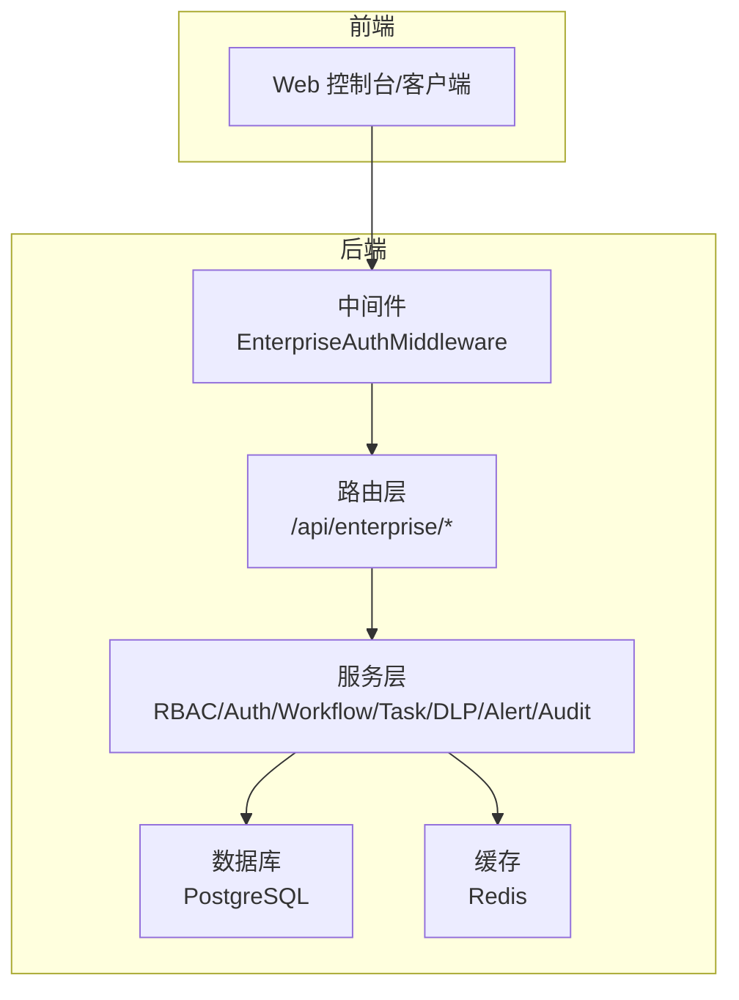

图表来源
- [src/copaw/enterprise/middleware.py:57-144](file://src/copaw/enterprise/middleware.py#L57-L144)
- [src/copaw/app/routers/roles.py:26-259](file://src/copaw/app/routers/roles.py#L26-L259)
- [src/copaw/app/routers/users.py:29-258](file://src/copaw/app/routers/users.py#L29-L258)
- [src/copaw/app/routers/departments.py:23-185](file://src/copaw/app/routers/departments.py#L23-L185)
- [src/copaw/app/routers/tasks.py:24-252](file://src/copaw/app/routers/tasks.py#L24-L252)
- [src/copaw/app/routers/workflows.py:23-210](file://src/copaw/app/routers/workflows.py#L23-L210)
- [src/copaw/app/routers/audit.py:18-65](file://src/copaw/app/routers/audit.py#L18-L65)

章节来源
- [src/copaw/enterprise/middleware.py:57-144](file://src/copaw/enterprise/middleware.py#L57-L144)
- [src/copaw/app/routers/roles.py:26-259](file://src/copaw/app/routers/roles.py#L26-L259)
- [src/copaw/app/routers/users.py:29-258](file://src/copaw/app/routers/users.py#L29-L258)
- [src/copaw/app/routers/departments.py:23-185](file://src/copaw/app/routers/departments.py#L23-L185)
- [src/copaw/app/routers/tasks.py:24-252](file://src/copaw/app/routers/tasks.py#L24-L252)
- [src/copaw/app/routers/workflows.py:23-210](file://src/copaw/app/routers/workflows.py#L23-L210)
- [src/copaw/app/routers/audit.py:18-65](file://src/copaw/app/routers/audit.py#L18-L65)

## 核心组件
- 认证与会话（AuthService）
  - 支持注册、登录、登出、密码变更、MFA、JWT 颁发与校验、刷新令牌、会话撤销。
- RBAC 权限（RBACService）
  - 角色/权限 CRUD、用户角色分配、权限检查（含层级角色遍历与 Redis 缓存）。
- 审计日志（AuditService）
  - 结构化审计写入与查询，支持多维过滤与敏感标记。
- 安全告警（AlertService）
  - 登录异常检测、权限变更告警、多通道通知（企业微信、钉钉、邮件）。
- DLP 数据防泄漏（DLPService）
  - 内置规则（身份证、手机号、银行卡、邮箱、公网 IP、密钥类）与自定义规则，支持屏蔽、告警、阻断。
- 工作流（WorkflowService）
  - 工作流定义、状态管理、执行启动与完成。
- 任务（TaskService）
  - 任务生命周期、状态机、评论。
- 组织架构（部门树）
  - 递归部门树查询、成员列表。
- 中间件（EnterpriseAuthMiddleware）
  - JWT 校验、公共路径放行、DLP 响应扫描与事件记录。
- SSO（sso_client）
  - OIDC 提供商注册与动态客户端创建。

章节来源
- [src/copaw/enterprise/auth_service.py:107-367](file://src/copaw/enterprise/auth_service.py#L107-L367)
- [src/copaw/enterprise/rbac_service.py:30-262](file://src/copaw/enterprise/rbac_service.py#L30-L262)
- [src/copaw/enterprise/audit_service.py:51-135](file://src/copaw/enterprise/audit_service.py#L51-L135)
- [src/copaw/enterprise/alert_service.py:101-217](file://src/copaw/enterprise/alert_service.py#L101-L217)
- [src/copaw/enterprise/dlp_service.py:114-231](file://src/copaw/enterprise/dlp_service.py#L114-L231)
- [src/copaw/enterprise/workflow_service.py:20-146](file://src/copaw/enterprise/workflow_service.py#L20-L146)
- [src/copaw/enterprise/task_service.py:25-131](file://src/copaw/enterprise/task_service.py#L25-L131)
- [src/copaw/enterprise/middleware.py:57-144](file://src/copaw/enterprise/middleware.py#L57-L144)
- [src/copaw/enterprise/sso_client.py:42-45](file://src/copaw/enterprise/sso_client.py#L42-L45)

## 架构总览
下图展示企业 API 的端到端调用链路：前端通过受保护路由访问，中间件进行 JWT 校验与 DLP 扫描，路由层调用对应服务层，服务层持久化至数据库并可写入审计与告警。

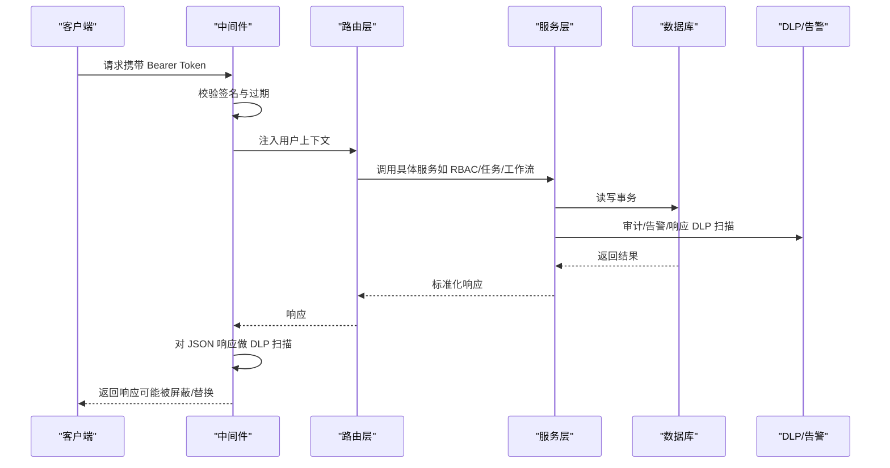

图表来源
- [src/copaw/enterprise/middleware.py:69-144](file://src/copaw/enterprise/middleware.py#L69-L144)
- [src/copaw/app/routers/roles.py:91-122](file://src/copaw/app/routers/roles.py#L91-L122)
- [src/copaw/app/routers/tasks.py:95-125](file://src/copaw/app/routers/tasks.py#L95-L125)
- [src/copaw/app/routers/workflows.py:90-117](file://src/copaw/app/routers/workflows.py#L90-L117)
- [src/copaw/enterprise/audit_service.py:54-87](file://src/copaw/enterprise/audit_service.py#L54-L87)
- [src/copaw/enterprise/alert_service.py:104-162](file://src/copaw/enterprise/alert_service.py#L104-L162)
- [src/copaw/enterprise/dlp_service.py:210-231](file://src/copaw/enterprise/dlp_service.py#L210-L231)

## 详细组件分析

### RBAC 用户与权限管理
- 能力概览
  - 角色创建/更新/删除、层级限制（最多 5 层）、父子继承。
  - 权限创建与批量赋权、用户角色分配/回收。
  - 权限检查支持资源通配符与全局通配符，Redis 缓存提升命中性能。
- 关键接口（路由）
  - 角色：GET/POST/PUT/DELETE /api/enterprise/roles；GET /api/enterprise/roles/{id}/permissions；PUT /api/enterprise/roles/{id}/permissions
  - 权限：GET /api/enterprise/permissions；POST /api/enterprise/permissions
  - 用户角色：GET /api/enterprise/users/{user_id}/roles；PUT /api/enterprise/users/{user_id}/roles
- 审计动作
  - ROLE_CREATE/ROLE_UPDATE/ROLE_DELETE/ROLE_ASSIGN/PERMISSION_ASSIGN

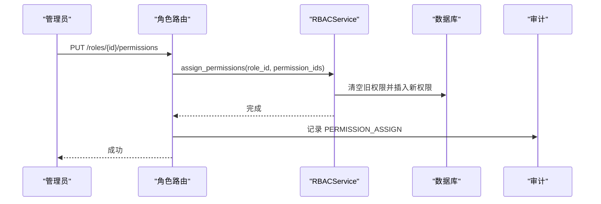

图表来源
- [src/copaw/app/routers/roles.py:213-234](file://src/copaw/app/routers/roles.py#L213-L234)
- [src/copaw/enterprise/rbac_service.py:162-184](file://src/copaw/enterprise/rbac_service.py#L162-L184)
- [src/copaw/enterprise/audit_service.py:54-87](file://src/copaw/enterprise/audit_service.py#L54-L87)

章节来源
- [src/copaw/enterprise/rbac_service.py:35-124](file://src/copaw/enterprise/rbac_service.py#L35-L124)
- [src/copaw/app/routers/roles.py:76-259](file://src/copaw/app/routers/roles.py#L76-L259)

### 用户管理
- 能力概览
  - 用户列表、创建、查询、更新、软删除（禁用）。
  - 支持按用户名/邮箱模糊搜索、状态过滤、部门过滤。
  - 密码注册时使用 bcrypt 哈希。
- 关键接口
  - GET/POST/GET/PUT/DELETE /api/enterprise/users
  - GET/PUT /api/enterprise/users/{user_id}/roles

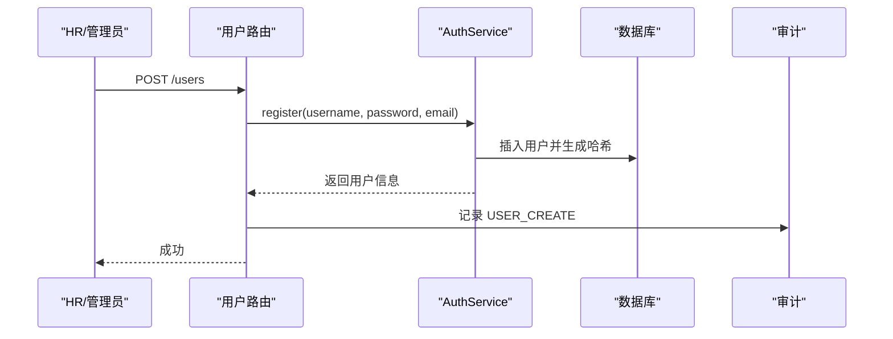

图表来源
- [src/copaw/app/routers/users.py:107-137](file://src/copaw/app/routers/users.py#L107-L137)
- [src/copaw/enterprise/auth_service.py:112-148](file://src/copaw/enterprise/auth_service.py#L112-L148)
- [src/copaw/enterprise/audit_service.py:24-49](file://src/copaw/enterprise/audit_service.py#L24-L49)

章节来源
- [src/copaw/app/routers/users.py:68-258](file://src/copaw/app/routers/users.py#L68-L258)
- [src/copaw/enterprise/auth_service.py:112-148](file://src/copaw/enterprise/auth_service.py#L112-L148)

### 组织架构（部门树）
- 能力概览
  - 递归查询部门树、列出子部门、创建/更新/删除部门、查询部门成员。
  - 支持设置父部门、负责人、描述与层级。
- 关键接口
  - GET /api/enterprise/departments/tree
  - GET/POST/PUT/DELETE /api/enterprise/departments
  - GET /api/enterprise/departments/{id}/members

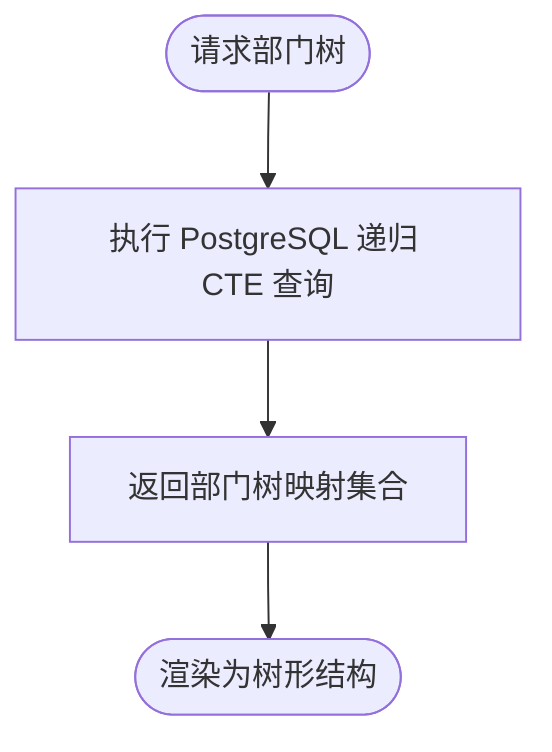

图表来源
- [src/copaw/app/routers/departments.py:56-78](file://src/copaw/app/routers/departments.py#L56-L78)

章节来源
- [src/copaw/app/routers/departments.py:54-185](file://src/copaw/app/routers/departments.py#L54-L185)

### 审计日志
- 能力概览
  - 写入结构化审计条目（操作类型、资源类型、结果、客户端信息、敏感标记等）。
  - 查询接口支持多维过滤、分页与总数统计。
- 关键接口
  - GET /api/enterprise/audit

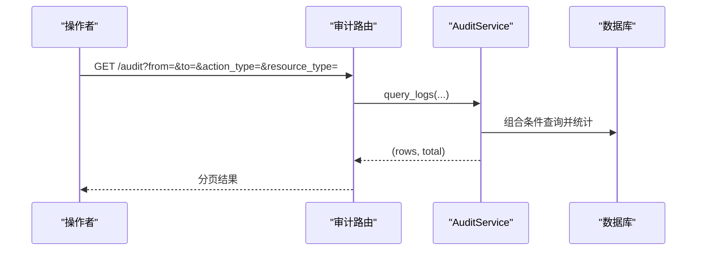

图表来源
- [src/copaw/app/routers/audit.py:21-65](file://src/copaw/app/routers/audit.py#L21-L65)
- [src/copaw/enterprise/audit_service.py:90-135](file://src/copaw/enterprise/audit_service.py#L90-L135)

章节来源
- [src/copaw/enterprise/audit_service.py:51-135](file://src/copaw/enterprise/audit_service.py#L51-L135)
- [src/copaw/app/routers/audit.py:18-65](file://src/copaw/app/routers/audit.py#L18-L65)

### 安全告警
- 能力概览
  - 登录失败阈值检测（Redis 计数+冷却），触发后持久化事件并多渠道通知。
  - 权限变更告警（角色分配/回收管理员角色）。
  - 通知渠道：企业微信、钉钉 Webhook、SMTP 邮件。
- 关键接口
  - 登录异常检测在中间件响应阶段触发（见中间件章节）。
  - 权限变更告警在权限路由中触发。

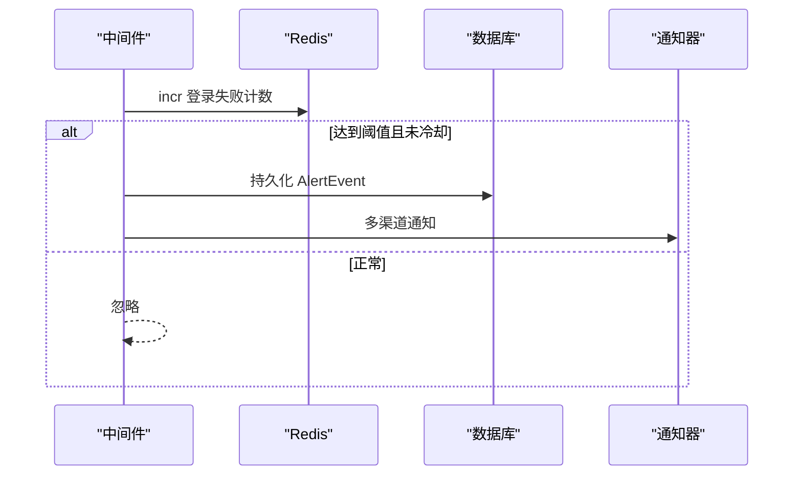

图表来源
- [src/copaw/enterprise/alert_service.py:104-162](file://src/copaw/enterprise/alert_service.py#L104-L162)
- [src/copaw/enterprise/middleware.py:107-142](file://src/copaw/enterprise/middleware.py#L107-L142)

章节来源
- [src/copaw/enterprise/alert_service.py:101-217](file://src/copaw/enterprise/alert_service.py#L101-L217)

### DLP 数据防泄漏
- 能力概览
  - 内置规则（中国身份证、手机号、银行卡、邮箱、公网 IP、密钥类）。
  - 自定义规则从数据库加载并编译正则。
  - 支持屏蔽、告警、阻断三种动作；响应体扫描与事件记录。
- 关键接口
  - 中间件对 JSON 响应进行 DLP 扫描，必要时替换或阻断。

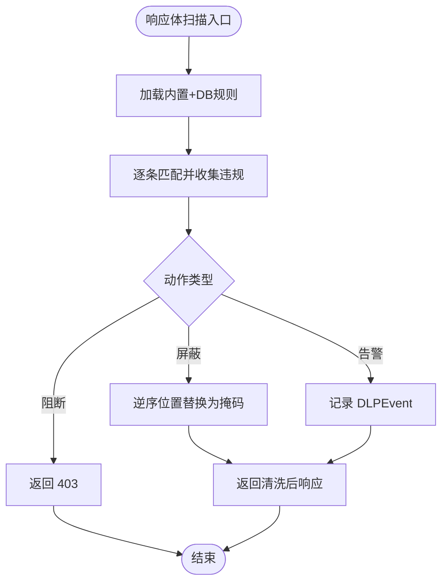

图表来源
- [src/copaw/enterprise/dlp_service.py:114-170](file://src/copaw/enterprise/dlp_service.py#L114-L170)
- [src/copaw/enterprise/middleware.py:107-142](file://src/copaw/enterprise/middleware.py#L107-L142)

章节来源
- [src/copaw/enterprise/dlp_service.py:114-231](file://src/copaw/enterprise/dlp_service.py#L114-L231)
- [src/copaw/enterprise/middleware.py:107-142](file://src/copaw/enterprise/middleware.py#L107-L142)

### 工作流管理
- 能力概览
  - 工作流定义（名称、分类、描述、定义、版本、状态、创建者）。
  - 执行启动与完成（记录输入输出、错误信息、状态）。
  - 支持分类：dify、dify_chatflow、dify_agent、internal。
- 关键接口
  - GET/POST/PUT/DELETE /api/enterprise/workflows
  - POST /api/enterprise/workflows/{id}/execute
  - GET /api/enterprise/workflows/{id}/executions

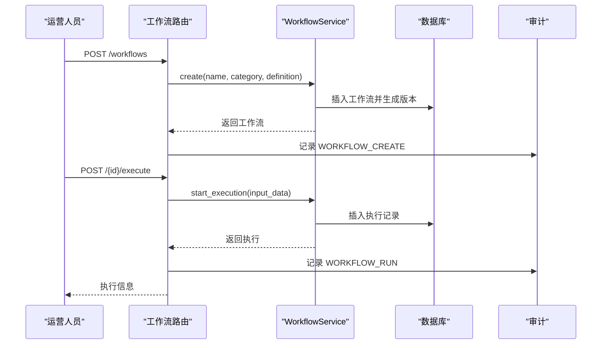

图表来源
- [src/copaw/app/routers/workflows.py:90-185](file://src/copaw/app/routers/workflows.py#L90-L185)
- [src/copaw/enterprise/workflow_service.py:22-129](file://src/copaw/enterprise/workflow_service.py#L22-L129)
- [src/copaw/enterprise/audit_service.py:44-46](file://src/copaw/enterprise/audit_service.py#L44-L46)

章节来源
- [src/copaw/enterprise/workflow_service.py:20-146](file://src/copaw/enterprise/workflow_service.py#L20-L146)
- [src/copaw/app/routers/workflows.py:23-210](file://src/copaw/app/routers/workflows.py#L23-L210)

### 任务调度
- 能力概览
  - 任务生命周期：创建、更新、删除、状态变更、评论。
  - 状态机：pending → in_progress → completed/blocked/cancelled。
  - 支持指派、部门、优先级、截止日期、父任务、工作流关联。
- 关键接口
  - GET/POST/GET/PUT/DELETE /api/enterprise/tasks
  - PUT /api/enterprise/tasks/{id}/status
  - GET/POST /api/enterprise/tasks/{id}/comments

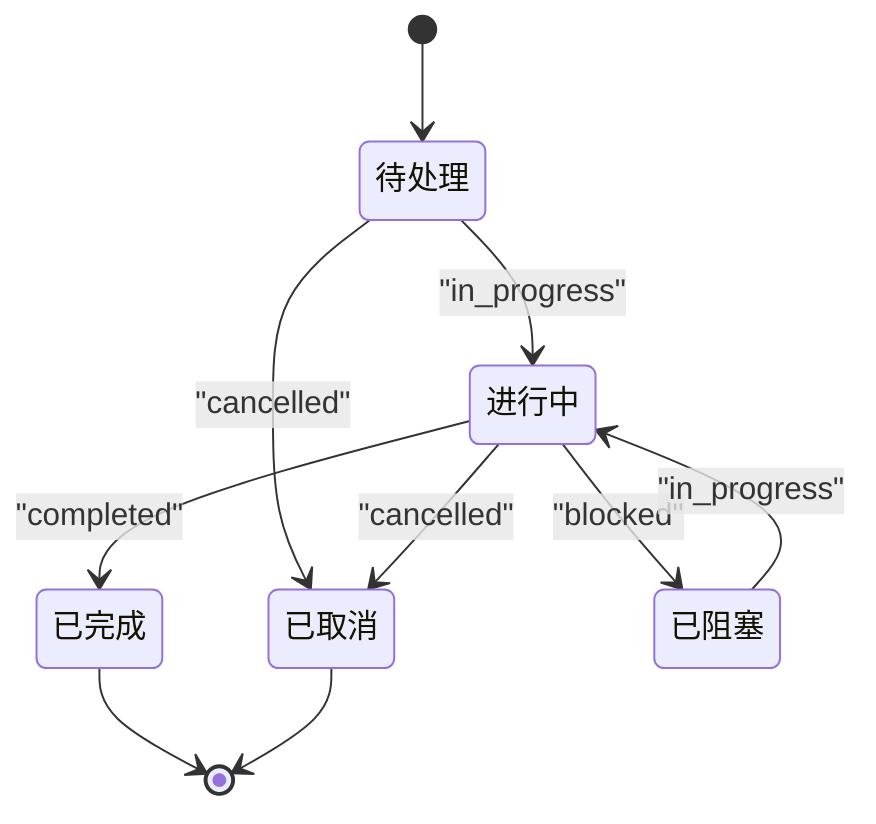

图表来源
- [src/copaw/enterprise/task_service.py:16-22](file://src/copaw/enterprise/task_service.py#L16-L22)

章节来源
- [src/copaw/enterprise/task_service.py:25-131](file://src/copaw/enterprise/task_service.py#L25-L131)
- [src/copaw/app/routers/tasks.py:24-252](file://src/copaw/app/routers/tasks.py#L24-L252)

### 单点登录（SSO）
- 能力概览
  - 使用 Authlib 注册 OIDC 提供商，支持开发环境的 mock 提供商。
  - 提供动态客户端创建与获取。
- 关键接口
  - 动态获取 SSO 客户端实例（用于后续授权跳转与回调）

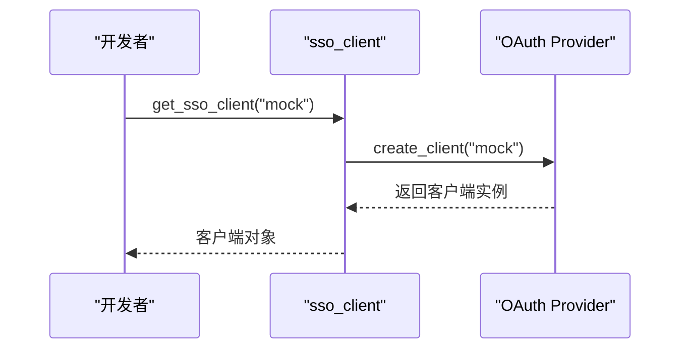

图表来源
- [src/copaw/enterprise/sso_client.py:42-45](file://src/copaw/enterprise/sso_client.py#L42-L45)

章节来源
- [src/copaw/enterprise/sso_client.py:17-45](file://src/copaw/enterprise/sso_client.py#L17-L45)

### 中间件与鉴权
- 能力概览
  - JWT Bearer 校验、注入用户上下文、公开路径放行、OPTIONS 预检放行。
  - 对受保护的 JSON 响应进行 DLP 扫描，必要时替换或阻断。
- 关键依赖
  - get_current_user：FastAPI 依赖注入当前用户信息。
  - require_role：基于角色的路由保护。

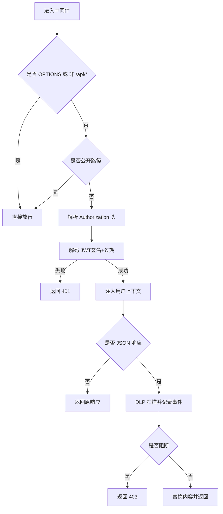

图表来源
- [src/copaw/enterprise/middleware.py:69-144](file://src/copaw/enterprise/middleware.py#L69-L144)

章节来源
- [src/copaw/enterprise/middleware.py:57-191](file://src/copaw/enterprise/middleware.py#L57-L191)

## 依赖分析
- 组件耦合
  - 路由层仅负责参数校验与调用服务层，保持高内聚低耦合。
  - 服务层依赖 SQLAlchemy 异步会话与可选 Redis 管理器，便于扩展缓存与异步任务。
  - 中间件与服务层通过依赖注入共享数据库会话，避免重复连接。
- 外部依赖
  - Redis：权限缓存、DLP 登录失败计数与冷却。
  - PostgreSQL：企业数据持久化（用户、角色、权限、审计、DLP 事件、工作流、任务等）。
  - Authlib：SSO OIDC 客户端。
  - HTTP 客户端：企业微信、钉钉 Webhook。
  - SMTP：邮件告警。

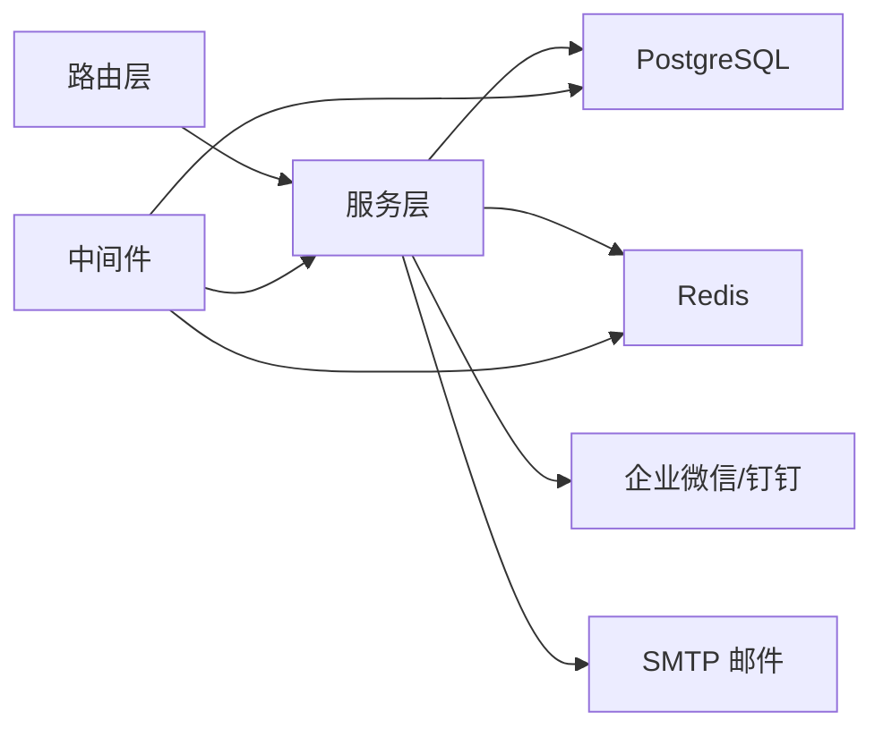

图表来源
- [src/copaw/enterprise/middleware.py:22-28](file://src/copaw/enterprise/middleware.py#L22-L28)
- [src/copaw/enterprise/alert_service.py:31-39](file://src/copaw/enterprise/alert_service.py#L31-L39)

章节来源
- [src/copaw/enterprise/middleware.py:22-28](file://src/copaw/enterprise/middleware.py#L22-L28)
- [src/copaw/enterprise/alert_service.py:31-39](file://src/copaw/enterprise/alert_service.py#L31-L39)

## 性能考虑
- Redis 缓存
  - RBAC 权限缓存 TTL 默认 300 秒，降低频繁权限检查的数据库压力。
  - DLP 登录失败计数与冷却键使用短 TTL，避免内存膨胀。
- 数据库优化
  - 审计查询支持多维过滤与总数统计，建议在高频字段建立索引。
  - 部门树查询使用递归 CTE，注意在大数据量场景下的性能评估。
- I/O 优化
  - 中间件对响应体扫描为同步过程，建议在高并发场景下评估对延迟的影响，必要时引入异步批处理。

## 故障排查指南
- 认证失败
  - 检查 Authorization 头是否为 Bearer Token，确认签名算法与密钥一致。
  - 若提示“无效或已过期”，确认系统时间与时区配置。
- 会话被撤销
  - 登出或修改密码会撤销历史会话，需重新登录获取新 Token。
- 权限不足
  - 使用 require_role 依赖确保具备所需角色；检查用户角色与权限分配。
- DLP 阻断
  - 中间件对 JSON 响应进行扫描，若命中阻断规则将返回 403；检查规则与内容。
- 告警未触发
  - 确认阈值配置与冷却键；检查企业微信/钉钉 Webhook 与 SMTP 配置。

章节来源
- [src/copaw/enterprise/middleware.py:86-95](file://src/copaw/enterprise/middleware.py#L86-L95)
- [src/copaw/enterprise/alert_service.py:134-162](file://src/copaw/enterprise/alert_service.py#L134-L162)
- [src/copaw/enterprise/dlp_service.py:210-231](file://src/copaw/enterprise/dlp_service.py#L210-L231)

## 结论
本参考文档系统性地梳理了 CoPaw 企业级管理 API 的核心能力与实现方式，涵盖 RBAC、用户与组织、审计、安全告警、DLP、工作流与任务、SSO 等模块。通过中间件统一鉴权与响应扫描，结合服务层与数据库的清晰职责划分，形成稳定、可扩展的企业管理能力基座。建议在生产环境中完善 Redis 缓存策略、数据库索引与监控告警，持续优化性能与安全性。

## 附录
- 公共路径（无需认证）
  - /api/enterprise/auth/login、/api/enterprise/auth/register、/api/auth/login、/api/auth/register、/api/auth/status、/api/version、/api/settings/language、/docs、/redoc、/openapi.json
  - /assets/、/logo.png、/copaw-symbol.svg
- 角色保护
  - require_role 工厂函数用于路由级角色校验，返回 403 时需确认用户角色集合。

章节来源
- [src/copaw/enterprise/middleware.py:28-47](file://src/copaw/enterprise/middleware.py#L28-L47)
- [src/copaw/enterprise/middleware.py:180-191](file://src/copaw/enterprise/middleware.py#L180-L191)