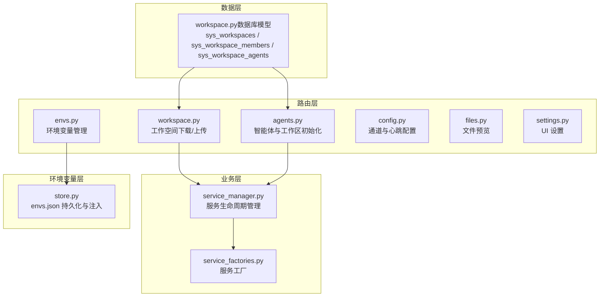
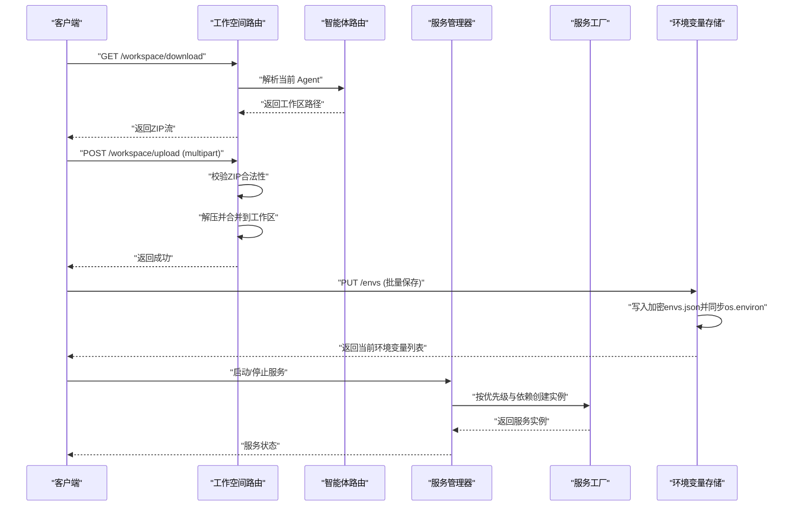
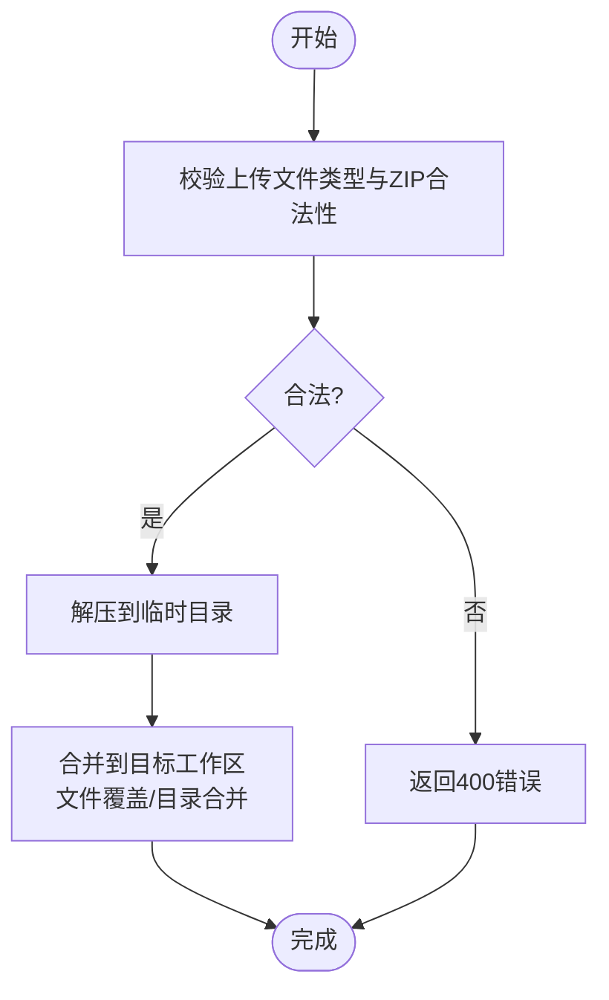
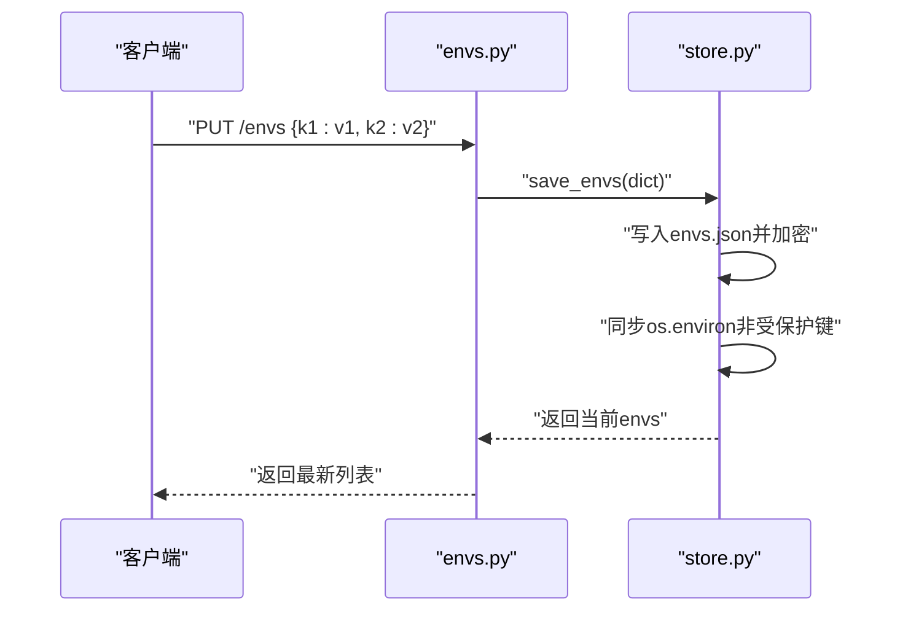
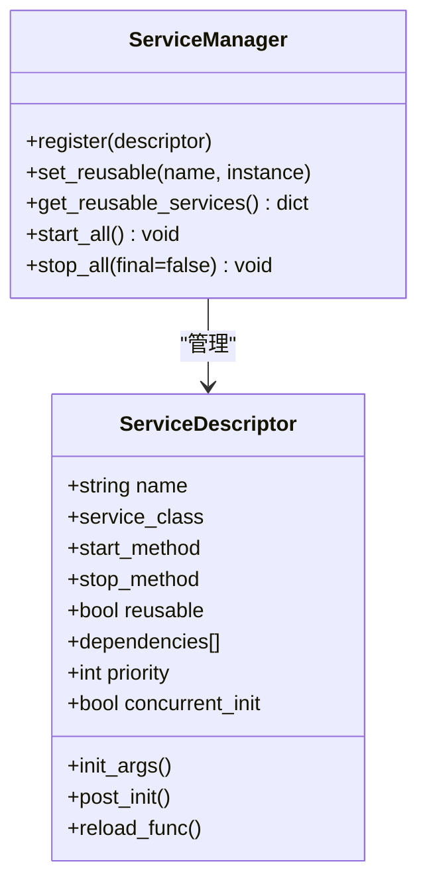
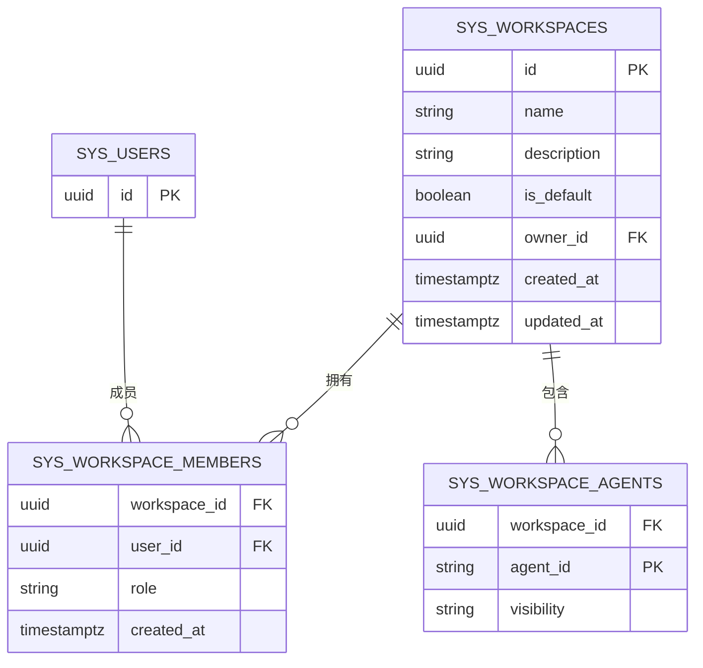
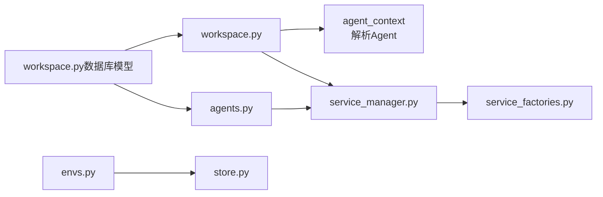

# 工作空间与环境 API

<cite>
**本文引用的文件**
- [workspace.py](file://src/copaw/app/routers/workspace.py)
- [envs.py](file://src/copaw/app/routers/envs.py)
- [store.py](file://src/copaw/envs/store.py)
- [workspace.py（数据库模型）](file://src/copaw/db/models/workspace.py)
- [service_manager.py](file://src/copaw/app/workspace/service_manager.py)
- [service_factories.py](file://src/copaw/app/workspace/service_factories.py)
- [agents.py](file://src/copaw/app/routers/agents.py)
- [files.py](file://src/copaw/app/routers/files.py)
- [config.py](file://src/copaw/app/routers/config.py)
- [settings.py](file://src/copaw/app/routers/settings.py)
- [API-Reference.md](file://docs/wiki/API-Reference.md)
- [migration.py](file://src/copaw/app/migration.py)
- [enterprise-storage-migration.md](file://docs/enterprise-storage-migration.md)
- [001_initial_schema.py](file://alembic/versions/001_initial_schema.py)
</cite>

## 目录
1. [简介](#简介)
2. [项目结构](#项目结构)
3. [核心组件](#核心组件)
4. [架构总览](#架构总览)
5. [详细组件分析](#详细组件分析)
6. [依赖分析](#依赖分析)
7. [性能考虑](#性能考虑)
8. [故障排查指南](#故障排查指南)
9. [结论](#结论)
10. [附录](#附录)

## 简介
本文件为 CoPaw 工作空间与环境 API 的权威参考文档，覆盖以下主题：
- 工作空间创建、配置、切换与文件管理
- 环境变量管理（设置、查询、持久化与注入）
- 工作空间隔离与资源共享的设计要点
- 工作空间模板与克隆的接口设计
- 权限管理与访问控制（RBAC）API
- 工作空间备份与恢复的接口设计
- 工作空间监控与资源使用指标
- 工作空间迁移与版本管理

## 项目结构
围绕工作空间与环境的核心模块分布如下：
- 路由层：工作空间与环境相关 API 路由定义
- 业务层：工作空间服务管理器与工厂函数
- 数据层：工作空间与成员、Agent 映射的数据库模型
- 环境变量层：环境变量的持久化与进程注入逻辑
- 辅助路由：文件预览、全局设置、通道配置等

图表来源
- [workspace.py:112-203](file://src/copaw/app/routers/workspace.py#L112-L203)
- [envs.py:1-81](file://src/copaw/app/routers/envs.py#L1-L81)
- [store.py:153-274](file://src/copaw/envs/store.py#L153-L274)
- [workspace.py（数据库模型）:20-112](file://src/copaw/db/models/workspace.py#L20-L112)
- [service_manager.py:74-421](file://src/copaw/app/workspace/service_manager.py#L74-L421)
- [service_factories.py:18-171](file://src/copaw/app/workspace/service_factories.py#L18-L171)
- [agents.py:286-318](file://src/copaw/app/routers/agents.py#L286-L318)
- [config.py:64-103](file://src/copaw/app/routers/config.py#L64-L103)
- [files.py:9-25](file://src/copaw/app/routers/files.py#L9-L25)
- [settings.py:19-59](file://src/copaw/app/routers/settings.py#L19-L59)

章节来源
- [workspace.py:1-203](file://src/copaw/app/routers/workspace.py#L1-L203)
- [envs.py:1-81](file://src/copaw/app/routers/envs.py#L1-L81)
- [store.py:1-274](file://src/copaw/envs/store.py#L1-L274)
- [workspace.py（数据库模型）:1-112](file://src/copaw/db/models/workspace.py#L1-L112)
- [service_manager.py:1-421](file://src/copaw/app/workspace/service_manager.py#L1-L421)
- [service_factories.py:1-171](file://src/copaw/app/workspace/service_factories.py#L1-L171)
- [agents.py:1-726](file://src/copaw/app/routers/agents.py#L1-L726)
- [config.py:1-642](file://src/copaw/app/routers/config.py#L1-L642)
- [files.py:1-25](file://src/copaw/app/routers/files.py#L1-L25)
- [settings.py:1-59](file://src/copaw/app/routers/settings.py#L1-L59)

## 核心组件
- 工作空间 API：提供工作区打包下载与 ZIP 合并上传能力，支持路径合法性校验与目录合并策略。
- 环境变量 API：提供批量设置、单键删除与全量列举；后端以加密 JSON 文件持久化，按需注入到当前进程环境。
- 工作空间服务管理：统一注册、启动/停止、依赖解析与可复用服务的重用机制。
- 数据模型：工作空间、成员与 Agent 映射的 ORM 表结构，支撑多租户与 RBAC。
- 智能体与工作区初始化：创建智能体时自动初始化工作区目录、内置技能与默认文件。

章节来源
- [workspace.py:112-203](file://src/copaw/app/routers/workspace.py#L112-L203)
- [envs.py:32-81](file://src/copaw/app/routers/envs.py#L32-L81)
- [store.py:153-274](file://src/copaw/envs/store.py#L153-L274)
- [service_manager.py:74-421](file://src/copaw/app/workspace/service_manager.py#L74-L421)
- [workspace.py（数据库模型）:20-112](file://src/copaw/db/models/workspace.py#L20-L112)
- [agents.py:683-726](file://src/copaw/app/routers/agents.py#L683-L726)

## 架构总览
工作空间与环境 API 的调用链路与职责划分如下：

图表来源
- [workspace.py:112-203](file://src/copaw/app/routers/workspace.py#L112-L203)
- [envs.py:32-81](file://src/copaw/app/routers/envs.py#L32-L81)
- [store.py:209-232](file://src/copaw/envs/store.py#L209-L232)
- [service_manager.py:171-329](file://src/copaw/app/workspace/service_manager.py#L171-L329)
- [service_factories.py:18-171](file://src/copaw/app/workspace/service_factories.py#L18-L171)
- [agents.py:286-318](file://src/copaw/app/routers/agents.py#L286-L318)

## 详细组件分析

### 工作空间下载与上传 API
- 接口设计
  - 下载：GET /workspace/download
    - 功能：将 Agent 的工作区打包为 ZIP 并作为流式响应返回
    - 认证：需要有效会话或令牌（取决于部署）
    - 响应：application/zip，Content-Disposition 指定文件名
  - 上传：POST /workspace/upload
    - 功能：接收 ZIP 文件，进行路径合法性校验后合并到工作区
    - 行为：文件覆盖、目录合并；不清理未在 ZIP 中出现的文件
- 关键实现点
  - ZIP 合法性校验与路径穿越防护
  - 解压到临时目录再合并，避免中断导致数据损坏
  - 异步执行压缩/解压，避免阻塞事件循环

图表来源
- [workspace.py:56-105](file://src/copaw/app/routers/workspace.py#L56-L105)
- [workspace.py:165-203](file://src/copaw/app/routers/workspace.py#L165-L203)

章节来源
- [workspace.py:112-203](file://src/copaw/app/routers/workspace.py#L112-L203)

### 环境变量管理 API
- 接口设计
  - GET /envs：返回全部环境变量（密文存储，明文返回）
  - PUT /envs：批量保存（全量替换），键名去空白，禁止空键
  - DELETE /envs/{key}：删除指定键，不存在则返回 404
- 后端实现
  - 持久化：envs.json（加密存储），迁移兼容旧位置
  - 注入：仅注入非受保护键，且不覆盖已存在的进程环境
  - 加密：透明解密与必要时重加密，确保安全性

图表来源
- [envs.py:32-81](file://src/copaw/app/routers/envs.py#L32-L81)
- [store.py:209-232](file://src/copaw/envs/store.py#L209-L232)

章节来源
- [envs.py:1-81](file://src/copaw/app/routers/envs.py#L1-L81)
- [store.py:153-274](file://src/copaw/envs/store.py#L153-L274)

### 工作空间服务管理与工厂
- 服务管理器
  - 描述符注册、依赖解析、并发/顺序启动、可复用服务标记与重用
  - 停止阶段区分最终关闭与热重载场景
- 服务工厂
  - 统一创建与注入聊天、通道、MCP 等服务，支持复用与注入工作区上下文

图表来源
- [service_manager.py:30-421](file://src/copaw/app/workspace/service_manager.py#L30-L421)
- [service_factories.py:18-171](file://src/copaw/app/workspace/service_factories.py#L18-L171)

章节来源
- [service_manager.py:1-421](file://src/copaw/app/workspace/service_manager.py#L1-L421)
- [service_factories.py:1-171](file://src/copaw/app/workspace/service_factories.py#L1-L171)

### 数据模型与权限隔离
- 工作空间模型
  - sys_workspaces：工作空间基本信息与默认标识
  - sys_workspace_members：工作空间与用户的多对多关系及角色
  - sys_workspace_agents：Agent ID 与工作空间映射及可见性
- RBAC 设计
  - 通过成员表与角色字段实现工作空间级权限控制
  - 结合多租户字段实现租户隔离

图表来源
- [workspace.py（数据库模型）:20-112](file://src/copaw/db/models/workspace.py#L20-L112)
- [001_initial_schema.py:257-267](file://alembic/versions/001_initial_schema.py#L257-L267)

章节来源
- [workspace.py（数据库模型）:1-112](file://src/copaw/db/models/workspace.py#L1-L112)
- [001_initial_schema.py:257-267](file://alembic/versions/001_initial_schema.py#L257-L267)

### 智能体与工作区初始化
- 创建智能体时自动初始化工作区目录、内置技能与默认文件（如 HEARTBEAT.md、jobs.json、chats.json）
- 支持选择语言与初始技能安装

章节来源
- [agents.py:683-726](file://src/copaw/app/routers/agents.py#L683-L726)

### 文件预览 API
- 提供静态文件预览能力，支持绝对/相对路径解析与 404 处理

章节来源
- [files.py:9-25](file://src/copaw/app/routers/files.py#L9-L25)

### 通道与心跳配置 API
- 通道配置：列出/更新所有通道、按通道类型获取/更新配置
- 心跳配置：获取/更新心跳周期、目标与活跃时段

章节来源
- [config.py:64-103](file://src/copaw/app/routers/config.py#L64-L103)
- [config.py:285-343](file://src/copaw/app/routers/config.py#L285-L343)

### UI 设置 API
- 获取/更新 UI 语言（公开接口，无需认证）

章节来源
- [settings.py:39-59](file://src/copaw/app/routers/settings.py#L39-L59)

## 依赖分析
- 工作空间路由依赖智能体上下文解析当前 Agent，进而定位工作区目录
- 环境变量路由依赖环境变量存储模块进行持久化与进程注入
- 服务管理器与工厂负责工作区内各子系统的生命周期与依赖注入
- 数据模型为权限与资源归属提供数据库支撑

图表来源
- [workspace.py:126-131](file://src/copaw/app/routers/workspace.py#L126-L131)
- [envs.py:37-40](file://src/copaw/app/routers/envs.py#L37-L40)
- [store.py:265-273](file://src/copaw/envs/store.py#L265-L273)
- [service_manager.py:81-90](file://src/copaw/app/workspace/service_manager.py#L81-L90)
- [service_factories.py:18-34](file://src/copaw/app/workspace/service_factories.py#L18-L34)
- [workspace.py（数据库模型）:20-112](file://src/copaw/db/models/workspace.py#L20-L112)
- [agents.py:286-318](file://src/copaw/app/routers/agents.py#L286-L318)

章节来源
- [workspace.py:1-203](file://src/copaw/app/routers/workspace.py#L1-L203)
- [envs.py:1-81](file://src/copaw/app/routers/envs.py#L1-L81)
- [store.py:1-274](file://src/copaw/envs/store.py#L1-L274)
- [service_manager.py:1-421](file://src/copaw/app/workspace/service_manager.py#L1-L421)
- [service_factories.py:1-171](file://src/copaw/app/workspace/service_factories.py#L1-L171)
- [workspace.py（数据库模型）:1-112](file://src/copaw/db/models/workspace.py#L1-L112)
- [agents.py:1-726](file://src/copaw/app/routers/agents.py#L1-L726)

## 性能考虑
- 异步 I/O：工作区打包/解压采用线程池异步执行，避免阻塞主事件循环
- 压缩算法：使用标准 ZIP 压缩，兼顾传输效率与兼容性
- 环境变量注入：仅在启动阶段与变更时同步，避免频繁写盘
- 服务启动：按优先级分组并发启动，降低冷启动时间

## 故障排查指南
- 工作区上传失败
  - 检查文件类型与 ZIP 合法性（400 错误）
  - 确认路径未包含非法字符或越界（路径穿越防护）
  - 查看临时目录权限与磁盘空间
- 环境变量未生效
  - 确认键不在受保护列表中
  - 检查进程已有同名环境变量是否覆盖
  - 核对 envs.json 是否存在且可读写
- 服务启动异常
  - 查看服务管理器日志，确认依赖是否满足
  - 检查可复用服务重用逻辑与 reload 函数

章节来源
- [workspace.py:56-105](file://src/copaw/app/routers/workspace.py#L56-L105)
- [store.py:115-146](file://src/copaw/envs/store.py#L115-L146)
- [service_manager.py:171-329](file://src/copaw/app/workspace/service_manager.py#L171-L329)

## 结论
本文档梳理了 CoPaw 工作空间与环境 API 的核心接口与实现细节，涵盖工作区打包下载、ZIP 合并上传、环境变量持久化与注入、服务生命周期管理、数据模型与权限隔离、以及与智能体初始化的协同关系。建议在生产环境中结合认证、速率限制与审计日志，确保接口安全与可观测性。

## 附录

### 工作空间模板与克隆接口设计
- 模板与克隆建议
  - 模板：提供标准化工作区目录结构与内置技能集合
  - 克隆：基于现有工作区生成新工作区，保留配置但分配独立目录
- 接口建议
  - POST /workspaces/template：创建模板（仅元数据与结构）
  - POST /workspaces/{id}/clone：克隆指定工作区
  - GET /workspaces/template-list：列出可用模板
- 安全与隔离
  - 克隆后独立目录与权限边界
  - 环境变量与敏感文件的隔离策略

[本节为概念性设计，不直接分析具体文件]

### 工作空间权限管理与访问控制 API
- 成员与角色
  - GET/POST /workspaces/{id}/members：列出与添加成员
  - PUT /workspaces/{id}/members/{userId}/role：更新成员角色
- 角色与权限
  - GET/POST /roles：角色 CRUD
  - PUT /roles/{roleId}/permissions：分配权限
  - GET /permissions：权限清单
- RBAC 实施
  - 基于 sys_workspace_members 与角色字段进行访问控制
  - 结合多租户字段实现租户级隔离

章节来源
- [workspace.py（数据库模型）:57-87](file://src/copaw/db/models/workspace.py#L57-L87)

### 工作空间备份与恢复接口
- 备份
  - GET /workspace/download：导出完整工作区 ZIP
- 恢复
  - POST /workspace/upload：从 ZIP 恢复工作区（覆盖/合并）
- 最佳实践
  - 增量备份：仅备份变更文件
  - 校验与回滚：导入前后校验一致性，失败时回滚

章节来源
- [workspace.py:112-203](file://src/copaw/app/routers/workspace.py#L112-L203)

### 工作空间监控与资源使用 API
- 监控建议
  - 工作区大小统计：扫描目录文件数量与总大小
  - 资源占用：结合操作系统指标与应用内部计数
- 指标采集
  - 文件数量与体积
  - 会话与聊天记录规模
  - 通道与任务运行状态

章节来源
- [workspace.py:21-30](file://src/copaw/app/routers/workspace.py#L21-L30)

### 工作空间迁移与版本管理
- 迁移流程
  - 识别旧版本工作区与配置
  - 迁移工作区项（文件/目录），处理命名冲突
  - 迁移技能与配置，生成迁移报告
- 版本管理
  - 基于 Alembic 的数据库迁移
  - 配置文件与脚本的版本控制
- 回滚策略
  - 配置回退、数据回退与代码回退的分级策略

章节来源
- [migration.py:228-260](file://src/copaw/app/migration.py#L228-L260)
- [enterprise-storage-migration.md:2619-2627](file://docs/enterprise-storage-migration.md#L2619-L2627)