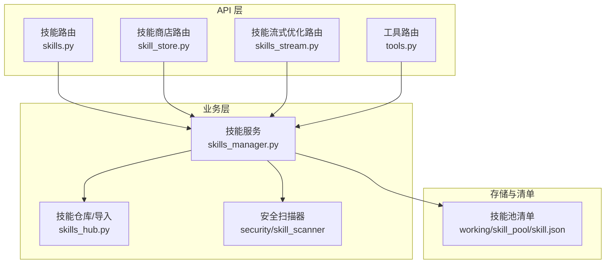
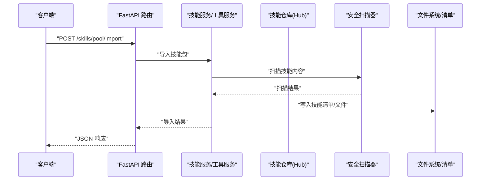
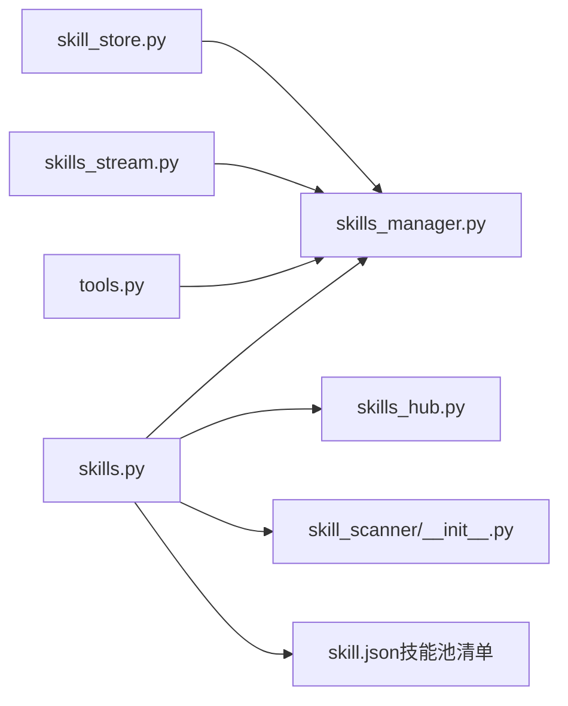

# 技能与工具 API

<cite>
**本文引用的文件**   
- [skills.py](file://src/copaw/app/routers/skills.py)
- [skills_stream.py](file://src/copaw/app/routers/skills_stream.py)
- [skill_store.py](file://src/copaw/app/routers/skill_store.py)
- [tools.py](file://src/copaw/app/routers/tools.py)
- [skills_manager.py](file://src/copaw/agents/skills_manager.py)
- [skills_hub.py](file://src/copaw/agents/skills_hub.py)
- [skill_scanner/__init__.py](file://src/copaw/security/skill_scanner/__init__.py)
- [skill.json（技能池清单）](file://working/skill_pool/skill.json)
- [browser_cdp/SKILL.md（示例技能）](file://working/skill_pool/browser_cdp/SKILL.md)
- [runner.py（技能执行入口）](file://src/copaw/app/runner/runner.py)
- [tool_message_utils.py（工具消息校验）](file://src/copaw/agents/utils/tool_message_utils.py)
</cite>

## 目录
1. [简介](#简介)
2. [项目结构](#项目结构)
3. [核心组件](#核心组件)
4. [架构总览](#架构总览)
5. [详细组件分析](#详细组件分析)
6. [依赖分析](#依赖分析)
7. [性能考虑](#性能考虑)
8. [故障排查指南](#故障排查指南)
9. [结论](#结论)
10. [附录](#附录)

## 简介
本文件为 CoPaw 技能与工具 API 的权威参考文档，覆盖技能注册、查询、启用/禁用、批量管理、上传导入、技能商店分发、企业技能安装、安全扫描与合规、技能流式优化、工具管理与调用等全链路能力。文档面向开发者与平台管理员，提供接口规范、请求/响应格式、错误处理策略与最佳实践。

## 项目结构
CoPaw 将“技能”与“工具”作为两类核心扩展能力：
- 技能（Skill）：以“技能包”形式存在，包含描述、脚本、引用资源等，支持工作空间内定制与共享池分发。
- 工具（Tool）：内置可插拔能力，支持按代理启用/禁用与异步执行配置。

图表来源
- [skills.py:533-1424](file://src/copaw/app/routers/skills.py#L533-L1424)
- [skill_store.py:1-73](file://src/copaw/app/routers/skill_store.py#L1-L73)
- [skills_stream.py:1-249](file://src/copaw/app/routers/skills_stream.py#L1-L249)
- [tools.py:1-181](file://src/copaw/app/routers/tools.py#L1-L181)
- [skills_manager.py:64-200](file://src/copaw/agents/skills_manager.py#L64-L200)
- [skills_hub.py:1-200](file://src/copaw/agents/skills_hub.py#L1-L200)
- [skill_scanner/__init__.py:1-120](file://src/copaw/security/skill_scanner/__init__.py#L1-L120)
- [skill.json（技能池清单）:1-370](file://working/skill_pool/skill.json#L1-L370)

章节来源
- [skills.py:533-1424](file://src/copaw/app/routers/skills.py#L533-L1424)
- [skill_store.py:1-73](file://src/copaw/app/routers/skill_store.py#L1-L73)
- [skills_stream.py:1-249](file://src/copaw/app/routers/skills_stream.py#L1-L249)
- [tools.py:1-181](file://src/copaw/app/routers/tools.py#L1-L181)
- [skills_manager.py:64-200](file://src/copaw/agents/skills_manager.py#L64-L200)
- [skills_hub.py:1-200](file://src/copaw/agents/skills_hub.py#L1-L200)
- [skill_scanner/__init__.py:1-120](file://src/copaw/security/skill_scanner/__init__.py#L1-L120)
- [skill.json（技能池清单）:1-370](file://working/skill_pool/skill.json#L1-L370)

## 核心组件
- 技能路由（FastAPI）：提供技能 CRUD、批量操作、标签/渠道/配置管理、从 Hub 导入、上传 ZIP、下载到工作空间、技能商店安装等接口。
- 技能商店路由：企业技能商店，列出共享池技能并安装到指定工作空间。
- 技能流式优化路由：基于模型的技能内容优化，返回 SSE 流。
- 工具路由：列出内置工具、切换启用状态、设置异步执行。
- 技能服务：封装技能清单读写、导入导出、冲突检测、签名与版本管理、环境注入等。
- 技能仓库：提供 Hub 搜索、安装、取消、重试、超时与缓存策略。
- 安全扫描：基于模式匹配的威胁检测、白名单、阻断/告警模式、缓存与历史记录。

章节来源
- [skills.py:533-1424](file://src/copaw/app/routers/skills.py#L533-L1424)
- [skill_store.py:1-73](file://src/copaw/app/routers/skill_store.py#L1-L73)
- [skills_stream.py:1-249](file://src/copaw/app/routers/skills_stream.py#L1-L249)
- [tools.py:1-181](file://src/copaw/app/routers/tools.py#L1-L181)
- [skills_manager.py:64-200](file://src/copaw/agents/skills_manager.py#L64-L200)
- [skills_hub.py:1-200](file://src/copaw/agents/skills_hub.py#L1-L200)
- [skill_scanner/__init__.py:1-120](file://src/copaw/security/skill_scanner/__init__.py#L1-L120)

## 架构总览
技能与工具 API 的典型调用链如下：

图表来源
- [skills.py:839-862](file://src/copaw/app/routers/skills.py#L839-L862)
- [skills_manager.py:64-200](file://src/copaw/agents/skills_manager.py#L64-L200)
- [skill_scanner/__init__.py:415-505](file://src/copaw/security/skill_scanner/__init__.py#L415-L505)

## 详细组件分析

### 技能 API（工作空间与技能池）
- 列表与刷新
  - GET /skills：返回当前工作空间技能清单
  - POST /skills/refresh：强制同步并返回最新清单
- Hub 搜索与安装
  - GET /skills/hub/search：按关键字与限制返回 Hub 技能列表
  - POST /skills/hub/install/start：发起 Hub 技能安装任务（返回任务ID）
  - GET /skills/hub/install/status/{task_id}：查询安装任务状态
  - POST /skills/hub/install/cancel/{task_id}：取消安装任务
- 技能池（共享）
  - GET /skills/pool：返回技能池清单
  - POST /skills/pool/refresh：刷新技能池清单
  - GET /skills/pool/builtin-sources：列出内置源
  - POST /skills/pool/import：从 Hub 导入技能到技能池
  - POST /skills/pool/upload-zip：上传 ZIP 到技能池
  - POST /skills/pool/import-builtin：导入内置技能
  - POST /skills/pool/{skill_name}/update-builtin：更新内置技能
  - DELETE /skills/pool/{skill_name}：删除技能池技能
  - GET/PUT/DELETE /skills/pool/{skill_name}/config：读取/更新/清除技能池配置
  - PUT /skills/pool/{skill_name}/tags：更新技能池标签
- 工作空间技能
  - POST /skills：创建工作空间技能（可选择启用）
  - POST /skills/upload：上传 ZIP 到工作空间
  - PUT /skills/save：保存/重命名工作空间技能
  - PUT /{skill_name}/channels：设置技能生效渠道
  - PUT /{skill_name}/tags：设置技能标签
  - GET /{skill_name}/config：读取技能配置
  - PUT/DELETE /{skill_name}/config：更新/清除技能配置
  - POST /{skill_name}/enable/disable：启用/禁用技能
  - DELETE /{skill_name}：删除技能（需先禁用）
  - GET /{skill_name}/files/{file_path:path}：读取技能内部文件
  - POST /skills/batch-enable/disable/delete：批量启用/禁用/删除
  - POST /skills/pool/download：从技能池批量下载到工作空间（原子性）
  - POST /skills/pool/upload：将工作空间技能上传到技能池
- 安全扫描
  - 所有导入/保存/启用流程均触发安全扫描，失败时返回标准化错误负载（含严重级别与发现项）

章节来源
- [skills.py:533-1424](file://src/copaw/app/routers/skills.py#L533-L1424)
- [skills_manager.py:64-200](file://src/copaw/agents/skills_manager.py#L64-L200)
- [skill_scanner/__init__.py:393-505](file://src/copaw/security/skill_scanner/__init__.py#L393-L505)

### 技能商店 API（企业）
- GET /skill-store：列出技能商店中的所有技能（名称、描述、版本、来源）
- POST /skill-store/install：将技能从技能池安装到指定工作空间目录

章节来源
- [skill_store.py:1-73](file://src/copaw/app/routers/skill_store.py#L1-L73)

### 技能流式优化 API（SSE）
- POST /skills/ai/optimize/stream：接收技能内容与语言，返回优化后的文本增量（SSE）
  - 请求体：content（技能内容）、language（en/zh/ru）
  - 响应：text/event-stream，每条事件包含增量文本，最后一条事件包含 done 标记

章节来源
- [skills_stream.py:170-249](file://src/copaw/app/routers/skills_stream.py#L170-L249)

### 工具 API
- GET /tools：列出当前代理的内置工具及其启用状态、异步执行标志、图标
- PATCH /tools/{tool_name}/toggle：切换工具启用状态（热更新）
- PATCH /tools/{tool_name}/async-execution：设置工具异步执行

章节来源
- [tools.py:1-181](file://src/copaw/app/routers/tools.py#L1-L181)

### 技能执行与上下文
- 技能执行入口：以“/技能名”命令触发，解析技能目录中的 SKILL.md，返回技能信息或执行动作。
- 工具消息配对：确保 tool_use 与 tool_result 成对出现，避免 API 错误。
- 技能配置环境注入：根据技能声明的 metadata.requires.env 注入环境变量，保障执行一致性。

章节来源
- [runner.py（技能执行入口）:157-200](file://src/copaw/app/runner/runner.py#L157-L200)
- [tool_message_utils.py（工具消息校验）:1-200](file://src/copaw/agents/utils/tool_message_utils.py#L1-L200)
- [skills_manager.py（环境注入）:666-678](file://src/copaw/agents/skills_manager.py#L666-L678)

### 技能商店与版本管理
- 技能池清单：维护技能元数据、版本号、签名、来源、更新时间等。
- 版本与同步：内置技能具备版本文本与提交信息，支持更新内置技能。
- 下载广播：支持将技能池技能广播到多个工作空间，冲突时整体回滚。

章节来源
- [skill.json（技能池清单）:1-370](file://working/skill_pool/skill.json#L1-L370)
- [skills.py（下载/广播）:970-1026](file://src/copaw/app/routers/skills.py#L970-L1026)

### 安全扫描与合规
- 扫描模式：block/warn/off，可通过环境变量或配置覆盖。
- 白名单：支持按技能名与内容哈希进行白名单匹配。
- 缓存：基于目录 mtime 的扫描结果缓存，避免重复扫描。
- 历史记录：记录被阻断/警告的技能，便于审计与溯源。
- 异常：扫描不通过时抛出统一异常，API 层转换为标准错误负载。

章节来源
- [skill_scanner/__init__.py（扫描器与配置）:85-120](file://src/copaw/security/skill_scanner/__init__.py#L85-L120)
- [skill_scanner/__init__.py（白名单/历史/缓存）:141-380](file://src/copaw/security/skill_scanner/__init__.py#L141-L380)
- [skills.py（扫描错误处理）:68-108](file://src/copaw/app/routers/skills.py#L68-L108)

### 技能开发与测试建议
- 使用示例技能 SKILL.md 作为模板，遵循 frontmatter 结构与描述规范。
- 开发阶段建议开启 warn 模式，观察潜在风险；上线前切换为 block 模式。
- 使用批量操作与标签管理提升运维效率；通过 Hub 搜索与导入加速技能复用。

章节来源
- [browser_cdp/SKILL.md（示例技能）:1-182](file://working/skill_pool/browser_cdp/SKILL.md#L1-L182)
- [skills.py（批量与标签）:1136-1180](file://src/copaw/app/routers/skills.py#L1136-L1180)

## 依赖分析

图表来源
- [skills.py:1-120](file://src/copaw/app/routers/skills.py#L1-L120)
- [skills_manager.py:1-120](file://src/copaw/agents/skills_manager.py#L1-L120)
- [skills_hub.py:1-120](file://src/copaw/agents/skills_hub.py#L1-L120)
- [skill_scanner/__init__.py:1-120](file://src/copaw/security/skill_scanner/__init__.py#L1-L120)
- [skill_store.py:1-40](file://src/copaw/app/routers/skill_store.py#L1-L40)
- [skills_stream.py:1-40](file://src/copaw/app/routers/skills_stream.py#L1-L40)
- [tools.py:1-40](file://src/copaw/app/routers/tools.py#L1-L40)

## 性能考虑
- 扫描缓存：基于目录 mtime 的扫描结果缓存，降低重复扫描成本。
- ZIP 上传限制：对上传类型与大小进行严格限制，防止大体积包导致内存压力。
- Hub 导入异步：安装任务以异步任务队列执行，支持取消与状态轮询。
- SSE 流式优化：按块输出增量文本，降低前端渲染压力。

章节来源
- [skill_scanner/__init__.py（缓存）:347-380](file://src/copaw/security/skill_scanner/__init__.py#L347-L380)
- [skills.py（ZIP 限制）:352-371](file://src/copaw/app/routers/skills.py#L352-L371)
- [skills.py（Hub 任务）:582-640](file://src/copaw/app/routers/skills.py#L582-L640)
- [skills_stream.py（SSE）:240-249](file://src/copaw/app/routers/skills_stream.py#L240-L249)

## 故障排查指南
- 安全扫描失败
  - 现象：导入/启用返回 422，包含严重级别与发现项列表
  - 处理：查看扫描历史记录，调整技能内容或加入白名单
- 冲突与重名
  - 现象：创建/导入返回 409，包含建议的新名称
  - 处理：使用建议名称或启用覆盖选项
- Hub 安装异常
  - 现象：任务状态为 failed，包含错误详情
  - 处理：检查网络、URL、版本标签与取消事件
- 工具消息不配对
  - 现象：工具调用报错
  - 处理：使用工具消息校验工具确保成对出现

章节来源
- [skills.py（扫描错误响应）:68-108](file://src/copaw/app/routers/skills.py#L68-L108)
- [skills.py（冲突处理）:686-692](file://src/copaw/app/routers/skills.py#L686-L692)
- [skills.py（Hub 任务状态）:612-640](file://src/copaw/app/routers/skills.py#L612-L640)
- [tool_message_utils.py（消息校验）:35-53](file://src/copaw/agents/utils/tool_message_utils.py#L35-L53)

## 结论
CoPaw 的技能与工具 API 提供了从开发、测试、导入、启用、分发到安全合规的完整闭环。通过统一的清单与服务抽象、严格的扫描与缓存机制、以及企业级的技能商店与 Hub 集成，平台能够高效地管理海量技能资产并保障运行安全。

## 附录

### 技能执行上下文与参数传递
- 执行入口：以“/技能名”命令触发，解析 SKILL.md 获取描述与元信息
- 工具消息：确保 tool_use 与 tool_result 成对出现，避免 API 错误
- 环境注入：根据技能声明的 metadata.requires.env 注入环境变量

章节来源
- [runner.py（技能执行入口）:157-200](file://src/copaw/app/runner/runner.py#L157-L200)
- [tool_message_utils.py（工具消息校验）:1-200](file://src/copaw/agents/utils/tool_message_utils.py#L1-L200)
- [skills_manager.py（环境注入）:666-678](file://src/copaw/agents/skills_manager.py#L666-L678)

### 技能缓存与性能优化
- 扫描缓存：LRU 策略，最多保留固定数量条目
- ZIP 上传：类型与大小限制，避免过大包
- Hub 导入：异步任务+取消事件，支持重试与超时

章节来源
- [skill_scanner/__init__.py（缓存）:327-380](file://src/copaw/security/skill_scanner/__init__.py#L327-L380)
- [skills.py（ZIP 限制）:352-371](file://src/copaw/app/routers/skills.py#L352-L371)
- [skills_hub.py（重试/超时）:129-164](file://src/copaw/agents/skills_hub.py#L129-L164)

### 技能安全扫描与合规
- 模式：block/warn/off，优先级：环境变量 > 配置 > 默认
- 白名单：按技能名与内容哈希匹配
- 历史记录：记录阻断/告警事件，支持清理与删除

章节来源
- [skill_scanner/__init__.py（模式/超时）:85-120](file://src/copaw/security/skill_scanner/__init__.py#L85-L120)
- [skill_scanner/__init__.py（白名单/历史）:141-302](file://src/copaw/security/skill_scanner/__init__.py#L141-L302)

### 技能迁移与兼容性
- 内置技能更新：支持按名称更新内置技能版本
- 下载广播：原子性下载到多个工作空间，失败自动回滚
- 渠道与标签：支持按渠道与标签精细化管理

章节来源
- [skills.py（内置更新/下载广播）:1029-1026](file://src/copaw/app/routers/skills.py#L1029-L1026)
- [skills.py（标签/渠道）:1121-1139](file://src/copaw/app/routers/skills.py#L1121-L1139)