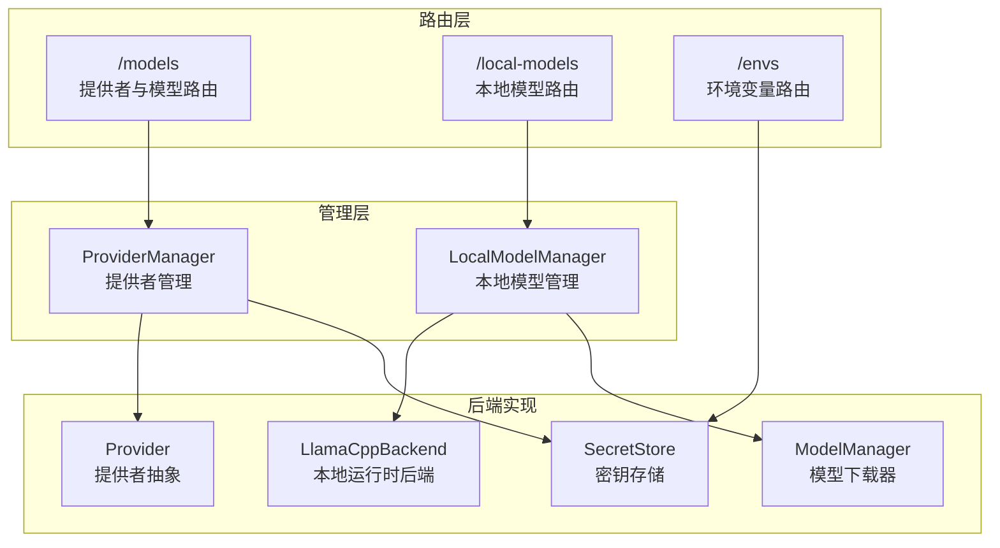
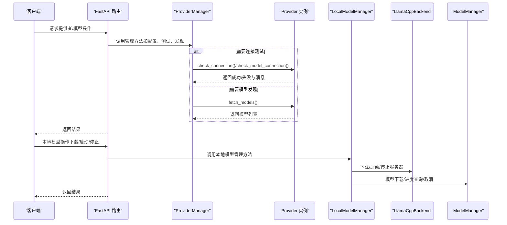
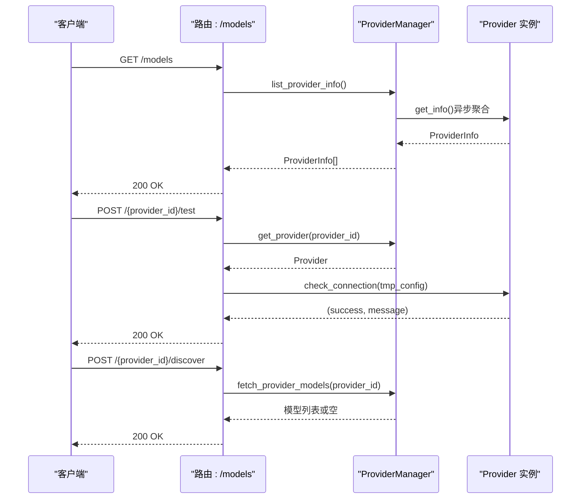
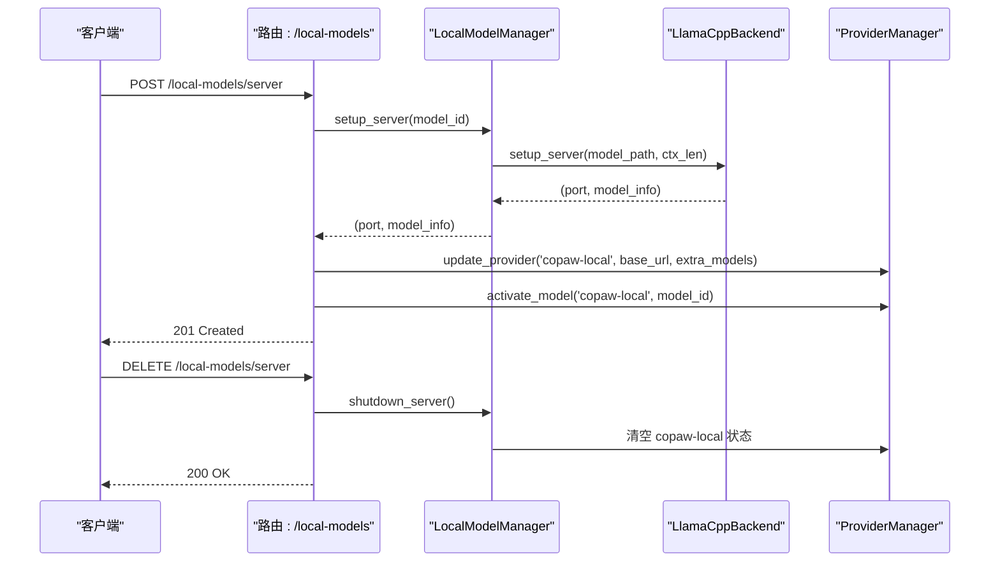
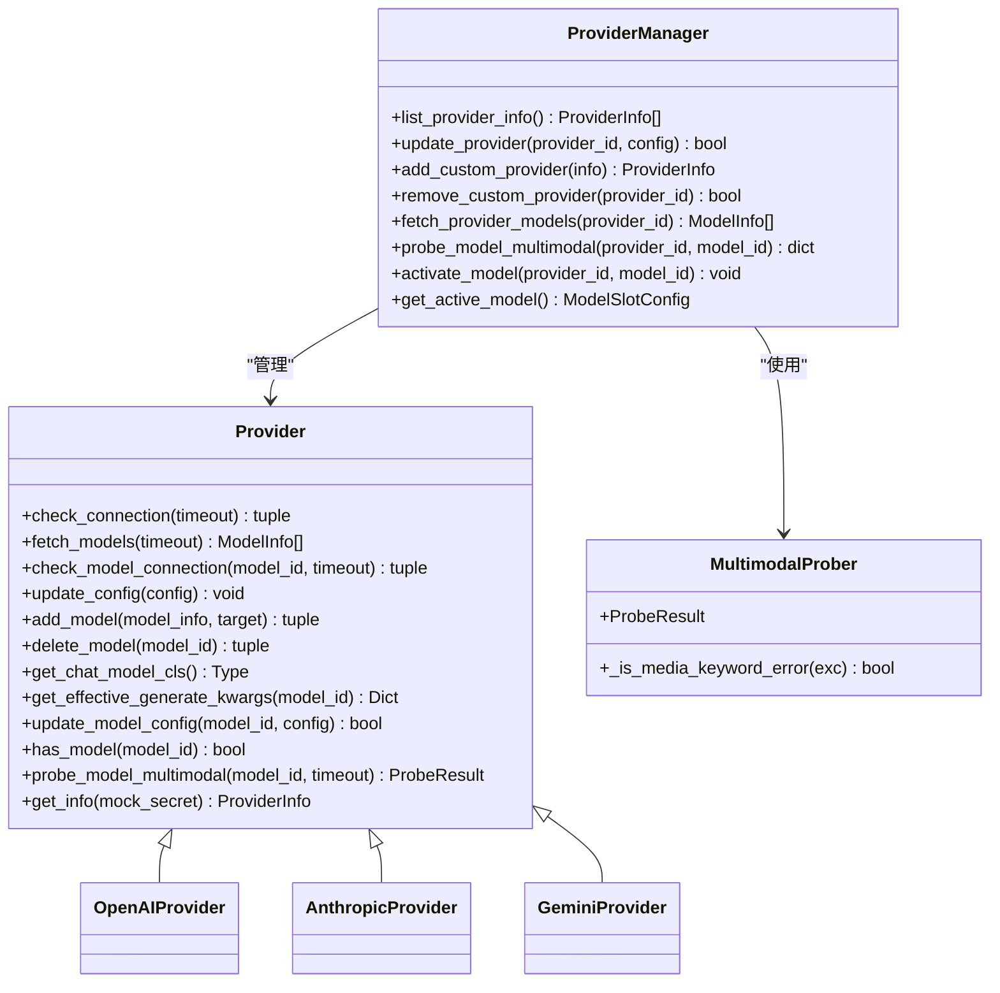
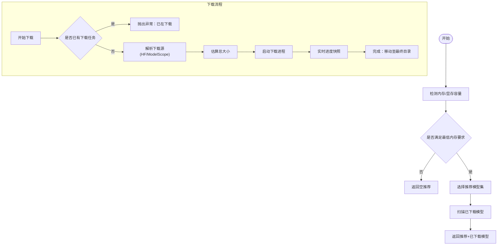
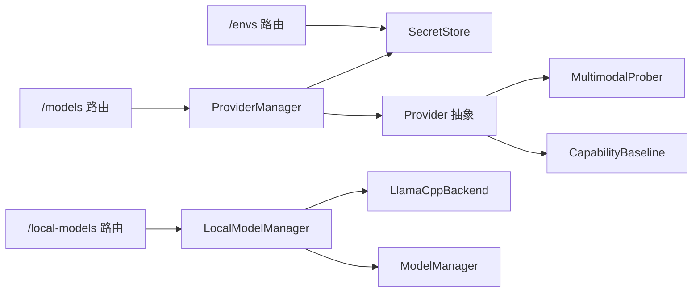

# 提供者与模型 API

<cite>
**本文档引用的文件**
- [src/copaw/providers/provider_manager.py](file://src/copaw/providers/provider_manager.py)
- [src/copaw/app/routers/providers.py](file://src/copaw/app/routers/providers.py)
- [src/copaw/providers/provider.py](file://src/copaw/providers/provider.py)
- [src/copaw/providers/models.py](file://src/copaw/providers/models.py)
- [src/copaw/local_models/manager.py](file://src/copaw/local_models/manager.py)
- [src/copaw/app/routers/local_models.py](file://src/copaw/app/routers/local_models.py)
- [src/copaw/local_models/model_manager.py](file://src/copaw/local_models/model_manager.py)
- [src/copaw/local_models/llamacpp.py](file://src/copaw/local_models/llamacpp.py)
- [src/copaw/providers/multimodal_prober.py](file://src/copaw/providers/multimodal_prober.py)
- [src/copaw/providers/capability_baseline.py](file://src/copaw/providers/capability_baseline.py)
- [src/copaw/security/secret_store.py](file://src/copaw/security/secret_store.py)
- [src/copaw/app/routers/envs.py](file://src/copaw/app/routers/envs.py)
- [src/copaw/app/crons/heartbeat.py](file://src/copaw/app/crons/heartbeat.py)
</cite>

## 目录
1. [简介](#简介)
2. [项目结构](#项目结构)
3. [核心组件](#核心组件)
4. [架构总览](#架构总览)
5. [详细组件分析](#详细组件分析)
6. [依赖关系分析](#依赖关系分析)
7. [性能考虑](#性能考虑)
8. [故障排除指南](#故障排除指南)
9. [结论](#结论)
10. [附录](#附录)

## 简介
本文件为 CoPaw 的“提供者与模型 API”提供完整参考文档，覆盖以下主题：
- 模型提供者管理：内置与自定义提供者的统一管理、配置更新、连接测试、模型发现与能力探测。
- 模型列表查询与操作：添加/删除模型、按作用域（全局/代理）设置活动模型。
- 本地模型管理：下载、安装、卸载、服务器启动/停止、配置与参数调整。
- 能力探测与基准对比：多模态支持探测、预期能力基线对比、差异报告生成。
- 性能评估与资源管理：上下文长度、设备列表、版本检查、更新检测。
- 版本管理与兼容性：模型与运行时版本检查、兼容性提示。
- 监控与健康检查：心跳任务、服务可用性检查、日志与状态上报。
- 安全与访问控制：敏感字段加密存储、密钥轮换与降级策略。

## 项目结构
CoPaw 将“提供者与模型”相关功能分为三层：
- 路由层（FastAPI）：对外暴露 REST API，负责请求解析、权限校验与响应封装。
- 管理层（Manager）：协调提供者与本地模型的生命周期、状态与配置。
- 后端实现（Provider/Backend）：具体提供者协议适配、本地运行时（llama.cpp）控制与下载器。

图表来源
- [src/copaw/app/routers/providers.py:1-632](file://src/copaw/app/routers/providers.py#L1-L632)
- [src/copaw/app/routers/local_models.py:1-454](file://src/copaw/app/routers/local_models.py#L1-L454)
- [src/copaw/providers/provider_manager.py:670-800](file://src/copaw/providers/provider_manager.py#L670-L800)
- [src/copaw/local_models/manager.py:33-229](file://src/copaw/local_models/manager.py#L33-L229)

章节来源
- [src/copaw/app/routers/providers.py:1-632](file://src/copaw/app/routers/providers.py#L1-L632)
- [src/copaw/app/routers/local_models.py:1-454](file://src/copaw/app/routers/local_models.py#L1-L454)
- [src/copaw/providers/provider_manager.py:670-800](file://src/copaw/providers/provider_manager.py#L670-L800)
- [src/copaw/local_models/manager.py:33-229](file://src/copaw/local_models/manager.py#L33-L229)

## 核心组件
- ProviderManager：统一管理内置与自定义提供者，支持配置更新、连接测试、模型发现、能力探测与活动模型设置。
- LocalModelManager：统一本地模型生命周期，包括 llama.cpp 下载、服务器启动/停止、模型下载与进度跟踪、配置持久化。
- Provider 抽象：定义提供者接口（连接测试、模型发现、单模型连接测试、配置更新、能力探测），并提供通用的生成参数合并逻辑。
- SecretStore：提供主密钥管理与敏感字段透明加解密，确保 API Key 等机密信息的安全存储。
- 心跳与监控：心跳任务用于周期性触发代理执行，结合通道分发与超时控制；本地模型服务器提供健康检查端点。

章节来源
- [src/copaw/providers/provider_manager.py:670-800](file://src/copaw/providers/provider_manager.py#L670-L800)
- [src/copaw/local_models/manager.py:33-229](file://src/copaw/local_models/manager.py#L33-L229)
- [src/copaw/providers/provider.py:111-314](file://src/copaw/providers/provider.py#L111-L314)
- [src/copaw/security/secret_store.py:148-285](file://src/copaw/security/secret_store.py#L148-L285)
- [src/copaw/app/crons/heartbeat.py:119-213](file://src/copaw/app/crons/heartbeat.py#L119-L213)

## 架构总览
下图展示“提供者与模型 API”的端到端调用链路与数据流：

图表来源
- [src/copaw/app/routers/providers.py:148-632](file://src/copaw/app/routers/providers.py#L148-L632)
- [src/copaw/app/routers/local_models.py:145-454](file://src/copaw/app/routers/local_models.py#L145-L454)
- [src/copaw/providers/provider_manager.py:736-800](file://src/copaw/providers/provider_manager.py#L736-L800)
- [src/copaw/local_models/llamacpp.py:216-308](file://src/copaw/local_models/llamacpp.py#L216-L308)
- [src/copaw/local_models/model_manager.py:175-257](file://src/copaw/local_models/model_manager.py#L175-L257)

## 详细组件分析

### 提供者与模型路由（/models）
- 列出所有提供者：返回 ProviderInfo 列表，包含基础 URL、聊天模型类名、模型清单、是否本地、是否可发现等元数据。
- 配置提供者：支持更新 API Key、Base URL、聊天模型类名与生成参数（generate_kwargs）。
- 连接测试：对指定提供者进行连通性测试，支持临时覆盖 API Key 与 Base URL。
- 模型发现：从提供者 API 获取可用模型列表（需提供者支持）。
- 单模型测试：针对特定模型进行可用性测试。
- 自定义提供者：创建/删除自定义提供者，并持久化到磁盘。
- 添加/移除模型：向提供者添加或移除模型条目。
- 多模态探测：对指定模型进行图像/视频输入能力探测。
- 活动模型管理：按作用域（全局/代理）获取/设置当前激活的模型槽位。

图表来源
- [src/copaw/app/routers/providers.py:148-341](file://src/copaw/app/routers/providers.py#L148-L341)
- [src/copaw/providers/provider_manager.py:736-751](file://src/copaw/providers/provider_manager.py#L736-L751)

章节来源
- [src/copaw/app/routers/providers.py:148-632](file://src/copaw/app/routers/providers.py#L148-L632)
- [src/copaw/providers/provider_manager.py:736-800](file://src/copaw/providers/provider_manager.py#L736-L800)
- [src/copaw/providers/provider.py:111-193](file://src/copaw/providers/provider.py#L111-L193)

### 本地模型路由（/local-models）
- 服务器状态检查：判断本地 llama.cpp 是否可安装、已安装、是否就绪、端口与当前服务模型。
- 更新检测：检查当前已安装版本是否有新版本可用。
- llama.cpp 下载：开始/取消下载，返回进度快照。
- 启动/停止本地服务器：选择已下载模型，启动/停止本地 llama.cpp 服务，并自动更新“copaw-local”提供者配置与活动模型。
- 本地模型管理：列出推荐与已下载模型，开始/取消模型下载，查看下载进度。
- 本地配置：设置最大上下文长度、附加生成参数，持久化到本地配置文件。

图表来源
- [src/copaw/app/routers/local_models.py:283-338](file://src/copaw/app/routers/local_models.py#L283-L338)
- [src/copaw/local_models/manager.py:200-220](file://src/copaw/local_models/manager.py#L200-L220)
- [src/copaw/local_models/llamacpp.py:216-308](file://src/copaw/local_models/llamacpp.py#L216-L308)

章节来源
- [src/copaw/app/routers/local_models.py:145-454](file://src/copaw/app/routers/local_models.py#L145-L454)
- [src/copaw/local_models/manager.py:33-229](file://src/copaw/local_models/manager.py#L33-L229)
- [src/copaw/local_models/llamacpp.py:51-308](file://src/copaw/local_models/llamacpp.py#L51-L308)

### Provider 抽象与能力探测
- Provider 基类：定义连接测试、模型发现、单模型连接测试、配置更新、模型增删、能力探测等接口；提供生成参数深度合并与模型存在性检查。
- 多模态探测：通过 ProbeResult 结构返回图像/视频支持状态与探测消息；默认实现返回未探测结果，子类可覆盖以对接具体 API。
- 能力基线：维护官方文档标注的期望能力（图像/视频），并与实际探测结果对比，生成差异日志与汇总报告。

图表来源
- [src/copaw/providers/provider.py:111-314](file://src/copaw/providers/provider.py#L111-L314)
- [src/copaw/providers/provider_manager.py:670-800](file://src/copaw/providers/provider_manager.py#L670-L800)
- [src/copaw/providers/multimodal_prober.py:75-102](file://src/copaw/providers/multimodal_prober.py#L75-L102)

章节来源
- [src/copaw/providers/provider.py:111-314](file://src/copaw/providers/provider.py#L111-L314)
- [src/copaw/providers/multimodal_prober.py:1-102](file://src/copaw/providers/multimodal_prober.py#L1-L102)
- [src/copaw/providers/capability_baseline.py:55-90](file://src/copaw/providers/capability_baseline.py#L55-L90)

### 本地模型下载与运行时后端
- ModelManager：根据机器内存推荐模型、扫描已下载模型、计算下载进度、启动/取消下载任务、清理临时目录与空父目录。
- LlamaCppBackend：负责 llama.cpp 可安装性检查、下载与解压、服务器进程管理、健康检查、设备列表查询、版本号获取、日志输出与优雅关闭。
- LocalModelManager：作为门面，协调 ModelManager 与 LlamaCppBackend，提供配置持久化（最大上下文长度）、并发锁保护服务器生命周期、与 ProviderManager 协同更新本地提供者状态。

图表来源
- [src/copaw/local_models/model_manager.py:76-134](file://src/copaw/local_models/model_manager.py#L76-L134)
- [src/copaw/local_models/model_manager.py:175-257](file://src/copaw/local_models/model_manager.py#L175-L257)
- [src/copaw/local_models/llamacpp.py:159-215](file://src/copaw/local_models/llamacpp.py#L159-L215)

章节来源
- [src/copaw/local_models/model_manager.py:61-638](file://src/copaw/local_models/model_manager.py#L61-L638)
- [src/copaw/local_models/llamacpp.py:51-308](file://src/copaw/local_models/llamacpp.py#L51-L308)
- [src/copaw/local_models/manager.py:33-229](file://src/copaw/local_models/manager.py#L33-L229)

### 安全与访问控制
- SecretStore：提供主密钥生成/缓存、OS Keychain 与文件后备存储、敏感字段透明加解密（API Key 等），支持批量加密/解密字典字段。
- ProviderManager 使用 SecretStore 对敏感字段进行加密存储，避免明文泄露。

章节来源
- [src/copaw/security/secret_store.py:148-285](file://src/copaw/security/secret_store.py#L148-L285)
- [src/copaw/providers/provider_manager.py:31-36](file://src/copaw/providers/provider_manager.py#L31-L36)

### 监控与健康检查
- 心跳任务：按配置周期（秒/分钟/小时或 cron 表达式）读取工作区中的 HEARTBEAT.md 内容，构造用户消息并触发代理执行；支持在最后分发目标存在时回传事件。
- 本地模型健康检查：llama.cpp 服务器通过 /health 端点轮询，超时控制与日志输出便于诊断。

章节来源
- [src/copaw/app/crons/heartbeat.py:119-213](file://src/copaw/app/crons/heartbeat.py#L119-L213)
- [src/copaw/local_models/llamacpp.py:656-692](file://src/copaw/local_models/llamacpp.py#L656-L692)

## 依赖关系分析
- 路由层依赖管理层：提供者与本地模型路由均通过依赖注入获取 ProviderManager 与 LocalModelManager 实例。
- 管理层依赖后端实现：ProviderManager 聚合 Provider 抽象与 SecretStore；LocalModelManager 聚合 LlamaCppBackend 与 ModelManager。
- Provider 抽象依赖多模态探测：默认探测返回未探测结果，子类可覆盖以对接具体提供者 API。
- 能力基线与探测：ExpectedCapabilityRegistry 维护官方文档标注的期望能力，与实际探测结果对比生成差异报告。

图表来源
- [src/copaw/app/routers/providers.py:50-59](file://src/copaw/app/routers/providers.py#L50-L59)
- [src/copaw/app/routers/local_models.py:26-34](file://src/copaw/app/routers/local_models.py#L26-L34)
- [src/copaw/providers/provider_manager.py:670-751](file://src/copaw/providers/provider_manager.py#L670-L751)
- [src/copaw/local_models/manager.py:45-55](file://src/copaw/local_models/manager.py#L45-L55)

章节来源
- [src/copaw/app/routers/providers.py:50-59](file://src/copaw/app/routers/providers.py#L50-L59)
- [src/copaw/app/routers/local_models.py:26-34](file://src/copaw/app/routers/local_models.py#L26-L34)
- [src/copaw/providers/provider_manager.py:670-751](file://src/copaw/providers/provider_manager.py#L670-L751)

## 性能考虑
- 异步与并发：ProviderManager 在聚合多个提供者信息时采用异步 gather，提升 I/O 密集场景下的吞吐。
- 进程隔离与下载：本地模型下载与 llama.cpp 下载通过独立进程执行，避免阻塞主事件循环；下载进度通过队列与快照返回。
- 服务器生命周期锁：LocalModelManager 使用 asyncio.Lock 串行化服务器启动/停止，避免竞态条件。
- 上下文长度与设备：llama.cpp 启动时可传入最大上下文长度与 GPU 层数，结合系统显存/内存自动选择最优参数。
- 超时与重试：健康检查与连接测试设置合理超时，避免长时间阻塞；错误分类（网络/鉴权/不可用）便于快速定位问题。

## 故障排除指南
- 提供者连接失败
  - 现象：/models/{provider_id}/test 返回失败。
  - 排查：确认 API Key 前缀与 Base URL 正确；若提供者不支持无模型连接测试，需先添加模型或使用 /discover 获取模型列表。
  - 参考：[src/copaw/app/routers/providers.py:280-305](file://src/copaw/app/routers/providers.py#L280-L305)
- 模型不可用
  - 现象：/models/{provider_id}/models/{model_id}/test 返回失败。
  - 排查：检查模型 ID 是否存在于提供者模型列表；确认网络可达与模型支持情况。
  - 参考：[src/copaw/app/routers/providers.py:348-369](file://src/copaw/app/routers/providers.py#L348-L369)
- 本地模型下载卡住
  - 现象：/local-models/models/download 无进度或报错。
  - 排查：检查网络连通性与镜像源可用性；取消后重试；查看下载进度快照。
  - 参考：[src/copaw/app/routers/local_models.py:367-414](file://src/copaw/app/routers/local_models.py#L367-L414)
- llama.cpp 服务器无法启动
  - 现象：/local-models/server 返回错误或健康检查失败。
  - 排查：确认可安装性（操作系统/架构/版本）；检查端口占用；查看日志与超时；必要时重启或更新版本。
  - 参考：[src/copaw/local_models/llamacpp.py:216-308](file://src/copaw/local_models/llamacpp.py#L216-L308)
- 密钥解密失败
  - 现象：Provider 配置中 API Key 显示为密文或解密失败。
  - 排查：确认主密钥未变更；检查密钥存储位置与权限；必要时重新写入密钥。
  - 参考：[src/copaw/security/secret_store.py:216-236](file://src/copaw/security/secret_store.py#L216-L236)

章节来源
- [src/copaw/app/routers/providers.py:280-369](file://src/copaw/app/routers/providers.py#L280-L369)
- [src/copaw/app/routers/local_models.py:367-414](file://src/copaw/app/routers/local_models.py#L367-L414)
- [src/copaw/local_models/llamacpp.py:216-308](file://src/copaw/local_models/llamacpp.py#L216-L308)
- [src/copaw/security/secret_store.py:216-236](file://src/copaw/security/secret_store.py#L216-L236)

## 结论
CoPaw 的“提供者与模型 API”通过清晰的分层设计实现了：
- 统一的提供者管理与配置更新；
- 完整的模型发现、连接测试与能力探测；
- 本地模型的全生命周期管理与运行时控制；
- 安全的密钥存储与访问控制；
- 健康检查与监控机制。

这些能力共同构成了一个可扩展、可观测且安全的模型管理平台，适用于多提供商、多模态与本地推理场景。

## 附录
- 数据模型与作用域
  - 模型槽位：包含 provider_id 与 model 字段，用于标识当前激活的模型。
  - 活动模型读取作用域：effective（优先代理配置，否则全局）、global（仅全局）、agent（仅指定代理）。
  - 活动模型写入作用域：global（更新全局）、agent（更新指定代理）。
  - 参考：[src/copaw/providers/models.py:9-16](file://src/copaw/providers/models.py#L9-L16)，[src/copaw/app/routers/providers.py:46-47](file://src/copaw/app/routers/providers.py#L46-L47)

- 环境变量管理
  - 支持批量保存、删除与列出环境变量，便于外部工具与代理配置。
  - 参考：[src/copaw/app/routers/envs.py:32-81](file://src/copaw/app/routers/envs.py#L32-L81)