# 渠道与消息 API

<cite>
**本文引用的文件**
- [messages.py](file://src/copaw/app/routers/messages.py)
- [manager.py](file://src/copaw/app/channels/manager.py)
- [console.py](file://src/copaw/app/routers/console.py)
- [console_push_store.py](file://src/copaw/app/console_push_store.py)
- [channel.py](file://src/copaw/app/channels/console/channel.py)
- [schema.py](file://src/copaw/app/channels/schema.py)
- [channel.ts](file://console/src/api/modules/channel.ts)
- [console.ts](file://console/src/api/modules/console.ts)
- [index.tsx](file://console/src/components/ConsoleCronBubble/index.tsx)
- [constants.ts](file://console/src/pages/Control/Channels/components/constants.ts)
- [channels.en.md](file://website/public/docs/channels.en.md)
- [session.py](file://src/copaw/db/models/session.py)
- [tokenUsage.ts](file://console/src/api/types/tokenUsage.ts)
- [index.tsx](file://console/src/pages/Settings/TokenUsage/index.tsx)
</cite>

## 目录
1. [简介](#简介)
2. [项目结构](#项目结构)
3. [核心组件](#核心组件)
4. [架构总览](#架构总览)
5. [详细组件分析](#详细组件分析)
6. [依赖分析](#依赖分析)
7. [性能考虑](#性能考虑)
8. [故障排查指南](#故障排查指南)
9. [结论](#结论)
10. [附录](#附录)

## 简介
本文件为 CoPaw 的“渠道与消息 API”提供权威参考，覆盖消息发送、接收、历史查询、控制台推送、多渠道路由、消息格式与协议转换、持久化与检索、过滤与搜索、批量操作、安全与隐私、统计与分析等主题。内容以代码为依据，结合前端控制台与后端服务的交互，帮助开发者与运维人员正确集成与扩展。

## 项目结构
CoPaw 的消息与渠道能力由后端 FastAPI 路由器、通道管理器、具体通道实现以及前端控制台 API 模块共同构成。关键路径如下：
- 后端消息发送路由：/messages/send
- 控制台聊天与上传路由：/console/chat、/console/upload、/console/push-messages
- 通道管理器：统一队列、批处理、路由与消费
- 控制台通道：实时推送与前端轮询
- 渠道类型与消息转换协议：统一路由标识与协议接口
- 前端控制台 API：列出渠道、获取二维码、拉取推送消息

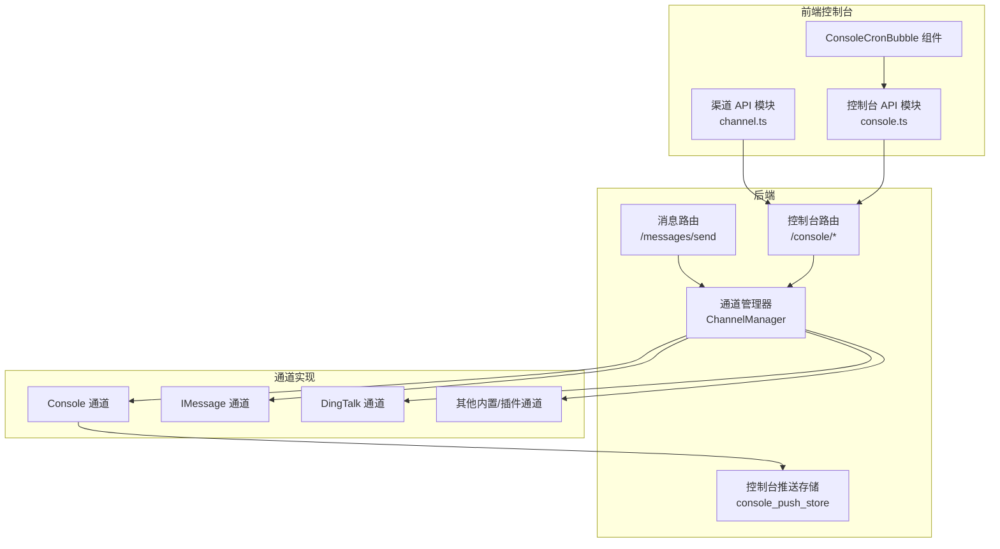

**图表来源**
- [messages.py:78-186](file://src/copaw/app/routers/messages.py#L78-L186)
- [console.py:68-215](file://src/copaw/app/routers/console.py#L68-L215)
- [manager.py:68-711](file://src/copaw/app/channels/manager.py#L68-L711)
- [console_push_store.py:1-97](file://src/copaw/app/console_push_store.py#L1-L97)
- [channel.ts:1-43](file://console/src/api/modules/channel.ts#L1-L43)
- [console.ts:1-11](file://console/src/api/modules/console.ts#L1-L11)
- [index.tsx:1-41](file://console/src/components/ConsoleCronBubble/index.tsx#L1-L41)

**章节来源**
- [messages.py:1-187](file://src/copaw/app/routers/messages.py#L1-L187)
- [console.py:1-216](file://src/copaw/app/routers/console.py#L1-L216)
- [manager.py:1-711](file://src/copaw/app/channels/manager.py#L1-L711)
- [console_push_store.py:1-97](file://src/copaw/app/console_push_store.py#L1-L97)
- [channel.ts:1-43](file://console/src/api/modules/channel.ts#L1-L43)
- [console.ts:1-11](file://console/src/api/modules/console.ts#L1-L11)
- [index.tsx:1-41](file://console/src/components/ConsoleCronBubble/index.tsx#L1-L41)

## 核心组件
- 消息发送路由：提供统一的文本消息发送接口，支持指定渠道、目标用户与会话，并通过通道管理器转发。
- 通道管理器：负责通道生命周期、统一队列、批处理合并、按会话与优先级路由、错误处理与资源清理。
- 控制台路由：提供聊天流式响应、文件上传、控制台推送消息拉取。
- 控制台推送存储：内存限流与过期清理，支持按会话取走或全局最近消息读取。
- 渠道类型与协议：定义统一的路由标识与消息转换协议，便于多渠道适配与扩展。
- 前端控制台 API：列举可用渠道、更新配置、获取二维码授权、轮询控制台推送消息。

**章节来源**
- [messages.py:40-186](file://src/copaw/app/routers/messages.py#L40-L186)
- [manager.py:68-711](file://src/copaw/app/channels/manager.py#L68-L711)
- [console.py:68-215](file://src/copaw/app/routers/console.py#L68-L215)
- [console_push_store.py:22-97](file://src/copaw/app/console_push_store.py#L22-L97)
- [schema.py:12-71](file://src/copaw/app/channels/schema.py#L12-L71)
- [channel.ts:4-43](file://console/src/api/modules/channel.ts#L4-L43)
- [console.ts:8-11](file://console/src/api/modules/console.ts#L8-L11)
- [index.tsx:17-41](file://console/src/components/ConsoleCronBubble/index.tsx#L17-L41)

## 架构总览
消息从 API 进入，经通道管理器统一调度，按渠道与会话进行批处理与路由，最终由具体通道实现完成发送或接收。控制台通道在发送文本时同时写入推送存储，供前端轮询展示。

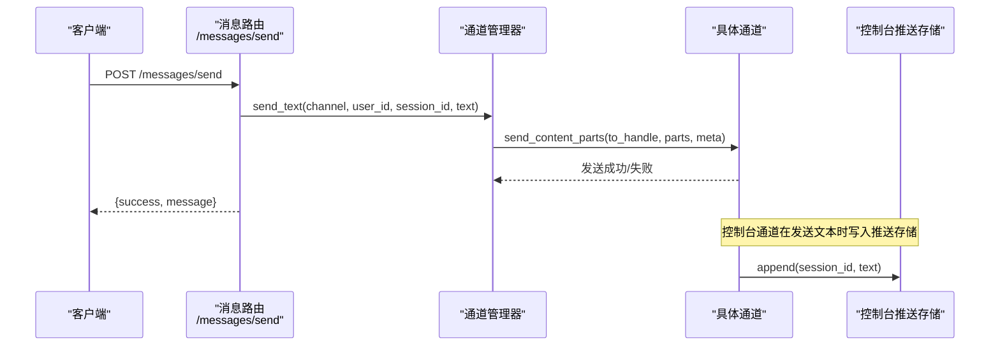

**图表来源**
- [messages.py:78-186](file://src/copaw/app/routers/messages.py#L78-L186)
- [manager.py:630-711](file://src/copaw/app/channels/manager.py#L630-L711)
- [channel.py:526-571](file://src/copaw/app/channels/console/channel.py#L526-L571)
- [console_push_store.py:22-39](file://src/copaw/app/console_push_store.py#L22-L39)

## 详细组件分析

### 消息发送 API
- 路径与方法
  - POST /messages/send
- 请求体字段
  - channel: 目标渠道标识（如 console、dingtalk、feishu、discord 等）
  - target_user: 渠道内用户 ID
  - target_session: 渠道内会话 ID
  - text: 文本消息内容
- 响应体字段
  - success: 是否成功
  - message: 状态描述
- 头部
  - X-Agent-Id: 可选，用于标记消息来源的代理 ID
- 行为说明
  - 通过通道管理器将消息发送到指定渠道
  - 若渠道不存在或发送异常，返回相应 HTTP 错误码
  - 成功时返回标准响应

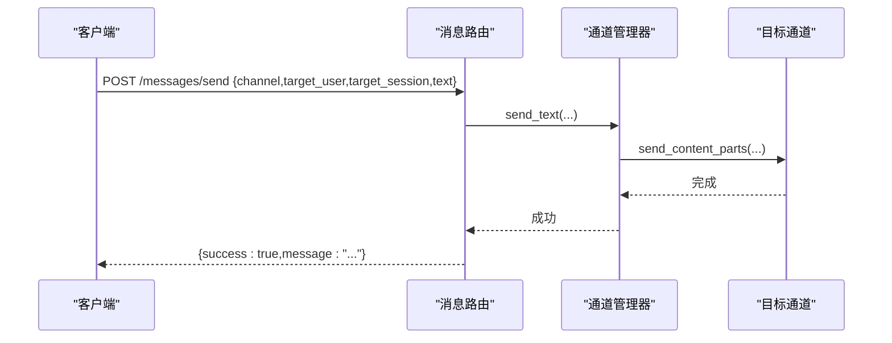

**图表来源**
- [messages.py:78-186](file://src/copaw/app/routers/messages.py#L78-L186)
- [manager.py:630-711](file://src/copaw/app/channels/manager.py#L630-L711)

**章节来源**
- [messages.py:40-186](file://src/copaw/app/routers/messages.py#L40-L186)

### 控制台聊天与上传 API
- 路径与方法
  - POST /console/chat（SSE 流式响应）
  - POST /console/chat/stop（停止运行中的聊天）
  - POST /console/upload（文件上传）
  - GET /console/push-messages（拉取控制台推送消息）
- 请求与响应要点
  - /console/chat
    - 支持 reconnect 参数重连
    - 返回 Server-Sent Events 流
  - /console/chat/stop
    - 传入 chat_id 停止对应任务
  - /console/upload
    - 限制最大上传大小
    - 返回保存路径、原始文件名与大小
  - /console/push-messages
    - 不带 session_id：返回最近消息（默认最近 60 秒）
    - 带 session_id：返回并清空该会话的待推送消息

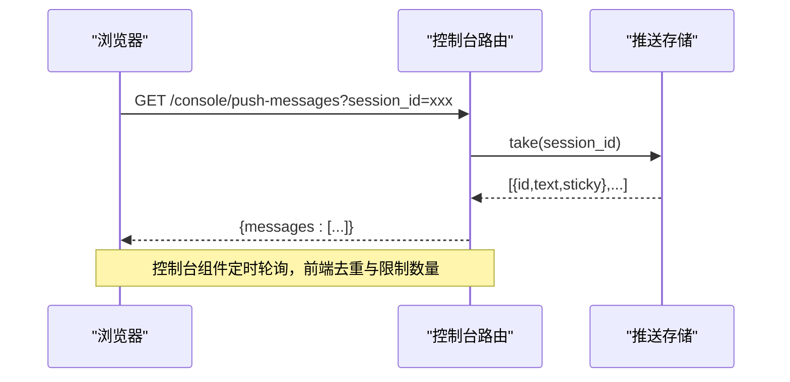

**图表来源**
- [console.py:201-215](file://src/copaw/app/routers/console.py#L201-L215)
- [console_push_store.py:41-96](file://src/copaw/app/console_push_store.py#L41-L96)
- [index.tsx:32-41](file://console/src/components/ConsoleCronBubble/index.tsx#L32-L41)

**章节来源**
- [console.py:68-215](file://src/copaw/app/routers/console.py#L68-L215)
- [console_push_store.py:22-97](file://src/copaw/app/console_push_store.py#L22-L97)
- [index.tsx:17-41](file://console/src/components/ConsoleCronBubble/index.tsx#L17-L41)

### 渠道配置与二维码授权 API
- 前端模块
  - channelApi.listChannels / updateChannels
  - channelApi.getChannelConfig / updateChannelConfig
  - channelApi.getChannelQrcode / getChannelQrcodeStatus
- 后端路由
  - GET /config/channels
  - PUT /config/channels
  - GET /config/channels/{channel_name}
  - PUT /config/channels/{channel_name}
  - GET /config/channels/{channel}/qrcode
  - GET /config/channels/{channel}/qrcode/status
- 行为说明
  - 列出与更新所有渠道配置
  - 获取单个渠道配置并支持更新
  - 获取渠道授权二维码与轮询状态（部分渠道支持）

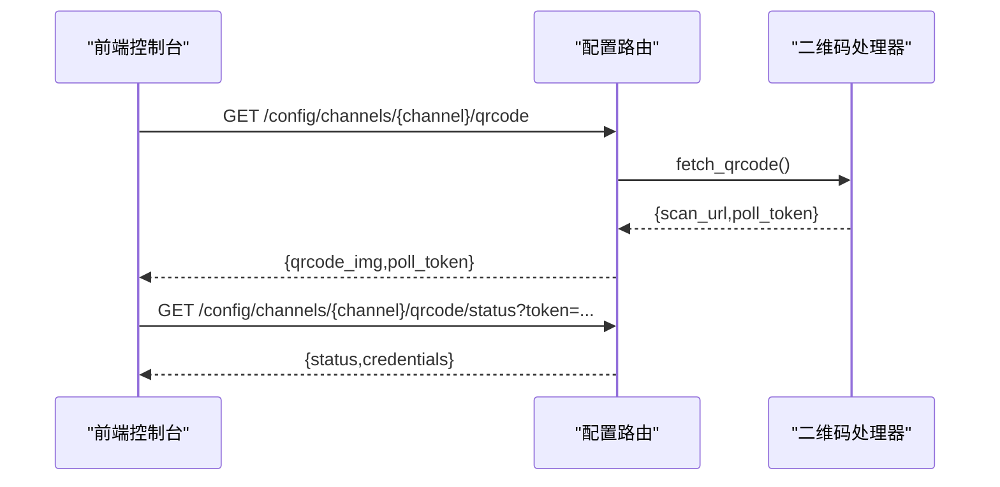

**图表来源**
- [channel.ts:4-43](file://console/src/api/modules/channel.ts#L4-L43)
- [config.py:146-169](file://src/copaw/app/routers/config.py#L146-L169)

**章节来源**
- [channel.ts:4-43](file://console/src/api/modules/channel.ts#L4-L43)
- [channels.en.md:1128-1147](file://website/public/docs/channels.en.md#L1128-L1147)

### 多渠道消息路由与批处理
- 通道管理器
  - 统一队列与消费者循环
  - 按会话 ID 合并批处理，提升吞吐
  - 优先级与命令注册联动
- 发送流程
  - send_text 将文本转为内容部件并调用通道实现
  - 通道实现负责将内容部件转换为平台特定的消息格式并发送

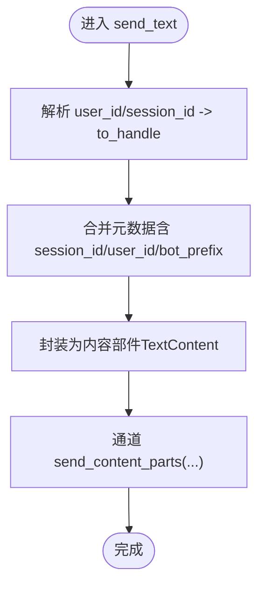

**图表来源**
- [manager.py:630-711](file://src/copaw/app/channels/manager.py#L630-L711)

**章节来源**
- [manager.py:68-711](file://src/copaw/app/channels/manager.py#L68-L711)

### 消息格式标准化与协议转换
- 统一路由标识
  - ChannelAddress：kind/id/extra，统一 to_handle 生成
- 协议接口
  - ChannelMessageConverter：构建 AgentRequest 与发送响应的协议
- 默认渠道类型
  - 内置渠道类型集合（imessage、discord、dingtalk、feishu、qq、telegram、mqtt、console、voice、xiaoyi）

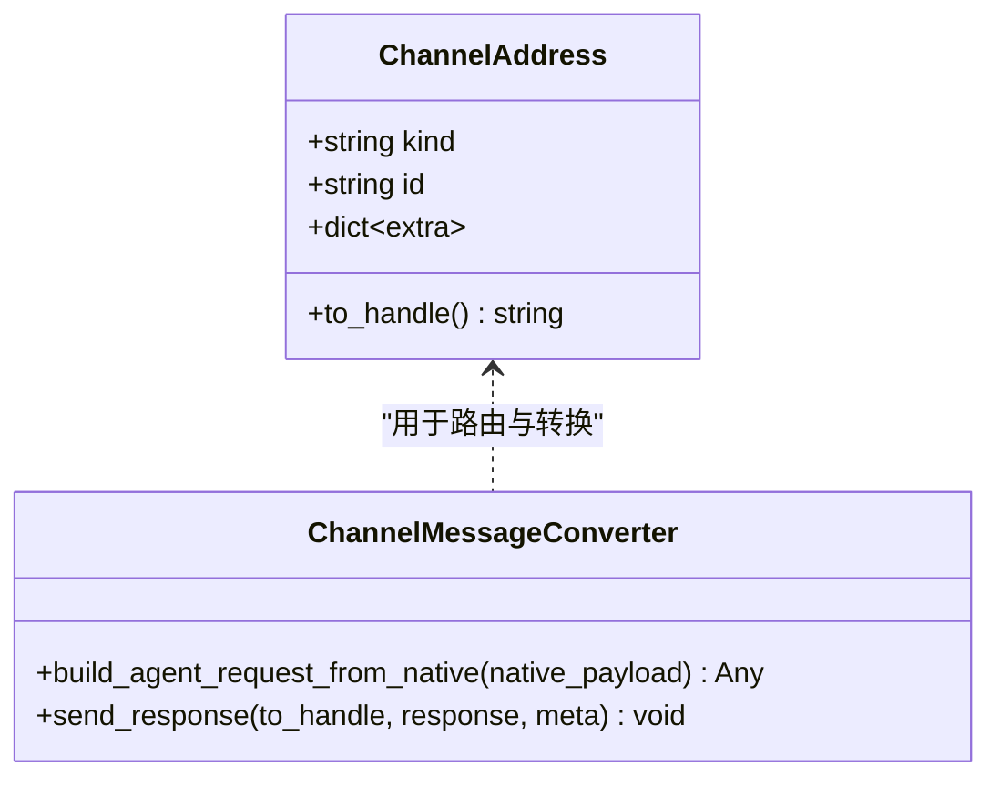

**图表来源**
- [schema.py:12-71](file://src/copaw/app/channels/schema.py#L12-L71)

**章节来源**
- [schema.py:12-71](file://src/copaw/app/channels/schema.py#L12-L71)

### 控制台推送接口实现（实时消息传输与状态同步）
- 后端
  - 控制台通道在发送文本时写入推送存储
  - 提供 /console/push-messages 拉取接口
- 前端
  - ConsoleCronBubble 组件定时轮询，限制每次新增数与可见气泡数，维护 seen 集合去重
  - 自动标题闪烁提示新消息

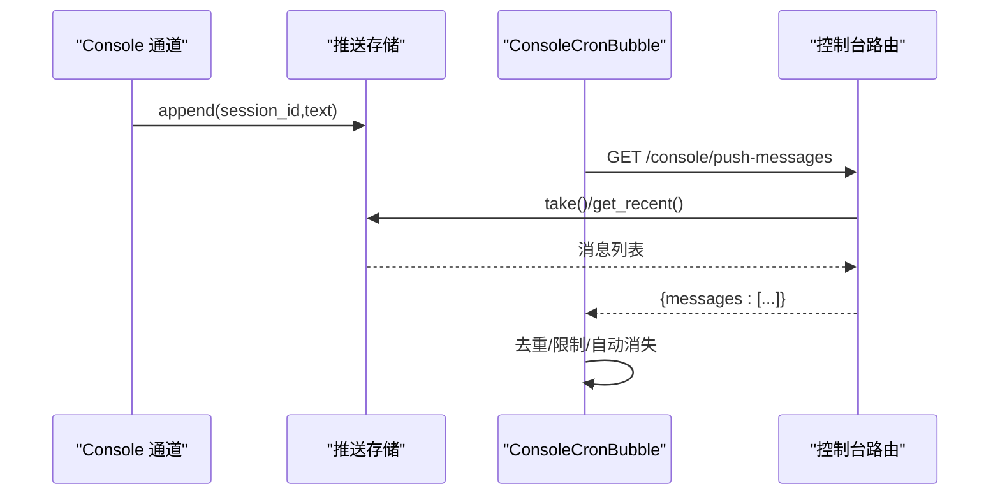

**图表来源**
- [channel.py:526-571](file://src/copaw/app/channels/console/channel.py#L526-L571)
- [console_push_store.py:22-97](file://src/copaw/app/console_push_store.py#L22-L97)
- [console.ts:8-11](file://console/src/api/modules/console.ts#L8-L11)
- [index.tsx:17-41](file://console/src/components/ConsoleCronBubble/index.tsx#L17-L41)

**章节来源**
- [channel.py:526-571](file://src/copaw/app/channels/console/channel.py#L526-L571)
- [console_push_store.py:22-97](file://src/copaw/app/console_push_store.py#L22-L97)
- [console.ts:8-11](file://console/src/api/modules/console.ts#L8-L11)
- [index.tsx:17-41](file://console/src/components/ConsoleCronBubble/index.tsx#L17-L41)

### 消息持久化、检索与归档
- 当前实现
  - 控制台推送存储为内存限流与过期清理
  - 渠道侧消息持久化由各通道实现决定（例如 iMessage 通道基于系统数据库）
- 企业版迁移与兼容
  - ReMe 记忆数据库迁移至 PostgreSQL + pgvector，提供向量搜索兼容层
  - 支持内容哈希、标签、重要性评分、归档时间等字段

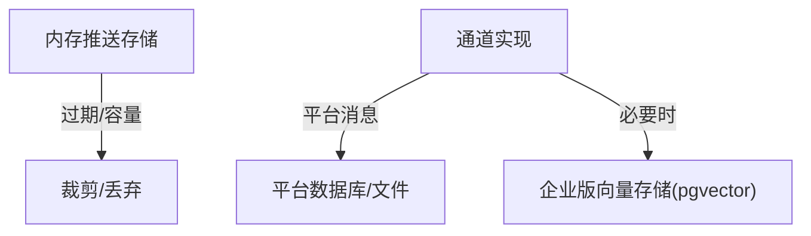

**图表来源**
- [console_push_store.py:1-97](file://src/copaw/app/console_push_store.py#L1-L97)
- [channel.py:231-265](file://src/copaw/app/channels/imessage/channel.py#L231-L265)
- [enterprise-storage-migration.md:1744-1800](file://docs/enterprise-storage-migration.md#L1744-L1800)

**章节来源**
- [console_push_store.py:1-97](file://src/copaw/app/console_push_store.py#L1-L97)
- [channel.py:231-265](file://src/copaw/app/channels/imessage/channel.py#L231-L265)
- [enterprise-storage-migration.md:1744-1800](file://docs/enterprise-storage-migration.md#L1744-L1800)

### 消息过滤、搜索与批量操作
- 前端搜索
  - 控制台聊天面板支持全文搜索，提取文本并高亮匹配片段
- 批量操作
  - 通道管理器对同会话消息进行批处理合并，减少重复处理
- 历史查看
  - 命令处理器支持按索引查看历史消息，支持截断显示与导出

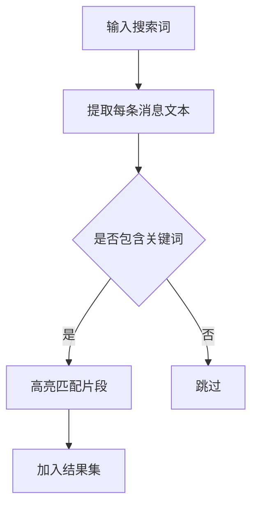

**图表来源**
- [index.tsx:113-151](file://console/src/pages/Chat/components/ChatSearchPanel/index.tsx#L113-L151)
- [manager.py:39-66](file://src/copaw/app/channels/manager.py#L39-L66)

**章节来源**
- [index.tsx:113-151](file://console/src/pages/Chat/components/ChatSearchPanel/index.tsx#L113-L151)
- [manager.py:39-66](file://src/copaw/app/channels/manager.py#L39-L66)

### 消息安全与隐私保护
- 会话与令牌
  - 用户会话与刷新令牌模型，支持撤销、过期与审计
- 前端敏感信息掩码
  - CLI 中对密钥等敏感信息进行掩码显示
- 渠道侧策略
  - iMessage 通道支持白名单/黑名单与消息大小限制

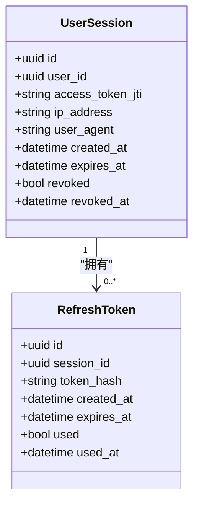

**图表来源**
- [session.py:21-116](file://src/copaw/db/models/session.py#L21-L116)

**章节来源**
- [session.py:21-116](file://src/copaw/db/models/session.py#L21-L116)
- [channels_cmd.py:182-224](file://src/copaw/cli/channels_cmd.py#L182-L224)
- [imessage/channel.py:84-368](file://src/copaw/app/channels/imessage/channel.py#L84-L368)

### 消息统计与分析
- 前端统计页面
  - 展示令牌用量汇总与按模型/日期分组统计
- 数据结构
  - TokenUsageSummary：总提示词、补全词、调用次数，按模型与日期分组明细

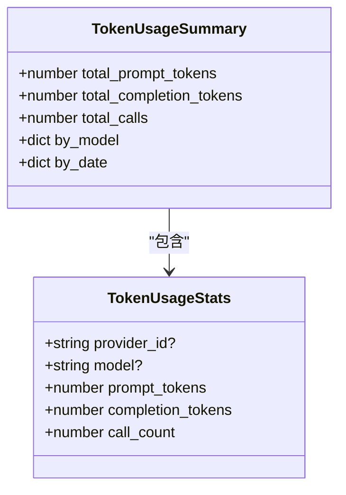

**图表来源**
- [tokenUsage.ts:1-16](file://console/src/api/types/tokenUsage.ts#L1-L16)

**章节来源**
- [tokenUsage.ts:1-16](file://console/src/api/types/tokenUsage.ts#L1-L16)
- [index.tsx:21-36](file://console/src/pages/Settings/TokenUsage/index.tsx#L21-L36)

## 依赖分析
- 消息发送路由依赖通道管理器；通道管理器再依赖具体通道实现
- 控制台路由依赖工作区与通道管理器；控制台通道依赖推送存储
- 前端控制台 API 与后端路由一一对应，前端组件轮询后端推送接口

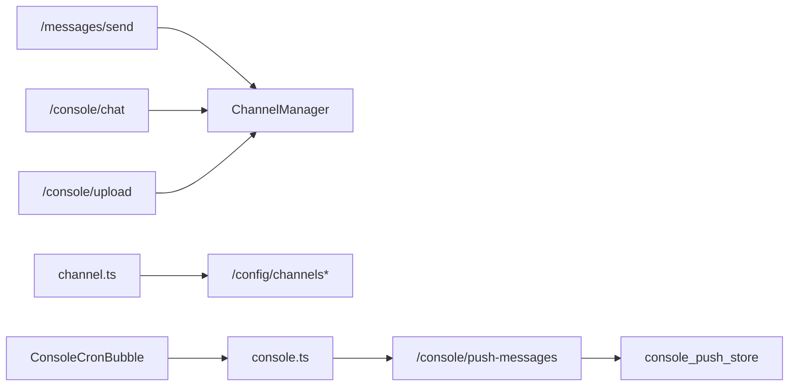

**图表来源**
- [messages.py:78-186](file://src/copaw/app/routers/messages.py#L78-L186)
- [console.py:68-215](file://src/copaw/app/routers/console.py#L68-L215)
- [console_push_store.py:22-97](file://src/copaw/app/console_push_store.py#L22-L97)
- [channel.ts:4-43](file://console/src/api/modules/channel.ts#L4-L43)
- [console.ts:8-11](file://console/src/api/modules/console.ts#L8-L11)
- [index.tsx:32-41](file://console/src/components/ConsoleCronBubble/index.tsx#L32-L41)

**章节来源**
- [messages.py:78-186](file://src/copaw/app/routers/messages.py#L78-L186)
- [console.py:68-215](file://src/copaw/app/routers/console.py#L68-L215)
- [console_push_store.py:22-97](file://src/copaw/app/console_push_store.py#L22-L97)
- [channel.ts:4-43](file://console/src/api/modules/channel.ts#L4-L43)
- [console.ts:8-11](file://console/src/api/modules/console.ts#L8-L11)
- [index.tsx:32-41](file://console/src/components/ConsoleCronBubble/index.tsx#L32-L41)

## 性能考虑
- 统一队列与批处理：通道管理器对同会话消息进行批处理，降低重复处理开销
- 限流与过期：控制台推送存储限制消息数量与保留时间，避免内存膨胀
- SSE 流式响应：控制台聊天采用 Server-Sent Events，降低延迟与连接压力
- 优先级与命令注册：根据查询内容进行优先级分类，保障关键任务及时处理

[本节为通用指导，无需特定文件引用]

## 故障排查指南
- 渠道未找到
  - 现象：发送消息时报 404
  - 排查：确认渠道名称拼写与启用状态；检查通道注册与可用渠道列表
- 通道管理器未初始化
  - 现象：发送消息时报 500
  - 排查：确认应用启动阶段已注入 MultiAgentManager
- 控制台通道不可用
  - 现象：/console/chat 返回 503
  - 排查：确认控制台通道已启用并正确注入工作区
- 文件上传过大
  - 现象：/console/upload 返回 400
  - 排查：确认文件大小不超过限制（默认 10MB）

**章节来源**
- [messages.py:113-186](file://src/copaw/app/routers/messages.py#L113-L186)
- [console.py:82-88](file://src/copaw/app/routers/console.py#L82-L88)
- [console.py:183-188](file://src/copaw/app/routers/console.py#L183-L188)

## 结论
CoPaw 的渠道与消息 API 通过统一的通道管理器与路由协议，实现了跨平台消息的标准化发送与接收；控制台推送机制提供了近实时的消息反馈；前端与后端协同，既满足了日常使用，也为扩展与定制留足空间。建议在生产环境中关注队列容量、批处理策略与会话去重，确保稳定性与性能。

[本节为总结，无需特定文件引用]

## 附录
- 渠道类型一览（前端本地化标签）
  - imessage、discord、dingtalk、feishu、qq、telegram、mqtt、mattermost、matrix、console、voice、wecom、xiaoyi、weixin、onebot
- 关键常量与阈值
  - 控制台推送存储：最大保留时长、最大消息数
  - 控制台上传：最大文件大小

**章节来源**
- [constants.ts:7-23](file://console/src/pages/Control/Channels/components/constants.ts#L7-L23)
- [console_push_store.py:18-19](file://src/copaw/app/console_push_store.py#L18-L19)
- [console.py](file://src/copaw/app/routers/console.py#L23)