# 系统运维 API

<cite>
**本文引用的文件**   
- [src/copaw/app/routers/cronjob.ts](file://console/src/api/modules/cronjob.ts)
- [src/copaw/app/crons/api.py](file://src/copaw/app/crons/api.py)
- [src/copaw/app/routers/tasks.py](file://src/copaw/app/routers/tasks.py)
- [src/copaw/app/routers/token_usage.py](file://src/copaw/app/routers/token_usage.py)
- [console/src/api/modules/tokenUsage.ts](file://console/src/api/modules/tokenUsage.ts)
- [console/src/api/types/tokenUsage.ts](file://console/src/api/types/tokenUsage.ts)
- [src/copaw/app/routers/config.py](file://src/copaw/app/routers/config.py)
- [console/src/api/modules/heartbeat.ts](file://console/src/api/modules/heartbeat.ts)
- [console/src/api/types/heartbeat.ts](file://console/src/api/types/heartbeat.ts)
- [src/copaw/app/routers/alerts.py](file://src/copaw/app/routers/alerts.py)
- [src/copaw/enterprise/audit_service.py](file://src/copaw/enterprise/audit_service.py)
- [console/src/api/modules/enterprise-audit.ts](file://console/src/api/modules/enterprise-audit.ts)
- [console/src/pages/Enterprise/Audit/AuditLog.tsx](file://console/src/pages/Enterprise/Audit/AuditLog.tsx)
- [src/copaw/app/routers/settings.py](file://src/copaw/app/routers/settings.py)
- [src/copaw/app/runner/query_error_dump.py](file://src/copaw/app/runner/query_error_dump.py)
- [docs/implementation_plan-D.md](file://docs/implementation_plan-D.md)
- [alembic/versions/002_enterprise_phase_a.py](file://alembic/versions/002_enterprise_phase_a.py)
- [scripts/migrate-to-enterprise.ps1](file://scripts/migrate-to-enterprise.ps1)
- [scripts/migrate_personal_to_enterprise.py](file://scripts/migrate_personal_to_enterprise.py)
- [docs/enterprise-storage-migration.md](file://docs/enterprise-storage-migration.md)
</cite>

## 目录
1. [简介](#简介)
2. [项目结构](#项目结构)
3. [核心组件](#核心组件)
4. [架构总览](#架构总览)
5. [详细组件分析](#详细组件分析)
6. [依赖分析](#依赖分析)
7. [性能考虑](#性能考虑)
8. [故障排查指南](#故障排查指南)
9. [结论](#结论)
10. [附录](#附录)

## 简介
本文件为 CoPaw 系统运维 API 的权威参考文档，覆盖任务管理、定时任务与作业调度、系统状态监控与健康检查、令牌使用量统计与配额管理、系统配置与动态更新、系统日志采集与审计、系统性能监控与资源使用、系统备份与恢复迁移、系统升级与回滚等运维主题。文档以“前端 API 模块 + 后端路由实现 + 类型定义”的方式组织，并提供可视化图示帮助理解调用链路与数据流。

## 项目结构
围绕系统运维相关能力，主要涉及以下层次：
- 前端 API 模块：封装对后端 REST 接口的调用，统一请求方法与参数构建。
- 后端 FastAPI 路由：暴露运维接口，处理业务逻辑、鉴权与数据持久化。
- 类型定义：前后端共享的数据模型，保证契约一致。
- 运维工具与脚本：迁移、备份、回滚等操作支持。
- 监控与可观测性：Prometheus 指标与 Grafana 仪表盘（部署侧）。

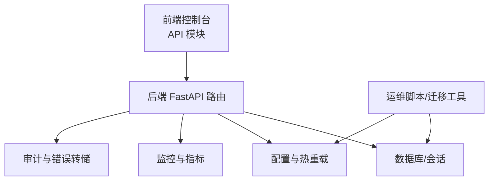

**章节来源**
- [src/copaw/app/routers/cronjob.ts:1-53](file://console/src/api/modules/cronjob.ts#L1-L53)
- [src/copaw/app/crons/api.py:1-117](file://src/copaw/app/crons/api.py#L1-L117)
- [src/copaw/app/routers/tasks.py:1-252](file://src/copaw/app/routers/tasks.py#L1-L252)
- [src/copaw/app/routers/token_usage.py:1-62](file://src/copaw/app/routers/token_usage.py#L1-L62)
- [src/copaw/app/routers/config.py:1-642](file://src/copaw/app/routers/config.py#L1-L642)
- [src/copaw/app/routers/alerts.py:1-196](file://src/copaw/app/routers/alerts.py#L1-L196)
- [src/copaw/enterprise/audit_service.py:1-121](file://src/copaw/enterprise/audit_service.py#L1-L121)
- [src/copaw/app/runner/query_error_dump.py:1-105](file://src/copaw/app/runner/query_error_dump.py#L1-L105)
- [docs/implementation_plan-D.md:30-66](file://docs/implementation_plan-D.md#L30-L66)

## 核心组件
- 定时任务与作业调度：提供创建、查询、暂停/恢复、立即执行、查看状态等能力。
- 企业任务管理：支持任务列表、创建、查询、更新、状态变更、删除以及评论管理。
- 令牌使用量统计：按日期/模型/供应商聚合统计，支持时间范围与过滤。
- 系统配置与动态更新：通道配置、心跳配置、安全策略、技能扫描白名单等可在线更新并热重载。
- 健康检查与监控：Prometheus 指标端点与 Grafana 仪表盘。
- 审计日志与错误转储：结构化审计日志查询与异常上下文转储。
- 备份、恢复与迁移：数据库迁移脚本与回滚策略文档。

**章节来源**
- [src/copaw/app/crons/api.py:1-117](file://src/copaw/app/crons/api.py#L1-L117)
- [src/copaw/app/routers/tasks.py:1-252](file://src/copaw/app/routers/tasks.py#L1-L252)
- [src/copaw/app/routers/token_usage.py:1-62](file://src/copaw/app/routers/token_usage.py#L1-L62)
- [src/copaw/app/routers/config.py:1-642](file://src/copaw/app/routers/config.py#L1-L642)
- [src/copaw/app/routers/alerts.py:1-196](file://src/copaw/app/routers/alerts.py#L1-L196)
- [src/copaw/enterprise/audit_service.py:1-121](file://src/copaw/enterprise/audit_service.py#L1-L121)
- [src/copaw/app/runner/query_error_dump.py:1-105](file://src/copaw/app/runner/query_error_dump.py#L1-L105)
- [docs/implementation_plan-D.md:30-66](file://docs/implementation_plan-D.md#L30-L66)

## 架构总览
下图展示运维相关的关键交互：前端通过 API 模块调用后端路由，后端路由访问数据库或配置存储，部分接口触发热重载或异步任务。

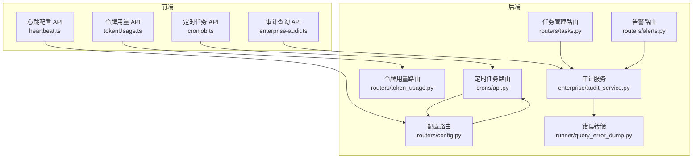

**图表来源**
- [src/copaw/app/crons/api.py:1-117](file://src/copaw/app/crons/api.py#L1-L117)
- [src/copaw/app/routers/tasks.py:1-252](file://src/copaw/app/routers/tasks.py#L1-L252)
- [src/copaw/app/routers/token_usage.py:1-62](file://src/copaw/app/routers/token_usage.py#L1-L62)
- [src/copaw/app/routers/config.py:1-642](file://src/copaw/app/routers/config.py#L1-L642)
- [src/copaw/app/routers/alerts.py:1-196](file://src/copaw/app/routers/alerts.py#L1-L196)
- [src/copaw/enterprise/audit_service.py:1-121](file://src/copaw/enterprise/audit_service.py#L1-L121)
- [src/copaw/app/runner/query_error_dump.py:1-105](file://src/copaw/app/runner/query_error_dump.py#L1-L105)

**章节来源**
- [src/copaw/app/crons/api.py:1-117](file://src/copaw/app/crons/api.py#L1-L117)
- [src/copaw/app/routers/tasks.py:1-252](file://src/copaw/app/routers/tasks.py#L1-L252)
- [src/copaw/app/routers/token_usage.py:1-62](file://src/copaw/app/routers/token_usage.py#L1-L62)
- [src/copaw/app/routers/config.py:1-642](file://src/copaw/app/routers/config.py#L1-L642)
- [src/copaw/app/routers/alerts.py:1-196](file://src/copaw/app/routers/alerts.py#L1-L196)
- [src/copaw/enterprise/audit_service.py:1-121](file://src/copaw/enterprise/audit_service.py#L1-L121)
- [src/copaw/app/runner/query_error_dump.py:1-105](file://src/copaw/app/runner/query_error_dump.py#L1-L105)

## 详细组件分析

### 定时任务与作业调度
- 前端 API 模块提供列出、创建、获取、替换、删除、暂停、恢复、立即执行、触发与状态查询等方法。
- 后端路由基于工作区上下文获取 CronManager，执行相应操作并返回标准响应。
- 支持作业状态视图（含当前状态、最近运行时间等）。

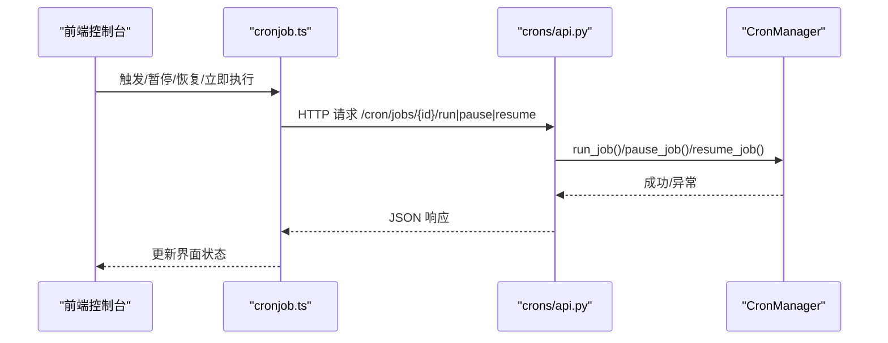

**图表来源**
- [src/copaw/app/crons/api.py:76-105](file://src/copaw/app/crons/api.py#L76-L105)
- [console/src/api/modules/cronjob.ts:31-52](file://console/src/api/modules/cronjob.ts#L31-L52)

**章节来源**
- [console/src/api/modules/cronjob.ts:1-53](file://console/src/api/modules/cronjob.ts#L1-L53)
- [src/copaw/app/crons/api.py:1-117](file://src/copaw/app/crons/api.py#L1-L117)

### 企业任务管理
- 提供任务的分页列表、创建、详情、更新、状态变更、删除以及评论的增删查。
- 支持多条件过滤（负责人、状态、优先级、工作流等），并记录审计事件。

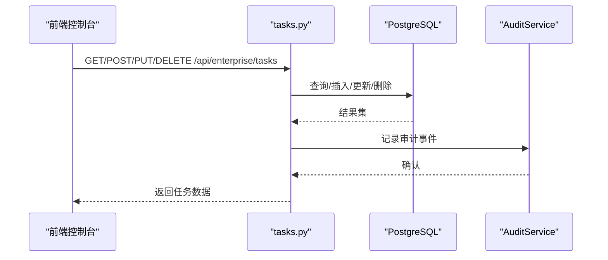

**图表来源**
- [src/copaw/app/routers/tasks.py:72-207](file://src/copaw/app/routers/tasks.py#L72-L207)

**章节来源**
- [src/copaw/app/routers/tasks.py:1-252](file://src/copaw/app/routers/tasks.py#L1-L252)

### 令牌使用量统计与配额
- 前端通过 tokenUsage.ts 发起带日期范围与可选模型/供应商过滤的请求。
- 后端解析日期范围，调用令牌用量管理器生成汇总结果（按日期、模型、供应商维度）。

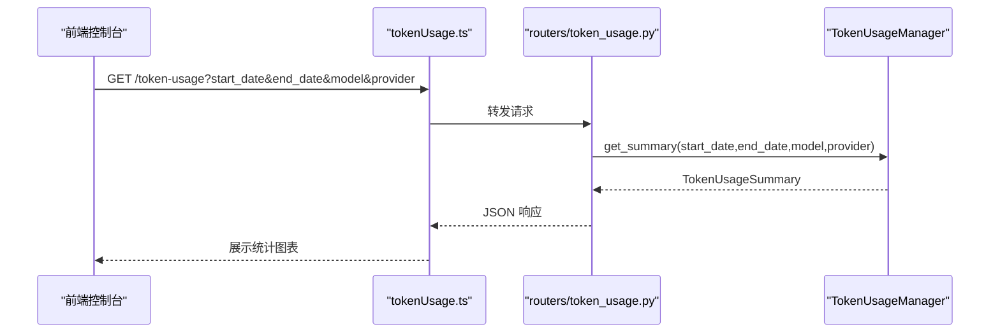

**图表来源**
- [console/src/api/modules/tokenUsage.ts:17-19](file://console/src/api/modules/tokenUsage.ts#L17-L19)
- [src/copaw/app/routers/token_usage.py:23-61](file://src/copaw/app/routers/token_usage.py#L23-L61)
- [console/src/api/types/tokenUsage.ts:1-16](file://console/src/api/types/tokenUsage.ts#L1-L16)

**章节来源**
- [console/src/api/modules/tokenUsage.ts:1-20](file://console/src/api/modules/tokenUsage.ts#L1-L20)
- [console/src/api/types/tokenUsage.ts:1-16](file://console/src/api/types/tokenUsage.ts#L1-L16)
- [src/copaw/app/routers/token_usage.py:1-62](file://src/copaw/app/routers/token_usage.py#L1-L62)

### 系统配置与动态更新
- 通道配置：支持列出所有可用通道、批量更新、按通道名获取/更新；更新后触发异步热重载。
- 心跳配置：获取/更新心跳间隔、目标、活跃时段等；更新后异步重新调度。
- 安全策略：工具守卫、文件守卫、技能扫描配置与白名单维护。
- UI 设置：语言设置（无需鉴权）。

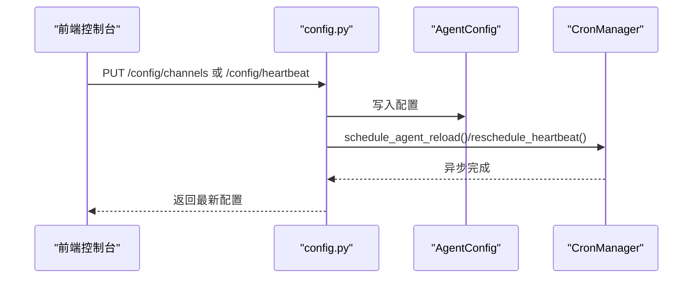

**图表来源**
- [src/copaw/app/routers/config.py:116-140](file://src/copaw/app/routers/config.py#L116-L140)
- [src/copaw/app/routers/config.py:303-342](file://src/copaw/app/routers/config.py#L303-L342)

**章节来源**
- [src/copaw/app/routers/config.py:1-642](file://src/copaw/app/routers/config.py#L1-L642)
- [console/src/api/modules/heartbeat.ts:1-12](file://console/src/api/modules/heartbeat.ts#L1-L12)
- [console/src/api/types/heartbeat.ts:1-11](file://console/src/api/types/heartbeat.ts#L1-L11)

### 健康检查与监控
- Prometheus 指标端点：在实现计划中明确暴露 /metrics，建议生产环境限制访问。
- Grafana 仪表盘：随部署包提供预配置仪表盘，用于可视化企业级指标。

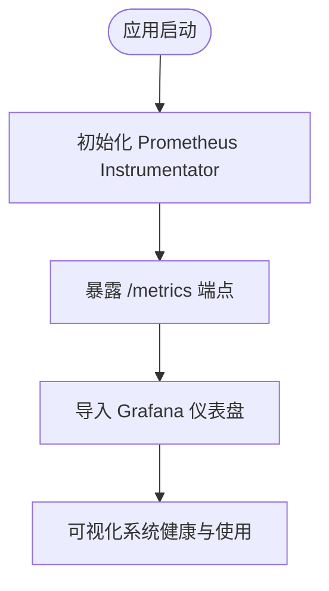

**图表来源**
- [docs/implementation_plan-D.md:30-66](file://docs/implementation_plan-D.md#L30-L66)

**章节来源**
- [docs/implementation_plan-D.md:30-66](file://docs/implementation_plan-D.md#L30-L66)

### 审计日志与错误转储
- 审计查询：支持按用户、动作类型、资源类型、结果、敏感标记、时间范围等筛选，分页返回。
- 错误转储：捕获异常、请求上下文与代理状态，写入临时 JSON 文件，便于离线诊断。

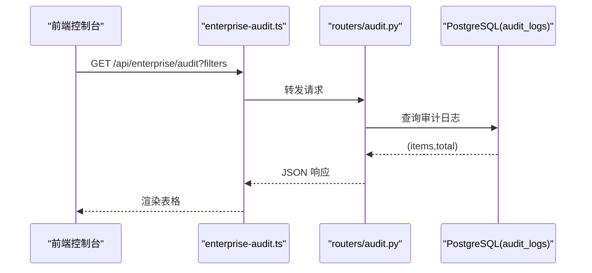

**图表来源**
- [console/src/api/modules/enterprise-audit.ts:25-42](file://console/src/api/modules/enterprise-audit.ts#L25-L42)
- [src/copaw/app/routers/audit.py:1-18](file://src/copaw/app/routers/audit.py#L1-L18)
- [src/copaw/enterprise/audit_service.py:88-121](file://src/copaw/enterprise/audit_service.py#L88-L121)

**章节来源**
- [console/src/api/modules/enterprise-audit.ts:1-43](file://console/src/api/modules/enterprise-audit.ts#L1-L43)
- [console/src/pages/Enterprise/Audit/AuditLog.tsx:1-52](file://console/src/pages/Enterprise/Audit/AuditLog.tsx#L1-L52)
- [src/copaw/enterprise/audit_service.py:1-121](file://src/copaw/enterprise/audit_service.py#L1-L121)

### 告警规则与事件
- 规则管理：创建、查询、更新、删除告警规则；支持按激活状态过滤。
- 事件查询：按规则类型、时间范围分页查询告警事件。
- 测试通知：向已配置渠道发送测试消息。

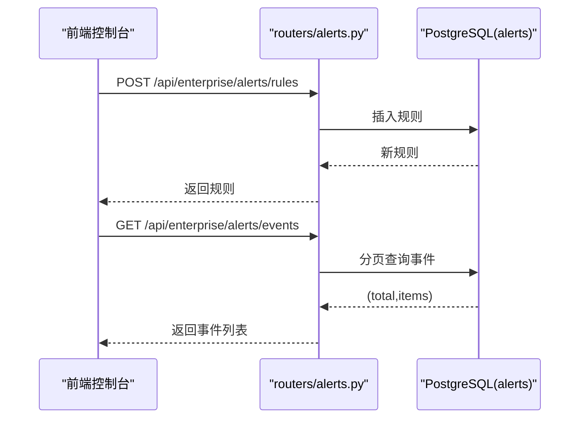

**图表来源**
- [src/copaw/app/routers/alerts.py:74-183](file://src/copaw/app/routers/alerts.py#L74-L183)

**章节来源**
- [src/copaw/app/routers/alerts.py:1-196](file://src/copaw/app/routers/alerts.py#L1-L196)

### 备份、恢复与迁移
- 数据库迁移：提供从个人版到企业版的迁移脚本与 PowerShell 脚本，支持干跑、跳过认证/Agent 迁移等选项。
- 回滚策略：定义回滚决策流程（监控告警/人工发现/自动检测）、影响评估与执行步骤（配置回退、数据回退、代码回退、数据库回退）。
- 存储与对象存储：定义不同数据类型的备份策略与保留期。

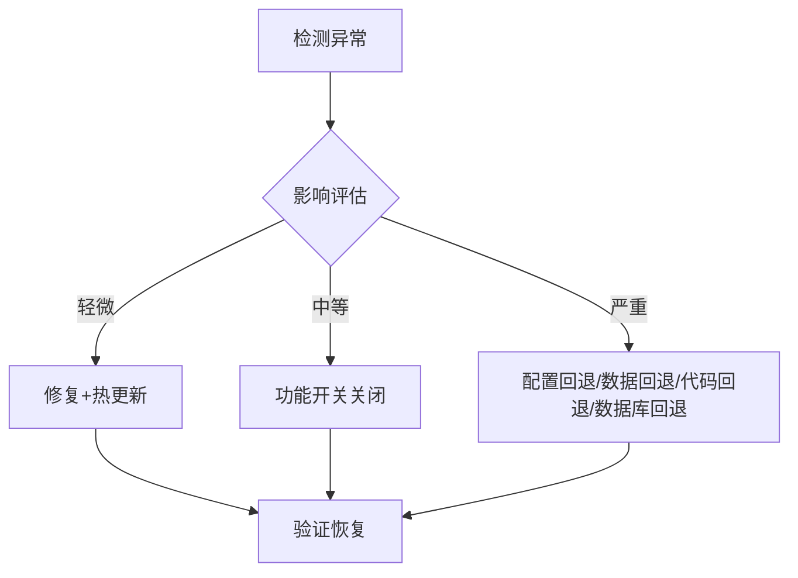

**图表来源**
- [docs/enterprise-storage-migration.md:2893-2918](file://docs/enterprise-storage-migration.md#L2893-L2918)

**章节来源**
- [scripts/migrate-to-enterprise.ps1:152-187](file://scripts/migrate-to-enterprise.ps1#L152-L187)
- [scripts/migrate_personal_to_enterprise.py:100-138](file://scripts/migrate_personal_to_enterprise.py#L100-L138)
- [docs/enterprise-storage-migration.md:2893-2932](file://docs/enterprise-storage-migration.md#L2893-L2932)

## 依赖分析
- 组件耦合
  - 定时任务路由依赖工作区上下文中的 CronManager，确保每个 Agent 的作业隔离。
  - 配置路由依赖 AgentConfig 与热重载调度器，更新后异步生效。
  - 审计路由依赖审计服务与数据库，提供结构化审计日志查询。
- 外部依赖
  - Prometheus 指标（实现计划中定义）。
  - PostgreSQL（审计、告警、任务等实体）。
  - Alembic 迁移（数据库结构演进）。

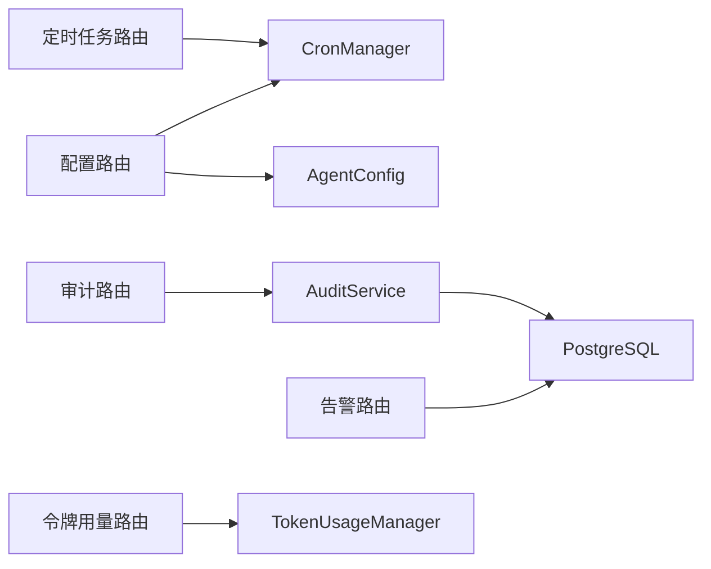

**图表来源**
- [src/copaw/app/crons/api.py:13-25](file://src/copaw/app/crons/api.py#L13-L25)
- [src/copaw/app/routers/config.py:137-140](file://src/copaw/app/routers/config.py#L137-L140)
- [src/copaw/app/routers/alerts.py:1-23](file://src/copaw/app/routers/alerts.py#L1-L23)
- [src/copaw/app/routers/token_usage.py:1-10](file://src/copaw/app/routers/token_usage.py#L1-L10)

**章节来源**
- [src/copaw/app/crons/api.py:1-117](file://src/copaw/app/crons/api.py#L1-L117)
- [src/copaw/app/routers/config.py:1-642](file://src/copaw/app/routers/config.py#L1-L642)
- [src/copaw/app/routers/alerts.py:1-196](file://src/copaw/app/routers/alerts.py#L1-L196)
- [src/copaw/app/routers/token_usage.py:1-62](file://src/copaw/app/routers/token_usage.py#L1-L62)

## 性能考虑
- 分页与过滤：审计与告警事件查询支持分页与多条件过滤，避免一次性拉取大量数据。
- 异步热重载：配置更新后采用异步任务进行热重载，避免阻塞主请求路径。
- 指标暴露：/metrics 端点仅用于内部监控，建议在生产环境限制访问范围。

[本节为通用指导，不直接分析具体文件]

## 故障排查指南
- 审计日志查询
  - 使用审计查询 API，结合时间范围、敏感标记、动作类型等条件缩小范围。
  - 参考前端页面联动筛选，提升定位效率。
- 错误转储
  - 当出现查询异常时，系统会生成包含异常堆栈、请求上下文与代理状态的 JSON 文件，便于离线分析。
- 健康检查
  - 通过 /metrics 端点观察请求计数、延迟与错误率，结合 Grafana 仪表盘进行趋势分析。

**章节来源**
- [console/src/api/modules/enterprise-audit.ts:25-42](file://console/src/api/modules/enterprise-audit.ts#L25-L42)
- [console/src/pages/Enterprise/Audit/AuditLog.tsx:1-52](file://console/src/pages/Enterprise/Audit/AuditLog.tsx#L1-L52)
- [src/copaw/app/runner/query_error_dump.py:48-104](file://src/copaw/app/runner/query_error_dump.py#L48-L104)
- [docs/implementation_plan-D.md:30-66](file://docs/implementation_plan-D.md#L30-L66)

## 结论
本文档系统梳理了 CoPaw 的系统运维 API，涵盖任务与调度、配置与动态更新、监控与审计、备份与迁移等关键运维场景。通过前后端契约清晰的 API 模块与路由实现，配合异步热重载与结构化审计，能够满足企业级系统的可观测性与可维护性需求。建议在生产环境中严格控制 /metrics 端点访问，并完善备份与回滚策略演练。

[本节为总结性内容，不直接分析具体文件]

## 附录

### API 一览表（运维相关）
- 定时任务
  - GET /cron/jobs
  - GET /cron/jobs/{job_id}
  - POST /cron/jobs
  - PUT /cron/jobs/{job_id}
  - DELETE /cron/jobs/{job_id}
  - POST /cron/jobs/{job_id}/pause
  - POST /cron/jobs/{job_id}/resume
  - POST /cron/jobs/{job_id}/run
  - GET /cron/jobs/{job_id}/state
- 企业任务
  - GET /api/enterprise/tasks
  - POST /api/enterprise/tasks
  - GET /api/enterprise/tasks/{id}
  - PUT /api/enterprise/tasks/{id}
  - PUT /api/enterprise/tasks/{id}/status
  - DELETE /api/enterprise/tasks/{id}
  - GET /api/enterprise/tasks/{id}/comments
  - POST /api/enterprise/tasks/{id}/comments
- 令牌用量
  - GET /token-usage?start_date&end_date&model&provider
- 系统配置
  - GET /config/channels
  - PUT /config/channels
  - GET /config/channels/{channel_name}
  - PUT /config/channels/{channel_name}
  - GET /config/heartbeat
  - PUT /config/heartbeat
  - GET /config/security/tool-guard
  - PUT /config/security/tool-guard
  - GET /config/security/file-guard
  - PUT /config/security/file-guard
  - GET /config/security/skill-scanner
  - PUT /config/security/skill-scanner
  - GET /config/security/skill-scanner/blocked-history
  - DELETE /config/security/skill-scanner/blocked-history
  - DELETE /config/security/skill-scanner/blocked-history/{index}
  - POST /config/security/skill-scanner/whitelist
  - DELETE /config/security/skill-scanner/whitelist/{skill_name}
  - GET /settings/language
  - PUT /settings/language
- 健康检查与监控
  - GET /metrics（实现计划中定义）
- 审计日志
  - GET /api/enterprise/audit
- 告警规则与事件
  - GET /api/enterprise/alerts/rules
  - POST /api/enterprise/alerts/rules
  - GET /api/enterprise/alerts/rules/{rule_id}
  - PUT /api/enterprise/alerts/rules/{rule_id}
  - DELETE /api/enterprise/alerts/rules/{rule_id}
  - GET /api/enterprise/alerts/events
  - POST /api/enterprise/alerts/test

**章节来源**
- [src/copaw/app/crons/api.py:28-116](file://src/copaw/app/crons/api.py#L28-L116)
- [src/copaw/app/routers/tasks.py:72-251](file://src/copaw/app/routers/tasks.py#L72-L251)
- [src/copaw/app/routers/token_usage.py:23-61](file://src/copaw/app/routers/token_usage.py#L23-L61)
- [src/copaw/app/routers/config.py:64-641](file://src/copaw/app/routers/config.py#L64-L641)
- [src/copaw/app/routers/alerts.py:74-195](file://src/copaw/app/routers/alerts.py#L74-L195)
- [src/copaw/app/routers/audit.py:1-18](file://src/copaw/app/routers/audit.py#L1-L18)
- [docs/implementation_plan-D.md:30-66](file://docs/implementation_plan-D.md#L30-L66)