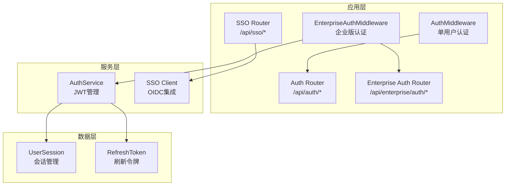
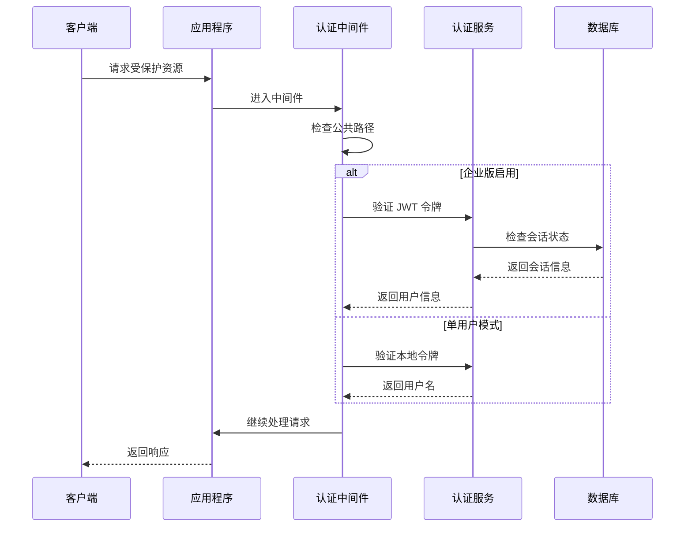
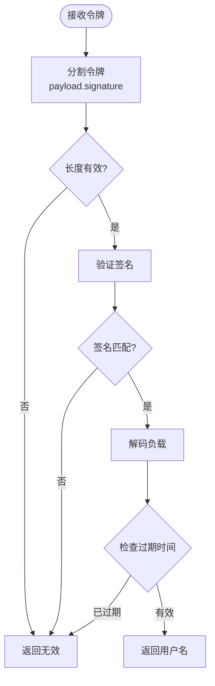
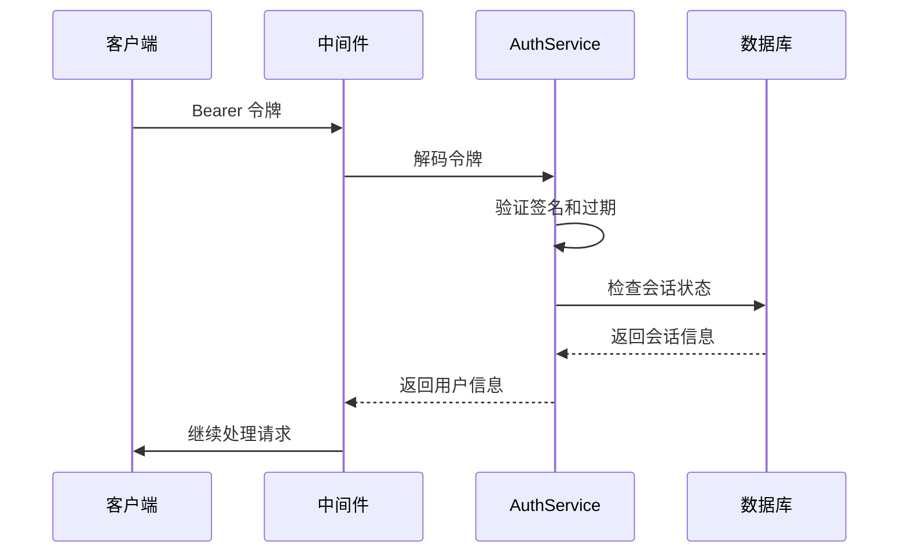
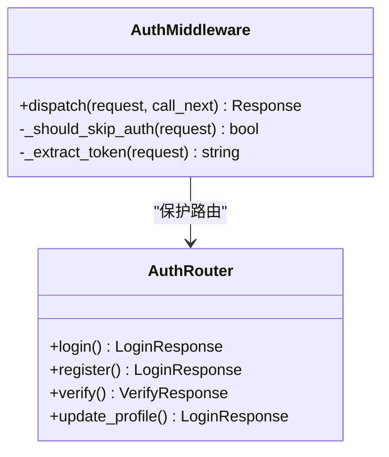
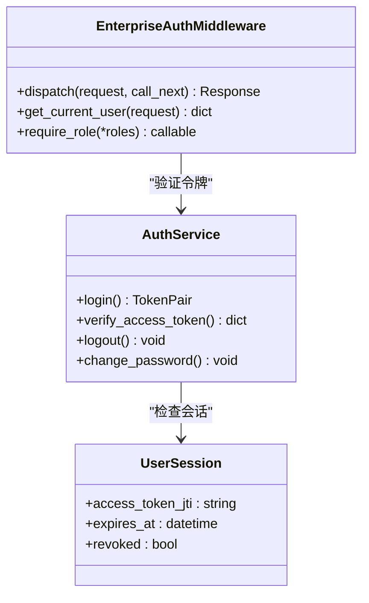
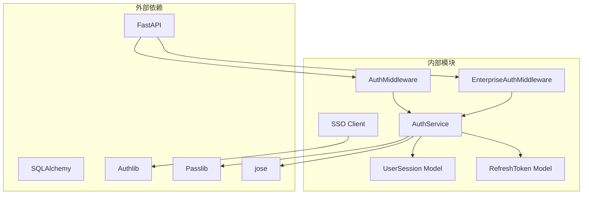
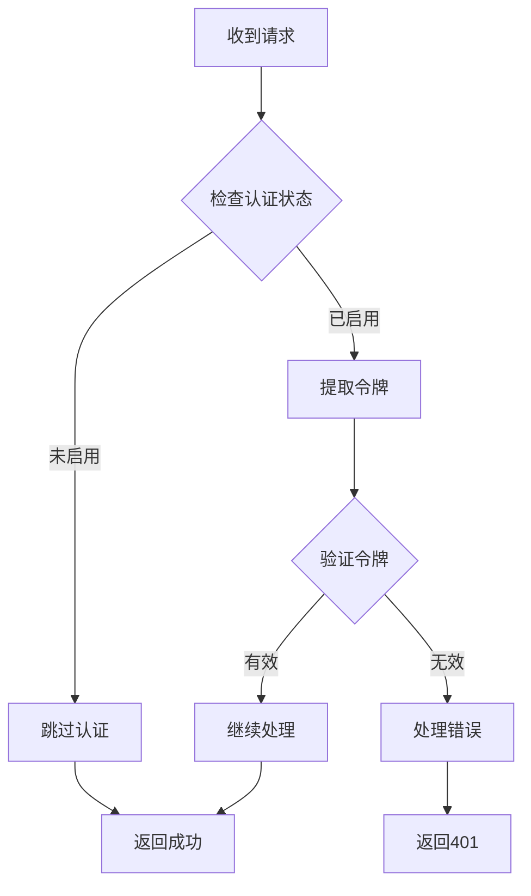

# 认证与授权 API

<cite>
**本文档引用的文件**
- [auth.py](file://src/copaw/app/auth.py)
- [auth.py](file://src/copaw/app/routers/auth.py)
- [enterprise_auth.py](file://src/copaw/app/routers/enterprise_auth.py)
- [auth_service.py](file://src/copaw/enterprise/auth_service.py)
- [middleware.py](file://src/copaw/enterprise/middleware.py)
- [sso.py](file://src/copaw/app/routers/sso.py)
- [sso_client.py](file://src/copaw/enterprise/sso_client.py)
- [_app.py](file://src/copaw/app/_app.py)
- [session.py](file://src/copaw/db/models/session.py)
- [auth.ts](file://console/src/api/modules/auth.ts)
- [request.ts](file://console/src/api/request.ts)
- [config.ts](file://console/src/api/config.ts)
</cite>

## 目录
1. [简介](#简介)
2. [项目结构](#项目结构)
3. [核心组件](#核心组件)
4. [架构概览](#架构概览)
5. [详细组件分析](#详细组件分析)
6. [依赖关系分析](#依赖关系分析)
7. [性能考虑](#性能考虑)
8. [故障排除指南](#故障排除指南)
9. [结论](#结论)

## 简介

CoPaw 提供了两套认证与授权系统：单用户模式（Legacy）和企业版多用户模式（Enterprise）。本文档详细介绍了认证相关的 API 接口，包括用户登录、注册、令牌验证、密码管理等功能，以及企业版 SSO 单点登录集成。

## 项目结构

CoPaw 的认证系统主要分布在以下模块中：



**图表来源**
- [auth.py:371-441](file://src/copaw/app/auth.py#L371-L441)
- [middleware.py:57-191](file://src/copaw/enterprise/middleware.py#L57-L191)
- [auth_service.py:107-367](file://src/copaw/enterprise/auth_service.py#L107-L367)

**章节来源**
- [auth.py:1-441](file://src/copaw/app/auth.py#L1-L441)
- [_app.py:517-524](file://src/copaw/app/_app.py#L517-L524)

## 核心组件

### 单用户认证系统

单用户认证系统适用于个人使用场景，支持基本的用户名密码认证和简单的令牌管理。

**章节来源**
- [auth.py:44-166](file://src/copaw/app/auth.py#L44-L166)

### 企业版认证系统

企业版认证系统提供多用户支持、JWT 令牌管理、会话控制和高级安全功能。

**章节来源**
- [auth_service.py:107-367](file://src/copaw/enterprise/auth_service.py#L107-L367)
- [enterprise_auth.py:1-234](file://src/copaw/app/routers/enterprise_auth.py#L1-L234)

### SSO 单点登录系统

企业版支持通过 OIDC 协议集成外部身份提供商。

**章节来源**
- [sso.py:1-111](file://src/copaw/app/routers/sso.py#L1-L111)
- [sso_client.py:1-44](file://src/copaw/enterprise/sso_client.py#L1-L44)

## 架构概览

CoPaw 的认证架构采用分层设计，根据部署模式自动选择合适的认证方案：



**图表来源**
- [_app.py:517-524](file://src/copaw/app/_app.py#L517-L524)
- [middleware.py:69-106](file://src/copaw/enterprise/middleware.py#L69-L106)
- [auth.py:371-403](file://src/copaw/app/auth.py#L371-L403)

## 详细组件分析

### 单用户认证 API

#### 登录接口

**HTTP 方法**: POST  
**URL 路径**: `/api/auth/login`  
**请求参数**:
- `username`: 用户名 (字符串)
- `password`: 密码 (字符串)

**响应格式**:
```json
{
  "token": "string",
  "username": "string"
}
```

**错误处理**:
- 401 错误: 无效凭据
- 403 错误: 认证未启用

**章节来源**
- [auth.py:43-53](file://src/copaw/app/routers/auth.py#L43-L53)

#### 注册接口

**HTTP 方法**: POST  
**URL 路径**: `/api/auth/register`  
**请求参数**:
- `username`: 用户名 (字符串)
- `password`: 密码 (字符串)

**响应格式**:
```json
{
  "token": "string",
  "username": "string"
}
```

**错误处理**:
- 403 错误: 认证未启用或已存在用户
- 400 错误: 用户名或密码为空
- 409 错误: 注册失败

**章节来源**
- [auth.py:56-85](file://src/copaw/app/routers/auth.py#L56-L85)

#### 状态检查接口

**HTTP 方法**: GET  
**URL 路径**: `/api/auth/status`

**响应格式**:
```json
{
  "enabled": true,
  "has_users": false,
  "is_enterprise": false
}
```

**章节来源**
- [auth.py:88-122](file://src/copaw/app/routers/auth.py#L88-L122)

#### 令牌验证接口

**HTTP 方法**: GET  
**URL 路径**: `/api/auth/verify`

**响应格式**:
```json
{
  "valid": true,
  "username": "string"
}
```

**错误处理**:
- 401 错误: 缺少令牌或令牌无效

**章节来源**
- [auth.py:125-143](file://src/copaw/app/routers/auth.py#L125-L143)

#### 更新配置接口

**HTTP 方法**: POST  
**URL 路径**: `/api/auth/update-profile`

**请求参数**:
- `current_password`: 当前密码 (字符串)
- `new_username`: 新用户名 (可选)
- `new_password`: 新密码 (可选)

**响应格式**:
```json
{
  "token": "string",
  "username": "string"
}
```

**错误处理**:
- 403 错误: 认证未启用或无用户
- 400 错误: 参数无效
- 401 错误: 当前密码不正确

**章节来源**
- [auth.py:152-203](file://src/copaw/app/routers/auth.py#L152-L203)

### 企业版认证 API

#### 登录接口

**HTTP 方法**: POST  
**URL 路径**: `/api/enterprise/auth/login`

**请求参数**:
- `username`: 用户名 (字符串)
- `password`: 密码 (字符串)
- `mfa_code`: MFA 代码 (可选)

**响应格式**:
```json
{
  "access_token": "string",
  "refresh_token": "string",
  "token_type": "bearer",
  "expires_in": 3600,
  "user_id": "string",
  "username": "string",
  "roles": ["string"]
}
```

**错误处理**:
- 428 错误: 需要 MFA 代码
- 401 错误: 登录失败
- 409 错误: 用户名已存在

**章节来源**
- [enterprise_auth.py:61-98](file://src/copaw/app/routers/enterprise_auth.py#L61-L98)

#### 注册接口

**HTTP 方法**: POST  
**URL 路径**: `/api/enterprise/auth/register`

**请求参数**:
- `username`: 用户名 (3-100 字符)
- `password`: 密码 (至少 8 字符)
- `email`: 邮箱 (可选)
- `display_name`: 显示名称 (可选)

**响应格式**:
```json
{
  "id": "string",
  "username": "string",
  "email": "string",
  "display_name": "string"
}
```

**章节来源**
- [enterprise_auth.py:123-149](file://src/copaw/app/routers/enterprise_auth.py#L123-L149)

#### 登出接口

**HTTP 方法**: POST  
**URL 路径**: `/api/enterprise/auth/logout`

**响应格式**:
```json
{
  "detail": "Logged out"
}
```

**章节来源**
- [enterprise_auth.py:153-167](file://src/copaw/app/routers/enterprise_auth.py#L153-L167)

#### 获取当前用户信息

**HTTP 方法**: GET  
**URL 路径**: `/api/enterprise/auth/me`

**响应格式**:
```json
{
  "user_id": "string",
  "username": "string",
  "roles": ["string"],
  "jti": "string"
}
```

**章节来源**
- [enterprise_auth.py:170-173](file://src/copaw/app/routers/enterprise_auth.py#L170-L173)

#### 修改密码

**HTTP 方法**: PUT  
**URL 路径**: `/api/enterprise/auth/password`

**请求参数**:
- `current_password`: 当前密码 (字符串)
- `new_password`: 新密码 (至少 8 字符)

**响应格式**:
```json
{
  "detail": "Password updated"
}
```

**错误处理**:
- 400 错误: 当前密码不正确

**章节来源**
- [enterprise_auth.py:176-202](file://src/copaw/app/routers/enterprise_auth.py#L176-L202)

#### MFA 设置

**HTTP 方法**: POST  
**URL 路径**: `/api/enterprise/auth/mfa/setup`

**响应格式**:
```json
{
  "secret": "string",
  "otpauth_url": "string"
}
```

**章节来源**
- [enterprise_auth.py:205-209](file://src/copaw/app/routers/enterprise_auth.py#L205-L209)

#### MFA 验证

**HTTP 方法**: POST  
**URL 路径**: `/api/enterprise/auth/mfa/verify`

**请求参数**:
- `secret`: 秘钥 (字符串)
- `code`: 验证码 (字符串)

**响应格式**:
```json
{
  "detail": "MFA enabled"
}
```

**错误处理**:
- 400 错误: 验证码无效

**章节来源**
- [enterprise_auth.py:212-233](file://src/copaw/app/routers/enterprise_auth.py#L212-L233)

### SSO 单点登录 API

#### SSO 登录

**HTTP 方法**: GET  
**URL 路径**: `/api/sso/login/{provider}`

**响应**: 重定向到身份提供商的授权页面

**章节来源**
- [sso.py:24-35](file://src/copaw/app/routers/sso.py#L24-L35)

#### SSO 回调

**HTTP 方法**: GET  
**URL 路径**: `/api/sso/callback/{provider}`

**响应格式**:
```json
{
  "success": true,
  "message": "SSO authentication successful.",
  "access_token": "string",
  "token_type": "bearer",
  "expires_in": 3600
}
```

**错误处理**:
- 404 错误: SSO 提供商未配置
- 400 错误: SSO 提供商认证失败

**章节来源**
- [sso.py:38-110](file://src/copaw/app/routers/sso.py#L38-L110)

### Bearer Token 认证机制

#### 令牌生成

CoPaw 支持两种令牌生成方式：

1. **单用户模式**: 使用 HMAC-SHA256 签名的简单令牌
2. **企业版模式**: 使用 HS256 算法的 JWT 令牌

**章节来源**
- [auth.py:121-139](file://src/copaw/app/auth.py#L121-L139)
- [auth_service.py:67-86](file://src/copaw/enterprise/auth_service.py#L67-L86)

#### 令牌验证

**单用户模式验证流程**:


**图表来源**
- [auth.py:142-166](file://src/copaw/app/auth.py#L142-L166)

**企业版验证流程**:


**图表来源**
- [middleware.py:89-100](file://src/copaw/enterprise/middleware.py#L89-L100)
- [auth_service.py:234-258](file://src/copaw/enterprise/auth_service.py#L234-L258)

#### 令牌过期处理

- **单用户模式**: 7 天有效期
- **企业版模式**: 可配置的访问令牌过期时间（默认 60 分钟）

**章节来源**
- [auth.py:44-45](file://src/copaw/app/auth.py#L44-L45)
- [auth_service.py:34-36](file://src/copaw/enterprise/auth_service.py#L34-L36)

### 认证中间件工作原理

#### 单用户中间件



**图表来源**
- [auth.py:371-441](file://src/copaw/app/auth.py#L371-L441)
- [auth.py:1-204](file://src/copaw/app/routers/auth.py#L1-L204)

#### 企业版中间件



**图表来源**
- [middleware.py:57-191](file://src/copaw/enterprise/middleware.py#L57-L191)
- [auth_service.py:107-367](file://src/copaw/enterprise/auth_service.py#L107-L367)
- [session.py:21-74](file://src/copaw/db/models/session.py#L21-L74)

**章节来源**
- [middleware.py:57-191](file://src/copaw/enterprise/middleware.py#L57-L191)
- [_app.py:517-524](file://src/copaw/app/_app.py#L517-L524)

## 依赖关系分析



**图表来源**
- [auth.py:29-38](file://src/copaw/app/auth.py#L29-L38)
- [auth_service.py:21-27](file://src/copaw/enterprise/auth_service.py#L21-L27)
- [sso_client.py:9-11](file://src/copaw/enterprise/sso_client.py#L9-L11)

**章节来源**
- [auth.py:1-441](file://src/copaw/app/auth.py#L1-L441)
- [auth_service.py:1-367](file://src/copaw/enterprise/auth_service.py#L1-L367)

## 性能考虑

### 令牌验证优化

1. **企业版中间件**: 仅进行签名和过期时间验证，会话状态检查在路由层进行
2. **单用户模式**: 使用内存中的 JWT 秘钥，避免磁盘 I/O
3. **会话缓存**: 企业版使用 Redis 缓存活跃会话信息

### 并发处理

- 使用异步数据库连接池
- 令牌验证采用非阻塞操作
- 支持高并发请求处理

## 故障排除指南

### 常见认证问题

#### 401 未认证错误

**可能原因**:
- 令牌缺失或格式错误
- 令牌已过期
- 令牌被撤销

**解决方法**:
- 检查 Authorization 头部格式
- 重新登录获取新令牌
- 检查服务器时间同步

#### 403 禁止访问错误

**可能原因**:
- 用户权限不足
- 角色要求未满足
- DLP 内容过滤

**解决方法**:
- 检查用户角色权限
- 联系管理员提升权限
- 检查内容合规性

#### SSO 登录失败

**可能原因**:
- OIDC 配置错误
- 身份提供商不可用
- 用户邮箱缺失

**解决方法**:
- 检查 OIDC 客户端配置
- 验证网络连接
- 确认用户邮箱信息

### 错误处理策略



**图表来源**
- [auth.py:371-403](file://src/copaw/app/auth.py#L371-L403)
- [middleware.py:69-106](file://src/copaw/enterprise/middleware.py#L69-L106)

**章节来源**
- [auth.py:371-441](file://src/copaw/app/auth.py#L371-L441)
- [middleware.py:49-54](file://src/copaw/enterprise/middleware.py#L49-L54)

## 结论

CoPaw 提供了灵活且安全的认证与授权解决方案，支持从个人使用的简单单用户模式到企业级的多用户认证系统。通过 Bearer Token 机制、JWT 令牌管理和 SSO 集成，CoPaw 能够满足不同规模和需求的应用场景。

关键特性包括：
- 双模式认证支持（单用户 vs 企业版）
- 完整的令牌生命周期管理
- 企业级安全功能（MFA、DLP、审计日志）
- 灵活的 SSO 集成能力
- 详细的错误处理和故障排除机制

建议根据实际需求选择合适的认证模式，并遵循最佳安全实践来保护系统和数据安全。