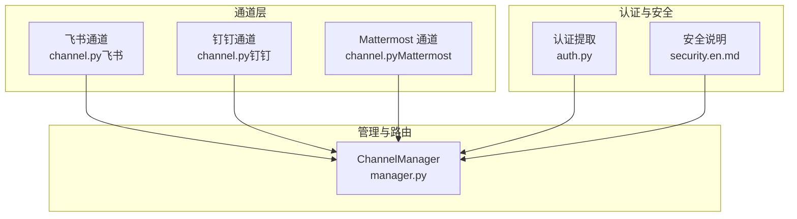
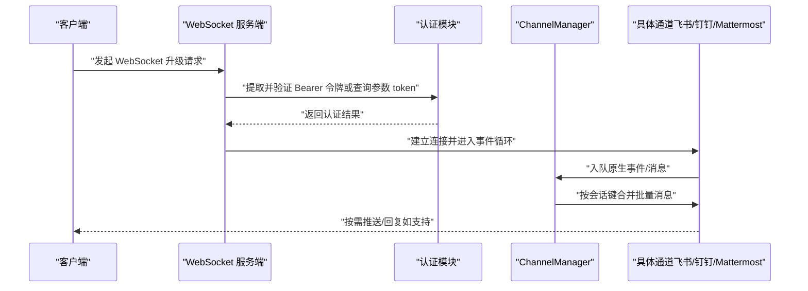
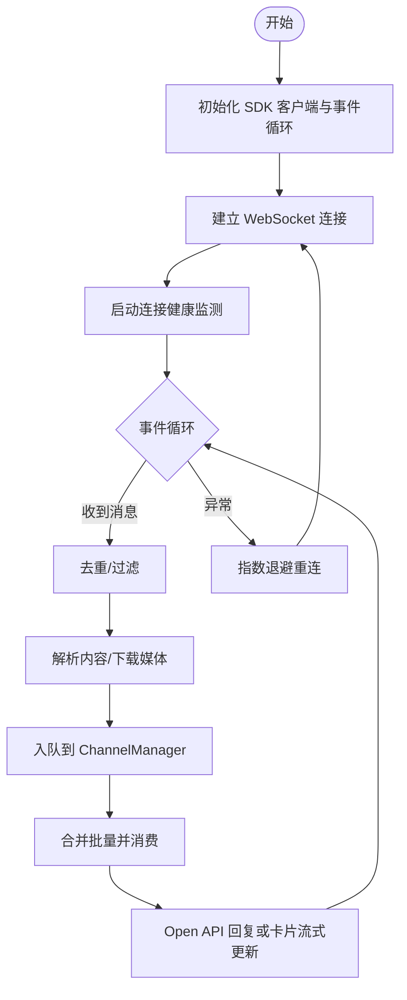
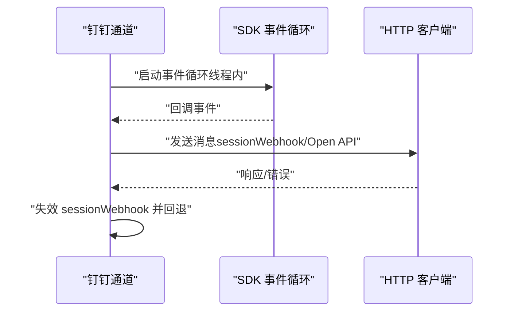
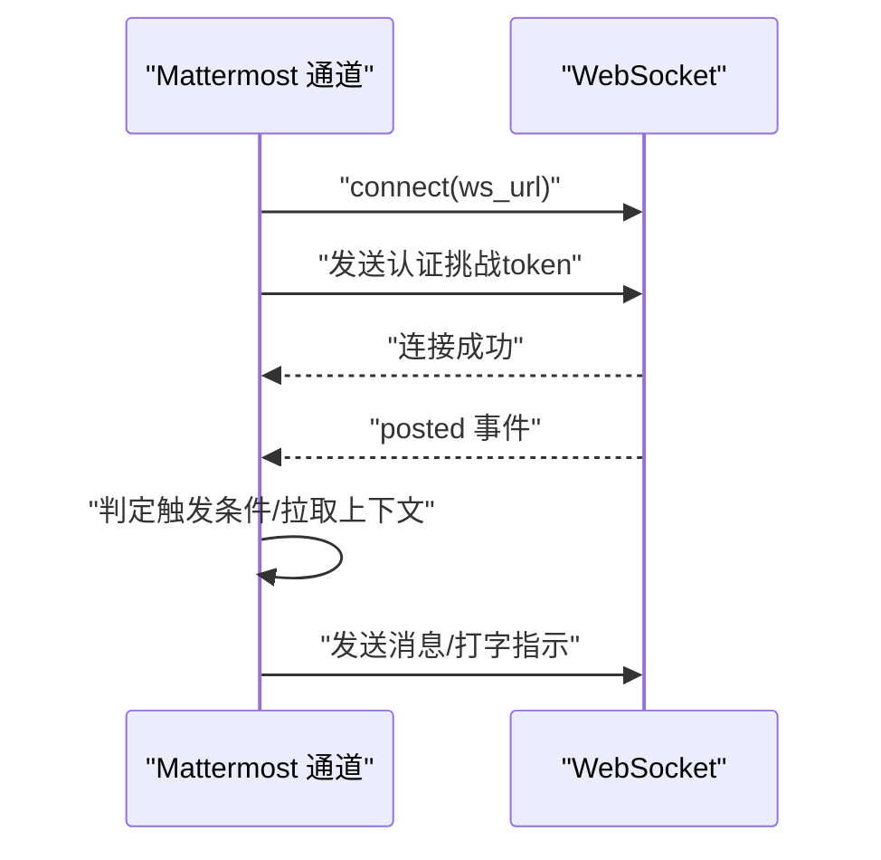
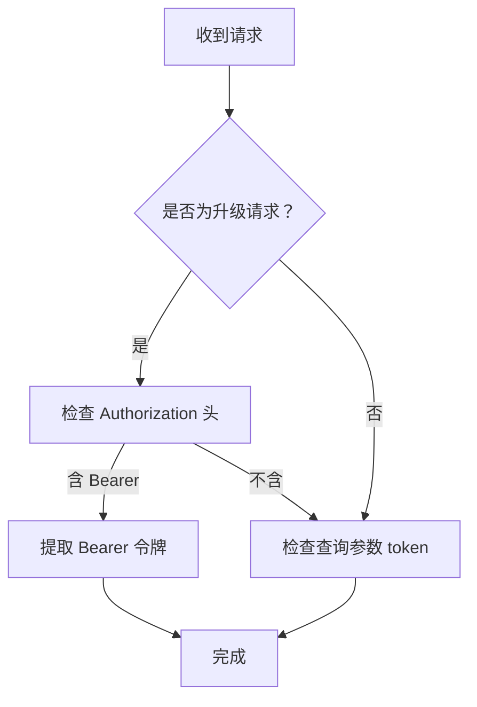
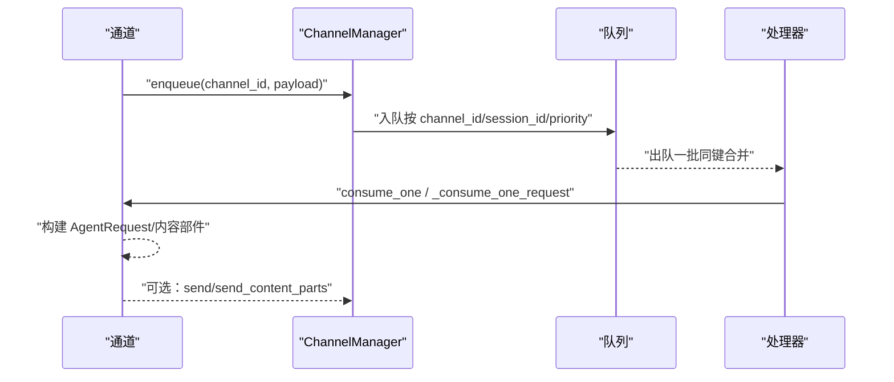
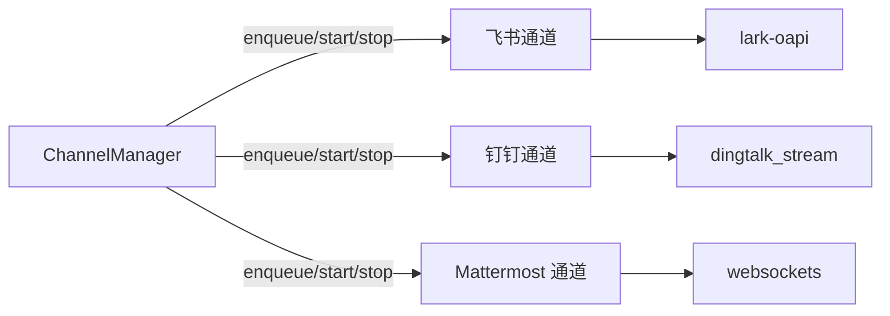

# WebSocket 接口

<cite>
**本文引用的文件**
- [auth.py](file://src/copaw/app/auth.py)
- [manager.py](file://src/copaw/app/channels/manager.py)
- [channel.py（飞书）](file://src/copaw/app/channels/feishu/channel.py)
- [constants.py（飞书）](file://src/copaw/app/channels/feishu/constants.py)
- [channel.py（钉钉）](file://src/copaw/app/channels/dingtalk/channel.py)
- [constants.py（钉钉）](file://src/copaw/app/channels/dingtalk/constants.py)
- [channel.py（Mattermost）](file://src/copaw/app/channels/mattermost/channel.py)
- [security.en.md](file://website/public/docs/security.en.md)
- [test_qq_channel.py](file://tests/unit/channels/test_qq_channel.py)
</cite>

## 目录
1. [简介](#简介)
2. [项目结构](#项目结构)
3. [核心组件](#核心组件)
4. [架构总览](#架构总览)
5. [详细组件分析](#详细组件分析)
6. [依赖分析](#依赖分析)
7. [性能考虑](#性能考虑)
8. [故障排查指南](#故障排查指南)
9. [结论](#结论)
10. [附录](#附录)

## 简介
本文件系统性梳理 CoPaw 的 WebSocket 接口与通道体系，覆盖以下主题：
- 连接建立流程、握手协议与认证机制
- 消息格式规范（JSON 结构、字段定义与数据类型）
- 事件类型与消息路由机制（聊天消息、技能执行状态、定时任务通知等）
- 客户端连接示例与消息收发参考路径
- 连接管理策略、重连机制与错误处理
- 实时数据推送的触发条件与更新频率
- 调试工具与监控方法，以及常见连接问题排查

## 项目结构
CoPaw 将多平台即时通讯通道抽象为统一的 Channel 接口，并通过 ChannelManager 统一编排队列与消费逻辑。飞书、钉钉、Mattermost 等通道均以 WebSocket 或长连接方式接入，遵循统一的消息入队与处理流程。

图表来源
- [manager.py:447-526](file://src/copaw/app/channels/manager.py#L447-L526)
- [channel.py（飞书）:1814-1968](file://src/copaw/app/channels/feishu/channel.py#L1814-L1968)
- [channel.py（钉钉）:2470-2514](file://src/copaw/app/channels/dingtalk/channel.py#L2470-L2514)
- [channel.py（Mattermost）:298-357](file://src/copaw/app/channels/mattermost/channel.py#L298-L357)
- [auth.py:429-440](file://src/copaw/app/auth.py#L429-L440)
- [security.en.md:726-740](file://website/public/docs/security.en.md#L726-L740)

章节来源
- [manager.py:447-526](file://src/copaw/app/channels/manager.py#L447-L526)
- [channel.py（飞书）:1814-1968](file://src/copaw/app/channels/feishu/channel.py#L1814-L1968)
- [channel.py（钉钉）:2470-2514](file://src/copaw/app/channels/dingtalk/channel.py#L2470-L2514)
- [channel.py（Mattermost）:298-357](file://src/copaw/app/channels/mattermost/channel.py#L298-L357)
- [auth.py:429-440](file://src/copaw/app/auth.py#L429-L440)
- [security.en.md:726-740](file://website/public/docs/security.en.md#L726-L740)

## 核心组件
- 认证与握手
  - WebSocket 握手阶段支持通过查询参数携带令牌；若为升级请求，优先从 Authorization 头提取 Bearer 令牌，否则回退到查询参数 token。
  - 安全策略明确：WebSocket 认证仅限升级请求，且使用 Bearer 令牌。
- 通道与长连接
  - 飞书：自建事件循环与重连策略，指数退避，连接健康监测。
  - 钉钉：线程内运行 SDK 事件循环，优雅停止与资源清理。
  - Mattermost：基于 websockets 库进行连接，支持认证挑战与指数退避重连。
- 消息路由与处理
  - ChannelManager 统一入队、合并批量消息、按会话键分发至对应通道处理器。
  - 各通道负责解析原生事件、去重、下载媒体、构建 AgentRequest 并入队处理。

章节来源
- [auth.py:429-440](file://src/copaw/app/auth.py#L429-L440)
- [security.en.md:726-740](file://website/public/docs/security.en.md#L726-L740)
- [channel.py（飞书）:1814-1968](file://src/copaw/app/channels/feishu/channel.py#L1814-L1968)
- [channel.py（钉钉）:2470-2514](file://src/copaw/app/channels/dingtalk/channel.py#L2470-L2514)
- [channel.py（Mattermost）:298-357](file://src/copaw/app/channels/mattermost/channel.py#L298-L357)
- [manager.py:39-66](file://src/copaw/app/channels/manager.py#L39-L66)

## 架构总览
下图展示 WebSocket 通道在系统中的位置与交互关系：

图表来源
- [auth.py:429-440](file://src/copaw/app/auth.py#L429-L440)
- [manager.py:39-66](file://src/copaw/app/channels/manager.py#L39-L66)
- [channel.py（飞书）:1814-1968](file://src/copaw/app/channels/feishu/channel.py#L1814-L1968)
- [channel.py（钉钉）:2470-2514](file://src/copaw/app/channels/dingtalk/channel.py#L2470-L2514)
- [channel.py（Mattermost）:298-357](file://src/copaw/app/channels/mattermost/channel.py#L298-L357)

## 详细组件分析

### 飞书通道（WebSocket）
- 连接与重连
  - 自建事件循环与连接驱动，连接健康监测，异常时主动停止事件循环并指数退避重连。
  - 初始延迟与最大延迟、退避因子由常量配置。
- 认证与鉴权
  - 使用 SDK 客户端初始化，内部通过 TokenManager 获取租户访问令牌；支持时钟偏移校正。
- 消息处理
  - 去重缓存、过期消息过滤、机器人消息过滤、提及检测、富文本/媒体下载与内容拆分。
- 发送与回推
  - 支持 Open API 回复；存储 receive_id 以便后续主动推送。

图表来源
- [channel.py（飞书）:1814-1968](file://src/copaw/app/channels/feishu/channel.py#L1814-L1968)
- [channel.py（飞书）:540-588](file://src/copaw/app/channels/feishu/channel.py#L540-L588)
- [channel.py（飞书）:1969-2023](file://src/copaw/app/channels/feishu/channel.py#L1969-L2023)
- [constants.py（飞书）:25-29](file://src/copaw/app/channels/feishu/constants.py#L25-L29)

章节来源
- [channel.py（飞书）:1814-1968](file://src/copaw/app/channels/feishu/channel.py#L1814-L1968)
- [channel.py（飞书）:540-588](file://src/copaw/app/channels/feishu/channel.py#L540-L588)
- [channel.py（飞书）:1969-2023](file://src/copaw/app/channels/feishu/channel.py#L1969-L2023)
- [constants.py（飞书）:25-29](file://src/copaw/app/channels/feishu/constants.py#L25-L29)

### 钉钉通道（WebSocket）
- 连接与生命周期
  - 在独立线程中运行 SDK 事件循环，支持优雅停止与任务取消，避免“Task was destroyed”。
- 会话与回推
  - 存储 sessionWebhook 用于主动推送；支持卡片流式更新与恢复。
- 发送策略
  - 优先 sessionWebhook；失败则回退 Open API；必要时失效并持久化记录。

图表来源
- [channel.py（钉钉）:2402-2469](file://src/copaw/app/channels/dingtalk/channel.py#L2402-L2469)
- [channel.py（钉钉）:2470-2514](file://src/copaw/app/channels/dingtalk/channel.py#L2470-L2514)
- [channel.py（钉钉）:2933-3044](file://src/copaw/app/channels/dingtalk/channel.py#L2933-L3044)

章节来源
- [channel.py（钉钉）:2402-2469](file://src/copaw/app/channels/dingtalk/channel.py#L2402-L2469)
- [channel.py（钉钉）:2470-2514](file://src/copaw/app/channels/dingtalk/channel.py#L2470-L2514)
- [channel.py（钉钉）:2933-3044](file://src/copaw/app/channels/dingtalk/channel.py#L2933-L3044)

### Mattermost 通道（WebSocket）
- 连接与认证
  - 使用 websockets 库连接，发送认证挑战请求（包含 Bearer 令牌），随后监听 posted 事件。
- 重连机制
  - 指数退避重连，最大等待时间限制。
- 事件处理
  - 触发条件判断（@提及、私聊、跟随线程）、上下文拉取、分块发送、打字指示器。

图表来源
- [channel.py（Mattermost）:298-357](file://src/copaw/app/channels/mattermost/channel.py#L298-L357)
- [channel.py（Mattermost）:461-567](file://src/copaw/app/channels/mattermost/channel.py#L461-L567)

章节来源
- [channel.py（Mattermost）:298-357](file://src/copaw/app/channels/mattermost/channel.py#L298-L357)
- [channel.py（Mattermost）:461-567](file://src/copaw/app/channels/mattermost/channel.py#L461-L567)

### 认证与握手
- 令牌来源
  - 升级请求：优先从 Authorization 头提取 Bearer 令牌；若非升级请求，则从查询参数 token 提取。
- 安全策略
  - WebSocket 认证仅限升级请求；令牌过期时间、存储与传输策略见安全文档。

图表来源
- [auth.py:429-440](file://src/copaw/app/auth.py#L429-L440)
- [security.en.md:726-740](file://website/public/docs/security.en.md#L726-L740)

章节来源
- [auth.py:429-440](file://src/copaw/app/auth.py#L429-L440)
- [security.en.md:726-740](file://website/public/docs/security.en.md#L726-L740)

### 消息格式与事件类型
- 飞书通道
  - 事件头包含 app_id 校验、create_time 时戳与时钟偏移修正；消息体包含消息 ID、聊天类型、消息类型与内容键值。
  - 支持文本、富文本（post）、图片、文件、音视频等多种消息类型，自动下载媒体并转换为内容部件。
- 钉钉通道
  - 通过 SDK ChatbotMessage 主题回调；支持卡片流式更新与会话 Webhook 主动推送。
- Mattermost 通道
  - posted 事件，包含用户 ID、频道 ID、根帖子 ID、附件列表等；支持分块发送与文件上传。

章节来源
- [channel.py（飞书）:590-800](file://src/copaw/app/channels/feishu/channel.py#L590-L800)
- [channel.py（飞书）:1814-1968](file://src/copaw/app/channels/feishu/channel.py#L1814-L1968)
- [channel.py（钉钉）:2470-2514](file://src/copaw/app/channels/dingtalk/channel.py#L2470-L2514)
- [channel.py（Mattermost）:461-567](file://src/copaw/app/channels/mattermost/channel.py#L461-L567)

### 消息路由与处理流程
- ChannelManager
  - 统一入队、按会话键合并批量消息、调用通道 consume_one/_consume_one_request 处理。
- 会话键与目标句柄
  - 各通道根据业务规则生成会话键（如短会话 ID、open_id/chat_id），并提供 to_handle_from_target 与 resolve_session_id。

图表来源
- [manager.py:39-66](file://src/copaw/app/channels/manager.py#L39-L66)
- [manager.py:350-361](file://src/copaw/app/channels/manager.py#L350-L361)
- [manager.py:630-711](file://src/copaw/app/channels/manager.py#L630-L711)

章节来源
- [manager.py:39-66](file://src/copaw/app/channels/manager.py#L39-L66)
- [manager.py:350-361](file://src/copaw/app/channels/manager.py#L350-L361)
- [manager.py:630-711](file://src/copaw/app/channels/manager.py#L630-L711)

### 技能执行状态与定时任务通知
- 技能执行状态
  - 通道层不直接承载技能执行状态；通常由上层工作流或任务跟踪模块产生事件并通过 ChannelManager 分发。
- 定时任务通知
  - 可通过 ChannelManager 的 send_text/send_event 将计划任务结果或状态推送到指定通道与会话。

章节来源
- [manager.py:630-711](file://src/copaw/app/channels/manager.py#L630-L711)

## 依赖分析
- 通道与管理器
  - 所有通道继承自 BaseChannel，统一实现 start/stop/enqueue/send 等接口；ChannelManager 负责统一编排。
- 第三方库
  - 飞书：lark-oapi（WebSocket 客户端与 Open API）。
  - 钉钉：dingtalk_stream（WebSocket 事件循环）。
  - Mattermost：websockets（WebSocket 连接）。
- 常量与配置
  - 各通道通过 constants.py 控制重连参数、缓存大小、阈值等。

图表来源
- [manager.py:447-526](file://src/copaw/app/channels/manager.py#L447-L526)
- [channel.py（飞书）:104-134](file://src/copaw/app/channels/feishu/channel.py#L104-L134)
- [channel.py（钉钉）:38-41](file://src/copaw/app/channels/dingtalk/channel.py#L38-L41)
- [channel.py（Mattermost）:14](file://src/copaw/app/channels/mattermost/channel.py#L14)

章节来源
- [manager.py:447-526](file://src/copaw/app/channels/manager.py#L447-L526)
- [channel.py（飞书）:104-134](file://src/copaw/app/channels/feishu/channel.py#L104-L134)
- [channel.py（钉钉）:38-41](file://src/copaw/app/channels/dingtalk/channel.py#L38-L41)
- [channel.py（Mattermost）:14](file://src/copaw/app/channels/mattermost/channel.py#L14)

## 性能考虑
- 去重与限流
  - 飞书通道维护消息 ID 去重缓存，控制最大容量；钉钉通道对重复消息进行去重与快速释放。
- 批量合并
  - ChannelManager 对同一会话键的队列进行批量合并，减少处理开销。
- 重连退避
  - 飞书与 Mattermost 采用指数退避，避免频繁重连造成抖动。
- 媒体下载与分块
  - 飞书与 Mattermost 对媒体进行本地下载与分块发送，降低单次消息体积。

章节来源
- [channel.py（飞书）:233-240](file://src/copaw/app/channels/feishu/channel.py#L233-L240)
- [channel.py（飞书）:1814-1968](file://src/copaw/app/channels/feishu/channel.py#L1814-L1968)
- [channel.py（Mattermost）:305-357](file://src/copaw/app/channels/mattermost/channel.py#L305-L357)
- [manager.py:39-66](file://src/copaw/app/channels/manager.py#L39-L66)

## 故障排查指南
- 认证失败
  - 确认 WebSocket 升级请求携带 Bearer 令牌或查询参数 token；检查令牌有效性与过期时间。
- 连接断开与重连
  - 飞书：关注日志中的连接丢失与重连提示；确认网络可达与 SDK 域名配置。
  - 钉钉：线程退出与资源清理日志；检查 stop 信号与任务取消。
  - Mattermost：指数退避日志与异常信息；确认认证挑战与 token。
- 消息未达或重复
  - 飞书：检查消息年龄阈值与去重缓存；确认机器人自身消息过滤。
  - 钉钉：检查 sessionWebhook 是否有效与过期；必要时回退 Open API。
- 速率限制与退避
  - 参考各通道常量配置，合理设置重试间隔与最大延迟。

章节来源
- [auth.py:429-440](file://src/copaw/app/auth.py#L429-L440)
- [channel.py（飞书）:1814-1968](file://src/copaw/app/channels/feishu/channel.py#L1814-L1968)
- [channel.py（钉钉）:2402-2469](file://src/copaw/app/channels/dingtalk/channel.py#L2402-L2469)
- [channel.py（Mattermost）:298-357](file://src/copaw/app/channels/mattermost/channel.py#L298-L357)
- [test_qq_channel.py:324-433](file://tests/unit/channels/test_qq_channel.py#L324-L433)

## 结论
CoPaw 的 WebSocket 通道体系通过统一的 ChannelManager 与通道抽象，实现了跨平台、高可用的长连接与消息处理能力。认证与握手策略清晰，重连与错误处理完善，适合在企业级场景中稳定运行。建议在生产环境中结合日志与监控指标，持续优化重连参数与批量合并策略，确保低延迟与高吞吐。

## 附录
- 客户端连接示例与消息收发参考路径
  - 飞书：参考通道启动与事件循环实现，定位 WebSocket 连接与认证流程。
    - [channel.py（飞书）:1814-1968](file://src/copaw/app/channels/feishu/channel.py#L1814-L1968)
  - 钉钉：参考线程内事件循环与停止流程，定位连接与资源清理。
    - [channel.py（钉钉）:2402-2469](file://src/copaw/app/channels/dingtalk/channel.py#L2402-L2469)
  - Mattermost：参考连接与认证挑战流程，定位 posted 事件处理。
    - [channel.py（Mattermost）:298-357](file://src/copaw/app/channels/mattermost/channel.py#L298-L357)
- 实时数据推送
  - 通过 ChannelManager 的 send_text/send_event 将文本或事件推送到指定通道与会话键。
    - [manager.py:630-711](file://src/copaw/app/channels/manager.py#L630-L711)
- 调试与监控
  - 关注各通道日志输出（连接、重连、错误、清理等）；结合安全文档核对认证策略。
    - [security.en.md:726-740](file://website/public/docs/security.en.md#L726-L740)