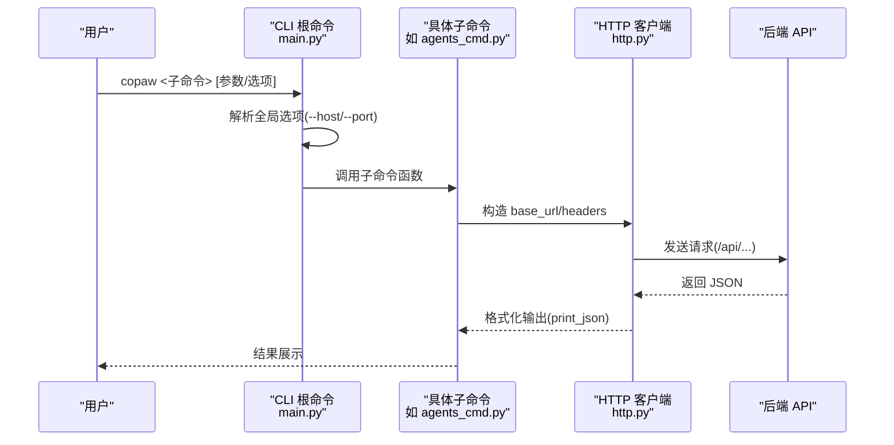
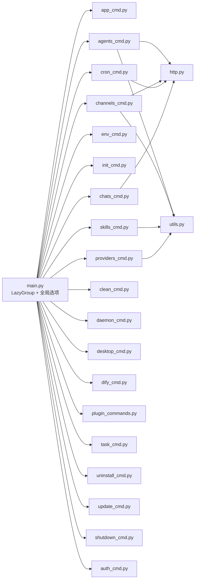

# 命令行接口

<cite>
**本文引用的文件**
- [src/copaw/cli/main.py](file://src/copaw/cli/main.py)
- [src/copaw/__main__.py](file://src/copaw/__main__.py)
- [src/copaw/cli/http.py](file://src/copaw/cli/http.py)
- [src/copaw/cli/utils.py](file://src/copaw/cli/utils.py)
- [src/copaw/cli/app_cmd.py](file://src/copaw/cli/app_cmd.py)
- [src/copaw/cli/agents_cmd.py](file://src/copaw/cli/agents_cmd.py)
- [src/copaw/cli/channels_cmd.py](file://src/copaw/cli/channels_cmd.py)
- [src/copaw/cli/clean_cmd.py](file://src/copaw/cli/clean_cmd.py)
- [src/copaw/cli/cron_cmd.py](file://src/copaw/cli/cron_cmd.py)
- [src/copaw/cli/env_cmd.py](file://src/copaw/cli/env_cmd.py)
- [src/copaw/cli/init_cmd.py](file://src/copaw/cli/init_cmd.py)
- [src/copaw/cli/skills_cmd.py](file://src/copaw/cli/skills_cmd.py)
- [src/copaw/cli/providers_cmd.py](file://src/copaw/cli/providers_cmd.py)
- [src/copaw/cli/chats_cmd.py](file://src/copaw/cli/chats_cmd.py)
- [src/copaw/cli/daemon_cmd.py](file://src/copaw/cli/daemon_cmd.py)
- [src/copaw/cli/desktop_cmd.py](file://src/copaw/cli/desktop_cmd.py)
- [src/copaw/cli/dify_cmd.py](file://src/copaw/cli/dify_cmd.py)
- [src/copaw/cli/plugin_commands.py](file://src/copaw/cli/plugin_commands.py)
- [src/copaw/cli/task_cmd.py](file://src/copaw/cli/task_cmd.py)
- [src/copaw/cli/uninstall_cmd.py](file://src/copaw/cli/uninstall_cmd.py)
- [src/copaw/cli/update_cmd.py](file://src/copaw/cli/update_cmd.py)
- [src/copaw/cli/shutdown_cmd.py](file://src/copaw/cli/shutdown_cmd.py)
- [src/copaw/cli/auth_cmd.py](file://src/copaw/cli/auth_cmd.py)
</cite>

## 目录
1. [简介](#简介)
2. [项目结构](#项目结构)
3. [核心组件](#核心组件)
4. [架构总览](#架构总览)
5. [详细组件分析](#详细组件分析)
6. [依赖关系分析](#依赖关系分析)
7. [性能与并发特性](#性能与并发特性)
8. [故障排查与返回码](#故障排查与返回码)
9. [最佳实践：批量与自动化](#最佳实践批量与自动化)
10. [版本兼容性与升级建议](#版本兼容性与升级建议)
11. [常见工作流与组合命令](#常见工作流与组合命令)
12. [结论](#结论)

## 简介
本文件为 CoPaw 命令行接口（CLI）的完整参考文档。内容覆盖所有 CLI 命令与其子命令的语法、参数、选项、功能说明、使用场景、预期输出、示例、环境变量与配置文件格式、返回码与错误诊断、批量与自动化最佳实践、版本兼容性与升级注意事项，以及常见工作流与命令组合。

## 项目结构
CoPaw CLI 采用 Click 框架组织，主入口在根命令组中注册各子命令组与命令。全局选项（如 --host、--port）通过上下文传递给各子命令；HTTP 客户端封装统一了 API 调用与输出格式化。

```mermaid
graph TB
A["主入口<br/>copaw/cli/main.py"] --> B["应用服务启动<br/>copaw/cli/app_cmd.py"]
A --> C["代理交互<br/>copaw/cli/agents_cmd.py"]
A --> D["频道管理<br/>copaw/cli/channels_cmd.py"]
A --> E["定时任务<br/>copaw/cli/cron_cmd.py"]
A --> F["环境变量<br/>copaw/cli/env_cmd.py"]
A --> G["初始化<br/>copaw/cli/init_cmd.py"]
A --> H["技能管理<br/>copaw/cli/skills_cmd.py"]
A --> I["模型与提供商<br/>copaw/cli/providers_cmd.py"]
A --> J["聊天会话<br/>copaw/cli/chats_cmd.py"]
A --> K["清理工作目录<br/>copaw/cli/clean_cmd.py"]
A --> L["HTTP 客户端封装<br/>copaw/cli/http.py"]
A --> M["交互式提示工具<br/>copaw/cli/utils.py"]
A --> N["守护进程命令<br/>copaw/cli/daemon_cmd.py"]
A --> O["桌面应用命令<br/>copaw/cli/desktop_cmd.py"]
A --> P["Dify 集成命令<br/>copaw/cli/dify_cmd.py"]
A --> Q["插件管理命令<br/>copaw/cli/plugin_commands.py"]
A --> R["任务管理命令<br/>copaw/cli/task_cmd.py"]
A --> S["卸载命令<br/>copaw/cli/uninstall_cmd.py"]
A --> T["更新命令<br/>copaw/cli/update_cmd.py"]
A --> U["关机命令<br/>copaw/cli/shutdown_cmd.py"]
A --> V["认证命令<br/>copaw/cli/auth_cmd.py"]
```

图表来源
- [src/copaw/cli/main.py:95-142](file://src/copaw/cli/main.py#L95-L142)
- [src/copaw/cli/app_cmd.py:15-112](file://src/copaw/cli/app_cmd.py#L15-L112)
- [src/copaw/cli/agents_cmd.py:374-680](file://src/copaw/cli/agents_cmd.py#L374-L680)
- [src/copaw/cli/channels_cmd.py:1-1227](file://src/copaw/cli/channels_cmd.py#L1-L1227)
- [src/copaw/cli/cron_cmd.py:27-480](file://src/copaw/cli/cron_cmd.py#L27-L480)
- [src/copaw/cli/env_cmd.py:10-99](file://src/copaw/cli/env_cmd.py#L10-L99)
- [src/copaw/cli/init_cmd.py:119-523](file://src/copaw/cli/init_cmd.py#L119-L523)
- [src/copaw/cli/skills_cmd.py:213-275](file://src/copaw/cli/skills_cmd.py#L213-L275)
- [src/copaw/cli/providers_cmd.py:469-812](file://src/copaw/cli/providers_cmd.py#L469-L812)
- [src/copaw/cli/chats_cmd.py:15-276](file://src/copaw/cli/chats_cmd.py#L15-L276)
- [src/copaw/cli/clean_cmd.py:20-77](file://src/copaw/cli/clean_cmd.py#L20-L77)
- [src/copaw/cli/http.py:14-44](file://src/copaw/cli/http.py#L14-L44)
- [src/copaw/cli/utils.py:15-226](file://src/copaw/cli/utils.py#L15-L226)
- [src/copaw/cli/daemon_cmd.py:47-95](file://src/copaw/cli/daemon_cmd.py#L47-L95)
- [src/copaw/cli/desktop_cmd.py](file://src/copaw/cli/desktop_cmd.py)
- [src/copaw/cli/dify_cmd.py](file://src/copaw/cli/dify_cmd.py)
- [src/copaw/cli/plugin_commands.py](file://src/copaw/cli/plugin_commands.py)
- [src/copaw/cli/task_cmd.py](file://src/copaw/cli/task_cmd.py)
- [src/copaw/cli/uninstall_cmd.py](file://src/copaw/cli/uninstall_cmd.py)
- [src/copaw/cli/update_cmd.py](file://src/copaw/cli/update_cmd.py)
- [src/copaw/cli/shutdown_cmd.py](file://src/copaw/cli/shutdown_cmd.py)
- [src/copaw/cli/auth_cmd.py](file://src/copaw/cli/auth_cmd.py)

章节来源
- [src/copaw/cli/main.py:1-168](file://src/copaw/cli/main.py#L1-L168)
- [src/copaw/__main__.py:1-7](file://src/copaw/__main__.py#L1-L7)

## 核心组件
- 根命令组与延迟加载：通过自定义 LazyGroup 实现按需导入子命令，提升启动速度。
- 全局选项：--host、--port 默认从上次运行记录读取，支持覆盖；未提供时回退到默认值。
- HTTP 客户端：统一处理 /api 前缀、超时、JSON 输出打印与 base_url 解析。
- 交互式提示：集中封装 questionary 使用，避免各命令直接耦合终端库。

章节来源
- [src/copaw/cli/main.py:58-93](file://src/copaw/cli/main.py#L58-L93)
- [src/copaw/cli/main.py:144-168](file://src/copaw/cli/main.py#L144-L168)
- [src/copaw/cli/http.py:14-44](file://src/copaw/cli/http.py#L14-L44)
- [src/copaw/cli/utils.py:15-226](file://src/copaw/cli/utils.py#L15-L226)

## 架构总览
CLI 通过 Click 组织命令树，子命令通过 HTTP 客户端调用后端 FastAPI 接口。全局选项在上下文中传递，子命令根据需要解析 base_url 或使用默认 host/port。

图表来源
- [src/copaw/cli/main.py:144-168](file://src/copaw/cli/main.py#L144-L168)
- [src/copaw/cli/http.py:14-44](file://src/copaw/cli/http.py#L14-L44)
- [src/copaw/cli/agents_cmd.py:511-680](file://src/copaw/cli/agents_cmd.py#L511-L680)

## 详细组件分析

### 应用服务启动：copaw app
- 功能：启动内置 FastAPI 应用，支持绑定地址、端口、自动重载、日志级别、访问日志路径过滤、工作进程（已弃用）。
- 关键行为：
  - 记录最近一次使用的 host/port，供其他终端复用。
  - 设置日志级别环境变量。
  - 可选设置重载模式环境变量以影响浏览器控制逻辑。
  - 隐藏特定路径的访问日志。
- 示例：
  - copaw app --host 0.0.0.0 --port 8088 --reload --log-level debug
- 注意事项：
  - --workers 已弃用，将被忽略并发出警告。

章节来源
- [src/copaw/cli/app_cmd.py:15-112](file://src/copaw/cli/app_cmd.py#L15-L112)

### 代理交互：copaw agents
- 子命令：
  - list：列出可用代理（ID、名称、描述、工作空间目录）。
  - chat：与另一个代理通信，支持新会话、续会话、流式/最终响应、后台任务、任务状态查询。
- 关键参数与行为：
  - --from-agent/--agent-id/--to-agent、--text 必填于普通对话（除非检查后台任务）。
  - --session-id 复用上下文；--new-session 强制生成唯一会话 ID。
  - --mode stream 返回增量更新；--mode final 返回完整响应。
  - --background 提交为后台任务，立即返回 [TASK_ID: ...] [SESSION: ...]。
  - --task-id 仅与 --background 搭配，用于轮询任务状态。
  - 身份前缀：系统自动为消息添加 [Agent {from_agent} requesting] 前缀，避免混淆。
- 输出：
  - 文本模式：输出 [SESSION: ...] 头部与正文。
  - JSON 模式：输出完整响应结构。
  - 后台任务：输出任务状态流转（submitted → pending → running → finished），成功显示完成，失败显示错误信息。
- 示例：
  - copaw agents list
  - copaw agents chat --from-agent bot_a --to-agent bot_b --text "天气如何？"
  - copaw agents chat --background --from-agent bot_a --to-agent bot_b --text "分析数据"
  - copaw agents chat --background --task-id <task_id>

章节来源
- [src/copaw/cli/agents_cmd.py:374-680](file://src/copaw/cli/agents_cmd.py#L374-L680)

### 频道管理：copaw channels
- 子命令：
  - list：列出可用频道（内置与插件）。
  - config：交互式配置频道（iMessage、Discord、Telegram、DingTalk、Feishu、QQ、Console、Voice/Twilio）。
  - install：安装自定义频道模板文件（基于通道键）。
- 关键行为：
  - 列表中对敏感字段进行掩码显示。
  - 支持插件扩展的频道配置器。
  - 交互式配置支持启用/禁用、前缀、令牌、代理等。
- 示例：
  - copaw channels list
  - copaw channels config
  - copaw channels install <key>

章节来源
- [src/copaw/cli/channels_cmd.py:1-1227](file://src/copaw/cli/channels_cmd.py#L1-L1227)

### 定时任务：copaw cron
- 子命令：
  - list：列出所有定时任务（可按 agent-id 过滤）。
  - get：按 ID 获取任务详情。
  - state：获取任务运行状态（下次执行时间、是否暂停等）。
  - create：创建任务（支持 JSON 文件或内联参数）。
  - delete：删除任务。
  - pause/resume：暂停/恢复任务。
  - run：立即触发一次任务执行。
- 关键参数：
  - 任务类型：text（向频道发送固定内容）、agent（向代理提问并将回复发至频道）。
  - 调度表达式：5 项 cron 表达式。
  - 分发目标：channel、target.user_id、target.session_id。
  - 运行时参数：最大并发、超时、错失宽限秒。
- 示例：
  - copaw cron list --agent-id default
  - copaw cron create -f spec.json
  - copaw cron create --type agent --name "日报" --cron "0 9 * * 1" --channel discord --target-user alice --target-session s1 --text "上周总结"
  - copaw cron run <job_id>

章节来源
- [src/copaw/cli/cron_cmd.py:27-480](file://src/copaw/cli/cron_cmd.py#L27-L480)

### 环境变量：copaw env
- 子命令：
  - list：列出所有环境变量。
  - set：设置环境变量（KEY VALUE）。
  - delete：删除环境变量。
- 交互式配置：init_cmd 中调用 configure_env_interactive 进行逐个变量的添加/编辑。
- 示例：
  - copaw env list
  - copaw env set OPENAI_API_KEY sk-...
  - copaw env delete OPENAI_API_KEY

章节来源
- [src/copaw/cli/env_cmd.py:10-99](file://src/copaw/cli/env_cmd.py#L10-L99)

### 初始化：copaw init
- 功能：交互式创建工作目录、配置文件、心跳查询文件，引导配置频道、提供商、技能、环境变量等。
- 关键流程：
  - 安全提示与接受确认。
  - 可选匿名遥测收集。
  - 初始化默认代理工作区与内置 QA 代理。
  - 配置心跳间隔、目标、活跃时段。
  - 语言选择、音频模式、转录提供商（可选）。
  - 频道交互配置。
  - LLM 提供商配置（必要时不可跳过）。
  - 技能同步与启用策略（全部/自定义/不启用）。
  - 环境变量交互配置。
  - MD 文件复制与语言切换。
  - 心跳查询文件编辑与保存。
- 示例：
  - copaw init
  - copaw init --defaults --accept-security

章节来源
- [src/copaw/cli/init_cmd.py:119-523](file://src/copaw/cli/init_cmd.py#L119-L523)

### 技能管理：copaw skills
- 子命令：
  - list：列出技能及启用状态。
  - config：交互式配置技能（多选启用/禁用，支持从技能池下载到工作区）。
- 关键行为：
  - 通过技能清单预览变更，确认后应用。
  - 支持从技能池下载到工作区并启用。
- 示例：
  - copaw skills list --agent-id default
  - copaw skills config --agent-id default

章节来源
- [src/copaw/cli/skills_cmd.py:213-275](file://src/copaw/cli/skills_cmd.py#L213-L275)

### 模型与提供商：copaw models
- 子命令：
  - list：列出所有提供商及其配置与当前激活的模型槽位。
  - config：交互式配置提供商（API Key、Base URL、模型列表）、激活 LLM。
  - config-key：配置指定提供商的 API Key。
  - set-llm：交互式设置当前激活的 LLM。
  - add-provider/remove-provider：新增/删除自定义提供商。
  - add-model/remove-model：为任意提供商增删模型（Ollama 不支持手动增删）。
  - download/local/remove-local：本地模型下载/列出/删除。
- 关键行为：
  - 对本地模型下载过程提供进度等待与超时/取消处理。
  - 对 Ollama 提供商限制手动模型管理。
- 示例：
  - copaw models list
  - copaw models config
  - copaw models download TheBloke/Mistral-7B-Instruct-v0.2-GGUF
  - copaw models local

章节来源
- [src/copaw/cli/providers_cmd.py:469-812](file://src/copaw/cli/providers_cmd.py#L469-L812)

### 聊天会话：copaw chats
- 子命令：
  - list：列出聊天（可按 user-id 或 channel 过滤）。
  - get：查看指定聊天详情（含消息历史）。
  - create：从 JSON 文件或内联参数创建聊天。
  - update：更新聊天名称。
  - delete：删除聊天元数据（不清空会话状态）。
- 示例：
  - copaw chats list
  - copaw chats list --user-id alice
  - copaw chats get <chat_id>
  - copaw chats create -f chat.json
  - copaw chats create --session-id "discord:alice" --user-id alice --name "我的聊天"
  - copaw chats update <chat_id> --name "重命名"
  - copaw chats delete <chat_id>

章节来源
- [src/copaw/cli/chats_cmd.py:15-276](file://src/copaw/cli/chats_cmd.py#L15-L276)

### 清理：copaw clean
- 功能：清空工作目录（~/.copaw，默认保留遥测标记文件）。
- 选项：
  - --yes：无需确认。
  - --dry-run：仅列出将要删除的内容但不实际删除。
- 示例：
  - copaw clean
  - copaw clean --dry-run
  - copaw clean --yes

章节来源
- [src/copaw/cli/clean_cmd.py:20-77](file://src/copaw/cli/clean_cmd.py#L20-L77)

### 守护进程命令：copaw daemon
- 子命令：
  - status：显示守护进程状态（配置、工作目录、内存管理器）。
  - restart：重启守护进程（打印重启说明）。
  - reload-config：重新加载配置（从文件重新读取）。
  - version：显示守护进程版本。
- 关键行为：
  - 支持指定 agent-id（默认 default）。
  - 通过上下文获取守护进程配置。
- 示例：
  - copaw daemon status --agent-id default
  - copaw daemon restart --agent-id default
  - copaw daemon reload-config --agent-id default
  - copaw daemon version --agent-id default

章节来源
- [src/copaw/cli/daemon_cmd.py:47-95](file://src/copaw/cli/daemon_cmd.py#L47-L95)

### 桌面应用命令：copaw desktop
- 功能：管理桌面应用程序相关操作。
- 当前实现：占位符，具体功能待实现。

章节来源
- [src/copaw/cli/desktop_cmd.py](file://src/copaw/cli/desktop_cmd.py)

### Dify 集成命令：copaw dify
- 功能：与 Dify 平台集成的相关操作。
- 当前实现：占位符，具体功能待实现。

章节来源
- [src/copaw/cli/dify_cmd.py](file://src/copaw/cli/dify_cmd.py)

### 插件管理命令：copaw plugin
- 功能：管理插件的安装、卸载、启用、禁用等操作。
- 当前实现：占位符，具体功能待实现。

章节来源
- [src/copaw/cli/plugin_commands.py](file://src/copaw/cli/plugin_commands.py)

### 任务管理命令：copaw task
- 功能：管理后台任务的状态查询、取消等操作。
- 当前实现：占位符，具体功能待实现。

章节来源
- [src/copaw/cli/task_cmd.py](file://src/copaw/cli/task_cmd.py)

### 卸载命令：copaw uninstall
- 功能：卸载 CoPaw 应用程序。
- 当前实现：占位符，具体功能待实现。

章节来源
- [src/copaw/cli/uninstall_cmd.py](file://src/copaw/cli/uninstall_cmd.py)

### 更新命令：copaw update
- 功能：检查并执行 CoPaw 应用程序的更新。
- 当前实现：占位符，具体功能待实现。

章节来源
- [src/copaw/cli/update_cmd.py](file://src/copaw/cli/update_cmd.py)

### 关机命令：copaw shutdown
- 功能：安全关闭 CoPaw 应用程序。
- 当前实现：占位符，具体功能待实现。

章节来源
- [src/copaw/cli/shutdown_cmd.py](file://src/copaw/cli/shutdown_cmd.py)

### 认证命令：copaw auth
- 功能：管理用户认证相关操作（登录、登出、令牌管理等）。
- 当前实现：占位符，具体功能待实现。

章节来源
- [src/copaw/cli/auth_cmd.py](file://src/copaw/cli/auth_cmd.py)

### HTTP 客户端与工具
- http.py：
  - client：构造带 /api 前缀的客户端。
  - print_json：打印 JSON，保持中文可读。
  - resolve_base_url：优先级：命令行 --base-url > 全局 --host/--port > 默认。
- utils.py：
  - 提供 confirm/path/choice/select/checkbox 等交互式提示，屏蔽 questionary 直接依赖。

章节来源
- [src/copaw/cli/http.py:14-44](file://src/copaw/cli/http.py#L14-L44)
- [src/copaw/cli/utils.py:15-226](file://src/copaw/cli/utils.py#L15-L226)

## 依赖关系分析
- 根命令组通过 LazyGroup 延迟加载子命令模块，减少启动时的导入开销。
- 子命令共享 HTTP 客户端与交互式工具，降低重复代码与耦合。
- 全局选项通过上下文对象传递，避免在每个命令中重复解析。

图表来源
- [src/copaw/cli/main.py:95-142](file://src/copaw/cli/main.py#L95-L142)
- [src/copaw/cli/agents_cmd.py:14-14](file://src/copaw/cli/agents_cmd.py#L14-L14)
- [src/copaw/cli/channels_cmd.py:33-33](file://src/copaw/cli/channels_cmd.py#L33-L33)
- [src/copaw/cli/cron_cmd.py:10-10](file://src/copaw/cli/cron_cmd.py#L10-L10)
- [src/copaw/cli/chats_cmd.py:11-11](file://src/copaw/cli/chats_cmd.py#L11-L11)
- [src/copaw/cli/http.py:14-44](file://src/copaw/cli/http.py#L14-L44)
- [src/copaw/cli/utils.py:15-226](file://src/copaw/cli/utils.py#L15-L226)

## 性能与并发特性
- 启动性能：通过 LazyGroup 延迟导入子命令，显著降低冷启动时间。
- 日志与调试：支持 debug/trace 级别日志，并在 app 子命令中输出初始化耗时明细。
- 并发与会话：agents 子命令默认为每次调用生成唯一会话 ID，避免并发写入同一会话导致冲突；可通过 --session-id 复用上下文。
- 后台任务：agents chat --background 支持异步任务提交与状态轮询，适合长时间运行的任务。

章节来源
- [src/copaw/cli/main.py:58-93](file://src/copaw/cli/main.py#L58-L93)
- [src/copaw/cli/app_cmd.py:92-112](file://src/copaw/cli/app_cmd.py#L92-L112)
- [src/copaw/cli/agents_cmd.py:17-48](file://src/copaw/cli/agents_cmd.py#L17-L48)
- [src/copaw/cli/agents_cmd.py:511-680](file://src/copaw/cli/agents_cmd.py#L511-L680)

## 故障排查与返回码
- 通用错误处理：
  - 404：资源不存在（如任务、聊天、频道等）。CLI 将抛出 ClickException 或输出错误信息并终止。
  - 参数校验失败：使用 click.UsageError 或 click.ClickException 提示修正。
- agents 子命令：
  - 无响应或无文本内容：输出 "(No response received)" 或 "(No text content in response)"。
  - 后台任务状态：submitted → pending → running → finished；finished 包含 completed 或 failed。
- cron 子命令：
  - 创建任务时缺少必需参数将触发 UsageError。
  - 删除/暂停/恢复/运行任务若资源不存在返回 404 并提示。
- providers 子命令：
  - 本地模型下载等待超时：输出超时并取消下载；键盘中断优雅退出。
  - Ollama 模型增删受限：禁止手动增删，需使用 ollama 命令。
- 返回码约定（遵循 Click 约定）：
  - 正常：0
  - 用户取消/中断：2（由 click.Abort 触发）
  - 参数错误/使用错误：2（由 click.UsageError 触发）
  - 资源不存在/业务错误：1（由 click.ClickException 或显式 exit(1) 触发）

章节来源
- [src/copaw/cli/agents_cmd.py:272-372](file://src/copaw/cli/agents_cmd.py#L272-L372)
- [src/copaw/cli/cron_cmd.py:373-480](file://src/copaw/cli/cron_cmd.py#L373-L480)
- [src/copaw/cli/providers_cmd.py:36-76](file://src/copaw/cli/providers_cmd.py#L36-L76)
- [src/copaw/cli/env_cmd.py:52-67](file://src/copaw/cli/env_cmd.py#L52-L67)

## 最佳实践：批量与自动化
- 批量配置频道：
  - 使用 channels config 的交互式流程，结合 --defaults 与 --accept-security 以脚本化方式快速部署。
- 批量技能启用：
  - 使用 skills config 的多选流程，先 reconcile 清理清单，再批量启用/禁用。
- 批量定时任务：
  - 使用 cron create -f 传入 JSON 规范文件，确保任务字段完整（调度、分发、运行时参数）。
- 批量聊天管理：
  - 使用 chats list + 过滤条件筛选目标聊天，再配合 get/update/delete 执行批量操作。
- 自动化脚本建议：
  - 固定 base_url 或通过全局 --host/--port 保证一致性。
  - 在 CI/CD 中使用 --defaults 与 --yes 选项减少交互。
  - 对长耗时任务使用 agents chat --background 并轮询状态。

章节来源
- [src/copaw/cli/init_cmd.py:324-433](file://src/copaw/cli/init_cmd.py#L324-L433)
- [src/copaw/cli/skills_cmd.py:120-211](file://src/copaw/cli/skills_cmd.py#L120-L211)
- [src/copaw/cli/cron_cmd.py:299-358](file://src/copaw/cli/cron_cmd.py#L299-L358)
- [src/copaw/cli/chats_cmd.py:29-276](file://src/copaw/cli/chats_cmd.py#L29-L276)
- [src/copaw/cli/agents_cmd.py:511-680](file://src/copaw/cli/agents_cmd.py#L511-L680)

## 版本兼容性与升级建议
- 版本显示：通过 @click.version_option 显示程序版本。
- 兼容性注意：
  - --workers 选项在 app 子命令中已弃用，将被忽略并提示。
  - providers 子命令中的本地模型下载接口已调整，不再支持 --file 选项，请使用新的仓库级下载方式。
- 升级建议：
  - 升级后优先运行 copaw init --defaults 以确保配置与技能池同步。
  - 如使用本地模型，重新执行 models download 并通过 models set-llm 激活。

章节来源
- [src/copaw/cli/app_cmd.py:48-76](file://src/copaw/cli/app_cmd.py#L48-L76)
- [src/copaw/cli/providers_cmd.py:714-772](file://src/copaw/cli/providers_cmd.py#L714-L772)

## 常见工作流与组合命令
- 首次部署与初始化
  - copaw init --defaults --accept-security
  - copaw models config
  - copaw skills config --agent-id default
  - copaw channels config
  - copaw env set <KEY> <VALUE>
- 日常运维
  - copaw app --log-level info
  - copaw clean --dry-run
  - copaw chats list --user-id alice
  - copaw cron list --agent-id default
- 自动化与集成
  - copaw agents chat --background --from-agent bot_a --to-agent bot_b --text "分析报告"
  - copaw cron create -f job.json
  - copaw providers download <repo_id>

章节来源
- [src/copaw/cli/init_cmd.py:119-523](file://src/copaw/cli/init_cmd.py#L119-L523)
- [src/copaw/cli/app_cmd.py:15-112](file://src/copaw/cli/app_cmd.py#L15-L112)
- [src/copaw/cli/clean_cmd.py:20-77](file://src/copaw/cli/clean_cmd.py#L20-L77)
- [src/copaw/cli/chats_cmd.py:29-276](file://src/copaw/cli/chats_cmd.py#L29-L276)
- [src/copaw/cli/cron_cmd.py:299-358](file://src/copaw/cli/cron_cmd.py#L299-L358)
- [src/copaw/cli/agents_cmd.py:511-680](file://src/copaw/cli/agents_cmd.py#L511-L680)
- [src/copaw/cli/providers_cmd.py:714-772](file://src/copaw/cli/providers_cmd.py#L714-L772)

## 结论
CoPaw CLI 提供了从应用启动、代理交互、频道配置、定时任务、模型管理、聊天会话到清理维护的完整命令集。通过延迟加载、统一 HTTP 客户端与交互式工具，CLI 在易用性与可维护性之间取得良好平衡。建议在生产环境中结合 --defaults 与后台任务模式，配合 init 流程完成标准化部署，并通过 cron 与 agents 的后台任务能力实现自动化运维。