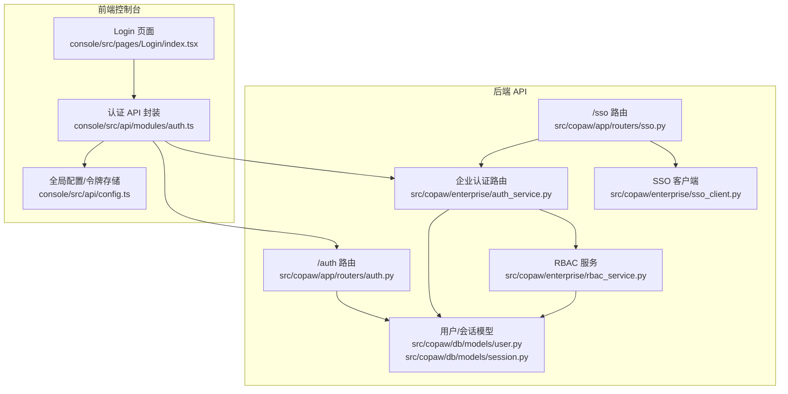
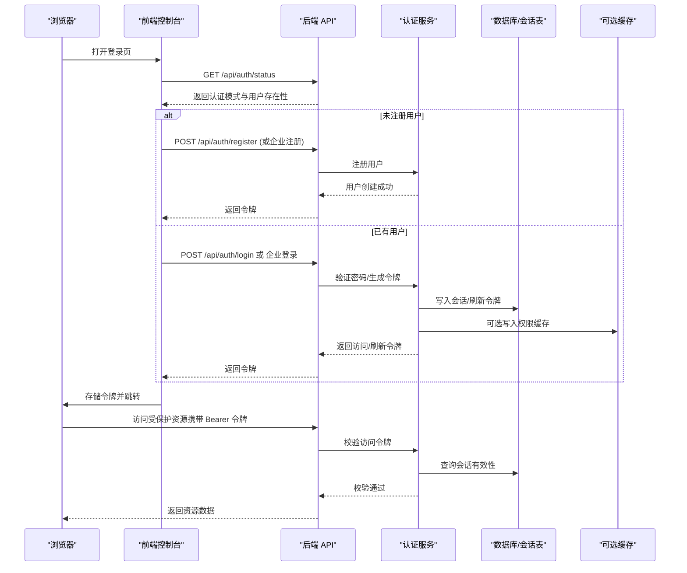
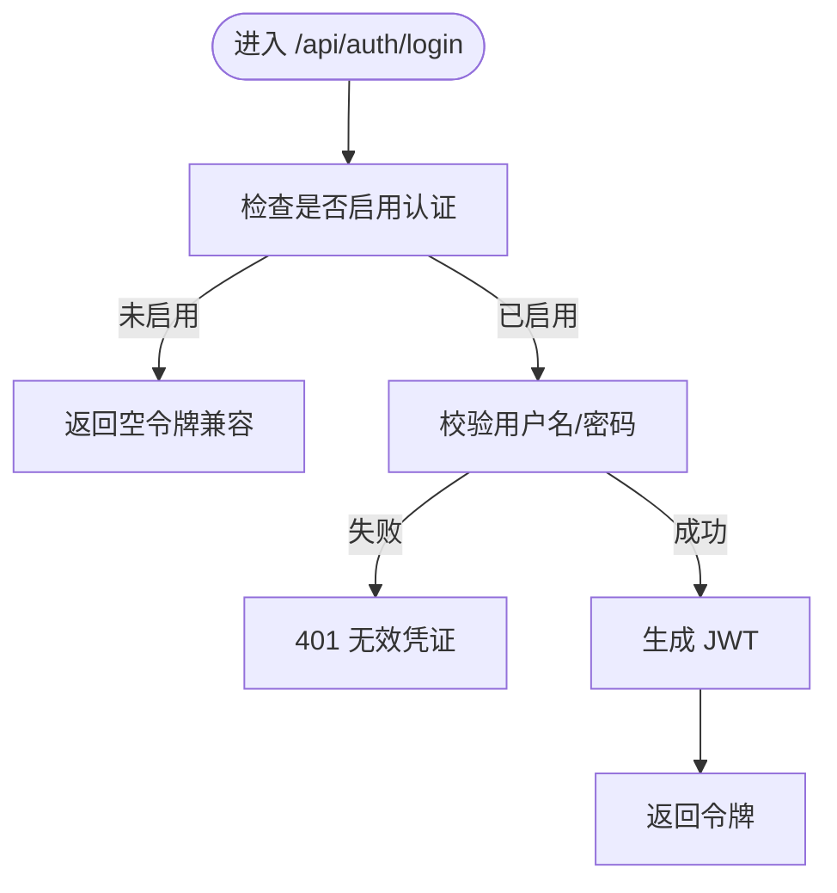
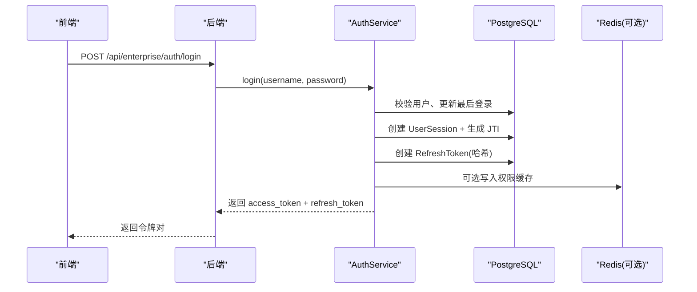
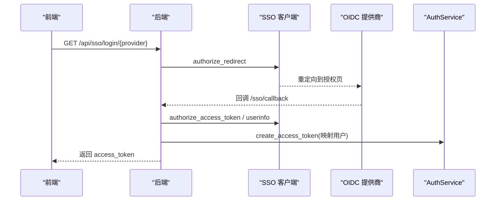
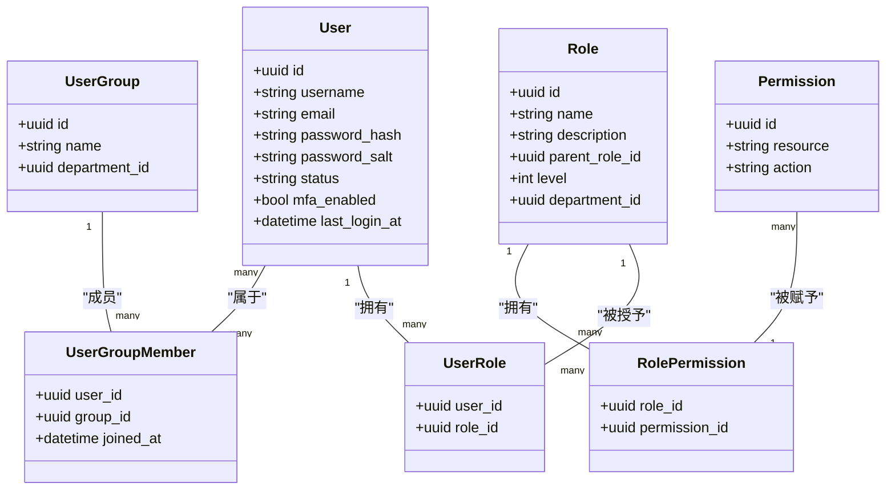
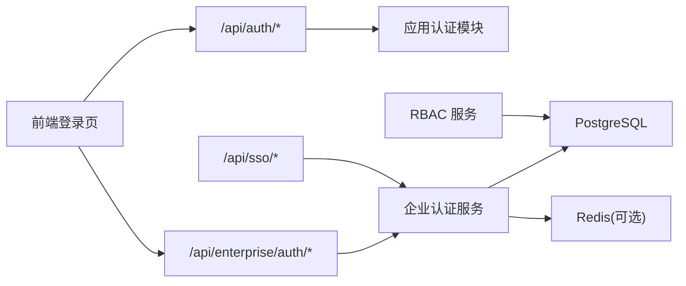

# 认证与授权

<cite>
**本文引用的文件**
- [src/copaw/app/auth.py](file://src/copaw/app/auth.py)
- [src/copaw/app/routers/auth.py](file://src/copaw/app/routers/auth.py)
- [src/copaw/enterprise/auth_service.py](file://src/copaw/enterprise/auth_service.py)
- [src/copaw/app/routers/sso.py](file://src/copaw/app/routers/sso.py)
- [src/copaw/enterprise/sso_client.py](file://src/copaw/enterprise/sso_client.py)
- [src/copaw/db/models/user.py](file://src/copaw/db/models/user.py)
- [src/copaw/db/models/session.py](file://src/copaw/db/models/session.py)
- [src/copaw/enterprise/rbac_service.py](file://src/copaw/enterprise/rbac_service.py)
- [src/copaw/app/routers/roles.py](file://src/copaw/app/routers/roles.py)
- [src/copaw/app/routers/departments.py](file://src/copaw/app/routers/departments.py)
- [src/copaw/app/routers/user_groups.py](file://src/copaw/app/routers/user_groups.py)
- [src/copaw/security/secret_store.py](file://src/copaw/security/secret_store.py)
- [console/src/pages/Login/index.tsx](file://console/src/pages/Login/index.tsx)
- [console/src/api/modules/auth.ts](file://console/src/api/modules/auth.ts)
- [console/src/api/config.ts](file://console/src/api/config.ts)
- [alembic/versions/001_initial_schema.py](file://alembic/versions/001_initial_schema.py)
</cite>

## 目录
1. [简介](#简介)
2. [项目结构](#项目结构)
3. [核心组件](#核心组件)
4. [架构总览](#架构总览)
5. [详细组件分析](#详细组件分析)
6. [依赖分析](#依赖分析)
7. [性能考虑](#性能考虑)
8. [故障排除指南](#故障排除指南)
9. [结论](#结论)
10. [附录](#附录)

## 简介
本文件面向 CoPaw 的认证与授权系统，覆盖以下主题：
- 支持的认证方式：用户名/密码、企业版 OAuth（通过 OIDC）、SSO（OpenID Connect）。
- JWT 令牌的生成、验证与会话生命周期（含刷新令牌）。
- 企业版 RBAC 权限模型：角色、部门、用户组及其继承与权限映射。
- 前端登录流程与后端 API 调用链路。
- 安全最佳实践：密码策略、会话管理、CSRF 保护建议、API 密钥管理。
- 认证失败处理与重试策略。
- 企业 SSO 集成配置与故障排除。

## 项目结构
认证与授权相关代码主要分布在后端 Python 模块与前端控制台两部分：
- 后端
  - 单用户轻量认证：src/copaw/app/auth.py 及其路由 src/copaw/app/routers/auth.py
  - 企业版认证与会话：src/copaw/enterprise/auth_service.py、会话模型 src/copaw/db/models/session.py
  - SSO：路由 src/copaw/app/routers/sso.py、客户端封装 src/copaw/enterprise/sso_client.py
  - RBAC：服务 src/copaw/enterprise/rbac_service.py、角色/部门/用户组路由
  - 密钥与敏感字段加密：src/copaw/security/secret_store.py
- 前端
  - 登录页与认证 API：console/src/pages/Login/index.tsx、console/src/api/modules/auth.ts、console/src/api/config.ts

图表来源
- [console/src/pages/Login/index.tsx:1-234](file://console/src/pages/Login/index.tsx#L1-L234)
- [console/src/api/modules/auth.ts:1-47](file://console/src/api/modules/auth.ts#L1-L47)
- [console/src/api/config.ts:38-67](file://console/src/api/config.ts#L38-L67)
- [src/copaw/app/routers/auth.py:1-204](file://src/copaw/app/routers/auth.py#L1-L204)
- [src/copaw/enterprise/auth_service.py:1-367](file://src/copaw/enterprise/auth_service.py#L1-L367)
- [src/copaw/app/routers/sso.py:1-111](file://src/copaw/app/routers/sso.py#L1-L111)
- [src/copaw/enterprise/sso_client.py:1-45](file://src/copaw/enterprise/sso_client.py#L1-L45)
- [src/copaw/enterprise/rbac_service.py:1-262](file://src/copaw/enterprise/rbac_service.py#L1-L262)
- [src/copaw/db/models/user.py:1-158](file://src/copaw/db/models/user.py#L1-L158)
- [src/copaw/db/models/session.py:1-116](file://src/copaw/db/models/session.py#L1-L116)

章节来源
- [src/copaw/app/auth.py:1-441](file://src/copaw/app/auth.py#L1-L441)
- [src/copaw/app/routers/auth.py:1-204](file://src/copaw/app/routers/auth.py#L1-L204)
- [src/copaw/enterprise/auth_service.py:1-367](file://src/copaw/enterprise/auth_service.py#L1-L367)
- [src/copaw/app/routers/sso.py:1-111](file://src/copaw/app/routers/sso.py#L1-L111)
- [src/copaw/enterprise/sso_client.py:1-45](file://src/copaw/enterprise/sso_client.py#L1-L45)
- [src/copaw/enterprise/rbac_service.py:1-262](file://src/copaw/enterprise/rbac_service.py#L1-L262)
- [src/copaw/db/models/user.py:1-158](file://src/copaw/db/models/user.py#L1-L158)
- [src/copaw/db/models/session.py:1-116](file://src/copaw/db/models/session.py#L1-L116)
- [console/src/pages/Login/index.tsx:1-234](file://console/src/pages/Login/index.tsx#L1-L234)
- [console/src/api/modules/auth.ts:1-47](file://console/src/api/modules/auth.ts#L1-L47)
- [console/src/api/config.ts:38-67](file://console/src/api/config.ts#L38-L67)

## 核心组件
- 单用户认证模块（非企业）
  - 提供注册、登录、令牌签发与校验、中间件拦截等能力，适用于单用户场景。
- 企业认证服务
  - 多用户、基于 bcrypt 的密码、HS256 JWT、刷新令牌、会话审计、MFA（TOTP）。
- SSO（OIDC）
  - 提供 /sso/login 与 /sso/callback，支持 mock OIDC 以演示流程；实际部署需配置真实提供商。
- RBAC 权限服务
  - 角色树形继承（最多 5 层），权限缓存（Redis），按用户聚合直接与继承权限。
- 数据模型
  - 用户、会话、刷新令牌、用户组、部门等。
- 密钥与敏感字段加密
  - 使用 Fernet 对称加密，支持 OS Keychain 或本地主密钥文件。

章节来源
- [src/copaw/app/auth.py:1-441](file://src/copaw/app/auth.py#L1-L441)
- [src/copaw/enterprise/auth_service.py:1-367](file://src/copaw/enterprise/auth_service.py#L1-L367)
- [src/copaw/app/routers/sso.py:1-111](file://src/copaw/app/routers/sso.py#L1-L111)
- [src/copaw/enterprise/rbac_service.py:1-262](file://src/copaw/enterprise/rbac_service.py#L1-L262)
- [src/copaw/db/models/user.py:1-158](file://src/copaw/db/models/user.py#L1-L158)
- [src/copaw/db/models/session.py:1-116](file://src/copaw/db/models/session.py#L1-L116)
- [src/copaw/security/secret_store.py:1-284](file://src/copaw/security/secret_store.py#L1-L284)

## 架构总览
下图展示了从浏览器登录到访问受保护资源的整体流程，涵盖用户名/密码、企业认证与 SSO 三种路径。

图表来源
- [console/src/pages/Login/index.tsx:1-234](file://console/src/pages/Login/index.tsx#L1-L234)
- [console/src/api/modules/auth.ts:1-47](file://console/src/api/modules/auth.ts#L1-L47)
- [src/copaw/app/routers/auth.py:1-204](file://src/copaw/app/routers/auth.py#L1-L204)
- [src/copaw/enterprise/auth_service.py:1-367](file://src/copaw/enterprise/auth_service.py#L1-L367)
- [src/copaw/db/models/session.py:1-116](file://src/copaw/db/models/session.py#L1-L116)
- [src/copaw/enterprise/rbac_service.py:1-262](file://src/copaw/enterprise/rbac_service.py#L1-L262)

## 详细组件分析

### 组件一：用户名/密码认证（单用户）
- 功能要点
  - 注册：仅允许一次注册，注册后写入加密的 auth.json。
  - 登录：校验用户名与密码，签发短期 JWT。
  - 中间件：对 /api/ 路由进行 Bearer 校验，忽略公共路径与静态资源。
- 令牌与安全
  - 自签名 HMAC-SHA256 令牌，不含第三方依赖；默认有效期 7 天。
  - 密码采用 salted SHA-256 存储，首次加载自动迁移至加密字段。
- 前端交互
  - 登录页根据 /api/auth/status 判断是否需要注册或直接登录，并在成功后将令牌写入 localStorage。

图表来源
- [src/copaw/app/routers/auth.py:43-53](file://src/copaw/app/routers/auth.py#L43-L53)
- [src/copaw/app/auth.py:347-363](file://src/copaw/app/auth.py#L347-L363)
- [src/copaw/app/auth.py:121-139](file://src/copaw/app/auth.py#L121-L139)

章节来源
- [src/copaw/app/auth.py:1-441](file://src/copaw/app/auth.py#L1-L441)
- [src/copaw/app/routers/auth.py:1-204](file://src/copaw/app/routers/auth.py#L1-L204)
- [console/src/pages/Login/index.tsx:1-234](file://console/src/pages/Login/index.tsx#L1-L234)

### 组件二：企业版认证与会话（多用户、JWT、刷新令牌）
- 功能要点
  - 注册/登录：唯一用户名与邮箱校验，bcrypt 哈希，生成访问令牌与刷新令牌。
  - 会话管理：UserSession + RefreshToken，支持撤销与过期控制。
  - 令牌验证：解码 HS256，结合会话表校验撤销与过期。
  - MFA：TOTP 生成与校验。
- 令牌与刷新
  - 访问令牌：包含用户标识、用户名、角色列表、JTI、签发与过期时间。
  - 刷新令牌：一次性使用，服务端保存哈希，过期时间可配置。
- 前端交互
  - 登录成功后前端存储 access_token 并在后续请求头携带 Authorization: Bearer。

图表来源
- [src/copaw/enterprise/auth_service.py:151-229](file://src/copaw/enterprise/auth_service.py#L151-L229)
- [src/copaw/db/models/session.py:1-116](file://src/copaw/db/models/session.py#L1-L116)
- [console/src/api/modules/auth.ts:15-43](file://console/src/api/modules/auth.ts#L15-L43)

章节来源
- [src/copaw/enterprise/auth_service.py:1-367](file://src/copaw/enterprise/auth_service.py#L1-L367)
- [src/copaw/db/models/session.py:1-116](file://src/copaw/db/models/session.py#L1-L116)
- [console/src/api/modules/auth.ts:1-47](file://console/src/api/modules/auth.ts#L1-L47)

### 组件三：SSO（OIDC）集成
- 功能要点
  - /sso/login/{provider}：重定向到 OIDC 授权服务器。
  - /sso/callback/{provider}：接收回调，解析用户信息，自动创建或映射用户，发放企业版访问令牌。
  - mock provider：开发测试用，模拟 OIDC 回调。
- 前端交互
  - 登录页检测企业模式后，调用企业认证接口；SSO 流程由后端完成，前端最终获得 access_token。

图表来源
- [src/copaw/app/routers/sso.py:24-111](file://src/copaw/app/routers/sso.py#L24-L111)
- [src/copaw/enterprise/sso_client.py:17-45](file://src/copaw/enterprise/sso_client.py#L17-L45)
- [src/copaw/enterprise/auth_service.py:329-367](file://src/copaw/enterprise/auth_service.py#L329-L367)

章节来源
- [src/copaw/app/routers/sso.py:1-111](file://src/copaw/app/routers/sso.py#L1-L111)
- [src/copaw/enterprise/sso_client.py:1-45](file://src/copaw/enterprise/sso_client.py#L1-L45)
- [src/copaw/enterprise/auth_service.py:1-367](file://src/copaw/enterprise/auth_service.py#L1-L367)

### 组件四：RBAC 权限模型（角色/部门/用户组）
- 角色与继承
  - 角色支持父子关系，最大深度 5；权限通过角色继承传递。
  - 角色创建时计算层级，超过上限则拒绝。
- 权限检查
  - 用户权限 = 直接角色权限 ∪ 祖先角色权限（最多 5 层）。
  - 支持 Redis 缓存用户权限集合，键格式 rbac:user:{user_id}:perms。
- 用户与组织单元
  - 用户可归属部门与用户组；用户组支持按部门过滤。
- 数据模型
  - 用户、角色、角色权限、用户角色、用户组、用户组成员、部门等。

图表来源
- [src/copaw/db/models/user.py:1-158](file://src/copaw/db/models/user.py#L1-L158)
- [src/copaw/enterprise/rbac_service.py:1-262](file://src/copaw/enterprise/rbac_service.py#L1-L262)
- [alembic/versions/001_initial_schema.py:93-106](file://alembic/versions/001_initial_schema.py#L93-L106)

章节来源
- [src/copaw/enterprise/rbac_service.py:1-262](file://src/copaw/enterprise/rbac_service.py#L1-L262)
- [src/copaw/app/routers/roles.py:1-121](file://src/copaw/app/routers/roles.py#L1-L121)
- [src/copaw/app/routers/departments.py:1-184](file://src/copaw/app/routers/departments.py#L1-L184)
- [src/copaw/app/routers/user_groups.py:1-158](file://src/copaw/app/routers/user_groups.py#L1-L158)
- [src/copaw/db/models/user.py:1-158](file://src/copaw/db/models/user.py#L1-L158)
- [alembic/versions/001_initial_schema.py:93-106](file://alembic/versions/001_initial_schema.py#L93-L106)

### 组件五：API 密钥与敏感字段加密
- 敏感字段
  - auth.json 中的 jwt_secret；第三方提供商的 api_key。
- 加密机制
  - Fernet（AES-128-CBC + HMAC-SHA256），主密钥优先来自 OS Keychain，否则落盘于 SECRET_DIR/.master_key。
  - 字段透明加解密，支持明文迁移与容错。
- 前端令牌存储
  - 登录成功后将 access_token 写入 localStorage，后续请求由前端统一注入 Authorization 头。

章节来源
- [src/copaw/security/secret_store.py:1-284](file://src/copaw/security/secret_store.py#L1-L284)
- [console/src/api/config.ts:38-67](file://console/src/api/config.ts#L38-L67)

## 依赖分析
- 认证层
  - 前端登录页依赖认证 API；认证 API 调用后端 /auth 或 /enterprise/auth。
  - 企业认证依赖 PostgreSQL 与可选 Redis；SSO 依赖 Authlib OAuth 客户端。
- 权限层
  - RBAC 服务依赖数据库角色/权限关系；可选 Redis 缓存提升查询性能。
- 安全层
  - 单用户认证使用自签名 HMAC 令牌；企业认证使用 HS256 令牌并配合会话表撤销。

图表来源
- [console/src/pages/Login/index.tsx:1-234](file://console/src/pages/Login/index.tsx#L1-L234)
- [src/copaw/app/routers/auth.py:1-204](file://src/copaw/app/routers/auth.py#L1-L204)
- [src/copaw/enterprise/auth_service.py:1-367](file://src/copaw/enterprise/auth_service.py#L1-L367)
- [src/copaw/app/routers/sso.py:1-111](file://src/copaw/app/routers/sso.py#L1-L111)
- [src/copaw/enterprise/rbac_service.py:1-262](file://src/copaw/enterprise/rbac_service.py#L1-L262)

## 性能考虑
- RBAC 权限缓存
  - 使用 Redis 缓存用户权限集合，降低频繁查询数据库的成本；变更角色/权限时主动失效缓存。
- 令牌校验
  - 企业版访问令牌需查会话表确认未撤销且未过期，建议在网关或中间件层做快速校验（如 JTI 查重）。
- 会话与刷新
  - 刷新令牌一次性使用并哈希存储，避免重放风险；合理设置过期时间平衡安全与体验。

## 故障排除指南
- 登录失败
  - 单用户：检查 COPAW_AUTH_ENABLED 是否开启，确认用户名/密码正确。
  - 企业版：检查数据库连接、用户是否存在、状态是否为 active。
- 令牌无效或过期
  - 企业版：确认 access_token 未被撤销（会话表 revoked=false、expires_at>now）。
  - 刷新令牌：确认未被重复使用（used=false），哈希匹配。
- SSO 回调异常
  - 检查 OIDC 提供商配置、回调地址、网络可达性；mock provider 仅用于开发演示。
- 前端无法持久化令牌
  - 检查 localStorage 写入权限与跨域设置；确认路由跳转逻辑正确。

章节来源
- [src/copaw/app/routers/auth.py:43-53](file://src/copaw/app/routers/auth.py#L43-L53)
- [src/copaw/enterprise/auth_service.py:233-258](file://src/copaw/enterprise/auth_service.py#L233-L258)
- [src/copaw/app/routers/sso.py:38-111](file://src/copaw/app/routers/sso.py#L38-L111)
- [console/src/api/config.ts:38-67](file://console/src/api/config.ts#L38-L67)

## 结论
CoPaw 提供了从单用户到企业级的完整认证与授权方案：
- 单用户场景使用轻量 HMAC 令牌，适合本地或简单部署。
- 企业版引入多用户、HS256 JWT、刷新令牌、会话审计与 MFA，满足生产环境需求。
- RBAC 支持角色继承与缓存，兼顾灵活性与性能。
- SSO（OIDC）提供标准的企业身份接入能力，便于与现有 IAM 集成。
- 建议在生产环境中启用 HTTPS、限制令牌有效期、定期轮换密钥，并完善日志与审计。

## 附录

### 安全最佳实践
- 密码策略
  - 企业版使用 bcrypt，建议结合最小长度、复杂度与历史策略（可在上层业务强制）。
- 会话管理
  - 设置合理的 access_token 与 refresh_token 过期时间；启用撤销与审计。
- CSRF 保护
  - 前端仅通过 Bearer 令牌访问 /api/；若仍需表单提交，请在后端增加 CSRF 校验与 SameSite Cookie。
- API 密钥
  - 使用 Fernet 加密存储；最小权限原则；定期轮换；限制来源与 IP 白名单。

### API 密钥创建与管理
- 存储位置
  - 第三方提供商的 api_key 存储于配置 JSON 中，经 Fernet 加密后落盘。
- 加解密流程
  - 写入前透明加密；读取时透明解密；支持明文迁移与容错。
- 建议
  - 主密钥托管于 OS Keychain；定期轮换主密钥并重新加密存量密钥。

章节来源
- [src/copaw/security/secret_store.py:1-284](file://src/copaw/security/secret_store.py#L1-L284)