# RBAC 权限系统

<cite>
**本文引用的文件**
- [rbac_service.py](file://src/copaw/enterprise/rbac_service.py)
- [permission.py](file://src/copaw/db/models/permission.py)
- [role.py](file://src/copaw/db/models/role.py)
- [user.py](file://src/copaw/db/models/user.py)
- [organization.py](file://src/copaw/db/models/organization.py)
- [middleware.py](file://src/copaw/enterprise/middleware.py)
- [roles.py](file://src/copaw/app/routers/roles.py)
- [departments.py](file://src/copaw/app/routers/departments.py)
- [auth_service.py](file://src/copaw/enterprise/auth_service.py)
- [audit_service.py](file://src/copaw/enterprise/audit_service.py)
- [audit_log.py](file://src/copaw/db/models/audit_log.py)
- [audit.py](file://src/copaw/app/routers/audit.py)
- [base.py](file://src/copaw/db/models/base.py)
- [004_remove_user_groups.py](file://alembic/versions/004_remove_user_groups.py)
- [009_permission_enhancement.py](file://alembic/versions/009_permission_enhancement.py)
</cite>

## 更新摘要
**变更内容**
- 移除了用户组权限管理模块，用户组表和相关路由已被完全移除
- 新增了基于部门的组织权限体系，包括完整的部门管理API
- 增强了权限层次结构，权限模型支持父子关系和排序
- 新增了完整的审计日志系统，支持ISO 27001合规要求
- 权限模型增强了细粒度控制字段，支持前端路由映射和权限类型分类

## 目录
1. [简介](#简介)
2. [项目结构](#项目结构)
3. [核心组件](#核心组件)
4. [架构总览](#架构总览)
5. [详细组件分析](#详细组件分析)
6. [依赖分析](#依赖分析)
7. [性能考量](#性能考量)
8. [故障排查指南](#故障排查指南)
9. [结论](#结论)
10. [附录](#附录)

## 简介
本文件面向 CoPaw 企业版 RBAC（基于角色的访问控制）权限控制系统，系统性阐述权限模型设计、角色层级管理、权限继承机制、组织架构映射、权限检查流程、角色与部门管理、审计与安全中间件集成，以及性能优化与调试实践。目标是帮助产品、研发与运维团队建立清晰、可维护、可扩展且合规的权限管理体系。

**更新** 本版本反映了权限系统的重大重构：移除了用户组权限管理，新增了基于部门的组织权限体系，增强了权限层次结构和审计功能。

## 项目结构
围绕企业版 RBAC 的关键代码分布在以下模块：
- 数据模型层：角色、权限、用户、部门、审计日志等 ORM 模型
- 权限服务层：RBACService 提供权限检查、角色 CRUD、权限分配、用户角色分配/撤销等能力
- 路由层：企业版角色与权限、部门管理 API
- 认证与中间件：JWT 解码、会话校验、DLP 内容扫描与拦截
- 审计服务：ISO 27001 合规的审计日志记录与查询
- 基础设施：多租户隔离、UUID 主键、时间戳等通用混入

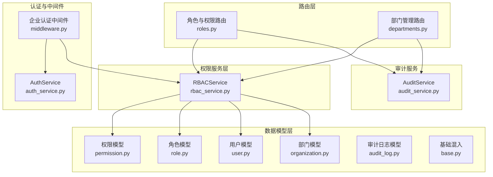

**图表来源**
- [roles.py:1-259](file://src/copaw/app/routers/roles.py#L1-L259)
- [departments.py:1-323](file://src/copaw/app/routers/departments.py#L1-L323)
- [rbac_service.py:1-322](file://src/copaw/enterprise/rbac_service.py#L1-L322)
- [middleware.py:1-191](file://src/copaw/enterprise/middleware.py#L1-L191)
- [auth_service.py:1-367](file://src/copaw/enterprise/auth_service.py#L1-L367)
- [permission.py:1-99](file://src/copaw/db/models/permission.py#L1-L99)
- [role.py:1-150](file://src/copaw/db/models/role.py#L1-L150)
- [user.py:1-158](file://src/copaw/db/models/user.py#L1-L158)
- [organization.py:1-88](file://src/copaw/db/models/organization.py#L1-L88)
- [audit_service.py:1-138](file://src/copaw/enterprise/audit_service.py#L1-L138)
- [audit_log.py:1-106](file://src/copaw/db/models/audit_log.py#L1-L106)
- [base.py:1-76](file://src/copaw/db/models/base.py#L1-L76)

**章节来源**
- [roles.py:1-259](file://src/copaw/app/routers/roles.py#L1-L259)
- [departments.py:1-323](file://src/copaw/app/routers/departments.py#L1-L323)
- [rbac_service.py:1-322](file://src/copaw/enterprise/rbac_service.py#L1-L322)
- [middleware.py:1-191](file://src/copaw/enterprise/middleware.py#L1-L191)
- [auth_service.py:1-367](file://src/copaw/enterprise/auth_service.py#L1-L367)
- [permission.py:1-99](file://src/copaw/db/models/permission.py#L1-L99)
- [role.py:1-150](file://src/copaw/db/models/role.py#L1-L150)
- [user.py:1-158](file://src/copaw/db/models/user.py#L1-L158)
- [organization.py:1-88](file://src/copaw/db/models/organization.py#L1-L88)
- [audit_service.py:1-138](file://src/copaw/enterprise/audit_service.py#L1-L138)
- [audit_log.py:1-106](file://src/copaw/db/models/audit_log.py#L1-L106)
- [base.py:1-76](file://src/copaw/db/models/base.py#L1-L76)

## 核心组件
- 权限模型 Permission：资源与操作的最小权限单元，支持通配符匹配和层次结构
- 角色模型 Role：支持最多 5 级父子层级，可绑定部门与系统角色标记
- 关联模型 RolePermission、UserRole：角色-权限多对多、用户-角色多对多
- 用户模型 User：用户基本信息、部门归属、状态与 MFA 加密存储
- 部门 Department：组织架构树，邻接表+递归 CTE 支持祖先/后代链遍历
- RBACService：权限检查、角色 CRUD、权限分配、用户角色分配/撤销、缓存失效
- 企业认证中间件 EnterpriseAuthMiddleware：JWT 校验、注入用户上下文、DLP 扫描
- AuthService：注册/登录/登出、JWT 签发、会话生命周期、MFA
- AuditService：审计日志记录与查询，覆盖角色与权限变更
- 审计日志模型 AuditLog：ISO 27001 合规的审计日志表

**更新** 新增了基于部门的组织权限体系，移除了用户组相关组件。

**章节来源**
- [permission.py:18-99](file://src/copaw/db/models/permission.py#L18-L99)
- [role.py:24-150](file://src/copaw/db/models/role.py#L24-L150)
- [user.py:25-158](file://src/copaw/db/models/user.py#L25-L158)
- [organization.py:21-88](file://src/copaw/db/models/organization.py#L21-L88)
- [rbac_service.py:30-322](file://src/copaw/enterprise/rbac_service.py#L30-L322)
- [middleware.py:57-191](file://src/copaw/enterprise/middleware.py#L57-L191)
- [auth_service.py:107-367](file://src/copaw/enterprise/auth_service.py#L107-L367)
- [audit_service.py:51-138](file://src/copaw/enterprise/audit_service.py#L51-L138)
- [audit_log.py:18-106](file://src/copaw/db/models/audit_log.py#L18-L106)

## 架构总览
下图展示从请求到权限判定、再到审计与 DLP 的完整链路，体现企业版 RBAC 的关键交互点。

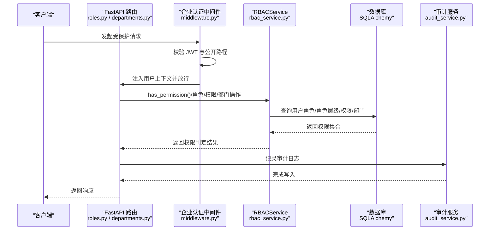

**图表来源**
- [middleware.py:69-144](file://src/copaw/enterprise/middleware.py#L69-L144)
- [roles.py:78-259](file://src/copaw/app/routers/roles.py#L78-L259)
- [departments.py:75-323](file://src/copaw/app/routers/departments.py#L75-L323)
- [rbac_service.py:35-124](file://src/copaw/enterprise/rbac_service.py#L35-L124)
- [audit_service.py:54-87](file://src/copaw/enterprise/audit_service.py#L54-L87)

## 详细组件分析

### 权限模型与匹配规则
- 权限由"资源:操作"构成，支持通配符匹配，包括"资源:*"、"*:操作"、"*:*"
- 权限模型增强了层次结构支持，支持父子关系和排序
- 新增权限类型字段，支持菜单、接口、按钮、数据四种类型
- 权限持久化于 sys_permissions 表，与角色通过 sys_role_permissions 关联

**更新** 权限模型现在支持更细粒度的权限控制，包括权限层次结构和类型分类。

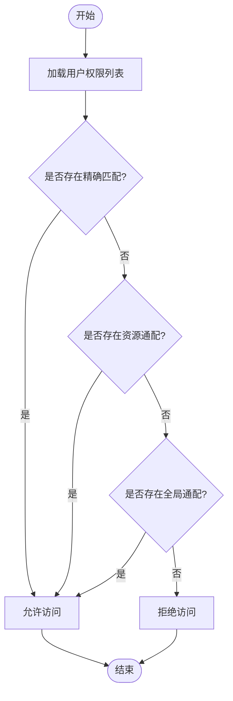

**图表来源**
- [rbac_service.py:313-322](file://src/copaw/enterprise/rbac_service.py#L313-L322)
- [permission.py:27-40](file://src/copaw/db/models/permission.py#L27-L40)

**章节来源**
- [rbac_service.py:313-322](file://src/copaw/enterprise/rbac_service.py#L313-L322)
- [permission.py:18-99](file://src/copaw/db/models/permission.py#L18-L99)

### 角色层级与继承
- 角色支持最多 5 级父子层级，通过 parent_role_id 维护树形结构
- 权限继承：用户的所有直接角色与其祖先角色（最多 5 层）共同决定最终权限集
- 层级展开采用广度优先搜索，逐层收集父角色 ID 并去重，避免循环与重复查询

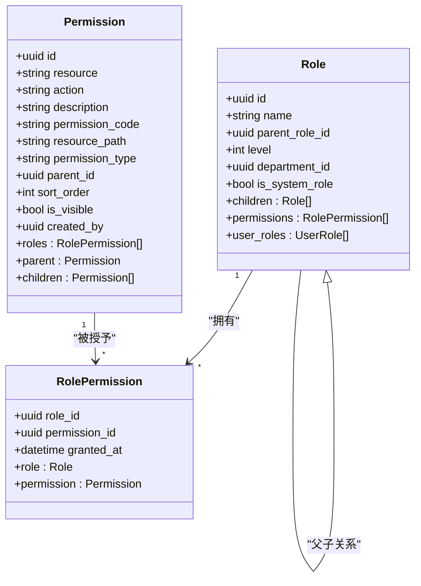

**图表来源**
- [role.py:24-150](file://src/copaw/db/models/role.py#L24-L150)
- [permission.py:18-99](file://src/copaw/db/models/permission.py#L18-L99)

**章节来源**
- [rbac_service.py:80-124](file://src/copaw/enterprise/rbac_service.py#L80-L124)
- [role.py:24-150](file://src/copaw/db/models/role.py#L24-L150)

### 用户、部门与组织架构
- 用户与部门通过外键关联，支持部门负责人与成员关系
- 部门管理 API 提供完整的 CRUD 操作，支持树形结构查询
- 组成员关系为多对多，支持批量添加/移除

**更新** 移除了用户组权限管理，新增了完整的部门管理功能。

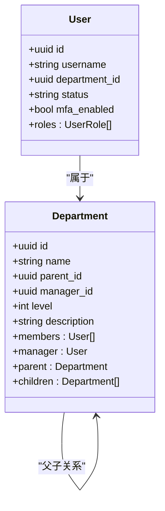

**图表来源**
- [user.py:25-158](file://src/copaw/db/models/user.py#L25-L158)
- [organization.py:21-88](file://src/copaw/db/models/organization.py#L21-L88)

**章节来源**
- [user.py:25-158](file://src/copaw/db/models/user.py#L25-L158)
- [organization.py:21-88](file://src/copaw/db/models/organization.py#L21-L88)

### 权限检查与缓存
- 缓存键格式：rbac:user:{user_id}:perms，值为 JSON 序列的"资源:操作"集合
- 缓存 TTL：默认 300 秒；当角色权限或用户角色发生变更时，主动失效相关用户的权限缓存
- 权限检查流程：先查缓存命中则直接返回，未命中则从数据库加载并写入缓存

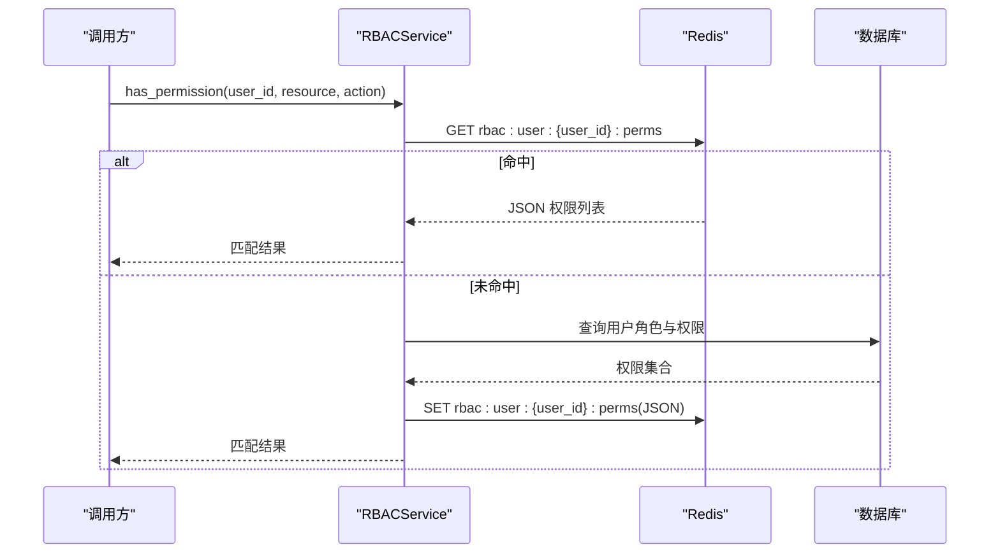

**图表来源**
- [rbac_service.py:35-64](file://src/copaw/enterprise/rbac_service.py#L35-L64)

**章节来源**
- [rbac_service.py:27-64](file://src/copaw/enterprise/rbac_service.py#L27-L64)

### 角色与权限管理 API
- 角色：创建、更新、删除、查询、列出；支持设置父角色、部门、系统角色标记
- 权限：创建、查询、列出；权限与角色通过批量替换式接口进行分配
- 审计：所有角色与权限相关操作均记录审计日志

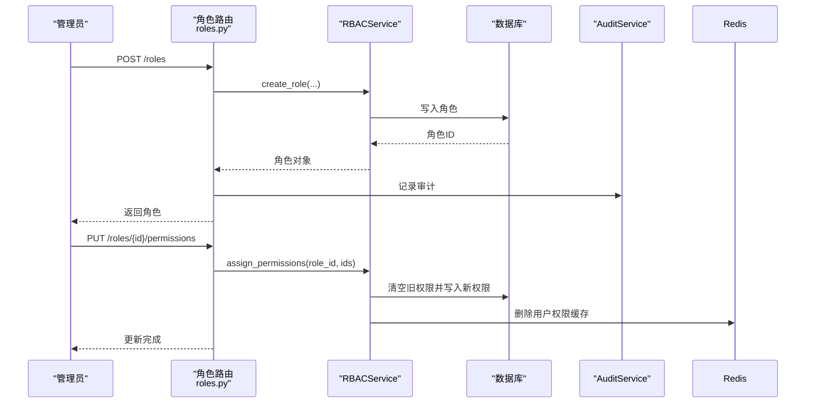

**图表来源**
- [roles.py:91-235](file://src/copaw/app/routers/roles.py#L91-L235)
- [rbac_service.py:127-184](file://src/copaw/enterprise/rbac_service.py#L127-L184)
- [audit_service.py:54-87](file://src/copaw/enterprise/audit_service.py#L54-L87)

**章节来源**
- [roles.py:78-259](file://src/copaw/app/routers/roles.py#L78-L259)
- [rbac_service.py:127-234](file://src/copaw/enterprise/rbac_service.py#L127-L234)
- [audit_service.py:51-138](file://src/copaw/enterprise/audit_service.py#L51-L138)

### 部门管理 API
- 部门：创建、更新、删除、查询、分页列表、按部门过滤
- 成员管理：批量添加、移除成员；添加为幂等操作
- 统计信息：支持部门成员数量和子部门数量统计
- 审计：记录部门创建/更新/删除、成员增删事件

**新增** 部门管理 API 是本次重构的重要组成部分。

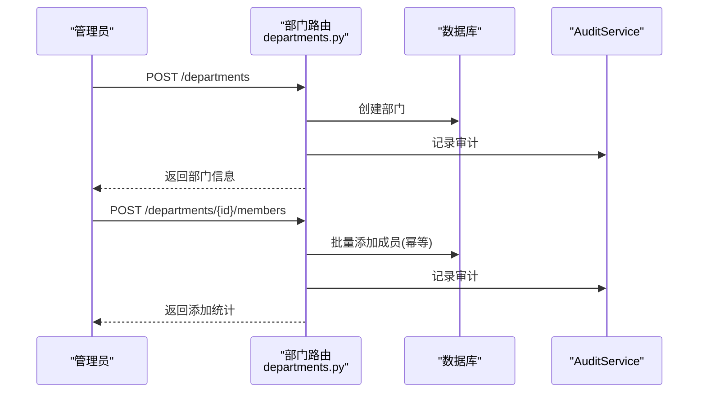

**图表来源**
- [departments.py:116-268](file://src/copaw/app/routers/departments.py#L116-L268)
- [audit_service.py:54-87](file://src/copaw/enterprise/audit_service.py#L54-L87)

**章节来源**
- [departments.py:75-323](file://src/copaw/app/routers/departments.py#L75-L323)
- [audit_service.py:51-138](file://src/copaw/enterprise/audit_service.py#L51-L138)

### 认证中间件与会话管理
- 企业认证中间件负责：跳过公开路径与 OPTIONS、提取并验证 JWT、注入用户上下文、DLP 内容扫描与拦截
- AuthService 负责：注册/登录/登出、签发/校验/吊销令牌、会话生命周期、MFA
- 中间件不直接访问数据库进行权限校验，权限校验由 RBACService 在路由层完成

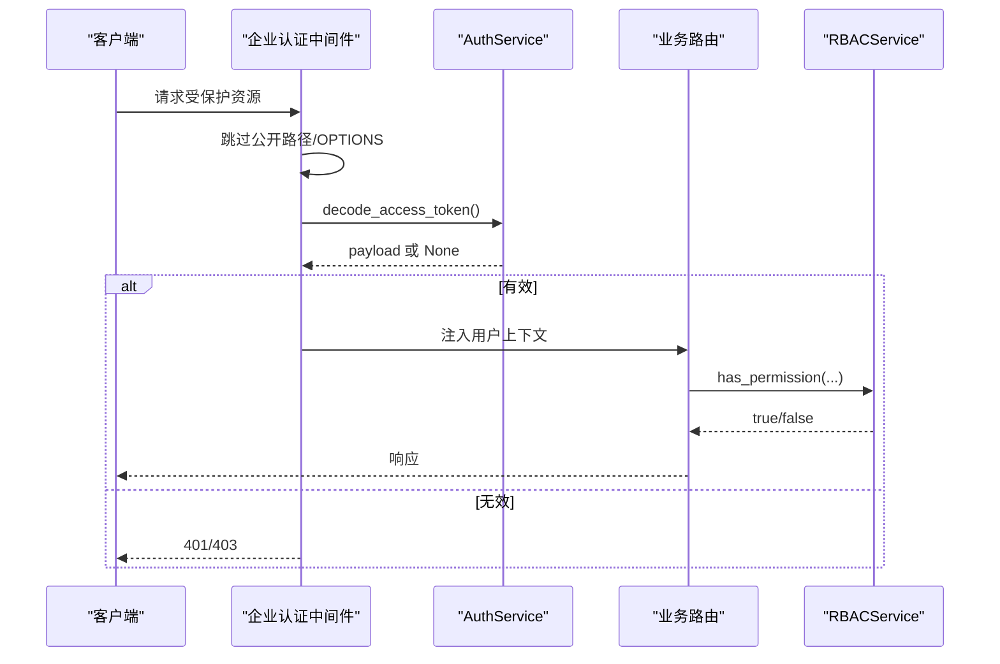

**图表来源**
- [middleware.py:69-144](file://src/copaw/enterprise/middleware.py#L69-L144)
- [auth_service.py:93-103](file://src/copaw/enterprise/auth_service.py#L93-L103)
- [rbac_service.py:35-64](file://src/copaw/enterprise/rbac_service.py#L35-L64)

**章节来源**
- [middleware.py:57-191](file://src/copaw/enterprise/middleware.py#L57-L191)
- [auth_service.py:107-367](file://src/copaw/enterprise/auth_service.py#L107-L367)
- [rbac_service.py:30-64](file://src/copaw/enterprise/rbac_service.py#L30-L64)

### 审计系统
- AuditService 提供 ISO 27001 合规的审计日志记录与查询
- 审计日志模型包含完整的操作追踪信息：谁、做了什么、何时、结果如何、从哪里
- 支持丰富的过滤条件：用户、操作类型、资源类型、结果、时间范围、敏感操作标记
- 审计日志表支持索引优化，便于查询和分析

**新增** 完整的审计日志系统是本次重构的重要增强。

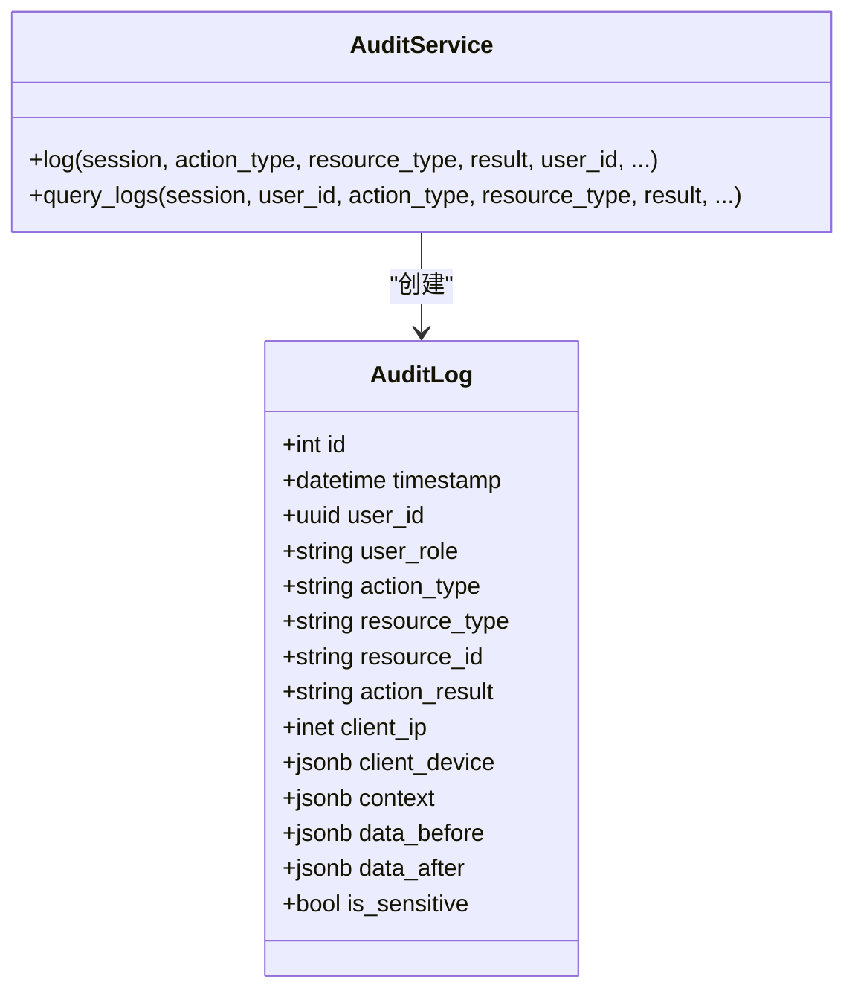

**图表来源**
- [audit_log.py:18-106](file://src/copaw/db/models/audit_log.py#L18-L106)
- [audit_service.py:54-138](file://src/copaw/enterprise/audit_service.py#L54-L138)

**章节来源**
- [audit_service.py:51-138](file://src/copaw/enterprise/audit_service.py#L51-L138)
- [audit_log.py:18-106](file://src/copaw/db/models/audit_log.py#L18-L106)

## 依赖分析
- 权限服务依赖数据库模型：Permission、Role、UserRole、RolePermission、User、Department
- 路由层依赖 RBACService 与审计服务；部门路由依赖用户与部门模型
- 中间件依赖 AuthService 进行 JWT 解码，并在响应阶段进行 DLP 扫描
- 多租户隔离通过 TenantAwareMixin 统一约束，确保数据隔离

**更新** 移除了用户组相关依赖，新增了审计日志依赖。

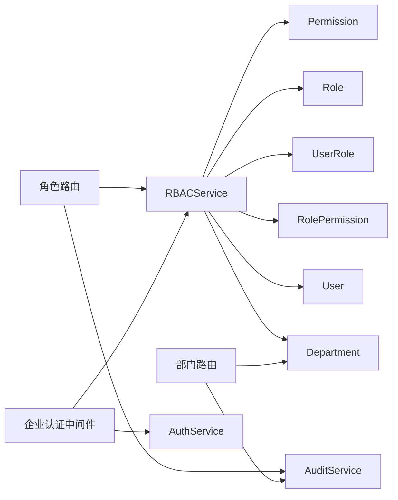

**图表来源**
- [rbac_service.py:21-25](file://src/copaw/enterprise/rbac_service.py#L21-L25)
- [roles.py:19-24](file://src/copaw/app/routers/roles.py#L19-L24)
- [departments.py:20-26](file://src/copaw/app/routers/departments.py#L20-L26)
- [middleware.py:22-25](file://src/copaw/enterprise/middleware.py#L22-L25)

**章节来源**
- [rbac_service.py:21-25](file://src/copaw/enterprise/rbac_service.py#L21-L25)
- [roles.py:19-24](file://src/copaw/app/routers/roles.py#L19-L24)
- [departments.py:20-26](file://src/copaw/app/routers/departments.py#L20-L26)
- [middleware.py:22-25](file://src/copaw/enterprise/middleware.py#L22-L25)

## 性能考量
- 缓存策略：权限检查使用 Redis 缓存，TTL 默认 300 秒；权限或角色变更时主动失效相关用户缓存，避免陈旧权限
- 查询优化：角色层级展开限制为 5 层，减少深层遍历成本；权限集合一次性加载后进行内存匹配
- 会话与令牌：中间件仅做签名与过期校验，实际吊销检查在路由层按需执行，降低中间件开销
- 批量操作：部门成员批量添加为幂等，减少重复写入；角色权限分配采用"清空-重建"以简化逻辑与保证一致性
- 审计性能：审计日志采用异步写入，支持批量处理，避免阻塞主业务流程

**更新** 新增了审计系统的性能考量。

[本节为通用性能指导，无需列出具体文件来源]

## 故障排查指南
- 权限不生效
  - 检查用户是否已分配角色，且角色层级不超过 5 层
  - 确认权限字符串格式为"资源:操作"，并考虑通配符匹配规则
  - 若刚变更权限，请等待缓存过期或触发缓存失效
- 角色/权限变更后仍提示旧权限
  - 确认 RBACService 在权限或角色变更时已清理相关用户缓存键
  - 检查 Redis 是否可用，以及缓存键命名是否一致
- 登录失败或被拒绝
  - 中间件返回 401/403 时，确认 JWT 是否有效、是否被吊销、是否命中 DLP 拦截
  - 使用 AuthService 的令牌校验接口确认会话状态
- 审计与合规
  - 使用 AuditService 查询接口定位问题操作人、时间、结果与上下文
  - 对敏感操作开启 is_sensitive 标记，便于审计追踪
  - 检查审计日志表索引是否正常，避免查询性能问题

**更新** 新增了审计系统的故障排查指导。

**章节来源**
- [rbac_service.py:175-184](file://src/copaw/enterprise/rbac_service.py#L175-L184)
- [middleware.py:86-144](file://src/copaw/enterprise/middleware.py#L86-L144)
- [audit_service.py:90-138](file://src/copaw/enterprise/audit_service.py#L90-L138)

## 结论
CoPaw 企业版 RBAC 通过清晰的数据模型、严格的层级继承与高效的缓存策略，构建了可扩展、可观测、可审计的权限体系。结合企业认证中间件与审计服务，实现了从登录到权限判定、再到合规审计的全链路闭环。本次重构移除了冗余的用户组权限管理，新增了基于部门的组织权限体系，增强了权限层次结构和审计功能，为企业级权限管理提供了更强大的支持。建议在生产环境中配合缓存监控、权限变更审计与 DLP 策略，持续优化权限治理与安全运营。

**更新** 强调了本次重构的核心改进和价值。

[本节为总结性内容，无需列出具体文件来源]

## 附录
- 多租户隔离：所有实体均继承 TenantAwareMixin，默认租户 ID 为 default-tenant，可通过请求头或 JWT 注入
- 时间戳与软删除：统一使用 TimestampMixin 与 SoftDeleteMixin，便于审计与数据恢复
- 组织架构：Department 支持邻接表与递归 CTE 遍历，满足复杂组织关系查询需求
- 权限层次：Permission 支持父子关系和排序，便于构建复杂的权限层次结构
- 审计合规：AuditLog 符合 ISO 27001 标准，支持完整的操作追踪和合规审计

**更新** 新增了权限层次和审计合规的相关信息。

**章节来源**
- [base.py:65-76](file://src/copaw/db/models/base.py#L65-L76)
- [organization.py:26-36](file://src/copaw/db/models/organization.py#L26-L36)
- [permission.py:46-99](file://src/copaw/db/models/permission.py#L46-L99)
- [audit_log.py:18-40](file://src/copaw/db/models/audit_log.py#L18-L40)