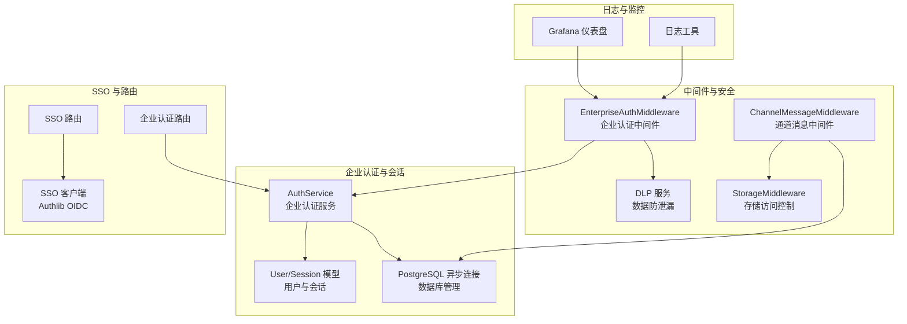
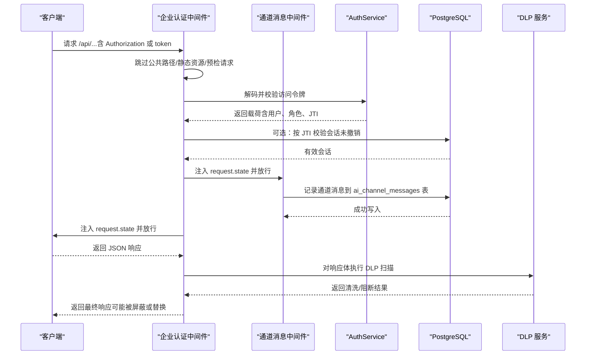
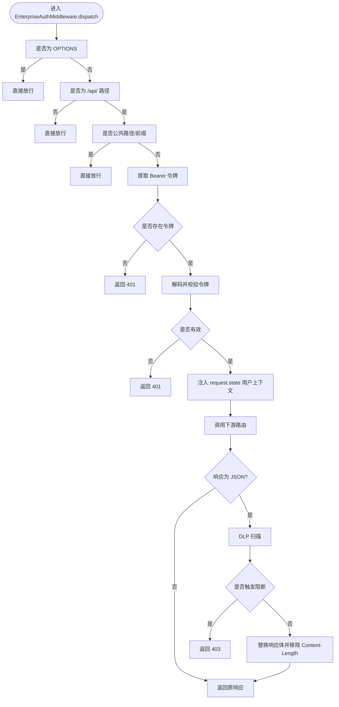
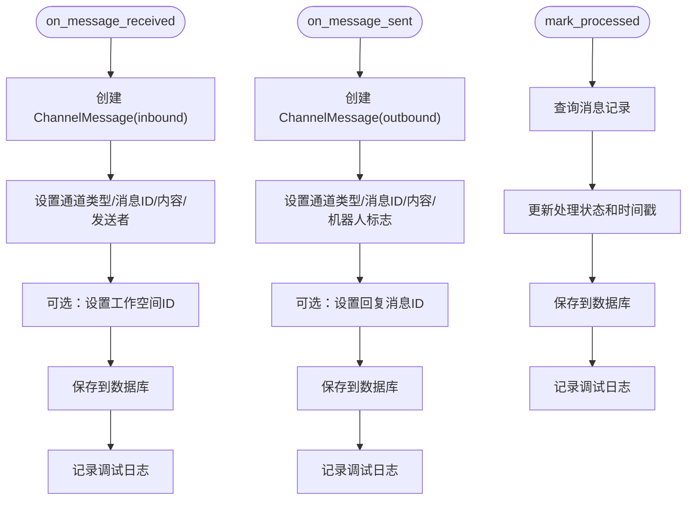
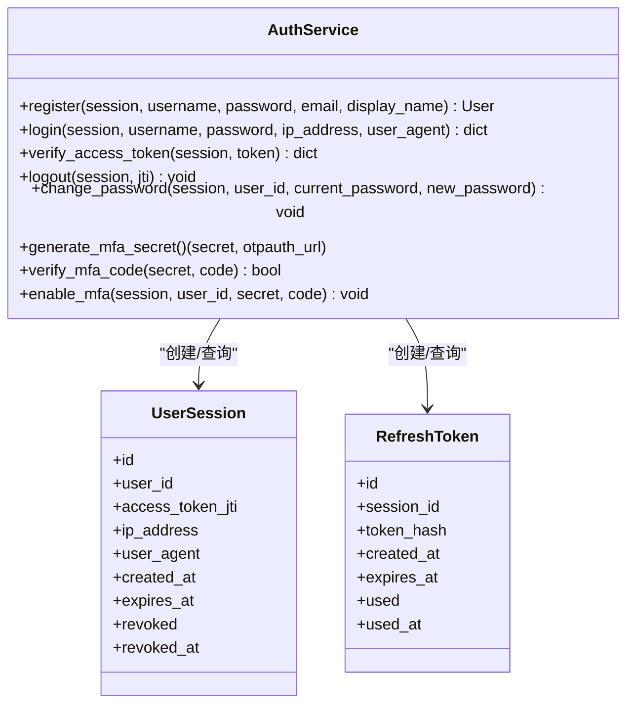
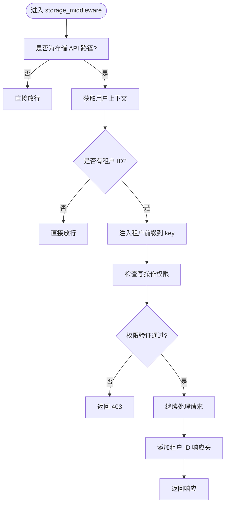
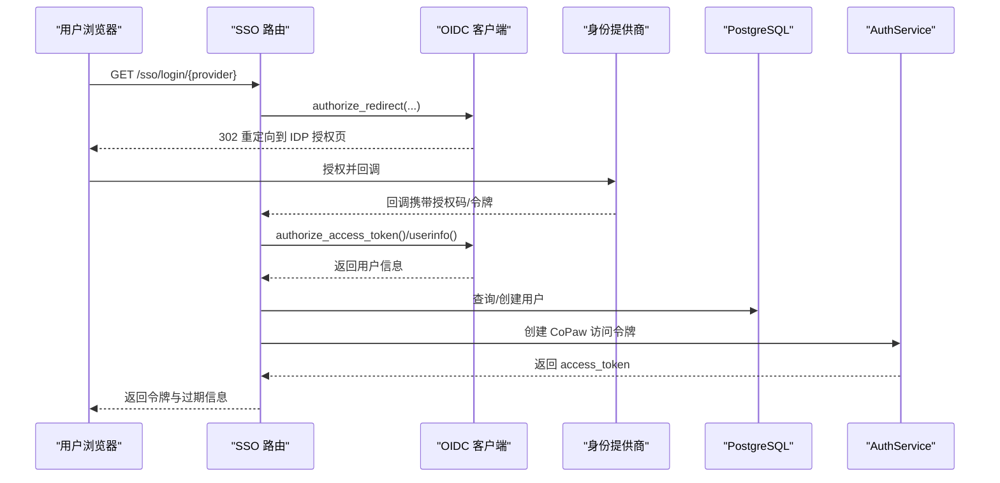
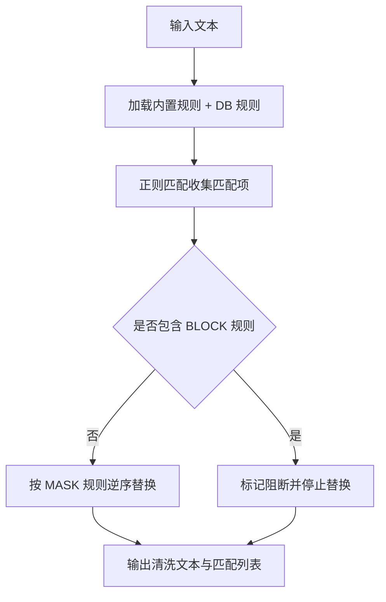
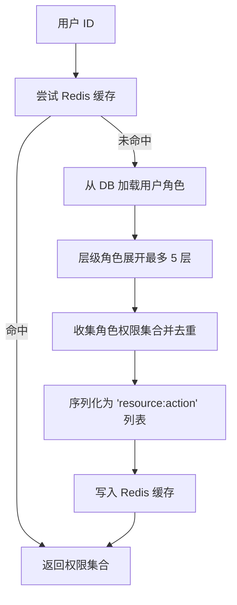
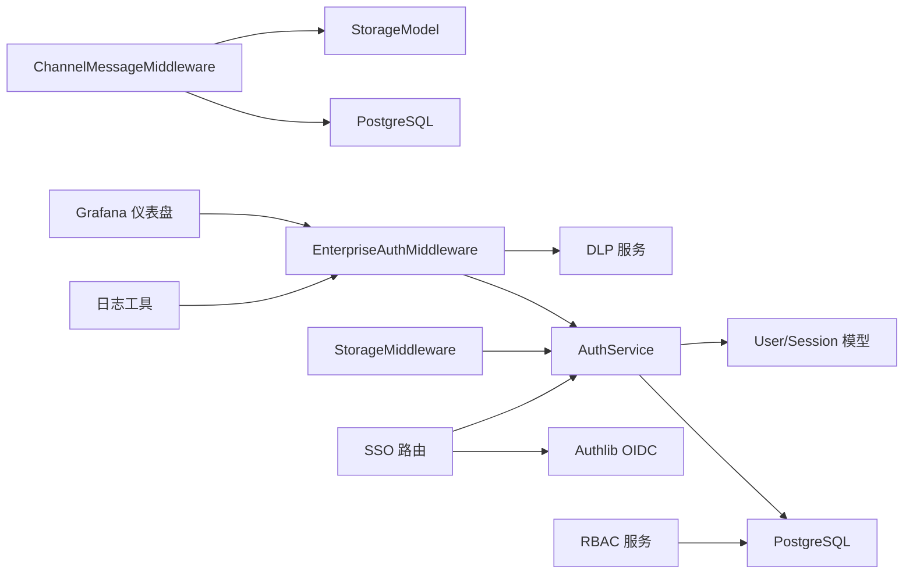

# 中间件集成

<cite>
**本文引用的文件**
- [src/copaw/enterprise/middleware.py](file://src/copaw/enterprise/middleware.py)
- [src/copaw/enterprise/channel_message_middleware.py](file://src/copaw/enterprise/channel_message_middleware.py)
- [src/copaw/enterprise/auth_service.py](file://src/copaw/enterprise/auth_service.py)
- [src/copaw/db/models/storage_meta.py](file://src/copaw/db/models/storage_meta.py)
- [src/copaw/storage/middleware.py](file://src/copaw/storage/middleware.py)
- [src/copaw/app/_app.py](file://src/copaw/app/_app.py)
- [src/copaw/enterprise/dlp_service.py](file://src/copaw/enterprise/dlp_service.py)
- [src/copaw/app/routers/enterprise_auth.py](file://src/copaw/app/routers/enterprise_auth.py)
- [src/copaw/app/routers/sso.py](file://src/copaw/app/routers/sso.py)
- [src/copaw/enterprise/sso_client.py](file://src/copaw/enterprise/sso_client.py)
- [src/copaw/enterprise/rbac_service.py](file://src/copaw/enterprise/rbac_service.py)
- [src/copaw/db/postgresql.py](file://src/copaw/db/postgresql.py)
- [src/copaw/db/models/session.py](file://src/copaw/db/models/session.py)
- [src/copaw/db/models/user.py](file://src/copaw/db/models/user.py)
- [src/copaw/utils/logging.py](file://src/copaw/utils/logging.py)
- [deploy/monitoring/grafana_dashboard.json](file://deploy/monitoring/grafana_dashboard.json)
</cite>

## 更新摘要
**变更内容**
- 新增通道消息中间件（ChannelMessageMiddleware）用于拦截和记录通道消息
- 更新企业认证中间件（EnterpriseAuthMiddleware）替代传统单用户认证
- 增强 DLP 服务与中间件的集成
- 完善存储中间件的访问控制功能
- 更新应用初始化中的中间件配置

## 目录
1. [简介](#简介)
2. [项目结构](#项目结构)
3. [核心组件](#核心组件)
4. [架构总览](#架构总览)
5. [详细组件分析](#详细组件分析)
6. [依赖分析](#依赖分析)
7. [性能考虑](#性能考虑)
8. [故障排查指南](#故障排查指南)
9. [结论](#结论)
10. [附录](#附录)

## 简介
本技术文档聚焦 CoPaw 企业版中间件集成架构，系统阐述多租户、JWT 身份认证、会话管理、安全拦截（DLP）、单点登录（SSO）与 RBAC 权限控制等关键能力的设计理念与实现方式。文档特别关注新增的通道消息中间件和企业认证中间件等企业级中间件功能，提供与企业 IT 基础设施（LDAP/AD、ADFS/OIDC、API 网关）的对接建议、性能优化策略、监控告警配置与自定义中间件开发指南，帮助企业在保证安全与合规的前提下灵活扩展与定制。

## 项目结构
企业中间件相关代码主要分布在以下模块：
- 企业认证与会话：enterprise/auth_service.py、db/postgresql.py、db/models/session.py、db/models/user.py
- 企业中间件与 DLP：enterprise/middleware.py、enterprise/dlp_service.py
- 通道消息中间件：enterprise/channel_message_middleware.py、db/models/storage_meta.py
- 存储中间件：storage/middleware.py
- 单点登录：enterprise/sso_client.py、app/routers/sso.py、app/routers/enterprise_auth.py
- 日志与可观测性：utils/logging.py、deploy/monitoring/grafana_dashboard.json
- 应用初始化与中间件配置：app/_app.py

**图表来源**
- [src/copaw/enterprise/middleware.py:57-191](file://src/copaw/enterprise/middleware.py#L57-L191)
- [src/copaw/enterprise/channel_message_middleware.py:18-148](file://src/copaw/enterprise/channel_message_middleware.py#L18-L148)
- [src/copaw/enterprise/auth_service.py:107-200](file://src/copaw/enterprise/auth_service.py#L107-L200)
- [src/copaw/storage/middleware.py:22-110](file://src/copaw/storage/middleware.py#L22-L110)
- [src/copaw/db/models/storage_meta.py:609-725](file://src/copaw/db/models/storage_meta.py#L609-L725)

**章节来源**
- [src/copaw/enterprise/middleware.py:28-191](file://src/copaw/enterprise/middleware.py#L28-L191)
- [src/copaw/enterprise/channel_message_middleware.py:18-148](file://src/copaw/enterprise/channel_message_middleware.py#L18-L148)
- [src/copaw/enterprise/auth_service.py:107-200](file://src/copaw/enterprise/auth_service.py#L107-L200)
- [src/copaw/storage/middleware.py:22-110](file://src/copaw/storage/middleware.py#L22-L110)
- [src/copaw/db/models/storage_meta.py:609-725](file://src/copaw/db/models/storage_meta.py#L609-L725)

## 核心组件
- **企业认证中间件（EnterpriseAuthMiddleware）**
  - 基于 JWT 的企业多用户认证中间件，验证访问令牌并在受保护的 /api/ 路由上注入用户上下文；对 JSON 响应执行 DLP 扫描与清洗/阻断，记录审计事件。
- **通道消息中间件（ChannelMessageMiddleware）**
  - 拦截通道消息，自动写入 PostgreSQL 实现审计和追溯，支持消息接收、发送和处理状态标记。
- **企业认证服务（AuthService）**
  - 提供注册/登录/登出/改密/MFA/令牌签发与校验、会话撤销；基于 PostgreSQL 会话表进行令牌撤销检查。
- **存储访问控制中间件（StorageMiddleware）**
  - 自动为所有 /api/enterprise/storage/ 请求注入租户前缀，并执行跨租户访问控制检查。
- **会话与用户模型**
  - UserSession/RefreshToken 表支撑会话生命周期与撤销；User 表承载用户基础信息与 MFA 等。
- **单点登录（SSO）**
  - 基于 Authlib 的 OIDC 客户端，支持动态注册与回调；提供企业认证路由与 SSO 路由。
- **数据防泄漏（DLP）**
  - 内置敏感信息规则（中文身份证、手机号、银行卡、邮箱、公网 IP、API Key 类似模式），支持数据库规则与实时扫描。
- **RBAC 权限控制**
  - 支持角色/权限 CRUD、用户角色分配、层级角色展开与 Redis 缓存权限映射。
- **日志与监控**
  - 统一日志格式与文件处理器；Grafana 仪表盘展示租户用量与技能调用分布。

**章节来源**
- [src/copaw/enterprise/middleware.py:57-191](file://src/copaw/enterprise/middleware.py#L57-L191)
- [src/copaw/enterprise/channel_message_middleware.py:18-148](file://src/copaw/enterprise/channel_message_middleware.py#L18-L148)
- [src/copaw/enterprise/auth_service.py:107-200](file://src/copaw/enterprise/auth_service.py#L107-L200)
- [src/copaw/storage/middleware.py:22-110](file://src/copaw/storage/middleware.py#L22-L110)
- [src/copaw/db/models/session.py:21-116](file://src/copaw/db/models/session.py#L21-L116)
- [src/copaw/db/models/user.py:25-90](file://src/copaw/db/models/user.py#L25-L90)
- [src/copaw/enterprise/sso_client.py:26-45](file://src/copaw/enterprise/sso_client.py#L26-L45)
- [src/copaw/app/routers/sso.py:24-111](file://src/copaw/app/routers/sso.py#L24-L111)
- [src/copaw/enterprise/dlp_service.py:114-200](file://src/copaw/enterprise/dlp_service.py#L114-L200)
- [src/copaw/enterprise/rbac_service.py:35-64](file://src/copaw/enterprise/rbac_service.py#L35-L64)
- [src/copaw/utils/logging.py:119-155](file://src/copaw/utils/logging.py#L119-L155)
- [deploy/monitoring/grafana_dashboard.json:111-127](file://deploy/monitoring/grafana_dashboard.json#L111-L127)

## 架构总览
下图展示了企业中间件在请求生命周期中的作用：认证中间件负责鉴权与 DLP，通道消息中间件拦截和记录消息，AuthService 负责令牌签发与撤销校验，SSO 路由完成外部身份源对接，RBAC 与 DLP 在路由层或响应阶段协同工作。

**图表来源**
- [src/copaw/enterprise/middleware.py:69-191](file://src/copaw/enterprise/middleware.py#L69-L191)
- [src/copaw/enterprise/channel_message_middleware.py:25-148](file://src/copaw/enterprise/channel_message_middleware.py#L25-L148)
- [src/copaw/enterprise/auth_service.py:233-258](file://src/copaw/enterprise/auth_service.py#L233-L258)
- [src/copaw/enterprise/dlp_service.py:202-205](file://src/copaw/enterprise/dlp_service.py#L202-L205)

## 详细组件分析

### 企业认证中间件（EnterpriseAuthMiddleware）
- **功能要点**
  - 跳过公共路径、静态资源与 OPTIONS 预检请求。
  - 从 Authorization 头或查询参数提取 Bearer 令牌，解码并校验签名与有效期。
  - 注入 request.state.user_id、username、roles、jti、tenant_id。
  - 对受保护的 /api/ JSON 响应进行 DLP 扫描，支持屏蔽、告警与阻断，必要时重写响应体与头部。
- **设计考量**
  - 将"令牌签名/过期"校验放在中间件以降低路由层开销；"会话撤销"通过 AuthService 在路由层按需检查。
  - DLP 在响应阶段处理，避免影响请求处理链路，同时可选择性阻断敏感内容。
  - 支持从请求头或 JWT 中提取租户 ID，默认为"default-tenant"。

**图表来源**
- [src/copaw/enterprise/middleware.py:69-191](file://src/copaw/enterprise/middleware.py#L69-L191)

**章节来源**
- [src/copaw/enterprise/middleware.py:28-191](file://src/copaw/enterprise/middleware.py#L28-L191)

### 通道消息中间件（ChannelMessageMiddleware）
- **功能要点**
  - 消息接收时触发：记录 inbound 消息到 ai_channel_messages 表，包含通道类型、消息 ID、内容、发送者信息等。
  - 消息发送时触发：记录 outbound 消息到 ai_channel_messages 表，标记为机器人消息。
  - 标记处理状态：支持将消息标记为 processed 或 failed。
  - 异常处理：记录失败但不抛出异常，避免影响消息处理流程。
- **数据库集成**
  - 使用 ChannelMessage 模型，支持工作空间关联、回复关系、DLP 检查状态等。
  - 支持 UUID 类型的工作空间 ID 和回复消息 ID。
- **租户隔离**
  - 通过构造函数注入 tenant_id，确保消息记录在正确的租户上下文中。

**图表来源**
- [src/copaw/enterprise/channel_message_middleware.py:25-148](file://src/copaw/enterprise/channel_message_middleware.py#L25-L148)
- [src/copaw/db/models/storage_meta.py:609-725](file://src/copaw/db/models/storage_meta.py#L609-L725)

**章节来源**
- [src/copaw/enterprise/channel_message_middleware.py:18-148](file://src/copaw/enterprise/channel_message_middleware.py#L18-L148)
- [src/copaw/db/models/storage_meta.py:609-725](file://src/copaw/db/models/storage_meta.py#L609-L725)

### 企业认证服务（AuthService）
- **职责**
  - 注册/登录/登出/改密；JWT 签发与校验；MFA 密钥生成与校验；会话记录与撤销。
- **关键流程**
  - 登录：校验凭证、更新最后登录时间、创建会话记录与刷新令牌哈希、签发访问令牌。
  - 令牌校验：解码 JWT 并结合数据库会话表校验撤销状态与有效期。
  - 登出：按 JTI 标记会话为撤销。
  - MFA：生成密钥与二维码，校验一次性验证码后启用 MFA。
- **会话模型**
  - UserSession：记录访问令牌 JTI、IP/UA、创建/过期/撤销状态。
  - RefreshToken：一次性使用、哈希存储。

**图表来源**
- [src/copaw/enterprise/auth_service.py:107-200](file://src/copaw/enterprise/auth_service.py#L107-L200)
- [src/copaw/db/models/session.py:21-116](file://src/copaw/db/models/session.py#L21-L116)

**章节来源**
- [src/copaw/enterprise/auth_service.py:107-200](file://src/copaw/enterprise/auth_service.py#L107-L200)
- [src/copaw/db/models/session.py:21-116](file://src/copaw/db/models/session.py#L21-L116)

### 存储访问控制中间件（StorageMiddleware）
- **功能要点**
  - 仅拦截存储 API 请求（/api/enterprise/storage/）。
  - 从 request.state 中获取租户 ID、用户 ID 和角色列表。
  - 自动重写路径中的 key 参数，注入租户前缀。
  - 验证跨租户操作，拒绝则返回 403。
- **访问控制**
  - 对 PUT、DELETE、POST 操作进行权限验证。
  - 检查用户角色是否允许访问指定的存储键。
  - 支持系统级别的特殊键（如 _system）。

**图表来源**
- [src/copaw/storage/middleware.py:22-110](file://src/copaw/storage/middleware.py#L22-L110)

**章节来源**
- [src/copaw/storage/middleware.py:22-110](file://src/copaw/storage/middleware.py#L22-L110)

### 单点登录（SSO）与企业认证路由
- **OIDC 客户端**
  - 使用 Authlib 注册 OIDC 提供商，支持动态获取客户端实例；示例中包含 mock 提供商便于测试。
- **SSO 路由**
  - /sso/login/{provider}：重定向至提供商授权页。
  - /sso/callback/{provider}：处理回调，解析用户信息，自动创建用户（若不存在），签发企业访问令牌。
- **企业认证路由**
  - /api/enterprise/auth/login：登录并返回令牌对；支持 MFA 必填逻辑。
  - /api/enterprise/auth/register：注册新用户。
  - /api/enterprise/auth/logout：按当前会话 JTI 撤销。
  - /api/enterprise/auth/me：返回当前用户信息。
  - /api/enterprise/auth/password：修改密码。
  - /api/enterprise/auth/mfa/setup、/api/enterprise/auth/mfa/verify：MFA 设置与验证。

**图表来源**
- [src/copaw/app/routers/sso.py:24-111](file://src/copaw/app/routers/sso.py#L24-L111)
- [src/copaw/enterprise/sso_client.py:26-45](file://src/copaw/enterprise/sso_client.py#L26-L45)
- [src/copaw/enterprise/auth_service.py:329-367](file://src/copaw/enterprise/auth_service.py#L329-L367)

**章节来源**
- [src/copaw/app/routers/sso.py:24-111](file://src/copaw/app/routers/sso.py#L24-L111)
- [src/copaw/enterprise/sso_client.py:26-45](file://src/copaw/enterprise/sso_client.py#L26-L45)
- [src/copaw/app/routers/enterprise_auth.py:61-234](file://src/copaw/app/routers/enterprise_auth.py#L61-L234)
- [src/copaw/enterprise/auth_service.py:329-367](file://src/copaw/enterprise/auth_service.py#L329-L367)

### 数据防泄漏（DLP）服务
- **规则与动作**
  - 内置规则：中文身份证、手机号、银行卡、邮箱、公网 IPv4、API Key 类似模式；动作支持 MASK（屏蔽）、ALERT（告警）、BLOCK（阻断）。
- **扫描流程**
  - 合并内置规则与数据库规则，遍历匹配，按优先级决定是否阻断；对 MASK 规则逆序替换以保持偏移稳定。
- **集成点**
  - 企业认证中间件在响应阶段调用；可扩展到代理响应处理。

**图表来源**
- [src/copaw/enterprise/dlp_service.py:114-200](file://src/copaw/enterprise/dlp_service.py#L114-L200)

**章节来源**
- [src/copaw/enterprise/dlp_service.py:114-200](file://src/copaw/enterprise/dlp_service.py#L114-L200)

### RBAC 权限控制
- **能力**
  - 角色/权限 CRUD、用户角色分配、权限检查（含层级角色展开，最多 5 层）、Redis 缓存权限映射。
- **性能**
  - 缓存键为 rbac:user:{user_id}:perms，TTL 默认 300 秒；变更角色/权限后主动失效相关缓存。

**图表来源**
- [src/copaw/enterprise/rbac_service.py:35-64](file://src/copaw/enterprise/rbac_service.py#L35-L64)

**章节来源**
- [src/copaw/enterprise/rbac_service.py:35-64](file://src/copaw/enterprise/rbac_service.py#L35-L64)

### 日志记录与监控
- **日志**
  - 统一日志命名空间 copaw，支持彩色/纯文本格式器、Windows ANSI 兼容、访问日志过滤、文件处理器（跨平台适配）。
- **监控**
  - Grafana 仪表盘包含"每租户请求数（5 分钟速率）"、"技能使用分布"等指标，便于观测企业租户用量与技能调用情况。

**章节来源**
- [src/copaw/utils/logging.py:119-155](file://src/copaw/utils/logging.py#L119-L155)
- [deploy/monitoring/grafana_dashboard.json:111-127](file://deploy/monitoring/grafana_dashboard.json#L111-L127)

## 依赖分析
- **企业认证中间件**依赖 AuthService 进行令牌解码与会话校验；依赖 DLP 服务进行响应扫描。
- **通道消息中间件**依赖 PostgreSQL 数据库和 ChannelMessage 模型进行消息记录。
- **存储中间件**依赖 AuthService 注入的用户上下文和 StorageACL 进行访问控制。
- **AuthService** 依赖 PostgreSQL 会话表与用户表，提供会话撤销与 MFA 能力。
- **SSO 路由**依赖 Authlib OIDC 客户端与企业认证服务；回调后创建本地用户并签发令牌。
- **RBAC 服务**依赖数据库角色/权限模型与 Redis 缓存。
- **应用初始化**根据 COPAW_ENTERPRISE_ENABLED 环境变量动态加载企业中间件。

**图表来源**
- [src/copaw/enterprise/middleware.py:22-25](file://src/copaw/enterprise/middleware.py#L22-L25)
- [src/copaw/enterprise/channel_message_middleware.py:21-23](file://src/copaw/enterprise/channel_message_middleware.py#L21-L23)
- [src/copaw/storage/middleware.py:40-43](file://src/copaw/storage/middleware.py#L40-L43)
- [src/copaw/enterprise/auth_service.py:23-28](file://src/copaw/enterprise/auth_service.py#L23-L28)
- [src/copaw/app/routers/sso.py:14-18](file://src/copaw/app/routers/sso.py#L14-L18)
- [src/copaw/enterprise/rbac_service.py:18-23](file://src/copaw/enterprise/rbac_service.py#L18-L23)
- [src/copaw/utils/logging.py:119-155](file://src/copaw/utils/logging.py#L119-L155)
- [deploy/monitoring/grafana_dashboard.json:111-127](file://deploy/monitoring/grafana_dashboard.json#L111-L127)

**章节来源**
- [src/copaw/enterprise/middleware.py:22-25](file://src/copaw/enterprise/middleware.py#L22-L25)
- [src/copaw/enterprise/channel_message_middleware.py:21-23](file://src/copaw/enterprise/channel_message_middleware.py#L21-L23)
- [src/copaw/storage/middleware.py:40-43](file://src/copaw/storage/middleware.py#L40-L43)
- [src/copaw/enterprise/auth_service.py:23-28](file://src/copaw/enterprise/auth_service.py#L23-L28)
- [src/copaw/app/routers/sso.py:14-18](file://src/copaw/app/routers/sso.py#L14-L18)
- [src/copaw/enterprise/rbac_service.py:18-23](file://src/copaw/enterprise/rbac_service.py#L18-L23)
- [src/copaw/utils/logging.py:119-155](file://src/copaw/utils/logging.py#L119-L155)
- [deploy/monitoring/grafana_dashboard.json:111-127](file://deploy/monitoring/grafana_dashboard.json#L111-L127)

## 性能考虑
- **令牌校验前置**：中间件仅做签名与过期校验，撤销检查在路由层按需调用 AuthService，减少不必要的数据库访问。
- **DLP 延迟最小化**：仅对 JSON 响应扫描，且在内存中拼接响应体后再回写，避免重复 IO。
- **RBAC 缓存**：权限映射写入 Redis，TTL 控制与变更时失效，显著降低权限判断开销。
- **通道消息异步处理**：通道消息中间件使用异步数据库操作，避免阻塞消息处理流程。
- **存储访问控制**：中间件仅在写操作时进行权限验证，读操作直接放行。
- **数据库连接池**：PostgreSQL 异步引擎与连接池参数可按并发与延迟需求调整。
- **日志级别与文件处理器**：生产环境建议 INFO 级别并启用文件轮转，避免控制台输出过多影响性能。

## 故障排查指南
- **认证失败（401）**
  - 检查 Authorization 头或 token 查询参数是否正确传递；确认 JWT 是否过期或签名无效。
  - 若为会话撤销导致，确认 UserSession 表中对应 JTI 是否已被标记撤销。
- **权限不足（403）**
  - 使用 require_role 依赖或 RBAC.has_permission 检查用户是否具备目标 resource:action 权限；检查角色层级与权限映射。
  - 对于存储访问，检查 StorageACL 配置和用户角色。
- **DLP 阻断**
  - 查看 DLPEvent 表记录；根据规则名称定位屏蔽/阻断原因；必要时调整规则或临时关闭阻断策略。
- **通道消息记录失败**
  - 检查 PostgreSQL 连接和 ai_channel_messages 表结构；查看中间件日志中的错误信息。
  - 确认消息 ID 和通道类型的有效性。
- **SSO 登录异常**
  - 检查 OIDC 提供商配置与回调地址；确认回调返回的用户信息包含 email；查看企业认证日志与审计事件。
- **日志与监控**
  - 使用统一日志工具设置合适级别；结合 Grafana 仪表盘观察租户用量与错误趋势，定位热点问题。

**章节来源**
- [src/copaw/enterprise/middleware.py:88-191](file://src/copaw/enterprise/middleware.py#L88-L191)
- [src/copaw/enterprise/auth_service.py:233-258](file://src/copaw/enterprise/auth_service.py#L233-L258)
- [src/copaw/enterprise/dlp_service.py:210-231](file://src/copaw/enterprise/dlp_service.py#L210-L231)
- [src/copaw/enterprise/channel_message_middleware.py:64-67](file://src/copaw/enterprise/channel_message_middleware.py#L64-L67)
- [src/copaw/app/routers/sso.py:48-71](file://src/copaw/app/routers/sso.py#L48-L71)
- [src/copaw/utils/logging.py:119-155](file://src/copaw/utils/logging.py#L119-L155)
- [deploy/monitoring/grafana_dashboard.json:111-127](file://deploy/monitoring/grafana_dashboard.json#L111-L127)

## 结论
CoPaw 企业版中间件以"轻中间件、强服务"的设计实现了高可用、可扩展的企业级认证与安全能力。通过 JWT + 会话撤销、DLP 响应拦截、SSO 对接与 RBAC 缓存，既满足多租户隔离与合规要求，又兼顾性能与可观测性。新增的通道消息中间件进一步增强了消息审计和追溯能力，为企业级应用提供了完整的中间件解决方案。企业可在现有基础上按需扩展 LDAP/AD 集成、API 网关对接与更细粒度的审计策略。

## 附录

### 与企业 IT 基础设施的集成方案
- **LDAP/AD 集成**
  - 当前 SSO 已支持 OIDC；如需对接 AD/LDAP，可通过企业 OIDC 提供商（如 ADFS、Azure AD、Keycloak）暴露 OIDC 端点，再在 CoPaw 中注册相应提供商。
  - 用户属性映射：确保回调返回 email、name 等关键字段；必要时在回调处理中补充自定义属性。
- **单点登录（SSO）**
  - 使用 /sso/login/{provider} 与 /sso/callback/{provider} 完成授权与回调；mock 提供商可用于开发联调。
- **API 网关对接**
  - 在网关侧保留 JWT 校验与转发；CoPaw 中间件仅处理 DLP 与必要的公共路径跳过逻辑；确保 X-Tenant-Id 等企业头透传。
- **存储访问控制**
  - 通过 StorageMiddleware 实现跨租户访问控制，支持细粒度的存储权限管理。

### 自定义中间件开发指南
- **基本步骤**
  - 继承 BaseHTTPMiddleware，实现 dispatch(request, call_next)。
  - 在 dispatch 中按需跳过公共路径、提取令牌、注入 request.state、调用下游。
  - 如需响应拦截，可读取响应体迭代器并按需重写。
- **通道消息中间件开发**
  - 继承现有 ChannelMessageMiddleware 或实现类似接口。
  - 处理消息接收、发送和处理状态的完整生命周期。
  - 确保异常处理和日志记录的完整性。
- **注意事项**
  - 保持幂等与无副作用；对 JSON 响应处理时注意 Content-Length 一致性。
  - 与 AuthService/DB 交互时使用异步上下文管理器，避免连接泄露。
  - 与日志系统配合，记录关键事件以便审计。

**章节来源**
- [src/copaw/enterprise/middleware.py:69-191](file://src/copaw/enterprise/middleware.py#L69-L191)
- [src/copaw/enterprise/channel_message_middleware.py:25-148](file://src/copaw/enterprise/channel_message_middleware.py#L25-L148)
- [src/copaw/db/postgresql.py:181-187](file://src/copaw/db/postgresql.py#L181-L187)
- [src/copaw/utils/logging.py:119-155](file://src/copaw/utils/logging.py#L119-L155)