# 企业功能

<cite>
**本文引用的文件**
- [src/copaw/enterprise/rbac_service.py](file://src/copaw/enterprise/rbac_service.py)
- [src/copaw/enterprise/audit_service.py](file://src/copaw/enterprise/audit_service.py)
- [src/copaw/enterprise/crypto.py](file://src/copaw/enterprise/crypto.py)
- [src/copaw/enterprise/sso_client.py](file://src/copaw/enterprise/sso_client.py)
- [src/copaw/enterprise/auth_service.py](file://src/copaw/enterprise/auth_service.py)
- [src/copaw/enterprise/dlp_service.py](file://src/copaw/enterprise/dlp_service.py)
- [src/copaw/enterprise/task_service.py](file://src/copaw/enterprise/task_service.py)
- [src/copaw/enterprise/workflow_service.py](file://src/copaw/enterprise/workflow_service.py)
- [src/copaw/enterprise/alert_service.py](file://src/copaw/enterprise/alert_service.py)
- [src/copaw/enterprise/middleware.py](file://src/copaw/enterprise/middleware.py)
- [src/copaw/enterprise/scheduler.py](file://src/copaw/enterprise/scheduler.py)
- [src/copaw/storage/__init__.py](file://src/copaw/storage/__init__.py)
- [src/copaw/storage/base.py](file://src/copaw/storage/base.py)
- [src/copaw/storage/config.py](file://src/copaw/storage/config.py)
- [src/copaw/storage/search_service.py](file://src/copaw/storage/search_service.py)
- [src/copaw/storage/metadata_extractor.py](file://src/copaw/storage/metadata_extractor.py)
- [src/copaw/agents/memory/memory_backend_factory.py](file://src/copaw/agents/memory/memory_backend_factory.py)
- [src/copaw/agents/memory/reme_postgres_backend.py](file://src/copaw/agents/memory/reme_postgres_backend.py)
- [src/copaw/db/models/memory.py](file://src/copaw/db/models/memory.py)
- [src/copaw/db/models/task.py](file://src/copaw/db/models/task.py)
- [alembic/versions/004_storage_objects.py](file://alembic/versions/004_storage_objects.py)
- [alembic/versions/005_ai_metadata_tables.py](file://alembic/versions/005_ai_metadata_tables.py)
- [alembic/versions/006_ai_memories_pgvector.py](file://alembic/versions/006_ai_memories_pgvector.py)
- [alembic/versions/007_ai_tasks_scheduling.py](file://alembic/versions/007_ai_tasks_scheduling.py)
- [src/copaw/db/models/role.py](file://src/copaw/db/models/role.py)
- [src/copaw/db/models/permission.py](file://src/copaw/db/models/permission.py)
- [src/copaw/db/models/audit_log.py](file://src/copaw/db/models/audit_log.py)
- [src/copaw/db/models/user.py](file://src/copaw/db/models/user.py)
- [src/copaw/db/models/session.py](file://src/copaw/db/models/session.py)
- [src/copaw/app/routers/roles.py](file://src/copaw/app/routers/roles.py)
- [src/copaw/app/routers/users.py](file://src/copaw/app/routers/users.py)
- [src/copaw/app/routers/audit.py](file://src/copaw/app/routers/audit.py)
- [src/copaw/app/routers/tasks.py](file://src/copaw/app/routers/tasks.py)
- [src/copaw/app/routers/workflows.py](file://src/copaw/app/routers/workflows.py)
- [src/copaw/app/routers/sso.py](file://src/copaw/app/routers/sso.py)
- [src/copaw/app/routers/enterprise_auth.py](file://src/copaw/app/routers/enterprise_auth.py)
- [src/copaw/app/routers/metadata.py](file://src/copaw/app/routers/metadata.py)
- [deploy/Dockerfile](file://deploy/Dockerfile)
- [deploy/config/supervisord.conf.template](file://deploy/config/supervisord.conf.template)
- [scripts/start-enterprise.sh](file://scripts/start-enterprise.sh)
- [scripts/start-enterprise.ps1](file://scripts/start-enterprise.ps1)
- [docs/ent-copaw.md](file://docs/ent-copaw.md)
- [docs/Deployment.md](file://docs/Deployment.md)
- [docs/Architecture.md](file://docs/Architecture.md)
- [docs/enterprise-new-features.md](file://docs/enterprise-new-features.md)
- [docs/PHASE-2-4-FINAL-REPORT.md](file://docs/PHASE-2-4-FINAL-REPORT.md)
</cite>

## 更新摘要
**所做更改**
- 新增多租户存储系统章节，详细说明通用文件对象索引、元数据抽取与全文搜索
- 新增向量内存系统章节，涵盖PostgreSQL + pgvector的AI记忆存储与相似度搜索
- 新增任务调度系统章节，介绍基于cron表达式的分布式任务调度与执行管理
- 更新核心组件分析，补充企业级存储、向量记忆和任务调度的实现细节
- 更新架构总览图，反映新增的企业级存储与记忆系统
- 新增企业部署配置指南，包含存储后端、向量索引和任务调度的配置说明

## 目录
1. [简介](#简介)
2. [多租户架构](#多租户架构)
3. [核心组件](#核心组件)
4. [架构总览](#架构总览)
5. [详细组件分析](#详细组件分析)
6. [依赖关系分析](#依赖关系分析)
7. [性能考量](#性能考量)
8. [故障排查指南](#故障排查指南)
9. [结论](#结论)
10. [附录](#附录)

## 简介
CoPaw 企业版经过重大架构升级，从个人AI助手转变为功能完备的企业级协作平台。本次升级引入了多租户架构、RBAC权限系统、团队协作、增强安全策略等企业级特性，为企业用户提供端到端的安全与协作能力。

**更新** 本次更新反映了CoPaw Enterprise Edition的重大架构升级，从个人AI助手向企业级协作平台的转型。新增的企业级存储系统、向量内存系统和任务调度系统为企业功能提供了坚实的技术支撑。

## 多租户架构

### 租户隔离设计
CoPaw企业版采用严格的多租户隔离架构，确保不同租户间的数据完全隔离：

- **数据库层面**：每个租户拥有独立的数据库命名空间，通过TenantAwareMixin实现自动租户过滤
- **存储层面**：支持多租户存储访问控制，通过StorageAccessLevel枚举定义不同级别的访问权限
- **会话管理**：用户登录时自动绑定租户上下文，确保跨请求的一致性

### 多租户存储访问控制
存储访问控制通过角色到访问级别的映射实现：

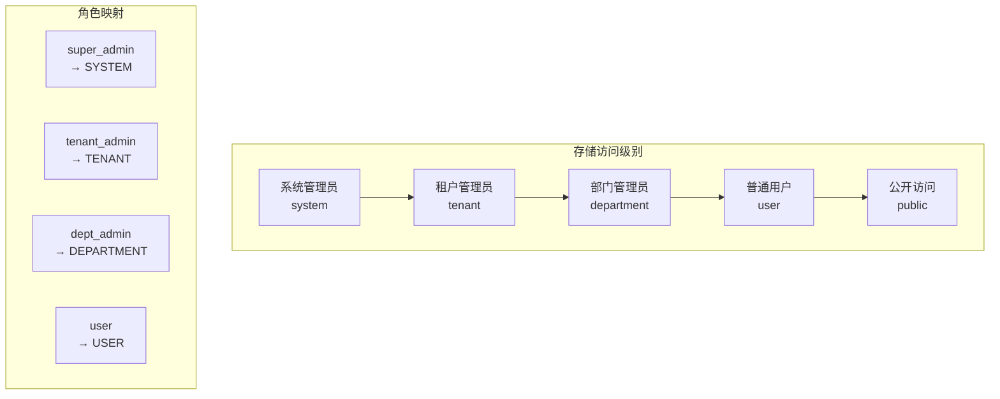

**图表来源**
- [src/copaw/storage/access_control.py:15-48](file://src/copaw/storage/access_control.py#L15-L48)

**章节来源**
- [src/copaw/storage/access_control.py:1-48](file://src/copaw/storage/access_control.py#L1-L48)

## 核心组件

### 多租户与权限控制
基于租户隔离的用户、角色、权限模型，支持5层角色继承与Redis缓存的权限检查：

- **角色模型**：支持最多5级父子继承，权限通过角色继承传递
- **权限匹配**：支持resource:action、resource:*、*:action、*:*四种模式
- **缓存机制**：使用Redis缓存用户权限集合，缓存键为rbac:user:{user_id}:perms，TTL 5分钟
- **缓存失效**：角色权限变更时批量失效相关用户的权限缓存

### 用户与会话管理
基于PostgreSQL的用户与会话持久化，结合Redis快速查询与JWT生命周期管理：

- **用户注册**：唯一性校验（用户名/邮箱），密码使用bcrypt哈希
- **会话管理**：会话表记录JTI、IP、UA、过期时间与撤销状态
- **令牌管理**：JWT HS256，支持访问令牌与刷新令牌，支持验证与撤销
- **MFA支持**：基于TOTP的密钥生成与二维码显示

### 审计日志（ISO 27001合规）
遵循ISO 27001要素的只追加审计日志，支持敏感操作前后数据记录与多维过滤查询：

- **审计要素**：Who/What/When/Where/Result/Context/Diff完整记录
- **过滤查询**：支持按用户、动作类型、资源类型、结果、时间范围与敏感标记过滤
- **异步写入**：提供异步写入与批量查询，适合高并发场景

### 数据保护与DLP
字段级AES-256-GCM加密，PII掩码与DLP规则引擎：

- **加密方案**：密钥来自环境变量COPAW_FIELD_ENCRYPT_KEY（32字节十六进制）
- **DLP规则**：内置规则覆盖中国身份证、手机号、银行卡号、邮箱、公网IP、API Key等模式
- **规则动作**：支持掩码（mask）、告警（alert）、阻断（block）三种动作

### 团队协作与任务编排
工作流定义与执行生命周期管理，任务状态机与评论协作：

- **任务状态机**：pending → in_progress → completed/blocked/cancelled严格状态转换
- **工作流管理**：支持多种类别（内部与Dify集成），工作流定义版本递增
- **执行生命周期**：启动执行、完成执行（记录输出/错误），状态与时间戳完整记录

### 安全告警与SSO集成
基于Redis的异常检测与多通道通知（企业微信、钉钉、邮件）：

- **登录异常检测**：基于Redis计数窗口与阈值触发告警
- **权限变更告警**：对敏感权限变更进行记录与通知
- **SSO集成**：使用Authlib OAuth客户端，支持OIDC discovery；开发环境提供mock provider

### 企业级存储系统
统一的对象存储接口，支持多后端适配与元数据同步：

- **存储后端**：支持filesystem、s3、minio、oss、sftp等多种后端
- **元数据同步**：上传后自动同步到PostgreSQL存储对象索引表
- **全文搜索**：基于PostgreSQL GIN索引的全文检索与过滤
- **内容去重**：基于SHA-256的内容哈希去重机制

### 向量内存系统
基于PostgreSQL + pgvector的AI记忆存储与相似度搜索：

- **向量索引**：使用IVFFlat索引支持高效的余弦相似度搜索
- **记忆分类**：支持facts、preferences、experiences等多种记忆类型
- **重要性评分**：动态重要性评分与访问追踪
- **会话关联**：记忆与会话的关联与相关性评分

### 企业任务调度系统
基于cron表达式的分布式任务调度与执行管理：

- **调度表达式**：标准cron语法支持，精确到秒级调度
- **分布式锁**：Redis分布式锁防止多节点重复执行
- **执行追踪**：详细的执行历史、运行次数与状态管理
- **重试机制**：可配置的最大重试次数与超时控制

**章节来源**
- [src/copaw/enterprise/rbac_service.py:30-262](file://src/copaw/enterprise/rbac_service.py#L30-L262)
- [src/copaw/enterprise/auth_service.py:107-367](file://src/copaw/enterprise/auth_service.py#L107-L367)
- [src/copaw/enterprise/audit_service.py:51-135](file://src/copaw/enterprise/audit_service.py#L51-L135)
- [src/copaw/enterprise/crypto.py:103-140](file://src/copaw/enterprise/crypto.py#L103-L140)
- [src/copaw/enterprise/dlp_service.py:114-231](file://src/copaw/enterprise/dlp_service.py#L114-L231)
- [src/copaw/enterprise/task_service.py:25-131](file://src/copaw/enterprise/task_service.py#L25-L131)
- [src/copaw/enterprise/workflow_service.py:20-146](file://src/copaw/enterprise/workflow_service.py#L20-L146)
- [src/copaw/enterprise/alert_service.py:101-217](file://src/copaw/enterprise/alert_service.py#L101-L217)
- [src/copaw/enterprise/sso_client.py:42-45](file://src/copaw/enterprise/sso_client.py#L42-L45)
- [src/copaw/storage/__init__.py:1-118](file://src/copaw/storage/__init__.py#L1-L118)
- [src/copaw/storage/base.py:1-230](file://src/copaw/storage/base.py#L1-L230)
- [src/copaw/storage/config.py:1-140](file://src/copaw/storage/config.py#L1-L140)
- [src/copaw/storage/search_service.py:1-211](file://src/copaw/storage/search_service.py#L1-L211)
- [src/copaw/storage/metadata_extractor.py:1-313](file://src/copaw/storage/metadata_extractor.py#L1-L313)
- [src/copaw/agents/memory/memory_backend_factory.py:1-120](file://src/copaw/agents/memory/memory_backend_factory.py#L1-L120)
- [src/copaw/agents/memory/reme_postgres_backend.py:1-271](file://src/copaw/agents/memory/reme_postgres_backend.py#L1-L271)
- [src/copaw/enterprise/scheduler.py:1-174](file://src/copaw/enterprise/scheduler.py#L1-L174)

## 架构总览

企业功能采用"服务层 + ORM模型 + 路由与中间件"的分层架构，围绕多租户与安全展开：

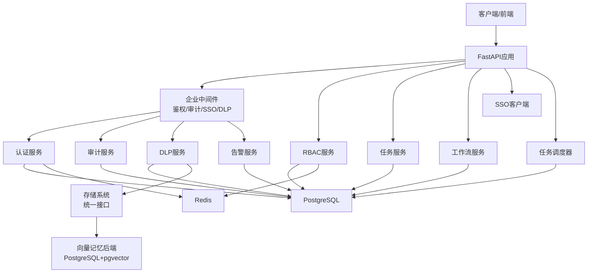

**图表来源**
- [src/copaw/app/middleware.py](file://src/copaw/app/middleware.py)
- [src/copaw/enterprise/auth_service.py:107-367](file://src/copaw/enterprise/auth_service.py#L107-L367)
- [src/copaw/enterprise/audit_service.py:51-135](file://src/copaw/enterprise/audit_service.py#L51-L135)
- [src/copaw/enterprise/dlp_service.py:114-231](file://src/copaw/enterprise/dlp_service.py#L114-L231)
- [src/copaw/enterprise/rbac_service.py:30-262](file://src/copaw/enterprise/rbac_service.py#L30-L262)
- [src/copaw/enterprise/task_service.py:25-131](file://src/copaw/enterprise/task_service.py#L25-L131)
- [src/copaw/enterprise/workflow_service.py:20-146](file://src/copaw/enterprise/workflow_service.py#L20-L146)
- [src/copaw/enterprise/alert_service.py:101-217](file://src/copaw/enterprise/alert_service.py#L101-L217)
- [src/copaw/enterprise/sso_client.py:42-45](file://src/copaw/enterprise/sso_client.py#L42-L45)
- [src/copaw/enterprise/scheduler.py:1-174](file://src/copaw/enterprise/scheduler.py#L1-L174)

## 详细组件分析

### RBAC权限系统

#### 设计要点
- **角色模型**：支持最多5级父子继承，权限通过角色继承传递
- **权限匹配**：支持resource:action、resource:*、*:action、*:*四种模式
- **缓存机制**：使用Redis缓存用户权限集合，缓存键为rbac:user:{user_id}:perms，TTL 5分钟
- **缓存失效**：角色权限变更时批量失效相关用户的权限缓存

#### 关键流程
- **权限检查**：先查Redis，未命中则加载用户全部角色及其上级角色，收集权限列表并写回缓存
- **角色CRUD**：创建角色（校验层级深度）、分配权限（替换式更新）、用户赋权/解权

#### 复杂度分析
- **权限检查**：O(R)角色展开 + O(P)权限查询，R/P通常较小；Redis命中为O(1)
- **写路径**：角色权限变更触发用户缓存失效，复杂度O(U)（U为该角色下的用户数）

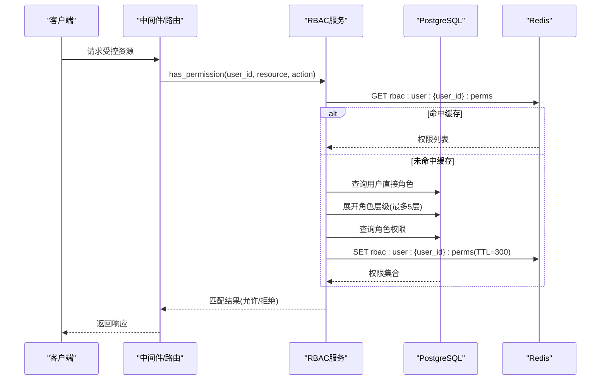

**图表来源**
- [src/copaw/enterprise/rbac_service.py:35-124](file://src/copaw/enterprise/rbac_service.py#L35-L124)
- [src/copaw/db/models/role.py:24-150](file://src/copaw/db/models/role.py#L24-L150)
- [src/copaw/db/models/permission.py:18-49](file://src/copaw/db/models/permission.py#L18-L49)

**章节来源**
- [src/copaw/enterprise/rbac_service.py:30-262](file://src/copaw/enterprise/rbac_service.py#L30-L262)
- [src/copaw/db/models/role.py:24-150](file://src/copaw/db/models/role.py#L24-L150)
- [src/copaw/db/models/permission.py:18-49](file://src/copaw/db/models/permission.py#L18-L49)

### 审计日志（ISO 27001合规）

#### 设计要点
- **审计要素**：遵循ISO 27001要素：Who/What/When/Where/Result/Context/Diff
- **过滤查询**：支持按用户、动作类型、资源类型、结果、时间范围与敏感标记过滤
- **异步写入**：提供异步写入与批量查询，适合高并发场景

#### 关键流程
- **日志记录**：在事务内写入审计条目，支持记录data_before/data_after追踪敏感变更
- **查询统计**：支持带条件的分页查询与总数统计

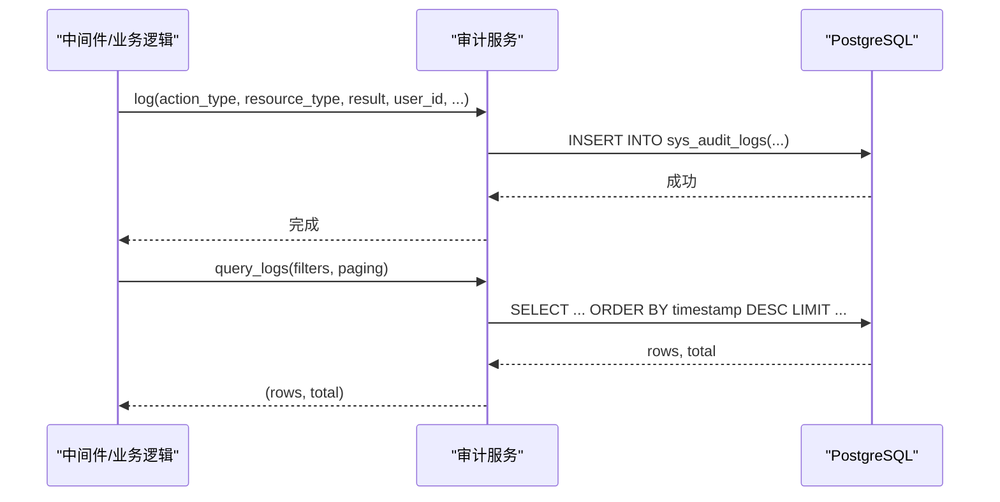

**图表来源**
- [src/copaw/enterprise/audit_service.py:55-135](file://src/copaw/enterprise/audit_service.py#L55-L135)
- [src/copaw/db/models/audit_log.py:18-106](file://src/copaw/db/models/audit_log.py#L18-L106)

**章节来源**
- [src/copaw/enterprise/audit_service.py:51-135](file://src/copaw/enterprise/audit_service.py#L51-L135)
- [src/copaw/db/models/audit_log.py:18-106](file://src/copaw/db/models/audit_log.py#L18-L106)

### 数据加密与DLP

#### 字段级加密（AES-256-GCM）
- **密钥管理**：密钥来自环境变量COPAW_FIELD_ENCRYPT_KEY（32字节十六进制）
- **透明加密**：SQLAlchemy类型装饰器EncryptedString实现透明读写加密
- **密钥轮换**：提供密钥轮换辅助函数，支持旧密钥到新密钥的再加密

#### DLP规则引擎
- **内置规则**：覆盖中国身份证、手机号、银行卡号、邮箱、公网IP、API Key等模式
- **规则配置**：支持管理员配置自定义规则（正则表达式），运行时合并内置与自定义规则
- **处理动作**：掩码（mask）、告警（alert）、阻断（block）三种动作
- **事件记录**：扫描结果可生成事件记录，便于审计与溯源

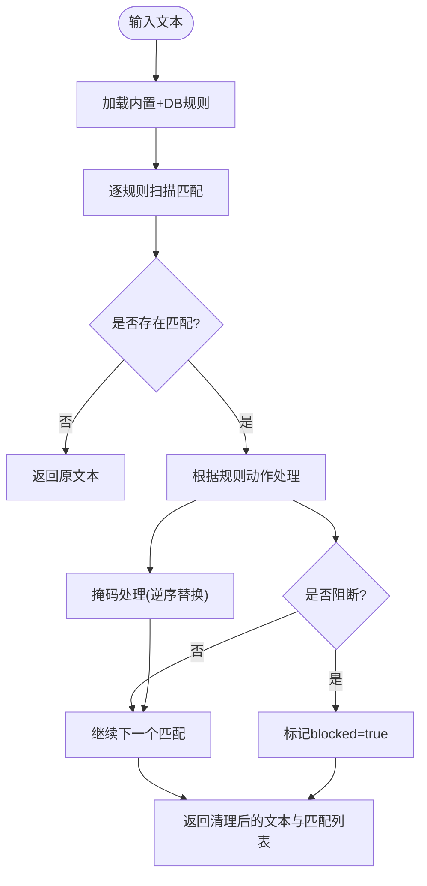

**图表来源**
- [src/copaw/enterprise/dlp_service.py:114-206](file://src/copaw/enterprise/dlp_service.py#L114-L206)
- [src/copaw/enterprise/crypto.py:103-140](file://src/copaw/enterprise/crypto.py#L103-L140)

**章节来源**
- [src/copaw/enterprise/crypto.py:26-140](file://src/copaw/enterprise/crypto.py#L26-L140)
- [src/copaw/enterprise/dlp_service.py:27-231](file://src/copaw/enterprise/dlp_service.py#L27-L231)

### 用户与会话管理（含MFA）

#### 用户注册与登录
- **注册流程**：唯一性校验（用户名/邮箱），密码使用bcrypt哈希
- **登录验证**：校验凭据与账户状态，创建会话记录与刷新令牌（哈希存储）
- **令牌管理**：JWT HS256，支持访问令牌与刷新令牌，支持验证与撤销

#### 会话与撤销
- **会话记录**：会话表记录JTI、IP、UA、过期时间与撤销状态
- **撤销机制**：通过更新会话状态实现即时生效

#### MFA支持
- **密钥生成**：基于TOTP的密钥生成与二维码显示
- **二次验证**：登录时进行二次校验

#### 密码变更
- **安全更新**：更改后撤销该用户所有活跃会话，提升安全性

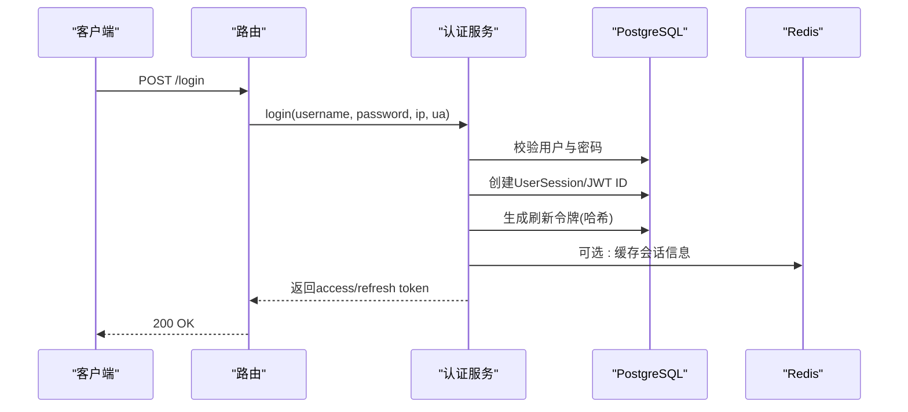

**图表来源**
- [src/copaw/enterprise/auth_service.py:152-230](file://src/copaw/enterprise/auth_service.py#L152-L230)
- [src/copaw/db/models/session.py:21-116](file://src/copaw/db/models/session.py#L21-L116)

**章节来源**
- [src/copaw/enterprise/auth_service.py:107-367](file://src/copaw/enterprise/auth_service.py#L107-L367)
- [src/copaw/db/models/user.py:25-158](file://src/copaw/db/models/user.py#L25-L158)
- [src/copaw/db/models/session.py:21-116](file://src/copaw/db/models/session.py#L21-L116)

### 团队协作与任务编排

#### 任务服务
- **状态机设计**：pending → in_progress → completed/blocked/cancelled，严格的状态转换约束
- **指派机制**：支持指派给用户或用户组，支持部门维度与元数据扩展
- **协作功能**：提供分页查询与评论功能，便于协作与追踪

#### 工作流服务
- **类别支持**：支持多种类别（内部与Dify集成），工作流定义版本递增
- **执行管理**：执行生命周期：启动执行、完成执行（记录输出/错误），状态与时间戳完整记录

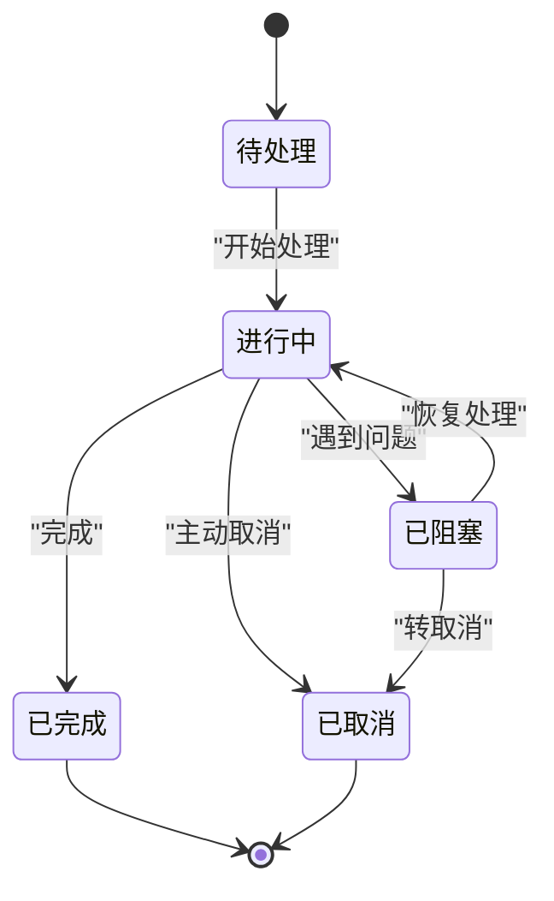

**图表来源**
- [src/copaw/enterprise/task_service.py:16-78](file://src/copaw/enterprise/task_service.py#L16-L78)

**章节来源**
- [src/copaw/enterprise/task_service.py:25-131](file://src/copaw/enterprise/task_service.py#L25-L131)
- [src/copaw/enterprise/workflow_service.py:20-146](file://src/copaw/enterprise/workflow_service.py#L20-L146)

### 安全告警与SSO集成

#### 登录异常检测
- **异常检测**：基于Redis计数窗口（默认5分钟）与阈值（DB规则或默认3次）触发告警
- **防重复告警**：冷却（默认5分钟），避免刷屏

#### 权限变更告警
- **敏感操作**：对敏感权限变更（如管理员角色）进行记录与通知

#### 通知渠道
- **多通道通知**：企业微信、钉钉Webhook异步发送；邮件同步发送（线程池）

#### SSO集成
- **OIDC支持**：使用Authlib OAuth客户端，支持OIDC discovery
- **开发测试**：开发环境提供mock provider

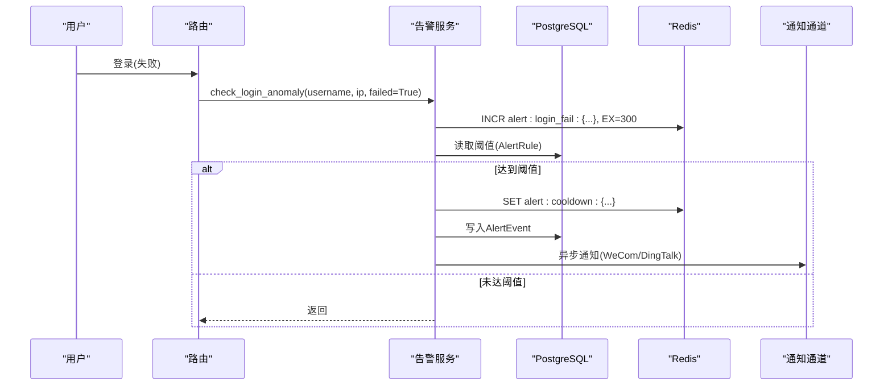

**图表来源**
- [src/copaw/enterprise/alert_service.py:104-163](file://src/copaw/enterprise/alert_service.py#L104-L163)

**章节来源**
- [src/copaw/enterprise/alert_service.py:101-217](file://src/copaw/enterprise/alert_service.py#L101-L217)
- [src/copaw/enterprise/sso_client.py:17-45](file://src/copaw/enterprise/sso_client.py#L17-L45)

### 企业级存储系统

#### 统一存储接口
- **抽象接口**：ObjectStorageProvider定义统一的存储操作接口
- **多后端支持**：支持filesystem、s3、minio、oss、sftp五种存储后端
- **延迟导入**：仅在使用时才导入对应SDK，减少依赖体积

#### 存储配置管理
- **环境配置**：通过COPAW_STORAGE_*环境变量动态配置存储后端
- **后端切换**：运行时可切换存储后端而无需重启
- **桶管理**：支持默认桶与后端特定桶名的配置

#### 元数据抽取与同步
- **双轨存储**：通用文件索引 + 业务结构化元数据
- **智能分类**：基于文件扩展名、路径模式自动分类
- **内容哈希**：SHA-256内容哈希去重，避免重复存储

#### 全文搜索服务
- **GIN索引**：PostgreSQL GIN索引支持高效全文检索
- **多维过滤**：支持类别、所有者、工作空间、标签、MIME类型等多维过滤
- **模糊匹配**：SIMILARITY函数支持文本相似度搜索

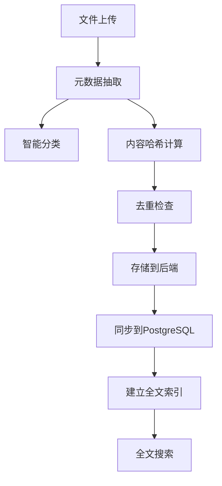

**图表来源**
- [src/copaw/storage/metadata_extractor.py:108-141](file://src/copaw/storage/metadata_extractor.py#L108-L141)
- [src/copaw/storage/search_service.py:54-165](file://src/copaw/storage/search_service.py#L54-L165)

**章节来源**
- [src/copaw/storage/__init__.py:1-118](file://src/copaw/storage/__init__.py#L1-L118)
- [src/copaw/storage/base.py:1-230](file://src/copaw/storage/base.py#L1-L230)
- [src/copaw/storage/config.py:1-140](file://src/copaw/storage/config.py#L1-L140)
- [src/copaw/storage/search_service.py:1-211](file://src/copaw/storage/search_service.py#L1-L211)
- [src/copaw/storage/metadata_extractor.py:1-313](file://src/copaw/storage/metadata_extractor.py#L1-L313)

### 向量内存系统

#### 记忆后端工厂
- **自动选择**：根据COPAW_ENTERPRISE_ENABLED环境变量自动选择后端
- **企业后端**：PostgreSQL + pgvector，支持多实例共享
- **个人后端**：保持原有SQLite/Chroma/本地文件行为

#### PostgreSQL向量存储
- **表结构设计**：支持tenant_id、workspace_id、agent_id多租户隔离
- **向量索引**：IVFFlat索引支持cosine相似度搜索
- **标签管理**：独立的ai_memory_tags表管理记忆标签

#### 记忆操作接口
- **添加记忆**：支持内容、向量、元数据、分类、重要性、标签
- **相似度搜索**：基于余弦距离的向量相似度搜索
- **访问追踪**：自动更新访问计数与最后访问时间
- **归档清理**：支持按重要性和时间的自动归档

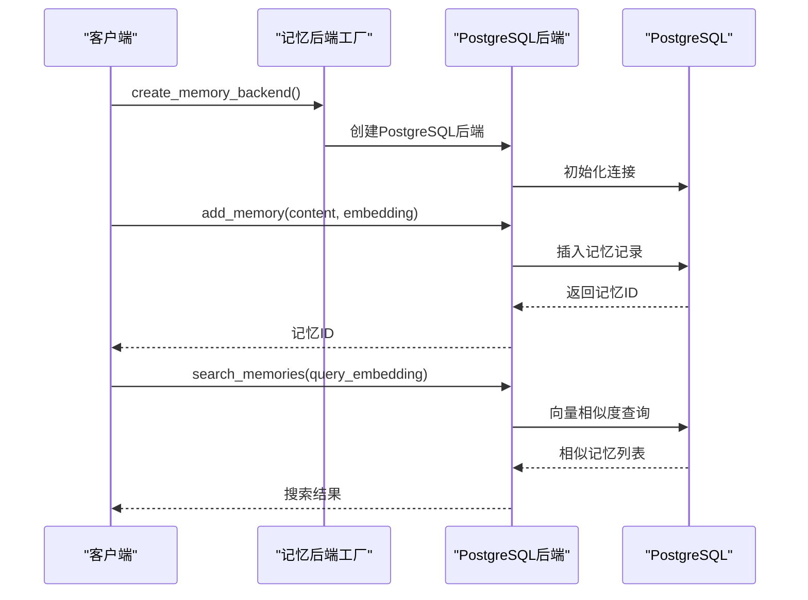

**图表来源**
- [src/copaw/agents/memory/memory_backend_factory.py:18-70](file://src/copaw/agents/memory/memory_backend_factory.py#L18-L70)
- [src/copaw/agents/memory/reme_postgres_backend.py:47-148](file://src/copaw/agents/memory/reme_postgres_backend.py#L47-L148)

**章节来源**
- [src/copaw/agents/memory/memory_backend_factory.py:1-120](file://src/copaw/agents/memory/memory_backend_factory.py#L1-L120)
- [src/copaw/agents/memory/reme_postgres_backend.py:1-271](file://src/copaw/agents/memory/reme_postgres_backend.py#L1-L271)
- [src/copaw/db/models/memory.py:1-248](file://src/copaw/db/models/memory.py#L1-L248)

### 企业任务调度系统

#### 调度器架构
- **分布式设计**：基于Redis分布式锁的多节点调度
- **心跳机制**：每秒检查到期任务，确保调度精度
- **执行追踪**：详细记录每次执行的时间、状态、重试次数

#### 任务管理
- **调度表达式**：支持标准cron表达式，精确到秒级
- **超时控制**：可配置的执行超时时间，默认5分钟
- **重试机制**：可配置的最大重试次数，默认3次
- **状态管理**：active、running、completed、failed、timeout、retrying

#### 数据库集成
- **表结构扩展**：在ai_tasks表中添加调度相关字段
- **索引优化**：为schedule_expr和next_run_at建立索引
- **执行历史**：自动记录每次执行的历史数据

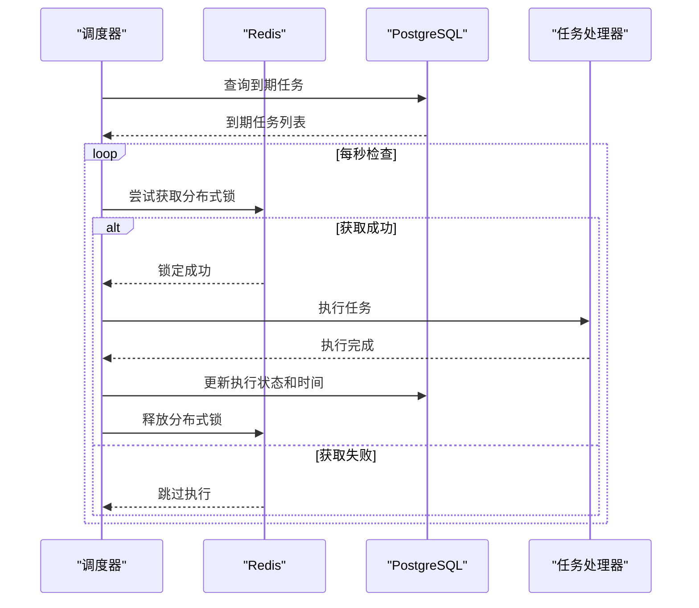

**图表来源**
- [src/copaw/enterprise/scheduler.py:76-174](file://src/copaw/enterprise/scheduler.py#L76-L174)

**章节来源**
- [src/copaw/enterprise/scheduler.py:1-174](file://src/copaw/enterprise/scheduler.py#L1-L174)
- [alembic/versions/007_ai_tasks_scheduling.py:1-45](file://alembic/versions/007_ai_tasks_scheduling.py#L1-L45)
- [src/copaw/db/models/task.py:1-151](file://src/copaw/db/models/task.py#L1-L151)

## 依赖关系分析

### 组件耦合
- **服务层依赖**：服务层对ORM模型存在直接依赖，但通过异步会话注入实现调用边界清晰
- **横切关注点**：RBAC与审计服务在中间件中被广泛复用
- **数据脱敏集成**：DLP与认证中间件集成，实现响应阶段的数据脱敏与阻断
- **存储系统集成**：统一存储接口被多个业务模块复用，包括向量记忆、任务调度等

### 外部依赖
- **Redis**：权限缓存、会话镜像、告警计数与冷却、分布式锁
- **PostgreSQL**：用户、角色、权限、审计、会话、任务、工作流、DLP规则、存储元数据
- **Authlib**：SSO OIDC客户端
- **Cryptography**：AES-256-GCM加密
- **pgvector**：PostgreSQL向量扩展，支持向量相似度搜索

### 迁移演进
企业版本迁移脚本定义了角色、权限、审计、会话、任务、工作流、DLP、存储对象、AI元数据、向量记忆等表结构与索引。

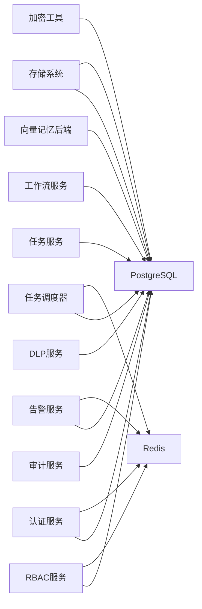

**图表来源**
- [alembic/versions/002_enterprise_phase_a.py](file://alembic/versions/002_enterprise_phase_a.py)
- [alembic/versions/003_enterprise_phase_c.py](file://alembic/versions/003_enterprise_phase_c.py)
- [alembic/versions/004_storage_objects.py](file://alembic/versions/004_storage_objects.py)
- [alembic/versions/005_ai_metadata_tables.py](file://alembic/versions/005_ai_metadata_tables.py)
- [alembic/versions/006_ai_memories_pgvector.py](file://alembic/versions/006_ai_memories_pgvector.py)
- [alembic/versions/007_ai_tasks_scheduling.py](file://alembic/versions/007_ai_tasks_scheduling.py)

**章节来源**
- [alembic/versions/002_enterprise_phase_a.py](file://alembic/versions/002_enterprise_phase_a.py)
- [alembic/versions/003_enterprise_phase_c.py](file://alembic/versions/003_enterprise_phase_c.py)
- [alembic/versions/004_storage_objects.py](file://alembic/versions/004_storage_objects.py)
- [alembic/versions/005_ai_metadata_tables.py](file://alembic/versions/005_ai_metadata_tables.py)
- [alembic/versions/006_ai_memories_pgvector.py](file://alembic/versions/006_ai_memories_pgvector.py)
- [alembic/versions/007_ai_tasks_scheduling.py](file://alembic/versions/007_ai_tasks_scheduling.py)

## 性能考量

### 权限检查
- **缓存优化**：Redis缓存显著降低数据库压力；建议合理设置TTL并在权限变更时批量失效缓存

### 审计日志
- **异步处理**：异步写入与批量查询；建议对高频动作进行采样或聚合上报

### DLP扫描
- **规则优化**：预编译规则提升匹配性能；大文本扫描时注意内存占用与超时

### 会话与令牌
- **索引优化**：会话表建立索引（user_id、expires_at），Redis缓存可进一步加速鉴权

### 工作流与任务
- **热点优化**：执行记录与状态变更频繁，建议对热点字段建立索引并定期归档历史数据

### 存储系统
- **索引优化**：PostgreSQL GIN索引支持高效全文检索，建议合理配置索引参数
- **去重策略**：SHA-256哈希计算成本较高，建议批量处理与缓存热点内容

### 向量内存
- **索引性能**：IVFFlat索引需要合理设置lists参数，平衡查询速度与内存占用
- **相似度计算**：cosine相似度计算复杂度较高，建议使用向量数据库的原生支持

### 任务调度
- **分布式锁**：Redis分布式锁避免重复执行，但会增加网络开销
- **超时控制**：合理设置任务超时时间，避免长时间阻塞调度器

## 故障排查指南

### 权限不足
- **检查步骤**：检查用户角色链与继承层级，确认权限匹配模式；查看Redis缓存是否需要失效

### 登录异常告警风暴
- **排查要点**：检查阈值配置与冷却键是否正确；核对Redis键空间与TTL

### DLP阻断误报
- **处理方法**：调整或临时禁用相关规则；核对规则正则表达式与大小写忽略标志

### 加密异常
- **诊断要点**：核对COPAW_FIELD_ENCRYPT_KEY是否为64字符十六进制；检查密钥轮换流程

### SSO登录失败
- **调试步骤**：检查OIDC发现地址与客户端配置；开发环境可切换至mock provider测试

### 审计日志缺失
- **验证方法**：确认写入是否在事务内提交；检查过滤参数与时间范围

### 存储系统问题
- **后端配置**：检查COPAW_STORAGE_BACKEND环境变量与后端特定配置
- **元数据同步**：确认存储后端与PostgreSQL同步是否正常
- **全文搜索**：检查PostgreSQL全文索引是否正确建立

### 向量内存异常
- **pgvector安装**：确认pgvector扩展已正确安装并启用
- **向量维度**：检查向量维度是否与embedding_model匹配
- **索引重建**：必要时重建IVFFlat索引以优化查询性能

### 任务调度失败
- **分布式锁**：检查Redis连接与分布式锁获取情况
- **超时设置**：调整任务超时时间，避免过短导致频繁超时
- **重试配置**：检查最大重试次数与重试间隔设置

**章节来源**
- [src/copaw/enterprise/rbac_service.py:49-63](file://src/copaw/enterprise/rbac_service.py#L49-L63)
- [src/copaw/enterprise/alert_service.py:134-162](file://src/copaw/enterprise/alert_service.py#L134-L162)
- [src/copaw/enterprise/dlp_service.py:174-198](file://src/copaw/enterprise/dlp_service.py#L174-L198)
- [src/copaw/enterprise/crypto.py:26-46](file://src/copaw/enterprise/crypto.py#L26-L46)
- [src/copaw/enterprise/sso_client.py:17-45](file://src/copaw/enterprise/sso_client.py#L17-L45)
- [src/copaw/enterprise/audit_service.py:104-135](file://src/copaw/enterprise/audit_service.py#L104-L135)
- [src/copaw/storage/config.py:123-140](file://src/copaw/storage/config.py#L123-L140)
- [src/copaw/agents/memory/reme_postgres_backend.py:117-148](file://src/copaw/agents/memory/reme_postgres_backend.py#L117-L148)
- [src/copaw/enterprise/scheduler.py:105-143](file://src/copaw/enterprise/scheduler.py#L105-L143)

## 结论
CoPaw企业版通过完善的多租户与RBAC、强健的审计与加密、灵活的DLP、可靠的会话与令牌、以及可扩展的工作流与任务编排，为企业提供了端到端的安全与协作能力。新增的企业级存储系统、向量内存系统和任务调度系统进一步增强了平台的企业级服务能力，支持大规模数据存储、智能记忆检索和可靠的任务执行。配合SSO集成与告警通知，可在保障合规的同时提升运营效率。

**更新** 本次升级使CoPaw从个人AI助手发展为企业级协作平台，新增的多租户存储系统、向量内存系统和任务调度系统为企业功能提供了坚实的技术支撑，显著提升了平台的企业级服务能力。

## 附录

### 企业部署配置指南

#### 环境变量配置
- **JWT配置**：COPAW_JWT_SECRET（JWT签名密钥，生产必须自定义）
- **令牌配置**：COPAW_JWT_ACCESS_EXPIRE_MINUTES（访问令牌有效期，分钟）
- **会话配置**：COPAW_JWT_REFRESH_EXPIRE_DAYS（刷新令牌有效期，天）
- **加密配置**：COPAW_FIELD_ENCRYPT_KEY（AES-256-GCM密钥，32字节十六进制）
- **告警配置**：COPAW_WECOM_WEBHOOK_URL、COPAW_DINGTALK_WEBHOOK_URL（企业微信/钉钉Webhook）
- **邮件配置**：COPAW_SMTP_HOST、COPAW_SMTP_PORT、COPAW_SMTP_USER、COPAW_SMTP_PASS、COPAW_ALERT_EMAIL_TO（邮件告警）
- **存储配置**：COPAW_STORAGE_BACKEND、COPAW_STORAGE_BUCKET、COPAW_S3_ENDPOINT_URL等存储相关环境变量
- **向量配置**：COPAW_ENTERPRISE_ENABLED（启用企业版功能）、COPAW_MEMORY_BACKEND（内存后端选择）

#### 容器化与进程管理
- **镜像构建**：使用Dockerfile构建镜像
- **进程管理**：supervisord.conf.template提供进程管理模板
- **启动脚本**：提供start-enterprise.sh/start-enterprise.ps1一键启动

#### 数据库迁移
- **存储对象表**：004_storage_objects.py创建通用文件对象索引表
- **AI元数据表**：005_ai_metadata_tables.py创建业务元数据表结构
- **向量记忆表**：006_ai_memories_pgvector.py创建向量记忆表与索引
- **任务调度扩展**：007_ai_tasks_scheduling.py扩展任务表支持调度功能

**章节来源**
- [deploy/Dockerfile](file://deploy/Dockerfile)
- [deploy/config/supervisord.conf.template](file://deploy/config/supervisord.conf.template)
- [scripts/start-enterprise.sh](file://scripts/start-enterprise.sh)
- [scripts/start-enterprise.ps1](file://scripts/start-enterprise.ps1)
- [alembic/versions/004_storage_objects.py:1-83](file://alembic/versions/004_storage_objects.py#L1-L83)
- [alembic/versions/005_ai_metadata_tables.py:1-251](file://alembic/versions/005_ai_metadata_tables.py#L1-L251)
- [alembic/versions/006_ai_memories_pgvector.py:1-130](file://alembic/versions/006_ai_memories_pgvector.py#L1-L130)
- [alembic/versions/007_ai_tasks_scheduling.py:1-45](file://alembic/versions/007_ai_tasks_scheduling.py#L1-L45)

### 与个人版对比与升级指导

#### 功能对比
- **多租户支持**：个人版通常单租户，企业版支持租户隔离与跨租户审计
- **权限体系**：个人版无RBAC，企业版提供细粒度权限与角色继承
- **安全审计**：个人版无审计日志与DLP，企业版具备ISO 27001合规审计与数据脱敏
- **协作功能**：个人版无任务与工作流，企业版提供任务状态机与工作流执行
- **集成能力**：个人版无SSO，企业版支持OIDC
- **存储能力**：个人版存储简单，企业版提供统一存储接口与元数据同步
- **记忆系统**：个人版无向量记忆，企业版支持PostgreSQL + pgvector向量存储
- **任务调度**：个人版无企业级调度，企业版提供分布式任务调度系统

#### 升级建议
- **数据库迁移**：执行企业版本迁移脚本，初始化角色、权限、审计、会话等表
- **配置加固**：设置JWT与加密密钥，启用Redis缓存与告警通道
- **存储配置**：配置存储后端（推荐S3/MinIO），启用元数据同步与全文搜索
- **向量索引**：安装并配置pgvector扩展，设置向量维度与索引参数
- **任务调度**：配置Redis集群，设置任务超时与重试参数
- **策略配置**：配置DLP规则、审计策略与SSO参数
- **监控演练**：对登录异常、权限变更、存储访问等场景进行演练与告警联动测试

**章节来源**
- [docs/ent-copaw.md](file://docs/ent-copaw.md)
- [docs/Deployment.md](file://docs/Deployment.md)
- [docs/Architecture.md](file://docs/Architecture.md)
- [docs/enterprise-new-features.md](file://docs/enterprise-new-features.md)
- [docs/PHASE-2-4-FINAL-REPORT.md](file://docs/PHASE-2-4-FINAL-REPORT.md)