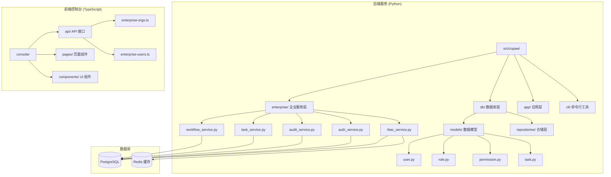
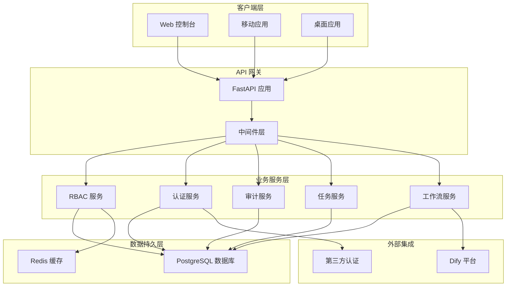
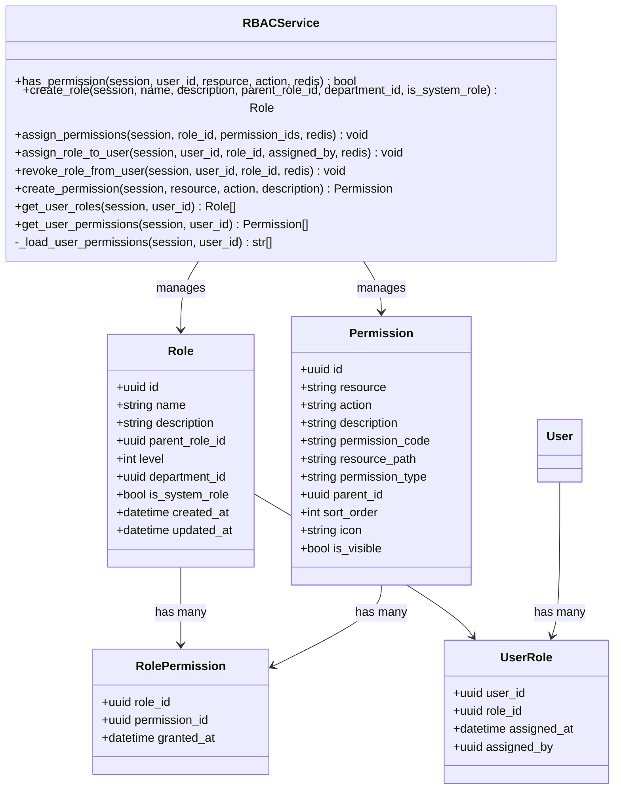
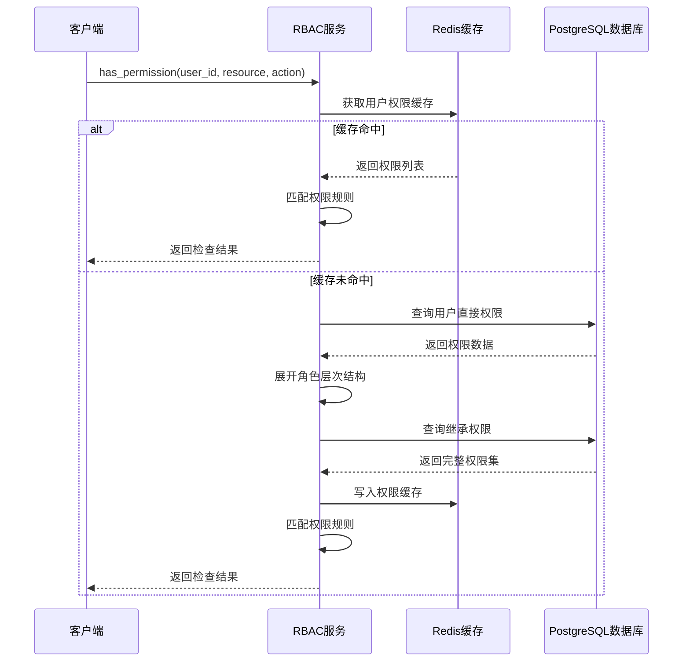
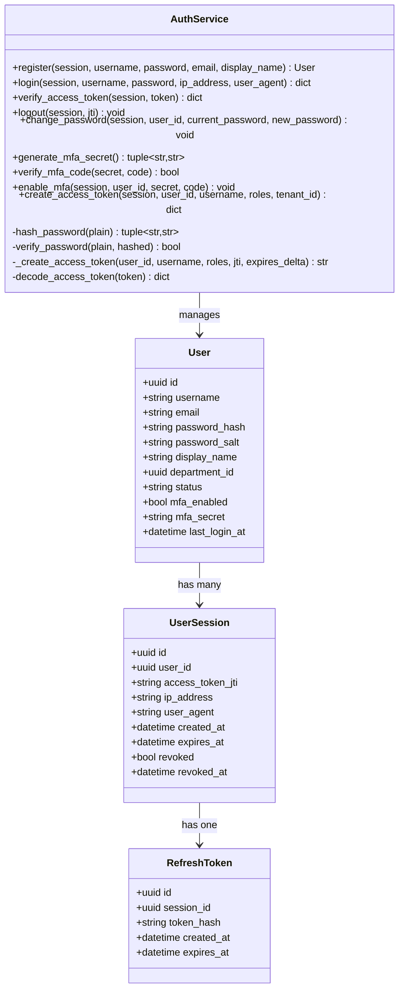
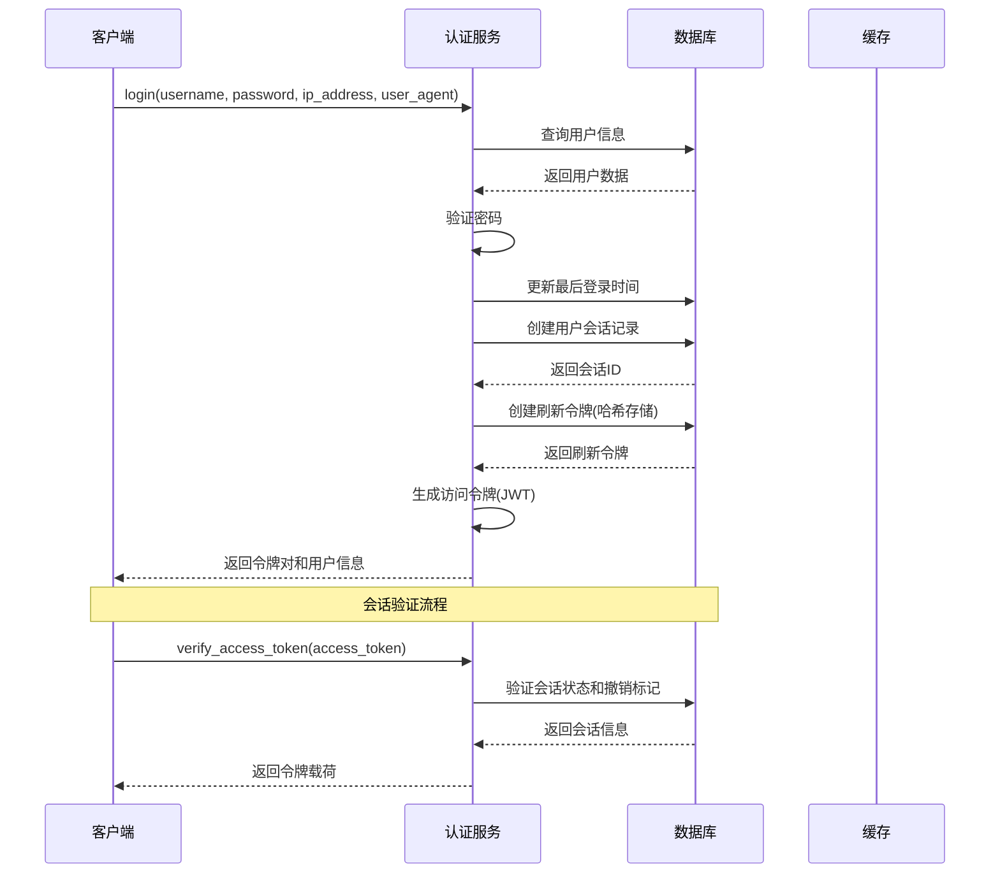
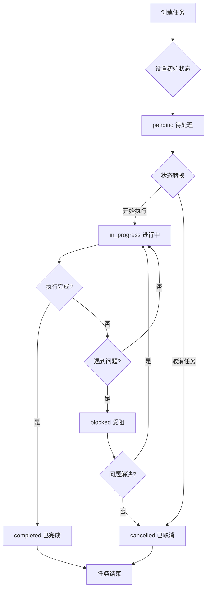
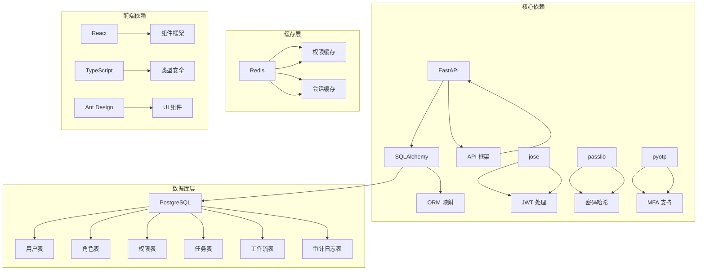

# 企业组织管理

<cite>
**本文档引用的文件**
- [rbac_service.py](file://src/copaw/enterprise/rbac_service.py)
- [auth_service.py](file://src/copaw/enterprise/auth_service.py)
- [audit_service.py](file://src/copaw/enterprise/audit_service.py)
- [task_service.py](file://src/copaw/enterprise/task_service.py)
- [workflow_service.py](file://src/copaw/enterprise/workflow_service.py)
- [role.py](file://src/copaw/db/models/role.py)
- [user.py](file://src/copaw/db/models/user.py)
- [permission.py](file://src/copaw/db/models/permission.py)
- [task.py](file://src/copaw/db/models/task.py)
- [enterprise-orgs.ts](file://console/src/api/modules/enterprise-orgs.ts)
- [enterprise-users.ts](file://console/src/api/modules/enterprise-users.ts)
</cite>

## 目录
1. [简介](#简介)
2. [项目结构](#项目结构)
3. [核心组件](#核心组件)
4. [架构概览](#架构概览)
5. [详细组件分析](#详细组件分析)
6. [依赖关系分析](#依赖关系分析)
7. [性能考虑](#性能考虑)
8. [故障排除指南](#故障排除指南)
9. [结论](#结论)

## 简介

Copaw 企业组织管理系统是一个基于 Python 和 TypeScript 的现代化企业级应用，专注于提供完整的组织管理、权限控制和工作流程自动化解决方案。该系统采用前后端分离架构，后端使用 FastAPI 构建 RESTful API，前端使用 React + TypeScript 开发管理界面。

系统的核心特性包括：
- 多租户企业组织管理
- RBAC 权限控制系统
- JWT 多因素认证
- 任务和工作流程管理
- 审计日志记录
- 前后端权限同步

## 项目结构

Copaw 项目采用模块化设计，主要分为以下几个核心部分：



**图表来源**
- [rbac_service.py:1-322](file://src/copaw/enterprise/rbac_service.py#L1-L322)
- [auth_service.py:1-367](file://src/copaw/enterprise/auth_service.py#L1-L367)
- [role.py:1-150](file://src/copaw/db/models/role.py#L1-L150)
- [user.py:1-92](file://src/copaw/db/models/user.py#L1-L92)

**章节来源**
- [rbac_service.py:1-322](file://src/copaw/enterprise/rbac_service.py#L1-L322)
- [auth_service.py:1-367](file://src/copaw/enterprise/auth_service.py#L1-L367)
- [role.py:1-150](file://src/copaw/db/models/role.py#L1-L150)

## 核心组件

### 1. RBAC 权限控制服务

RBAC（基于角色的访问控制）是企业系统的核心安全机制，提供细粒度的权限管理能力。

**核心功能：**
- 用户角色分配和管理
- 权限继承和层次结构
- Redis 缓存优化
- 权限匹配算法

**权限匹配规则：**
- 精确匹配：`resource:action`
- 资源通配符：`resource:*`
- 动作通配符：`*:action`
- 全局通配符：`*:*

### 2. 认证服务

提供企业级的用户认证和会话管理功能。

**认证特性：**
- JWT 令牌管理
- 密码哈希存储
- 多因素认证 (MFA)
- 会话生命周期管理

**令牌类型：**
- 访问令牌 (Access Token)：短期有效，用于 API 认证
- 刷新令牌 (Refresh Token)：长期有效，用于获取新访问令牌

### 3. 审计服务

ISO 27001 合规的审计日志系统。

**审计范围：**
- 用户操作记录
- 权限变更历史
- 系统配置修改
- 任务和工作流程状态变更

### 4. 任务管理系统

企业级任务生命周期管理。

**任务状态流转：**
- pending → in_progress, cancelled
- in_progress → completed, blocked, cancelled
- blocked → in_progress, cancelled
- completed, cancelled → 终止状态

### 5. 工作流服务

集成 Dify 平台的工作流管理。

**支持的工作流类型：**
- dify：标准工作流
- dify_chatflow：聊天工作流
- dify_agent：智能体工作流
- internal：内部工作流

## 架构概览



**图表来源**
- [rbac_service.py:30-322](file://src/copaw/enterprise/rbac_service.py#L30-L322)
- [auth_service.py:107-367](file://src/copaw/enterprise/auth_service.py#L107-L367)
- [audit_service.py:54-138](file://src/copaw/enterprise/audit_service.py#L54-L138)

## 详细组件分析

### RBAC 权限控制服务分析



**图表来源**
- [rbac_service.py:30-322](file://src/copaw/enterprise/rbac_service.py#L30-L322)
- [role.py:24-150](file://src/copaw/db/models/role.py#L24-L150)
- [permission.py:20-99](file://src/copaw/db/models/permission.py#L20-L99)

#### 权限检查流程



**图表来源**
- [rbac_service.py:35-124](file://src/copaw/enterprise/rbac_service.py#L35-L124)

**章节来源**
- [rbac_service.py:1-322](file://src/copaw/enterprise/rbac_service.py#L1-L322)
- [role.py:1-150](file://src/copaw/db/models/role.py#L1-L150)
- [permission.py:1-99](file://src/copaw/db/models/permission.py#L1-L99)

### 认证服务分析



**图表来源**
- [auth_service.py:107-367](file://src/copaw/enterprise/auth_service.py#L107-L367)
- [user.py:25-92](file://src/copaw/db/models/user.py#L25-L92)

#### 登录认证流程



**图表来源**
- [auth_service.py:151-270](file://src/copaw/enterprise/auth_service.py#L151-L270)

**章节来源**
- [auth_service.py:1-367](file://src/copaw/enterprise/auth_service.py#L1-L367)
- [user.py:1-92](file://src/copaw/db/models/user.py#L1-L92)

### 任务管理系统分析



**图表来源**
- [task_service.py:16-22](file://src/copaw/enterprise/task_service.py#L16-L22)
- [task.py:23-145](file://src/copaw/db/models/task.py#L23-L145)

**章节来源**
- [task_service.py:1-131](file://src/copaw/enterprise/task_service.py#L1-L131)
- [task.py:1-145](file://src/copaw/db/models/task.py#L1-L145)

### 前端组织管理 API 分析

```mermaid
graph LR
subgraph "组织管理 API"
A[获取组织树] --> A1[/enterprise/departments/tree]
B[创建组织] --> B1[/enterprise/departments]
C[更新组织] --> C1[/enterprise/departments/:id]
D[删除组织] --> D1[/enterprise/departments/:id]
E[获取成员列表] --> E1[/enterprise/departments/:orgId/members]
F[添加成员] --> F1[/enterprise/departments/:orgId/members]
G[移除成员] --> G1[/enterprise/departments/:orgId/members/:userId]
H[获取统计] --> H1[/enterprise/departments/:orgId/stats]
end
subgraph "用户管理 API"
I[用户列表] --> I1[/enterprise/users]
J[创建用户] --> J1[/enterprise/users]
K[更新用户] --> K1[/enterprise/users/:userId]
L[删除用户] --> L1[/enterprise/users/:userId]
M[获取用户角色] --> M1[/enterprise/users/:userId/roles]
N[分配角色] --> N1[/enterprise/users/:userId/roles]
end
```

**图表来源**
- [enterprise-orgs.ts:1-104](file://console/src/api/modules/enterprise-orgs.ts#L1-L104)
- [enterprise-users.ts:1-86](file://console/src/api/modules/enterprise-users.ts#L1-L86)

**章节来源**
- [enterprise-orgs.ts:1-104](file://console/src/api/modules/enterprise-orgs.ts#L1-L104)
- [enterprise-users.ts:1-86](file://console/src/api/modules/enterprise-users.ts#L1-L86)

## 依赖关系分析



**图表来源**
- [rbac_service.py:18-25](file://src/copaw/enterprise/rbac_service.py#L18-L25)
- [auth_service.py:21-27](file://src/copaw/enterprise/auth_service.py#L21-L27)

**章节来源**
- [rbac_service.py:1-322](file://src/copaw/enterprise/rbac_service.py#L1-L322)
- [auth_service.py:1-367](file://src/copaw/enterprise/auth_service.py#L1-L367)

## 性能考虑

### 缓存策略

1. **权限缓存**：RBAC 权限使用 Redis 缓存，默认 5 分钟 TTL
2. **会话缓存**：用户会话信息缓存以减少数据库查询
3. **批量操作**：审计日志采用异步批量写入

### 数据库优化

1. **索引设计**：关键字段建立适当索引
2. **查询优化**：使用分页和过滤器减少数据传输
3. **连接池**：使用异步连接池提高并发性能

### 前端性能

1. **懒加载**：按需加载组件和模块
2. **虚拟滚动**：大数据量列表使用虚拟滚动
3. **状态管理**：合理使用状态缓存避免重复请求

## 故障排除指南

### 常见问题及解决方案

**1. 权限不足错误**
- 检查用户角色分配
- 验证权限继承链
- 清除权限缓存重新登录

**2. 认证失败**
- 验证 JWT 密钥配置
- 检查用户状态和密码
- 确认会话未被撤销

**3. 数据库连接问题**
- 检查 PostgreSQL 连接配置
- 验证数据库迁移状态
- 查看连接池配置

**4. 缓存同步问题**
- 验证 Redis 连接状态
- 检查缓存键命名规范
- 确认缓存过期时间设置

**章节来源**
- [rbac_service.py:42-63](file://src/copaw/enterprise/rbac_service.py#L42-L63)
- [auth_service.py:233-270](file://src/copaw/enterprise/auth_service.py#L233-L270)
- [audit_service.py:57-90](file://src/copaw/enterprise/audit_service.py#L57-L90)

## 结论

Copaw 企业组织管理系统提供了完整的企业级功能，包括：

**技术优势：**
- 模块化架构设计，易于维护和扩展
- 完善的权限控制和审计机制
- 前后端分离，提升开发效率
- 多租户支持，满足不同规模企业需求

**功能特点：**
- 企业级组织管理
- 细粒度权限控制
- 安全的认证体系
- 灵活的任务和工作流管理
- 完整的审计日志

**适用场景：**
- 中大型企业组织管理
- 需要严格权限控制的系统
- 工作流程自动化需求
- 多部门协作平台

该系统为企业数字化转型提供了坚实的技术基础，通过合理的架构设计和完善的功能实现，能够满足现代企业的各种管理需求。