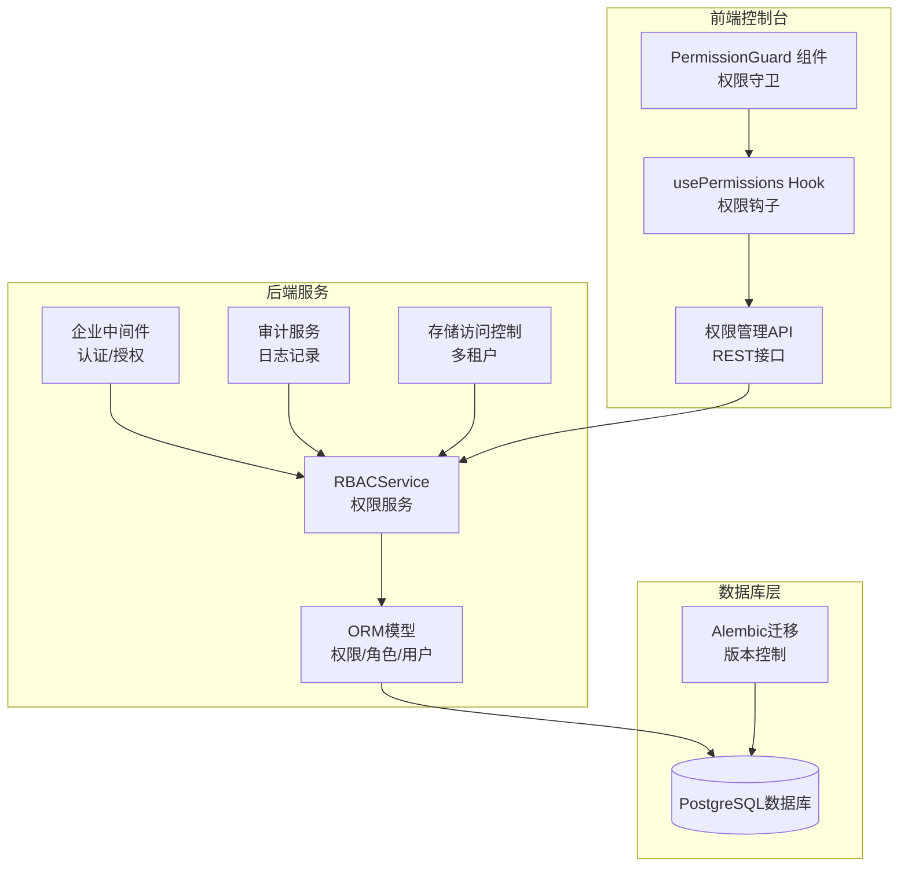
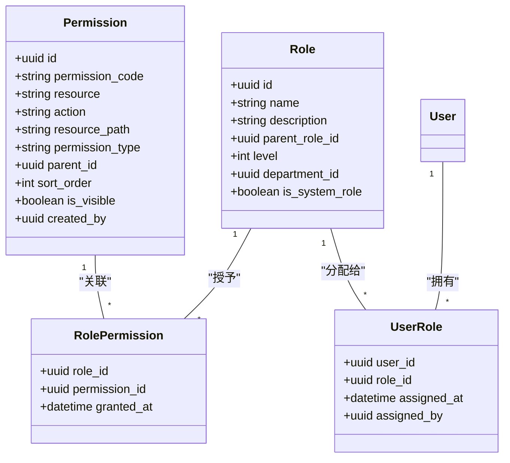
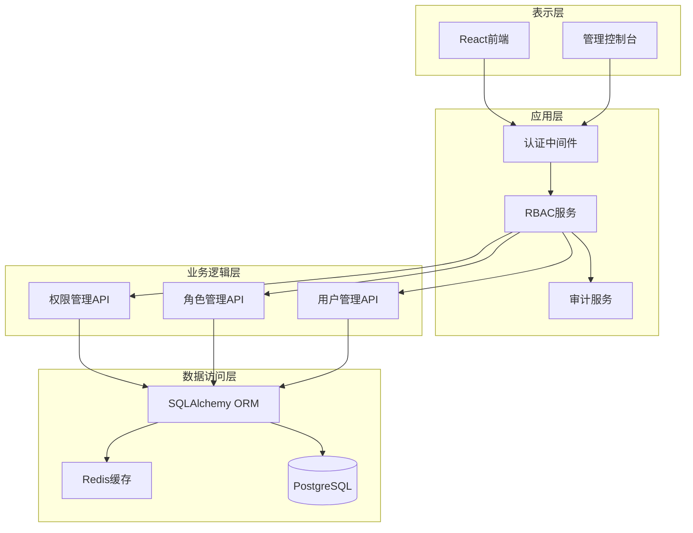
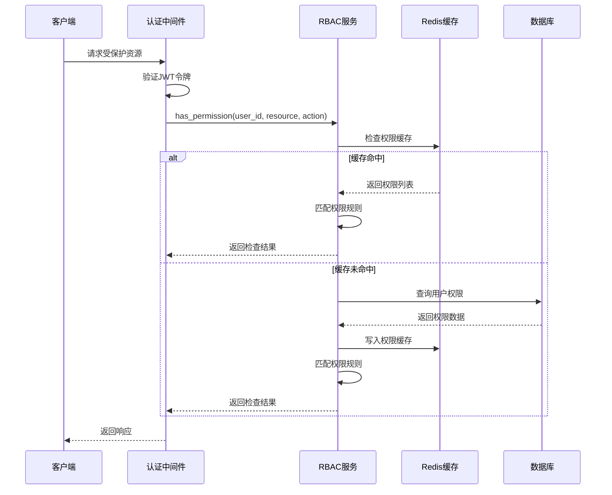
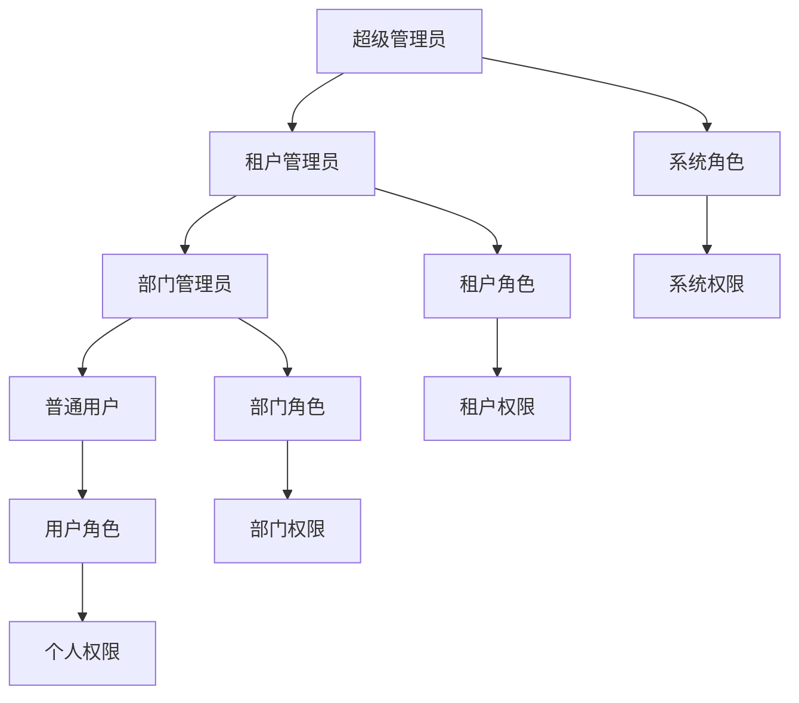
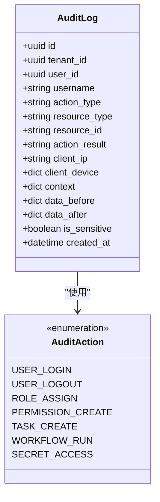
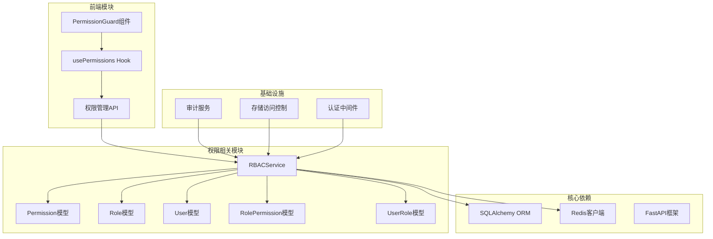

# 增强权限系统

<cite>
**本文档引用的文件**
- [rbac_service.py](file://src/copaw/enterprise/rbac_service.py)
- [permission.py](file://src/copaw/db/models/permission.py)
- [role.py](file://src/copaw/db/models/role.py)
- [user.py](file://src/copaw/db/models/user.py)
- [access_control.py](file://src/copaw/storage/access_control.py)
- [009_permission_enhancement.py](file://alembic/versions/009_permission_enhancement.py)
- [middleware.py](file://src/copaw/enterprise/middleware.py)
- [auth.py](file://src/copaw/app/auth.py)
- [permission_mgmt.py](file://src/copaw/app/routers/permission_mgmt.py)
- [usePermissions.ts](file://console/src/hooks/usePermissions.ts)
- [PermissionGuard.tsx](file://console/src/components/PermissionGuard.tsx)
- [audit_service.py](file://src/copaw/enterprise/audit_service.py)
- [audit_log.py](file://src/copaw/db/models/audit_log.py)
- [audit.py](file://src/copaw/app/routers/audit.py)
</cite>

## 目录
1. [简介](#简介)
2. [项目结构](#项目结构)
3. [核心组件](#核心组件)
4. [架构概览](#架构概览)
5. [详细组件分析](#详细组件分析)
6. [依赖关系分析](#依赖关系分析)
7. [性能考虑](#性能考虑)
8. [故障排除指南](#故障排除指南)
9. [结论](#结论)

## 简介

CoPaw 增强权限系统是一个基于角色的访问控制系统（RBAC），专为企业级多租户应用设计。该系统提供了细粒度的权限控制、角色层次结构、Redis 缓存优化、审计日志记录等功能，支持菜单、API、按钮、数据四种权限类型。

系统的核心特性包括：
- 多租户隔离的权限管理
- 5级角色层次结构支持
- Redis 缓存的权限检查机制
- 完整的审计日志记录
- 前后端一体化的权限控制
- 支持权限树形结构和资源路径映射

## 项目结构

增强权限系统主要分布在以下模块中：

**图表来源**
- [rbac_service.py:30-322](file://src/copaw/enterprise/rbac_service.py#L30-L322)
- [permission_mgmt.py:28-410](file://src/copaw/app/routers/permission_mgmt.py#L28-L410)

**章节来源**
- [rbac_service.py:1-322](file://src/copaw/enterprise/rbac_service.py#L1-L322)
- [permission_mgmt.py:1-410](file://src/copaw/app/routers/permission_mgmt.py#L1-L410)

## 核心组件

### RBAC 服务层

RBACService 是权限系统的核心服务，提供以下功能：

- **权限检查**：支持直接权限和继承权限检查
- **角色管理**：角色的创建、删除、层次结构管理
- **用户权限**：用户角色分配、权限查询
- **Redis 缓存**：5分钟TTL的权限缓存机制

### 权限模型层

权限系统采用三层模型设计：

**图表来源**
- [permission.py:20-99](file://src/copaw/db/models/permission.py#L20-L99)
- [role.py:24-150](file://src/copaw/db/models/role.py#L24-L150)

### 前端权限控制

前端提供了完整的权限控制解决方案：

- **usePermissions Hook**：权限数据获取和缓存
- **PermissionGuard 组件**：基于权限显示/隐藏组件
- **权限树构建**：支持菜单权限的层次结构展示

**章节来源**
- [rbac_service.py:35-322](file://src/copaw/enterprise/rbac_service.py#L35-L322)
- [permission.py:20-99](file://src/copaw/db/models/permission.py#L20-L99)
- [role.py:24-150](file://src/copaw/db/models/role.py#L24-L150)
- [usePermissions.ts:68-208](file://console/src/hooks/usePermissions.ts#L68-L208)
- [PermissionGuard.tsx:53-88](file://console/src/components/PermissionGuard.tsx#L53-L88)

## 架构概览

增强权限系统采用分层架构设计，确保了良好的可扩展性和维护性：

**图表来源**
- [middleware.py:57-144](file://src/copaw/enterprise/middleware.py#L57-L144)
- [rbac_service.py:30-322](file://src/copaw/enterprise/rbac_service.py#L30-L322)
- [permission_mgmt.py:28-410](file://src/copaw/app/routers/permission_mgmt.py#L28-L410)

## 详细组件分析

### 权限检查流程

权限检查是系统的核心功能，采用了多层次的检查机制：

**图表来源**
- [rbac_service.py:35-63](file://src/copaw/enterprise/rbac_service.py#L35-L63)
- [middleware.py:69-106](file://src/copaw/enterprise/middleware.py#L69-L106)

### 权限类型和规则

系统支持四种权限类型，每种类型都有特定的用途：

| 权限类型 | 描述 | 用途 | 示例 |
|---------|------|------|------|
| menu | 菜单权限 | 控制导航菜单显示 | `agent:config:read` |
| api | API权限 | 控制接口访问 | `agent:config:write` |
| button | 按钮权限 | 控制按钮可用性 | `agent:config:delete` |
| data | 数据权限 | 控制数据访问范围 | `agent:config:view` |

权限匹配规则支持多种通配符：
- 精确匹配：`resource:action`
- 资源通配：`resource:*`
- 操作通配：`*:action`
- 全局通配：`*:*

### 角色层次结构

系统支持最多5级的角色层次结构，实现了权限的继承和传递：

**图表来源**
- [role.py:24-77](file://src/copaw/db/models/role.py#L24-L77)
- [rbac_service.py:80-99](file://src/copaw/enterprise/rbac_service.py#L80-L99)

### 审计日志系统

系统实现了ISO 27001合规的审计日志记录，记录所有重要的安全事件：

**图表来源**
- [audit_log.py:18-105](file://src/copaw/db/models/audit_log.py#L18-L105)
- [audit_service.py:24-52](file://src/copaw/enterprise/audit_service.py#L24-L52)

**章节来源**
- [rbac_service.py:35-322](file://src/copaw/enterprise/rbac_service.py#L35-L322)
- [audit_service.py:54-138](file://src/copaw/enterprise/audit_service.py#L54-L138)
- [audit_log.py:18-105](file://src/copaw/db/models/audit_log.py#L18-L105)

## 依赖关系分析

权限系统各组件之间的依赖关系如下：

**图表来源**
- [rbac_service.py:18-23](file://src/copaw/enterprise/rbac_service.py#L18-L23)
- [permission_mgmt.py:21-26](file://src/copaw/app/routers/permission_mgmt.py#L21-L26)

**章节来源**
- [rbac_service.py:1-322](file://src/copaw/enterprise/rbac_service.py#L1-L322)
- [permission_mgmt.py:1-410](file://src/copaw/app/routers/permission_mgmt.py#L1-L410)

## 性能考虑

### Redis 缓存策略

系统采用了多层缓存策略来优化性能：

- **权限缓存**：用户权限列表缓存5分钟
- **角色层次缓存**：角色继承关系缓存
- **配置缓存**：权限配置和角色配置缓存

### 数据库优化

- **索引优化**：为常用查询字段建立索引
- **批量查询**：使用批量查询减少数据库往返
- **连接池**：使用异步连接池提高并发性能

### 前端性能优化

- **权限数据缓存**：前端本地缓存权限数据
- **懒加载**：权限相关的组件按需加载
- **权限树缓存**：权限树结构缓存避免重复计算

## 故障排除指南

### 常见问题及解决方案

#### 问题1：权限检查失败

**症状**：用户无法访问应该有权访问的资源

**可能原因**：
1. Redis缓存过期或损坏
2. 用户角色分配错误
3. 权限码格式不正确

**解决步骤**：
1. 清除Redis缓存：`redis-cli DEL "rbac:user:{user_id}:perms"`
2. 检查用户角色分配：`SELECT * FROM sys_user_roles WHERE user_id = ?`
3. 验证权限码格式：`module:resource:action`

#### 问题2：前端权限显示异常

**症状**：界面元素显示权限不正确

**可能原因**：
1. 前端权限数据未更新
2. 权限钩子缓存问题
3. 组件权限检查逻辑错误

**解决步骤**：
1. 强制刷新权限：调用 `refreshPermissions()` 方法
2. 检查网络请求：确认 `/api/v1/auth/permissions` 接口正常
3. 查看浏览器控制台：检查权限检查错误

#### 问题3：审计日志缺失

**症状**：重要操作没有审计记录

**可能原因**：
1. 审计服务未正确初始化
2. 数据库连接问题
3. 权限不足导致审计记录被过滤

**解决步骤**：
1. 检查审计服务状态：`SELECT COUNT(*) FROM sys_audit_logs`
2. 验证数据库连接：检查PostgreSQL连接状态
3. 确认审计权限：检查系统管理员权限

**章节来源**
- [rbac_service.py:49-63](file://src/copaw/enterprise/rbac_service.py#L49-L63)
- [usePermissions.ts:75-118](file://console/src/hooks/usePermissions.ts#L75-L118)
- [audit_service.py:58-89](file://src/copaw/enterprise/audit_service.py#L58-L89)

## 结论

CoPaw 增强权限系统是一个功能完整、设计合理的多租户权限管理解决方案。系统的主要优势包括：

1. **全面的功能覆盖**：支持四种权限类型、五级角色层次、完整的审计日志
2. **优秀的性能表现**：Redis缓存、异步处理、数据库优化
3. **良好的用户体验**：前后端一体化的权限控制、灵活的权限配置
4. **强大的扩展能力**：模块化设计、清晰的架构层次

该系统为企业级应用提供了坚实的安全基础，能够满足复杂的权限管理需求。通过持续的优化和改进，系统将继续为企业用户提供可靠、高效的权限管理服务。