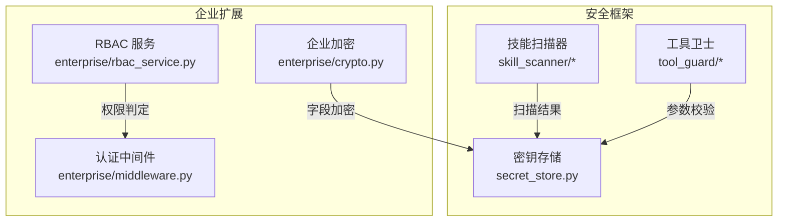
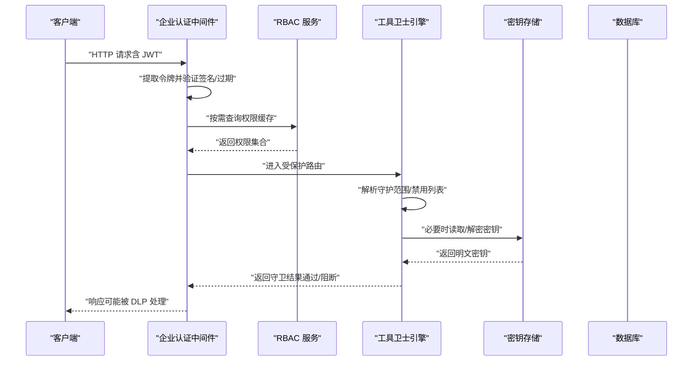
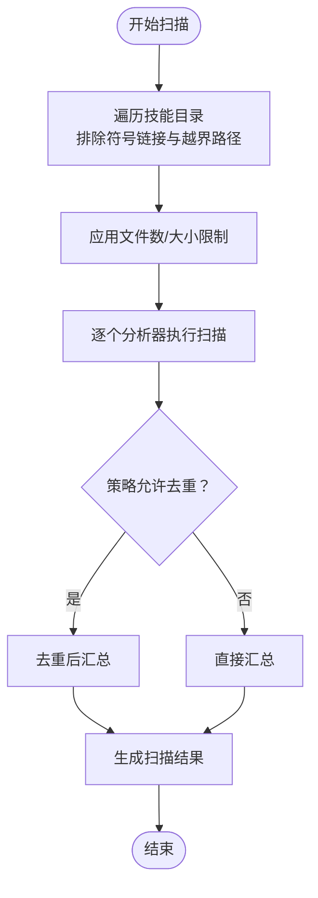
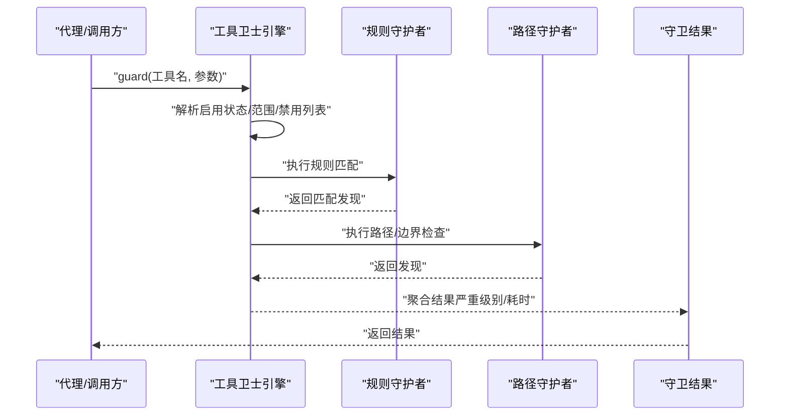
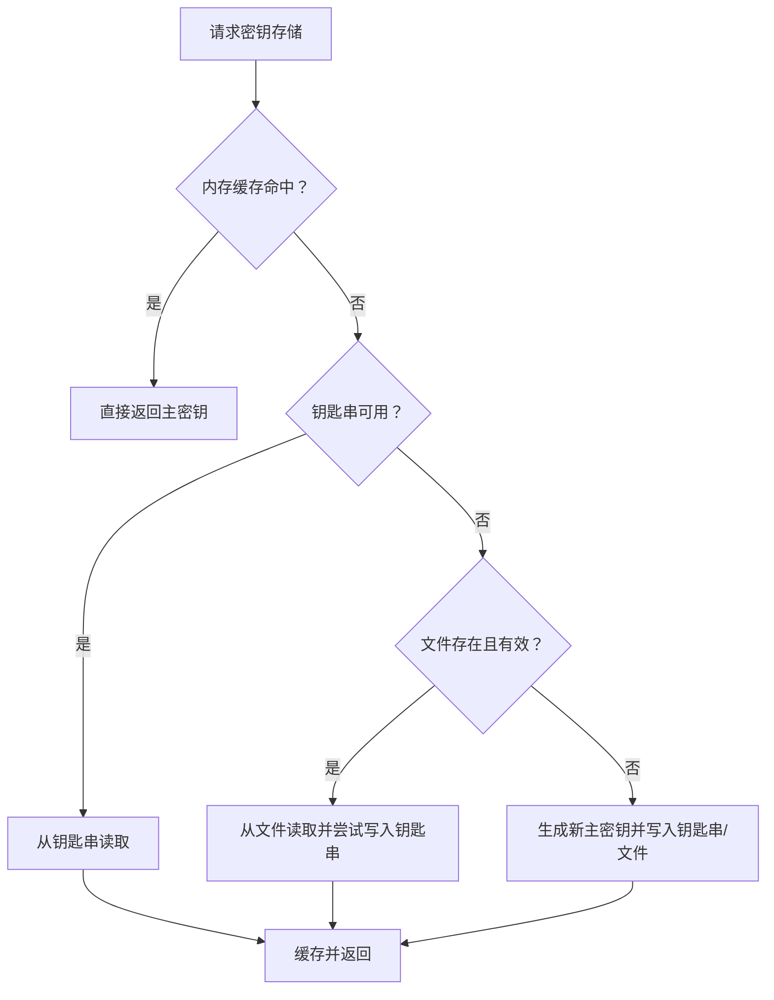
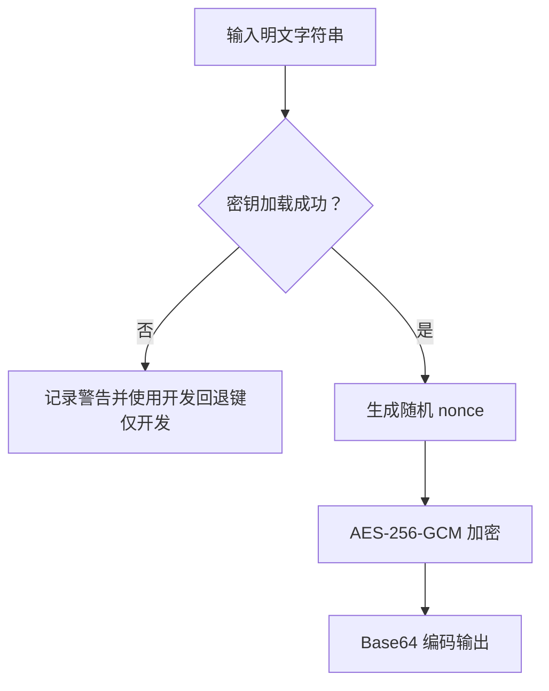
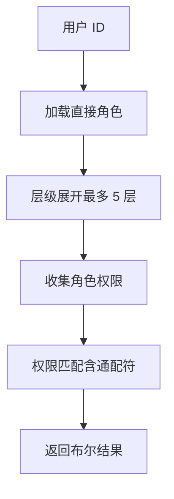
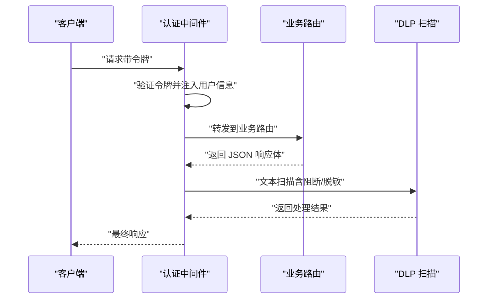
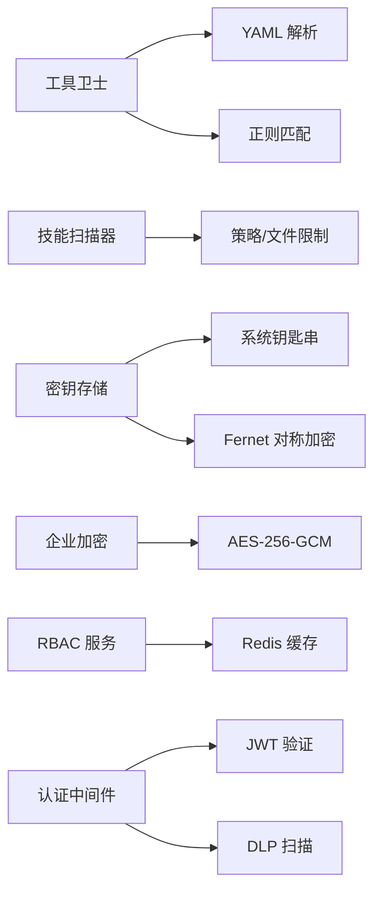

# 安全策略

<cite>
**本文引用的文件**
- [security/__init__.py](file://src/copaw/security/__init__.py)
- [secret_store.py](file://src/copaw/security/secret_store.py)
- [skill_scanner/scanner.py](file://src/copaw/security/skill_scanner/scanner.py)
- [skill_scanner/models.py](file://src/copaw/security/skill_scanner/models.py)
- [tool_guard/__init__.py](file://src/copaw/security/tool_guard/__init__.py)
- [tool_guard/engine.py](file://src/copaw/security/tool_guard/engine.py)
- [tool_guard/guardians/rule_guardian.py](file://src/copaw/security/tool_guard/guardians/rule_guardian.py)
- [tool_guard/models.py](file://src/copaw/security/tool_guard/models.py)
- [enterprise/crypto.py](file://src/copaw/enterprise/crypto.py)
- [enterprise/rbac_service.py](file://src/copaw/enterprise/rbac_service.py)
- [enterprise/middleware.py](file://src/copaw/enterprise/middleware.py)
</cite>

## 目录
1. [简介](#简介)
2. [项目结构](#项目结构)
3. [核心组件](#核心组件)
4. [架构总览](#架构总览)
5. [详细组件分析](#详细组件分析)
6. [依赖分析](#依赖分析)
7. [性能考虑](#性能考虑)
8. [故障排查指南](#故障排查指南)
9. [结论](#结论)
10. [附录](#附录)

## 简介
本文件面向 CoPaw 企业版的安全策略体系，系统化梳理并解释以下关键能力：
- 技能扫描器：对技能包进行静态安全扫描，识别潜在危险模式与硬编码敏感信息。
- 工具卫士：在工具调用前进行参数扫描与策略校验，阻断高危命令与越权路径。
- 密钥存储：透明加密的机密字段存储，支持主密钥的多后端持久化与迁移。
- 企业加密：数据库字段级 AES-256-GCM 加密与 PII 掩码。
- 访问控制：基于角色的权限控制（RBAC）与中间件鉴权。
- 合规与响应：默认安全策略、自定义规则、威胁检测算法、事件响应与加固建议。

## 项目结构
安全相关代码主要分布在以下模块：
- security 包：技能扫描器、工具卫士、密钥存储
- enterprise 包：企业级加密、RBAC、认证中间件

图表来源
- [security/__init__.py:1-21](file://src/copaw/security/__init__.py#L1-L21)
- [secret_store.py:1-285](file://src/copaw/security/secret_store.py#L1-L285)
- [skill_scanner/scanner.py:1-319](file://src/copaw/security/skill_scanner/scanner.py#L1-L319)
- [tool_guard/engine.py:1-238](file://src/copaw/security/tool_guard/engine.py#L1-L238)
- [enterprise/crypto.py:1-140](file://src/copaw/enterprise/crypto.py#L1-L140)
- [enterprise/rbac_service.py:1-262](file://src/copaw/enterprise/rbac_service.py#L1-L262)
- [enterprise/middleware.py:1-191](file://src/copaw/enterprise/middleware.py#L1-L191)

章节来源
- [security/__init__.py:1-21](file://src/copaw/security/__init__.py#L1-L21)

## 核心组件
- 技能扫描器：遍历技能包文件，按策略执行分析器，聚合发现并输出扫描结果；内置默认策略与文件限制。
- 工具卫士：在工具调用前扫描参数，匹配规则库与自定义规则，生成守卫结果；支持路径越界检查与 rm 命令增强提示。
- 密钥存储：提供透明加解密与主密钥管理，优先使用系统钥匙串，回退到文件存储；支持字典字段批量加解密。
- 企业加密：字段级 AES-256-GCM 加密，SQLAlchemy 类型装饰器；提供 PII 掩码辅助。
- RBAC 服务：用户-角色-权限模型，Redis 缓存权限映射，层级角色展开。
- 认证中间件：JWT 验证、租户注入、公开路径放行、JSON 响应 DLP 扫描与脱敏。

章节来源
- [skill_scanner/scanner.py:76-319](file://src/copaw/security/skill_scanner/scanner.py#L76-L319)
- [tool_guard/engine.py:53-238](file://src/copaw/security/tool_guard/engine.py#L53-L238)
- [secret_store.py:148-285](file://src/copaw/security/secret_store.py#L148-L285)
- [enterprise/crypto.py:26-140](file://src/copaw/enterprise/crypto.py#L26-L140)
- [enterprise/rbac_service.py:30-262](file://src/copaw/enterprise/rbac_service.py#L30-L262)
- [enterprise/middleware.py:57-191](file://src/copaw/enterprise/middleware.py#L57-L191)

## 架构总览
下图展示从请求到工具执行的关键安全链路：

图表来源
- [enterprise/middleware.py:57-144](file://src/copaw/enterprise/middleware.py#L57-L144)
- [enterprise/rbac_service.py:35-124](file://src/copaw/enterprise/rbac_service.py#L35-L124)
- [tool_guard/engine.py:169-227](file://src/copaw/security/tool_guard/engine.py#L169-L227)
- [secret_store.py:148-204](file://src/copaw/security/secret_store.py#L148-L204)

## 详细组件分析

### 技能扫描器
- 设计要点
  - 扫描器负责发现技能包文件、加载分析器、执行扫描、去重与聚合结果。
  - 默认启用模式匹配分析器，支持策略驱动的文件分类、大小与数量限制。
  - 对符号链接与越界路径进行防护，避免扫描外部敏感资源。
- 关键流程

图表来源
- [skill_scanner/scanner.py:148-242](file://src/copaw/security/skill_scanner/scanner.py#L148-L242)
- [skill_scanner/models.py:168-235](file://src/copaw/security/skill_scanner/models.py#L168-L235)

章节来源
- [skill_scanner/scanner.py:76-319](file://src/copaw/security/skill_scanner/scanner.py#L76-L319)
- [skill_scanner/models.py:14-235](file://src/copaw/security/skill_scanner/models.py#L14-L235)

### 工具卫士
- 设计要点
  - 引擎按守护范围与禁用列表选择性执行守护者；默认包含规则库与路径检查守护者。
  - 支持动态重载规则与守护范围；提供统一结果模型与严重级别聚合。
  - 规则基于 YAML，支持正则匹配、排除规则、工具/参数维度限定。
- 关键流程

图表来源
- [tool_guard/engine.py:169-227](file://src/copaw/security/tool_guard/engine.py#L169-L227)
- [tool_guard/guardians/rule_guardian.py:559-758](file://src/copaw/security/tool_guard/guardians/rule_guardian.py#L559-L758)
- [tool_guard/models.py:103-185](file://src/copaw/security/tool_guard/models.py#L103-L185)

章节来源
- [tool_guard/engine.py:53-238](file://src/copaw/security/tool_guard/engine.py#L53-L238)
- [tool_guard/guardians/rule_guardian.py:1-758](file://src/copaw/security/tool_guard/guardians/rule_guardian.py#L1-L758)
- [tool_guard/models.py:1-185](file://src/copaw/security/tool_guard/models.py#L1-L185)

### 密钥存储
- 设计要点
  - 主密钥优先从系统钥匙串读取，容器/无桌面环境回退到文件；首次缺失会生成并持久化。
  - 使用 Fernet（对称加密）对敏感字段透明加解密；值以特定前缀标识，便于迁移。
  - 提供针对配置字典的批量加解密接口，限定字段集。
- 关键流程

图表来源
- [secret_store.py:148-183](file://src/copaw/security/secret_store.py#L148-L183)

章节来源
- [secret_store.py:1-285](file://src/copaw/security/secret_store.py#L1-L285)

### 企业加密（字段级）
- 设计要点
  - AES-256-GCM 实现字段级加密，密钥来自环境变量；开发回退键仅用于本地测试。
  - 提供 SQLAlchemy 类型装饰器，实现入库加密、出库解密的透明化。
  - 提供 PII 掩码工具，可配置可见前缀长度。
- 关键流程

图表来源
- [enterprise/crypto.py:26-81](file://src/copaw/enterprise/crypto.py#L26-L81)

章节来源
- [enterprise/crypto.py:1-140](file://src/copaw/enterprise/crypto.py#L1-L140)

### RBAC 服务
- 设计要点
  - 用户-角色-权限三层关系，支持层级角色链（最多 5 层），权限集合通过 Redis 缓存。
  - 权限匹配支持通配符与动作通配，简化策略表达。
- 关键流程

图表来源
- [enterprise/rbac_service.py:66-124](file://src/copaw/enterprise/rbac_service.py#L66-L124)

章节来源
- [enterprise/rbac_service.py:1-262](file://src/copaw/enterprise/rbac_service.py#L1-L262)

### 认证中间件与 DLP
- 设计要点
  - JWT 验证通过后注入用户上下文；公开路径与预检请求放行。
  - 对受保护路由的 JSON 响应进行 DLP 扫描，支持阻断或脱敏，并记录审计事件。
- 关键流程

图表来源
- [enterprise/middleware.py:69-144](file://src/copaw/enterprise/middleware.py#L69-L144)

章节来源
- [enterprise/middleware.py:1-191](file://src/copaw/enterprise/middleware.py#L1-L191)

## 依赖分析
- 组件内聚与耦合
  - security 子模块保持独立，工具卫士与技能扫描器分别面向“运行时参数”和“安装前静态文件”的不同场景，降低耦合。
  - enterprise 模块与安全模块通过通用的密钥与加密能力产生间接耦合（如密钥存储与企业加密共享对称密钥的使用理念）。
- 外部依赖
  - 工具卫士规则加载依赖 YAML 解析；密钥存储依赖系统钥匙串与对称加密库；企业加密依赖数据库与 Redis（可选）。

图表来源
- [tool_guard/guardians/rule_guardian.py:432-511](file://src/copaw/security/tool_guard/guardians/rule_guardian.py#L432-L511)
- [secret_store.py:72-102](file://src/copaw/security/secret_store.py#L72-L102)
- [enterprise/crypto.py:53-81](file://src/copaw/enterprise/crypto.py#L53-L81)
- [enterprise/rbac_service.py:47-62](file://src/copaw/enterprise/rbac_service.py#L47-L62)
- [enterprise/middleware.py:86-103](file://src/copaw/enterprise/middleware.py#L86-L103)

## 性能考虑
- 工具卫士
  - 规则加载采用延迟初始化与缓存；正则预编译减少重复开销；仅在启用范围内执行守护者。
- 技能扫描器
  - 文件发现阶段严格限制数量与大小，避免大体积技能包导致扫描时间过长；默认去重提升聚合效率。
- 密钥存储
  - 主密钥与 Fernet 实例缓存，减少频繁 IO 与解密成本；容器/无桌面环境跳过钥匙串以避免阻塞。
- 企业加密
  - 字段级加密适合小量敏感字段；对大量数据建议分批处理与索引策略优化。
- RBAC 与中间件
  - Redis 缓存权限映射显著降低数据库压力；DLP 扫描仅对 JSON 响应生效，避免对非敏感内容的不必要处理。

## 故障排查指南
- 工具卫士
  - 若规则未生效，检查守护范围与禁用列表；确认规则目录与自定义规则配置正确；关注守护者失败项。
  - 路径越界检测：若 rm 命令涉及工作区外文件，将附加详细提示与结构化元数据，便于前端展示。
- 技能扫描器
  - 当扫描时间过长或未发现任何文件，检查策略中的文件分类与大小限制；确认目录可访问且非符号链接。
- 密钥存储
  - 钥匙串不可用时自动回退文件存储；若主密钥变更或文件损坏，解密会降级返回原文并记录警告。
- 企业加密
  - 环境变量密钥格式错误将触发警告并使用开发回退键；解密失败抛出异常，需核对密钥一致性。
- RBAC 与中间件
  - 权限缓存失效：修改角色/权限后需清理对应用户缓存键；DLP 阻断时检查策略与违规内容。

章节来源
- [tool_guard/engine.py:148-164](file://src/copaw/security/tool_guard/engine.py#L148-L164)
- [tool_guard/guardians/rule_guardian.py:645-757](file://src/copaw/security/tool_guard/guardians/rule_guardian.py#L645-L757)
- [secret_store.py:224-236](file://src/copaw/security/secret_store.py#L224-L236)
- [enterprise/crypto.py:32-46](file://src/copaw/enterprise/crypto.py#L32-L46)
- [enterprise/rbac_service.py:175-184](file://src/copaw/enterprise/rbac_service.py#L175-L184)
- [enterprise/middleware.py:116-141](file://src/copaw/enterprise/middleware.py#L116-L141)

## 结论
CoPaw 企业版安全策略通过“安装前静态扫描 + 运行前参数校验 + 机密透明加密 + 字段级加密 + RBAC + 中间件 DLP”的组合，构建了覆盖技能供应链、工具调用与数据存储的纵深防御体系。默认策略与可插拔规则设计使得安全策略既可即开即用，又可按组织需求灵活定制与演进。

## 附录

### 默认安全策略与自定义规则
- 技能扫描策略
  - 文件分类：通过策略配置决定跳过类型与归档扩展名；若未配置，使用内置安全网。
  - 文件限制：最大文件数与单文件大小，防止资源滥用。
  - 分析器：默认启用模式匹配分析器；可注册更多分析器（如未来 LLM 判决）。
- 工具卫士规则
  - 规则来源：内置 YAML 规则目录与配置中自定义规则；支持禁用规则 ID。
  - 规则维度：工具名、参数名、威胁类别、严重级别、描述与修复建议。
  - 特殊增强：rm 命令的目标路径越界检测与多语言提示。

章节来源
- [skill_scanner/scanner.py:76-134](file://src/copaw/security/skill_scanner/scanner.py#L76-L134)
- [tool_guard/guardians/rule_guardian.py:432-552](file://src/copaw/security/tool_guard/guardians/rule_guardian.py#L432-L552)

### 威胁检测算法与工作原理
- 技能扫描器
  - 模式匹配：基于策略的正则签名扫描，支持排除模式与去重。
  - 文件边界：严格限制遍历范围，避免符号链接与越界路径。
- 工具卫士
  - 正则匹配：对参数字符串表示进行快速扫描；支持多参数与多工具维度。
  - 路径解析：跨平台路径规范化、越界判断与 rm 命令目标提取。
  - 结果聚合：按严重级别排序与统计，便于决策。

章节来源
- [skill_scanner/models.py:19-54](file://src/copaw/security/skill_scanner/models.py#L19-L54)
- [tool_guard/models.py:25-53](file://src/copaw/security/tool_guard/models.py#L25-L53)
- [tool_guard/guardians/rule_guardian.py:164-324](file://src/copaw/security/tool_guard/guardians/rule_guardian.py#L164-L324)

### 企业级安全合规与实施策略
- 数据保护
  - 机密字段透明加密：密钥存储与密钥轮换；字段级加密用于数据库敏感列。
  - PII 掩码：对日志与展示内容进行掩码处理。
- 访问控制
  - RBAC：层级角色、权限缓存、通配符匹配；结合中间件进行统一鉴权。
- 网络安全
  - 中间件统一鉴权与 DLP：对受保护路由的响应进行内容扫描与阻断/脱敏。
- 安全事件响应
  - 审计与告警：结合企业审计与告警模块（参考企业模块），记录违规事件并触发处置流程。
- 漏洞评估与加固
  - 定期扫描技能包与工具参数规则；更新密钥与规则；优化 RBAC 权限矩阵；强化中间件与 DLP 策略。
- 与现有体系集成
  - 通过中间件与 RBAC 服务对接企业身份与权限系统；密钥存储与企业加密密钥管理对接企业 KMS 或密钥中心。

章节来源
- [secret_store.py:1-285](file://src/copaw/security/secret_store.py#L1-L285)
- [enterprise/crypto.py:1-140](file://src/copaw/enterprise/crypto.py#L1-L140)
- [enterprise/rbac_service.py:1-262](file://src/copaw/enterprise/rbac_service.py#L1-L262)
- [enterprise/middleware.py:1-191](file://src/copaw/enterprise/middleware.py#L1-L191)