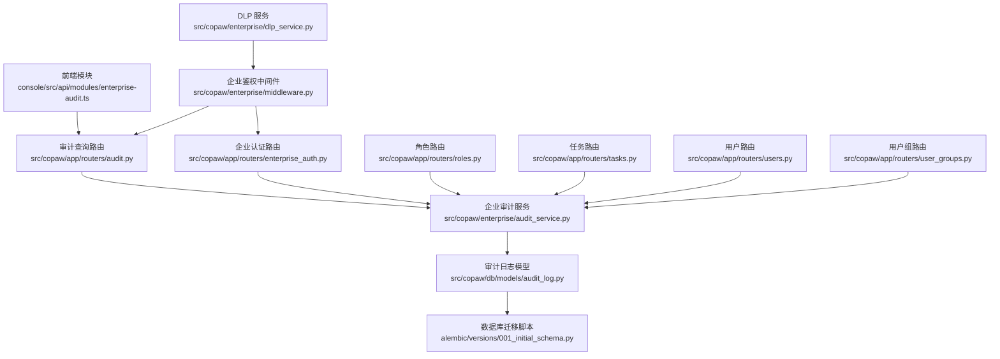
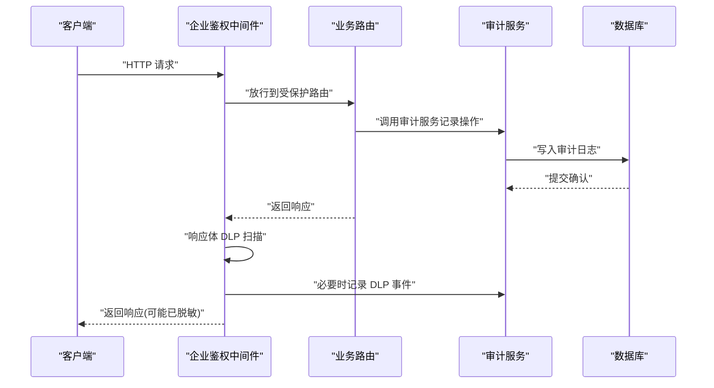
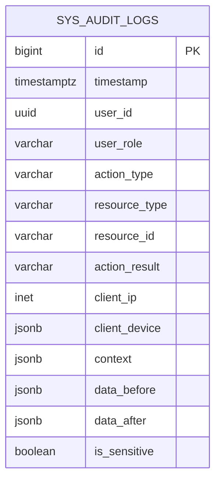
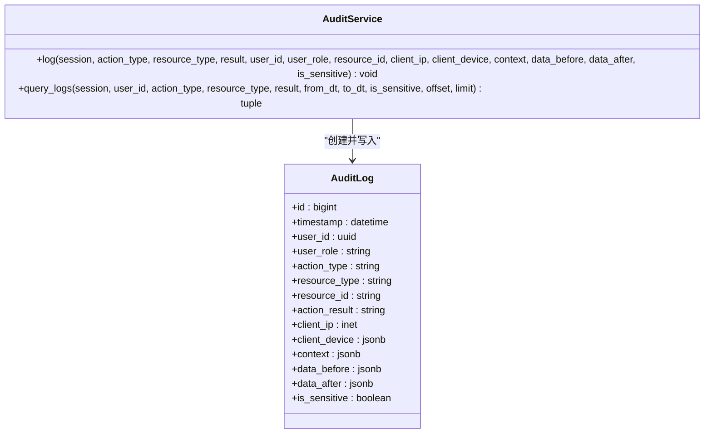
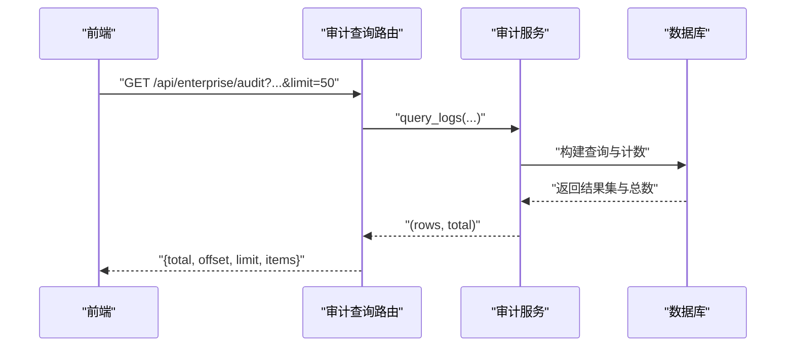
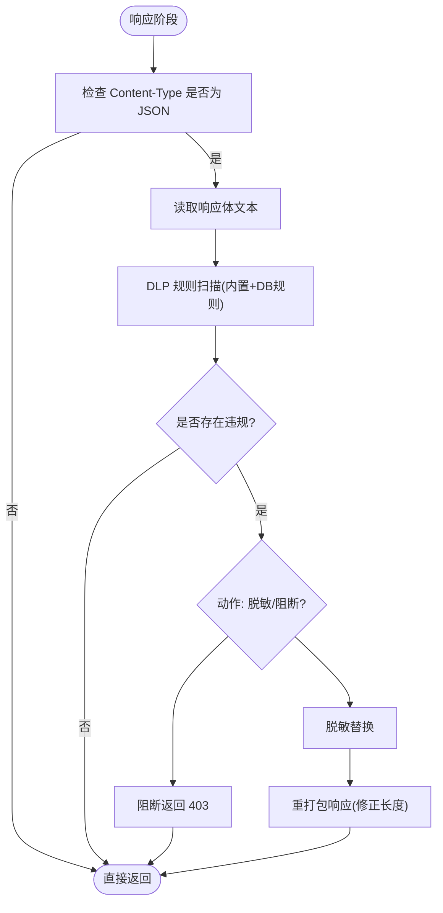
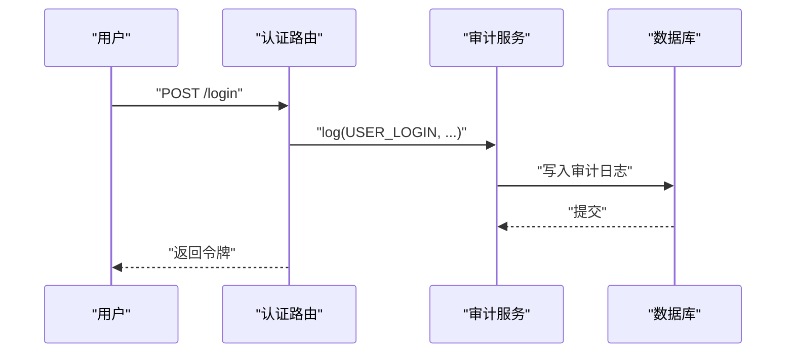
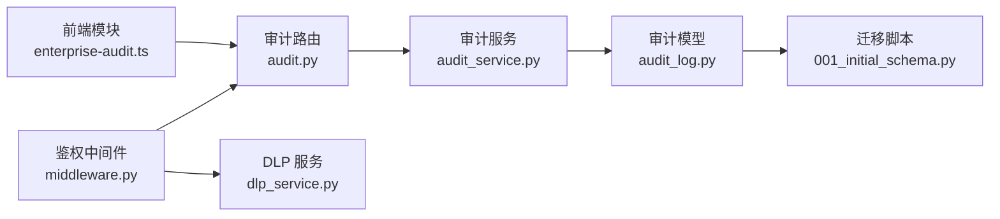

# 审计日志

<cite>
**本文引用的文件**
- [audit_log.py](file://src/copaw/db/models/audit_log.py)
- [audit_service.py](file://src/copaw/enterprise/audit_service.py)
- [audit.py](file://src/copaw/app/routers/audit.py)
- [enterprise-audit.ts](file://console/src/api/modules/enterprise-audit.ts)
- [middleware.py](file://src/copaw/enterprise/middleware.py)
- [enterprise_auth.py](file://src/copaw/app/routers/enterprise_auth.py)
- [dlp_service.py](file://src/copaw/enterprise/dlp_service.py)
- [001_initial_schema.py](file://alembic/versions/001_initial_schema.py)
- [roles.py](file://src/copaw/app/routers/roles.py)
- [tasks.py](file://src/copaw/app/routers/tasks.py)
- [users.py](file://src/copaw/app/routers/users.py)
- [user_groups.py](file://src/copaw/app/routers/user_groups.py)
</cite>

## 目录
1. [简介](#简介)
2. [项目结构](#项目结构)
3. [核心组件](#核心组件)
4. [架构总览](#架构总览)
5. [组件详解](#组件详解)
6. [依赖关系分析](#依赖关系分析)
7. [性能与容量规划](#性能与容量规划)
8. [故障排查指南](#故障排查指南)
9. [结论](#结论)
10. [附录](#附录)

## 简介
本文件面向 CoPaw 企业版的审计日志系统，系统性阐述审计日志的采集机制、存储策略、查询过滤、报表生成等核心能力，并给出日志格式规范、敏感信息处理策略、合规与安全应用实践、配置与优化建议，以及与第三方安全平台的集成思路，帮助组织满足各类审计与合规要求。

## 项目结构
审计日志子系统由“前端 API 模块”、“后端路由层”、“企业级审计服务”、“数据库模型与迁移脚本”四部分组成，形成“请求 → 鉴权中间件 → 审计记录 → 查询接口 → 前端展示”的闭环。

图示来源
- [enterprise-audit.ts:1-44](file://console/src/api/modules/enterprise-audit.ts#L1-L44)
- [audit.py:1-65](file://src/copaw/app/routers/audit.py#L1-L65)
- [audit_service.py:1-135](file://src/copaw/enterprise/audit_service.py#L1-L135)
- [audit_log.py:1-106](file://src/copaw/db/models/audit_log.py#L1-L106)
- [001_initial_schema.py:160-187](file://alembic/versions/001_initial_schema.py#L160-L187)
- [enterprise_auth.py:80-234](file://src/copaw/app/routers/enterprise_auth.py#L80-L234)
- [roles.py:100-230](file://src/copaw/app/routers/roles.py#L100-L230)
- [tasks.py:100-210](file://src/copaw/app/routers/tasks.py#L100-L210)
- [users.py:100-260](file://src/copaw/app/routers/users.py#L100-L260)
- [user_groups.py:90-280](file://src/copaw/app/routers/user_groups.py#L90-L280)
- [middleware.py:1-191](file://src/copaw/enterprise/middleware.py#L1-L191)
- [dlp_service.py:1-231](file://src/copaw/enterprise/dlp_service.py#L1-L231)

章节来源
- [audit.py:1-65](file://src/copaw/app/routers/audit.py#L1-L65)
- [audit_service.py:1-135](file://src/copaw/enterprise/audit_service.py#L1-L135)
- [audit_log.py:1-106](file://src/copaw/db/models/audit_log.py#L1-L106)
- [001_initial_schema.py:160-187](file://alembic/versions/001_initial_schema.py#L160-L187)
- [enterprise-audit.ts:1-44](file://console/src/api/modules/enterprise-audit.ts#L1-L44)
- [middleware.py:1-191](file://src/copaw/enterprise/middleware.py#L1-L191)
- [dlp_service.py:1-231](file://src/copaw/enterprise/dlp_service.py#L1-L231)

## 核心组件
- 审计日志模型：定义审计事件字段、索引与注释，遵循 ISO 27001 的“Who/What/When/Where/Why/How”要素设计，支持敏感操作的数据前后快照。
- 企业审计服务：提供统一的日志写入与查询辅助方法，集中管理审计事件的分类常量与过滤条件。
- 审计查询路由：对外暴露 /api/enterprise/audit 接口，支持多维过滤、分页与排序。
- 前端 API 模块：定义审计日志响应结构，便于控制台侧进行筛选与展示。
- 鉴权中间件：在受保护路由上注入用户上下文，同时对响应体进行 DLP 扫描（与审计联动）。
- 路由集成点：认证、角色、任务、用户、用户组等关键业务路由均通过审计服务记录操作轨迹。

章节来源
- [audit_log.py:18-106](file://src/copaw/db/models/audit_log.py#L18-L106)
- [audit_service.py:23-135](file://src/copaw/enterprise/audit_service.py#L23-L135)
- [audit.py:21-65](file://src/copaw/app/routers/audit.py#L21-L65)
- [enterprise-audit.ts:4-23](file://console/src/api/modules/enterprise-audit.ts#L4-L23)
- [middleware.py:57-144](file://src/copaw/enterprise/middleware.py#L57-L144)
- [enterprise_auth.py:89-234](file://src/copaw/app/routers/enterprise_auth.py#L89-L234)

## 架构总览
审计日志贯穿“请求入口 → 鉴权与上下文注入 → 业务处理 → 审计记录 → 查询接口 → 前端展示”的全链路。鉴权中间件在响应阶段可结合 DLP 扫描触发审计事件，形成“安全扫描 + 审计留痕”的协同机制。

图示来源
- [middleware.py:69-144](file://src/copaw/enterprise/middleware.py#L69-L144)
- [enterprise_auth.py:89-234](file://src/copaw/app/routers/enterprise_auth.py#L89-L234)
- [audit_service.py:54-87](file://src/copaw/enterprise/audit_service.py#L54-L87)

## 组件详解

### 审计日志模型与表结构
- 字段设计覆盖“身份、行为、对象、结果、位置、上下文、敏感变更”七要素；索引覆盖时间、用户、动作类型、资源类型，满足高频查询。
- 支持 JSONB 存储上下文与敏感数据变更前/后的快照，便于回溯与取证。
- 追加式写入约定，配合只读备份策略，满足 ISO 27001 的不可篡改要求。

图示来源
- [audit_log.py:18-106](file://src/copaw/db/models/audit_log.py#L18-L106)
- [001_initial_schema.py:166-182](file://alembic/versions/001_initial_schema.py#L166-L182)

章节来源
- [audit_log.py:18-106](file://src/copaw/db/models/audit_log.py#L18-L106)
- [001_initial_schema.py:166-186](file://alembic/versions/001_initial_schema.py#L166-L186)

### 企业审计服务与查询接口
- 写入接口：以事务内异步写入方式记录单条审计日志，支持传入用户、角色、资源、结果、客户端信息、上下文、敏感标记及数据变更快照。
- 查询接口：支持按用户、动作类型、资源类型、结果、时间范围、敏感标记进行过滤，返回分页列表与总数，按时间倒序排列。
- 动作类型常量：涵盖用户、角色、权限、任务、工作流、代理运行、密钥访问、配置变更等关键领域。

图示来源
- [audit_service.py:51-135](file://src/copaw/enterprise/audit_service.py#L51-L135)
- [audit_log.py:18-106](file://src/copaw/db/models/audit_log.py#L18-L106)

章节来源
- [audit_service.py:23-135](file://src/copaw/enterprise/audit_service.py#L23-L135)
- [audit.py:21-65](file://src/copaw/app/routers/audit.py#L21-L65)

### 审计查询 API 与前端对接
- 后端路由提供 /api/enterprise/audit 接口，支持多维过滤参数与分页；返回结构包含 total、offset、limit、items。
- 前端模块定义响应结构与查询函数，便于控制台侧进行筛选与展示。

图示来源
- [audit.py:21-65](file://src/copaw/app/routers/audit.py#L21-L65)
- [enterprise-audit.ts:25-44](file://console/src/api/modules/enterprise-audit.ts#L25-L44)
- [audit_service.py:90-135](file://src/copaw/enterprise/audit_service.py#L90-L135)

章节来源
- [audit.py:21-65](file://src/copaw/app/routers/audit.py#L21-L65)
- [enterprise-audit.ts:4-23](file://console/src/api/modules/enterprise-audit.ts#L4-L23)

### 敏感信息处理与脱敏策略
- 审计模型支持敏感标记字段与数据变更快照，便于区分敏感操作与非敏感操作。
- 鉴权中间件在响应阶段对 JSON 响应体进行 DLP 扫描，触发时可记录 DLP 事件并按策略进行脱敏或阻断，从而实现“安全扫描 + 审计留痕”的协同。

图示来源
- [middleware.py:107-141](file://src/copaw/enterprise/middleware.py#L107-L141)
- [dlp_service.py:114-206](file://src/copaw/enterprise/dlp_service.py#L114-L206)

章节来源
- [audit_log.py:88-99](file://src/copaw/db/models/audit_log.py#L88-L99)
- [middleware.py:107-141](file://src/copaw/enterprise/middleware.py#L107-L141)
- [dlp_service.py:114-206](file://src/copaw/enterprise/dlp_service.py#L114-L206)

### 关键业务路由中的审计集成
- 认证路由：登录、注册、登出、修改密码、启用 MFA 等关键操作均通过审计服务记录。
- 角色与权限：角色创建/更新/删除、权限分配/回收、角色分配/撤销等。
- 任务与工作流：任务创建/更新/删除/状态变更，工作流运行等。
- 用户与用户组：用户 CRUD、用户组 CRUD、成员管理等。

图示来源
- [enterprise_auth.py:89-122](file://src/copaw/app/routers/enterprise_auth.py#L89-L122)
- [audit_service.py:54-87](file://src/copaw/enterprise/audit_service.py#L54-L87)

章节来源
- [enterprise_auth.py:89-234](file://src/copaw/app/routers/enterprise_auth.py#L89-L234)
- [roles.py:109-224](file://src/copaw/app/routers/roles.py#L109-L224)
- [tasks.py:114-198](file://src/copaw/app/routers/tasks.py#L114-L198)
- [users.py:124-247](file://src/copaw/app/routers/users.py#L124-L247)
- [user_groups.py:106-267](file://src/copaw/app/routers/user_groups.py#L106-L267)

## 依赖关系分析
- 路由层依赖企业审计服务进行日志记录与查询。
- 审计服务依赖数据库模型与会话管理。
- 前端模块依赖后端接口定义的响应结构。
- 鉴权中间件在响应阶段与 DLP 服务协作，间接影响审计事件的产生。

图示来源
- [audit.py:1-65](file://src/copaw/app/routers/audit.py#L1-L65)
- [audit_service.py:1-135](file://src/copaw/enterprise/audit_service.py#L1-L135)
- [audit_log.py:1-106](file://src/copaw/db/models/audit_log.py#L1-L106)
- [001_initial_schema.py:160-187](file://alembic/versions/001_initial_schema.py#L160-L187)
- [enterprise-audit.ts:1-44](file://console/src/api/modules/enterprise-audit.ts#L1-L44)
- [middleware.py:1-191](file://src/copaw/enterprise/middleware.py#L1-L191)
- [dlp_service.py:1-231](file://src/copaw/enterprise/dlp_service.py#L1-L231)

章节来源
- [audit.py:1-65](file://src/copaw/app/routers/audit.py#L1-L65)
- [audit_service.py:1-135](file://src/copaw/enterprise/audit_service.py#L1-L135)
- [audit_log.py:1-106](file://src/copaw/db/models/audit_log.py#L1-L106)
- [001_initial_schema.py:160-187](file://alembic/versions/001_initial_schema.py#L160-L187)
- [enterprise-audit.ts:1-44](file://console/src/api/modules/enterprise-audit.ts#L1-L44)
- [middleware.py:1-191](file://src/copaw/enterprise/middleware.py#L1-L191)
- [dlp_service.py:1-231](file://src/copaw/enterprise/dlp_service.py#L1-L231)

## 性能与容量规划
- 查询性能
  - 时间、用户、动作类型、资源类型的索引已建立，建议优先使用这些维度组合过滤。
  - 分页参数限制在合理范围内，避免一次性拉取过多数据。
- 写入性能
  - 审计写入采用事务内异步写入，建议在业务路由中复用现有会话，减少事务拆分。
- 存储容量
  - 审计日志为只追加结构，建议结合归档策略（冷热分离、分区表）与压缩备份，控制长期成本。
- 敏感数据
  - 使用 JSONB 存储上下文与快照，注意控制单条日志大小，避免超大对象导致写入延迟。
- DLP 扫描
  - 中间件对响应体进行扫描，建议仅对 JSON 响应生效，避免对二进制或大体积响应造成额外开销。

章节来源
- [audit_log.py:33-40](file://src/copaw/db/models/audit_log.py#L33-L40)
- [audit.py:30-31](file://src/copaw/app/routers/audit.py#L30-L31)
- [middleware.py:107-141](file://src/copaw/enterprise/middleware.py#L107-L141)

## 故障排查指南
- 无法查询审计日志
  - 检查请求参数是否正确（用户 ID、动作类型、资源类型、时间范围、敏感标记、分页）。
  - 确认路由限流与权限，确保当前用户具备查询权限。
- 日志缺失
  - 确认业务路由是否调用了审计服务记录接口。
  - 检查事务是否正常提交，避免异常回滚导致未落盘。
- 响应被阻断
  - 若中间件触发 DLP 阻断，将返回 403；需检查 DLP 规则与触发内容。
- 前端显示异常
  - 对照前端响应结构定义，确认字段映射与空值处理。

章节来源
- [audit.py:21-65](file://src/copaw/app/routers/audit.py#L21-L65)
- [enterprise-audit.ts:4-23](file://console/src/api/modules/enterprise-audit.ts#L4-L23)
- [middleware.py:116-131](file://src/copaw/enterprise/middleware.py#L116-L131)

## 结论
CoPaw 企业版审计日志系统以 ISO 27001 为设计准则，围绕“Who/What/When/Where/Why/How”构建了完善的审计事件模型与查询接口，并在关键业务路由中实现自动化记录。结合 DLP 扫描与中间件响应处理，形成“安全扫描 + 审计留痕”的闭环。通过合理的索引、分页与归档策略，可在保证合规与安全的前提下，兼顾性能与成本。

## 附录

### 审计事件分类与字段规范
- 动作类型（节选）
  - 用户类：USER_LOGIN、USER_LOGOUT、USER_REGISTER、USER_CREATE、USER_UPDATE、USER_DELETE、USER_DISABLE、PASSWORD_CHANGE、MFA_ENABLE
  - 权限与角色：ROLE_CREATE、ROLE_UPDATE、ROLE_DELETE、ROLE_ASSIGN、ROLE_REVOKE、PERMISSION_ASSIGN
  - 任务与工作流：TASK_CREATE、TASK_UPDATE、TASK_DELETE、TASK_STATUS_CHANGE、WORKFLOW_CREATE、WORKFLOW_RUN、AGENT_RUN
  - 配置与密钥：CONFIG_CHANGE、SECRET_ACCESS
- 字段说明（节选）
  - 时间戳、用户标识与角色、动作类型、资源类型与 ID、结果、客户端 IP 与设备信息、上下文、敏感标记、数据变更快照

章节来源
- [audit_service.py:23-49](file://src/copaw/enterprise/audit_service.py#L23-L49)
- [audit_log.py:46-99](file://src/copaw/db/models/audit_log.py#L46-L99)

### 查询过滤与分页参数
- 支持过滤：用户 ID、动作类型、资源类型、结果、起止时间、敏感标记
- 分页：offset（≥0）、limit（1~500）

章节来源
- [audit.py:21-32](file://src/copaw/app/routers/audit.py#L21-L32)
- [audit_service.py:90-102](file://src/copaw/enterprise/audit_service.py#L90-L102)

### 与第三方安全平台的集成
- DLP 事件导出：可基于 DLP 事件表结构扩展导出接口，将违规规则、触发路径、摘要等字段输出至 SIEM/EDR 平台。
- 审计日志导出：可按时间窗口与过滤条件导出审计日志，满足合规审计与事件回溯需求。
- 单点登录与会话：结合企业鉴权中间件的用户上下文，可将审计事件与统一身份体系打通。

章节来源
- [dlp_service.py:208-231](file://src/copaw/enterprise/dlp_service.py#L208-L231)
- [middleware.py:96-102](file://src/copaw/enterprise/middleware.py#L96-L102)