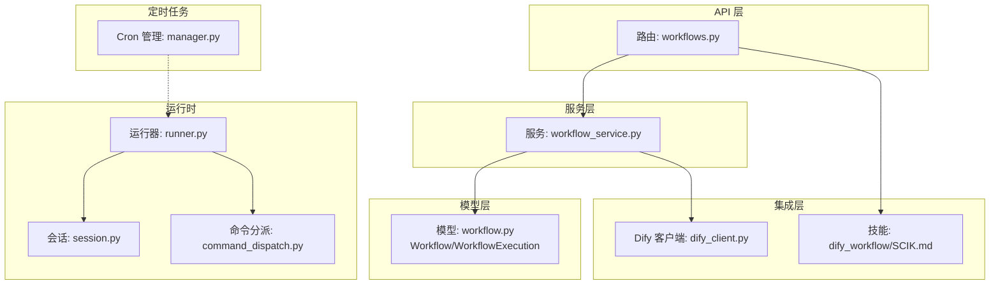
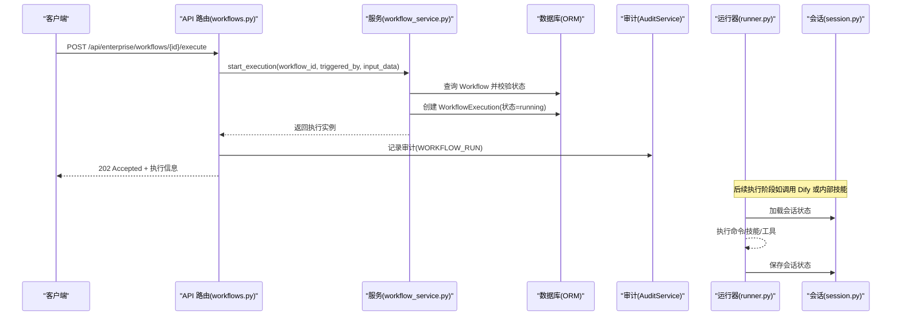
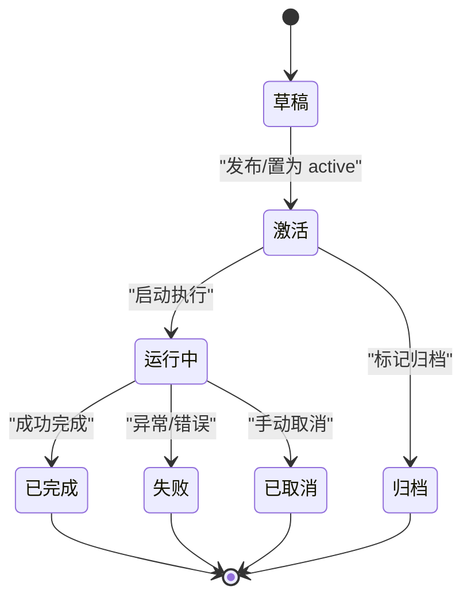
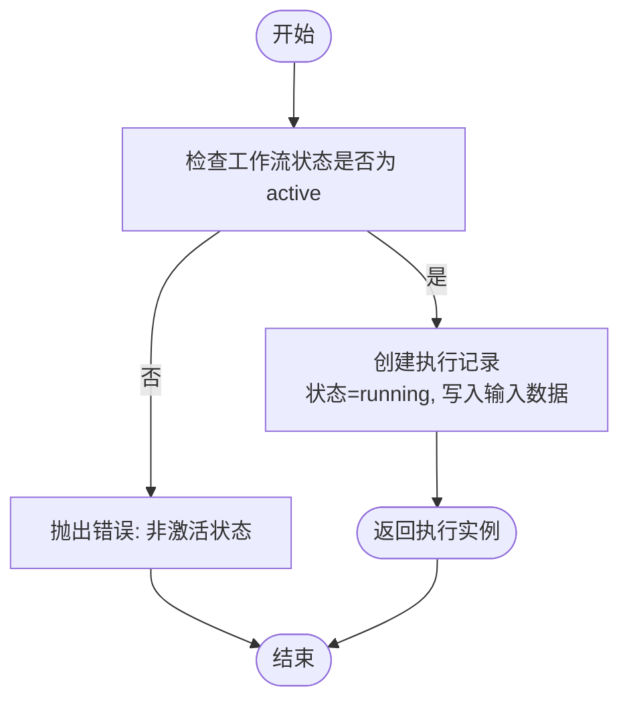
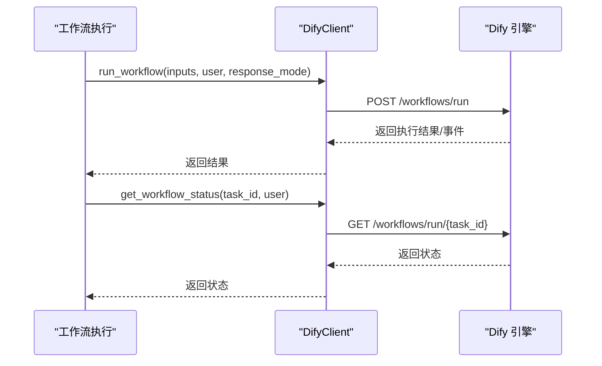
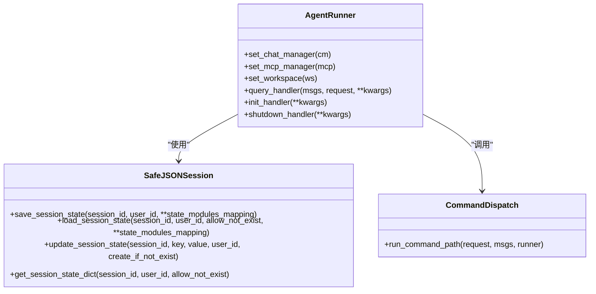
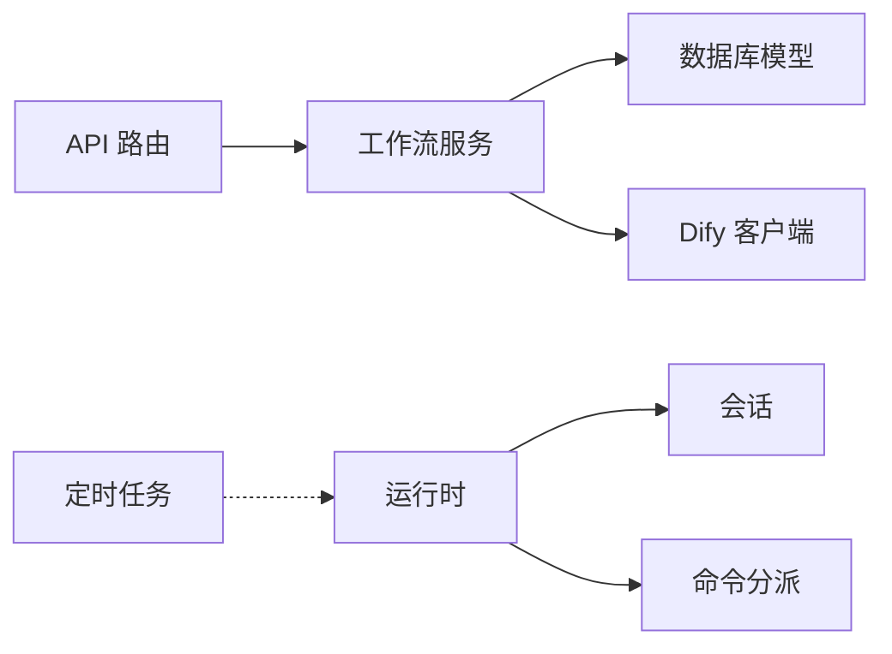

# 工作流管理

<cite>
**本文引用的文件**
- [workflow.py](file://src/copaw/db/models/workflow.py)
- [workflow_service.py](file://src/copaw/enterprise/workflow_service.py)
- [workflows.py](file://src/copaw/app/routers/workflows.py)
- [dify_client.py](file://src/copaw/enterprise/dify_client.py)
- [SKILL.md](file://src/copaw/agents/skills/dify_workflow/SCIK.md)
- [runner.py](file://src/copaw/app/runner/runner.py)
- [session.py](file://src/copaw/app/runner/session.py)
- [command_dispatch.py](file://src/copaw/app/runner/command_dispatch.py)
- [manager.py](file://src/copaw/app/crons/manager.py)
- [walkthrough.md](file://docs/walkthrough.md)
</cite>

## 目录
1. [简介](#简介)
2. [项目结构](#项目结构)
3. [核心组件](#核心组件)
4. [架构总览](#架构总览)
5. [详细组件分析](#详细组件分析)
6. [依赖分析](#依赖分析)
7. [性能考虑](#性能考虑)
8. [故障排查指南](#故障排查指南)
9. [结论](#结论)
10. [附录](#附录)

## 简介
本文件面向 CoPaw 企业版工作流管理系统，系统性阐述工作流的设计原理、节点类型、流转规则、状态管理与生命周期；并覆盖工作流的创建/编辑/删除、部署发布、版本控制、执行监控、与企业业务流程的集成（审批、数据处理、通知提醒）、性能优化策略、错误处理与回滚恢复方案，以及与企业系统的集成接口，帮助实现标准化的业务流程自动化。

## 项目结构
围绕工作流管理的关键代码分布在以下模块：
- 数据模型层：工作流定义与执行记录的 ORM 映射
- 服务层：工作流的增删改查、执行启动与完成
- 路由层：对外暴露 REST API，统一鉴权与审计
- 集成层：与 Dify 工作流引擎的客户端对接
- 运行时层：会话、命令分派、执行器与内存管理
- 定时任务层：基于 APScheduler 的周期性任务调度

图表来源
- [workflows.py:1-210](file://src/copaw/app/routers/workflows.py#L1-L210)
- [workflow_service.py:1-146](file://src/copaw/enterprise/workflow_service.py#L1-L146)
- [workflow.py:1-149](file://src/copaw/db/models/workflow.py#L1-L149)
- [dify_client.py:1-63](file://src/copaw/enterprise/dify_client.py#L1-L63)
- [runner.py:1-729](file://src/copaw/app/runner/runner.py#L1-L729)
- [session.py:1-248](file://src/copaw/app/runner/session.py#L1-L248)
- [command_dispatch.py:1-277](file://src/copaw/app/runner/command_dispatch.py#L1-L277)
- [manager.py:1-388](file://src/copaw/app/crons/manager.py#L1-L388)

章节来源
- [workflows.py:1-210](file://src/copaw/app/routers/workflows.py#L1-L210)
- [workflow_service.py:1-146](file://src/copaw/enterprise/workflow_service.py#L1-L146)
- [workflow.py:1-149](file://src/copaw/db/models/workflow.py#L1-L149)
- [dify_client.py:1-63](file://src/copaw/enterprise/dify_client.py#L1-L63)
- [runner.py:1-729](file://src/copaw/app/runner/runner.py#L1-L729)
- [session.py:1-248](file://src/copaw/app/runner/session.py#L1-L248)
- [command_dispatch.py:1-277](file://src/copaw/app/runner/command_dispatch.py#L1-L277)
- [manager.py:1-388](file://src/copaw/app/crons/manager.py#L1-L388)

## 核心组件
- 工作流定义模型（Workflow）：支持多类工作流（内部 DAG、Dify、Dify 聊天/智能体），具备版本号与状态字段，关联创建者与执行记录。
- 工作流执行模型（WorkflowExecution）：记录单次执行的触发者、状态、时间戳、输入/输出、错误信息与运行元数据。
- 企业工作流服务（WorkflowService）：提供创建、更新、列表、启动执行、完成执行等能力，含状态校验与版本递增。
- 工作流 API 路由（workflows.py）：提供工作流 CRUD 与执行接口，集成审计日志与鉴权中间件。
- Dify 集成：通过 DifyClient 提供工作流运行、状态查询与参数获取；配合 dify_workflow 技能实现复杂业务流程编排。
- 运行时与会话：AgentRunner 负责会话加载/保存、命令分派、工具调用与内存清理；SafeJSONSession 提供跨平台安全的会话持久化。
- 定时任务：CronManager 基于 APScheduler 实现周期性任务调度与心跳任务。

章节来源
- [workflow.py:19-149](file://src/copaw/db/models/workflow.py#L19-L149)
- [workflow_service.py:20-146](file://src/copaw/enterprise/workflow_service.py#L20-L146)
- [workflows.py:26-210](file://src/copaw/app/routers/workflows.py#L26-L210)
- [dify_client.py:4-63](file://src/copaw/enterprise/dify_client.py#L4-L63)
- [runner.py:70-729](file://src/copaw/app/runner/runner.py#L70-L729)
- [session.py:39-248](file://src/copaw/app/runner/session.py#L39-L248)
- [manager.py:38-388](file://src/copaw/app/crons/manager.py#L38-L388)

## 架构总览
下图展示从 API 请求到工作流执行与结果落盘的端到端流程，涵盖鉴权、审计、执行状态机与会话持久化。

图表来源
- [workflows.py:160-186](file://src/copaw/app/routers/workflows.py#L160-L186)
- [workflow_service.py:107-128](file://src/copaw/enterprise/workflow_service.py#L107-L128)
- [runner.py:349-589](file://src/copaw/app/runner/runner.py#L349-L589)
- [session.py:73-138](file://src/copaw/app/runner/session.py#L73-L138)

## 详细组件分析

### 数据模型与状态机
- 工作流状态：draft（草稿）、active（激活）、archived（归档）
- 执行状态：pending（等待）、running（运行中）、paused（已暂停）、completed（已完成）、failed（失败）、cancelled（已取消）
- 版本控制：更新 definition 时自动递增版本号
- 关键字段：definition（DAG 节点/边的 JSON 结构）、category（工作流类别）

图表来源
- [workflow.py:58-61](file://src/copaw/db/models/workflow.py#L58-L61)
- [workflow.py:107-110](file://src/copaw/db/models/workflow.py#L107-L110)

章节来源
- [workflow.py:19-149](file://src/copaw/db/models/workflow.py#L19-L149)

### 服务层：工作流 CRUD 与执行
- 创建：校验类别合法性，初始化状态为 draft
- 更新：支持名称/描述/定义/状态/类别；更新定义时递增版本
- 列表：支持按类别、状态、创建者过滤，分页查询
- 启动执行：仅对 active 状态工作流允许执行，写入执行记录并设置状态为 running
- 完成执行：根据是否传入错误信息决定状态为 completed 或 failed，并记录完成时间与输出

图表来源
- [workflow_service.py:107-128](file://src/copaw/enterprise/workflow_service.py#L107-L128)

章节来源
- [workflow_service.py:20-146](file://src/copaw/enterprise/workflow_service.py#L20-L146)

### API 层：REST 接口与审计
- GET /api/enterprise/workflows：分页列出工作流，支持类别/状态/创建者过滤
- POST /api/enterprise/workflows：创建工作流，记录审计日志（WORKFLOW_CREATE）
- GET /api/enterprise/workflows/{id}：获取工作流详情
- PUT /api/enterprise/workflows/{id}：更新工作流
- DELETE /api/enterprise/workflows/{id}：删除工作流
- POST /api/enterprise/workflows/{id}/execute：启动执行，记录审计日志（WORKFLOW_RUN）
- GET /api/enterprise/workflows/{id}/executions：按工作流查询执行记录，支持按状态过滤

章节来源
- [workflows.py:75-210](file://src/copaw/app/routers/workflows.py#L75-L210)

### 与 Dify 的集成
- DifyClient：提供运行工作流、查询状态、获取应用参数的异步接口
- dify_workflow 技能：指导如何在复杂业务场景下使用 Dify 工作流，强调先列出可用连接器、再构造输入参数与用户标识

图表来源
- [dify_client.py:16-62](file://src/copaw/enterprise/dify_client.py#L16-L62)
- [SKILL.md:1-66](file://src/copaw/agents/skills/dify_workflow/SCIK.md#L1-L66)

章节来源
- [dify_client.py:1-63](file://src/copaw/enterprise/dify_client.py#L1-L63)
- [SKILL.md:1-66](file://src/copaw/agents/skills/dify_workflow/SCIK.md#L1-L66)

### 运行时与会话
- AgentRunner：负责会话加载/保存、命令分派、工具调用、内存清理与错误兜底
- SafeJSONSession：跨平台安全的 JSON 会话持久化，避免非法文件名导致的系统兼容问题
- 命令分派：区分守护进程命令、控制命令与对话命令路径，分别处理重启、停止、会话状态更新等

图表来源
- [runner.py:70-729](file://src/copaw/app/runner/runner.py#L70-L729)
- [session.py:39-248](file://src/copaw/app/runner/session.py#L39-L248)
- [command_dispatch.py:79-277](file://src/copaw/app/runner/command_dispatch.py#L79-L277)

章节来源
- [runner.py:349-589](file://src/copaw/app/runner/runner.py#L349-L589)
- [session.py:73-138](file://src/copaw/app/runner/session.py#L73-L138)
- [command_dispatch.py:79-277](file://src/copaw/app/runner/command_dispatch.py#L79-L277)

### 定时任务与心跳
- CronManager：基于 APScheduler 的异步调度器，支持 Cron 表达式与间隔触发，内置并发信号量、错失触发宽限、心跳任务重调度
- 心跳任务：根据配置动态启用/禁用，定期执行预设任务（如健康检查、巡检脚本）

章节来源
- [manager.py:38-388](file://src/copaw/app/crons/manager.py#L38-L388)

## 依赖分析
- 组件耦合
  - 路由层依赖服务层；服务层依赖模型层与外部 Dify 客户端
  - 运行时依赖会话与命令分派；与定时任务解耦但可协作
- 外部依赖
  - Dify API（HTTPX 异步客户端）
  - PostgreSQL/SQLAlchemy（ORM）
  - Redis（会话存储，用于聊天会话状态）
  - APScheduler（定时任务）
- 循环依赖
  - 未发现直接循环导入；各模块职责清晰，通过服务层解耦

图表来源
- [workflows.py:1-210](file://src/copaw/app/routers/workflows.py#L1-L210)
- [workflow_service.py:1-146](file://src/copaw/enterprise/workflow_service.py#L1-L146)
- [workflow.py:1-149](file://src/copaw/db/models/workflow.py#L1-L149)
- [dify_client.py:1-63](file://src/copaw/enterprise/dify_client.py#L1-L63)
- [runner.py:1-729](file://src/copaw/app/runner/runner.py#L1-L729)
- [session.py:1-248](file://src/copaw/app/runner/session.py#L1-L248)
- [command_dispatch.py:1-277](file://src/copaw/app/runner/command_dispatch.py#L1-L277)
- [manager.py:1-388](file://src/copaw/app/crons/manager.py#L1-L388)

## 性能考虑
- 异步 I/O：Dify 客户端与会话读写采用异步 HTTP/文件 I/O，避免阻塞事件循环
- 并发控制：定时任务按作业粒度设置并发信号量，防止资源争用
- 分页与索引：API 支持分页与多条件过滤，建议在高并发场景下为常用查询字段建立索引
- 会话持久化：SafeJSONSession 对文件名进行平台兼容处理，减少 IO 异常开销
- 缓存与队列：结合企业环境的 Redis/缓存策略，可将热点会话与执行元数据缓存以降低数据库压力

## 故障排查指南
- 执行失败
  - 检查工作流状态是否为 active；非激活状态将拒绝执行
  - 查看执行记录的 error_message 字段，定位具体错误
  - 若为 Dify 集成，检查 DifyClient 的响应模式与超时设置
- 会话异常
  - SafeJSONSession 在文件不存在时可选择忽略或抛错；若出现状态不一致，可重建会话或清理损坏文件
- 工具调用与审批
  - AgentRunner 在工具调用前检查待审批项，超时自动拒绝；可通过审批服务接口查询与处理
- 定时任务
  - CronManager 对异常任务进行日志记录并通过控制台推送错误信息；检查调度表达式与并发配置

章节来源
- [workflow_service.py:116-117](file://src/copaw/enterprise/workflow_service.py#L116-L117)
- [runner.py:541-581](file://src/copaw/app/runner/runner.py#L541-L581)
- [session.py:131-137](file://src/copaw/app/runner/session.py#L131-L137)
- [manager.py:217-238](file://src/copaw/app/crons/manager.py#L217-L238)

## 结论
CoPaw 企业版工作流管理以清晰的模型与服务分层为基础，结合 Dify 集成与运行时会话管理，实现了从设计、发布、执行到监控的全生命周期闭环。通过异步 I/O、并发控制与可观测性（审计、指标）保障了企业级稳定性与可运维性。建议在生产环境中启用企业特性开关与强密钥，完善监控与告警体系，并持续优化工作流定义与执行路径以提升吞吐与一致性。

## 附录
- 企业升级与可观测性参考：walkthrough 文档展示了企业阶段的交付成果与验证要点，包括技能库、监控与 SSO 流程等

章节来源
- [walkthrough.md:1-51](file://docs/walkthrough.md#L1-L51)