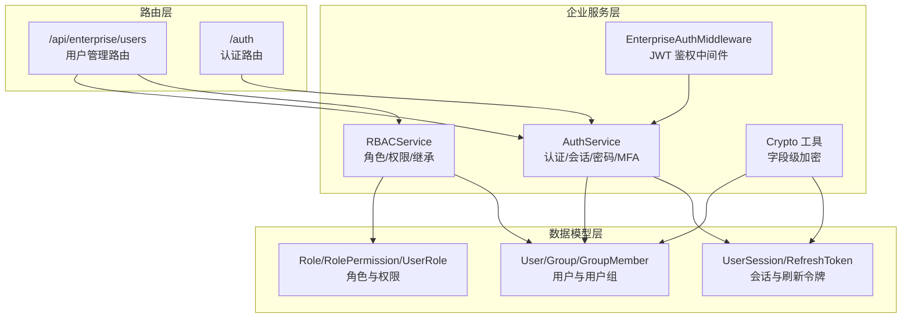
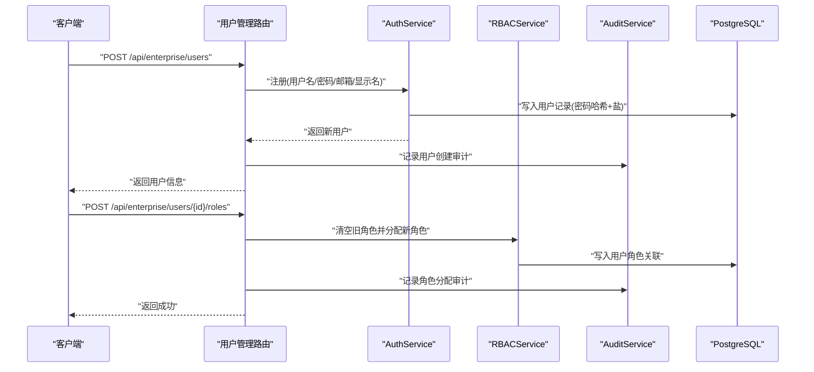
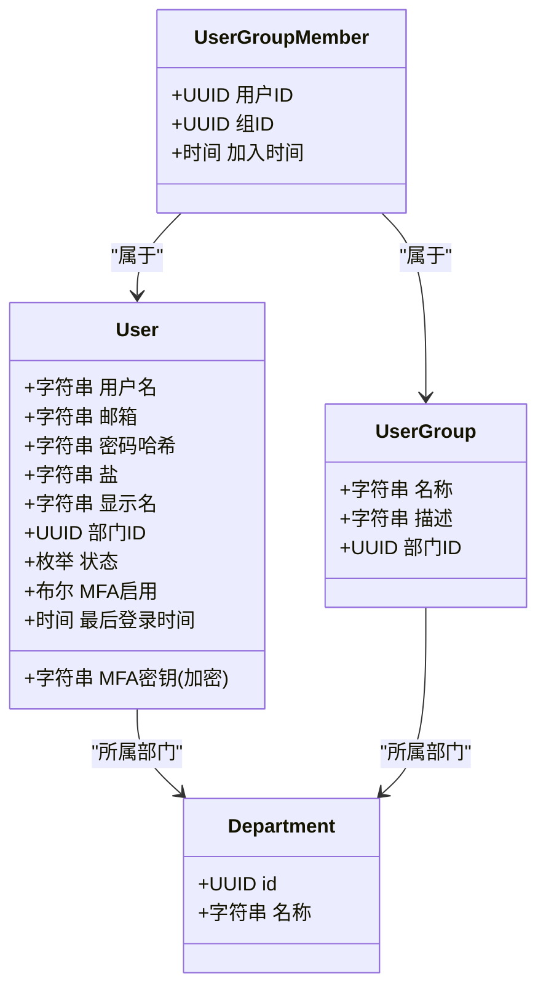
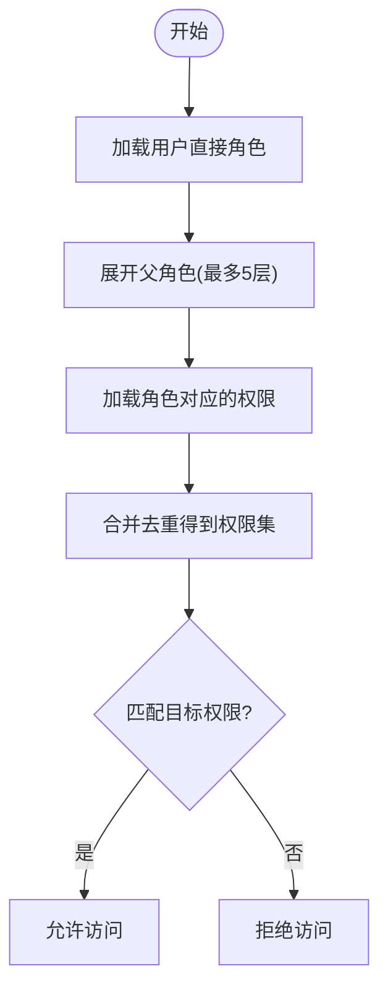
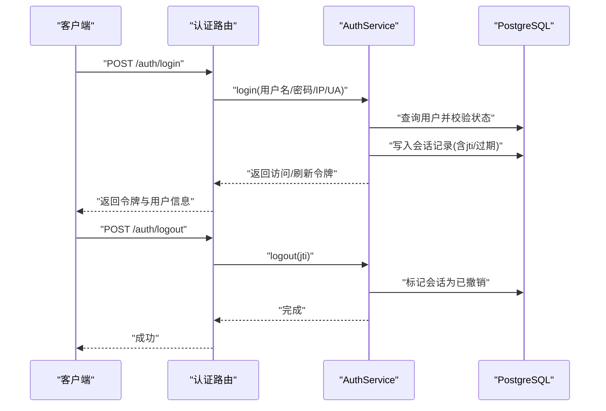
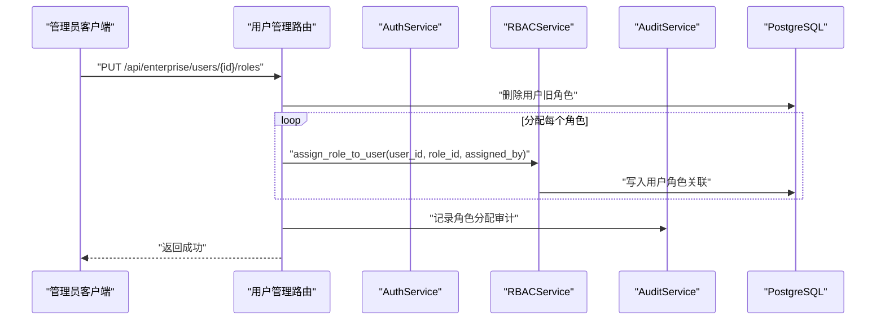
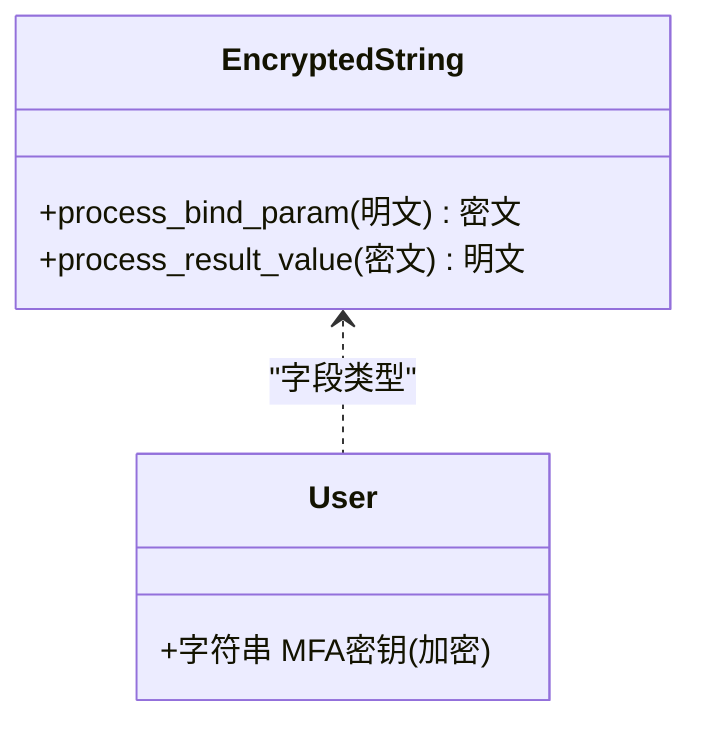
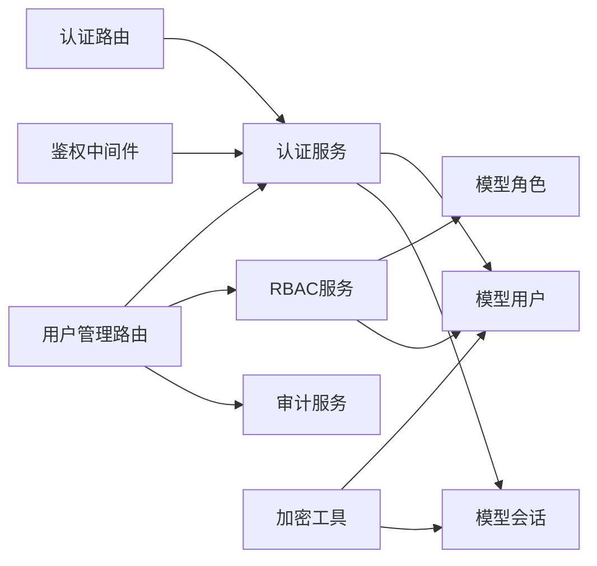

# 用户管理

<cite>
**本文引用的文件**
- [src/copaw/db/models/user.py](file://src/copaw/db/models/user.py)
- [src/copaw/db/models/role.py](file://src/copaw/db/models/role.py)
- [src/copaw/db/models/session.py](file://src/copaw/db/models/session.py)
- [src/copaw/app/routers/users.py](file://src/copaw/app/routers/users.py)
- [src/copaw/app/routers/auth.py](file://src/copaw/app/routers/auth.py)
- [src/copaw/enterprise/auth_service.py](file://src/copaw/enterprise/auth_service.py)
- [src/copaw/enterprise/rbac_service.py](file://src/copaw/enterprise/rbac_service.py)
- [src/copaw/enterprise/crypto.py](file://src/copaw/enterprise/crypto.py)
- [src/copaw/enterprise/middleware.py](file://src/copaw/enterprise/middleware.py)
</cite>

## 目录
1. [简介](#简介)
2. [项目结构](#项目结构)
3. [核心组件](#核心组件)
4. [架构总览](#架构总览)
5. [详细组件分析](#详细组件分析)
6. [依赖分析](#依赖分析)
7. [性能考虑](#性能考虑)
8. [故障排查指南](#故障排查指南)
9. [结论](#结论)
10. [附录](#附录)

## 简介
本文件面向 CoPaw 企业版的用户管理能力，围绕用户注册、登录认证、密码管理、账户状态控制、角色与权限继承、批量导入导出（概念性）、用户生命周期管理、账户锁定/解锁、密码策略配置等企业级需求，提供实现原理、操作流程与最佳实践。内容基于后端服务与数据库模型，辅以可视化图示帮助非技术读者理解。

## 项目结构
与用户管理直接相关的代码主要分布在以下模块：
- 数据模型层：用户、角色、会话、权限等
- 路由层：用户管理 API、认证 API
- 企业服务层：认证服务、RBAC 服务、加密工具、鉴权中间件

图表来源
- [src/copaw/app/routers/users.py:1-258](file://src/copaw/app/routers/users.py#L1-258)
- [src/copaw/app/routers/auth.py:1-204](file://src/copaw/app/routers/auth.py#L1-204)
- [src/copaw/enterprise/auth_service.py:1-367](file://src/copaw/enterprise/auth_service.py#L1-367)
- [src/copaw/enterprise/rbac_service.py:1-262](file://src/copaw/enterprise/rbac_service.py#L1-262)
- [src/copaw/enterprise/middleware.py:1-191](file://src/copaw/enterprise/middleware.py#L1-191)
- [src/copaw/db/models/user.py:1-158](file://src/copaw/db/models/user.py#L1-158)
- [src/copaw/db/models/role.py:1-150](file://src/copaw/db/models/role.py#L1-150)
- [src/copaw/db/models/session.py:1-116](file://src/copaw/db/models/session.py#L1-116)
- [src/copaw/enterprise/crypto.py:1-140](file://src/copaw/enterprise/crypto.py#L1-140)

章节来源
- [src/copaw/app/routers/users.py:1-258](file://src/copaw/app/routers/users.py#L1-258)
- [src/copaw/app/routers/auth.py:1-204](file://src/copaw/app/routers/auth.py#L1-204)
- [src/copaw/enterprise/auth_service.py:1-367](file://src/copaw/enterprise/auth_service.py#L1-367)
- [src/copaw/enterprise/rbac_service.py:1-262](file://src/copaw/enterprise/rbac_service.py#L1-262)
- [src/copaw/enterprise/middleware.py:1-191](file://src/copaw/enterprise/middleware.py#L1-191)
- [src/copaw/db/models/user.py:1-158](file://src/copaw/db/models/user.py#L1-158)
- [src/copaw/db/models/role.py:1-150](file://src/copaw/db/models/role.py#L1-150)
- [src/copaw/db/models/session.py:1-116](file://src/copaw/db/models/session.py#L1-116)
- [src/copaw/enterprise/crypto.py:1-140](file://src/copaw/enterprise/crypto.py#L1-140)

## 核心组件
- 用户模型与用户组
  - 用户实体包含用户名、邮箱、密码哈希与盐、显示名、部门、状态、MFA 开关与密钥、最后登录时间等字段，并维护与角色、会话、用户组的关联关系。
  - 用户组用于按团队/小队/部门进行分组，支持多对多关系及加入时间记录。
- 角色与权限
  - 角色支持最多 5 级的父子继承链，具备层级 level 字段；角色与权限通过关联表建立多对多关系；用户与角色通过关联表建立多对多关系并记录分配者与时间。
- 会话与令牌
  - 登录成功后生成访问令牌与刷新令牌，访问令牌携带 jti 用于会话撤销检查；刷新令牌采用一次性使用且哈希存储；会话记录保存在 PostgreSQL 中并可与 Redis 做镜像（当前实现未直接使用 Redis）。
- 认证服务
  - 提供注册、登录、登出、密码变更、MFA 生成与校验、SSO 场景下的令牌签发等能力；登录时收集用户角色名写入 JWT；支持会话撤销检查。
- RBAC 服务
  - 提供权限检查（含 Redis 缓存）、角色 CRUD、权限分配、用户角色分配/撤销、角色继承展开（最多 5 层）。
- 加密工具
  - 提供字段级 AES-256-GCM 加密类型，用于敏感字段（如 MFA 密钥）的透明加解密。
- 鉴权中间件
  - 对 /api/ 路由进行 JWT 鉴权，注入用户上下文；对响应体进行 DLP 扫描与处理（可选）。

章节来源
- [src/copaw/db/models/user.py:25-158](file://src/copaw/db/models/user.py#L25-158)
- [src/copaw/db/models/role.py:24-150](file://src/copaw/db/models/role.py#L24-150)
- [src/copaw/db/models/session.py:21-116](file://src/copaw/db/models/session.py#L21-116)
- [src/copaw/enterprise/auth_service.py:107-367](file://src/copaw/enterprise/auth_service.py#L107-367)
- [src/copaw/enterprise/rbac_service.py:30-262](file://src/copaw/enterprise/rbac_service.py#L30-262)
- [src/copaw/enterprise/crypto.py:103-140](file://src/copaw/enterprise/crypto.py#L103-140)
- [src/copaw/enterprise/middleware.py:57-191](file://src/copaw/enterprise/middleware.py#L57-191)

## 架构总览
下图展示用户管理的关键交互路径：注册/登录由认证服务处理，用户管理路由调用认证与审计服务，RBAC 服务负责权限判定，会话表支撑令牌撤销与审计。

图表来源
- [src/copaw/app/routers/users.py:107-137](file://src/copaw/app/routers/users.py#L107-137)
- [src/copaw/enterprise/auth_service.py:112-147](file://src/copaw/enterprise/auth_service.py#L112-147)
- [src/copaw/enterprise/rbac_service.py:186-204](file://src/copaw/enterprise/rbac_service.py#L186-204)
- [src/copaw/enterprise/middleware.py:164-177](file://src/copaw/enterprise/middleware.py#L164-177)

## 详细组件分析

### 用户模型与用户组
- 用户实体
  - 关键字段：用户名唯一、邮箱唯一、密码哈希与盐、显示名、部门外键、状态（active/disabled/vacation）、MFA 开关与密钥（加密存储）、最后登录时间。
  - 关系：与部门、角色、会话、用户组成员关联。
- 用户组与成员
  - 用户组支持描述与部门归属；成员表记录用户与组的多对多关系及加入时间。
- 复杂度与性能
  - 查询列表支持按用户名/邮箱模糊搜索、状态过滤、部门过滤、分页；索引覆盖用户名、邮箱、部门与状态字段，有利于筛选与排序。
  - 删除策略：用户删除采用软删除（设置状态为 disabled），避免破坏外键约束。

图表来源
- [src/copaw/db/models/user.py:25-158](file://src/copaw/db/models/user.py#L25-158)
- [src/copaw/db/models/role.py:24-150](file://src/copaw/db/models/role.py#L24-150)

章节来源
- [src/copaw/db/models/user.py:25-158](file://src/copaw/db/models/user.py#L25-158)

### 角色与权限继承
- 角色模型
  - 支持最多 5 级父子继承（通过 parent_role_id 与 level 字段），便于构建组织化的角色树。
  - 角色与权限通过 RolePermission 关联，用户与角色通过 UserRole 关联并记录分配者与时间。
- 权限检查算法
  - 先收集用户直接角色，再向上展开最多 5 层父角色，合并去重后查询对应权限集合，最终匹配 resource:action 或通配符。
- 性能优化
  - 权限结果可缓存于 Redis（键格式见源码注释），减少重复查询；当角色或权限变更时，自动清理相关缓存键。

图表来源
- [src/copaw/enterprise/rbac_service.py:66-124](file://src/copaw/enterprise/rbac_service.py#L66-124)

章节来源
- [src/copaw/db/models/role.py:24-150](file://src/copaw/db/models/role.py#L24-150)
- [src/copaw/enterprise/rbac_service.py:30-262](file://src/copaw/enterprise/rbac_service.py#L30-262)

### 登录认证与会话管理
- 注册
  - 校验用户名与邮箱唯一性，生成密码哈希与盐，创建用户记录。
- 登录
  - 校验凭据与账户状态，更新最后登录时间，创建会话记录（含 jti、过期时间），生成访问令牌与刷新令牌（刷新令牌哈希存储）。
- 令牌验证与撤销
  - 中间件仅做签名与过期校验；具体撤销检查由路由层调用认证服务进行会话表校验。
- 登出
  - 按 jti 标记会话为已撤销，达到登出效果。
- 密码变更
  - 校验当前密码，生成新哈希与盐，更新用户记录，并撤销该用户的全部活跃会话。
- MFA
  - 生成随机密钥与二维码 URI；登录时可要求二次校验。

图表来源
- [src/copaw/app/routers/auth.py:43-85](file://src/copaw/app/routers/auth.py#L43-85)
- [src/copaw/enterprise/auth_service.py:151-230](file://src/copaw/enterprise/auth_service.py#L151-230)
- [src/copaw/db/models/session.py:21-71](file://src/copaw/db/models/session.py#L21-71)

章节来源
- [src/copaw/app/routers/auth.py:1-204](file://src/copaw/app/routers/auth.py#L1-204)
- [src/copaw/enterprise/auth_service.py:107-367](file://src/copaw/enterprise/auth_service.py#L107-367)
- [src/copaw/db/models/session.py:21-116](file://src/copaw/db/models/session.py#L21-116)

### 用户管理 API 流程
- 列表查询
  - 支持按关键字、状态、部门过滤，分页返回用户基础信息。
- 创建用户
  - 调用认证服务注册，支持指定部门与初始状态；记录审计日志。
- 更新用户
  - 可修改邮箱、显示名、部门与状态；记录审计日志。
- 删除用户
  - 将状态置为 disabled（软删除）；记录审计日志。
- 角色管理
  - 获取用户角色列表；先清空旧角色，再批量分配新角色；记录审计日志。

图表来源
- [src/copaw/app/routers/users.py:226-257](file://src/copaw/app/routers/users.py#L226-257)
- [src/copaw/enterprise/rbac_service.py:186-204](file://src/copaw/enterprise/rbac_service.py#L186-204)

章节来源
- [src/copaw/app/routers/users.py:68-258](file://src/copaw/app/routers/users.py#L68-258)
- [src/copaw/enterprise/rbac_service.py:186-204](file://src/copaw/enterprise/rbac_service.py#L186-204)

### 字段级加密与安全
- 加密类型
  - 使用 AES-256-GCM 对敏感字段进行透明加解密；密钥从环境变量加载，开发模式有降级回退。
- 应用场景
  - MFA 密钥等敏感字段采用加密列类型存储，读取时自动解密，失败时保留明文回退。
- 最佳实践
  - 生产环境务必设置 COPAW_FIELD_ENCRYPT_KEY；定期轮换密钥并迁移存量数据。

图表来源
- [src/copaw/enterprise/crypto.py:103-140](file://src/copaw/enterprise/crypto.py#L103-140)
- [src/copaw/db/models/user.py:68-71](file://src/copaw/db/models/user.py#L68-71)

章节来源
- [src/copaw/enterprise/crypto.py:1-140](file://src/copaw/enterprise/crypto.py#L1-140)
- [src/copaw/db/models/user.py:15-71](file://src/copaw/db/models/user.py#L15-71)

### 鉴权中间件与审计
- 中间件职责
  - 识别 /api/ 路由，跳过公开路径与预检请求；从 Authorization 头或查询参数提取 Bearer 令牌；验证签名与过期；注入用户上下文到请求状态。
- 审计集成
  - 路由层在关键操作（创建用户、更新用户、禁用用户、分配角色）后记录审计事件，包含资源类型、前后数据、操作者等。
- DLP 扫描
  - 中间件对受保护的 JSON 响应进行内容扫描，发现违规可屏蔽或阻断。

章节来源
- [src/copaw/enterprise/middleware.py:57-191](file://src/copaw/enterprise/middleware.py#L57-191)
- [src/copaw/app/routers/users.py:125-133](file://src/copaw/app/routers/users.py#L125-133)
- [src/copaw/app/routers/users.py:178-187](file://src/copaw/app/routers/users.py#L178-187)
- [src/copaw/app/routers/users.py:202-209](file://src/copaw/app/routers/users.py#L202-209)
- [src/copaw/app/routers/users.py:248-256](file://src/copaw/app/routers/users.py#L248-256)

## 依赖分析
- 路由依赖
  - 用户管理路由依赖认证服务（注册、密码变更）、RBAC 服务（角色分配）、审计服务（审计日志）。
  - 认证路由依赖认证服务与数据库状态检查。
- 服务依赖
  - 认证服务依赖用户与会话模型；RBAC 服务依赖角色、权限与用户模型；加密工具被用户与会话模型使用。
- 中间件依赖
  - 中间件依赖认证服务进行令牌解码与用户上下文注入。

图表来源
- [src/copaw/app/routers/users.py:17-27](file://src/copaw/app/routers/users.py#L17-27)
- [src/copaw/app/routers/auth.py:10-17](file://src/copaw/app/routers/auth.py#L10-17)
- [src/copaw/enterprise/auth_service.py:23-27](file://src/copaw/enterprise/auth_service.py#L23-27)
- [src/copaw/enterprise/rbac_service.py:18-23](file://src/copaw/enterprise/rbac_service.py#L18-23)
- [src/copaw/enterprise/middleware.py:22-24](file://src/copaw/enterprise/middleware.py#L22-24)
- [src/copaw/db/models/user.py:17-87](file://src/copaw/db/models/user.py#L17-87)
- [src/copaw/db/models/session.py:15-70](file://src/copaw/db/models/session.py#L15-70)
- [src/copaw/db/models/role.py:16-74](file://src/copaw/db/models/role.py#L16-74)
- [src/copaw/enterprise/crypto.py:20-21](file://src/copaw/enterprise/crypto.py#L20-21)

章节来源
- [src/copaw/app/routers/users.py:17-27](file://src/copaw/app/routers/users.py#L17-27)
- [src/copaw/app/routers/auth.py:10-17](file://src/copaw/app/routers/auth.py#L10-17)
- [src/copaw/enterprise/auth_service.py:23-27](file://src/copaw/enterprise/auth_service.py#L23-27)
- [src/copaw/enterprise/rbac_service.py:18-23](file://src/copaw/enterprise/rbac_service.py#L18-23)
- [src/copaw/enterprise/middleware.py:22-24](file://src/copaw/enterprise/middleware.py#L22-24)
- [src/copaw/db/models/user.py:17-90](file://src/copaw/db/models/user.py#L17-90)
- [src/copaw/db/models/session.py:15-70](file://src/copaw/db/models/session.py#L15-70)
- [src/copaw/db/models/role.py:16-74](file://src/copaw/db/models/role.py#L16-74)
- [src/copaw/enterprise/crypto.py:20-21](file://src/copaw/enterprise/crypto.py#L20-21)

## 性能考虑
- 查询与索引
  - 用户列表查询使用多条件过滤与分页，建议在用户名、邮箱、部门、状态字段上保持索引以提升筛选效率。
- 缓存
  - RBAC 权限检查支持 Redis 缓存，建议开启并合理设置 TTL，降低频繁权限判断的数据库压力。
- 令牌与会话
  - 访问令牌 jti 用于快速撤销检查；刷新令牌一次性使用并哈希存储，避免泄露风险。
- 密码策略
  - 当前实现使用 bcrypt，默认迭代次数适中；建议结合企业策略调整迭代次数与最小长度要求（可通过扩展认证服务实现）。

## 故障排查指南
- 登录失败
  - 检查用户名是否存在、密码是否正确、账户状态是否为 active；确认 JWT 密钥与过期时间配置正确。
- 无法访问受保护接口
  - 确认请求头包含有效的 Bearer 令牌；检查中间件是否正确注入用户上下文；查看审计日志定位问题。
- 角色权限不生效
  - 确认用户角色分配成功；检查角色继承链是否超过 5 层；清理 Redis 缓存键后重试。
- MFA 登录异常
  - 校验 MFA 密钥是否正确生成与绑定；确认时间同步与验证码有效期窗口。
- 密码变更后仍提示旧密码
  - 确认密码变更成功并撤销了旧会话；检查数据库中用户密码哈希是否更新。

章节来源
- [src/copaw/enterprise/auth_service.py:151-230](file://src/copaw/enterprise/auth_service.py#L151-230)
- [src/copaw/enterprise/rbac_service.py:35-64](file://src/copaw/enterprise/rbac_service.py#L35-64)
- [src/copaw/enterprise/middleware.py:146-177](file://src/copaw/enterprise/middleware.py#L146-177)

## 结论
CoPaw 企业版的用户管理以清晰的数据模型与服务层设计为基础，实现了从用户注册、登录认证、密码与 MFA 管理，到角色权限继承、会话撤销与审计追踪的完整闭环。通过合理的索引、缓存与加密策略，可在保证安全的前提下满足企业级大规模并发与合规要求。建议结合组织实际，完善密码策略、审计范围与 DLP 策略，持续优化用户体验与运维效率。

## 附录
- 概念性：批量用户导入导出
  - 可通过用户管理 API 的批量创建与列表查询组合实现；导入时建议先校验用户名/邮箱唯一性，再批量创建并记录审计；导出时按需筛选字段并分页拉取。
- 账户锁定/解锁
  - 当前实现采用软删除（设置状态为 disabled）；若需更细粒度的锁定机制，可在状态枚举中新增 locked 并在登录校验中拦截。
- 密码策略配置
  - 可在认证服务中扩展密码强度校验（长度、复杂度、历史密码禁止等），并在注册/变更流程中统一执行。