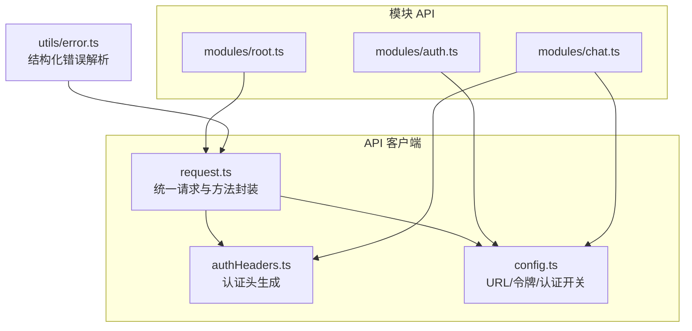
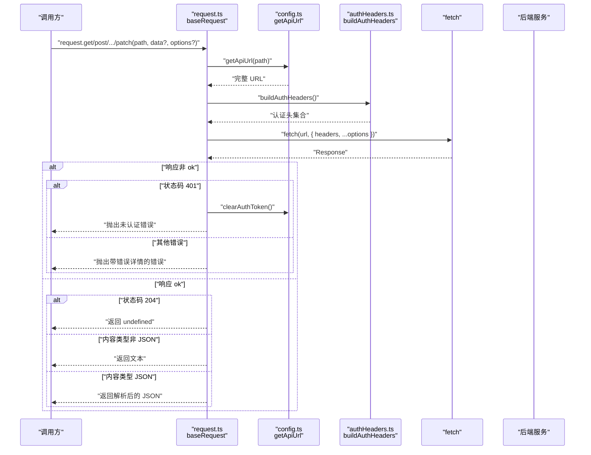
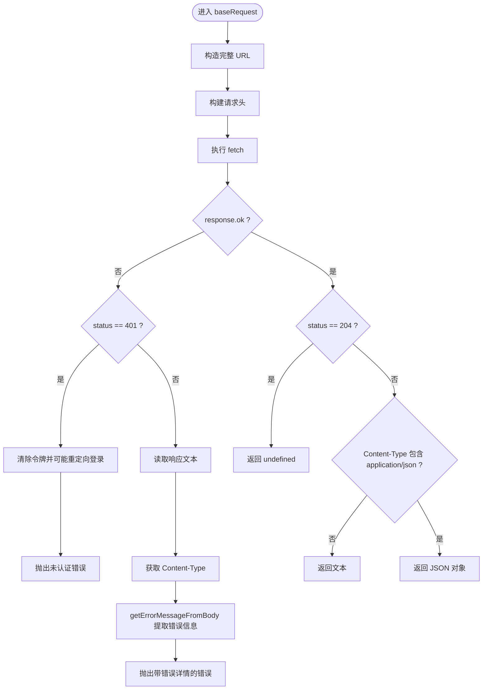
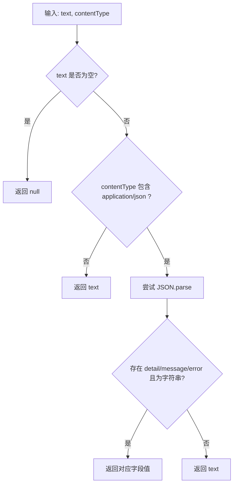
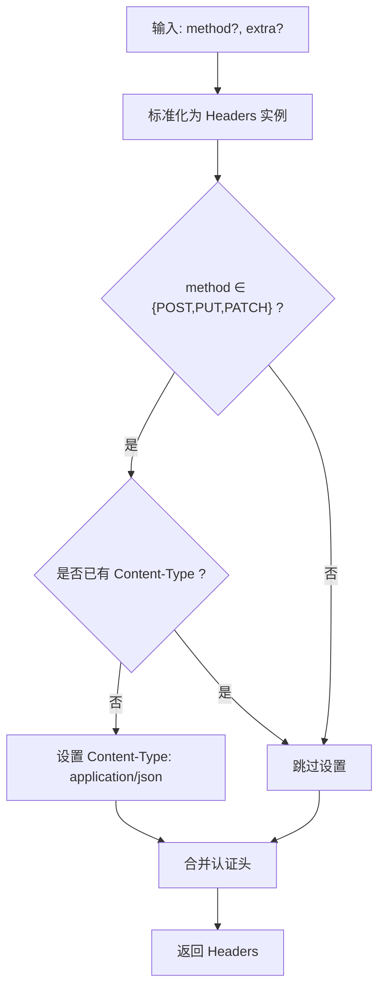
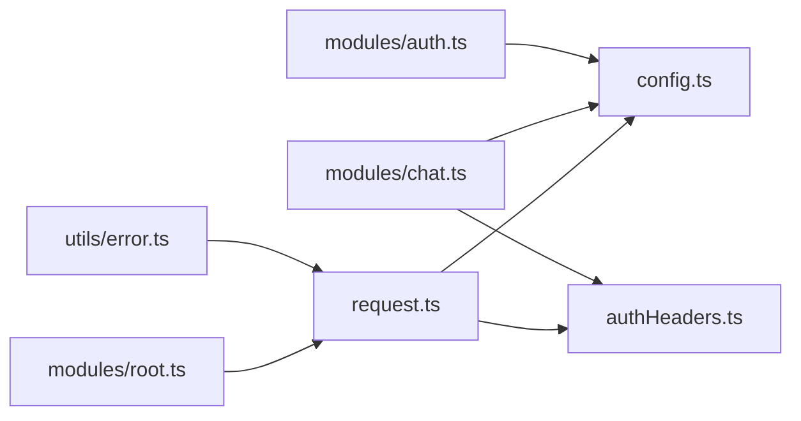

# API 客户端核心

<cite>
**本文引用的文件**
- [request.ts](file://console/src/api/request.ts)
- [authHeaders.ts](file://console/src/api/authHeaders.ts)
- [config.ts](file://console/src/api/config.ts)
- [index.ts](file://console/src/api/index.ts)
- [root.ts](file://console/src/api/modules/root.ts)
- [auth.ts](file://console/src/api/modules/auth.ts)
- [chat.ts](file://console/src/api/modules/chat.ts)
- [error.ts](file://console/src/utils/error.ts)
</cite>

## 目录
1. [简介](#简介)
2. [项目结构](#项目结构)
3. [核心组件](#核心组件)
4. [架构总览](#架构总览)
5. [详细组件分析](#详细组件分析)
6. [依赖关系分析](#依赖关系分析)
7. [性能考量](#性能考量)
8. [故障排查指南](#故障排查指南)
9. [结论](#结论)
10. [附录：使用示例与最佳实践](#附录使用示例与最佳实践)

## 简介
本文件系统性梳理 CoPaw 前端控制台的 API 客户端核心，聚焦于基于原生 fetch 的统一请求实现。重点覆盖以下方面：
- 请求构建：URL 规范化、请求头组装（含认证头与内容类型）
- 响应处理：状态码判断、204 特殊处理、JSON 与非 JSON 内容类型分支
- 错误管理：401 认证处理、错误消息提取策略、结构化错误解析
- 统一入口：request 对象的多方法封装与模块化导出

## 项目结构
控制台前端的 API 客户端位于 console/src/api 目录，采用“核心请求 + 模块化 API”的分层设计：
- 核心层：request.ts 提供统一的 baseRequest 与派生方法；authHeaders.ts 负责认证头生成；config.ts 提供 URL 与令牌管理。
- 模块层：各业务域在 modules 下以独立文件组织，通过 request 封装具体接口。
- 工具层：utils/error.ts 提供结构化错误解析辅助。

图表来源
- [request.ts:1-136](file://console/src/api/request.ts#L1-L136)
- [authHeaders.ts:1-24](file://console/src/api/authHeaders.ts#L1-L24)
- [config.ts:1-68](file://console/src/api/config.ts#L1-L68)
- [root.ts:1-8](file://console/src/api/modules/root.ts#L1-L8)
- [auth.ts:1-76](file://console/src/api/modules/auth.ts#L1-L76)
- [chat.ts:1-137](file://console/src/api/modules/chat.ts#L1-L137)
- [error.ts:1-11](file://console/src/utils/error.ts#L1-L11)

章节来源
- [index.ts:1-85](file://console/src/api/index.ts#L1-L85)
- [request.ts:1-136](file://console/src/api/request.ts#L1-L136)
- [authHeaders.ts:1-24](file://console/src/api/authHeaders.ts#L1-L24)
- [config.ts:1-68](file://console/src/api/config.ts#L1-L68)
- [root.ts:1-8](file://console/src/api/modules/root.ts#L1-L8)
- [auth.ts:1-76](file://console/src/api/modules/auth.ts#L1-L76)
- [chat.ts:1-137](file://console/src/api/modules/chat.ts#L1-L137)
- [error.ts:1-11](file://console/src/utils/error.ts#L1-L11)

## 核心组件
- 统一请求函数 baseRequest：负责 URL 构造、请求头组装、fetch 调用、响应状态与内容类型处理、错误抛出。
- 头部构建函数 buildHeaders：根据 HTTP 方法自动设置 Content-Type，并注入认证头与代理头。
- 错误消息提取函数 getErrorMessageFromBody：从响应体中提取可读错误信息，优先尝试 JSON 字段，回退到原始文本。
- request 对象：对 baseRequest 的方法化封装，提供 get/post/put/delete/patch。
- 认证头生成 buildAuthHeaders：注入 Bearer 令牌与代理代理头。
- 配置工具 getApiUrl/getApiToken/setAuthToken/clearAuthToken/isAuthDisabled：集中管理 API 基址、令牌与认证开关。

章节来源
- [request.ts:4-136](file://console/src/api/request.ts#L4-L136)
- [authHeaders.ts:1-24](file://console/src/api/authHeaders.ts#L1-L24)
- [config.ts:1-68](file://console/src/api/config.ts#L1-L68)

## 架构总览
下图展示从调用方到后端服务的整体交互路径，以及关键决策点（401、内容类型、204）：

图表来源
- [request.ts:60-106](file://console/src/api/request.ts#L60-L106)
- [authHeaders.ts:4-23](file://console/src/api/authHeaders.ts#L4-L23)
- [config.ts:32-42](file://console/src/api/config.ts#L32-L42)

## 详细组件分析

### 组件一：统一请求与错误处理（baseRequest）
- URL 构建：通过 getApiUrl(path) 规范化路径，确保 /api 前缀不重复。
- 请求头：buildHeaders 自动为包含请求体的方法设置 Content-Type，并注入认证头与代理头。
- 响应处理：
  - 401：清理本地令牌，若认证未禁用且当前不在登录页，则跳转至 /login；随后抛出未认证错误。
  - 其他错误：读取响应体文本，结合 Content-Type 使用 getErrorMessageFromBody 提取可读错误；最终抛出包含原始响应信息的错误。
  - 204：直接返回 undefined。
  - 非 JSON：返回文本。
  - JSON：返回解析后的对象。

图表来源
- [request.ts:60-106](file://console/src/api/request.ts#L60-L106)

章节来源
- [request.ts:60-106](file://console/src/api/request.ts#L60-L106)

### 组件二：错误消息提取（getErrorMessageFromBody）
- 输入：响应文本与 Content-Type。
- 规则：
  - 若文本为空，返回 null。
  - 若 Content-Type 不包含 application/json，直接返回原始文本。
  - 尝试解析为 JSON，优先返回 detail/message/error 中的字符串字段；若解析失败或无有效字段，回退为原始文本。
- 输出：可读错误字符串或 null。

图表来源
- [request.ts:4-37](file://console/src/api/request.ts#L4-L37)

章节来源
- [request.ts:4-37](file://console/src/api/request.ts#L4-L37)

### 组件三：请求头构建（buildHeaders）
- 归一化：将额外头参数标准化为 Headers 实例，便于统一处理。
- Content-Type：仅当方法为 POST/PUT/PATCH 时，且未显式设置时，自动添加 application/json。
- 认证头：合并 buildAuthHeaders 返回的认证头（如 Bearer 令牌），避免覆盖已存在的同名头。
- 输出：最终 Headers 实例。

图表来源
- [request.ts:39-58](file://console/src/api/request.ts#L39-L58)
- [authHeaders.ts:4-23](file://console/src/api/authHeaders.ts#L4-L23)

章节来源
- [request.ts:39-58](file://console/src/api/request.ts#L39-L58)
- [authHeaders.ts:1-24](file://console/src/api/authHeaders.ts#L1-L24)

### 组件四：认证头生成（buildAuthHeaders）
- 令牌：从会话存储中读取选中的代理标识，注入 X-Agent-Id 请求头。
- 异常：解析失败时记录警告并继续。
- 输出：认证头键值对（通常包含 Authorization 与 X-Agent-Id）。

章节来源
- [authHeaders.ts:1-24](file://console/src/api/authHeaders.ts#L1-L24)

### 组件五：配置与认证开关（config.ts）
- URL 规划：getApiUrl 自动拼接基址与 /api 前缀，避免重复。
- 令牌管理：getApiToken 优先从本地存储读取，其次回退到构建时常量；setAuthToken/clearAuthToken 用于登录与登出。
- 认证开关：setAuthDisabled/isAuthDisabled 用于在认证关闭场景下避免 401 导致的循环重定向。

章节来源
- [config.ts:1-68](file://console/src/api/config.ts#L1-L68)

### 组件六：模块化 API 使用示例
- 根 API：通过 request 封装的根接口访问版本信息。
- 聊天上传：使用 buildAuthHeaders 直接上传文件，内部处理错误。
- 认证接口：直接使用 fetch 并在错误时解析 JSON 错误详情。

章节来源
- [root.ts:1-8](file://console/src/api/modules/root.ts#L1-L8)
- [chat.ts:21-40](file://console/src/api/modules/chat.ts#L21-L40)
- [auth.ts:15-49](file://console/src/api/modules/auth.ts#L15-L49)

## 依赖关系分析
- request.ts 依赖：
  - config.ts：URL 构建、令牌与认证开关
  - authHeaders.ts：认证头生成
- 模块 API 依赖：
  - request.ts：统一请求封装
  - config.ts：URL 构建
  - authHeaders.ts：部分上传接口需要认证头
- 错误解析工具：
  - utils/error.ts：从 baseRequest 抛出的错误中提取结构化 detail

图表来源
- [request.ts:1-2](file://console/src/api/request.ts#L1-L2)
- [root.ts](file://console/src/api/modules/root.ts#L1)
- [chat.ts:1-3](file://console/src/api/modules/chat.ts#L1-L3)
- [auth.ts](file://console/src/api/modules/auth.ts#L1)
- [error.ts](file://console/src/utils/error.ts#L1)

章节来源
- [index.ts:1-85](file://console/src/api/index.ts#L1-L85)
- [request.ts:1-2](file://console/src/api/request.ts#L1-L2)
- [chat.ts:1-3](file://console/src/api/modules/chat.ts#L1-L3)
- [auth.ts](file://console/src/api/modules/auth.ts#L1)
- [error.ts:1-11](file://console/src/utils/error.ts#L1-L11)

## 性能考量
- fetch 直连：减少中间层开销，适合轻量级客户端。
- 文本/JSON 分支：按 Content-Type 判断，避免不必要的解析。
- 204 特判：明确空响应，减少后续处理成本。
- 头部复用：buildHeaders 合并认证头，避免重复设置。
- 错误早返回：非 ok 即刻抛错，避免多余 IO。

## 故障排查指南
- 401 未认证
  - 现象：抛出未认证错误，必要时触发登录页跳转。
  - 排查要点：确认令牌是否存在与有效；检查 isAuthDisabled 是否被错误设置；确认当前页面是否为 /login。
  - 参考实现位置：[request.ts:73-82](file://console/src/api/request.ts#L73-L82)
- 错误消息不清晰
  - 现象：错误信息仅包含状态码与文本。
  - 排查要点：确认后端返回 JSON 且包含 detail/message/error；检查 Content-Type 是否为 application/json；使用 parseErrorDetail 辅助提取结构化字段。
  - 参考实现位置：[request.ts:84-93](file://console/src/api/request.ts#L84-L93)，[error.ts:1-11](file://console/src/utils/error.ts#L1-L11)
- Content-Type 问题
  - 现象：非 JSON 响应被当作文本处理，或 JSON 响应被当作文本。
  - 排查要点：确保后端正确设置 Content-Type；前端按方法自动设置 Content-Type 的逻辑符合预期。
  - 参考实现位置：[request.ts:43-49](file://console/src/api/request.ts#L43-L49)，[request.ts:100-105](file://console/src/api/request.ts#L100-L105)
- 上传失败
  - 现象：上传接口报错但信息不完整。
  - 排查要点：确认使用 buildAuthHeaders 注入认证头；检查响应文本是否包含可读错误。
  - 参考实现位置：[chat.ts:23-39](file://console/src/api/modules/chat.ts#L23-L39)

章节来源
- [request.ts:73-93](file://console/src/api/request.ts#L73-L93)
- [error.ts:1-11](file://console/src/utils/error.ts#L1-L11)
- [chat.ts:23-39](file://console/src/api/modules/chat.ts#L23-L39)

## 结论
该 API 客户端以简洁的统一入口为核心，通过明确的请求头构建、严格的错误处理与灵活的内容类型分支，实现了稳定可靠的前后端通信。配合模块化的 API 文件与工具函数，开发者可以快速扩展新接口并保持一致的错误体验与调试能力。

## 附录：使用示例与最佳实践
- 使用 request 对象发起请求
  - GET：参考 [root.ts:5-6](file://console/src/api/modules/root.ts#L5-L6)
  - POST：参考 [agent.ts:10-14](file://console/src/api/modules/agent.ts#L10-L14)
  - PUT/DELETE/PATCH：参考 [agent.ts:31-35](file://console/src/api/modules/agent.ts#L31-L35)
- 上传文件（需认证头）
  - 参考 [chat.ts:23-39](file://console/src/api/modules/chat.ts#L23-L39)
- 登录/注册/状态检查
  - 参考 [auth.ts:15-49](file://console/src/api/modules/auth.ts#L15-L49)
- 解析结构化错误
  - 参考 [error.ts:1-11](file://console/src/utils/error.ts#L1-L11)
- 最佳实践
  - 显式传入 data 时，确保遵循 Content-Type 与 JSON 序列化约定。
  - 在认证关闭场景下，合理使用 isAuthDisabled 避免重定向循环。
  - 对非 JSON 响应（如下载流）做好类型断言与异常处理。
  - 上传大文件时，避免在请求体中携带不必要的 JSON 数据，优先使用 multipart/form-data（当前上传接口已使用 FormData）。