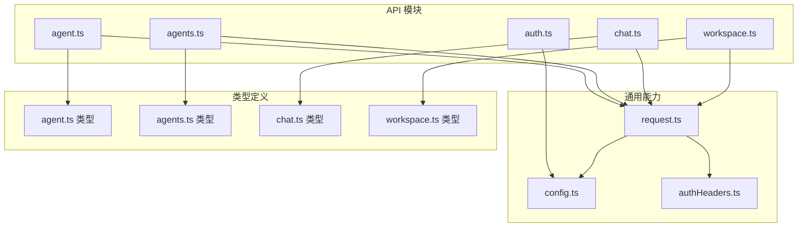
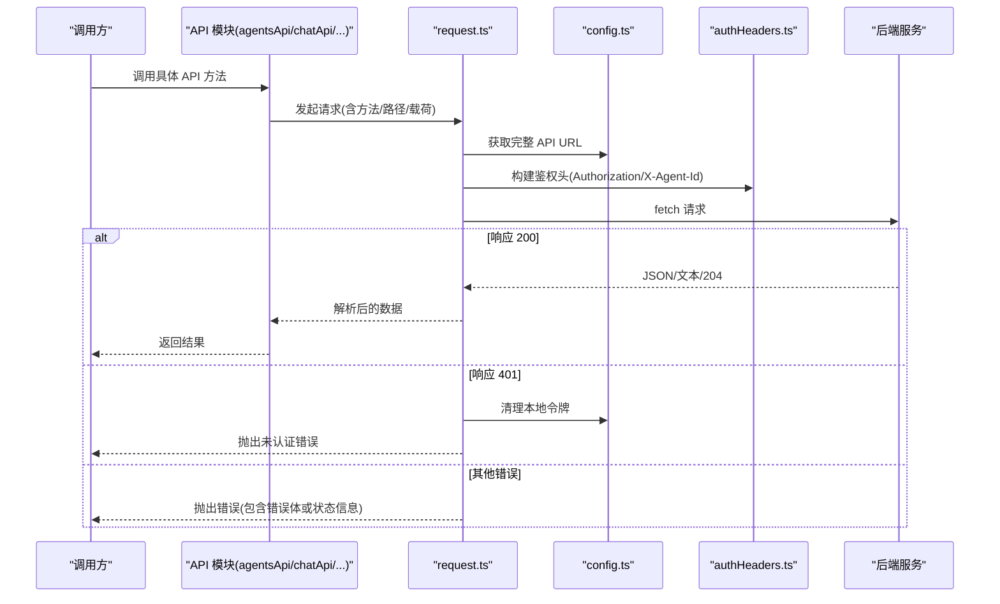
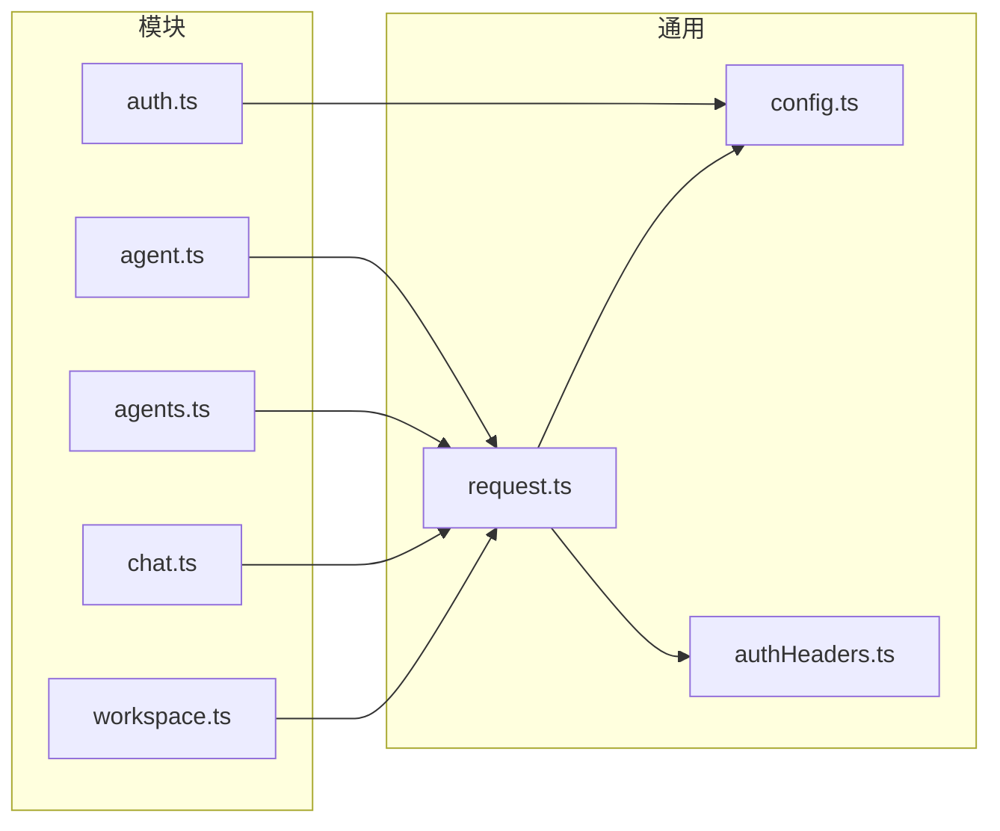

# API 模块化接口

<cite>
**本文引用的文件**
- [agent.ts](file://console/src/api/modules/agent.ts)
- [agents.ts](file://console/src/api/modules/agents.ts)
- [auth.ts](file://console/src/api/modules/auth.ts)
- [chat.ts](file://console/src/api/modules/chat.ts)
- [workspace.ts](file://console/src/api/modules/workspace.ts)
- [request.ts](file://console/src/api/request.ts)
- [config.ts](file://console/src/api/config.ts)
- [authHeaders.ts](file://console/src/api/authHeaders.ts)
- [agent 类型定义](file://console/src/api/types/agent.ts)
- [agents 类型定义](file://console/src/api/types/agents.ts)
- [chat 类型定义](file://console/src/api/types/chat.ts)
- [workspace 类型定义](file://console/src/api/types/workspace.ts)
</cite>

## 目录
1. [简介](#简介)
2. [项目结构](#项目结构)
3. [核心组件](#核心组件)
4. [架构总览](#架构总览)
5. [详细组件分析](#详细组件分析)
6. [依赖关系分析](#依赖关系分析)
7. [性能与可靠性](#性能与可靠性)
8. [故障排查指南](#故障排查指南)
9. [结论](#结论)
10. [附录：调用示例与参数说明](#附录调用示例与参数说明)

## 简介
本文件面向前端开发者，系统性梳理 CoPaw 控制台的 API 模块化接口，覆盖代理管理（agent.ts）、多代理管理（agents.ts）、认证授权（auth.ts）、聊天交互（chat.ts）、工作空间（workspace.ts）五大模块。文档从职责边界、接口定义、参数与返回值、错误处理到调用流程进行分层讲解，并提供可视化图示与实用的排障建议。

## 项目结构
前端 API 层采用“模块化 + 统一封装”的组织方式：
- 每个业务域一个模块文件，统一导出命名空间对象（如 agentsApi、chatApi 等）
- 通过通用请求封装 request.ts 封装 fetch，内置鉴权头、路径拼接、错误解析与 401 自动登出逻辑
- 类型定义集中于 types 目录，确保前后端契约一致

图表来源
- [agent.ts:1-86](file://console/src/api/modules/agent.ts#L1-L86)
- [agents.ts:1-79](file://console/src/api/modules/agents.ts#L1-L79)
- [auth.ts:1-76](file://console/src/api/modules/auth.ts#L1-L76)
- [chat.ts:1-137](file://console/src/api/modules/chat.ts#L1-L137)
- [workspace.ts:1-149](file://console/src/api/modules/workspace.ts#L1-L149)
- [request.ts:1-136](file://console/src/api/request.ts#L1-L136)
- [config.ts:1-68](file://console/src/api/config.ts#L1-L68)
- [authHeaders.ts:1-24](file://console/src/api/authHeaders.ts#L1-L24)
- [agent 类型定义:1-67](file://console/src/api/types/agent.ts#L1-L67)
- [agents 类型定义:1-47](file://console/src/api/types/agents.ts#L1-L47)
- [chat 类型定义:1-39](file://console/src/api/types/chat.ts#L1-L39)
- [workspace 类型定义:1-22](file://console/src/api/types/workspace.ts#L1-L22)

章节来源
- [agent.ts:1-86](file://console/src/api/modules/agent.ts#L1-L86)
- [agents.ts:1-79](file://console/src/api/modules/agents.ts#L1-L79)
- [auth.ts:1-76](file://console/src/api/modules/auth.ts#L1-L76)
- [chat.ts:1-137](file://console/src/api/modules/chat.ts#L1-L137)
- [workspace.ts:1-149](file://console/src/api/modules/workspace.ts#L1-L149)
- [request.ts:1-136](file://console/src/api/request.ts#L1-L136)
- [config.ts:1-68](file://console/src/api/config.ts#L1-L68)
- [authHeaders.ts:1-24](file://console/src/api/authHeaders.ts#L1-L24)
- [agent 类型定义:1-67](file://console/src/api/types/agent.ts#L1-L67)
- [agents 类型定义:1-47](file://console/src/api/types/agents.ts#L1-L47)
- [chat 类型定义:1-39](file://console/src/api/types/chat.ts#L1-L39)
- [workspace 类型定义:1-22](file://console/src/api/types/workspace.ts#L1-L22)

## 核心组件
- 通用请求封装 request.ts：统一封装 fetch，自动注入鉴权头、处理 204/非 JSON 响应、解析错误体、401 清理令牌并跳转登录
- 配置与鉴权 config.ts、authHeaders.ts：负责 API 基址拼接、令牌读取/存储/清理、构建 Authorization/X-Agent-Id 头
- 业务模块：agent.ts、agents.ts、auth.ts、chat.ts、workspace.ts 提供各自领域 API

章节来源
- [request.ts:1-136](file://console/src/api/request.ts#L1-L136)
- [config.ts:1-68](file://console/src/api/config.ts#L1-L68)
- [authHeaders.ts:1-24](file://console/src/api/authHeaders.ts#L1-L24)

## 架构总览
下图展示从前端模块到后端接口的整体调用链路与错误处理策略：

图表来源
- [request.ts:60-106](file://console/src/api/request.ts#L60-L106)
- [config.ts:32-53](file://console/src/api/config.ts#L32-L53)
- [authHeaders.ts:4-23](file://console/src/api/authHeaders.ts#L4-L23)

## 详细组件分析

### 代理管理（agent.ts）
职责
- 单代理运行态管理：健康检查、进程控制、运行配置、语言与音频模式设置、语音识别提供方与类型配置、本地 Whisper 状态查询

关键接口与要点
- 进程与健康
  - GET /agent/、GET /agent/health
  - POST /agent/process（传入 AgentRequest）
  - POST /agent/shutdown、POST /agent/admin/shutdown
- 运行配置
  - GET /agent/running-config
  - PUT /agent/running-config（载荷：AgentsRunningConfig）
- 语言与音频
  - GET/PUT /agent/language（载荷：{ language }）
  - GET/PUT /agent/audio-mode（载荷：{ audio_mode }）
- 语音识别
  - GET /agent/transcription-providers
  - PUT /agent/transcription-provider（载荷：{ provider_id }）
  - GET/PUT /agent/transcription-provider-type（载荷：{ transcription_provider_type }）
- 本地 Whisper
  - GET /agent/local-whisper-status（返回可用性与依赖安装状态）

类型与复杂度
- AgentRequest：输入为任意结构，支持会话/用户/通道上下文
- AgentsRunningConfig：包含 LLM 重试、并发、速率限制、上下文压缩、工具结果压缩、记忆摘要、嵌入配置等，整体为聚合配置对象，序列化/反序列化 O(n)（n 为字段数）

错误处理
- 由 request.ts 统一处理 401 清理令牌并跳转登录；其他错误提取错误体或状态文本抛出

章节来源
- [agent.ts:1-86](file://console/src/api/modules/agent.ts#L1-L86)
- [agent 类型定义:1-67](file://console/src/api/types/agent.ts#L1-L67)
- [request.ts:74-94](file://console/src/api/request.ts#L74-L94)

### 多代理管理（agents.ts）
职责
- 代理生命周期与排序：列表、详情、创建、更新、删除、重排、启用/禁用切换
- 代理工作区文件：列出、读取、写入、内存文件列表

关键接口与要点
- 列表/详情/创建/更新/删除
  - GET /agents
  - GET /agents/{id}
  - POST /agents（载荷：CreateAgentRequest）
  - PUT /agents/{id}（载荷：AgentProfileConfig）
  - DELETE /agents/{id}
- 重排与启停
  - PUT /agents/order（载荷：{ agent_ids: string[] }）
  - PATCH /agents/{id}/toggle（载荷：{ enabled: boolean }）
- 文件与内存
  - GET /agents/{id}/files → MdFileInfo[]
  - GET /agents/{id}/files/{filename} → MdFileContent
  - PUT /agents/{id}/files/{filename}（载荷：{ content }）
  - GET /agents/{id}/memory → MdFileInfo[]

类型与复杂度
- AgentProfileConfig：包含多段配置对象字段，序列化/反序列化 O(n)
- CreateAgentRequest：轻量创建载荷，O(1)

错误处理
- 401 清理令牌并跳转登录；其他错误提取错误体或状态文本

章节来源
- [agents.ts:1-79](file://console/src/api/modules/agents.ts#L1-L79)
- [agents 类型定义:1-47](file://console/src/api/types/agents.ts#L1-L47)
- [workspace 类型定义:1-22](file://console/src/api/types/workspace.ts#L1-L22)
- [request.ts:74-94](file://console/src/api/request.ts#L74-L94)

### 认证授权（auth.ts）
职责
- 登录/注册/状态查询/更新个人资料
- 依赖 config.ts 的令牌持久化与鉴权头构造

关键接口与要点
- 登录/注册
  - POST /auth/login → LoginResponse（包含 token、username、可选 message）
  - POST /auth/register → LoginResponse
- 状态查询
  - GET /auth/status → AuthStatusResponse（是否启用、是否存在用户、是否企业版）
- 更新个人资料
  - POST /auth/update-profile（载荷：current_password、new_username、new_password，需携带 Bearer 令牌）

错误处理
- 非 2xx 响应时尝试解析错误体 detail/message 并抛出；401 由上层 request.ts 处理

章节来源
- [auth.ts:1-76](file://console/src/api/modules/auth.ts#L1-L76)
- [config.ts:49-67](file://console/src/api/config.ts#L49-L67)
- [request.ts:74-94](file://console/src/api/request.ts#L74-L94)

### 聊天交互（chat.ts）
职责
- 聊天与会话管理：上传附件、预览文件、列出/创建/更新/删除聊天与会话、批量删除、停止某次聊天
- 会话与聊天在类型层面等价（Session = ChatSpec），便于复用

关键接口与要点
- 上传与预览
  - POST /console/upload → ChatUploadResponse（返回 url/file_name/stored_name）
  - filePreviewUrl(filename)：生成带 token 的预览 URL
- 聊天管理
  - GET /chats?user_id&channel → ChatSpec[]
  - POST /chats → ChatSpec
  - GET /chats/{id} → ChatHistory
  - PUT /chats/{id} → ChatSpec
  - DELETE /chats/{id} → ChatDeleteResponse
  - POST /chats/batch-delete → { success, deleted_count }
  - POST /console/chat/stop?chat_id → void
- 会话管理（别名）
  - GET /chats?user_id&channel → Session[]
  - POST /chats → Session
  - GET /chats/{id} → ChatHistory
  - PUT /chats/{id} → Session
  - DELETE /chats/{id} → ChatDeleteResponse
  - POST /chats/batch-delete → { success, deleted_count }

错误处理
- 上传失败时读取响应文本并拼接状态信息；其他错误由 request.ts 统一处理

章节来源
- [chat.ts:1-137](file://console/src/api/modules/chat.ts#L1-L137)
- [chat 类型定义:1-39](file://console/src/api/types/chat.ts#L1-L39)
- [request.ts:31-40](file://console/src/api/request.ts#L31-L40)
- [request.ts:74-94](file://console/src/api/request.ts#L74-L94)

### 工作空间（workspace.ts）
职责
- 工作区文件与每日记忆的读写、打包下载、文件上传
- 通过 authHeaders 注入 X-Agent-Id，确保操作落在正确的代理工作区

关键接口与要点
- 文件管理
  - GET /agent/files → MdFileInfo[]（内部转换 modified_time 为 updated_at）
  - GET /agent/files/{filename} → MdFileContent
  - PUT /agent/files/{filename}（载荷：{ content }）
- 打包下载
  - GET /workspace/download → Blob（并从 Content-Disposition 中提取文件名）
- 文件上传
  - POST /workspace/upload → { success, message }
- 每日记忆
  - GET /agent/memory → MdFileInfo[]（映射为 DailyMemoryFile，包含 date 字段）
  - GET /agent/memory/{date}.md → MdFileContent
  - PUT /agent/memory/{date}.md（载荷：{ content }）
- 系统提示文件
  - GET /agent/system-prompt-files → string[]
  - PUT /agent/system-prompt-files（载荷：string[]）

错误处理
- 下载/上传失败时读取响应文本并抛出错误；其他错误由 request.ts 统一处理

章节来源
- [workspace.ts:1-149](file://console/src/api/modules/workspace.ts#L1-L149)
- [workspace 类型定义:1-22](file://console/src/api/types/workspace.ts#L1-L22)
- [authHeaders.ts:4-23](file://console/src/api/authHeaders.ts#L4-L23)
- [request.ts:74-94](file://console/src/api/request.ts#L74-L94)

## 依赖关系分析

图表来源
- [agent.ts:1-2](file://console/src/api/modules/agent.ts#L1-L2)
- [agents.ts:1-2](file://console/src/api/modules/agents.ts#L1-L2)
- [auth.ts:1-1](file://console/src/api/modules/auth.ts#L1-L1)
- [chat.ts:1-3](file://console/src/api/modules/chat.ts#L1-L3)
- [workspace.ts:1-3](file://console/src/api/modules/workspace.ts#L1-L3)
- [request.ts:1-2](file://console/src/api/request.ts#L1-L2)
- [config.ts:1-2](file://console/src/api/config.ts#L1-L2)
- [authHeaders.ts:1-2](file://console/src/api/authHeaders.ts#L1-L2)

章节来源
- [agent.ts:1-2](file://console/src/api/modules/agent.ts#L1-L2)
- [agents.ts:1-2](file://console/src/api/modules/agents.ts#L1-L2)
- [auth.ts:1-1](file://console/src/api/modules/auth.ts#L1-L1)
- [chat.ts:1-3](file://console/src/api/modules/chat.ts#L1-L3)
- [workspace.ts:1-3](file://console/src/api/modules/workspace.ts#L1-L3)
- [request.ts:1-2](file://console/src/api/request.ts#L1-L2)
- [config.ts:1-2](file://console/src/api/config.ts#L1-L2)
- [authHeaders.ts:1-2](file://console/src/api/authHeaders.ts#L1-L2)

## 性能与可靠性
- 统一请求封装
  - 自动注入 Content-Type（仅对有请求体的方法），避免重复设置
  - 对非 JSON 响应直接返回文本，减少不必要的解析开销
  - 204 空响应直接返回 undefined，降低空载荷处理成本
- 错误处理
  - 优先从 JSON 错误体中提取 detail/message/error 字段，提升可读性
  - 401 自动清理令牌并跳转登录，防止循环重定向
- 安全与鉴权
  - 令牌优先从 localStorage 读取，构建 Authorization 头
  - 自动注入 X-Agent-Id，确保工作区操作落到正确代理
- 可靠性
  - 上传/下载失败时保留原始响应文本，便于定位问题
  - 文件预览 URL 支持带 token 查询参数，保障访问安全

[本节为通用指导，不直接分析具体文件]

## 故障排查指南
常见问题与处理
- 401 未认证
  - 现象：触发自动跳转至登录页
  - 处理：确认已登录并持有有效令牌；若关闭认证，确保前端已标记为无鉴权模式
- 上传/下载失败
  - 现象：响应非 2xx，错误信息包含状态码与文本
  - 处理：检查文件大小/格式限制、网络连通性、后端日志
- 参数错误
  - 现象：后端返回 detail/message/error
  - 处理：对照类型定义校验必填字段与结构
- 路径拼接异常
  - 现象：404 或路由不匹配
  - 处理：确认 VITE_API_BASE_URL 与 /api 前缀配置正确

章节来源
- [request.ts:74-94](file://console/src/api/request.ts#L74-L94)
- [config.ts:32-42](file://console/src/api/config.ts#L32-L42)
- [chat.ts:31-40](file://console/src/api/modules/chat.ts#L31-L40)
- [workspace.ts:67-71](file://console/src/api/modules/workspace.ts#L67-L71)

## 结论
CoPaw 前端 API 以模块化方式清晰划分代理、多代理、认证、聊天与工作空间五大领域，配合统一的请求封装与鉴权头构建，形成高内聚、低耦合的调用体系。通过类型定义与错误处理规范，提升了开发效率与系统稳定性。建议在实际集成中严格遵循各模块的参数契约与错误处理约定。

[本节为总结性内容，不直接分析具体文件]

## 附录：调用示例与参数说明

- 代理管理（agent.ts）
  - 进程处理：POST /agent/process（载荷：AgentRequest）
  - 运行配置：GET/PUT /agent/running-config（载荷：AgentsRunningConfig）
  - 语言设置：GET/PUT /agent/language（载荷：{ language }）
  - 音频模式：GET/PUT /agent/audio-mode（载荷：{ audio_mode }）
  - 语音识别提供方：GET /agent/transcription-providers；PUT /agent/transcription-provider（载荷：{ provider_id }）
  - 语音识别类型：GET/PUT /agent/transcription-provider-type（载荷：{ transcription_provider_type }）
  - 本地 Whisper：GET /agent/local-whisper-status

- 多代理管理（agents.ts）
  - 列表/详情：GET /agents；GET /agents/{id}
  - 创建：POST /agents（载荷：CreateAgentRequest）
  - 更新：PUT /agents/{id}（载荷：AgentProfileConfig）
  - 删除：DELETE /agents/{id}
  - 重排：PUT /agents/order（载荷：{ agent_ids: string[] }）
  - 启用/禁用：PATCH /agents/{id}/toggle（载荷：{ enabled: boolean }）
  - 文件：GET /agents/{id}/files；GET /agents/{id}/files/{filename}；PUT /agents/{id}/files/{filename}（载荷：{ content }）
  - 内存：GET /agents/{id}/memory

- 认证授权（auth.ts）
  - 登录：POST /auth/login（载荷：{ username, password }）
  - 注册：POST /auth/register（载荷：{ username, password }）
  - 状态：GET /auth/status
  - 更新资料：POST /auth/update-profile（载荷：{ current_password, new_username?, new_password? }，需 Authorization）

- 聊天交互（chat.ts）
  - 上传：POST /console/upload（表单：file）
  - 预览：filePreviewUrl(filename)
  - 聊天：GET/POST/GET/PUT/DELETE /chats；批量删除：POST /chats/batch-delete；停止：POST /console/chat/stop
  - 会话：GET/POST/GET/PUT/DELETE /chats（与聊天等价）

- 工作空间（workspace.ts）
  - 文件：GET /agent/files；GET /agent/files/{filename}；PUT /agent/files/{filename}（载荷：{ content }）
  - 下载：GET /workspace/download（返回 Blob 与文件名）
  - 上传：POST /workspace/upload（表单：file）
  - 每日记忆：GET /agent/memory；GET/PUT /agent/memory/{date}.md
  - 系统提示文件：GET/PUT /agent/system-prompt-files

章节来源
- [agent.ts:10-85](file://console/src/api/modules/agent.ts#L10-L85)
- [agents.ts:14-78](file://console/src/api/modules/agents.ts#L14-L78)
- [auth.ts:16-74](file://console/src/api/modules/auth.ts#L16-L74)
- [chat.ts:23-96](file://console/src/api/modules/chat.ts#L23-L96)
- [workspace.ts:40-148](file://console/src/api/modules/workspace.ts#L40-L148)
- [agent 类型定义:1-67](file://console/src/api/types/agent.ts#L1-L67)
- [agents 类型定义:1-47](file://console/src/api/types/agents.ts#L1-L47)
- [chat 类型定义:1-39](file://console/src/api/types/chat.ts#L1-L39)
- [workspace 类型定义:1-22](file://console/src/api/types/workspace.ts#L1-L22)