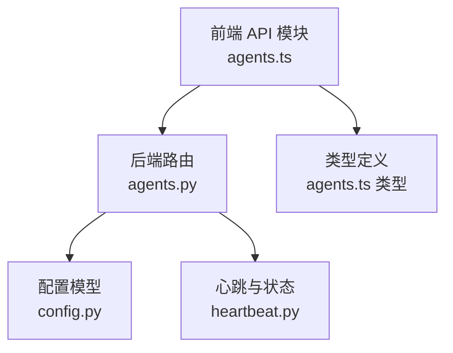
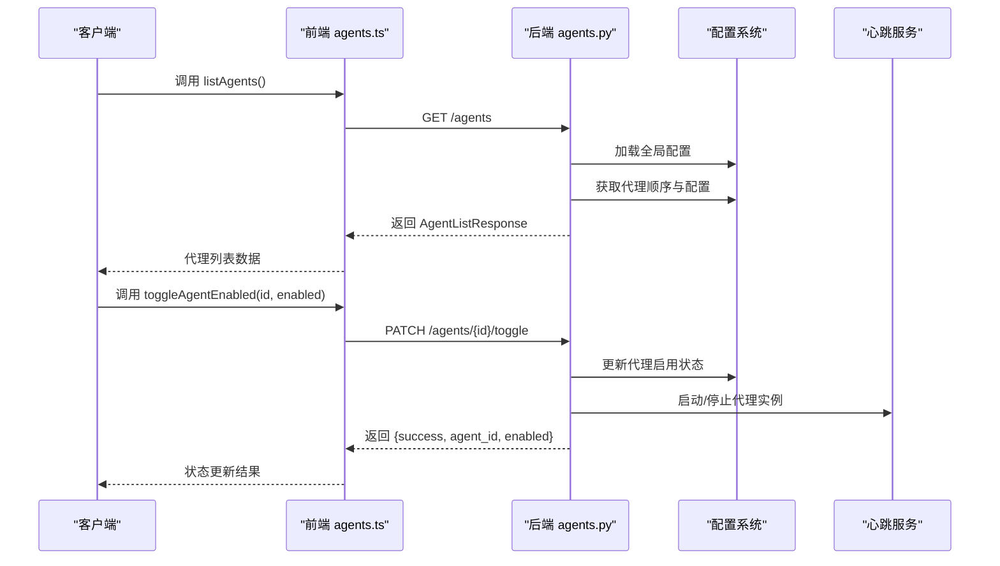
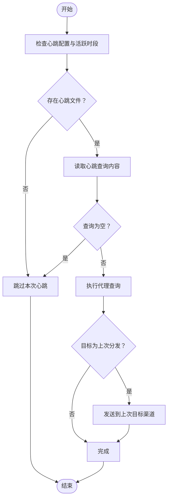
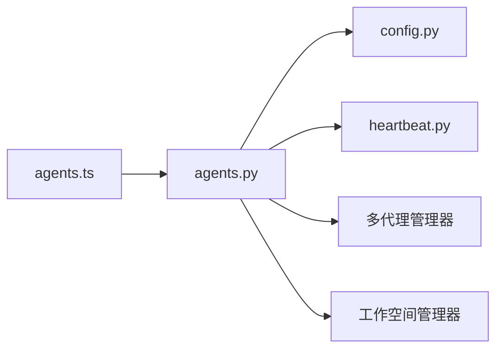

# 代理列表 API

<cite>
**本文档引用的文件**
- [agents.ts](file://console/src/api/modules/agents.ts)
- [agents.ts（类型定义）](file://console/src/api/types/agents.ts)
- [agent.ts（类型定义）](file://console/src/api/types/agent.ts)
- [agents.py](file://src/copaw/app/routers/agents.py)
- [config.py（配置）](file://src/copaw/config/config.py)
- [heartbeat.py](file://src/copaw/app/crons/heartbeat.py)
</cite>

## 目录
1. [简介](#简介)
2. [项目结构](#项目结构)
3. [核心组件](#核心组件)
4. [架构概览](#架构概览)
5. [详细组件分析](#详细组件分析)
6. [依赖关系分析](#依赖关系分析)
7. [性能考虑](#性能考虑)
8. [故障排除指南](#故障排除指南)
9. [结论](#结论)

## 简介
本文件为代理列表 API 的详细技术文档，覆盖代理查询、排序、状态管理等接口的使用方法与实现细节。内容包括：
- 代理信息获取：列出所有代理、获取单个代理详情
- 代理排序：持久化代理顺序
- 代理状态管理：启用/禁用代理、删除代理
- 代理批量操作：批量重排、批量启停
- 数据结构说明：代理摘要、代理配置、创建请求等
- 过滤条件与排序规则：当前实现不支持直接过滤与排序，但可通过客户端处理
- 分页参数：当前实现未提供分页功能

## 项目结构
前端通过模块化的 API 客户端封装与后端 FastAPI 路由对接，形成清晰的职责分离：
- 前端模块：console/src/api/modules/agents.ts 提供统一的代理管理 API 封装
- 类型定义：console/src/api/types 下定义了代理相关的 TypeScript 接口
- 后端路由：src/copaw/app/routers/agents.py 实现 RESTful 接口
- 配置模型：src/copaw/config/config.py 定义代理配置的数据结构
- 心跳与状态：src/copaw/app/crons/heartbeat.py 提供代理运行状态的辅助机制

图表来源
- [agents.ts:11-79](file://console/src/api/modules/agents.ts#L11-L79)
- [agents.py:36-36](file://src/copaw/app/routers/agents.py#L36-L36)
- [config.py（配置）:686-766](file://src/copaw/config/config.py#L686-L766)
- [heartbeat.py:1-213](file://src/copaw/app/crons/heartbeat.py#L1-L213)

章节来源
- [agents.ts:11-79](file://console/src/api/modules/agents.ts#L11-L79)
- [agents.py:36-36](file://src/copaw/app/routers/agents.py#L36-L36)

## 核心组件
- 前端代理 API 模块：提供代理列表、详情、创建、更新、删除、排序、启停、文件读写等方法
- 后端代理路由：实现 RESTful 接口，负责加载配置、校验参数、调用多代理管理器
- 代理配置模型：定义代理配置的数据结构，包含通道、MCP、心跳、工具等子配置
- 代理状态与心跳：通过心跳机制维持代理活跃状态，启停时触发相应逻辑

章节来源
- [agents.ts:11-79](file://console/src/api/modules/agents.ts#L11-L79)
- [agents.py:39-96](file://src/copaw/app/routers/agents.py#L39-L96)
- [config.py（配置）:686-766](file://src/copaw/config/config.py#L686-L766)

## 架构概览
代理列表 API 的整体交互流程如下：

图表来源
- [agents.ts:47-55](file://console/src/api/modules/agents.ts#L47-L55)
- [agents.py:389-438](file://src/copaw/app/routers/agents.py#L389-L438)
- [heartbeat.py:119-213](file://src/copaw/app/crons/heartbeat.py#L119-L213)

## 详细组件分析

### 代理列表查询接口
- 接口路径：GET /agents
- 功能描述：返回所有已配置代理的摘要信息
- 请求参数：无
- 响应数据：AgentListResponse，包含 agents 数组
- 代理摘要字段：
  - id：代理唯一标识
  - name：代理名称
  - description：代理描述（可选）
  - workspace_dir：工作空间目录
  - enabled：是否启用

实现要点：
- 从全局配置中读取代理顺序，并按顺序生成摘要
- 对每个代理尝试加载完整配置以获取描述，若失败则回退到默认值
- 支持从 PROFILE.md 中提取简要描述并合并到 description 字段

章节来源
- [agents.py:152-197](file://src/copaw/app/routers/agents.py#L152-L197)
- [agents.ts:13-14](file://console/src/api/modules/agents.ts#L13-L14)
- [agents.ts（类型定义）:3-13](file://console/src/api/types/agents.ts#L3-L13)

### 代理详情查询接口
- 接口路径：GET /agents/{agentId}
- 功能描述：获取指定代理的完整配置
- 请求参数：agentId（路径参数）
- 响应数据：AgentProfileConfig
- 错误处理：未找到或加载异常时返回 4xx/5xx

实现要点：
- 通过工作空间路径加载 agent.json 并反序列化为配置对象
- 兼容旧版本配置结构，必要时进行回退与迁移

章节来源
- [agents.py:230-244](file://src/copaw/app/routers/agents.py#L230-L244)
- [agents.ts:16-18](file://console/src/api/modules/agents.ts#L16-L18)
- [config.py（配置）:1231-1318](file://src/copaw/config/config.py#L1231-L1318)

### 代理创建接口
- 接口路径：POST /agents
- 功能描述：创建新代理，自动生成短 ID
- 请求体：CreateAgentRequest
- 响应数据：AgentProfileRef（包含 id 与 workspace_dir）
- 初始化流程：
  - 生成唯一代理 ID
  - 创建工作空间目录
  - 初始化内置技能与模板文件
  - 写入初始配置并保存到全局配置

章节来源
- [agents.py:247-318](file://src/copaw/app/routers/agents.py#L247-L318)
- [agents.ts:20-25](file://console/src/api/modules/agents.ts#L20-L25)
- [agents.ts（类型定义）:35-41](file://console/src/api/types/agents.ts#L35-L41)

### 代理更新接口
- 接口路径：PUT /agents/{agentId}
- 功能描述：更新代理配置并触发重载
- 请求体：AgentProfileConfig
- 响应数据：AgentProfileConfig
- 实现要点：
  - 仅允许更新非 id 字段
  - 保存配置并调度代理重载

章节来源
- [agents.py:321-352](file://src/copaw/app/routers/agents.py#L321-L352)
- [agents.ts:27-32](file://console/src/api/modules/agents.ts#L27-L32)

### 代理删除接口
- 接口路径：DELETE /agents/{agentId}
- 功能描述：删除代理及其工作空间
- 特殊限制：禁止删除默认代理
- 实现要点：
  - 停止代理实例
  - 从全局配置中移除代理条目
  - 重新规范化代理顺序

章节来源
- [agents.py:355-386](file://src/copaw/app/routers/agents.py#L355-L386)
- [agents.ts:34-38](file://console/src/api/modules/agents.ts#L34-L38)

### 代理排序接口
- 接口路径：PUT /agents/order
- 功能描述：持久化代理顺序
- 请求体：ReorderAgentsRequest（包含 agent_ids 列表）
- 实现要点：
  - 校验传入 ID 数量与集合完整性
  - 更新全局配置中的 agent_order
  - 保存配置

章节来源
- [agents.py:200-227](file://src/copaw/app/routers/agents.py#L200-L227)
- [agents.ts:40-45](file://console/src/api/modules/agents.ts#L40-L45)
- [agents.ts（类型定义）:15-18](file://console/src/api/types/agents.ts#L15-L18)

### 代理状态管理接口
- 接口路径：PATCH /agents/{agentId}/toggle
- 功能描述：切换代理启用状态
- 请求体：{ enabled: boolean }
- 实现要点：
  - 禁用时停止代理实例
  - 启用时尝试启动代理实例并校验启动结果
  - 禁止对默认代理执行禁用操作

章节来源
- [agents.py:389-438](file://src/copaw/app/routers/agents.py#L389-L438)
- [agents.ts:47-55](file://console/src/api/modules/agents.ts#L47-L55)

### 代理文件管理接口
- 列出工作空间文件：GET /agents/{agentId}/files
- 读取文件：GET /agents/{agentId}/files/{filename}
- 写入文件：PUT /agents/{agentId}/files/{filename}
- 实现要点：
  - 通过代理工作空间管理器读写 Markdown 文件
  - 支持内存文件与工作空间文件两类

章节来源
- [agents.py:441-531](file://src/copaw/app/routers/agents.py#L441-L531)
- [agents.ts:57-73](file://console/src/api/modules/agents.ts#L57-L73)

### 代理数据结构定义

#### 代理摘要（AgentSummary）
- 字段：id, name, description, workspace_dir, enabled
- 来源：后端响应模型与前端类型定义一致

章节来源
- [agents.py:39-47](file://src/copaw/app/routers/agents.py#L39-L47)
- [agents.ts（类型定义）:3-9](file://console/src/api/types/agents.ts#L3-L9)

#### 代理列表响应（AgentListResponse）
- 字段：agents（AgentSummary[]）

章节来源
- [agents.py:49-52](file://src/copaw/app/routers/agents.py#L49-L52)
- [agents.ts（类型定义）:11-13](file://console/src/api/types/agents.ts#L11-L13)

#### 代理配置（AgentProfileConfig）
- 关键字段：id, name, description, workspace_dir, channels, mcp, heartbeat, running, llm_routing, system_prompt_files, tools, security
- 来源：配置模型定义

章节来源
- [config.py（配置）:707-766](file://src/copaw/config/config.py#L707-L766)
- [agent.ts（类型定义）:48-66](file://console/src/api/types/agent.ts#L48-L66)

#### 创建代理请求（CreateAgentRequest）
- 字段：name, description, workspace_dir, language, skill_names

章节来源
- [agents.py:61-79](file://src/copaw/app/routers/agents.py#L61-L79)
- [agents.ts（类型定义）:35-41](file://console/src/api/types/agents.ts#L35-L41)

#### 代理引用（AgentProfileRef）
- 字段：id, workspace_dir

章节来源
- [config.py（配置）:687-704](file://src/copaw/config/config.py#L687-L704)
- [agents.ts（类型定义）:43-46](file://console/src/api/types/agents.ts#L43-L46)

### 代理状态与心跳机制
- 心跳文件：HEARTBEAT.md，用于定时触发代理执行
- 心跳配置：支持间隔与 cron 表达式、活跃时段控制
- 状态影响：启用代理时尝试启动实例；禁用代理时停止实例

图表来源
- [heartbeat.py:119-213](file://src/copaw/app/crons/heartbeat.py#L119-L213)

章节来源
- [heartbeat.py:1-213](file://src/copaw/app/crons/heartbeat.py#L1-L213)

## 依赖关系分析
- 前端 agents.ts 依赖后端 agents.py 的路由实现
- 后端 agents.py 依赖配置系统（config.py）加载与保存代理配置
- 后端 agents.py 依赖多代理管理器与工作空间管理器
- 后端 agents.py 依赖心跳服务以维护代理运行状态

图表来源
- [agents.ts:1-10](file://console/src/api/modules/agents.ts#L1-L10)
- [agents.py:18-32](file://src/copaw/app/routers/agents.py#L18-L32)
- [config.py（配置）:686-766](file://src/copaw/config/config.py#L686-L766)
- [heartbeat.py:1-27](file://src/copaw/app/crons/heartbeat.py#L1-L27)

章节来源
- [agents.ts:1-10](file://console/src/api/modules/agents.ts#L1-L10)
- [agents.py:18-32](file://src/copaw/app/routers/agents.py#L18-L32)

## 性能考虑
- 列表查询复杂度：O(n)，其中 n 为已配置代理数量
- 文件读写：基于本地文件系统，建议避免频繁小文件操作
- 心跳执行：受查询超时与活跃时段限制，默认超时约 120 秒
- 配置加载：每次请求均需读取配置文件，建议在高并发场景下考虑缓存策略

## 故障排除指南
- 404 未找到：代理 ID 不存在或配置文件缺失
- 400 禁止操作：尝试删除或禁用默认代理
- 500 服务器错误：配置加载异常、文件读写失败、代理启动失败
- 心跳失败：检查 HEARTBEAT.md 是否存在且内容非空，确认代理实例可正常启动

章节来源
- [agents.py:336-377](file://src/copaw/app/routers/agents.py#L336-L377)
- [agents.py:399-432](file://src/copaw/app/routers/agents.py#L399-L432)
- [heartbeat.py:149-156](file://src/copaw/app/crons/heartbeat.py#L149-L156)

## 结论
代理列表 API 提供了完整的多代理生命周期管理能力，包括查询、排序、启停与文件管理。当前实现未提供直接的过滤与分页功能，但可通过客户端侧处理满足大多数使用场景。建议在生产环境中结合心跳机制与错误处理策略，确保代理状态稳定与可观测性。