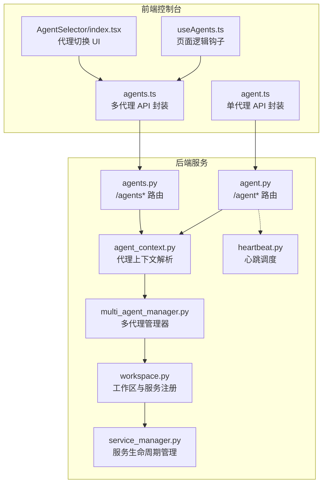
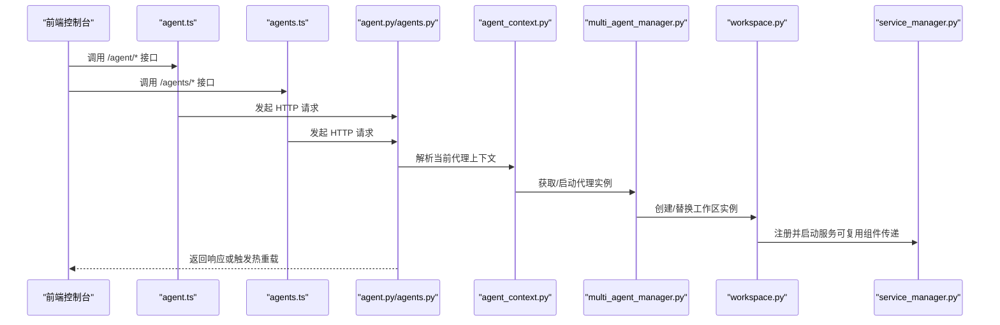
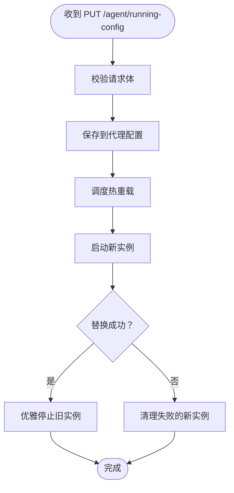
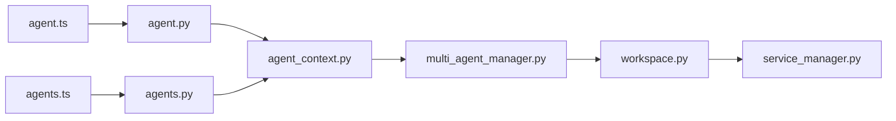

# 代理管理 API

<cite>
**本文档引用的文件**
- [agent.ts](file://console/src/api/modules/agent.ts)
- [agents.ts](file://console/src/api/modules/agents.ts)
- [agent.ts（类型定义）](file://console/src/api/types/agent.ts)
- [agents.ts（类型定义）](file://console/src/api/types/agents.ts)
- [agent.py](file://src/copaw/app/routers/agent.py)
- [agents.py](file://src/copaw/app/routers/agents.py)
- [agent_context.py](file://src/copaw/app/agent_context.py)
- [multi_agent_manager.py](file://src/copaw/app/multi_agent_manager.py)
- [workspace.py](file://src/copaw/app/workspace/workspace.py)
- [service_manager.py](file://src/copaw/app/workspace/service_manager.py)
- [heartbeat.py](file://src/copaw/app/crons/heartbeat.py)
- [useAgents.ts](file://console/src/pages/Settings/Agents/useAgents.ts)
- [index.tsx（AgentSelector）](file://console/src/components/AgentSelector/index.tsx)
- [heartbeat.ts](file://console/src/api/modules/heartbeat.ts)
</cite>

## 目录
1. [简介](#简介)
2. [项目结构](#项目结构)
3. [核心组件](#核心组件)
4. [架构总览](#架构总览)
5. [详细组件分析](#详细组件分析)
6. [依赖关系分析](#依赖关系分析)
7. [性能考虑](#性能考虑)
8. [故障排除指南](#故障排除指南)
9. [结论](#结论)

## 简介
本文件面向前端与集成开发者，系统化梳理代理管理 API 的核心能力与使用方式，覆盖以下主题：
- 代理健康检查与进程管理
- 代理状态查询与启动/停止控制
- 运行配置管理（热重载）
- 多语言支持与本地化资源复制
- 音频模式与语音转文字配置（含本地 Whisper 可用性检测）

文档提供每个接口的请求路径、方法、参数、响应结构与典型错误场景，帮助快速集成与排障。

## 项目结构
后端采用 FastAPI 路由模块化组织，前端通过独立模块封装 API 请求；代理上下文与多代理管理器负责在运行时解析当前活跃代理并执行零停机热重载。

**图表来源**
- [agent.ts:1-85](file://console/src/api/modules/agent.ts#L1-L85)
- [agents.ts:1-79](file://console/src/api/modules/agents.ts#L1-L79)
- [agent.py:1-505](file://src/copaw/app/routers/agent.py#L1-L505)
- [agents.py:1-726](file://src/copaw/app/routers/agents.py#L1-L726)
- [agent_context.py:1-141](file://src/copaw/app/agent_context.py#L1-L141)
- [multi_agent_manager.py:263-331](file://src/copaw/app/multi_agent_manager.py#L263-L331)
- [workspace.py:261-301](file://src/copaw/app/workspace/workspace.py#L261-L301)
- [service_manager.py:183-411](file://src/copaw/app/workspace/service_manager.py#L183-L411)
- [heartbeat.py:83-127](file://src/copaw/app/crons/heartbeat.py#L83-L127)

**章节来源**
- [agent.ts:1-85](file://console/src/api/modules/agent.ts#L1-L85)
- [agents.ts:1-79](file://console/src/api/modules/agents.ts#L1-L79)
- [agent.py:1-505](file://src/copaw/app/routers/agent.py#L1-L505)
- [agents.py:1-726](file://src/copaw/app/routers/agents.py#L1-L726)

## 核心组件
- 单代理 API 模块：封装 /agent 前缀下的健康检查、进程调用、运行配置、语言、音频模式、语音转文字提供者等接口。
- 多代理 API 模块：封装 /agents 前缀下的代理列表、创建、删除、启用/禁用、文件读写等接口。
- 后端路由层：实现上述接口的业务逻辑，包含参数校验、配置持久化与热重载触发。
- 代理上下文与多代理管理器：解析当前请求对应的代理实例，支持零停机热重载与服务复用。
- 工作区与服务管理：注册服务优先级、并发/串行启动策略、可复用组件传递。

**章节来源**
- [agent.ts（类型定义）:1-67](file://console/src/api/types/agent.ts#L1-L67)
- [agents.ts（类型定义）:1-47](file://console/src/api/types/agents.ts#L1-L47)
- [agent.py:180-505](file://src/copaw/app/routers/agent.py#L180-L505)
- [agents.py:152-726](file://src/copaw/app/routers/agents.py#L152-L726)
- [agent_context.py:22-106](file://src/copaw/app/agent_context.py#L22-L106)
- [multi_agent_manager.py:263-331](file://src/copaw/app/multi_agent_manager.py#L263-L331)
- [workspace.py:261-301](file://src/copaw/app/workspace/workspace.py#L261-L301)
- [service_manager.py:183-411](file://src/copaw/app/workspace/service_manager.py#L183-L411)

## 架构总览
下图展示从前端到后端的关键交互流程，重点体现代理上下文解析、热重载与服务生命周期管理。

**图表来源**
- [agent.ts:1-85](file://console/src/api/modules/agent.ts#L1-L85)
- [agents.ts:1-79](file://console/src/api/modules/agents.ts#L1-L79)
- [agent.py:180-505](file://src/copaw/app/routers/agent.py#L180-L505)
- [agents.py:152-726](file://src/copaw/app/routers/agents.py#L152-L726)
- [agent_context.py:22-106](file://src/copaw/app/agent_context.py#L22-L106)
- [multi_agent_manager.py:263-331](file://src/copaw/app/multi_agent_manager.py#L263-L331)
- [workspace.py:261-301](file://src/copaw/app/workspace/workspace.py#L261-L301)
- [service_manager.py:183-411](file://src/copaw/app/workspace/service_manager.py#L183-L411)

## 详细组件分析

### 健康检查与进程管理
- 接口概览
  - GET /agent/health：健康检查
  - POST /agent/process：向代理发送输入（如会话消息），返回处理结果流或结果
  - POST /agent/admin/status：管理员查看代理进程状态
  - POST /agent/shutdown：简单关闭（可能仅关闭当前进程）
  - POST /agent/admin/shutdown：管理员关闭代理（可能触发多层清理）

- 关键行为
  - /agent/process 使用统一的 AgentRequest 结构，支持 session_id、user_id、channel 等上下文字段。
  - /agent/admin/status 用于运维侧查看代理进程状态。
  - 关闭接口遵循平台差异的优雅终止与强制终止策略（参考命令行工具中的实现思路）。

- 错误处理
  - 未找到代理或代理被禁用时返回 404/403。
  - 进程不存在或无法终止时返回 5xx。

**章节来源**
- [agent.ts:6-26](file://console/src/api/modules/agent.ts#L6-L26)
- [agent.py:180-200](file://src/copaw/app/routers/agent.py#L180-L200)

### 代理状态查询与启停控制
- 接口概览
  - GET /agents：列出所有已配置代理（含启用状态）
  - GET /agents/{agentId}：获取指定代理的完整配置
  - POST /agents：创建新代理（自动生成短 ID，初始化工作区与技能）
  - PUT /agents/{agentId}：更新代理配置并触发热重载
  - DELETE /agents/{agentId}：删除代理及工作区（默认代理不可删除）
  - PATCH /agents/{agentId}/toggle：启用/禁用代理（默认代理不可禁用）
  - PUT /agents/order：持久化代理顺序

- 关键行为
  - 列表接口会合并“已配置但未排序”的代理，并读取工作区内的描述信息作为补充。
  - 更新代理配置后，通过调度器触发热重载，确保零停机切换。
  - 删除代理会先停止其运行实例，再从配置中移除并同步顺序。

- 错误处理
  - 未找到代理返回 404。
  - 默认代理不可删除/禁用返回 400。
  - 多代理管理器未初始化返回 500。

**章节来源**
- [agents.ts:12-78](file://console/src/api/modules/agents.ts#L12-L78)
- [agents.py:152-438](file://src/copaw/app/routers/agents.py#L152-L438)
- [agent_context.py:80-106](file://src/copaw/app/agent_context.py#L80-L106)

### 运行配置管理（热重载）
- 接口概览
  - GET /agent/running-config：获取当前代理的运行配置
  - PUT /agent/running-config：更新运行配置并触发热重载

- 数据模型
  - AgentsRunningConfig 包含 LLM 重试、并发限制、历史长度、上下文压缩、工具结果压缩、内存摘要、嵌入配置等字段。

- 关键行为
  - 更新后立即保存到代理配置文件，并通过调度器异步触发热重载。
  - 热重载过程采用“新实例启动 → 原子替换 → 旧实例优雅停止”的策略，尽可能实现零停机。

- 错误处理
  - 配置加载失败返回 500。
  - 热重载过程中异常会回滚并记录警告。

**图表来源**
- [agent.py:442-464](file://src/copaw/app/routers/agent.py#L442-L464)
- [multi_agent_manager.py:263-331](file://src/copaw/app/multi_agent_manager.py#L263-L331)
- [workspace.py:293-301](file://src/copaw/app/workspace/workspace.py#L293-L301)
- [service_manager.py:183-411](file://src/copaw/app/workspace/service_manager.py#L183-L411)

**章节来源**
- [agent.ts（类型定义）:48-67](file://console/src/api/types/agent.ts#L48-L67)
- [agent.py:427-464](file://src/copaw/app/routers/agent.py#L427-L464)
- [multi_agent_manager.py:263-331](file://src/copaw/app/multi_agent_manager.py#L263-L331)

### 多语言支持与本地化资源
- 接口概览
  - GET /agent/language：获取当前代理的语言设置
  - PUT /agent/language：更新代理语言并可选择复制本地化 Markdown 文件

- 关键行为
  - 支持语言：zh/en/ru。
  - 当语言变更且非内置 QA 代理时，会从模板目录复制对应语言的 Markdown 文件至工作区。
  - 内置 QA 代理会复制专用 QA 模板文件。

- 错误处理
  - 非法语言值返回 400。
  - 文件复制失败会记录警告但不影响配置更新。

**章节来源**
- [agent.ts:37-43](file://console/src/api/modules/agent.ts#L37-L43)
- [agent.py:180-259](file://src/copaw/app/routers/agent.py#L180-L259)

### 音频模式与语音转文字配置
- 接口概览
  - GET /agent/audio-mode：获取音频处理模式（auto/native）
  - PUT /agent/audio-mode：设置音频处理模式
  - GET /agent/transcription-provider-type：获取转写提供者类型（disabled/whisper_api/local_whisper）
  - PUT /agent/transcription-provider-type：设置转写提供者类型
  - GET /agent/transcription-providers：列出可用的转写提供者及当前配置
  - PUT /agent/transcription-provider：设置转写提供者（空字符串表示取消）
  - GET /agent/local-whisper-status：检查本地 Whisper 可用性（ffmpeg/whisper 安装状态）

- 关键行为
  - 音频模式：auto 表示在有可用提供者时进行转写，否则生成文件占位；native 表示直接将音频发送给模型（可能需要 ffmpeg）。
  - 转写提供者类型：disabled 禁用转写；whisper_api 使用远程 Whisper；local_whisper 使用本地 openai-whisper。
  - 提供者列表与当前配置通过工具函数动态获取。

- 错误处理
  - 非法枚举值返回 400。
  - 本地 Whisper 可用性检查失败会返回 500。

**章节来源**
- [agent.ts:45-85](file://console/src/api/modules/agent.ts#L45-L85)
- [agent.py:262-424](file://src/copaw/app/routers/agent.py#L262-L424)

### 代理上下文解析与零停机热重载
- 上下文解析
  - 优先级：显式 agent_id → 请求状态中的 agent_id → 请求头 X-Agent-Id → 配置中的 active_agent（默认 default）。
  - 校验代理存在性与启用状态，否则返回 404/403。
  - 通过 MultiAgentManager 获取/启动代理实例。

- 热重载机制
  - 新实例启动成功后，原子替换旧实例。
  - 旧实例在锁外优雅停止，避免长时间阻塞。
  - 可复用组件从旧实例传递到新实例，减少重启成本。

**章节来源**
- [agent_context.py:22-106](file://src/copaw/app/agent_context.py#L22-L106)
- [multi_agent_manager.py:263-331](file://src/copaw/app/multi_agent_manager.py#L263-L331)
- [workspace.py:293-301](file://src/copaw/app/workspace/workspace.py#L293-L301)
- [service_manager.py:183-411](file://src/copaw/app/workspace/service_manager.py#L183-L411)

## 依赖关系分析
- 前端模块
  - agent.ts 与 agents.ts 分别封装 /agent 与 /agents 的请求方法。
  - useAgents.ts 与 AgentSelector/index.tsx 依赖 agents.ts 进行列表、启用/禁用与删除操作。
- 后端模块
  - agent.py/agents.py 依赖 agent_context.py 解析代理上下文，依赖 multi_agent_manager.py 管理代理生命周期。
  - workspace.py 与 service_manager.py 负责服务注册与启动顺序、可复用组件传递。

**图表来源**
- [agent.ts:1-85](file://console/src/api/modules/agent.ts#L1-L85)
- [agents.ts:1-79](file://console/src/api/modules/agents.ts#L1-L79)
- [agent.py:1-505](file://src/copaw/app/routers/agent.py#L1-L505)
- [agents.py:1-726](file://src/copaw/app/routers/agents.py#L1-L726)
- [agent_context.py:1-141](file://src/copaw/app/agent_context.py#L1-L141)
- [multi_agent_manager.py:1-331](file://src/copaw/app/multi_agent_manager.py#L1-L331)
- [workspace.py:1-301](file://src/copaw/app/workspace/workspace.py#L1-L301)
- [service_manager.py:1-411](file://src/copaw/app/workspace/service_manager.py#L1-L411)

**章节来源**
- [agent.ts:1-85](file://console/src/api/modules/agent.ts#L1-L85)
- [agents.ts:1-79](file://console/src/api/modules/agents.ts#L1-L79)
- [agent.py:1-505](file://src/copaw/app/routers/agent.py#L1-L505)
- [agents.py:1-726](file://src/copaw/app/routers/agents.py#L1-L726)

## 性能考虑
- 零停机热重载：通过新旧实例并行与原子替换，最小化服务中断时间。
- 并发服务启动：服务按优先级分组，支持并发与串行混合启动，缩短启动时延。
- 可复用组件：跨实例复用数据库连接、缓存等昂贵资源，降低重启成本。
- 音频处理：本地 Whisper 依赖 ffmpeg 与 whisper 库，建议在部署前预检依赖以避免运行时失败。

[本节为通用指导，不直接分析具体文件]

## 故障排除指南
- 代理未找到或被禁用
  - 现象：返回 404 或 403。
  - 排查：确认代理 ID 是否存在于配置；检查 enabled 字段；确认 active_agent 设置。
  - 参考：[agent_context.py:64-106](file://src/copaw/app/agent_context.py#L64-L106)

- 多代理管理器未初始化
  - 现象：返回 500。
  - 排查：确认应用状态中已注入 MultiAgentManager；检查服务启动顺序。
  - 参考：[agents.py:98-105](file://src/copaw/app/routers/agents.py#L98-L105)

- 代理配置更新后未生效
  - 现象：修改运行配置后仍使用旧设置。
  - 排查：确认热重载调度是否触发；检查新实例启动是否成功；查看旧实例优雅停止日志。
  - 参考：[agent.py:448-464](file://src/copaw/app/routers/agent.py#L448-L464)、[multi_agent_manager.py:263-331](file://src/copaw/app/multi_agent_manager.py#L263-L331)

- 本地 Whisper 不可用
  - 现象：/agent/local-whisper-status 返回不可用。
  - 排查：确认 ffmpeg 与 openai-whisper 已安装；检查权限与环境变量。
  - 参考：[agent.py:364-378](file://src/copaw/app/routers/agent.py#L364-L378)

- 代理启停控制无效
  - 现象：PATCH /agents/{agentId}/toggle 无效果。
  - 排查：确认目标代理非默认代理；检查 MultiAgentManager 的 stop_agent/get_agent 调用链；查看日志错误。
  - 参考：[agents.py:389-438](file://src/copaw/app/routers/agents.py#L389-L438)

**章节来源**
- [agent_context.py:64-106](file://src/copaw/app/agent_context.py#L64-L106)
- [agents.py:98-105](file://src/copaw/app/routers/agents.py#L98-L105)
- [agent.py:448-464](file://src/copaw/app/routers/agent.py#L448-L464)
- [multi_agent_manager.py:263-331](file://src/copaw/app/multi_agent_manager.py#L263-L331)

## 结论
本文档系统化梳理了代理管理 API 的核心接口与实现细节，涵盖健康检查、进程管理、运行配置热重载、多语言与音频转写配置等关键能力。通过代理上下文解析与多代理管理器的配合，实现了零停机热重载与高效的服务生命周期管理。建议在生产环境中结合本地 Whisper 可用性检查与服务监控，确保代理稳定运行。