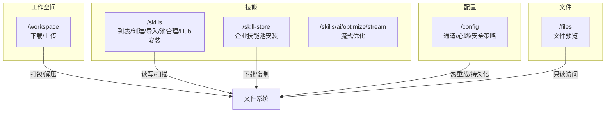
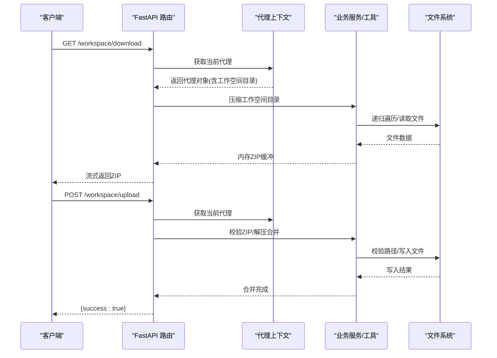
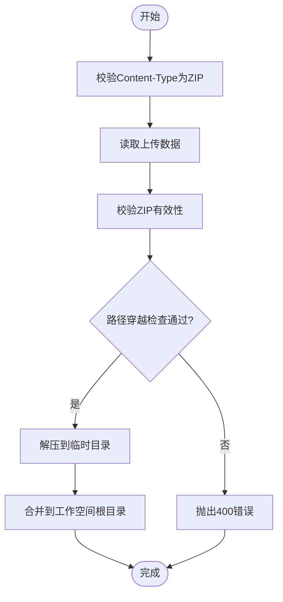
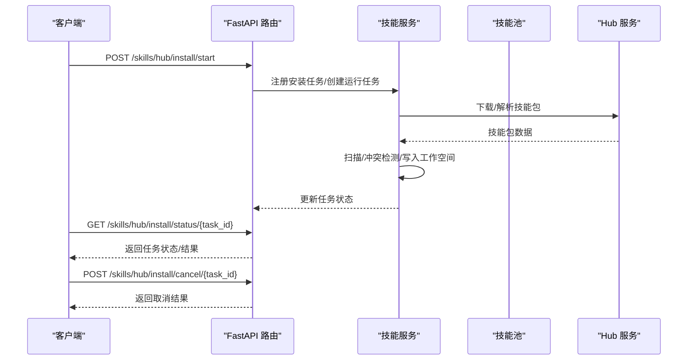
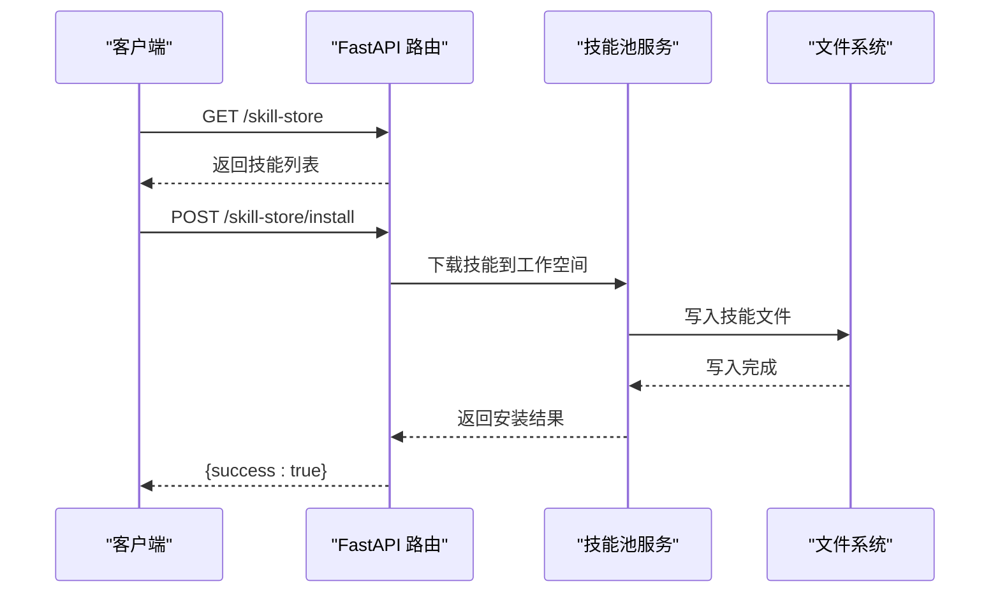
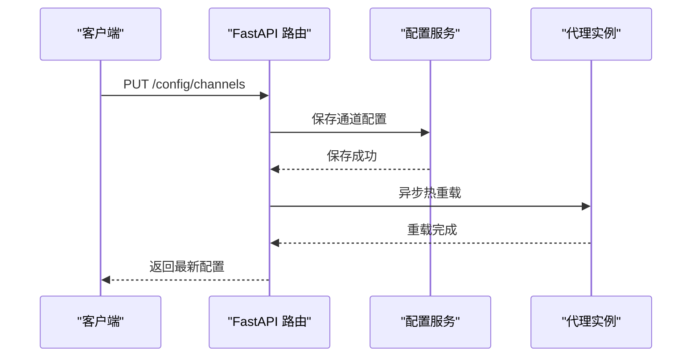
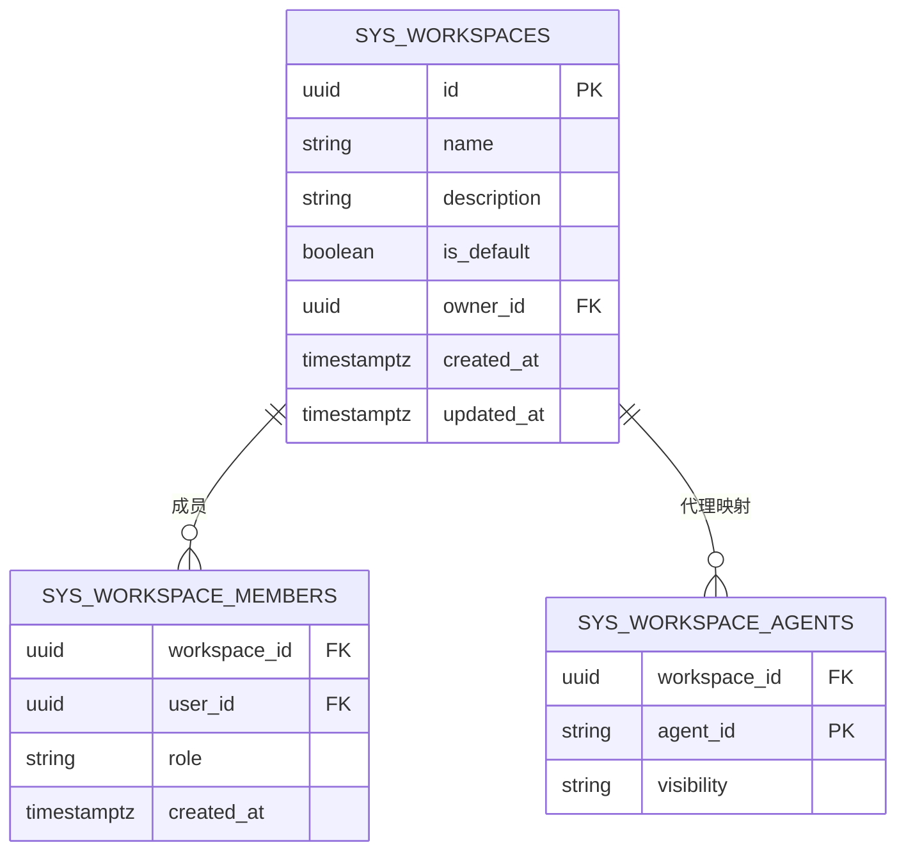
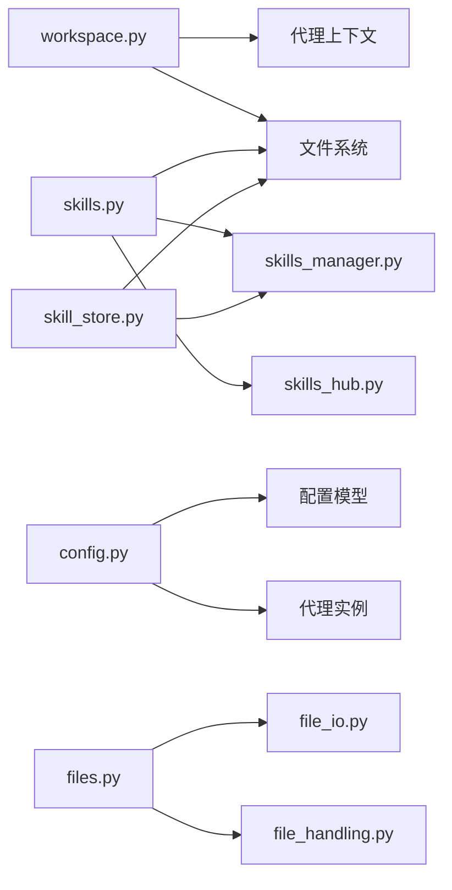

# 工作空间 API

<cite>
**本文档引用的文件**
- [workspace.py](file://src/copaw/app/routers/workspace.py)
- [skills.py](file://src/copaw/app/routers/skills.py)
- [config.py](file://src/copaw/app/routers/config.py)
- [files.py](file://src/copaw/app/routers/files.py)
- [skill_store.py](file://src/copaw/app/routers/skill_store.py)
- [skills_stream.py](file://src/copaw/app/routers/skills_stream.py)
- [workspace.py（数据库模型）](file://src/copaw/db/models/workspace.py)
- [skills_manager.py](file://src/copaw/agents/skills_manager.py)
- [skills_hub.py](file://src/copaw/agents/skills_hub.py)
- [file_io.py](file://src/copaw/agents/tools/file_io.py)
- [file_search.py](file://src/copaw/agents/tools/file_search.py)
- [file_handling.py](file://src/copaw/agents/utils/file_handling.py)
- [constant.py](file://src/copaw/constant.py)
- [workspace.ts（前端 API）](file://console/src/api/modules/workspace.ts)
</cite>

## 目录
1. [简介](#简介)
2. [项目结构](#项目结构)
3. [核心组件](#核心组件)
4. [架构总览](#架构总览)
5. [详细组件分析](#详细组件分析)
6. [依赖关系分析](#依赖关系分析)
7. [性能考虑](#性能考虑)
8. [故障排除指南](#故障排除指南)
9. [结论](#结论)
10. [附录](#附录)

## 简介
本文件系统化梳理工作空间 API 的设计与实现，覆盖工作空间管理、文件操作、技能池管理、配置管理等能力。重点包括：
- 工作空间打包下载与上传合并
- 技能的导入导出、从技能池安装、Hub 安装与状态跟踪
- 配置的读取与热更新（通道、心跳、安全策略等）
- 文件预览与工作空间内文件读写工具
- 权限与安全（路径校验、扫描、白名单）

## 项目结构
后端采用 FastAPI 路由模块化组织，按功能域划分：
- 工作空间：/workspace 下载/上传
- 技能：/skills 列表、创建、导入、池管理、Hub 安装
- 配置：/config 通道、心跳、安全策略
- 文件：/files 预览
- 技能商店：/skill-store 企业技能池安装
- AI 优化流：/skills/ai/optimize/stream 流式优化

图表来源
- [workspace.py:112-203](file://src/copaw/app/routers/workspace.py#L112-L203)
- [skills.py:533-800](file://src/copaw/app/routers/skills.py#L533-L800)
- [config.py:64-642](file://src/copaw/app/routers/config.py#L64-L642)
- [files.py:9-25](file://src/copaw/app/routers/files.py#L9-L25)
- [skill_store.py:32-73](file://src/copaw/app/routers/skill_store.py#L32-L73)
- [skills_stream.py:170-249](file://src/copaw/app/routers/skills_stream.py#L170-L249)

章节来源
- [workspace.py:1-203](file://src/copaw/app/routers/workspace.py#L1-L203)
- [skills.py:1-800](file://src/copaw/app/routers/skills.py#L1-L800)
- [config.py:1-642](file://src/copaw/app/routers/config.py#L1-L642)
- [files.py:1-25](file://src/copaw/app/routers/files.py#L1-L25)
- [skill_store.py:1-73](file://src/copaw/app/routers/skill_store.py#L1-L73)
- [skills_stream.py:1-249](file://src/copaw/app/routers/skills_stream.py#L1-L249)

## 核心组件
- 工作空间路由：提供工作空间打包下载与上传合并，内置路径穿越校验与阻塞式解压合并逻辑。
- 技能路由：提供技能清单、创建、批量导入 ZIP、池刷新、Hub 搜索与安装任务管理。
- 配置路由：提供通道配置、心跳、用户时区、工具守卫、文件守卫、技能扫描器等配置的读取与更新。
- 文件路由：提供文件预览下载（仅只读）。
- 技能商店路由：企业技能池的技能列表与安装到指定工作空间。
- AI 优化流：基于已配置模型的流式技能内容优化。

章节来源
- [workspace.py:112-203](file://src/copaw/app/routers/workspace.py#L112-L203)
- [skills.py:533-800](file://src/copaw/app/routers/skills.py#L533-L800)
- [config.py:64-642](file://src/copaw/app/routers/config.py#L64-L642)
- [files.py:9-25](file://src/copaw/app/routers/files.py#L9-L25)
- [skill_store.py:32-73](file://src/copaw/app/routers/skill_store.py#L32-L73)
- [skills_stream.py:170-249](file://src/copaw/app/routers/skills_stream.py#L170-L249)

## 架构总览
工作空间 API 的调用链路与数据流如下：

图表来源
- [workspace.py:126-203](file://src/copaw/app/routers/workspace.py#L126-L203)

章节来源
- [workspace.py:112-203](file://src/copaw/app/routers/workspace.py#L112-L203)

## 详细组件分析

### 工作空间下载/上传
- 下载接口：将当前代理的工作空间目录打包为 ZIP 并以流式响应返回；文件名包含代理 ID 与 UTC 时间戳。
- 上传接口：接收 ZIP 文件，进行内容类型校验与大小限制，执行路径穿越校验后解压合并到工作空间目录；支持覆盖与目录合并。

图表来源
- [workspace.py:165-203](file://src/copaw/app/routers/workspace.py#L165-L203)
- [workspace.py:56-105](file://src/copaw/app/routers/workspace.py#L56-L105)

章节来源
- [workspace.py:112-203](file://src/copaw/app/routers/workspace.py#L112-L203)

### 技能管理
- 列表与刷新：读取工作空间技能清单，支持强制重合（manifest 对齐）。
- 创建技能：从内容创建技能，支持启用、覆盖冲突、引用与脚本配置。
- 导入 ZIP：从 ZIP 批量导入技能，支持目标名称、重命名映射、覆盖与启用。
- 池管理：列出共享技能池、刷新池清单、保存/创建池技能。
- Hub 安装：搜索 Hub、启动安装任务、轮询状态、取消任务；安装过程异步执行并带扫描与冲突处理。
- AI 优化流：基于模型的流式技能内容优化，支持多语言提示词。

图表来源
- [skills.py:582-641](file://src/copaw/app/routers/skills.py#L582-L641)
- [skills_hub.py:1-200](file://src/copaw/agents/skills_hub.py#L1-L200)
- [skills_manager.py:1-200](file://src/copaw/agents/skills_manager.py#L1-L200)

章节来源
- [skills.py:533-800](file://src/copaw/app/routers/skills.py#L533-L800)
- [skills_hub.py:1-200](file://src/copaw/agents/skills_hub.py#L1-L200)
- [skills_manager.py:1-200](file://src/copaw/agents/skills_manager.py#L1-L200)

### 技能商店（企业）
- 列出技能池中的技能条目，支持安装到指定工作空间目录。
- 安装流程：校验工作空间路径存在性，调用池服务下载并写入目标工作空间。

图表来源
- [skill_store.py:32-73](file://src/copaw/app/routers/skill_store.py#L32-L73)

章节来源
- [skill_store.py:1-73](file://src/copaw/app/routers/skill_store.py#L1-L73)

### 配置管理
- 通道配置：列出全部可用通道及其配置，支持按通道名获取/更新；更新后触发热重载。
- 心跳配置：获取/更新心跳间隔、目标与活跃时段；后台异步重调度。
- 用户时区：获取/设置用户 IANA 时区。
- 安全策略：工具守卫、文件守卫、技能扫描器配置；支持内置规则与白名单维护。

图表来源
- [config.py:122-141](file://src/copaw/app/routers/config.py#L122-L141)

章节来源
- [config.py:64-642](file://src/copaw/app/routers/config.py#L64-L642)

### 文件操作
- 文件预览：根据绝对或相对路径解析为本地文件，返回只读文件响应。
- 工具读写：提供跨平台编码兼容的文件读取与截断提示；支持相对路径解析至当前工作空间或全局工作空间。
- 文件搜索：支持通配符与内容检索，过滤二进制与大文件，限制匹配数量与输出大小。

章节来源
- [files.py:9-25](file://src/copaw/app/routers/files.py#L9-L25)
- [file_io.py:66-200](file://src/copaw/agents/tools/file_io.py#L66-L200)
- [file_search.py:1-200](file://src/copaw/agents/tools/file_search.py#L1-L200)
- [file_handling.py:31-200](file://src/copaw/agents/utils/file_handling.py#L31-L200)

### 数据模型（工作空间）
- Workspace：团队协作工作空间，支持默认标记与拥有者。
- WorkspaceMember：工作空间与用户的多对多成员关系，含角色与加入时间。
- WorkspaceAgent：物理代理目录 JSON ID 与工作空间映射，含可见性。

图表来源
- [workspace.py（数据库模型）:20-112](file://src/copaw/db/models/workspace.py#L20-L112)

章节来源
- [workspace.py（数据库模型）:1-112](file://src/copaw/db/models/workspace.py#L1-L112)

## 依赖关系分析
- 工作空间 API 依赖代理上下文解析当前工作空间目录，并通过阻塞式压缩/解压函数在异步路由中通过线程池执行。
- 技能 API 依赖技能服务与 Hub 客户端，安装任务通过锁与事件协调并发与取消。
- 配置 API 依赖配置加载/保存与代理热重载机制。
- 文件 API 依赖文件系统与工具集，确保跨平台编码与安全访问。

图表来源
- [workspace.py:1-203](file://src/copaw/app/routers/workspace.py#L1-L203)
- [skills.py:1-800](file://src/copaw/app/routers/skills.py#L1-L800)
- [config.py:1-642](file://src/copaw/app/routers/config.py#L1-L642)
- [files.py:1-25](file://src/copaw/app/routers/files.py#L1-L25)
- [skill_store.py:1-73](file://src/copaw/app/routers/skill_store.py#L1-L73)
- [skills_manager.py:1-200](file://src/copaw/agents/skills_manager.py#L1-L200)
- [skills_hub.py:1-200](file://src/copaw/agents/skills_hub.py#L1-L200)
- [file_io.py:1-200](file://src/copaw/agents/tools/file_io.py#L1-L200)
- [file_handling.py:1-200](file://src/copaw/agents/utils/file_handling.py#L1-L200)

章节来源
- [workspace.py:1-203](file://src/copaw/app/routers/workspace.py#L1-L203)
- [skills.py:1-800](file://src/copaw/app/routers/skills.py#L1-L800)
- [config.py:1-642](file://src/copaw/app/routers/config.py#L1-L642)
- [files.py:1-25](file://src/copaw/app/routers/files.py#L1-L25)
- [skill_store.py:1-73](file://src/copaw/app/routers/skill_store.py#L1-L73)
- [skills_manager.py:1-200](file://src/copaw/agents/skills_manager.py#L1-L200)
- [skills_hub.py:1-200](file://src/copaw/agents/skills_hub.py#L1-L200)
- [file_io.py:1-200](file://src/copaw/agents/tools/file_io.py#L1-L200)
- [file_handling.py:1-200](file://src/copaw/agents/utils/file_handling.py#L1-L200)

## 性能考虑
- 工作空间下载：采用内存 ZIP 缓冲与流式响应，避免一次性加载整个目录到内存；建议控制工作空间规模与文件数量。
- 技能导入：ZIP 上传有最大大小限制；Hub 安装为异步任务，避免阻塞主请求。
- 文件读取：提供截断提示与最大输出限制，防止超大数据导致响应膨胀。
- 配置热重载：通道与心跳更新采用异步重载，降低对在线服务的影响。

## 故障排除指南
- 工作空间上传 400 错误
  - 可能原因：非 ZIP 内容类型、ZIP 校验失败、路径穿越风险。
  - 排查步骤：确认 Content-Type 为 application/zip；检查 ZIP 结构与路径合法性。
- 技能导入冲突
  - 可能原因：同名技能冲突；扫描不通过。
  - 排查步骤：查看返回的建议名称；检查扫描报告与严重级别。
- 配置更新无效
  - 可能原因：未触发热重载或保存失败。
  - 排查步骤：确认返回值与日志；检查代理实例是否收到重载信号。
- 文件预览 404
  - 可能原因：路径不存在或非文件；相对路径解析失败。
  - 排查步骤：确认绝对路径或相对路径解析到正确位置。

章节来源
- [workspace.py:165-203](file://src/copaw/app/routers/workspace.py#L165-L203)
- [skills.py:681-743](file://src/copaw/app/routers/skills.py#L681-L743)
- [config.py:122-141](file://src/copaw/app/routers/config.py#L122-L141)
- [files.py:14-25](file://src/copaw/app/routers/files.py#L14-L25)

## 结论
工作空间 API 提供了完整的工作空间打包下载与上传合并能力，配合技能池与 Hub 的导入流程，实现了从技能开发到部署的一体化闭环。配置 API 支持细粒度的运行时调整与热重载，文件 API 提供安全的只读访问与读写工具。整体设计强调安全性（路径校验、扫描、白名单）、可扩展性（异步任务、流式响应）与易用性（统一的前端封装）。

## 附录
- 前端工作空间下载封装示例：参考前端 workspace.ts 中的下载实现与文件名解析逻辑。

章节来源
- [workspace.ts（前端 API）:60-89](file://console/src/api/modules/workspace.ts#L60-L89)