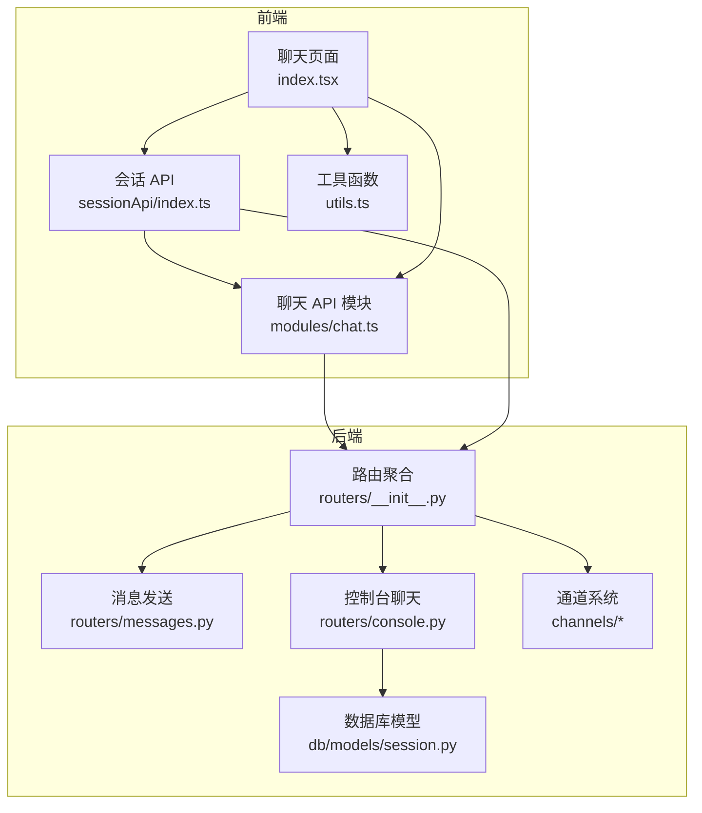
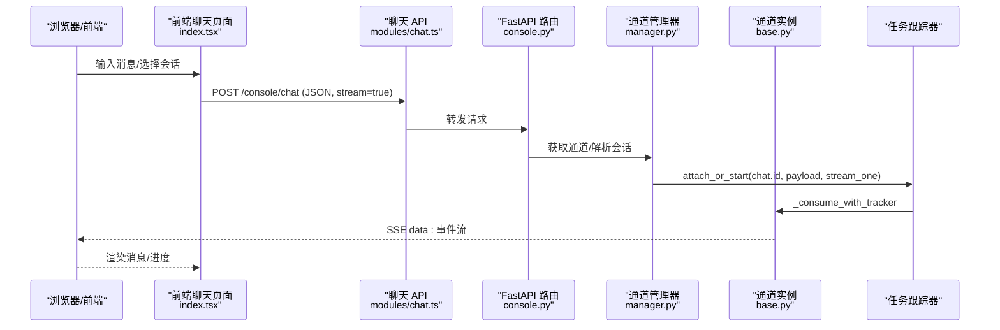
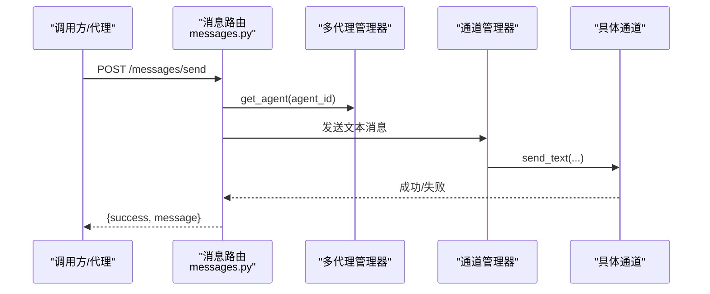
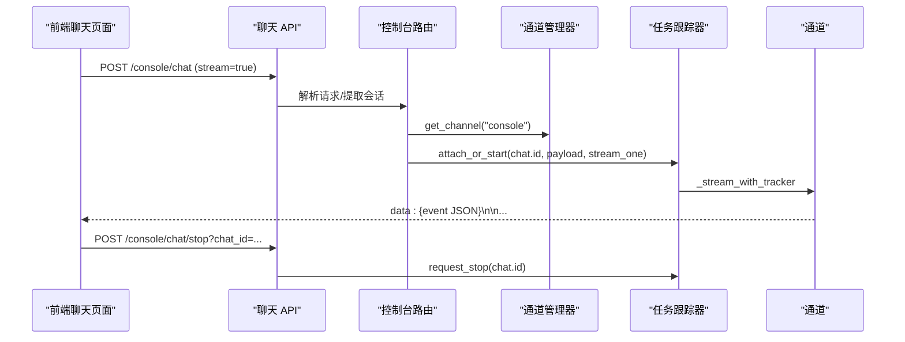
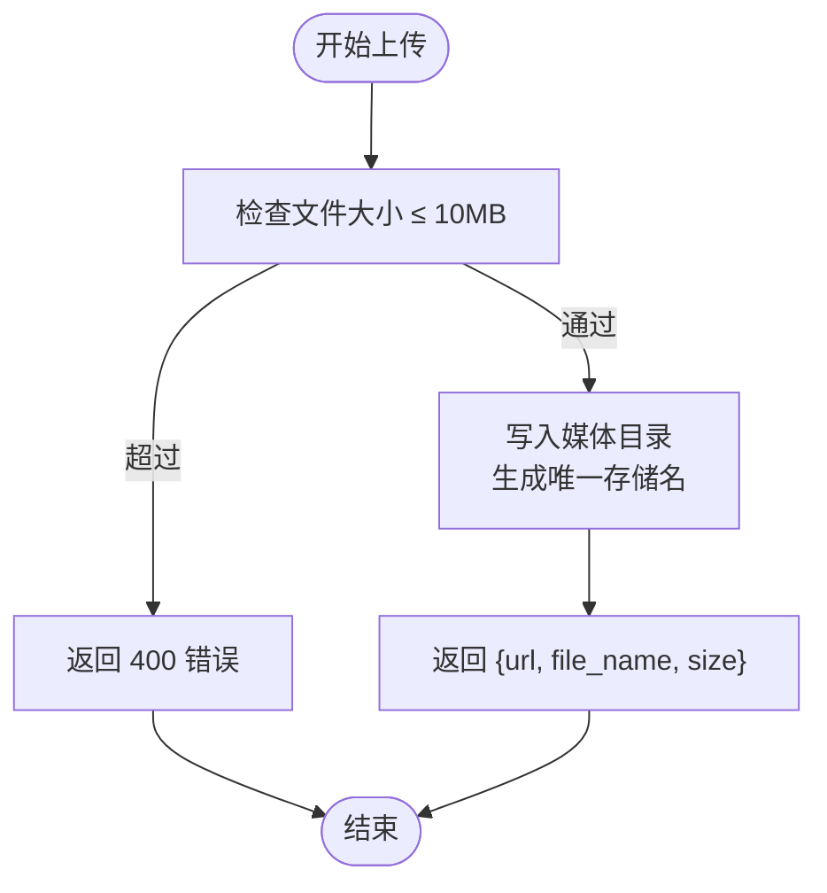
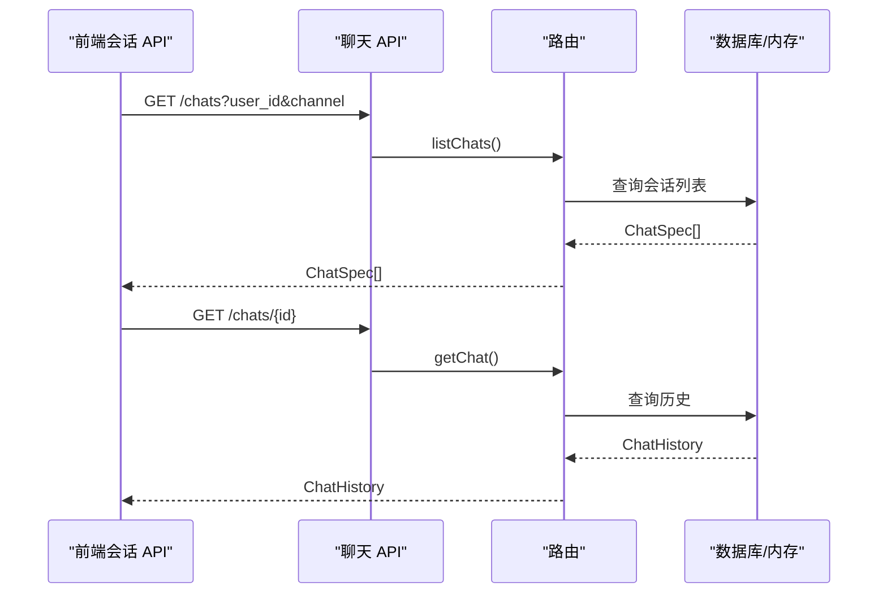
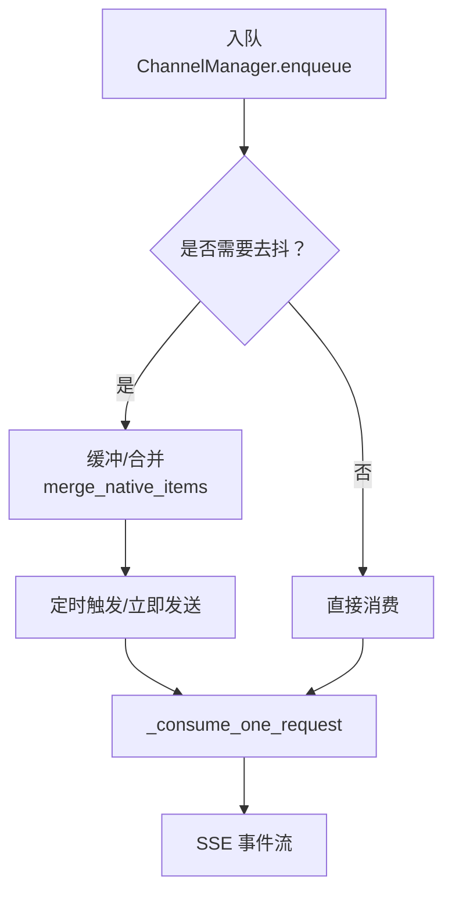
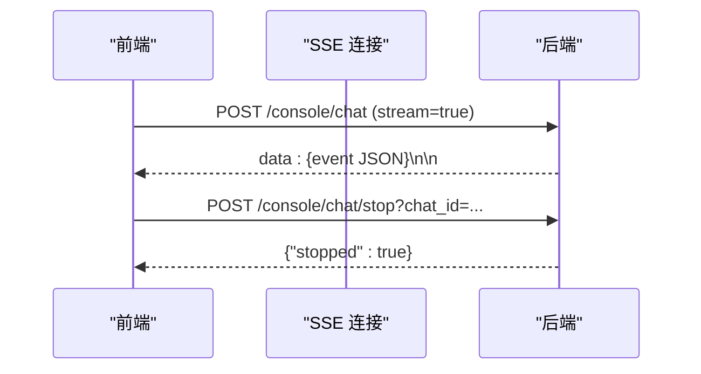
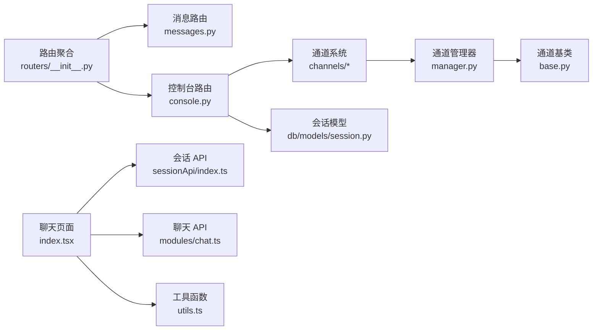

# 聊天交互 API

<cite>
**本文档引用的文件**
- [messages.py](file://src/copaw/app/routers/messages.py)
- [console.py](file://src/copaw/app/routers/console.py)
- [chat.ts](file://console/src/api/modules/chat.ts)
- [chat.ts 类型定义](file://console/src/api/types/chat.ts)
- [聊天页面 index.tsx](file://console/src/pages/Chat/index.tsx)
- [会话 API 实现](file://console/src/pages/Chat/sessionApi/index.ts)
- [聊天工具函数 utils.ts](file://console/src/pages/Chat/utils.ts)
- [通道基类 base.py](file://src/copaw/app/channels/base.py)
- [通道管理器 manager.py](file://src/copaw/app/channels/manager.py)
- [通道类型 schema.py](file://src/copaw/app/channels/schema.py)
- [会话模型 session.py](file://src/copaw/db/models/session.py)
- [路由聚合 __init__.py](file://src/copaw/app/routers/__init__.py)
</cite>

## 目录
1. [简介](#简介)
2. [项目结构](#项目结构)
3. [核心组件](#核心组件)
4. [架构总览](#架构总览)
5. [详细组件分析](#详细组件分析)
6. [依赖关系分析](#依赖关系分析)
7. [性能考虑](#性能考虑)
8. [故障排除指南](#故障排除指南)
9. [结论](#结论)

## 简介
本文件面向聊天交互 API 的使用者与维护者，系统性阐述消息发送、历史记录查询、会话管理、实时消息处理等能力。文档覆盖后端 FastAPI 接口、前端 Web UI 集成、通道抽象层、消息队列与任务跟踪机制，并提供 WebSocket 连接、消息格式、实时通信协议的详细说明。

## 项目结构
围绕聊天交互的关键模块分布如下：
- 后端 API 路由：消息发送、控制台聊天、文件上传、推送消息等
- 前端 Web UI：聊天界面、会话管理、消息历史、文件预览
- 通道系统：统一的消息入队、去抖、合并与消费流程
- 数据模型：会话与用户会话记录

**图表来源**
- [路由聚合 __init__.py:42-80](file://src/copaw/app/routers/__init__.py#L42-L80)
- [聊天页面 index.tsx:400-800](file://console/src/pages/Chat/index.tsx#L400-L800)
- [会话 API 实现:339-735](file://console/src/pages/Chat/sessionApi/index.ts#L339-L735)
- [聊天 API 模块:21-97](file://console/src/api/modules/chat.ts#L21-L97)

**章节来源**
- [路由聚合 __init__.py:42-80](file://src/copaw/app/routers/__init__.py#L42-L80)

## 核心组件
- 消息发送接口：支持通过指定通道向目标用户/会话发送文本消息，供代理主动推送使用
- 控制台聊天接口：基于 SSE 的流式对话，支持断开重连、停止生成
- 文件上传接口：支持聊天附件上传与预览
- 会话管理：列表、创建、更新、删除、批量删除；历史记录查询
- 通道系统：统一的消息入队、去抖、合并、消费与发送
- 任务跟踪：并发控制、取消、重连、持久化

**章节来源**
- [messages.py:78-187](file://src/copaw/app/routers/messages.py#L78-L187)
- [console.py:68-216](file://src/copaw/app/routers/console.py#L68-L216)
- [chat.ts:21-97](file://console/src/api/modules/chat.ts#L21-L97)
- [chat.ts 类型定义:1-39](file://console/src/api/types/chat.ts#L1-L39)
- [通道管理器 manager.py:68-711](file://src/copaw/app/channels/manager.py#L68-L711)
- [通道基类 base.py:70-800](file://src/copaw/app/channels/base.py#L70-L800)

## 架构总览
聊天交互采用“前端 Web UI + 后端 FastAPI + 通道系统”的分层设计。前端通过标准 HTTP 请求与 SSE 流与后端交互；后端通过通道管理器将消息入队、去抖合并、交由通道消费并回传事件；通道层负责将统一的 AgentRequest 转换为各渠道原生消息格式。

**图表来源**
- [聊天页面 index.tsx:632-642](file://console/src/pages/Chat/index.tsx#L632-L642)
- [聊天 API 模块:64-96](file://console/src/api/modules/chat.ts#L64-L96)
- [控制台聊天路由:75-148](file://src/copaw/app/routers/console.py#L75-L148)
- [通道管理器:110-125](file://src/copaw/app/channels/manager.py#L110-L125)
- [通道基类流式处理:446-535](file://src/copaw/app/channels/base.py#L446-L535)

## 详细组件分析

### 消息发送接口（代理主动推送）
- 接口路径：POST /messages/send
- 请求体包含：channel、target_user、target_session、text
- 头部参数：X-Agent-Id（可选，默认"default"）
- 行为：根据 agent_id 获取工作空间，通过通道管理器向指定通道发送文本消息
- 错误处理：通道不存在、发送失败、Agent 未找到等场景返回相应 HTTP 状态码

**图表来源**
- [消息发送路由:78-187](file://src/copaw/app/routers/messages.py#L78-L187)
- [通道管理器发送文本:659-711](file://src/copaw/app/channels/manager.py#L659-L711)

**章节来源**
- [messages.py:78-187](file://src/copaw/app/routers/messages.py#L78-L187)

### 控制台聊天接口（SSE 流式对话）
- 接口路径：POST /console/chat
- 请求体：支持 AgentRequest 或字典形式，包含 input、session_id、user_id、channel 等
- 响应：text/event-stream，事件格式为 data: JSON
- 断点续连：body.reconnect=true 可附加到正在运行的流
- 停止生成：POST /console/chat/stop，按 chat_id 停止

**图表来源**
- [控制台聊天路由:75-148](file://src/copaw/app/routers/console.py#L75-L148)
- [通道基类事件流:446-535](file://src/copaw/app/channels/base.py#L446-L535)
- [通道管理器启动消费:110-125](file://src/copaw/app/channels/manager.py#L110-L125)

**章节来源**
- [console.py:68-216](file://src/copaw/app/routers/console.py#L68-L216)
- [通道基类 base.py:446-535](file://src/copaw/app/channels/base.py#L446-L535)

### 文件上传与预览
- 上传接口：POST /console/upload，限制最大 10MB
- 返回：存储路径、原始文件名、大小
- 预览：/files/preview/{filename}，支持带 token 参数鉴权

**图表来源**
- [控制台上传路由:166-198](file://src/copaw/app/routers/console.py#L166-L198)
- [聊天 API 文件预览:42-55](file://console/src/api/modules/chat.ts#L42-L55)

**章节来源**
- [console.py:166-198](file://src/copaw/app/routers/console.py#L166-L198)
- [chat.ts:21-55](file://console/src/api/modules/chat.ts#L21-L55)

### 会话管理与历史查询
- 列表：GET /chats，支持按 user_id、channel 过滤
- 创建：POST /chats
- 获取：GET /chats/{id}
- 更新：PUT /chats/{id}
- 删除：DELETE /chats/{id}
- 批量删除：POST /chats/batch-delete
- 历史转换：前端将后端扁平消息转换为 UI 卡片格式

**图表来源**
- [聊天 API 会话接口:56-96](file://console/src/api/modules/chat.ts#L56-L96)
- [会话 API 实现:522-661](file://console/src/pages/Chat/sessionApi/index.ts#L522-L661)

**章节来源**
- [chat.ts:56-96](file://console/src/api/modules/chat.ts#L56-L96)
- [chat.ts 类型定义:1-39](file://console/src/api/types/chat.ts#L1-L39)
- [会话 API 实现:522-661](file://console/src/pages/Chat/sessionApi/index.ts#L522-L661)

### 通道系统与消息去抖
- 统一入队：ChannelManager 将消息按 (channel, session, priority) 入队
- 去抖合并：同会话短时间内无文本消息会被缓冲，待出现文本时合并发送
- 消费处理：通道实例 consume_one/_consume_one_request 处理批量合并后的消息
- 事件流：通道通过 SSE 格式事件回传给前端

**图表来源**
- [通道管理器入队与消费:255-446](file://src/copaw/app/channels/manager.py#L255-L446)
- [通道基类去抖逻辑:669-757](file://src/copaw/app/channels/base.py#L669-L757)
- [通道基类事件流:446-535](file://src/copaw/app/channels/base.py#L446-L535)

**章节来源**
- [通道管理器 manager.py:68-711](file://src/copaw/app/channels/manager.py#L68-L711)
- [通道基类 base.py:669-757](file://src/copaw/app/channels/base.py#L669-L757)

### WebSocket 连接与实时通信协议
- 当前实现采用 Server-Sent Events（SSE）进行实时通信，事件格式为 text/event-stream，每条事件以 data: 开头，末尾双换行分隔
- 前端通过 fetch + ReadableStream 或 EventSource 接收事件
- 断点续连：通过在请求体中设置 reconnect=true 附加到现有流
- 取消生成：通过 /console/chat/stop 按 chat_id 请求停止

**图表来源**
- [控制台聊天路由:75-148](file://src/copaw/app/routers/console.py#L75-L148)
- [聊天页面索引:792-800](file://console/src/pages/Chat/index.tsx#L792-L800)

**章节来源**
- [console.py:75-148](file://src/copaw/app/routers/console.py#L75-L148)
- [聊天页面 index.tsx:792-800](file://console/src/pages/Chat/index.tsx#L792-L800)

## 依赖关系分析
- 路由聚合：routers/__init__.py 将所有子路由注册到统一的 APIRouter
- 前端依赖：聊天页面依赖会话 API、聊天 API、工具函数与主题上下文
- 通道依赖：通道管理器依赖通道注册表、统一队列管理器、命令优先级策略
- 数据依赖：会话模型与用户会话模型用于会话状态与审计

**图表来源**
- [路由聚合 __init__.py:42-80](file://src/copaw/app/routers/__init__.py#L42-L80)
- [聊天页面 index.tsx:1-100](file://console/src/pages/Chat/index.tsx#L1-L100)
- [会话 API 实现:339-400](file://console/src/pages/Chat/sessionApi/index.ts#L339-L400)
- [通道管理器:68-120](file://src/copaw/app/channels/manager.py#L68-L120)
- [通道基类:70-120](file://src/copaw/app/channels/base.py#L70-L120)
- [会话模型:21-70](file://src/copaw/db/models/session.py#L21-L70)

**章节来源**
- [路由聚合 __init__.py:42-80](file://src/copaw/app/routers/__init__.py#L42-L80)
- [会话模型 session.py:21-70](file://src/copaw/db/models/session.py#L21-L70)

## 性能考虑
- 去抖与合并：通道层对无文本消息进行缓冲与合并，减少重复渲染与网络开销
- 统一队列：ChannelManager 使用统一队列与消费者循环，避免阻塞与资源竞争
- 断点续连：SSE 支持断线重连，降低长对话中断成本
- 并发控制：任务跟踪器确保同一会话不会重复执行，必要时可取消当前任务
- 文件上传：限制单次上传大小，避免内存与磁盘压力

[本节为通用指导，无需特定文件引用]

## 故障排除指南
- 通道未初始化或不可用：消息发送接口返回 500，提示 MultiAgentManager 未初始化或通道管理器未就绪
- 通道不存在：消息发送接口返回 404，提示通道未找到
- Agent 不存在：消息发送接口返回 404，提示 Agent 未找到
- 模型未配置：前端在发起聊天前校验模型，若未配置返回 400，提示先配置模型
- SSE 连接异常：检查后端日志与网络连通性，确认请求头与 body 格式正确

**章节来源**
- [messages.py:120-187](file://src/copaw/app/routers/messages.py#L120-L187)
- [console.py:82-148](file://src/copaw/app/routers/console.py#L82-L148)
- [聊天页面 utils:114-123](file://console/src/pages/Chat/utils.ts#L114-L123)

## 结论
本聊天交互 API 通过清晰的前后端分工、统一的通道抽象与任务跟踪机制，提供了稳定的消息发送、历史查询、会话管理与实时流式对话能力。SSE 协议与断点续连设计提升了用户体验，通道层的去抖与合并策略有效降低了系统负载。建议在生产环境中结合会话审计与任务追踪，进一步完善可观测性与可维护性。