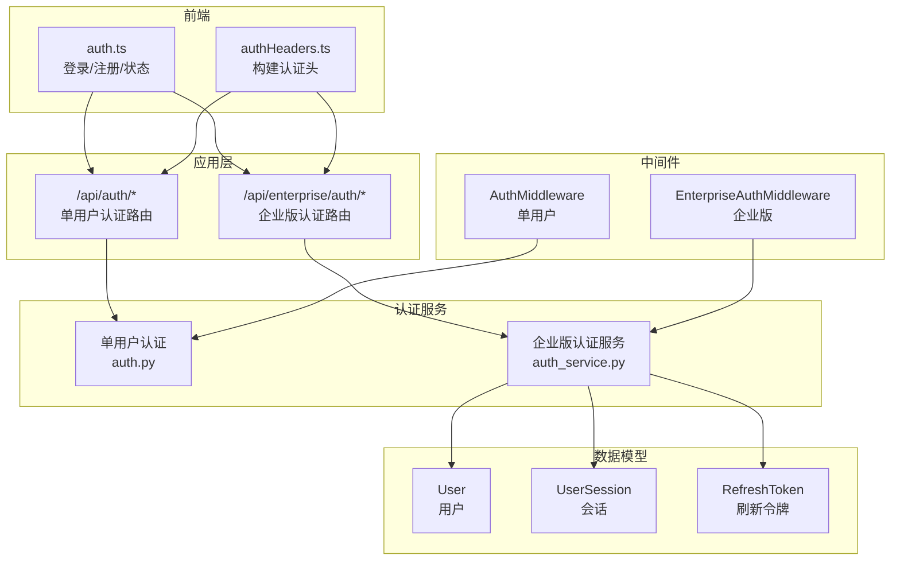
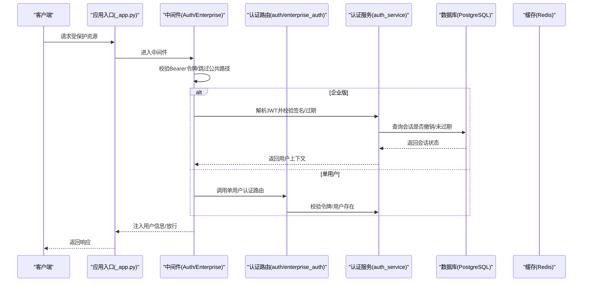
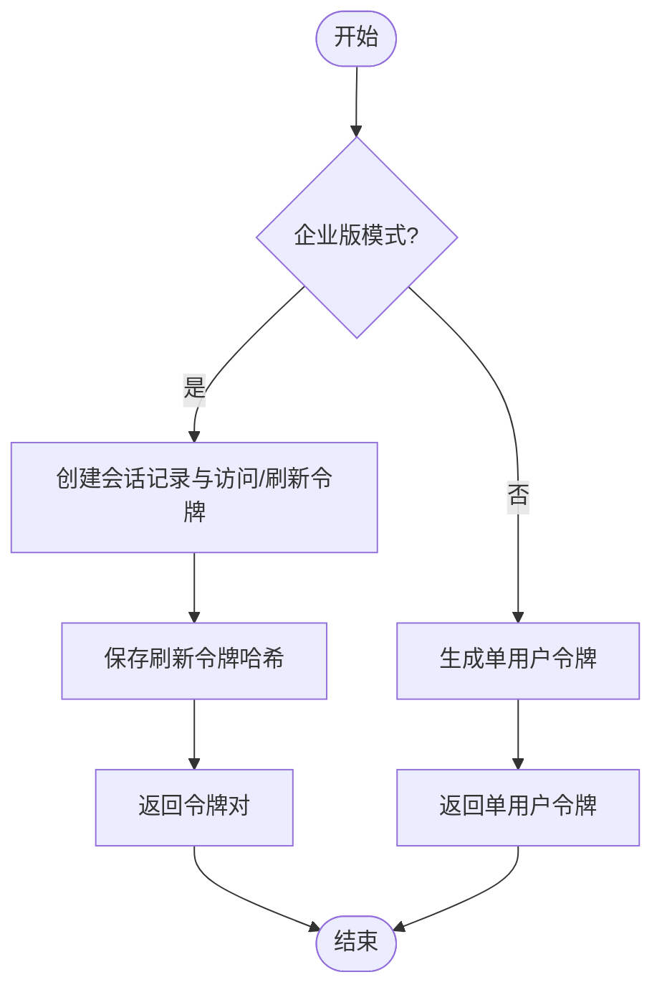
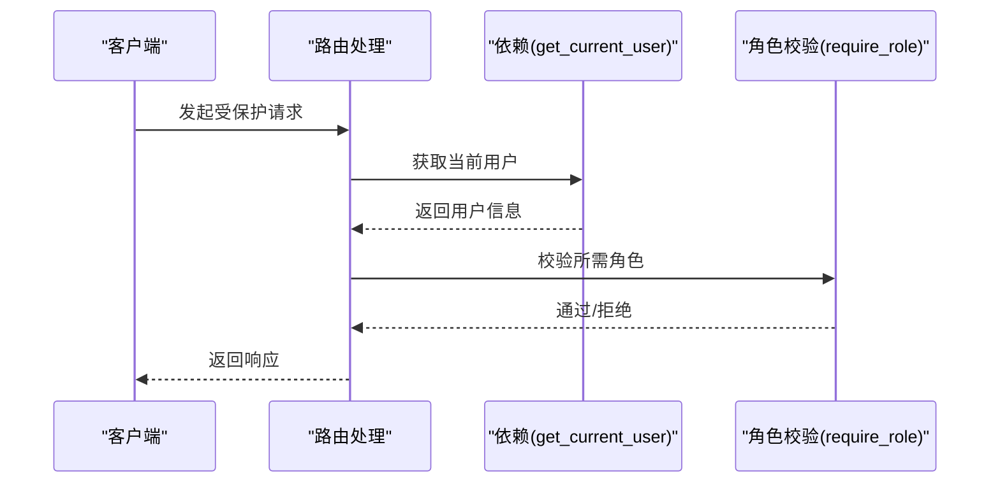
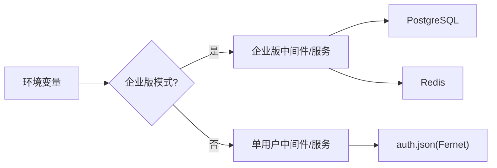

# 认证授权 API

<cite>
**本文档引用的文件**
- [auth.py](file://src/copaw/app/auth.py)
- [auth.py](file://src/copaw/app/routers/auth.py)
- [auth_service.py](file://src/copaw/enterprise/auth_service.py)
- [enterprise_auth.py](file://src/copaw/app/routers/enterprise_auth.py)
- [middleware.py](file://src/copaw/enterprise/middleware.py)
- [_app.py](file://src/copaw/app/_app.py)
- [user.py](file://src/copaw/db/models/user.py)
- [session.py](file://src/copaw/db/models/session.py)
- [auth.ts](file://console/src/api/modules/auth.ts)
- [authHeaders.ts](file://console/src/api/authHeaders.ts)
- [constant.py](file://src/copaw/constant.py)
- [secret_store.py](file://src/copaw/security/secret_store.py)
- [security.en.md](file://website/public/docs/security.en.md)
</cite>

## 目录
1. [简介](#简介)
2. [项目结构](#项目结构)
3. [核心组件](#核心组件)
4. [架构总览](#架构总览)
5. [详细组件分析](#详细组件分析)
6. [依赖关系分析](#依赖关系分析)
7. [性能考量](#性能考量)
8. [故障排查指南](#故障排查指南)
9. [结论](#结论)
10. [附录](#附录)

## 简介
本文件面向认证授权 API 的使用者与维护者，系统性说明用户登录、注册、令牌验证、更新资料、登出以及企业版多用户认证与会话管理的完整流程与接口规范。文档覆盖以下关键主题：
- 单用户模式与企业版模式的差异与切换
- 登录流程与令牌签发、校验机制
- 会话生命周期与令牌撤销
- 权限与角色校验（企业版）
- 密码重置与 MFA（企业版）
- 认证头设置、错误码说明与安全最佳实践

## 项目结构
认证授权相关代码主要分布在以下模块：
- 应用层路由：单用户认证路由与企业版认证路由
- 认证服务：单用户密码哈希、JWT 签发与校验、文件级机密存储
- 企业版服务：多用户注册、登录、登出、令牌验证、MFA、会话与审计
- 中间件：请求拦截与鉴权、角色校验、DLP 内容扫描
- 数据模型：用户、会话、刷新令牌
- 前端 API 封装：登录、注册、状态查询、资料更新

图表来源
- [auth.py:1-204](file://src/copaw/app/routers/auth.py#L1-L204)
- [auth_service.py:1-367](file://src/copaw/enterprise/auth_service.py#L1-L367)
- [middleware.py:1-191](file://src/copaw/enterprise/middleware.py#L1-L191)
- [user.py:1-158](file://src/copaw/db/models/user.py#L1-L158)
- [session.py:1-116](file://src/copaw/db/models/session.py#L1-L116)
- [auth.ts:1-76](file://console/src/api/modules/auth.ts#L1-L76)
- [authHeaders.ts:1-24](file://console/src/api/authHeaders.ts#L1-L24)

章节来源
- [auth.py:1-204](file://src/copaw/app/routers/auth.py#L1-L204)
- [auth_service.py:1-367](file://src/copaw/enterprise/auth_service.py#L1-L367)
- [middleware.py:1-191](file://src/copaw/enterprise/middleware.py#L1-L191)

## 核心组件
- 单用户认证模块（auth.py）
  - 提供密码哈希、JWT 签发/校验、认证开关控制、自动注册、凭据更新、文件级机密存储
  - 默认关闭，通过环境变量开启；仅允许单个用户注册
- 企业版认证服务（auth_service.py）
  - 多用户注册/登录/登出、JWT 访问令牌与刷新令牌、bcrypt 密码哈希、MFA、会话审计与撤销
  - 使用 PostgreSQL 与 Redis 支撑会话与审计
- 企业版中间件（middleware.py）
  - Bearer 令牌校验、注入用户上下文、角色校验依赖、DLP 内容扫描
- 数据模型（user.py、session.py）
  - 用户、会话、刷新令牌的 ORM 映射与字段约束
- 前端封装（auth.ts、authHeaders.ts）
  - 登录/注册/状态查询、资料更新、认证头构建

章节来源
- [auth.py:1-441](file://src/copaw/app/auth.py#L1-L441)
- [auth_service.py:1-367](file://src/copaw/enterprise/auth_service.py#L1-L367)
- [middleware.py:1-191](file://src/copaw/enterprise/middleware.py#L1-L191)
- [user.py:1-158](file://src/copaw/db/models/user.py#L1-L158)
- [session.py:1-116](file://src/copaw/db/models/session.py#L1-L116)
- [auth.ts:1-76](file://console/src/api/modules/auth.ts#L1-L76)
- [authHeaders.ts:1-24](file://console/src/api/authHeaders.ts#L1-L24)

## 架构总览
系统根据环境变量选择运行模式：
- 单用户模式：使用 AuthMiddleware，JWT 令牌有效期 7 天，支持注册与凭据更新
- 企业版模式：使用 EnterpriseAuthMiddleware，支持多用户、MFA、会话撤销、审计与 DLP 扫描

图表来源
- [_app.py:546-553](file://src/copaw/app/_app.py#L546-L553)
- [middleware.py:69-143](file://src/copaw/enterprise/middleware.py#L69-L143)
- [auth.py:371-441](file://src/copaw/app/auth.py#L371-L441)
- [auth_service.py:233-270](file://src/copaw/enterprise/auth_service.py#L233-L270)

## 详细组件分析

### 单用户认证 API
- 接口概览
  - GET /api/auth/status：查询认证开关与是否存在用户
  - POST /api/auth/login：用户名+密码登录，返回 token
  - POST /api/auth/register：首次注册（仅一次），需要显式开启认证
  - GET /api/auth/verify：校验 Bearer 令牌有效性
  - POST /api/auth/update-profile：更新用户名或密码（需当前密码）

- 关键行为
  - 认证开关：COPAW_AUTH_ENABLED=true 后方可启用
  - 仅允许单个用户注册；注册后可更新凭据
  - 令牌有效期 7 天；密码更新会轮换签名密钥，使旧会话失效
  - 文件级机密存储：auth.json 使用 Fernet 加密敏感字段

- 安全要点
  - 本地回环跳过认证（便于 CLI）
  - OPTIONS 预检请求不强制认证
  - 令牌通过 Authorization: Bearer 传递

章节来源
- [auth.py:43-204](file://src/copaw/app/routers/auth.py#L43-L204)
- [auth.py:223-340](file://src/copaw/app/auth.py#L223-L340)
- [secret_store.py:250-285](file://src/copaw/security/secret_store.py#L250-L285)
- [security.en.md:726-740](file://website/public/docs/security.en.md#L726-L740)

### 企业版认证 API
- 接口概览
  - POST /api/enterprise/auth/login：登录获取访问/刷新令牌，支持 MFA
  - POST /api/enterprise/auth/register：注册新用户（管理员或首用户引导）
  - POST /api/enterprise/auth/logout：撤销当前会话
  - GET /api/enterprise/auth/me：获取当前用户信息
  - PUT /api/enterprise/auth/password：修改密码（触发会话撤销）
  - POST /api/enterprise/auth/mfa/setup：生成 MFA 秘钥与二维码链接
  - POST /api/enterprise/auth/mfa/verify：启用 MFA

- 关键行为
  - 多用户：基于 PostgreSQL 用户表，bcrypt 密码哈希
  - 令牌：访问令牌 HS256，带 jti；刷新令牌一次性哈希存储
  - 会话：UserSession 表记录会话与撤销状态，Redis 镜像加速
  - 审计：登录/注册/登出/改密/MFA 启用均写入审计日志
  - 角色：令牌包含角色列表，可通过依赖进行角色校验

- 安全要点
  - MFA 可选启用，验证码一次性校验
  - 会话撤销即时生效（数据库标记）
  - DLP 内容扫描在响应阶段执行（JSON 类型）

章节来源
- [enterprise_auth.py:61-234](file://src/copaw/app/routers/enterprise_auth.py#L61-L234)
- [auth_service.py:107-367](file://src/copaw/enterprise/auth_service.py#L107-L367)
- [user.py:25-94](file://src/copaw/db/models/user.py#L25-L94)
- [session.py:21-71](file://src/copaw/db/models/session.py#L21-L71)
- [middleware.py:164-191](file://src/copaw/enterprise/middleware.py#L164-L191)

### 令牌管理与会话生命周期
- 单用户模式
  - 令牌格式：HMAC-SHA256 签名的 base64(payload).signature
  - 有效期：7 天；密码重置或签名密钥轮换会失效旧令牌
  - 机密存储：jwt_secret 使用 Fernet 加密

- 企业版模式
  - 访问令牌：HS256，含 sub、username、roles、jti、exp、iat、type
  - 刷新令牌：一次性使用，以 SHA-256 哈希存储于数据库
  - 会话撤销：通过 UserSession.revoke 标记，验证时检查未撤销且未过期
  - 审计与告警：登录失败触发异常检测与审计记录

图表来源
- [auth_service.py:190-229](file://src/copaw/enterprise/auth_service.py#L190-L229)
- [auth.py:121-166](file://src/copaw/app/auth.py#L121-L166)

章节来源
- [auth.py:121-166](file://src/copaw/app/auth.py#L121-L166)
- [auth_service.py:190-229](file://src/copaw/enterprise/auth_service.py#L190-L229)
- [session.py:76-116](file://src/copaw/db/models/session.py#L76-L116)

### 权限与角色校验（企业版）
- 中间件注入用户上下文：user_id、username、roles、jti
- 依赖函数：get_current_user 返回当前用户字典
- 角色校验：require_role 工厂函数，未满足任一角色返回 403

图表来源
- [middleware.py:164-191](file://src/copaw/enterprise/middleware.py#L164-L191)

章节来源
- [middleware.py:164-191](file://src/copaw/enterprise/middleware.py#L164-L191)

### 密码重置与 MFA（企业版）
- 密码重置
  - 通过 /api/enterprise/auth/password 修改密码，触发会话撤销
  - 建议结合组织内部自助门户与 MFA 引导
- MFA
  - /api/enterprise/auth/mfa/setup 生成秘钥与二维码
  - /api/enterprise/auth/mfa/verify 启用 MFA（验证码一次性校验）

章节来源
- [enterprise_auth.py:176-234](file://src/copaw/app/routers/enterprise_auth.py#L176-L234)
- [auth_service.py:297-328](file://src/copaw/enterprise/auth_service.py#L297-L328)

### 认证头设置与前端集成
- 认证头
  - Authorization: Bearer <token>
  - 可选：X-Agent-Id（多智能体场景）
- 前端封装
  - auth.ts：登录、注册、状态查询、资料更新
  - authHeaders.ts：统一构建认证头与代理头

章节来源
- [auth.ts:15-76](file://console/src/api/modules/auth.ts#L15-L76)
- [authHeaders.ts:4-23](file://console/src/api/authHeaders.ts#L4-L23)

## 依赖关系分析
- 运行模式选择
  - COPAW_ENTERPRISE_ENABLED=true 时启用企业版中间件与数据库/缓存初始化
  - 否则启用单用户中间件与本地 auth.json
- 认证服务依赖
  - 企业版：PostgreSQL 用户/会话/刷新令牌表、Redis（会话镜像）、审计服务
  - 单用户：本地 auth.json、Fernet 机密存储、HMAC-SHA256 JWT
- 中间件耦合
  - 企业版中间件负责令牌解析与注入上下文，路由按需调用 AuthService 进行会话撤销检查

图表来源
- [_app.py:177-204](file://src/copaw/app/_app.py#L177-L204)
- [auth.py:42-46](file://src/copaw/app/auth.py#L42-L46)
- [secret_store.py:250-285](file://src/copaw/security/secret_store.py#L250-L285)

章节来源
- [_app.py:177-204](file://src/copaw/app/_app.py#L177-L204)
- [auth.py:42-46](file://src/copaw/app/auth.py#L42-L46)
- [secret_store.py:250-285](file://src/copaw/security/secret_store.py#L250-L285)

## 性能考量
- 企业版中间件仅做签名与过期校验，会话撤销检查在路由内按需执行，避免全局数据库查询
- 会话与审计日志写入采用异步会话与索引优化（会话表 jti 唯一索引、过期时间索引）
- 响应阶段 DLP 扫描仅对 JSON 类型内容处理，避免对非 JSON 响应造成额外开销

## 故障排查指南
- 常见错误与定位
  - 401 未认证：缺少或无效 Bearer 令牌；检查 Authorization 头与令牌有效期
  - 403 禁止访问：企业版角色不足；确认用户角色与 require_role 依赖
  - 409 注册冲突：单用户模式下已存在用户；确认 COPAW_AUTH_ENABLED 与注册流程
  - 428 需要 MFA：登录时用户已启用 MFA，需提供验证码
- 日志与审计
  - 企业版登录失败会记录审计事件与异常检测告警
  - 会话撤销与密码变更均有审计日志
- 安全建议
  - 生产环境务必设置 COPAW_JWT_SECRET（企业版）与 COPAW_AUTH_ENABLED（单用户）
  - 定期轮换密钥与监控异常登录行为
  - 使用 HTTPS 传输，限制静态资源与公共路径暴露

章节来源
- [enterprise_auth.py:85-121](file://src/copaw/app/routers/enterprise_auth.py#L85-L121)
- [middleware.py:116-141](file://src/copaw/enterprise/middleware.py#L116-L141)
- [security.en.md:726-740](file://website/public/docs/security.en.md#L726-L740)

## 结论
本认证授权体系提供从单用户到企业版的完整能力：单用户模式强调简单与本地化，企业版模式强调多用户、会话与审计、MFA 与角色控制。通过明确的路由、中间件与服务边界，配合机密存储与 DLP 扫描，既保证易用性也兼顾安全性。

## 附录

### API 使用清单
- 单用户模式
  - GET /api/auth/status：检查认证开关与用户存在
  - POST /api/auth/login：登录获取 token
  - POST /api/auth/register：首次注册（需 COPAW_AUTH_ENABLED=true）
  - GET /api/auth/verify：校验令牌
  - POST /api/auth/update-profile：更新用户名/密码
- 企业版模式
  - POST /api/enterprise/auth/login：登录获取访问/刷新令牌，支持 MFA
  - POST /api/enterprise/auth/register：注册用户
  - POST /api/enterprise/auth/logout：登出撤销会话
  - GET /api/enterprise/auth/me：获取当前用户信息
  - PUT /api/enterprise/auth/password：修改密码
  - POST /api/enterprise/auth/mfa/setup：生成 MFA 秘钥与二维码
  - POST /api/enterprise/auth/mfa/verify：启用 MFA

章节来源
- [auth.py:88-204](file://src/copaw/app/routers/auth.py#L88-L204)
- [enterprise_auth.py:61-234](file://src/copaw/app/routers/enterprise_auth.py#L61-L234)

### 认证头与安全最佳实践
- 认证头
  - Authorization: Bearer <token>
  - X-Agent-Id（可选，多智能体）
- 最佳实践
  - 令牌有效期与轮换策略
  - 机密字段加密存储
  - 本地回环与预检请求豁免
  - 企业版角色与最小权限原则

章节来源
- [authHeaders.ts:4-23](file://console/src/api/authHeaders.ts#L4-L23)
- [security.en.md:726-740](file://website/public/docs/security.en.md#L726-L740)