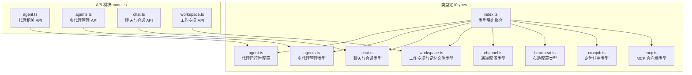
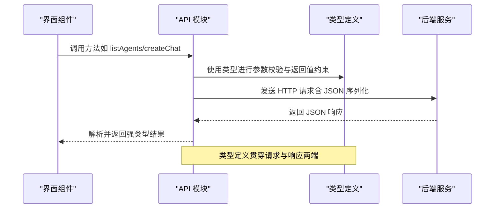
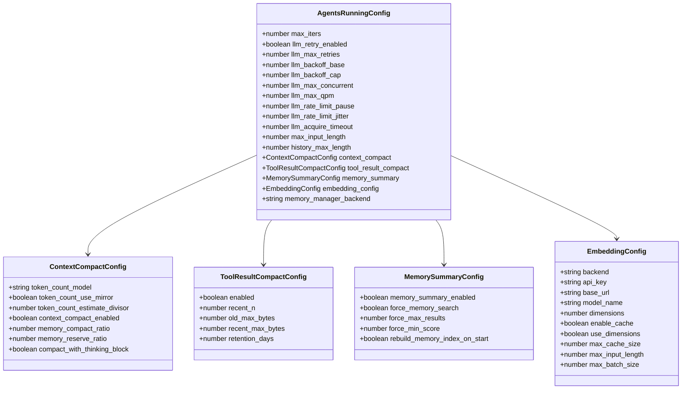
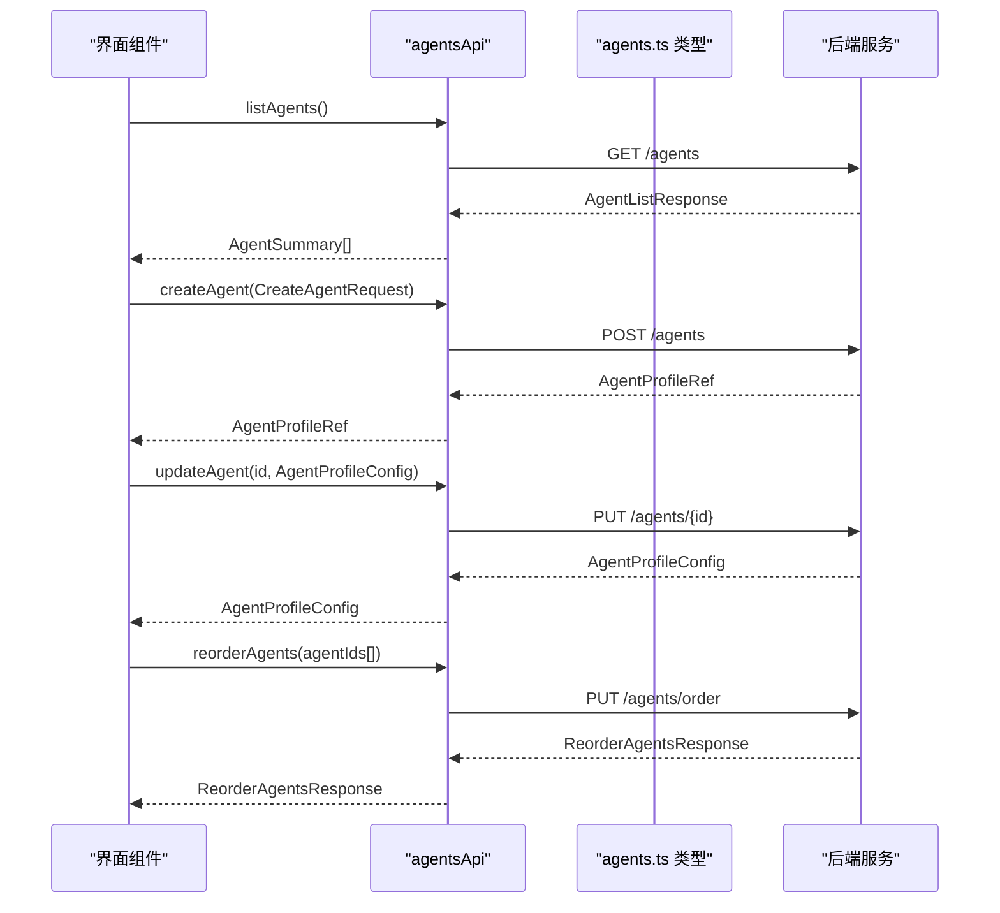
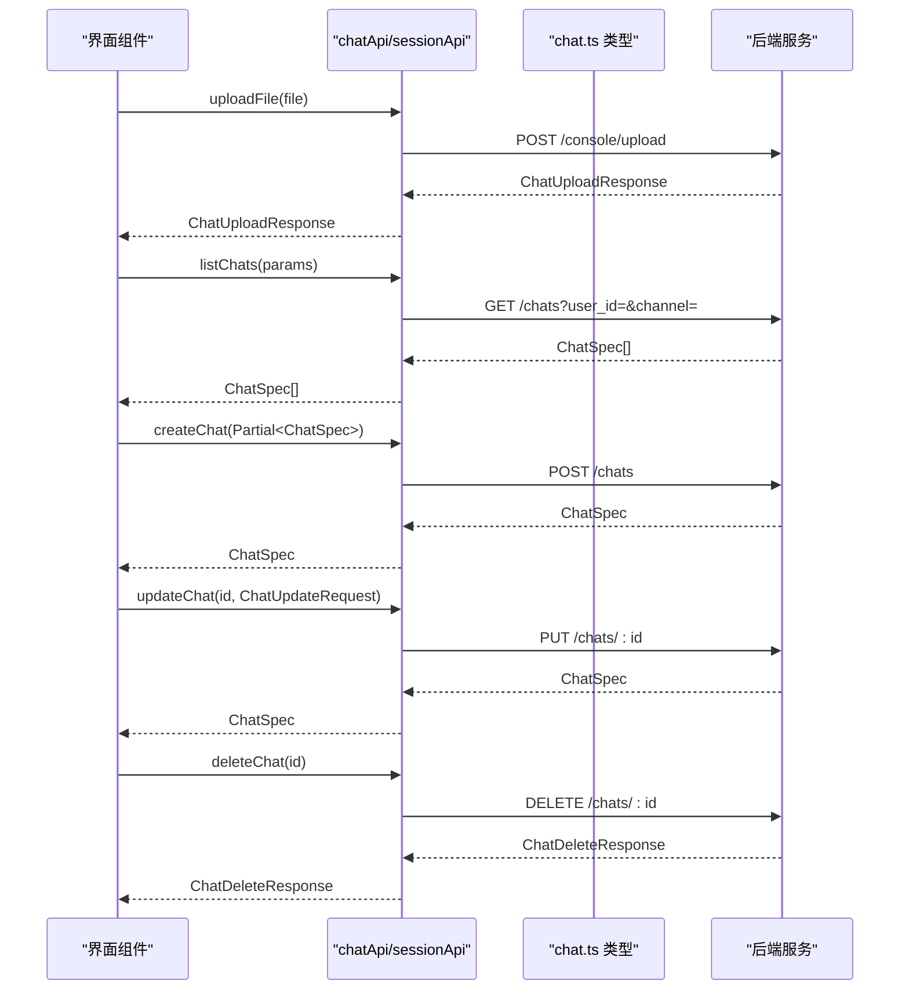
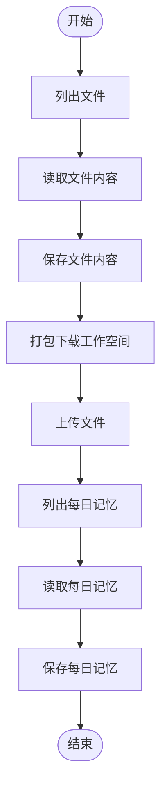
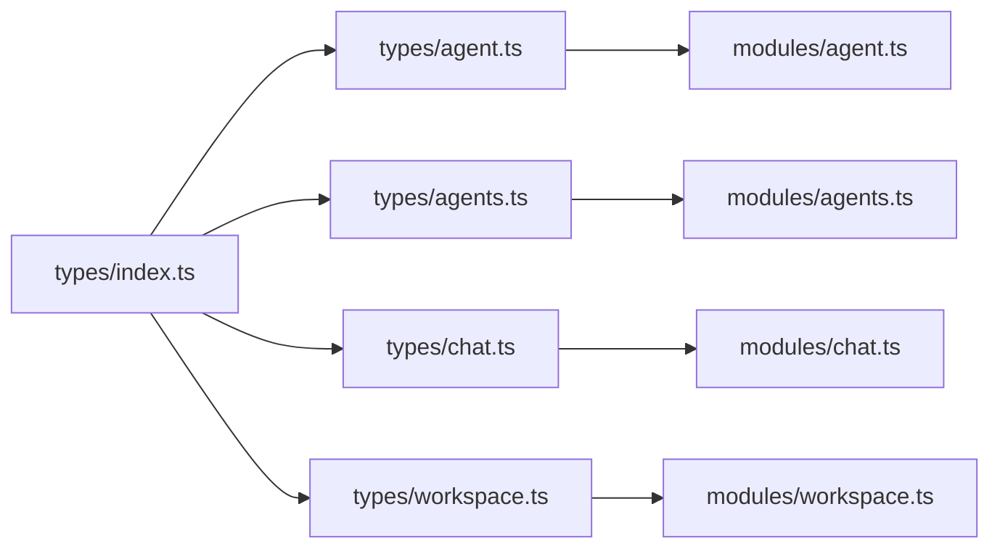

# API 类型定义

<cite>
**本文档引用的文件**
- [agent.ts](file://console/src/api/types/agent.ts)
- [agents.ts](file://console/src/api/types/agents.ts)
- [chat.ts](file://console/src/api/types/chat.ts)
- [workspace.ts](file://console/src/api/types/workspace.ts)
- [index.ts](file://console/src/api/types/index.ts)
- [agent.ts](file://console/src/api/modules/agent.ts)
- [agents.ts](file://console/src/api/modules/agents.ts)
- [chat.ts](file://console/src/api/modules/chat.ts)
- [workspace.ts](file://console/src/api/modules/workspace.ts)
- [channel.ts](file://console/src/api/types/channel.ts)
- [heartbeat.ts](file://console/src/api/types/heartbeat.ts)
- [cronjob.ts](file://console/src/api/types/cronjob.ts)
- [mcp.ts](file://console/src/api/types/mcp.ts)
</cite>

## 目录
1. [简介](#简介)
2. [项目结构](#项目结构)
3. [核心组件](#核心组件)
4. [架构总览](#架构总览)
5. [详细组件分析](#详细组件分析)
6. [依赖分析](#依赖分析)
7. [性能考虑](#性能考虑)
8. [故障排除指南](#故障排除指南)
9. [结论](#结论)
10. [附录](#附录)

## 简介
本文件系统性梳理 CoPaw 前端 API 的 TypeScript 类型定义，重点覆盖代理（Agent）、多代理管理（Agents）、聊天（Chat）与工作空间（Workspace）相关的核心类型接口。文档从类型设计原则、作用域与属性语义、数据结构与约束条件出发，结合实际 API 模块调用关系，给出最佳实践与扩展建议，帮助开发者在不深入后端实现细节的前提下，正确使用与扩展前端类型体系。

## 项目结构
前端类型主要位于 `console/src/api/types/` 目录，API 模块位于 `console/src/api/modules/` 目录。类型通过统一的导出入口进行聚合，便于按需引入与维护。

图表来源
- [index.ts:1-13](file://console/src/api/types/index.ts#L1-L13)
- [agent.ts:1-67](file://console/src/api/types/agent.ts#L1-L67)
- [agents.ts:1-47](file://console/src/api/types/agents.ts#L1-L47)
- [chat.ts:1-39](file://console/src/api/types/chat.ts#L1-L39)
- [workspace.ts:1-22](file://console/src/api/types/workspace.ts#L1-L22)
- [agent.ts:1-86](file://console/src/api/modules/agent.ts#L1-L86)
- [agents.ts:1-79](file://console/src/api/modules/agents.ts#L1-L79)
- [chat.ts:1-137](file://console/src/api/modules/chat.ts#L1-L137)
- [workspace.ts:1-149](file://console/src/api/modules/workspace.ts#L1-L149)

章节来源
- [index.ts:1-13](file://console/src/api/types/index.ts#L1-L13)

## 核心组件
本节对关键类型进行分门别类的说明，包括代理配置、聊天消息、工作空间文件等。

- 代理运行时配置类型
  - 作用域：描述代理执行过程中的运行参数与资源限制，如并发、重试、上下文压缩、工具结果压缩、嵌入配置等。
  - 关键字段：最大迭代次数、LLM 重试策略、上下文压缩配置、工具结果压缩配置、内存摘要配置、嵌入配置、内存管理后端等。
  - 约束条件：部分数值字段存在最小值或范围要求；嵌入配置包含启用缓存、维度、批大小等可选参数。
  - 参考路径：[AgentsRunningConfig:48-66](file://console/src/api/types/agent.ts#L48-L66)

- 多代理管理类型
  - 作用域：用于列出、创建、更新、删除代理，以及管理代理顺序、启用状态与工作空间文件。
  - 关键字段：代理概要（id、name、description、workspace_dir、enabled）、代理配置（channels、mcp、heartbeat、running、llm_routing、tools、security 等为通用对象）、创建请求（name、description、workspace_dir、language、skill_names）。
  - 约束条件：代理 ID 与工作空间目录需唯一且有效；语言与技能名称遵循后端约定。
  - 参考路径：[AgentSummary:3-9](file://console/src/api/types/agents.ts#L3-L9)、[AgentProfileConfig:20-33](file://console/src/api/types/agents.ts#L20-L33)、[CreateAgentRequest:35-41](file://console/src/api/types/agents.ts#L35-L41)

- 聊天与会话类型
  - 作用域：描述聊天会话的标识、元数据、状态、消息列表与更新操作。
  - 关键字段：ChatSpec（id、session_id、user_id、channel、name、created_at、updated_at、meta、status、pinned）、Message（role、content）、ChatHistory（messages、status）、更新请求（name、pinned）。
  - 约束条件：状态枚举限定为 idle 或 running；时间戳采用 ISO 8601 字符串或空值；消息内容支持任意结构。
  - 参考路径：[ChatSpec:3-14](file://console/src/api/types/chat.ts#L3-L14)、[Message:16-20](file://console/src/api/types/chat.ts#L16-L20)、[ChatHistory:22-25](file://console/src/api/types/chat.ts#L22-L25)、[ChatUpdateRequest:27-30](file://console/src/api/types/chat.ts#L27-L30)

- 工作空间与记忆文件类型
  - 作用域：描述工作空间内的 Markdown 文件信息与内容、每日记忆文件信息与内容。
  - 关键字段：MdFileInfo（filename、path、size、created_time、modified_time）、MdFileContent（content）、MarkdownFile（继承 MdFileInfo 并扩展 updated_at、enabled）、DailyMemoryFile（继承 MdFileInfo 并扩展 date、updated_at）。
  - 约束条件：文件名与路径需合法；时间戳转换为毫秒级时间戳；记忆文件名通常为日期格式。
  - 参考路径：[MdFileInfo:1-7](file://console/src/api/types/workspace.ts#L1-L7)、[MdFileContent:9-11](file://console/src/api/types/workspace.ts#L9-L11)、[MarkdownFile:13-16](file://console/src/api/types/workspace.ts#L13-L16)、[DailyMemoryFile:18-21](file://console/src/api/types/workspace.ts#L18-L21)

章节来源
- [agent.ts:1-67](file://console/src/api/types/agent.ts#L1-L67)
- [agents.ts:1-47](file://console/src/api/types/agents.ts#L1-L47)
- [chat.ts:1-39](file://console/src/api/types/chat.ts#L1-L39)
- [workspace.ts:1-22](file://console/src/api/types/workspace.ts#L1-L22)

## 架构总览
前端类型与 API 模块之间通过明确的契约进行交互：API 模块负责网络请求与响应解析，类型定义确保请求体、响应体与中间状态的数据一致性。

图表来源
- [agents.ts:1-79](file://console/src/api/modules/agents.ts#L1-L79)
- [chat.ts:1-137](file://console/src/api/modules/chat.ts#L1-L137)
- [agent.ts:1-86](file://console/src/api/modules/agent.ts#L1-L86)
- [workspace.ts:1-149](file://console/src/api/modules/workspace.ts#L1-L149)

## 详细组件分析

### 代理运行时配置类型（AgentsRunningConfig）
- 设计要点
  - 将 LLM 执行相关的重试、并发、速率限制等参数集中在一个配置对象中，便于统一管理与持久化。
  - 上下文压缩、工具结果压缩、内存摘要与嵌入配置作为子配置对象，体现“分而治之”的设计思想。
- 数据结构与复杂度
  - 结构为扁平配置对象，访问复杂度 O(1)，适合频繁读取与更新。
- 错误处理与边界
  - 数值参数需注意非负与合理范围；嵌入配置的缓存与批大小需与硬件能力匹配。
- 最佳实践
  - 在应用启动时加载并校验配置；变更后通过更新接口提交，避免直接修改本地状态。
  - 对于高并发场景，优先调整最大并发与队列超时，其次再优化上下文压缩策略。

图表来源
- [agent.ts:9-66](file://console/src/api/types/agent.ts#L9-L66)

章节来源
- [agent.ts:1-67](file://console/src/api/types/agent.ts#L1-L67)
- [agent.ts:28-35](file://console/src/api/modules/agent.ts#L28-L35)

### 多代理管理类型（Agents）
- 设计要点
  - 使用概要、配置、创建请求、排序响应等类型，形成“列表—详情—变更—排序”的闭环。
  - 支持工作空间文件与记忆文件的读写，便于代理知识与经验的持久化。
- 数据流
  - 列表与详情：通过 GET 接口返回概要与完整配置。
  - 创建与更新：通过 POST/PUT 接口提交创建/更新请求。
  - 排序与启用切换：通过 PUT/PATCH 接口提交排序数组与启用状态。
- 最佳实践
  - 在 UI 中使用不可变更新策略，先本地预览再提交后端；对排序变更采用批量提交。
  - 对工作空间文件与记忆文件的操作增加确认提示，避免误删。

图表来源
- [agents.ts:12-55](file://console/src/api/modules/agents.ts#L12-L55)
- [agents.ts:11-18](file://console/src/api/types/agents.ts#L11-L18)

章节来源
- [agents.ts:1-47](file://console/src/api/types/agents.ts#L1-L47)
- [agents.ts:1-79](file://console/src/api/modules/agents.ts#L1-L79)

### 聊天与会话类型（Chat）
- 设计要点
  - ChatSpec 与 Session（别名）用于标识与管理会话；ChatHistory 提供消息列表与状态。
  - 支持上传附件、文件预览、批量删除、停止会话等操作。
- 数据流
  - 列表与详情：通过 GET 接口返回 ChatSpec 或 ChatHistory。
  - 更新与删除：通过 PUT/DELETE 接口提交更新请求或删除请求。
  - 上传与预览：通过独立接口完成文件上传与 URL 生成。
- 最佳实践
  - 对消息内容进行必要的安全过滤与长度控制；对大文件上传采用分片或进度反馈。
  - 会话状态变化时及时刷新 UI，避免脏读。

图表来源
- [chat.ts:21-97](file://console/src/api/modules/chat.ts#L21-L97)
- [chat.ts:3-39](file://console/src/api/types/chat.ts#L3-L39)

章节来源
- [chat.ts:1-39](file://console/src/api/types/chat.ts#L1-L39)
- [chat.ts:1-137](file://console/src/api/modules/chat.ts#L1-L137)

### 工作空间类型（Workspace）
- 设计要点
  - MdFileInfo/MdFileContent 用于文件元数据与内容的统一表示；MarkdownFile/DailyMemoryFile 扩展了时间戳与启用状态。
  - 提供文件列表、读取、保存、打包下载、上传、每日记忆读写等能力。
- 数据流
  - 文件管理：listFiles/loadFile/saveFile。
  - 打包下载：downloadWorkspace 返回 Blob 与文件名。
  - 上传：uploadFile 返回成功状态与消息。
  - 记忆文件：listDailyMemory/loadDailyMemory/saveDailyMemory。
- 最佳实践
  - 下载与上传前进行文件大小与类型校验；对大文件采用断点续传或进度条。
  - 记忆文件命名与日期格式保持一致，避免冲突。

图表来源
- [workspace.ts:39-148](file://console/src/api/modules/workspace.ts#L39-L148)
- [workspace.ts:1-22](file://console/src/api/types/workspace.ts#L1-L22)

章节来源
- [workspace.ts:1-22](file://console/src/api/types/workspace.ts#L1-L22)
- [workspace.ts:1-149](file://console/src/api/modules/workspace.ts#L1-L149)

### 其他相关类型（通道、心跳、定时任务、MCP）
- 通道配置类型（channel.ts）
  - 描述多种即时通讯与语音通道的配置项，包含通用开关、前缀、策略与各平台特有参数。
  - 适用范围：企业级多渠道接入与权限控制。
- 心跳配置类型（heartbeat.ts）
  - 描述心跳开关、周期、目标与活跃时段等配置。
  - 适用范围：系统健康监控与自动恢复。
- 定时任务类型（cronjob.ts）
  - 描述计划任务的调度、派发、运行时参数与视图扩展。
  - 适用范围：自动化文本/代理任务的周期执行。
- MCP 客户端类型（mcp.ts）
  - 描述 MCP 客户端的连接方式、命令行参数、环境变量与工具信息。
  - 适用范围：模型上下文协议客户端的统一管理。

章节来源
- [channel.ts:1-153](file://console/src/api/types/channel.ts#L1-L153)
- [heartbeat.ts:1-12](file://console/src/api/types/heartbeat.ts#L1-L12)
- [cronjob.ts:1-58](file://console/src/api/types/cronjob.ts#L1-L58)
- [mcp.ts:1-89](file://console/src/api/types/mcp.ts#L1-L89)

## 依赖分析
类型与模块之间的依赖关系清晰：API 模块通过导入类型来约束请求与响应，类型导出入口统一聚合，便于按需引入。

图表来源
- [index.ts:1-13](file://console/src/api/types/index.ts#L1-L13)
- [agent.ts:1-86](file://console/src/api/modules/agent.ts#L1-L86)
- [agents.ts:1-79](file://console/src/api/modules/agents.ts#L1-L79)
- [chat.ts:1-137](file://console/src/api/modules/chat.ts#L1-L137)
- [workspace.ts:1-149](file://console/src/api/modules/workspace.ts#L1-L149)

章节来源
- [index.ts:1-13](file://console/src/api/types/index.ts#L1-L13)

## 性能考虑
- 类型层面的性能影响较小，但合理的类型设计可减少运行时错误与重复校验开销。
- 对高频接口（如聊天消息列表、文件列表）建议：
  - 使用分页或懒加载策略；
  - 对时间戳进行本地缓存与增量更新；
  - 对大文件操作采用异步与进度反馈机制。

## 故障排除指南
- 类型不匹配
  - 现象：编译时报错或运行时抛出类型异常。
  - 排查：检查请求体是否符合类型定义；确认可选字段是否正确处理。
- 网络请求失败
  - 现象：API 返回非 2xx 状态码。
  - 排查：查看响应体文本与状态码；确认鉴权头与请求体序列化是否正确。
- 文件操作异常
  - 现象：上传/下载失败或文件损坏。
  - 排查：检查文件大小限制、MIME 类型、存储路径与权限；对大文件采用分片策略。

章节来源
- [chat.ts:23-40](file://console/src/api/modules/chat.ts#L23-L40)
- [workspace.ts:61-114](file://console/src/api/modules/workspace.ts#L61-L114)

## 结论
CoPaw 前端 API 类型体系围绕代理、多代理、聊天与工作空间四大主题构建，既保证了类型安全，又兼顾了扩展性与易用性。通过统一的类型导出与严格的 API 模块契约，开发者可以高效地进行功能开发与维护。建议在后续迭代中持续完善类型注释与约束校验，提升整体代码质量与可维护性。

## 附录
- 类型使用最佳实践
  - 明确区分“请求类型”与“响应类型”，避免混用。
  - 对可选字段进行显式判空与默认值处理。
  - 对复杂对象采用局部类型拆分，提升可读性与复用性。
- 扩展指南
  - 新增类型时，优先在 types 目录下定义并在 index.ts 中导出。
  - API 模块新增接口时，同步更新类型定义并补充单元测试。
  - 对外部依赖（如通道、心跳、定时任务、MCP）的类型变更，保持向后兼容或提供迁移指引。