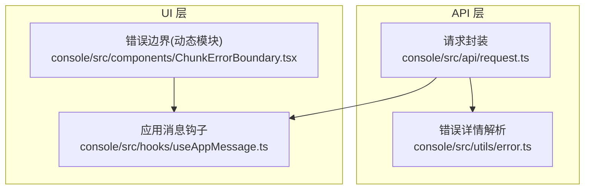
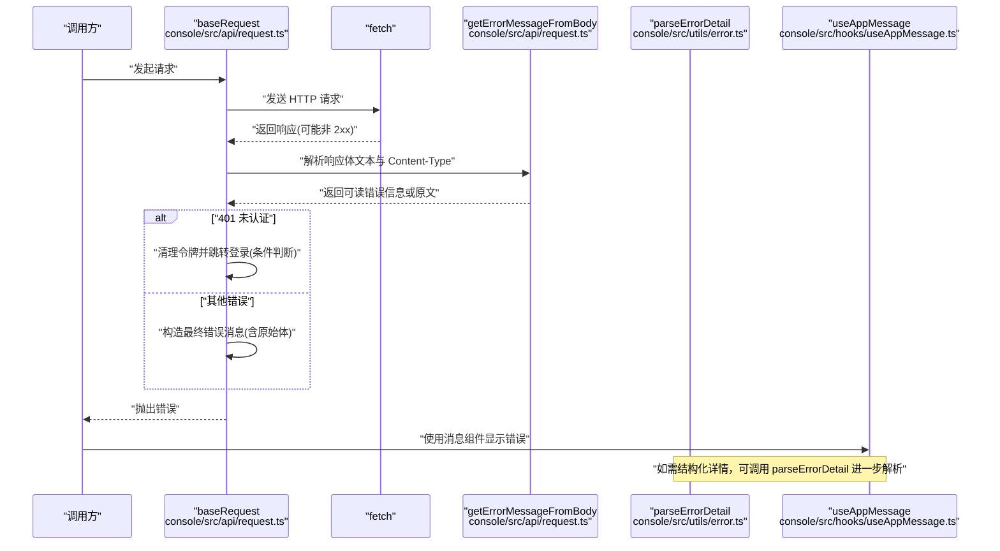
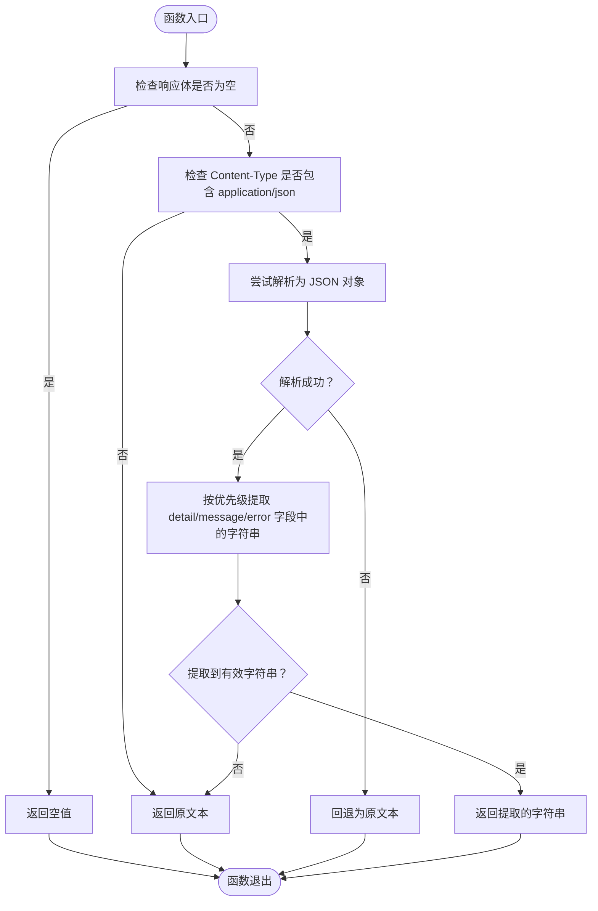
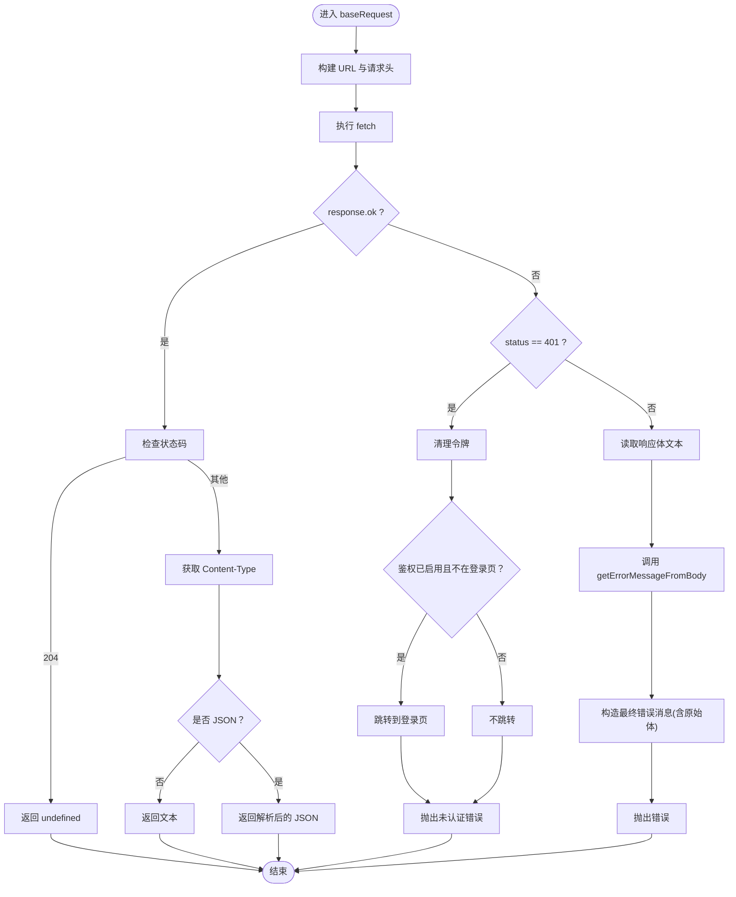
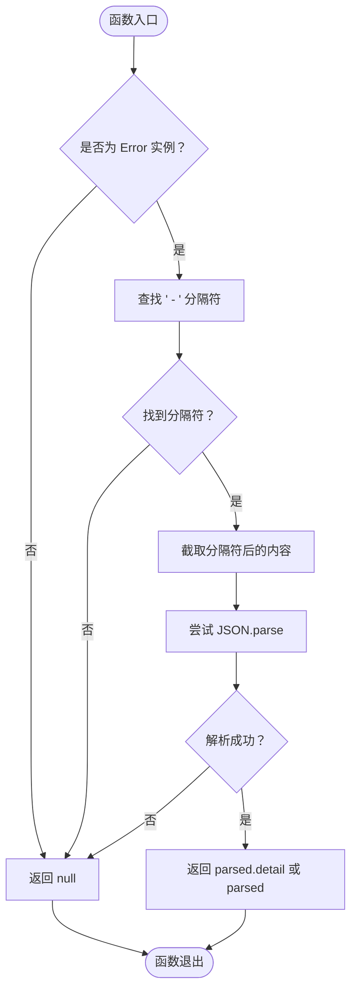
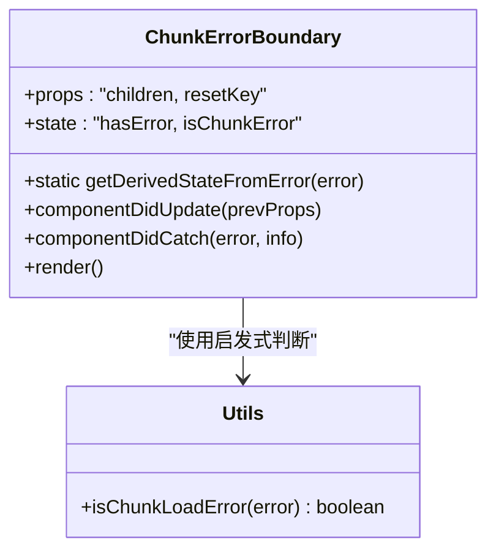
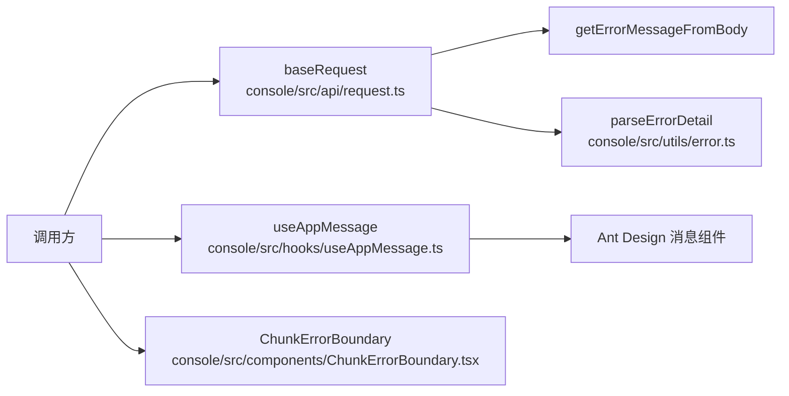

# API 错误处理

<cite>
**本文引用的文件**
- [console/src/api/request.ts](file://console/src/api/request.ts)
- [console/src/utils/error.ts](file://console/src/utils/error.ts)
- [console/src/components/ChunkErrorBoundary.tsx](file://console/src/components/ChunkErrorBoundary.tsx)
- [console/src/hooks/useAppMessage.ts](file://console/src/hooks/useAppMessage.ts)
</cite>

## 目录
1. [简介](#简介)
2. [项目结构](#项目结构)
3. [核心组件](#核心组件)
4. [架构总览](#架构总览)
5. [详细组件分析](#详细组件分析)
6. [依赖关系分析](#依赖关系分析)
7. [性能考量](#性能考量)
8. [故障排查指南](#故障排查指南)
9. [结论](#结论)
10. [附录](#附录)

## 简介
本文件聚焦于前端 API 错误处理机制，系统性阐述以下内容：
- getErrorMessageFromBody 的错误信息提取与归类逻辑
- HTTP 状态码的处理策略（401、403、404、5xx 等）
- 错误分类与用户友好提示生成
- 错误恢复策略、重试机制与用户体验优化最佳实践
- 与国际化、消息通知、动态模块加载错误边界等前端基础设施的协同

## 项目结构
围绕 API 请求与错误处理的关键文件组织如下：
- API 请求与错误提取：console/src/api/request.ts
- 结构化错误详情解析：console/src/utils/error.ts
- 动态模块加载错误边界：console/src/components/ChunkErrorBoundary.tsx
- 应用级消息钩子：console/src/hooks/useAppMessage.ts

图表来源
- [console/src/api/request.ts:1-136](file://console/src/api/request.ts#L1-L136)
- [console/src/utils/error.ts:1-12](file://console/src/utils/error.ts#L1-L12)
- [console/src/hooks/useAppMessage.ts:1-16](file://console/src/hooks/useAppMessage.ts#L1-L16)
- [console/src/components/ChunkErrorBoundary.tsx:1-85](file://console/src/components/ChunkErrorBoundary.tsx#L1-L85)

章节来源
- [console/src/api/request.ts:1-136](file://console/src/api/request.ts#L1-L136)
- [console/src/utils/error.ts:1-12](file://console/src/utils/error.ts#L1-L12)
- [console/src/hooks/useAppMessage.ts:1-16](file://console/src/hooks/useAppMessage.ts#L1-L16)
- [console/src/components/ChunkErrorBoundary.tsx:1-85](file://console/src/components/ChunkErrorBoundary.tsx#L1-L85)

## 核心组件
- 请求封装与错误提取
  - 统一的 baseRequest 实现，负责：
    - 构建请求头（含鉴权头与默认 JSON 内容类型）
    - 发起 fetch 请求并根据响应状态进行分支处理
    - 对非 2xx 响应调用 getErrorMessageFromBody 提取可读错误信息
    - 在 401 时清理本地令牌并按需跳转登录页
    - 对 204、非 JSON 响应进行特殊处理
- 结构化错误详情解析
  - parseErrorDetail 将包含结构化错误的错误消息转换为对象，便于进一步分类与展示
- 动态模块加载错误边界
  - 检测“加载分块失败”等网络或缓存问题，提供明确的引导与一键刷新
- 应用级消息钩子
  - 通过 Ant Design 的 App.useApp 获取 message/modal/notification，确保在 ConfigProvider 下正常工作

章节来源
- [console/src/api/request.ts:4-37](file://console/src/api/request.ts#L4-L37)
- [console/src/api/request.ts:60-106](file://console/src/api/request.ts#L60-L106)
- [console/src/utils/error.ts:1-12](file://console/src/utils/error.ts#L1-L12)
- [console/src/components/ChunkErrorBoundary.tsx:17-28](file://console/src/components/ChunkErrorBoundary.tsx#L17-L28)
- [console/src/hooks/useAppMessage.ts:12-16](file://console/src/hooks/useAppMessage.ts#L12-L16)

## 架构总览
下图展示了从发起请求到错误处理与用户反馈的整体流程。

图表来源
- [console/src/api/request.ts:60-106](file://console/src/api/request.ts#L60-L106)
- [console/src/api/request.ts:4-37](file://console/src/api/request.ts#L4-L37)
- [console/src/utils/error.ts:1-12](file://console/src/utils/error.ts#L1-L12)
- [console/src/hooks/useAppMessage.ts:12-16](file://console/src/hooks/useAppMessage.ts#L12-L16)

## 详细组件分析

### getErrorMessageFromBody：错误信息提取与归类
- 输入：响应体文本与 Content-Type
- 处理逻辑要点：
  - 若响应体为空，直接返回空值
  - 若 Content-Type 非 application/json，则直接返回原文本
  - 若为 JSON，尝试解析为对象，并优先提取 detail/message/error 中的字符串字段作为用户可见提示
  - 解析失败则回退为原文本
- 输出：用户可读的错误字符串或空值
- 作用：为后续错误分类与用户提示提供统一、可读的信息源

图表来源
- [console/src/api/request.ts:4-37](file://console/src/api/request.ts#L4-L37)

章节来源
- [console/src/api/request.ts:4-37](file://console/src/api/request.ts#L4-L37)

### baseRequest：HTTP 状态码处理策略
- 通用流程：
  - 构建请求头（自动添加 Content-Type 与鉴权头）
  - 发送请求并检查 response.ok
  - 非 2xx 分支：
    - 401 未认证：清理本地令牌；若未禁用鉴权且当前不在登录页，则跳转至登录页；抛出“未认证”错误
    - 其他错误：调用 getErrorMessageFromBody 提取可读错误；若无可用信息，使用“状态码+状态文本”的兜底格式；将原始响应体附加到错误消息中以便结构化解析
  - 204：返回 undefined
  - 非 JSON 响应：返回文本
  - JSON 响应：返回解析后的对象
- 设计意图：
  - 将“可读错误信息”与“原始响应体”结合，既保证用户提示友好，又保留结构化细节用于进一步处理

图表来源
- [console/src/api/request.ts:60-106](file://console/src/api/request.ts#L60-L106)
- [console/src/api/request.ts:4-37](file://console/src/api/request.ts#L4-L37)

章节来源
- [console/src/api/request.ts:60-106](file://console/src/api/request.ts#L60-L106)

### parseErrorDetail：结构化错误详情解析
- 输入：标准错误对象（包含特定格式的错误消息）
- 处理逻辑：
  - 判断是否为 Error 实例
  - 查找“ - ”分隔符，定位结构化详情部分
  - 尝试解析该部分为 JSON，并返回 detail 或整个对象
  - 解析失败则回退为 null
- 输出：结构化错误详情对象或 null
- 用途：与 baseRequest 抛出的“可读信息 + 原始体”组合，进一步生成更精细的用户提示或触发特定业务处理

图表来源
- [console/src/utils/error.ts:1-12](file://console/src/utils/error.ts#L1-L12)

章节来源
- [console/src/utils/error.ts:1-12](file://console/src/utils/error.ts#L1-L12)

### 动态模块加载错误边界：ChunkErrorBoundary
- 目标：针对路由分块加载失败（缓存过期、网络波动、部署竞争）提供明确提示与一键刷新
- 识别策略：基于错误名称与消息关键字的启发式判断
- 行为：
  - 渲染带操作按钮的结果页，建议用户刷新
  - 支持通过 resetKey 自动清除错误状态，避免重复渲染
- 与全局错误处理的协作：独立于 API 错误，但同样通过消息组件与国际化文案提升体验

图表来源
- [console/src/components/ChunkErrorBoundary.tsx:17-28](file://console/src/components/ChunkErrorBoundary.tsx#L17-L28)
- [console/src/components/ChunkErrorBoundary.tsx:41-84](file://console/src/components/ChunkErrorBoundary.tsx#L41-L84)

章节来源
- [console/src/components/ChunkErrorBoundary.tsx:1-85](file://console/src/components/ChunkErrorBoundary.tsx#L1-L85)

### 应用级消息钩子：useAppMessage
- 目标：在 Ant Design 的 ConfigProvider 下正确获取 message/modal/notification 实例
- 使用建议：
  - 在需要展示错误/成功/警告等提示时统一通过该钩子获取实例
  - 与 baseRequest 抛出的错误配合，形成一致的用户反馈

章节来源
- [console/src/hooks/useAppMessage.ts:1-16](file://console/src/hooks/useAppMessage.ts#L1-L16)

## 依赖关系分析
- 模块耦合与职责分离：
  - request.ts 独立封装请求与错误提取，职责清晰
  - error.ts 仅负责结构化解析，低耦合
  - ChunkErrorBoundary 专注于 UI 层错误边界，与业务无关
  - useAppMessage 为 UI 层提供统一的消息实例
- 关键依赖链：
  - 调用方 → baseRequest → getErrorMessageFromBody → parseErrorDetail（可选）
  - 调用方 → useAppMessage → Ant Design 消息组件
  - ChunkErrorBoundary → 国际化与用户交互

图表来源
- [console/src/api/request.ts:60-106](file://console/src/api/request.ts#L60-L106)
- [console/src/api/request.ts:4-37](file://console/src/api/request.ts#L4-L37)
- [console/src/utils/error.ts:1-12](file://console/src/utils/error.ts#L1-L12)
- [console/src/hooks/useAppMessage.ts:12-16](file://console/src/hooks/useAppMessage.ts#L12-L16)
- [console/src/components/ChunkErrorBoundary.tsx:41-84](file://console/src/components/ChunkErrorBoundary.tsx#L41-L84)

章节来源
- [console/src/api/request.ts:60-106](file://console/src/api/request.ts#L60-L106)
- [console/src/utils/error.ts:1-12](file://console/src/utils/error.ts#L1-L12)
- [console/src/hooks/useAppMessage.ts:12-16](file://console/src/hooks/useAppMessage.ts#L12-L16)
- [console/src/components/ChunkErrorBoundary.tsx:41-84](file://console/src/components/ChunkErrorBoundary.tsx#L41-L84)

## 性能考量
- 错误路径的最小化开销：
  - 非 JSON 响应直接返回文本，避免不必要的解析
  - 401 仅在必要时跳转，减少不必要导航
- 文本读取与解析：
  - 仅在非 2xx 时读取响应体文本，避免对成功路径造成额外 IO
- UI 反馈：
  - 使用轻量级错误边界，避免对整体应用性能产生影响

## 故障排查指南
- 常见问题与定位步骤：
  - 401 未认证循环跳转
    - 检查鉴权开关与当前页面路径，确认跳转逻辑是否被触发
    - 确认令牌清理与登录页跳转条件
  - 错误提示不友好
    - 检查服务端返回的 JSON 字段顺序与类型（detail/message/error），确保存在字符串值
    - 如需结构化详情，调用 parseErrorDetail 并在 UI 中展示
  - 动态模块加载失败
    - 观察错误信息是否命中启发式判断
    - 引导用户刷新页面，检查网络与缓存
- 建议的调试流程：
  - 打印 baseRequest 抛出的错误消息（包含原始响应体）
  - 使用 parseErrorDetail 提取结构化字段
  - 通过 useAppMessage 展示用户提示

章节来源
- [console/src/api/request.ts:74-93](file://console/src/api/request.ts#L74-L93)
- [console/src/api/request.ts:84-93](file://console/src/api/request.ts#L84-L93)
- [console/src/utils/error.ts:1-12](file://console/src/utils/error.ts#L1-L12)
- [console/src/components/ChunkErrorBoundary.tsx:17-28](file://console/src/components/ChunkErrorBoundary.tsx#L17-L28)

## 结论
CoPaw 前端的 API 错误处理以“可读错误信息 + 原始响应体”的双轨策略为核心，结合 401 特殊处理、动态模块加载错误边界与统一消息钩子，形成了覆盖请求、解析、展示与恢复的完整闭环。通过结构化错误详情解析与用户友好提示生成，既提升了可维护性，也优化了用户体验。

## 附录
- 最佳实践建议
  - 服务端统一返回 JSON 错误结构，优先包含 detail/message/error 字段
  - 在 UI 层统一通过 useAppMessage 展示错误，保持一致性
  - 对于可恢复的临时性错误（如网络抖动），提供“重试”按钮并与重试机制结合
  - 对于 401 未认证，除清理令牌外，可考虑记录上下文以便登录后恢复操作
  - 对于 5xx 服务器错误，建议在 UI 层提供“复制错误详情”能力，便于诊断