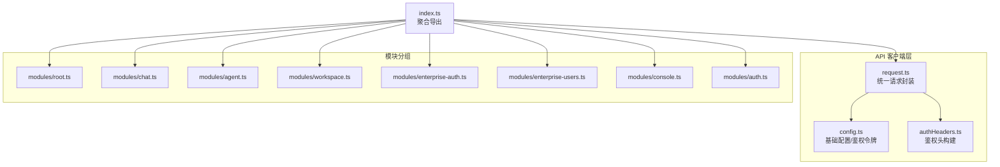
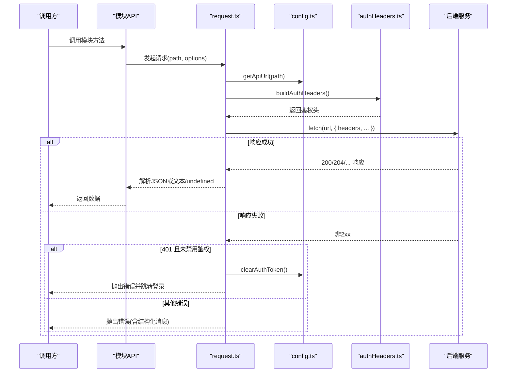
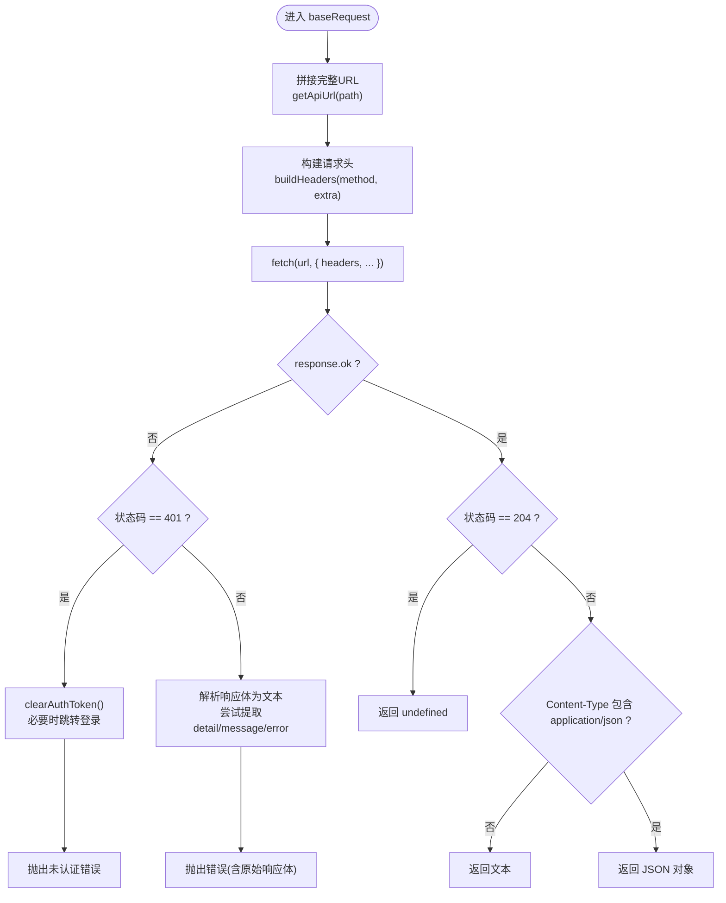
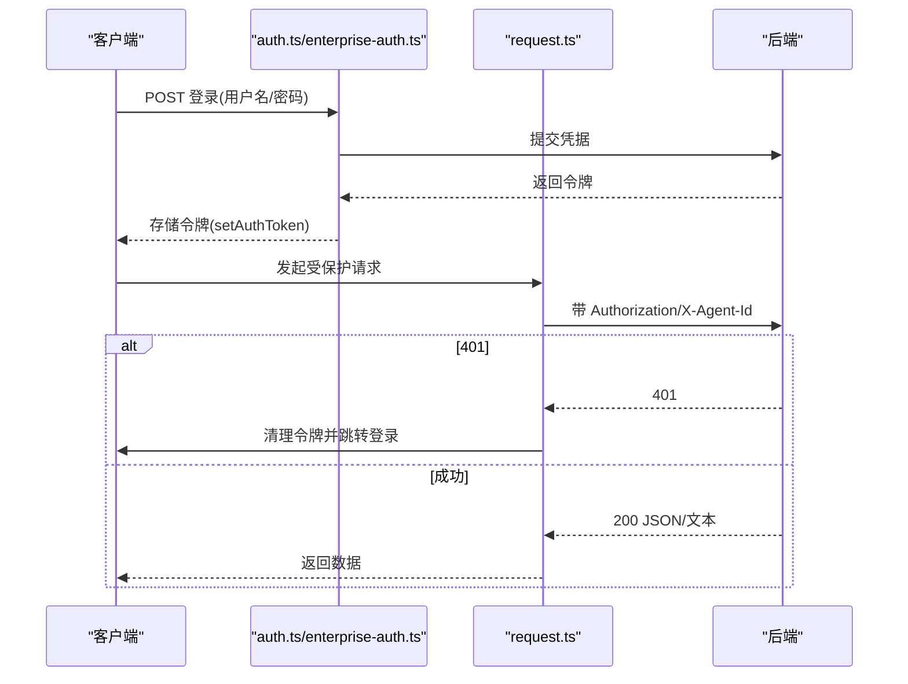
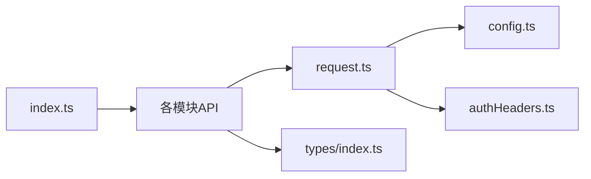

# API 集成

<cite>
**本文引用的文件**
- [console/src/api/index.ts](file://console/src/api/index.ts)
- [console/src/api/request.ts](file://console/src/api/request.ts)
- [console/src/api/config.ts](file://console/src/api/config.ts)
- [console/src/api/authHeaders.ts](file://console/src/api/authHeaders.ts)
- [console/src/api/modules/root.ts](file://console/src/api/modules/root.ts)
- [console/src/api/modules/auth.ts](file://console/src/api/modules/auth.ts)
- [console/src/api/modules/chat.ts](file://console/src/api/modules/chat.ts)
- [console/src/api/modules/agent.ts](file://console/src/api/modules/agent.ts)
- [console/src/api/modules/console.ts](file://console/src/api/modules/console.ts)
- [console/src/api/modules/workspace.ts](file://console/src/api/modules/workspace.ts)
- [console/src/api/modules/enterprise-auth.ts](file://console/src/api/modules/enterprise-auth.ts)
- [console/src/api/modules/enterprise-users.ts](file://console/src/api/modules/enterprise-users.ts)
- [console/src/api/types/index.ts](file://console/src/api/types/index.ts)
- [console/src/api/types/agent.ts](file://console/src/api/types/agent.ts)
- [console/src/api/types/chat.ts](file://console/src/api/types/chat.ts)
- [console/src/api/types/agents.ts](file://console/src/api/types/agents.ts)
</cite>

## 目录
1. [简介](#简介)
2. [项目结构](#项目结构)
3. [核心组件](#核心组件)
4. [架构总览](#架构总览)
5. [详细组件分析](#详细组件分析)
6. [依赖关系分析](#依赖关系分析)
7. [性能考量](#性能考量)
8. [故障排查指南](#故障排查指南)
9. [结论](#结论)
10. [附录](#附录)

## 简介
本文件面向 CoPaw 前端控制台的 API 集成，系统性阐述基于原生 fetch 的 API 客户端设计与实现，覆盖请求配置、响应处理、错误管理、认证流程、基础配置、模块化 API 分组、类型安全、请求拦截与响应转换、重试机制、版本管理、缓存策略与性能监控等主题。读者可据此快速理解并扩展前端 API 能力。

## 项目结构
前端 API 层位于 console/src/api，采用“统一客户端 + 模块化分组”的组织方式：
- 统一客户端：封装请求、鉴权头构建、URL 规范化、错误解析与 401 处理
- 模块化分组：按功能域拆分 API 模块（如聊天、代理、工作区、企业认证等）
- 类型安全：集中导出各模块类型，确保调用端编译期校验

图表来源
- [console/src/api/index.ts:1-85](file://console/src/api/index.ts#L1-L85)
- [console/src/api/request.ts:1-136](file://console/src/api/request.ts#L1-L136)
- [console/src/api/config.ts:1-68](file://console/src/api/config.ts#L1-L68)
- [console/src/api/authHeaders.ts:1-24](file://console/src/api/authHeaders.ts#L1-L24)
- [console/src/api/modules/root.ts:1-8](file://console/src/api/modules/root.ts#L1-L8)
- [console/src/api/modules/chat.ts:1-137](file://console/src/api/modules/chat.ts#L1-L137)
- [console/src/api/modules/agent.ts:1-86](file://console/src/api/modules/agent.ts#L1-L86)
- [console/src/api/modules/workspace.ts:1-149](file://console/src/api/modules/workspace.ts#L1-L149)
- [console/src/api/modules/enterprise-auth.ts:1-74](file://console/src/api/modules/enterprise-auth.ts#L1-L74)
- [console/src/api/modules/enterprise-users.ts:1-86](file://console/src/api/modules/enterprise-users.ts#L1-L86)
- [console/src/api/modules/console.ts:1-12](file://console/src/api/modules/console.ts#L1-L12)
- [console/src/api/modules/auth.ts:1-76](file://console/src/api/modules/auth.ts#L1-L76)

章节来源
- [console/src/api/index.ts:1-85](file://console/src/api/index.ts#L1-L85)

## 核心组件
- 统一请求客户端 request.ts
  - 封装 fetch，提供 get/post/put/delete/patch 方法别名
  - 自动注入 Content-Type、Authorization/X-Agent-Id 鉴权头
  - 统一错误处理：401 清理令牌并跳转登录；非 204 时按 JSON 或文本解析响应体
  - 支持自定义 headers 且不覆盖已存在的 Content-Type
- 基础配置 config.ts
  - getApiUrl：自动拼接 /api 前缀，避免重复前缀
  - getApiToken/setAuthToken/clearAuthToken：优先从 localStorage 读取，回退到构建时常量
  - setAuthDisabled/isAuthDisabled：用于在无鉴权模式下避免 401 跳转循环
- 鉴权头构建 authHeaders.ts
  - 构建 Authorization: Bearer <token> 与 X-Agent-Id（来自会话存储）
  - 异常时静默告警，不影响主流程
- 模块化 API 分组
  - 以模块文件暴露方法集合，统一通过 request 或直接使用 fetch
  - 聚合导出至 index.ts，形成统一命名空间 api

章节来源
- [console/src/api/request.ts:1-136](file://console/src/api/request.ts#L1-L136)
- [console/src/api/config.ts:1-68](file://console/src/api/config.ts#L1-L68)
- [console/src/api/authHeaders.ts:1-24](file://console/src/api/authHeaders.ts#L1-L24)
- [console/src/api/index.ts:1-85](file://console/src/api/index.ts#L1-L85)

## 架构总览
下面的序列图展示了典型请求从调用到返回的完整链路，包括鉴权头注入、URL 规范化、错误处理与 401 登录跳转。

图表来源
- [console/src/api/request.ts:60-106](file://console/src/api/request.ts#L60-L106)
- [console/src/api/config.ts:32-67](file://console/src/api/config.ts#L32-L67)
- [console/src/api/authHeaders.ts:4-23](file://console/src/api/authHeaders.ts#L4-L23)

## 详细组件分析

### 统一请求客户端 request.ts
- 请求配置
  - 自动设置 Content-Type: application/json（仅对带请求体的方法）
  - 合并自定义 headers，避免覆盖已存在的 Content-Type
  - 通过 getApiUrl 统一拼接 /api 前缀
- 响应处理
  - 204：返回 undefined
  - 非 JSON：返回文本
  - JSON：返回解析后的对象
- 错误管理
  - 401：清理本地令牌，若未禁用鉴权则跳转登录页
  - 其他错误：尝试从响应体提取 detail/message/error 字段作为友好信息
- 类型安全
  - 泛型约束返回值类型，保证调用端编译期类型正确

图表来源
- [console/src/api/request.ts:60-106](file://console/src/api/request.ts#L60-L106)

章节来源
- [console/src/api/request.ts:1-136](file://console/src/api/request.ts#L1-L136)

### 基础配置 config.ts
- URL 规范化
  - 自动补全 /api 前缀，避免重复前缀
  - 支持相对路径与绝对路径两种形式
- 鉴权令牌
  - 优先从 localStorage 读取；若不存在则使用构建时常量
  - 提供 setAuthToken/clearAuthToken 辅助函数
- 鉴权开关
  - setAuthDisabled/isAuthDisabled 用于在无鉴权模式下避免 401 跳转循环

章节来源
- [console/src/api/config.ts:1-68](file://console/src/api/config.ts#L1-L68)

### 鉴权头构建 authHeaders.ts
- Authorization: Bearer <token>（当存在令牌时）
- X-Agent-Id：从会话存储中读取当前选中的代理标识
- 异常容错：解析失败时记录警告并继续

章节来源
- [console/src/api/authHeaders.ts:1-24](file://console/src/api/authHeaders.ts#L1-L24)

### 模块化 API 分组

#### 根与版本
- rootApi：提供根路径访问与版本查询

章节来源
- [console/src/api/modules/root.ts:1-8](file://console/src/api/modules/root.ts#L1-L8)

#### 认证与用户
- auth.ts：标准认证接口（登录/注册/状态/更新资料），内部直接使用 fetch
- enterprise-auth.ts：企业版认证接口（登录/注册/登出/当前用户/密码/MFA）
- enterprise-users.ts：企业用户管理（列表/创建/查询/更新/删除/角色）

章节来源
- [console/src/api/modules/auth.ts:1-76](file://console/src/api/modules/auth.ts#L1-L76)
- [console/src/api/modules/enterprise-auth.ts:1-74](file://console/src/api/modules/enterprise-auth.ts#L1-L74)
- [console/src/api/modules/enterprise-users.ts:1-86](file://console/src/api/modules/enterprise-users.ts#L1-L86)

#### 聊天与会话
- chat.ts：文件上传、预览链接生成、聊天/会话的增删改查、批量删除、停止对话
- 会话别名：sessionApi 与 chatApi 的会话相关方法保持兼容

章节来源
- [console/src/api/modules/chat.ts:1-137](file://console/src/api/modules/chat.ts#L1-L137)

#### 代理管理
- agent.ts：代理健康检查、处理请求、运行配置、语言/音频模式、转写提供者等

章节来源
- [console/src/api/modules/agent.ts:1-86](file://console/src/api/modules/agent.ts#L1-L86)

#### 控制台推送
- console.ts：控制台推送消息获取

章节来源
- [console/src/api/modules/console.ts:1-12](file://console/src/api/modules/console.ts#L1-L12)

#### 工作区与文件
- workspace.ts：文件列表/加载/保存、工作区打包下载、文件上传、每日记忆读写、系统提示词文件管理

章节来源
- [console/src/api/modules/workspace.ts:1-149](file://console/src/api/modules/workspace.ts#L1-L149)

### 类型安全实现
- 类型聚合：types/index.ts 导出各模块类型，便于统一引用
- 关键类型：
  - agent.ts：代理请求、运行配置、嵌入与内存相关配置
  - chat.ts：聊天/会话、消息、更新请求与删除响应
  - agents.ts：多代理概要、创建与引用

章节来源
- [console/src/api/types/index.ts:1-13](file://console/src/api/types/index.ts#L1-L13)
- [console/src/api/types/agent.ts:1-67](file://console/src/api/types/agent.ts#L1-L67)
- [console/src/api/types/chat.ts:1-39](file://console/src/api/types/chat.ts#L1-L39)
- [console/src/api/types/agents.ts:1-47](file://console/src/api/types/agents.ts#L1-L47)

### 认证流程
- 登录/注册
  - 使用 auth.ts 或 enterprise-auth.ts 的登录接口提交凭据
  - 成功后服务端返回令牌，前端通过 setAuthToken 存储
- 请求阶段
  - authHeaders.ts 自动附加 Authorization 与 X-Agent-Id
- 401 处理
  - request.ts 在收到 401 时清理本地令牌，并在启用鉴权时跳转登录页
- 无鉴权模式
  - 通过 setAuthDisabled/isAuthDisabled 避免 401 跳转循环

图表来源
- [console/src/api/modules/auth.ts:15-49](file://console/src/api/modules/auth.ts#L15-L49)
- [console/src/api/modules/enterprise-auth.ts:36-54](file://console/src/api/modules/enterprise-auth.ts#L36-L54)
- [console/src/api/request.ts:73-94](file://console/src/api/request.ts#L73-L94)
- [console/src/api/config.ts:49-67](file://console/src/api/config.ts#L49-L67)

### 请求拦截器与响应转换器
- 请求拦截器
  - buildHeaders：统一注入 Content-Type 与鉴权头；支持自定义 headers 不被覆盖
  - getApiUrl：统一 URL 规范化，避免重复 /api 前缀
- 响应转换器
  - 204 → undefined
  - 非 JSON 文本 → 字符串
  - JSON → 对象
- 说明
  - 当前实现以函数组合为主，未引入中间件式拦截器；如需更复杂的拦截/转换，可在 request.ts 内部扩展

章节来源
- [console/src/api/request.ts:39-58](file://console/src/api/request.ts#L39-L58)
- [console/src/api/request.ts:96-105](file://console/src/api/request.ts#L96-L105)
- [console/src/api/config.ts:32-42](file://console/src/api/config.ts#L32-L42)

### 重试机制
- 当前未实现自动重试
- 建议在需要时于调用侧或在 request.ts 中增加指数退避重试逻辑（例如对 5xx 或网络异常）

章节来源
- [console/src/api/request.ts:60-106](file://console/src/api/request.ts#L60-L106)

### API 版本管理
- URL 规范化由 getApiUrl 统一处理，避免硬编码重复前缀
- 企业版接口显式使用 /api/enterprise 前缀，便于区分版本与域
- 建议后续在构建时注入版本号并统一在 getApiUrl 中拼接

章节来源
- [console/src/api/config.ts:32-42](file://console/src/api/config.ts#L32-L42)
- [console/src/api/modules/enterprise-auth.ts:36-54](file://console/src/api/modules/enterprise-auth.ts#L36-L54)

### 缓存策略
- 当前未实现客户端缓存
- 建议：
  - 对只读列表/详情接口增加基于 URL 的内存缓存
  - 结合 ETag/Last-Modified 实现条件请求
  - 对大文件下载使用流式处理与进度上报

章节来源
- [console/src/api/modules/workspace.ts:61-91](file://console/src/api/modules/workspace.ts#L61-L91)

### 性能监控最佳实践
- 建议在 request.ts 中埋点：
  - 请求耗时、状态码分布、错误率
  - 401 次数与触发场景
- 结合浏览器 Performance API 与服务端日志进行端到端观测

章节来源
- [console/src/api/request.ts:60-106](file://console/src/api/request.ts#L60-L106)

## 依赖关系分析
- 模块聚合
  - index.ts 将所有模块方法聚合为统一命名空间 api，便于集中导入与使用
- 内部依赖
  - 各模块依赖 request.ts 或 config.ts/getApiUrl/buildAuthHeaders
  - 类型通过 types/index.ts 统一导出
- 外部依赖
  - fetch（浏览器内置）
  - 构建时环境变量（VITE_API_BASE_URL、TOKEN）

图表来源
- [console/src/api/index.ts:7-81](file://console/src/api/index.ts#L7-L81)
- [console/src/api/request.ts:1-3](file://console/src/api/request.ts#L1-L3)
- [console/src/api/config.ts:1-2](file://console/src/api/config.ts#L1-L2)
- [console/src/api/authHeaders.ts:1](file://console/src/api/authHeaders.ts#L1)
- [console/src/api/types/index.ts:1-13](file://console/src/api/types/index.ts#L1-L13)

章节来源
- [console/src/api/index.ts:1-85](file://console/src/api/index.ts#L1-L85)

## 性能考量
- 减少不必要的 JSON 解析：仅在 Content-Type 为 application/json 时解析
- 204 空响应直接返回 undefined，避免空对象开销
- 401 快速失败与跳转，减少无效重试
- 大文件上传/下载建议采用流式处理与分片策略（当前模块已体现下载/上传思路）

章节来源
- [console/src/api/request.ts:96-105](file://console/src/api/request.ts#L96-L105)
- [console/src/api/modules/chat.ts:23-40](file://console/src/api/modules/chat.ts#L23-L40)
- [console/src/api/modules/workspace.ts:61-114](file://console/src/api/modules/workspace.ts#L61-L114)

## 故障排查指南
- 401 未认证
  - 检查是否已登录并存储令牌
  - 若启用鉴权，确认未处于无鉴权模式
  - 查看是否被重定向到登录页
- 403 权限不足
  - 企业版接口需正确角色与权限
- 响应体解析失败
  - 非 JSON 文本将作为字符串返回
  - 错误消息可能包含服务端 detail/message/error 字段
- 文件上传/下载异常
  - 检查 Content-Disposition 与鉴权头
  - 确认代理选择与 X-Agent-Id 是否正确

章节来源
- [console/src/api/request.ts:73-94](file://console/src/api/request.ts#L73-L94)
- [console/src/api/modules/chat.ts:31-40](file://console/src/api/modules/chat.ts#L31-L40)
- [console/src/api/modules/workspace.ts:67-91](file://console/src/api/modules/workspace.ts#L67-L91)

## 结论
CoPaw 前端 API 层以简洁可靠的 fetch 客户端为核心，结合统一的 URL 规范化、鉴权头注入与错误处理，实现了高内聚、低耦合的模块化设计。通过类型安全与清晰的模块边界，开发者可以高效扩展新功能。建议后续在 request.ts 中引入可插拔的拦截器/重试机制、客户端缓存与性能埋点，以进一步提升稳定性与可观测性。

## 附录
- 统一入口：通过 api 聚合导出，按需导入模块或整体使用
- 企业版接口：明确以 /api/enterprise 前缀区分域与版本
- 类型导出：types/index.ts 统一导出，便于跨模块复用

章节来源
- [console/src/api/index.ts:26-81](file://console/src/api/index.ts#L26-L81)
- [console/src/api/types/index.ts:1-13](file://console/src/api/types/index.ts#L1-L13)