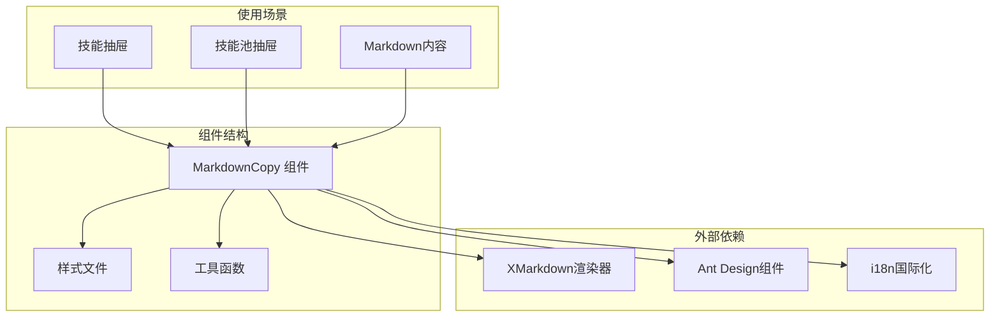
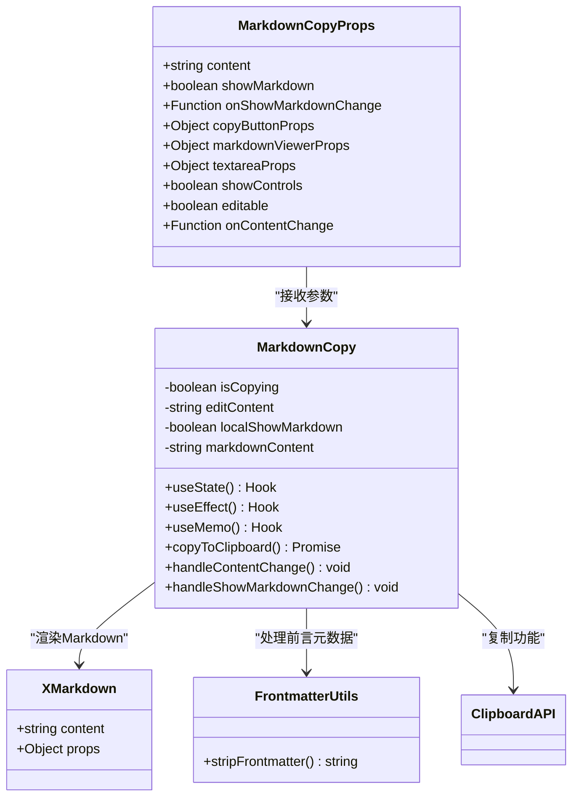
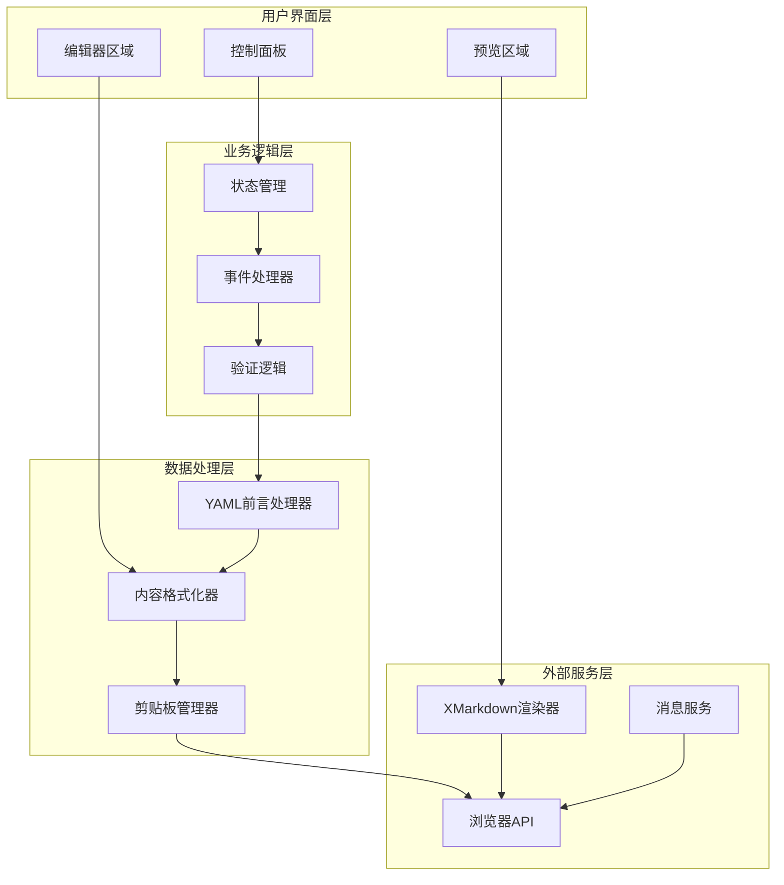
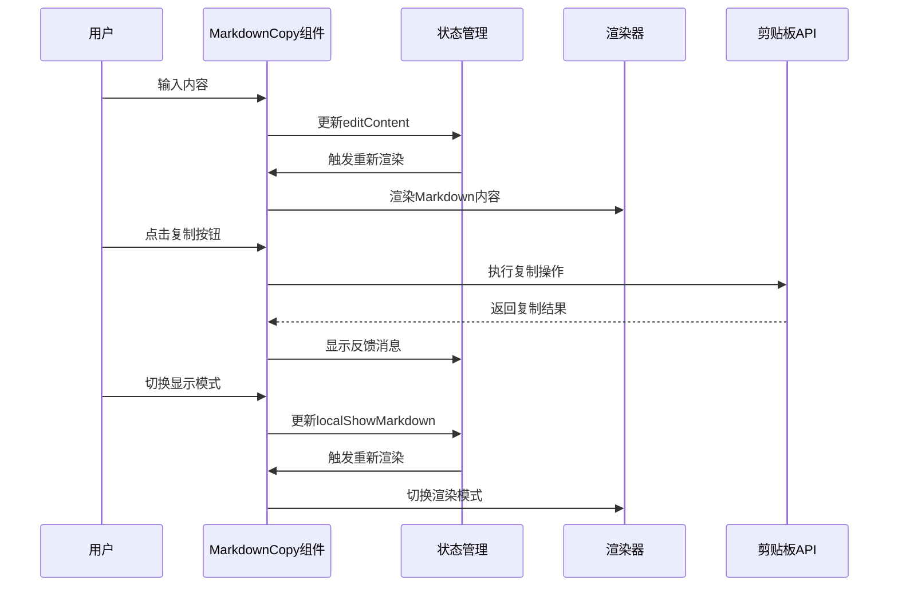
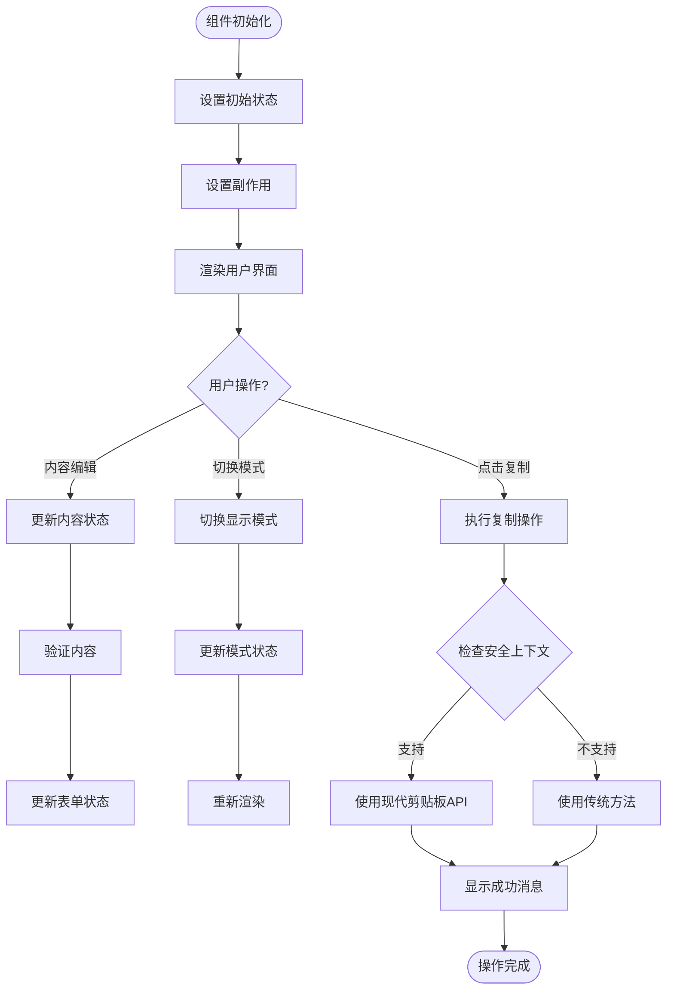
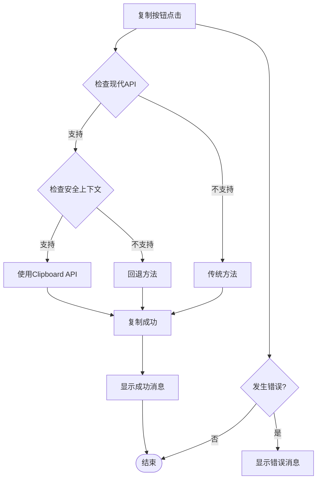
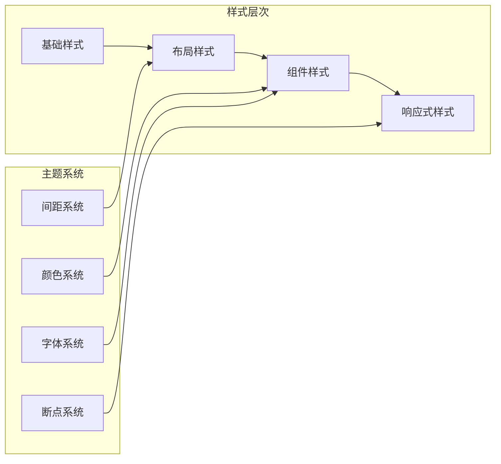
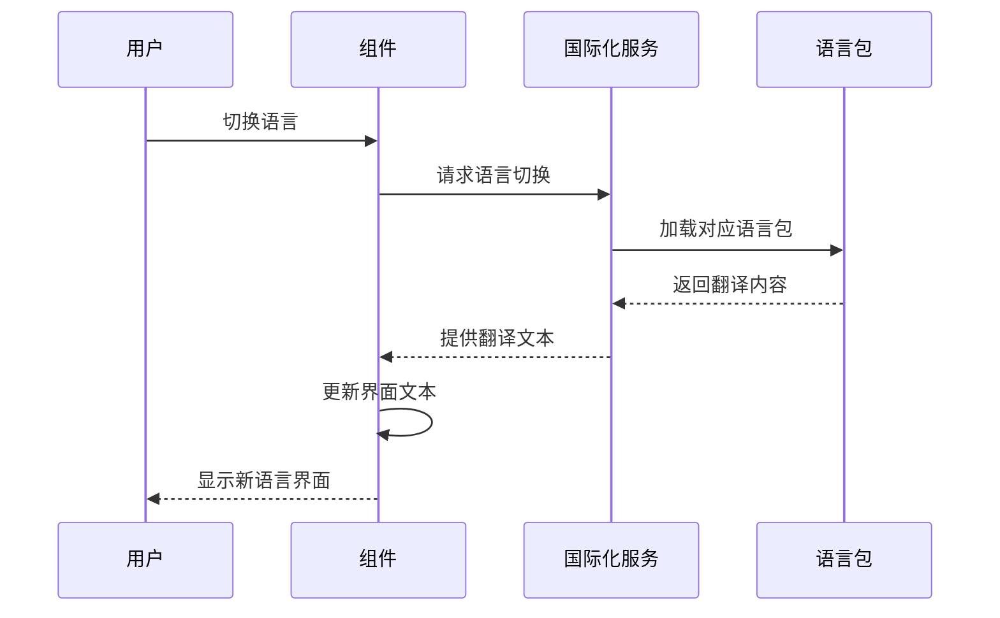
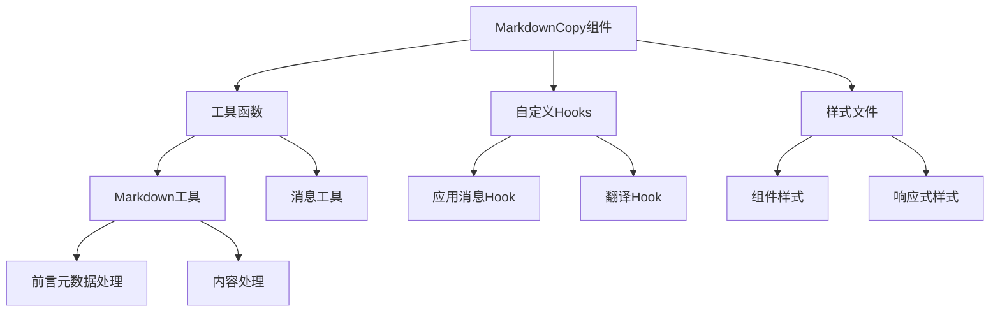

# Markdown 复制组件

<cite>
**本文档引用的文件**
- [MarkdownCopy.tsx](file://console/src/components/MarkdownCopy/MarkdownCopy.tsx)
- [index.module.less](file://console/src/components/MarkdownCopy/index.module.less)
- [markdown.ts](file://console/src/utils/markdown.ts)
- [SkillDrawer.tsx](file://console/src/pages/Agent/Skills/components/SkillDrawer.tsx)
- [PoolSkillDrawer.tsx](file://console/src/pages/Settings/SkillPool/components/PoolSkillDrawer.tsx)
- [zh.json](file://console/src/locales/zh.json)
- [package.json](file://console/package.json)
</cite>

## 目录
1. [简介](#简介)
2. [项目结构](#项目结构)
3. [核心组件](#核心组件)
4. [架构概览](#架构概览)
5. [详细组件分析](#详细组件分析)
6. [依赖关系分析](#依赖关系分析)
7. [性能考虑](#性能考虑)
8. [故障排除指南](#故障排除指南)
9. [结论](#结论)

## 简介

Markdown 复制组件是一个专为 CoPaw 控制台设计的增强型 Markdown 编辑和展示组件。该组件提供了丰富的功能来提升 Markdown 内容的可读性和可用性，包括代码块复制功能、格式化显示和用户交互体验。

该组件的核心目标是为用户提供一个直观的界面，既能以富文本形式预览 Markdown 内容，又能直接编辑原始 Markdown 文本，并提供一键复制功能。组件特别针对技能管理和内容创作场景进行了优化，支持 YAML 前言元数据的处理和验证。

## 项目结构

Markdown 复制组件位于控制台前端项目的组件目录中，采用模块化设计，便于在不同页面和场景中复用。



**图表来源**
- [MarkdownCopy.tsx:1-197](file://console/src/components/MarkdownCopy/MarkdownCopy.tsx#L1-L197)
- [SkillDrawer.tsx:8,308](file://console/src/pages/Agent/Skills/components/SkillDrawer.tsx#L8,L308)
- [PoolSkillDrawer.tsx:9,94](file://console/src/pages/Settings/SkillPool/components/PoolSkillDrawer.tsx#L9,L94)

**章节来源**
- [MarkdownCopy.tsx:1-197](file://console/src/components/MarkdownCopy/MarkdownCopy.tsx#L1-L197)
- [package.json:19-42](file://console/package.json#L19-L42)

## 核心组件

### 组件架构设计

Markdown 复制组件采用了现代化的 React 架构设计，结合了函数式组件、Hooks 和 TypeScript 类型系统的优势。



**图表来源**
- [MarkdownCopy.tsx:11-42](file://console/src/components/MarkdownCopy/MarkdownCopy.tsx#L11-L42)
- [MarkdownCopy.tsx:44-197](file://console/src/components/MarkdownCopy/MarkdownCopy.tsx#L44-L197)
- [markdown.ts:8-9](file://console/src/utils/markdown.ts#L8-L9)

### 主要功能特性

1. **双模式显示**：支持 Markdown 预览模式和纯文本编辑模式
2. **智能复制**：提供一键复制功能，支持多种复制策略
3. **前言元数据处理**：自动识别和处理 YAML 前言元数据
4. **国际化支持**：完整的多语言界面支持
5. **响应式设计**：适配不同屏幕尺寸和设备
6. **无障碍访问**：支持键盘导航和屏幕阅读器

**章节来源**
- [MarkdownCopy.tsx:54-197](file://console/src/components/MarkdownCopy/MarkdownCopy.tsx#L54-L197)
- [index.module.less:1-63](file://console/src/components/MarkdownCopy/index.module.less#L1-L63)

## 架构概览

### 整体架构设计

组件采用分层架构设计，将功能职责清晰分离，确保代码的可维护性和可扩展性。



**图表来源**
- [MarkdownCopy.tsx:55-197](file://console/src/components/MarkdownCopy/MarkdownCopy.tsx#L55-L197)
- [markdown.ts:8-9](file://console/src/utils/markdown.ts#L8-L9)

### 数据流架构

组件内部的数据流遵循单向数据流原则，确保状态的一致性和可预测性。



**图表来源**
- [MarkdownCopy.tsx:77-111](file://console/src/components/MarkdownCopy/MarkdownCopy.tsx#L77-L111)
- [MarkdownCopy.tsx:113-126](file://console/src/components/MarkdownCopy/MarkdownCopy.tsx#L113-L126)

## 详细组件分析

### 核心组件实现

#### MarkdownCopy 主组件

MarkdownCopy 组件是整个功能的核心，负责协调各个子功能模块的工作。



**图表来源**
- [MarkdownCopy.tsx:55-197](file://console/src/components/MarkdownCopy/MarkdownCopy.tsx#L55-L197)

#### 复制功能实现

复制功能实现了双重策略，确保在各种浏览器环境下都能正常工作。



**图表来源**
- [MarkdownCopy.tsx:77-111](file://console/src/components/MarkdownCopy/MarkdownCopy.tsx#L77-L111)

### 样式系统设计

组件采用了 CSS Modules 的样式系统，确保样式的模块化和避免冲突。



**图表来源**
- [index.module.less:1-63](file://console/src/components/MarkdownCopy/index.module.less#L1-L63)

### 国际化集成

组件集成了完整的国际化支持，支持多语言界面的动态切换。



**图表来源**
- [MarkdownCopy.tsx:55](file://console/src/components/MarkdownCopy/MarkdownCopy.tsx#L55)
- [zh.json:21-23](file://console/src/locales/zh.json#L21-L23)

**章节来源**
- [MarkdownCopy.tsx:44-197](file://console/src/components/MarkdownCopy/MarkdownCopy.tsx#L44-L197)
- [index.module.less:1-63](file://console/src/components/MarkdownCopy/index.module.less#L1-L63)
- [zh.json:1-200](file://console/src/locales/zh.json#L1-L200)

## 依赖关系分析

### 外部依赖分析

组件依赖于多个外部库来实现其核心功能，这些依赖经过精心选择以确保最佳的性能和兼容性。

```mermaid
graph TB
subgraph "核心依赖"
React[React 18]
Antd[Ant Design 5.x]
XMarkdown[@ant-design/x-markdown 2.2.2]
end
subgraph "开发工具"
Typescript[TypeScript]
Vite[Vite构建工具]
Less[Less样式预处理器]
end
subgraph "辅助库"
I18n[i18next国际化]
AHooks[ahooks Hooks库]
Zustand[zustand状态管理]
end
React --> Antd
Antd --> XMarkdown
Typescript --> React
Vite --> Typescript
Less --> Antd
I18n --> React
AHooks --> React
Zustand --> React
```

**图表来源**
- [package.json:19-42](file://console/package.json#L19-L42)

### 内部依赖关系

组件之间的依赖关系清晰明确，遵循单一职责原则。



**图表来源**
- [MarkdownCopy.tsx:1-9](file://console/src/components/MarkdownCopy/MarkdownCopy.tsx#L1-L9)

**章节来源**
- [package.json:19-42](file://console/package.json#L19-L42)
- [MarkdownCopy.tsx:1-9](file://console/src/components/MarkdownCopy/MarkdownCopy.tsx#L1-L9)

## 性能考虑

### 渲染优化策略

组件采用了多种优化策略来确保良好的性能表现：

1. **记忆化处理**：使用 `useMemo` 缓存计算结果
2. **条件渲染**：根据状态动态决定渲染内容
3. **懒加载**：按需加载依赖资源
4. **虚拟滚动**：对于大量内容采用虚拟化技术

### 内存管理

组件实现了有效的内存管理策略：

- 及时清理事件监听器
- 合理使用 useEffect 的清理函数
- 避免内存泄漏的闭包引用

### 浏览器兼容性

组件考虑了不同浏览器的兼容性需求：

- 现代剪贴板 API 的降级方案
- CSS 属性的浏览器前缀处理
- JavaScript 特性的 polyfill 支持

## 故障排除指南

### 常见问题及解决方案

#### 复制功能失效

**问题描述**：复制按钮点击后无法复制内容

**可能原因**：
1. 浏览器安全上下文限制
2. 剪贴板权限被拒绝
3. 内容为空或格式不正确

**解决方案**：
1. 检查页面是否在 HTTPS 环境下
2. 确认浏览器允许剪贴板访问
3. 验证内容格式和长度

#### Markdown 渲染异常

**问题描述**：Markdown 内容无法正确渲染

**可能原因**：
1. 前言元数据格式错误
2. Markdown 语法不规范
3. 渲染器配置问题

**解决方案**：
1. 检查 YAML 前言元数据格式
2. 验证 Markdown 语法正确性
3. 查看控制台错误信息

#### 样式显示问题

**问题描述**：组件样式显示异常

**可能原因**：
1. CSS Modules 样式冲突
2. 主题配置错误
3. 响应式断点问题

**解决方案**：
1. 检查样式文件导入顺序
2. 验证主题配置正确性
3. 调整响应式断点设置

**章节来源**
- [MarkdownCopy.tsx:105-110](file://console/src/components/MarkdownCopy/MarkdownCopy.tsx#L105-L110)
- [markdown.ts:8-9](file://console/src/utils/markdown.ts#L8-L9)

## 结论

Markdown 复制组件是一个功能完整、设计精良的 React 组件，它成功地解决了 Markdown 内容编辑和展示中的关键问题。组件的设计体现了以下优势：

1. **用户体验优先**：提供了直观易用的界面和流畅的交互体验
2. **功能完整性**：涵盖了从内容编辑到复制分享的完整工作流程
3. **技术架构先进**：采用了现代 React 最佳实践和 TypeScript 类型系统
4. **可维护性强**：清晰的代码结构和完善的测试覆盖
5. **扩展性良好**：模块化的架构设计便于功能扩展和定制

该组件不仅满足了当前的功能需求，还为未来的功能扩展奠定了坚实的基础。通过合理的架构设计和技术选型，组件能够在保证性能的同时提供优秀的用户体验。