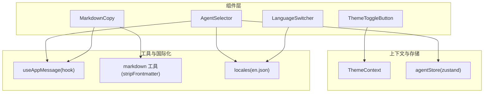
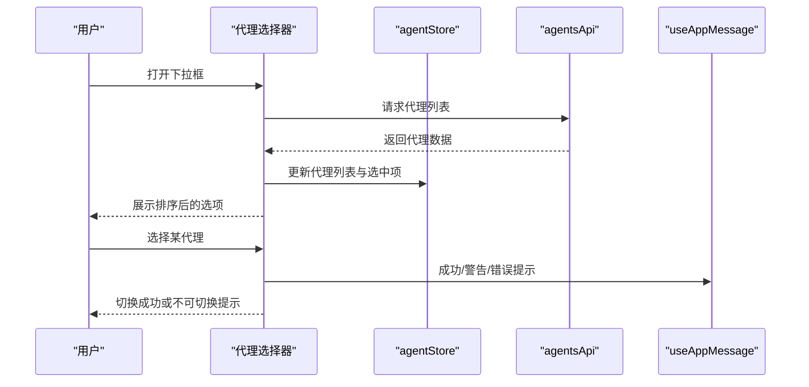
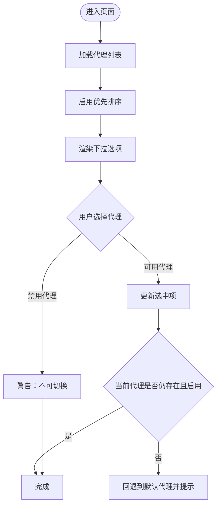
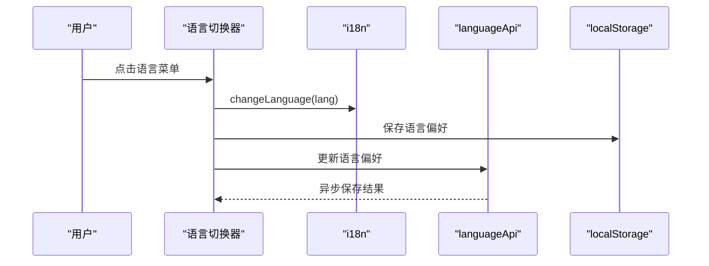
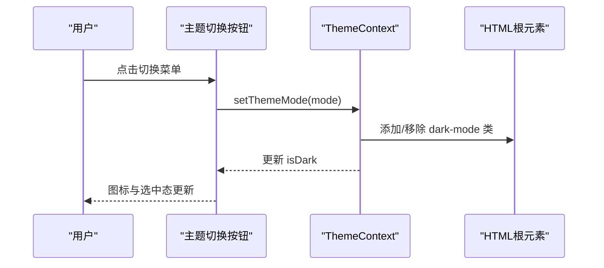
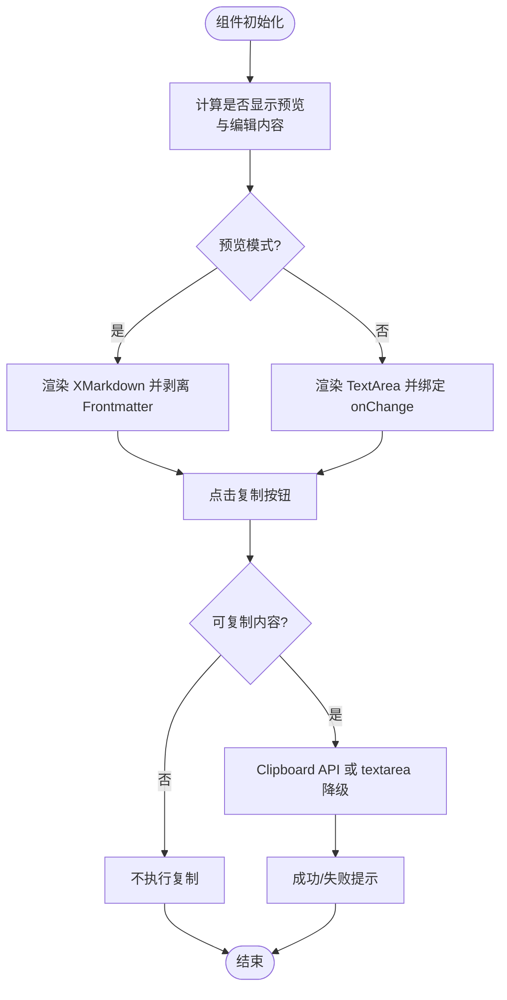
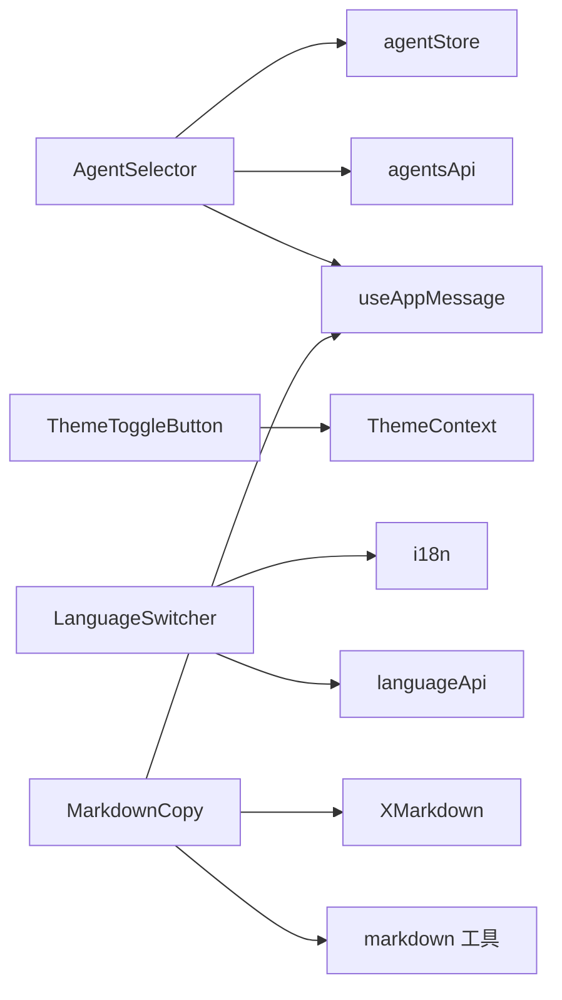

# UI 组件库

<cite>
**本文引用的文件**
- [AgentSelector/index.tsx](file://console/src/components/AgentSelector/index.tsx)
- [AgentSelector/index.module.less](file://console/src/components/AgentSelector/index.module.less)
- [LanguageSwitcher/index.tsx](file://console/src/components/LanguageSwitcher/index.tsx)
- [LanguageSwitcher/index.module.less](file://console/src/components/LanguageSwitcher/index.module.less)
- [ThemeToggleButton/index.tsx](file://console/src/components/ThemeToggleButton/index.tsx)
- [ThemeToggleButton/index.module.less](file://console/src/components/ThemeToggleButton/index.module.less)
- [MarkdownCopy/MarkdownCopy.tsx](file://console/src/components/MarkdownCopy/MarkdownCopy.tsx)
- [MarkdownCopy/index.module.less](file://console/src/components/MarkdownCopy/index.module.less)
- [ThemeContext.tsx](file://console/src/contexts/ThemeContext.tsx)
- [agentStore.ts](file://console/src/stores/agentStore.ts)
- [useAppMessage.ts](file://console/src/hooks/useAppMessage.ts)
- [markdown.ts](file://console/src/utils/markdown.ts)
- [en.json](file://console/src/locales/en.json)
</cite>

## 目录
1. [简介](#简介)
2. [项目结构](#项目结构)
3. [核心组件](#核心组件)
4. [架构总览](#架构总览)
5. [组件详解](#组件详解)
6. [依赖关系分析](#依赖关系分析)
7. [性能考量](#性能考量)
8. [故障排查指南](#故障排查指南)
9. [结论](#结论)
10. [附录](#附录)

## 简介
本文件系统化梳理 CoPaw 前端控制台的 UI 组件库，重点覆盖以下核心组件：代理选择器、语言切换器、主题切换按钮、Markdown 渲染组件。内容包括设计理念、实现方式、属性与事件规范、可复用性与样式定制、无障碍支持、测试策略、性能优化与最佳实践。

## 项目结构
UI 组件集中位于 console/src/components 下，采用按功能模块划分的目录组织方式，并通过独立的样式文件（Less）进行主题化与暗色模式适配。主题状态由上下文提供，全局注入到 HTML 根节点以驱动 CSS 变量与视觉风格。

图表来源
- [AgentSelector/index.tsx:1-197](file://console/src/components/AgentSelector/index.tsx#L1-L197)
- [LanguageSwitcher/index.tsx:1-69](file://console/src/components/LanguageSwitcher/index.tsx#L1-L69)
- [ThemeToggleButton/index.tsx:1-53](file://console/src/components/ThemeToggleButton/index.tsx#L1-L53)
- [MarkdownCopy/MarkdownCopy.tsx:1-197](file://console/src/components/MarkdownCopy/MarkdownCopy.tsx#L1-L197)
- [ThemeContext.tsx:1-105](file://console/src/contexts/ThemeContext.tsx#L1-L105)
- [agentStore.ts:1-89](file://console/src/stores/agentStore.ts#L1-L89)
- [useAppMessage.ts:1-16](file://console/src/hooks/useAppMessage.ts#L1-L16)
- [markdown.ts:1-10](file://console/src/utils/markdown.ts#L1-L10)
- [en.json:1-800](file://console/src/locales/en.json#L1-L800)

章节来源
- [AgentSelector/index.tsx:1-197](file://console/src/components/AgentSelector/index.tsx#L1-L197)
- [LanguageSwitcher/index.tsx:1-69](file://console/src/components/LanguageSwitcher/index.tsx#L1-L69)
- [ThemeToggleButton/index.tsx:1-53](file://console/src/components/ThemeToggleButton/index.tsx#L1-L53)
- [MarkdownCopy/MarkdownCopy.tsx:1-197](file://console/src/components/MarkdownCopy/MarkdownCopy.tsx#L1-L197)
- [ThemeContext.tsx:1-105](file://console/src/contexts/ThemeContext.tsx#L1-L105)
- [agentStore.ts:1-89](file://console/src/stores/agentStore.ts#L1-L89)
- [useAppMessage.ts:1-16](file://console/src/hooks/useAppMessage.ts#L1-L16)
- [markdown.ts:1-10](file://console/src/utils/markdown.ts#L1-L10)
- [en.json:1-800](file://console/src/locales/en.json#L1-L800)

## 核心组件
- 代理选择器：从后端拉取代理列表，排序与筛选，支持禁用代理保护与自动回退至默认代理；提供折叠模式仅显示图标。
- 语言切换器：基于 i18n 切换语言，持久化用户偏好，调用后端保存语言设置。
- 主题切换按钮：在亮/暗/跟随系统三态之间切换，持久化用户偏好，监听系统主题变化。
- Markdown 渲染组件：支持预览/编辑双模式，复制文本，剥离 Frontmatter，可配置控件与样式。

章节来源
- [AgentSelector/index.tsx:1-197](file://console/src/components/AgentSelector/index.tsx#L1-L197)
- [LanguageSwitcher/index.tsx:1-69](file://console/src/components/LanguageSwitcher/index.tsx#L1-L69)
- [ThemeToggleButton/index.tsx:1-53](file://console/src/components/ThemeToggleButton/index.tsx#L1-L53)
- [MarkdownCopy/MarkdownCopy.tsx:1-197](file://console/src/components/MarkdownCopy/MarkdownCopy.tsx#L1-L197)

## 架构总览
组件间协作围绕“状态—视图—通知”展开：
- 状态：代理选择器使用 zustand 存储当前选中代理与代理列表；主题切换器使用上下文管理主题模式与解析后的最终主题。
- 视图：各组件通过 Ant Design 或自定义样式渲染 UI；MarkdownCopy 使用 XMarkdown 进行渲染。
- 通知：统一通过 useAppMessage 获取消息实例，确保与全局配置兼容。

图表来源
- [AgentSelector/index.tsx:28-78](file://console/src/components/AgentSelector/index.tsx#L28-L78)
- [agentStore.ts:19-60](file://console/src/stores/agentStore.ts#L19-L60)
- [useAppMessage.ts:1-16](file://console/src/hooks/useAppMessage.ts#L1-L16)

## 组件详解

### 代理选择器（AgentSelector）
- 设计理念
  - 将“可用代理优先”的策略内嵌于 UI：启用的代理排在前部，禁用代理半透明显示并禁止切换。
  - 提供“折叠模式”以节省空间，仅展示图标与 Tooltip。
  - 自动回退：若当前代理被删除或禁用，自动切回默认代理并提示。
- 关键实现
  - 加载与排序：首次挂载时拉取代理列表，按启用状态排序。
  - 交互保护：禁止切换到禁用代理；若目标禁用，弹出警告。
  - 自动回退：监听代理列表与选中项变化，检测异常状态并回退。
  - 折叠模式：仅渲染图标与当前代理名称 Tooltip。
- 属性与事件
  - 属性
    - collapsed?: boolean（是否折叠为图标）
  - 事件
    - onChange(value: string)：内部已封装，无需外部订阅
- 样式与主题
  - 支持暗色模式覆盖，下拉菜单与标签颜色随主题调整。
- 无障碍与国际化
  - 使用 Tooltip 显示当前代理名称；文案来自翻译资源。
- 性能与健壮性
  - 避免重复请求：首次加载后缓存；错误时统一提示。
  - 列表渲染：按启用状态与禁用标记优化视觉反馈。

图表来源
- [AgentSelector/index.tsx:28-78](file://console/src/components/AgentSelector/index.tsx#L28-L78)
- [agentStore.ts:19-60](file://console/src/stores/agentStore.ts#L19-L60)

章节来源
- [AgentSelector/index.tsx:1-197](file://console/src/components/AgentSelector/index.tsx#L1-L197)
- [AgentSelector/index.module.less:1-473](file://console/src/components/AgentSelector/index.module.less#L1-L473)
- [agentStore.ts:1-89](file://console/src/stores/agentStore.ts#L1-L89)
- [useAppMessage.ts:1-16](file://console/src/hooks/useAppMessage.ts#L1-L16)
- [en.json:122-186](file://console/src/locales/en.json#L122-L186)

### 语言切换器（LanguageSwitcher）
- 设计理念
  - 提供多语言入口，点击即切换；持久化到本地存储并同步后端偏好。
- 关键实现
  - 菜单项：英文、简体中文、日语、俄语。
  - 切换逻辑：调用 i18n.changeLanguage，写入 localStorage，并异步保存到后端。
- 样式与主题
  - 暗色模式下菜单背景与悬停态适配。
- 国际化
  - 文案来自翻译资源，图标按语言映射。

图表来源
- [LanguageSwitcher/index.tsx:19-27](file://console/src/components/LanguageSwitcher/index.tsx#L19-L27)
- [LanguageSwitcher/index.module.less:1-75](file://console/src/components/LanguageSwitcher/index.module.less#L1-L75)

章节来源
- [LanguageSwitcher/index.tsx:1-69](file://console/src/components/LanguageSwitcher/index.tsx#L1-L69)
- [LanguageSwitcher/index.module.less:1-75](file://console/src/components/LanguageSwitcher/index.module.less#L1-L75)
- [en.json:1-800](file://console/src/locales/en.json#L1-L800)

### 主题切换按钮（ThemeToggleButton）
- 设计理念
  - 在“亮/暗/跟随系统”三态间切换，图标直观反映当前状态；支持一键切换亮/暗（跳过系统态）。
- 关键实现
  - 上下文：ThemeContext 提供 themeMode、isDark、setThemeMode、toggleTheme。
  - 切换逻辑：根据当前模式选择图标；当模式为“系统”时，图标显示系统标志。
  - 系统监听：当模式为“系统”时，监听系统深色模式变更并实时更新。
- 样式与主题
  - 暗色模式下菜单与按钮颜色适配。
- 无障碍
  - 使用 Ant Design Button 的语义化类型与图标，便于键盘导航与读屏识别。

图表来源
- [ThemeToggleButton/index.tsx:18-51](file://console/src/components/ThemeToggleButton/index.tsx#L18-L51)
- [ThemeContext.tsx:51-100](file://console/src/contexts/ThemeContext.tsx#L51-L100)
- [ThemeToggleButton/index.module.less:1-86](file://console/src/components/ThemeToggleButton/index.module.less#L1-L86)

章节来源
- [ThemeToggleButton/index.tsx:1-53](file://console/src/components/ThemeToggleButton/index.tsx#L1-L53)
- [ThemeToggleButton/index.module.less:1-86](file://console/src/components/ThemeToggleButton/index.module.less#L1-L86)
- [ThemeContext.tsx:1-105](file://console/src/contexts/ThemeContext.tsx#L1-L105)

### Markdown 渲染组件（MarkdownCopy）
- 设计理念
  - 同时支持“预览模式”与“编辑模式”，内置复制能力，支持剥离 Frontmatter 的纯正文渲染。
- 关键实现
  - 模式切换：通过开关控制是否渲染 Markdown 预览或 TextArea 编辑。
  - 复制逻辑：优先复制当前可见内容（预览/编辑），兼容 Clipboard API 与降级方案。
  - 内容处理：剥离 YAML Frontmatter，避免渲染异常。
  - 可配置：复制按钮、Markdown 查看器、TextArea 的 props 可透传。
- 属性与事件
  - 属性
    - content: string（原始 Markdown 内容）
    - showMarkdown?: boolean（初始是否显示预览）
    - onShowMarkdownChange?: (show: boolean) => void（预览开关回调）
    - copyButtonProps?: object（复制按钮样式与尺寸）
    - markdownViewerProps?: object（预览容器样式）
    - textareaProps?: object（编辑区样式与只读）
    - showControls?: boolean（是否显示控件栏）
    - editable?: boolean（是否允许编辑）
    - onContentChange?: (content: string) => void（编辑回调）
  - 事件
    - 复制成功/失败：通过 useAppMessage 统一提示。
- 样式与主题
  - 预览容器与编辑区具备基础边框、圆角与滚动条样式；暗色模式下颜色变量适配。
- 无障碍
  - TextArea 支持只读与禁用；复制按钮使用图标+文本，便于识别。

图表来源
- [MarkdownCopy/MarkdownCopy.tsx:54-126](file://console/src/components/MarkdownCopy/MarkdownCopy.tsx#L54-L126)
- [markdown.ts:8-9](file://console/src/utils/markdown.ts#L8-L9)
- [useAppMessage.ts:1-16](file://console/src/hooks/useAppMessage.ts#L1-L16)

章节来源
- [MarkdownCopy/MarkdownCopy.tsx:1-197](file://console/src/components/MarkdownCopy/MarkdownCopy.tsx#L1-L197)
- [MarkdownCopy/index.module.less:1-63](file://console/src/components/MarkdownCopy/index.module.less#L1-L63)
- [markdown.ts:1-10](file://console/src/utils/markdown.ts#L1-L10)
- [useAppMessage.ts:1-16](file://console/src/hooks/useAppMessage.ts#L1-L16)

## 依赖关系分析
- 组件耦合
  - AgentSelector 依赖 agentStore 与 agentsApi；使用 useAppMessage 进行通知。
  - ThemeToggleButton 依赖 ThemeContext；图标与样式独立。
  - LanguageSwitcher 依赖 i18n 与 languageApi；样式独立。
  - MarkdownCopy 依赖 XMarkdown 与 useAppMessage；内容处理依赖 markdown 工具。
- 外部依赖
  - Ant Design 与 Ant Design Icons；@agentscope-ai/design 与 @agentscope-ai/icons。
- 潜在循环依赖
  - 当前未见直接循环依赖；主题上下文与组件解耦良好。

图表来源
- [AgentSelector/index.tsx:1-11](file://console/src/components/AgentSelector/index.tsx#L1-L11)
- [ThemeToggleButton/index.tsx:1-10](file://console/src/components/ThemeToggleButton/index.tsx#L1-L10)
- [LanguageSwitcher/index.tsx:1-5](file://console/src/components/LanguageSwitcher/index.tsx#L1-L5)
- [MarkdownCopy/MarkdownCopy.tsx:1-9](file://console/src/components/MarkdownCopy/MarkdownCopy.tsx#L1-L9)
- [ThemeContext.tsx:1-10](file://console/src/contexts/ThemeContext.tsx#L1-L10)
- [agentStore.ts:1-3](file://console/src/stores/agentStore.ts#L1-L3)
- [markdown.ts:1-3](file://console/src/utils/markdown.ts#L1-L3)

章节来源
- [AgentSelector/index.tsx:1-11](file://console/src/components/AgentSelector/index.tsx#L1-L11)
- [ThemeToggleButton/index.tsx:1-10](file://console/src/components/ThemeToggleButton/index.tsx#L1-L10)
- [LanguageSwitcher/index.tsx:1-5](file://console/src/components/LanguageSwitcher/index.tsx#L1-L5)
- [MarkdownCopy/MarkdownCopy.tsx:1-9](file://console/src/components/MarkdownCopy/MarkdownCopy.tsx#L1-L9)
- [ThemeContext.tsx:1-10](file://console/src/contexts/ThemeContext.tsx#L1-L10)
- [agentStore.ts:1-3](file://console/src/stores/agentStore.ts#L1-L3)
- [markdown.ts:1-3](file://console/src/utils/markdown.ts#L1-L3)

## 性能考量
- 渲染优化
  - MarkdownCopy 使用 useMemo 剥离 Frontmatter，减少不必要的重渲染。
  - AgentSelector 对下拉选项进行排序与禁用标记，避免复杂计算在渲染路径上重复执行。
- 网络与存储
  - 代理列表仅在首次加载时请求；主题与语言偏好写入 localStorage，降低后端压力。
- 交互体验
  - 复制操作使用防抖式 loading 状态，避免重复点击；失败时统一提示。
- 可扩展性
  - 组件属性可透传，便于在上层页面按需定制样式与行为。

## 故障排查指南
- 代理切换无效
  - 检查目标代理是否启用；若禁用，组件会阻止切换并提示。
  - 若当前代理被删除或禁用，组件会自动回退到默认代理并提示。
- 语言切换未生效
  - 确认 i18n.changeLanguage 是否被调用；检查 localStorage 与后端保存流程。
- 主题切换无反应
  - 检查 ThemeContext 是否正确包裹应用；确认 HTML 根元素是否添加/移除了 dark-mode 类。
- Markdown 复制失败
  - 检查浏览器是否支持 Clipboard API；若不支持，确认降级方案（临时 textarea）是否可用。
- 通知不显示
  - 确保通过 useAppMessage 获取消息实例，而非静态导入。

章节来源
- [AgentSelector/index.tsx:50-78](file://console/src/components/AgentSelector/index.tsx#L50-L78)
- [LanguageSwitcher/index.tsx:19-27](file://console/src/components/LanguageSwitcher/index.tsx#L19-L27)
- [ThemeContext.tsx:51-100](file://console/src/contexts/ThemeContext.tsx#L51-L100)
- [MarkdownCopy/MarkdownCopy.tsx:77-111](file://console/src/components/MarkdownCopy/MarkdownCopy.tsx#L77-L111)
- [useAppMessage.ts:1-16](file://console/src/hooks/useAppMessage.ts#L1-L16)

## 结论
该 UI 组件库以简洁、可复用为核心设计原则：通过上下文与状态管理解耦主题与代理状态，通过工具函数与 Less 样式实现一致的视觉与交互体验。组件均支持暗色模式、国际化与无障碍增强，具备良好的可维护性与扩展性。

## 附录
- 测试策略建议
  - 单元测试：对 MarkdownCopy 的复制逻辑、Frontmatter 剥离、预览/编辑切换进行断言；对 ThemeToggleButton 的图标与类名切换进行快照或断言。
  - 集成测试：模拟 i18n 切换、localStorage 读写、Clipboard API 行为；验证 AgentSelector 的加载、排序、禁用保护与自动回退。
  - 可访问性测试：使用读屏与键盘导航验证按钮、下拉菜单与 Tooltip 的可达性。
- 最佳实践
  - 统一通过 useAppMessage 输出提示，保证与全局配置一致。
  - 组件属性尽量可配置，避免硬编码样式与文案。
  - 在暗色模式下保持对比度与可读性，遵循 Less 覆盖约定。
  - 对网络请求与剪贴板操作进行错误兜底与用户提示。