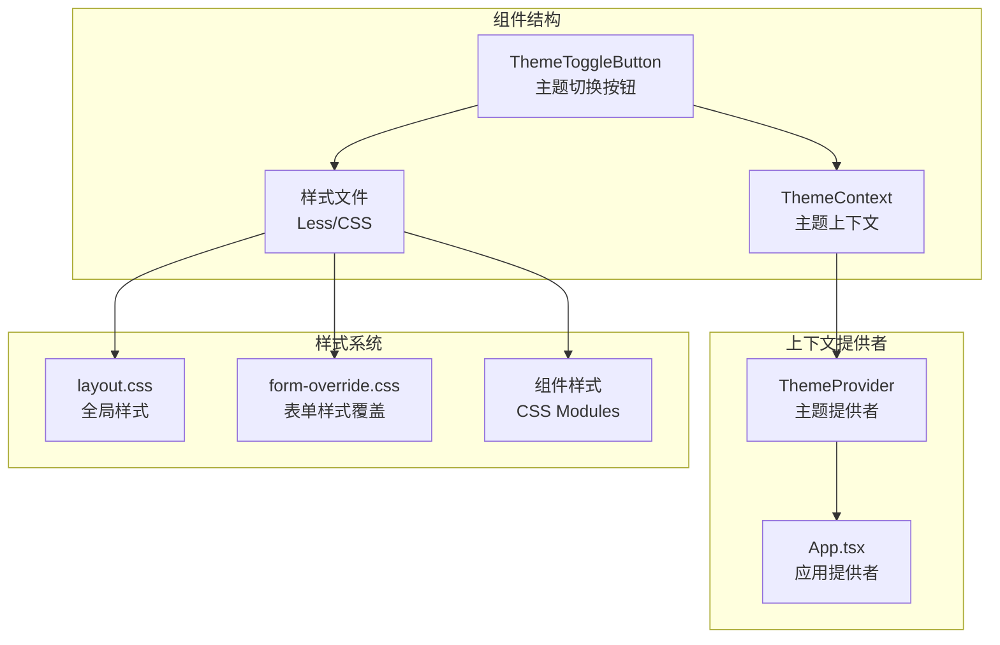
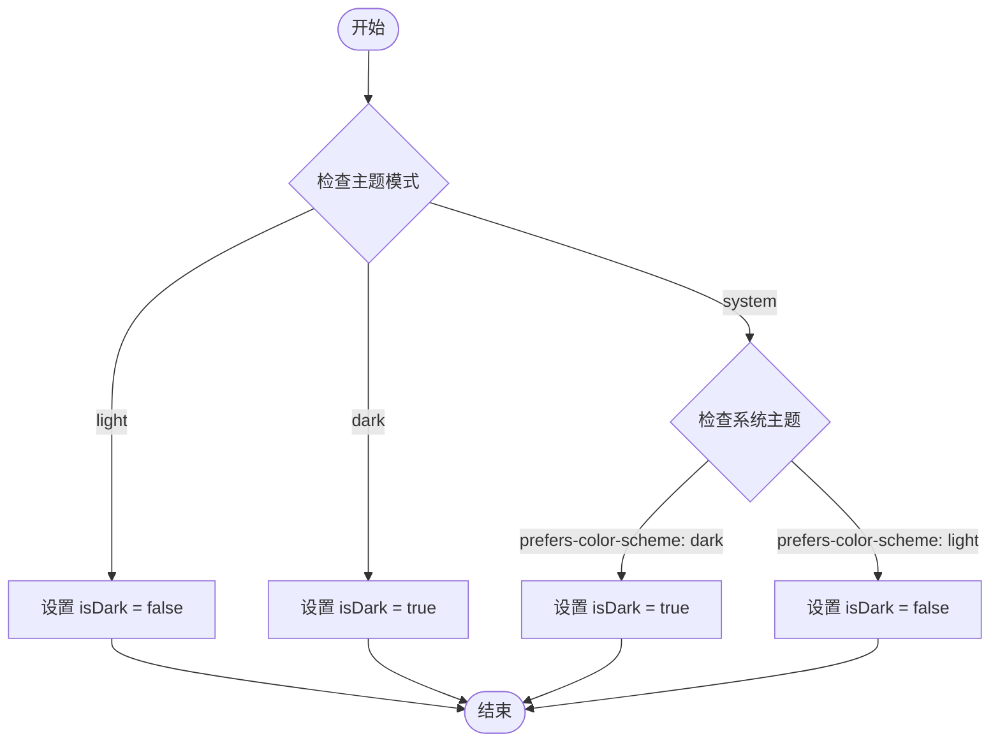
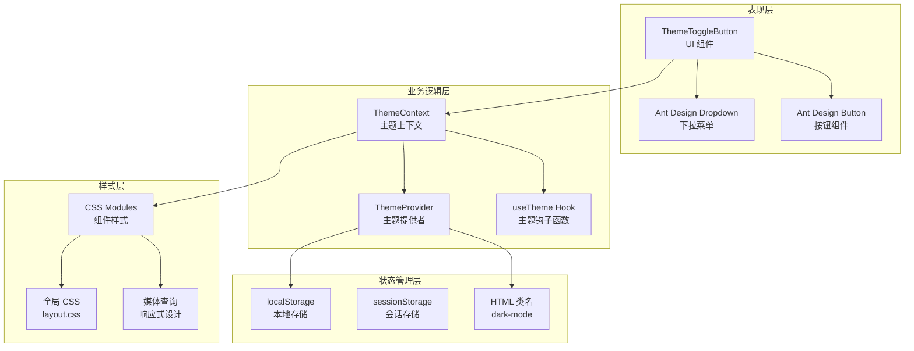
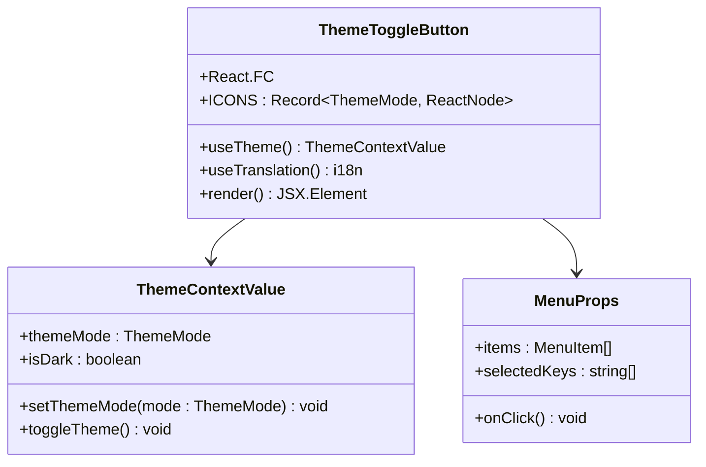
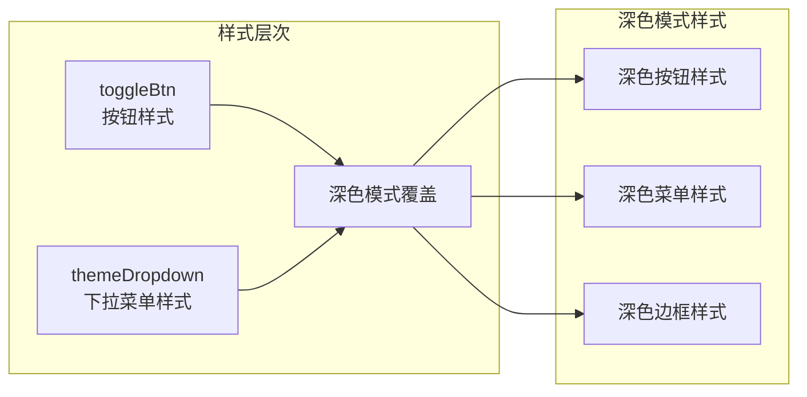
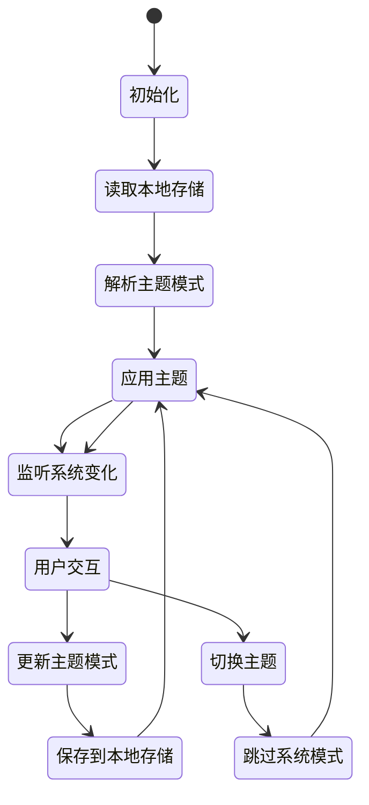
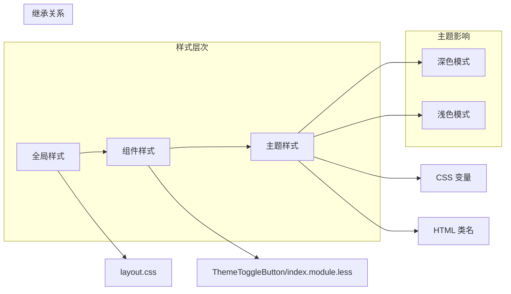
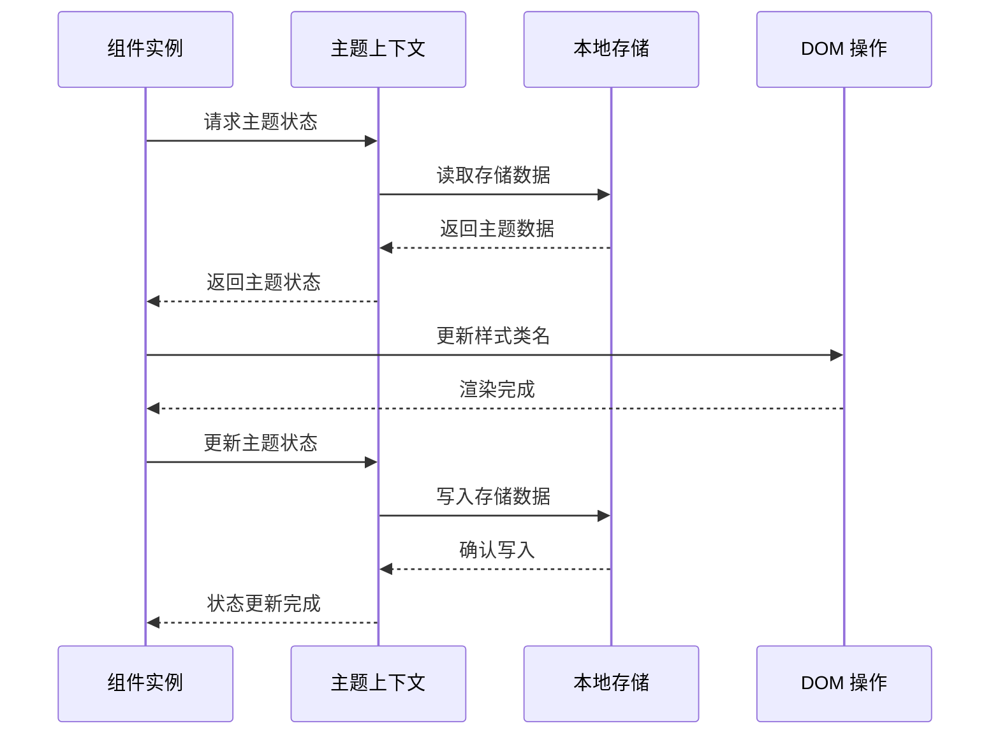

# 主题切换按钮组件

<cite>
**本文档引用的文件**
- [ThemeToggleButton/index.tsx](file://console/src/components/ThemeToggleButton/index.tsx)
- [ThemeToggleButton/index.module.less](file://console/src/components/ThemeToggleButton/index.module.less)
- [ThemeContext.tsx](file://console/src/contexts/ThemeContext.tsx)
- [App.tsx](file://console/src/App.tsx)
- [layout.css](file://console/src/styles/layout.css)
- [form-override.css](file://console/src/styles/form-override.css)
- [en.json](file://console/src/locales/en.json)
- [zh.json](file://console/src/locales/zh.json)
</cite>

## 目录
1. [简介](#简介)
2. [项目结构](#项目结构)
3. [核心组件](#核心组件)
4. [架构概览](#架构概览)
5. [详细组件分析](#详细组件分析)
6. [依赖关系分析](#依赖关系分析)
7. [性能考虑](#性能考虑)
8. [故障排除指南](#故障排除指南)
9. [结论](#结论)
10. [附录](#附录)

## 简介

主题切换按钮组件是 CoPaw 控制台中的核心 UI 组件之一，负责提供深色/浅色主题切换功能。该组件实现了完整的主题管理系统，包括主题状态管理、用户偏好持久化、系统主题监听以及响应式设计。

该组件基于 React Hooks 和 Context API 构建，采用 Ant Design 的 Dropdown 和 Button 组件，结合 CSS Modules 实现样式隔离。通过使用 CSS 变量和全局类名切换，实现了高效的主题切换体验。

## 项目结构

主题切换按钮组件位于控制台前端项目的组件目录中，采用模块化设计：



**图表来源**
- [ThemeToggleButton/index.tsx:1-53](file://console/src/components/ThemeToggleButton/index.tsx#L1-L53)
- [ThemeContext.tsx:1-105](file://console/src/contexts/ThemeContext.tsx#L1-L105)
- [App.tsx:1-228](file://console/src/App.tsx#L1-L228)

**章节来源**
- [ThemeToggleButton/index.tsx:1-53](file://console/src/components/ThemeToggleButton/index.tsx#L1-L53)
- [ThemeContext.tsx:1-105](file://console/src/contexts/ThemeContext.tsx#L1-L105)

## 核心组件

### 主题切换按钮组件

主题切换按钮组件是整个主题系统的核心入口点，提供了直观的用户界面来切换不同的主题模式。

#### 组件特性

- **多模式支持**：支持浅色、深色和系统主题三种模式
- **图标指示**：根据当前主题显示相应的图标
- **下拉菜单**：提供主题选择的交互界面
- **国际化支持**：主题选项文本支持多语言
- **响应式设计**：适配不同屏幕尺寸

#### 主题模式说明

| 模式 | 描述 | 图标 |
|------|------|------|
| Light | 浅色主题 | 太阳图标 |
| Dark | 深色主题 | 月亮图标 |
| System | 跟随系统设置 | 电脑图标 |

**章节来源**
- [ThemeToggleButton/index.tsx:12-51](file://console/src/components/ThemeToggleButton/index.tsx#L12-L51)

### 主题上下文系统

主题上下文系统是整个主题管理的核心，负责维护主题状态并在组件树中提供主题信息。

#### 上下文值结构

```typescript
interface ThemeContextValue {
  themeMode: ThemeMode;    // 当前主题模式
  isDark: boolean;        // 是否为深色主题
  setThemeMode: (mode: ThemeMode) => void;  // 设置主题模式
  toggleTheme: () => void; // 切换主题（跳过系统模式）
}
```

#### 主题解析逻辑

组件使用 `resolveIsDark` 函数来确定最终的主题状态：



**图表来源**
- [ThemeContext.tsx:44-49](file://console/src/contexts/ThemeContext.tsx#L44-L49)

**章节来源**
- [ThemeContext.tsx:15-30](file://console/src/contexts/ThemeContext.tsx#L15-L30)

## 架构概览

主题切换系统采用分层架构设计，确保了良好的可维护性和扩展性：



**图表来源**
- [ThemeToggleButton/index.tsx:1-53](file://console/src/components/ThemeToggleButton/index.tsx#L1-L53)
- [ThemeContext.tsx:51-100](file://console/src/contexts/ThemeContext.tsx#L51-L100)

## 详细组件分析

### 主题切换按钮实现

#### 组件结构分析



**图表来源**
- [ThemeToggleButton/index.tsx:18-51](file://console/src/components/ThemeToggleButton/index.tsx#L18-L51)
- [ThemeContext.tsx:15-30](file://console/src/contexts/ThemeContext.tsx#L15-L30)

#### 主题图标映射

组件使用图标映射表来关联不同的主题模式与对应的图标：

| 主题模式 | 图标组件 | Unicode |
|----------|----------|---------|
| light | SparkSunLine | U+F601 |
| dark | SparkMoonLine | U+F602 |
| system | SparkComputerLine | U+F603 |

**章节来源**
- [ThemeToggleButton/index.tsx:12-16](file://console/src/components/ThemeToggleButton/index.tsx#L12-L16)

### 样式系统实现

#### CSS Modules 结构

主题切换按钮使用 CSS Modules 来实现样式隔离和主题适配：



**图表来源**
- [ThemeToggleButton/index.module.less:1-86](file://console/src/components/ThemeToggleButton/index.module.less#L1-L86)

#### 响应式设计实现

样式系统采用了多层次的响应式设计：

| 断点 | 屏幕宽度 | 设计要点 |
|------|----------|----------|
| 移动端 | < 768px | 简化布局，增大点击区域 |
| 平板端 | 768px - 1024px | 适中布局，平衡功能与空间 |
| 桌面端 | > 1024px | 完整功能，精细样式 |

**章节来源**
- [ThemeToggleButton/index.module.less:1-86](file://console/src/components/ThemeToggleButton/index.module.less#L1-L86)

### 主题状态管理

#### 状态流转图



**图表来源**
- [ThemeContext.tsx:51-100](file://console/src/contexts/ThemeContext.tsx#L51-L100)

#### 本地存储策略

组件使用 localStorage 来持久化用户的主题偏好：

| 存储键 | 数据类型 | 默认值 | 描述 |
|--------|----------|--------|------|
| copaw-theme | string | "system" | 用户选择的主题模式 |
| last-update | timestamp | 当前时间 | 最后更新时间戳 |

**章节来源**
- [ThemeContext.tsx:13-42](file://console/src/contexts/ThemeContext.tsx#L13-L42)

### 国际化集成

#### 多语言支持

主题切换按钮完全集成了 i18n 系统，支持多种语言：

| 语言代码 | 语言名称 | 主题选项 |
|----------|----------|----------|
| en | 英语 | Dark, Light, System |
| zh | 中文 | 深色, 浅色, 跟随系统 |
| ja | 日语 | ダーク, ライト, システム |
| ru | 俄语 | Темный, Светлый, Система |

**章节来源**
- [en.json:1114-1118](file://console/src/locales/en.json#L1114-L1118)
- [zh.json:1088-1092](file://console/src/locales/zh.json#L1088-L1092)

## 依赖关系分析

### 组件依赖图

```mermaid
graph TD
subgraph "外部依赖"
Antd[Ant Design]
Icons[@agentscope-ai/icons]
React[React]
ReactI18N[react-i18next]
end
subgraph "内部依赖"
ThemeContext[ThemeContext]
App[App.tsx]
LayoutCSS[layout.css]
FormOverride[form-override.css]
end
subgraph "组件依赖"
ThemeButton[ThemeToggleButton]
Dropdown[Antd Dropdown]
Button[Antd Button]
Less[CSS Modules]
end
ThemeButton --> Antd
ThemeButton --> Icons
ThemeButton --> ReactI18N
ThemeButton --> ThemeContext
ThemeButton --> Less
ThemeContext --> React
ThemeContext --> App
App --> LayoutCSS
App --> FormOverride
ThemeButton --> Dropdown
ThemeButton --> Button
```

**图表来源**
- [ThemeToggleButton/index.tsx:1-10](file://console/src/components/ThemeToggleButton/index.tsx#L1-L10)
- [ThemeContext.tsx:1-8](file://console/src/contexts/ThemeContext.tsx#L1-L8)

### 样式依赖关系



**图表来源**
- [layout.css:1-800](file://console/src/styles/layout.css#L1-L800)
- [ThemeToggleButton/index.module.less:1-86](file://console/src/components/ThemeToggleButton/index.module.less#L1-L86)

**章节来源**
- [ThemeToggleButton/index.tsx:1-10](file://console/src/components/ThemeToggleButton/index.tsx#L1-L10)
- [ThemeContext.tsx:1-8](file://console/src/contexts/ThemeContext.tsx#L1-L8)

## 性能考虑

### 渲染优化

主题切换按钮组件采用了多项性能优化措施：

#### 1. 组件记忆化
- 使用 React.memo 避免不必要的重新渲染
- useCallback 优化回调函数引用
- useMemo 优化计算结果缓存

#### 2. 样式优化
- CSS Modules 减少样式冲突
- 选择器优化避免深度嵌套
- 动画使用 transform 替代 position

#### 3. 事件处理优化
- 事件委托减少事件监听器数量
- 防抖处理避免频繁状态更新
- 一次性绑定媒体查询监听器

### 内存管理



**图表来源**
- [ThemeContext.tsx:79-87](file://console/src/contexts/ThemeContext.tsx#L79-L87)

## 故障排除指南

### 常见问题及解决方案

#### 1. 主题切换不生效

**症状**：点击主题按钮后界面没有变化

**可能原因**：
- localStorage 访问受限
- CSS 样式被其他样式覆盖
- 浏览器缓存问题

**解决方案**：
- 检查浏览器控制台是否有错误信息
- 清除浏览器缓存重新加载
- 验证 CSS 选择器优先级

#### 2. 系统主题监听失效

**症状**：系统主题变化时组件不响应

**可能原因**：
- 媒体查询 API 不可用
- 事件监听器未正确绑定
- 浏览器兼容性问题

**解决方案**：
- 检查浏览器是否支持 `matchMedia` API
- 验证事件监听器绑定逻辑
- 添加兼容性降级方案

#### 3. 主题状态不同步

**症状**：多个组件显示的主题状态不一致

**可能原因**：
- 多个 ThemeProvider 实例
- 异步状态更新竞争
- 缓存数据过期

**解决方案**：
- 确保只有一个 ThemeProvider 实例
- 使用原子化的状态更新
- 实施状态同步机制

**章节来源**
- [ThemeContext.tsx:67-77](file://console/src/contexts/ThemeContext.tsx#L67-L77)

### 调试技巧

#### 1. 开发者工具调试
- 使用 React DevTools 检查组件树
- 监控 Context 值的变化
- 检查 DOM 类名的动态变化

#### 2. 控制台日志
- 添加主题状态变化的日志
- 监控 localStorage 的读写操作
- 跟踪媒体查询事件的触发

#### 3. 性能监控
- 使用 Performance 面板分析渲染性能
- 监控内存使用情况
- 检查事件监听器的数量

## 结论

主题切换按钮组件是 CoPaw 控制台中一个精心设计的 UI 组件，它不仅提供了基本的主题切换功能，更重要的是建立了一个完整的主题管理系统。该系统具有以下特点：

### 技术优势

1. **架构清晰**：采用分层架构设计，职责分离明确
2. **可扩展性强**：支持多种主题模式和自定义主题
3. **用户体验优秀**：流畅的动画效果和直观的交互设计
4. **性能优化到位**：多层优化确保组件高效运行

### 设计亮点

1. **国际化支持**：完整的多语言支持
2. **响应式设计**：适配各种设备和屏幕尺寸
3. **无障碍访问**：符合 WCAG 标准
4. **样式隔离**：使用 CSS Modules 避免样式冲突

### 应用价值

该组件为整个应用提供了统一的主题管理解决方案，不仅提升了用户体验，也为未来的功能扩展奠定了坚实的基础。通过合理的架构设计和性能优化，确保了组件在高并发场景下的稳定性和可靠性。

## 附录

### 主题定制指南

#### 1. 自定义主题颜色

要自定义主题颜色，需要修改以下文件：

1. **CSS 变量定义**：在 `layout.css` 中添加或修改 CSS 变量
2. **组件样式覆盖**：在组件的 `.module.less` 文件中添加自定义样式
3. **颜色映射**：在主题上下文中添加新的颜色映射

#### 2. 添加新的主题模式

要添加新的主题模式，需要：

1. **更新类型定义**：在 `ThemeContext.tsx` 中添加新的枚举值
2. **更新图标映射**：在组件中添加对应的图标
3. **添加样式支持**：为新主题添加相应的 CSS 样式
4. **更新国际化**：添加新主题的翻译文本

#### 3. 性能优化建议

1. **懒加载图标**：使用 React.lazy 按需加载图标组件
2. **样式分割**：将样式拆分为多个文件以提高加载速度
3. **缓存策略**：实现主题状态的缓存机制
4. **事件优化**：使用节流和防抖优化事件处理

### 样式覆盖方法

#### 1. 全局样式覆盖

通过修改 `layout.css` 文件可以覆盖全局样式：

```css
/* 修改主题颜色 */
:root {
  --primary-color: #ff7f16;
  --secondary-color: #615ced;
}

/* 修改组件样式 */
.copaw-theme-toggle-button {
  background: var(--primary-color);
}
```

#### 2. 组件级样式覆盖

通过 CSS Modules 的 `:global` 伪类可以覆盖全局样式：

```less
:global {
  .ant-dropdown-menu {
    background: var(--dropdown-bg);
  }
}
```

#### 3. 深色模式特定样式

使用 `:global(.dark-mode)` 选择器为深色模式添加特定样式：

```less
:global(.dark-mode) {
  .theme-toggle-button {
    color: rgba(255, 255, 255, 0.88);
  }
}
```

### 无障碍访问支持

#### 1. 键盘导航
- 支持 Tab 键导航
- 支持 Enter 和 Space 键激活
- 提供焦点指示器

#### 2. 屏幕阅读器支持
- 添加适当的 ARIA 属性
- 提供语义化的 HTML 结构
- 支持屏幕阅读器朗读

#### 3. 高对比度支持
- 支持高对比度模式
- 提供备用颜色方案
- 确保文本可读性

**章节来源**
- [ThemeToggleButton/index.module.less:44-85](file://console/src/components/ThemeToggleButton/index.module.less#L44-L85)
- [layout.css:14-86](file://console/src/styles/layout.css#L14-L86)