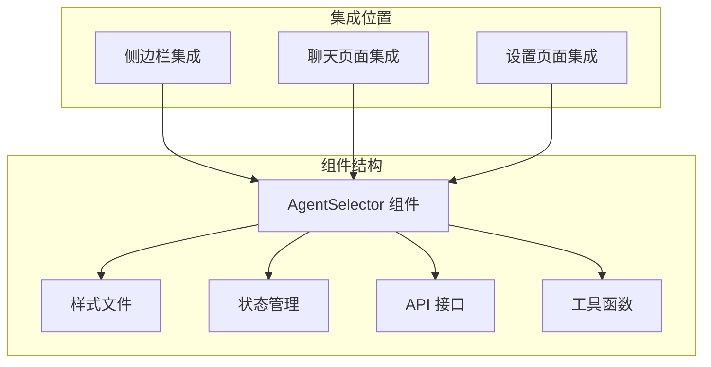
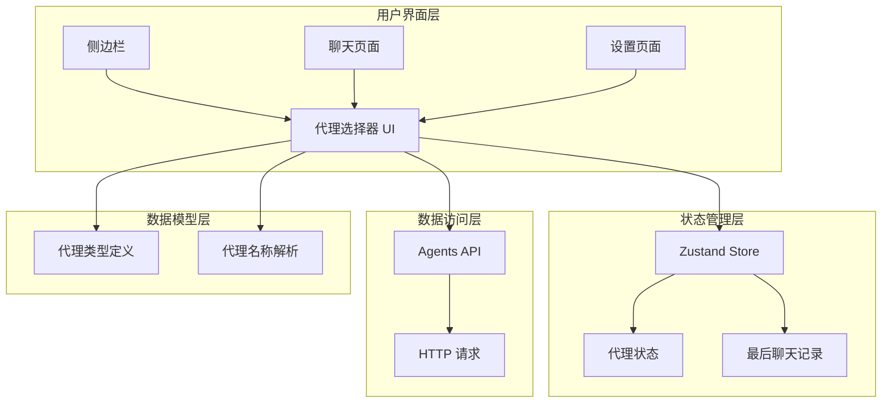
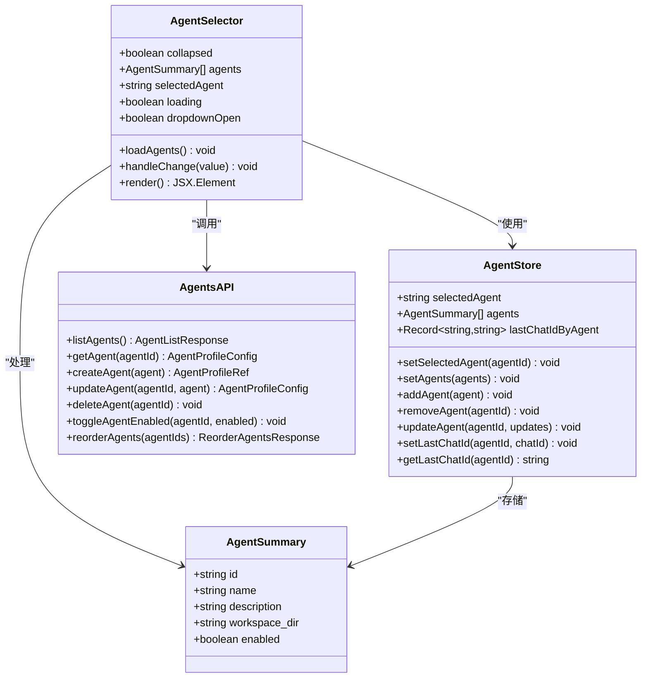
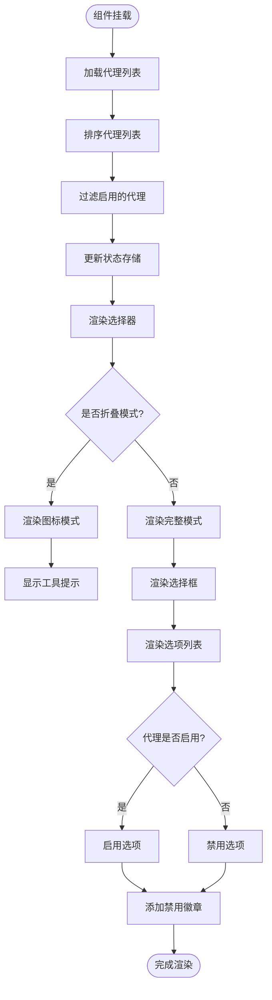
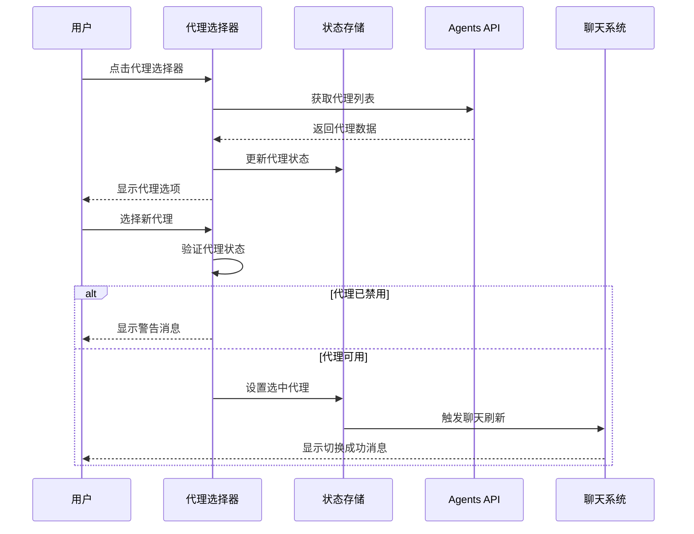
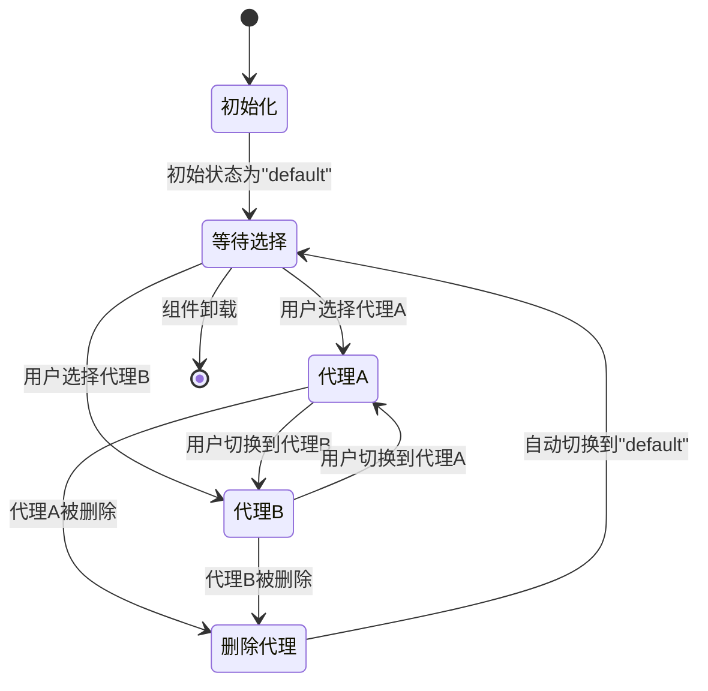
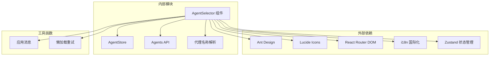

# 代理选择器组件

<cite>
**本文档引用的文件**
- [index.tsx](file://console/src/components/AgentSelector/index.tsx)
- [index.module.less](file://console/src/components/AgentSelector/index.module.less)
- [agentStore.ts](file://console/src/stores/agentStore.ts)
- [agents.ts](file://console/src/api/modules/agents.ts)
- [agent.ts](file://console/src/api/types/agents.ts)
- [agentDisplayName.ts](file://console/src/utils/agentDisplayName.ts)
- [Sidebar.tsx](file://console/src/layouts/Sidebar.tsx)
- [index.tsx](file://console/src/layouts/MainLayout/index.tsx)
- [index.tsx](file://console/src/pages/Chat/index.tsx)
- [index.tsx](file://console/src/pages/Settings/Agents/index.tsx)
</cite>

## 目录
1. [简介](#简介)
2. [项目结构](#项目结构)
3. [核心组件](#核心组件)
4. [架构概览](#架构概览)
5. [详细组件分析](#详细组件分析)
6. [依赖分析](#依赖分析)
7. [性能考虑](#性能考虑)
8. [故障排除指南](#故障排除指南)
9. [结论](#结论)
10. [附录](#附录)

## 简介

代理选择器组件是 CoPaw 控制台中的关键 UI 组件，用于在多代理环境中让用户选择和切换不同的 AI 代理实例。该组件提供了直观的用户界面，允许用户在工作空间内的多个代理之间进行切换，并提供了完整的代理管理功能。

该组件的核心特性包括：
- 实时代理列表展示和排序
- 代理状态管理（启用/禁用）
- 代理切换和状态同步
- 响应式设计支持
- 国际化支持
- 与聊天系统的深度集成

## 项目结构

代理选择器组件位于控制台前端项目的组件目录中，采用模块化的组织方式：

**图表来源**
- [index.tsx:1-197](file://console/src/components/AgentSelector/index.tsx#L1-L197)
- [Sidebar.tsx:471-480](file://console/src/layouts/Sidebar.tsx#L471-L480)

**章节来源**
- [index.tsx:1-197](file://console/src/components/AgentSelector/index.tsx#L1-L197)
- [Sidebar.tsx:471-480](file://console/src/layouts/Sidebar.tsx#L471-L480)

## 核心组件

代理选择器组件是一个 React 函数组件，具有以下核心功能：

### 主要功能特性

1. **代理列表获取和展示**
   - 通过 API 接口获取所有可用代理
   - 自动排序：启用的代理优先显示
   - 支持代理状态显示（启用/禁用）

2. **代理选择和切换**
   - 提供下拉选择框进行代理切换
   - 防止切换到禁用的代理
   - 自动处理代理删除或禁用的情况

3. **响应式设计**
   - 支持折叠模式（仅显示图标）
   - 完整模式显示代理详情
   - 自适应不同屏幕尺寸

4. **状态管理**
   - 使用 Zustand 进行本地状态管理
   - 支持代理选择状态持久化
   - 聊天会话与代理绑定

**章节来源**
- [index.tsx:13-19](file://console/src/components/AgentSelector/index.tsx#L13-L19)
- [agentStore.ts:5-17](file://console/src/stores/agentStore.ts#L5-L17)

## 架构概览

代理选择器组件在整个系统中的架构位置如下：

**图表来源**
- [index.tsx:1-11](file://console/src/components/AgentSelector/index.tsx#L1-L11)
- [agentStore.ts:1-89](file://console/src/stores/agentStore.ts#L1-L89)
- [agents.ts:1-79](file://console/src/api/modules/agents.ts#L1-L79)

## 详细组件分析

### 组件类图

**图表来源**
- [index.tsx:13-19](file://console/src/components/AgentSelector/index.tsx#L13-L19)
- [agentStore.ts:5-17](file://console/src/stores/agentStore.ts#L5-L17)
- [agent.ts:3-9](file://console/src/api/types/agents.ts#L3-L9)

### 渲染逻辑流程

**图表来源**
- [index.tsx:28-48](file://console/src/components/AgentSelector/index.tsx#L28-L48)
- [index.tsx:86-103](file://console/src/components/AgentSelector/index.tsx#L86-L103)

### 用户交互流程

**图表来源**
- [index.tsx:50-61](file://console/src/components/AgentSelector/index.tsx#L50-L61)
- [index.tsx:63-78](file://console/src/components/AgentSelector/index.tsx#L63-L78)

### 代理列表获取机制

组件通过以下机制获取和管理代理列表：

1. **初始化加载**
   - 组件挂载时自动触发代理列表加载
   - 使用异步 API 调用获取数据
   - 加载过程中显示加载状态

2. **数据排序**
   - 启用的代理优先显示
   - 禁用的代理排在末尾
   - 保持稳定的排序顺序

3. **状态同步**
   - 本地状态与全局状态存储同步
   - 自动处理代理状态变化
   - 错误处理和用户反馈

**章节来源**
- [index.tsx:28-48](file://console/src/components/AgentSelector/index.tsx#L28-L48)
- [agents.ts:14-14](file://console/src/api/modules/agents.ts#L14-L14)

### 选择状态管理

代理选择器使用 Zustand 状态管理库进行状态管理：

**图表来源**
- [agentStore.ts:22-24](file://console/src/stores/agentStore.ts#L22-L24)
- [index.tsx:63-78](file://console/src/components/AgentSelector/index.tsx#L63-L78)

### 样式定制方法

代理选择器提供了丰富的样式定制选项：

#### 主题支持
- 深色模式和浅色模式自动适配
- 动态颜色主题切换
- 媒体查询支持响应式设计

#### 组件样式层次
- 包装器容器样式
- 标签和计数器样式
- 下拉菜单样式
- 代理选项样式
- 图标和徽章样式

#### 自定义属性
- 宽度和高度调整
- 颜色方案定制
- 字体和间距配置
- 动画效果定制

**章节来源**
- [index.module.less:329-472](file://console/src/components/AgentSelector/index.module.less#L329-L472)

### 事件回调处理

组件支持多种事件回调机制：

1. **选择变更事件**
   - `onChange` 回调处理代理选择
   - 状态验证和错误处理
   - 用户反馈消息

2. **加载状态事件**
   - `onOpenChange` 处理下拉框打开状态
   - `loading` 状态指示
   - 错误处理和重试机制

3. **导航事件**
   - 管理链接点击处理
   - 页面路由跳转
   - 用户引导

**章节来源**
- [index.tsx:123-143](file://console/src/components/AgentSelector/index.tsx#L123-L143)
- [index.tsx:133-142](file://console/src/components/AgentSelector/index.tsx#L133-L142)

## 依赖分析

代理选择器组件的依赖关系如下：

**图表来源**
- [index.tsx:1-11](file://console/src/components/AgentSelector/index.tsx#L1-L11)
- [agentStore.ts:1-2](file://console/src/stores/agentStore.ts#L1-L2)

### 组件耦合度分析

代理选择器组件具有以下耦合特征：

- **低到中等耦合度**：主要依赖于外部库和状态管理
- **高内聚性**：专注于代理选择和切换功能
- **清晰的职责分离**：与业务逻辑分离
- **可测试性良好**：依赖注入和状态管理

**章节来源**
- [index.tsx:1-11](file://console/src/components/AgentSelector/index.tsx#L1-L11)
- [agentStore.ts:1-2](file://console/src/stores/agentStore.ts#L1-L2)

## 性能考虑

代理选择器组件在性能方面采用了多项优化策略：

### 加载优化
- **懒加载机制**：代理列表按需加载
- **缓存策略**：状态持久化减少重复请求
- **错误边界**：防止单个代理加载失败影响整体性能

### 渲染优化
- **虚拟滚动**：大量代理时的性能优化
- **条件渲染**：折叠模式下的轻量级渲染
- **防抖处理**：频繁状态变化的性能保护

### 内存管理
- **组件卸载清理**：自动清理事件监听器
- **状态清理**：组件销毁时的状态清理
- **资源释放**：及时释放不必要的内存

## 故障排除指南

### 常见问题及解决方案

#### 代理列表加载失败
**症状**：代理选择器显示加载错误
**原因**：网络请求失败或 API 服务不可用
**解决方案**：
1. 检查网络连接状态
2. 验证 API 服务可用性
3. 查看浏览器开发者工具中的错误信息
4. 重新加载页面尝试自动重连

#### 代理切换无效
**症状**：选择代理后无响应
**原因**：目标代理被禁用或状态异常
**解决方案**：
1. 检查目标代理的启用状态
2. 在设置页面中启用目标代理
3. 刷新页面重新加载代理状态
4. 检查代理配置是否正确

#### 状态同步问题
**症状**：代理选择状态不一致
**原因**：状态存储异常或缓存问题
**解决方案**：
1. 清除浏览器缓存
2. 重新登录系统
3. 检查 sessionStorage 权限
4. 重启应用进程

**章节来源**
- [index.tsx:42-47](file://console/src/components/AgentSelector/index.tsx#L42-L47)
- [index.tsx:53-57](file://console/src/components/AgentSelector/index.tsx#L53-L57)

## 结论

代理选择器组件是 CoPaw 控制台中一个设计精良、功能完善的 UI 组件。它成功地解决了多代理环境下的用户交互需求，提供了直观、高效的代理选择和切换体验。

### 主要优势
- **用户体验优秀**：简洁直观的界面设计
- **功能完整性**：涵盖代理管理的所有核心功能
- **性能优化**：采用多种性能优化策略
- **可维护性强**：清晰的代码结构和良好的文档

### 技术亮点
- **状态管理**：使用现代状态管理库实现复杂状态处理
- **响应式设计**：完美适配不同设备和屏幕尺寸
- **国际化支持**：全面的多语言支持
- **错误处理**：完善的错误处理和用户反馈机制

该组件为整个 CoPaw 系统的多代理功能奠定了坚实的基础，是系统架构中的重要组成部分。

## 附录

### 组件属性配置

| 属性名 | 类型 | 默认值 | 描述 |
|--------|------|--------|------|
| collapsed | boolean | false | 是否启用折叠模式 |
| className | string | undefined | 自定义 CSS 类名 |
| style | React.CSSProperties | undefined | 自定义内联样式 |

### 事件回调

| 事件名 | 参数 | 描述 |
|--------|------|------|
| onChange | (value: string) => void | 代理选择变更回调 |
| onOpenChange | (open: boolean) => void | 下拉框打开状态变更回调 |
| onSelect | (value: string, option: Select.Option) => void | 选项选择回调 |

### 样式定制选项

| 样式类 | 用途 | 描述 |
|--------|------|------|
| agentSelectorWrapper | 容器包装器 | 主容器样式 |
| agentSelector | 选择器样式 | 下拉选择器样式 |
| agentOption | 代理选项样式 | 代理选项样式 |
| agentSelectorCollapsed | 折叠模式样式 | 折叠模式样式 |
| agentCountBadge | 计数徽章样式 | 代理数量徽章样式 |