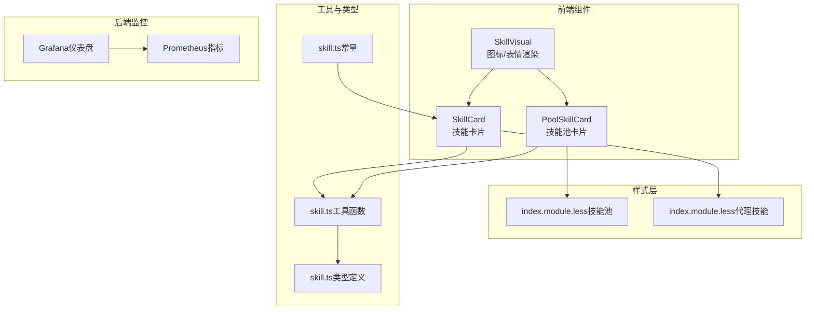
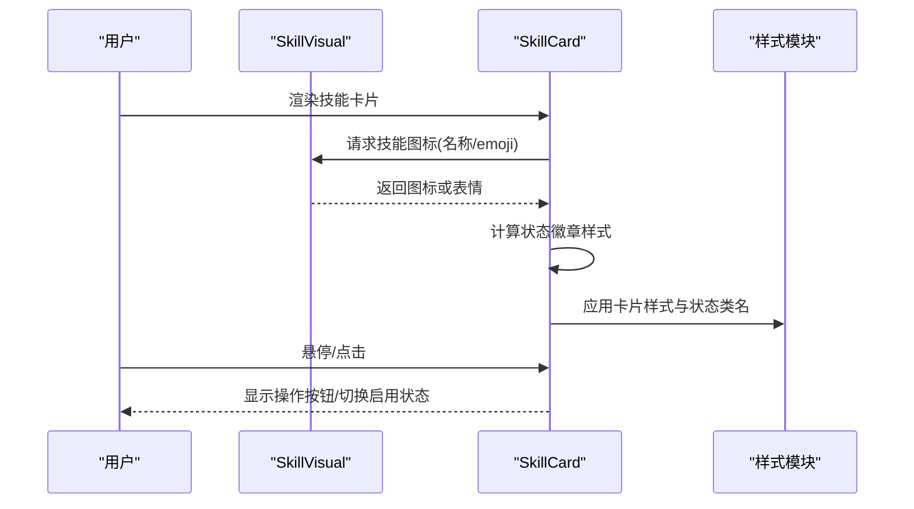
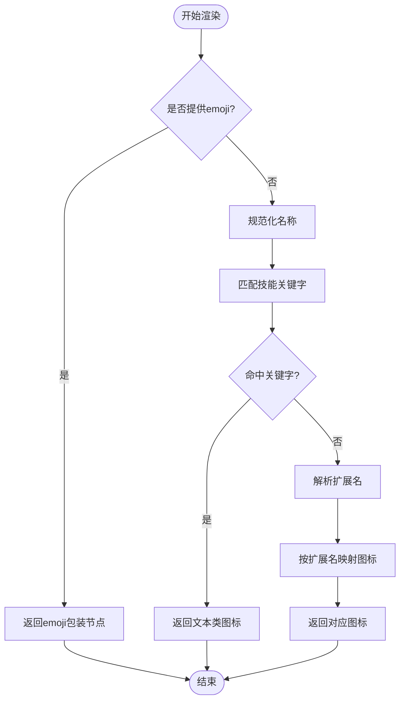
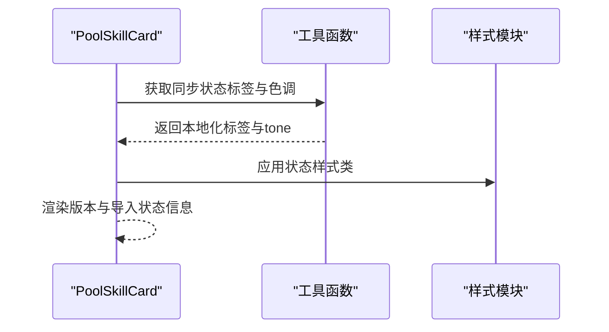
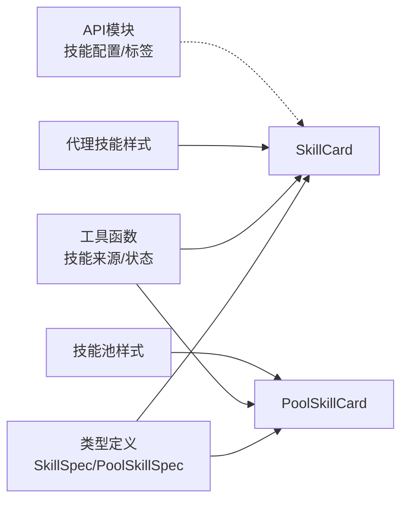

# 技能可视化组件

<cite>
**本文档引用的文件**
- [SkillVisual/index.tsx](file://console/src/components/SkillVisual/index.tsx)
- [SkillCard.tsx](file://console/src/pages/Agent/Skills/components/SkillCard.tsx)
- [PoolSkillCard.tsx](file://console/src/pages/Settings/SkillPool/components/PoolSkillCard.tsx)
- [index.module.less（技能池）](file://console/src/pages/Settings/SkillPool/index.module.less)
- [index.module.less（代理技能）](file://console/src/pages/Agent/Skills/index.module.less)
- [skill.ts（工具函数）](file://console/src/utils/skill.ts)
- [skill.ts（API模块）](file://console/src/api/modules/skill.ts)
- [skill.ts（类型定义）](file://console/src/api/types/skill.ts)
- [skill.ts（常量）](file://console/src/constants/skill.ts)
- [Grafana仪表盘](file://deploy/monitoring/grafana_dashboard.json)
- [实现计划-D](file://docs/implementation_plan-D.md)
</cite>

## 目录
1. [简介](#简介)
2. [项目结构](#项目结构)
3. [核心组件](#核心组件)
4. [架构总览](#架构总览)
5. [详细组件分析](#详细组件分析)
6. [依赖关系分析](#依赖关系分析)
7. [性能考虑](#性能考虑)
8. [故障排查指南](#故障排查指南)
9. [结论](#结论)
10. [附录](#附录)

## 简介
本文件系统性阐述“技能可视化组件”的设计与实现，重点覆盖以下方面：
- 如何直观展示技能的执行状态、进度信息与结果反馈
- 可视化图表的绘制逻辑、数据绑定机制、状态更新策略与交互反馈
- 组件的配置选项、样式定制与动画效果
- 技能监控的最佳实践、性能指标展示与用户体验优化建议

该组件以“图标/表情”为核心视觉元素，结合状态徽章、标签与元信息，形成统一的技能卡片与列表视图，既满足技能管理场景下的信息密度需求，又兼顾可读性与交互体验。

## 项目结构
技能可视化相关代码主要分布在控制台前端的组件层与样式层，并通过工具函数与API类型进行数据与状态支撑；后端侧提供监控指标，前端通过Grafana仪表盘进行可视化展示。



**图表来源**
- [SkillVisual/index.tsx:109-115](file://console/src/components/SkillVisual/index.tsx#L109-L115)
- [SkillCard.tsx:125-289](file://console/src/pages/Agent/Skills/components/SkillCard.tsx#L125-L289)
- [PoolSkillCard.tsx:43-127](file://console/src/pages/Settings/SkillPool/components/PoolSkillCard.tsx#L43-L127)
- [index.module.less（技能池）:374-520](file://console/src/pages/Settings/SkillPool/index.module.less#L374-L520)
- [index.module.less（代理技能）:1-200](file://console/src/pages/Agent/Skills/index.module.less#L1-L200)
- [skill.ts（工具函数）:1-42](file://console/src/utils/skill.ts#L1-L42)
- [skill.ts（类型定义）:1-85](file://console/src/api/types/skill.ts#L1-L85)
- [Grafana仪表盘:104-127](file://deploy/monitoring/grafana_dashboard.json#L104-L127)

**章节来源**
- [SkillVisual/index.tsx:1-115](file://console/src/components/SkillVisual/index.tsx#L1-L115)
- [SkillCard.tsx:1-289](file://console/src/pages/Agent/Skills/components/SkillCard.tsx#L1-L289)
- [PoolSkillCard.tsx:43-127](file://console/src/pages/Settings/SkillPool/components/PoolSkillCard.tsx#L43-L127)
- [index.module.less（技能池）:374-520](file://console/src/pages/Settings/SkillPool/index.module.less#L374-L520)
- [index.module.less（代理技能）:1-200](file://console/src/pages/Agent/Skills/index.module.less#L1-L200)
- [skill.ts（工具函数）:1-42](file://console/src/utils/skill.ts#L1-L42)
- [skill.ts（类型定义）:1-85](file://console/src/api/types/skill.ts#L1-L85)
- [Grafana仪表盘:104-127](file://deploy/monitoring/grafana_dashboard.json#L104-L127)

## 核心组件
- 技能可视化渲染器：根据技能名称或显式emoji选择合适的图标或表情，作为技能的“头像式”标识。
- 技能卡片：在卡片中组合“图标/表情 + 状态徽章 + 标签 + 元信息 + 描述”，支持悬停显示操作按钮与批量选择。
- 技能池卡片：用于技能商店/技能池页面，展示同步状态、版本信息与导入状态等。

这些组件共同构成技能的“可视化面板”，在不同页面以网格或列表形式呈现，确保用户对技能的来源、状态、能力与更新情况一目了然。

**章节来源**
- [SkillVisual/index.tsx:99-115](file://console/src/components/SkillVisual/index.tsx#L99-L115)
- [SkillCard.tsx:125-289](file://console/src/pages/Agent/Skills/components/SkillCard.tsx#L125-L289)
- [PoolSkillCard.tsx:43-127](file://console/src/pages/Settings/SkillPool/components/PoolSkillCard.tsx#L43-L127)

## 架构总览
技能可视化组件的运行链路如下：
- 输入：技能对象（名称、emoji、启用状态、渠道、标签、最后更新时间等）
- 处理：根据名称推导图标类型，或直接使用emoji；根据状态生成徽章；根据来源标注内置/自定义
- 输出：卡片UI，包含状态点、标签、描述与操作按钮（悬停可见）



**图表来源**
- [SkillVisual/index.tsx:109-115](file://console/src/components/SkillVisual/index.tsx#L109-L115)
- [SkillCard.tsx:125-289](file://console/src/pages/Agent/Skills/components/SkillCard.tsx#L125-L289)
- [index.module.less（代理技能）:180-200](file://console/src/pages/Agent/Skills/index.module.less#L180-L200)

**章节来源**
- [SkillCard.tsx:125-289](file://console/src/pages/Agent/Skills/components/SkillCard.tsx#L125-L289)
- [index.module.less（代理技能）:180-200](file://console/src/pages/Agent/Skills/index.module.less#L180-L200)

## 详细组件分析

### 技能可视化渲染器（SkillVisual）
职责与行为：
- 若传入emoji则直接渲染为文本表情
- 否则根据技能名称推导图标类型：优先匹配技能关键字，再按扩展名映射到文件类型图标
- 提供统一的props接口，便于在不同卡片中复用



**图表来源**
- [SkillVisual/index.tsx:13-97](file://console/src/components/SkillVisual/index.tsx#L13-L97)

**章节来源**
- [SkillVisual/index.tsx:13-97](file://console/src/components/SkillVisual/index.tsx#L13-L97)

### 技能卡片（SkillCard）
职责与行为：
- 展示技能图标/表情、启用状态徽章、内置/自定义标签、渠道、更新时间、标签集合与描述
- 支持悬停显示操作按钮（启用/禁用、删除），支持批量选择
- 使用本地状态维护悬停态，避免不必要的重渲染

```mermaid
classDiagram
class SkillCard {
+props : SkillSpec
-isHover : boolean
+onMouseEnter()
+onMouseLeave()
+onToggleEnabled()
+onDelete()
+onClick()
}
class SkillVisual {
+props : {name, emoji?, emojiClassName?}
+render()
}
class Utils {
+getSkillDisplaySource(source)
+isSkillBuiltin(source)
+getPoolBuiltinStatusLabel(status,t)
+getPoolBuiltinStatusTone(status)
}
SkillCard --> SkillVisual : "使用"
SkillCard --> Utils : "使用"
```

**图表来源**
- [SkillCard.tsx:21-30](file://console/src/pages/Agent/Skills/components/SkillCard.tsx#L21-L30)
- [SkillCard.tsx:125-289](file://console/src/pages/Agent/Skills/components/SkillCard.tsx#L125-L289)
- [SkillVisual/index.tsx:99-115](file://console/src/components/SkillVisual/index.tsx#L99-L115)
- [skill.ts（工具函数）:6-41](file://console/src/utils/skill.ts#L6-L41)

**章节来源**
- [SkillCard.tsx:125-289](file://console/src/pages/Agent/Skills/components/SkillCard.tsx#L125-L289)
- [skill.ts（工具函数）:6-41](file://console/src/utils/skill.ts#L6-L41)

### 技能池卡片（PoolSkillCard）
职责与行为：
- 在技能池页面展示技能的同步状态、版本信息与导入状态
- 与技能卡片类似，但更强调“池内状态”与“版本对比”



**图表来源**
- [PoolSkillCard.tsx:43-127](file://console/src/pages/Settings/SkillPool/components/PoolSkillCard.tsx#L43-L127)
- [skill.ts（工具函数）:16-41](file://console/src/utils/skill.ts#L16-L41)
- [index.module.less（技能池）:420-460](file://console/src/pages/Settings/SkillPool/index.module.less#L420-L460)

**章节来源**
- [PoolSkillCard.tsx:43-127](file://console/src/pages/Settings/SkillPool/components/PoolSkillCard.tsx#L43-L127)
- [skill.ts（工具函数）:16-41](file://console/src/utils/skill.ts#L16-L41)
- [index.module.less（技能池）:420-460](file://console/src/pages/Settings/SkillPool/index.module.less#L420-L460)

## 依赖关系分析
- 数据模型：技能规格由类型定义提供，包括名称、描述、启用状态、渠道、标签、最后更新时间、emoji等字段
- 工具函数：提供技能来源判断、同步状态标签与色调转换等
- 样式模块：分别针对技能池与代理技能页面提供卡片布局、状态徽章、标签与描述等样式
- API模块：提供技能配置、标签、池内配置等接口（用于后续扩展）



**图表来源**
- [skill.ts（类型定义）:8-36](file://console/src/api/types/skill.ts#L8-L36)
- [SkillCard.tsx:125-289](file://console/src/pages/Agent/Skills/components/SkillCard.tsx#L125-L289)
- [PoolSkillCard.tsx:43-127](file://console/src/pages/Settings/SkillPool/components/PoolSkillCard.tsx#L43-L127)
- [skill.ts（工具函数）:6-41](file://console/src/utils/skill.ts#L6-L41)
- [index.module.less（技能池）:374-520](file://console/src/pages/Settings/SkillPool/index.module.less#L374-L520)
- [index.module.less（代理技能）:180-200](file://console/src/pages/Agent/Skills/index.module.less#L180-L200)
- [skill.ts（API模块）:402-445](file://console/src/api/modules/skill.ts#L402-L445)

**章节来源**
- [skill.ts（类型定义）:8-36](file://console/src/api/types/skill.ts#L8-L36)
- [skill.ts（工具函数）:6-41](file://console/src/utils/skill.ts#L6-L41)
- [skill.ts（API模块）:402-445](file://console/src/api/modules/skill.ts#L402-L445)

## 性能考虑
- 图标计算：通过预设关键字与扩展名映射减少分支判断开销；对名称进行标准化处理，避免大小写与空白字符影响匹配
- 渲染优化：卡片使用记忆化组件，仅在必要props变化时重渲染；悬停态使用本地状态，避免全局状态波动
- 样式模块：采用CSS模块化，按需引入类名，降低样式冲突与重绘成本
- 列表/网格：在大数据集下优先使用虚拟滚动或分页策略（当前样式支持网格与列表两种视图）

[本节为通用性能建议，不直接分析具体文件]

## 故障排查指南
常见问题与定位思路：
- 图标未正确显示
  - 检查技能名称是否包含受支持的关键字或扩展名
  - 确认emoji参数是否传入
- 状态徽章颜色异常
  - 检查技能启用状态与同步状态是否正确传递
  - 确认样式模块中的状态类名是否生效
- 标签与描述为空
  - 确认技能对象的tags与description字段是否为空
- 操作按钮不可见
  - 检查是否处于批量模式或悬停态
  - 确认按钮禁用条件与事件冒泡处理

**章节来源**
- [SkillVisual/index.tsx:13-97](file://console/src/components/SkillVisual/index.tsx#L13-L97)
- [SkillCard.tsx:188-200](file://console/src/pages/Agent/Skills/components/SkillCard.tsx#L188-L200)
- [index.module.less（代理技能）:180-200](file://console/src/pages/Agent/Skills/index.module.less#L180-L200)

## 结论
技能可视化组件通过“图标/表情 + 状态徽章 + 标签 + 元信息”的组合，实现了对技能的高密度、易读性与交互友好的可视化表达。其设计遵循“数据驱动、样式解耦、工具函数抽象”的原则，便于在不同页面复用与扩展。配合后端监控指标与Grafana仪表盘，可进一步完善技能使用的可观测性与性能分析。

[本节为总结性内容，不直接分析具体文件]

## 附录

### 配置选项与样式定制
- 组件属性
  - 名称：技能名称（用于推导图标）
  - Emoji：可选，直接渲染为表情
  - Emoji类名：可选，应用于emoji容器
- 样式定制
  - 技能池卡片：状态徽章、标签、描述、元信息行等均有独立类名，可按需覆盖
  - 代理技能卡片：卡片、标题、内置/自定义标签、操作按钮等均支持主题化

**章节来源**
- [SkillVisual/index.tsx:99-115](file://console/src/components/SkillVisual/index.tsx#L99-L115)
- [index.module.less（技能池）:420-520](file://console/src/pages/Settings/SkillPool/index.module.less#L420-L520)
- [index.module.less（代理技能）:180-200](file://console/src/pages/Agent/Skills/index.module.less#L180-L200)

### 动画与交互反馈
- 悬停态：卡片边框与阴影变化，操作按钮出现
- 批量选择：勾选框与选中态高亮
- 状态点：启用/禁用状态以圆点颜色区分

**章节来源**
- [SkillCard.tsx:167-180](file://console/src/pages/Agent/Skills/components/SkillCard.tsx#L167-L180)
- [index.module.less（代理技能）:180-200](file://console/src/pages/Agent/Skills/index.module.less#L180-L200)

### 技能监控与最佳实践
- 指标采集：后端通过Prometheus暴露指标，前端通过Grafana仪表盘展示
- 最佳实践：
  - 使用统一的状态枚举与本地化标签，保证跨页面一致性
  - 对于大列表，建议引入虚拟滚动与懒加载
  - 对关键操作（启用/禁用、删除）增加二次确认与错误提示
  - 将技能池的同步状态与版本信息纳入监控看板，定期巡检

**章节来源**
- [Grafana仪表盘:104-127](file://deploy/monitoring/grafana_dashboard.json#L104-L127)
- [实现计划-D:30-66](file://docs/implementation_plan-D.md#L30-L66)