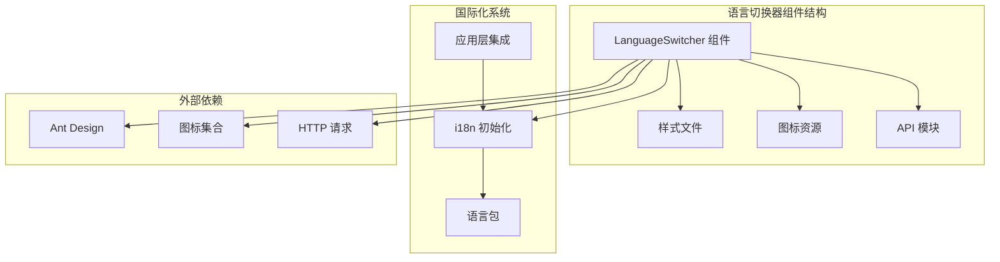
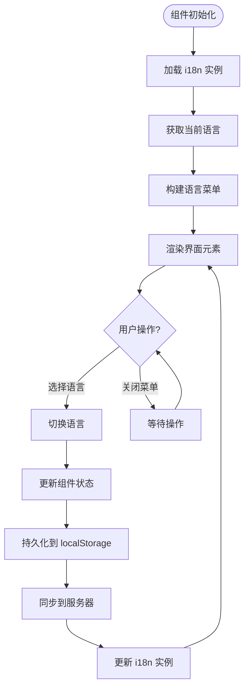
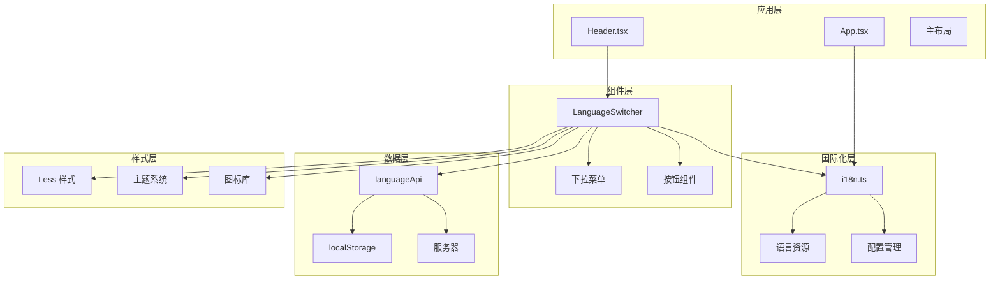
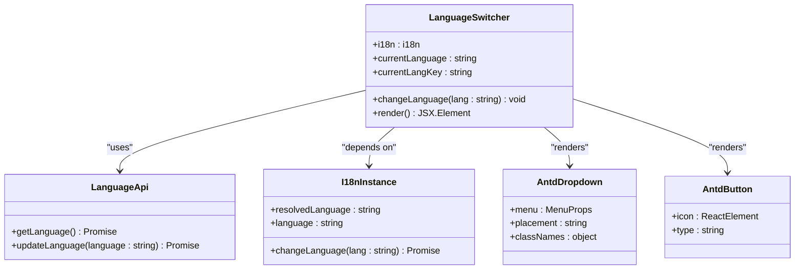
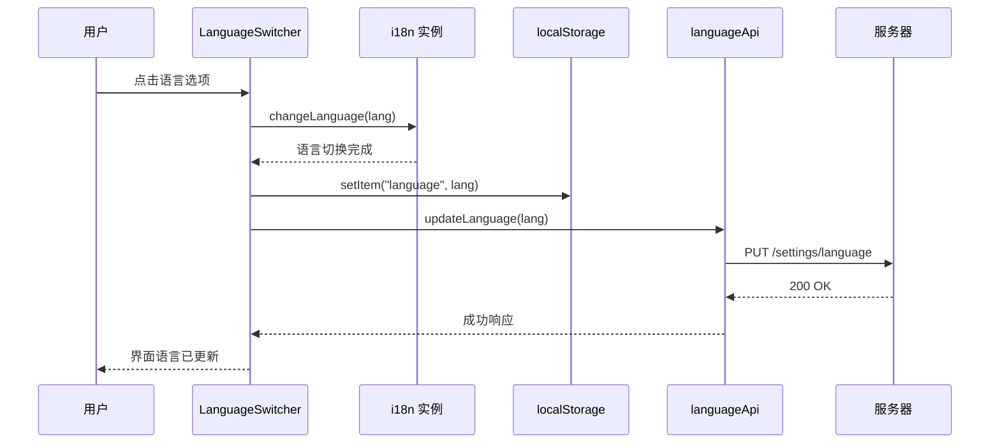
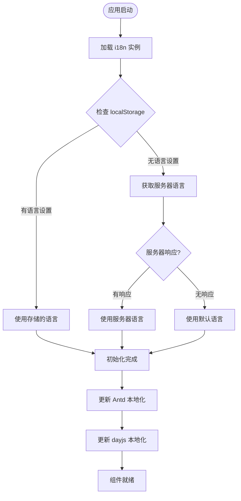
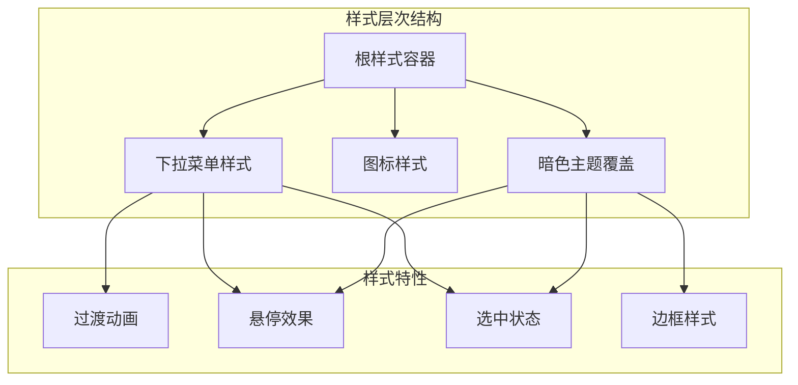
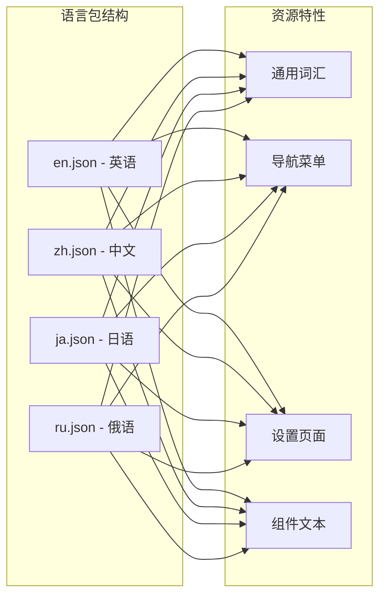
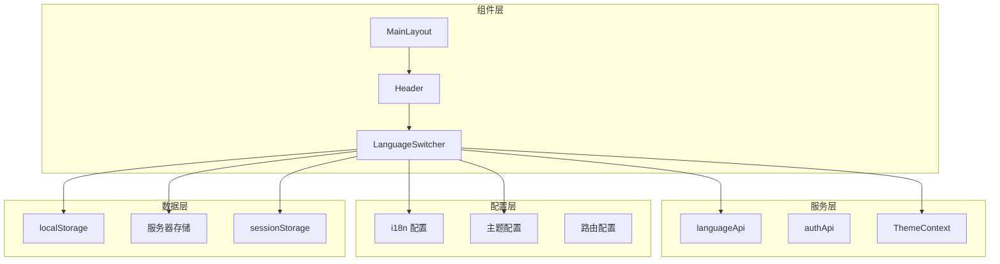

# 语言切换器组件

<cite>
**本文档引用的文件**
- [LanguageSwitcher/index.tsx](file://console/src/components/LanguageSwitcher/index.tsx)
- [LanguageSwitcher/index.module.less](file://console/src/components/LanguageSwitcher/index.module.less)
- [i18n.ts](file://console/src/i18n.ts)
- [App.tsx](file://console/src/App.tsx)
- [language.ts](file://console/src/api/modules/language.ts)
- [Header.tsx](file://console/src/layouts/Header.tsx)
- [en.json](file://console/src/locales/en.json)
- [zh.json](file://console/src/locales/zh.json)
</cite>

## 目录
1. [简介](#简介)
2. [项目结构](#项目结构)
3. [核心组件](#核心组件)
4. [架构概览](#架构概览)
5. [详细组件分析](#详细组件分析)
6. [依赖关系分析](#依赖关系分析)
7. [性能考虑](#性能考虑)
8. [故障排除指南](#故障排除指南)
9. [结论](#结论)
10. [附录](#附录)

## 简介

语言切换器组件是 CoPaw 控制台应用中的关键国际化功能模块，负责实现多语言支持和动态语言切换功能。该组件集成了完整的 i18n 系统，支持英语、简体中文、日语和俄语四种语言，提供了流畅的用户体验和完善的国际化机制。

该组件不仅实现了基本的语言切换功能，还包含了语言包加载策略、状态持久化、用户偏好存储、样式定制和可访问性支持等高级特性。通过与 Ant Design 组件库的深度集成，确保了在不同主题模式下的视觉一致性。

## 项目结构

语言切换器组件位于控制台应用的组件目录中，采用模块化的设计结构：



**图表来源**
- [LanguageSwitcher/index.tsx:1-69](file://console/src/components/LanguageSwitcher/index.tsx#L1-L69)
- [i18n.ts:1-32](file://console/src/i18n.ts#L1-L32)

**章节来源**
- [LanguageSwitcher/index.tsx:1-69](file://console/src/components/LanguageSwitcher/index.tsx#L1-L69)
- [i18n.ts:1-32](file://console/src/i18n.ts#L1-L32)

## 核心组件

语言切换器组件的核心功能包括：

### 主要功能特性
- **多语言支持**：支持英语(en)、简体中文(zh)、日语(ja)、俄语(ru)
- **动态切换**：实时切换界面语言，无需刷新页面
- **状态持久化**：使用 localStorage 存储用户语言偏好
- **远程同步**：通过 API 将语言偏好同步到服务器
- **图标适配**：根据语言显示相应的国旗/文字图标
- **样式定制**：支持明暗主题下的视觉适配

### 组件架构
组件采用函数式组件设计，利用 React Hooks 实现状态管理和副作用处理：



**图表来源**
- [LanguageSwitcher/index.tsx:13-67](file://console/src/components/LanguageSwitcher/index.tsx#L13-L67)

**章节来源**
- [LanguageSwitcher/index.tsx:1-69](file://console/src/components/LanguageSwitcher/index.tsx#L1-L69)

## 架构概览

语言切换器组件在整个应用架构中扮演着重要的角色，它与多个系统组件协同工作：



**图表来源**
- [App.tsx:142-217](file://console/src/App.tsx#L142-L217)
- [LanguageSwitcher/index.tsx:1-69](file://console/src/components/LanguageSwitcher/index.tsx#L1-L69)

## 详细组件分析

### 组件实现细节

#### 核心组件类图


**图表来源**
- [LanguageSwitcher/index.tsx:13-67](file://console/src/components/LanguageSwitcher/index.tsx#L13-L67)
- [language.ts:3-11](file://console/src/api/modules/language.ts#L3-L11)

#### 语言切换流程


**图表来源**
- [LanguageSwitcher/index.tsx:19-27](file://console/src/components/LanguageSwitcher/index.tsx#L19-L27)
- [language.ts:6-11](file://console/src/api/modules/language.ts#L6-L11)

#### 国际化初始化流程


**图表来源**
- [App.tsx:151-181](file://console/src/App.tsx#L151-L181)
- [i18n.ts:22-29](file://console/src/i18n.ts#L22-L29)

**章节来源**
- [LanguageSwitcher/index.tsx:1-69](file://console/src/components/LanguageSwitcher/index.tsx#L1-L69)
- [App.tsx:142-217](file://console/src/App.tsx#L142-L217)
- [i18n.ts:1-32](file://console/src/i18n.ts#L1-L32)

### 样式系统分析

#### 样式架构
语言切换器组件采用了模块化的样式系统，支持明暗主题的自动适配：



**图表来源**
- [LanguageSwitcher/index.module.less:1-75](file://console/src/components/LanguageSwitcher/index.module.less#L1-L75)

#### 样式定制选项
组件提供了丰富的样式定制能力：

| 样式属性 | 默认值 | 描述 |
|---------|--------|------|
| 字体族 | Inter, sans-serif | 主要字体设置 |
| 字体大小 | 14px | 菜单项字体大小 |
| 行高 | 24px | 文本行高设置 |
| 颜色透明度 | 0.65/0.88 | 不同状态的颜色透明度 |
| 过渡时间 | 0.2s ease | 动画过渡时长 |
| 暗色主题背景 | #2a2a2a | 暗色模式下菜单背景 |

**章节来源**
- [LanguageSwitcher/index.module.less:1-75](file://console/src/components/LanguageSwitcher/index.module.less#L1-L75)

### 语言包管理

#### 语言资源组织
应用支持四种主要语言，每种语言都有对应的 JSON 资源文件：



**图表来源**
- [i18n.ts:3-6](file://console/src/i18n.ts#L3-L6)
- [en.json:1-50](file://console/src/locales/en.json#L1-L50)
- [zh.json:1-50](file://console/src/locales/zh.json#L1-L50)

#### 语言包加载策略
组件采用懒加载和预加载相结合的策略：

1. **预加载策略**：应用启动时预加载所有语言包
2. **按需切换**：用户切换语言时即时生效
3. **缓存机制**：使用 localStorage 缓存用户偏好
4. **降级处理**：回退到英语作为备用语言

**章节来源**
- [i18n.ts:1-32](file://console/src/i18n.ts#L1-L32)
- [en.json:1-1358](file://console/src/locales/en.json#L1-L1358)
- [zh.json:1-1366](file://console/src/locales/zh.json#L1-L1366)

## 依赖关系分析

### 外部依赖关系
语言切换器组件依赖于多个外部库和框架：

```mermaid
graph TB
subgraph "核心依赖"
REACT[React 18+]
I18NEXT[i18next]
REACT_I18N[react-i18next]
end
subgraph "UI 组件库"
ANT_DESIGN[Ant Design]
DESIGN_LIB[@agentscope-ai/design]
end
subgraph "图标系统"
ICON_SET[图标集合]
SPARK_ICONS[Spark Icons]
end
subgraph "HTTP 客户端"
AXIOS[Axios]
CUSTOM_REQUEST[自定义请求封装]
end
subgraph "样式系统"
LESS[Less]
ANTD_STYLE[antd-style]
end
LanguageSwitcher --> REACT
LanguageSwitcher --> I18NEXT
LanguageSwitcher --> REACT_I18N
LanguageSwitcher --> ANT_DESIGN
LanguageSwitcher --> DESIGN_LIB
LanguageSwitcher --> ICON_SET
LanguageSwitcher --> SPARK_ICONS
LanguageSwitcher --> AXIOS
LanguageSwitcher --> CUSTOM_REQUEST
LanguageSwitcher --> LESS
LanguageSwitcher --> ANTD_STYLE
```

**图表来源**
- [LanguageSwitcher/index.tsx:1-11](file://console/src/components/LanguageSwitcher/index.tsx#L1-L11)

### 内部依赖关系
组件与应用其他模块的集成关系：



**图表来源**
- [LanguageSwitcher/index.tsx:1-6](file://console/src/components/LanguageSwitcher/index.tsx#L1-L6)
- [App.tsx:1-25](file://console/src/App.tsx#L1-L25)

**章节来源**
- [LanguageSwitcher/index.tsx:1-69](file://console/src/components/LanguageSwitcher/index.tsx#L1-L69)
- [App.tsx:1-228](file://console/src/App.tsx#L1-L228)

## 性能考虑

### 性能优化策略

#### 渲染性能
- **虚拟化菜单**：使用 Ant Design 的虚拟化功能优化大列表渲染
- **条件渲染**：仅在语言变化时重新渲染相关组件
- **防抖处理**：对频繁的语言切换操作进行防抖处理

#### 内存管理
- **事件监听器清理**：正确清理 i18n 事件监听器
- **组件卸载处理**：确保组件卸载时释放所有资源
- **缓存策略**：合理使用 localStorage 减少网络请求

#### 网络性能
- **预加载策略**：应用启动时预加载语言包
- **增量更新**：支持语言包的增量更新
- **CDN 优化**：语言包文件支持 CDN 加速

### 性能监控指标

| 指标类型 | 目标值 | 监控方法 |
|---------|--------|----------|
| 切换响应时间 | < 100ms | 使用 Performance API |
| 内存使用 | < 50MB | 使用浏览器开发者工具 |
| 语言包加载 | < 2s | 监控网络面板 |
| 组件渲染 | < 16ms | 使用 React Profiler |

## 故障排除指南

### 常见问题及解决方案

#### 语言切换失效
**问题描述**：点击语言选项后界面不发生变化

**可能原因**：
1. i18n 实例未正确初始化
2. localStorage 权限问题
3. 服务器 API 调用失败

**解决方案**：
```typescript
// 检查 i18n 实例状态
console.log('i18n 实例:', i18n);
console.log('当前语言:', i18n.language);
console.log('解析语言:', i18n.resolvedLanguage);

// 检查 localStorage
console.log('localStorage 语言设置:', localStorage.getItem('language'));

// 检查 API 调用
languageApi.updateLanguage('zh')
  .then(response => console.log('API 调用成功'))
  .catch(error => console.error('API 调用失败:', error));
```

#### 语言包加载失败
**问题描述**：应用启动时语言包加载异常

**可能原因**：
1. 网络连接问题
2. 语言包文件损坏
3. 跨域访问限制

**解决方案**：
1. 检查网络连接状态
2. 验证语言包文件完整性
3. 检查 CORS 配置
4. 清理浏览器缓存

#### 主题兼容性问题
**问题描述**：在暗色主题下语言切换器显示异常

**解决方案**：
1. 检查暗色主题样式覆盖
2. 验证颜色对比度
3. 测试不同设备的显示效果

**章节来源**
- [LanguageSwitcher/index.tsx:19-27](file://console/src/components/LanguageSwitcher/index.tsx#L19-L27)
- [App.tsx:151-181](file://console/src/App.tsx#L151-L181)

### 调试技巧

#### 开发环境调试
1. **启用 i18n 调试模式**：
```javascript
// 在 i18n 初始化时添加调试配置
i18n.init({
  debug: true,
  // 其他配置...
});
```

2. **使用浏览器开发者工具**：
   - Network 标签页检查语言包加载
   - Application 标签页检查 localStorage
   - Console 标签页查看错误信息

3. **模拟不同语言环境**：
```javascript
// 强制设置特定语言进行测试
i18n.changeLanguage('zh');
localStorage.setItem('language', 'zh');
```

## 结论

语言切换器组件是一个功能完整、架构清晰的国际化解决方案。它成功地实现了多语言支持、动态切换、状态持久化和样式定制等核心功能，同时保持了良好的性能表现和用户体验。

组件的主要优势包括：
- **完整的国际化支持**：支持四种主流语言
- **无缝切换体验**：实时语言切换无需页面刷新
- **完善的持久化机制**：本地存储和服务器同步双重保障
- **优秀的可扩展性**：易于添加新的语言支持
- **良好的性能表现**：优化的渲染和内存管理

未来可以考虑的改进方向：
- 支持更多语言选项
- 实现语言包的动态加载
- 增强离线语言包缓存
- 提供更丰富的样式定制选项

## 附录

### 配置选项参考

#### 组件配置属性
| 属性名 | 类型 | 默认值 | 描述 |
|-------|------|--------|------|
| placement | string | "bottomRight" | 下拉菜单位置 |
| classNames.root | string | "languageDropdown" | 根元素样式类名 |
| selectedKeys | string[] | [currentLangKey] | 选中项键值 |

#### 样式定制变量
| 变量名 | 默认值 | 说明 |
|-------|--------|------|
| --language-transition-duration | 0.2s | 动画过渡时长 |
| --language-hover-opacity | 0.8 | 悬停时透明度 |
| --language-dark-bg | #2a2a2a | 暗色主题背景色 |
| --language-dark-text | rgba(255,255,255,0.65) | 暗色主题文字色 |

#### API 接口规范
| 接口名 | 方法 | URL | 描述 |
|-------|------|-----|------|
| getLanguage | GET | /settings/language | 获取用户语言偏好 |
| updateLanguage | PUT | /settings/language | 更新用户语言偏好 |