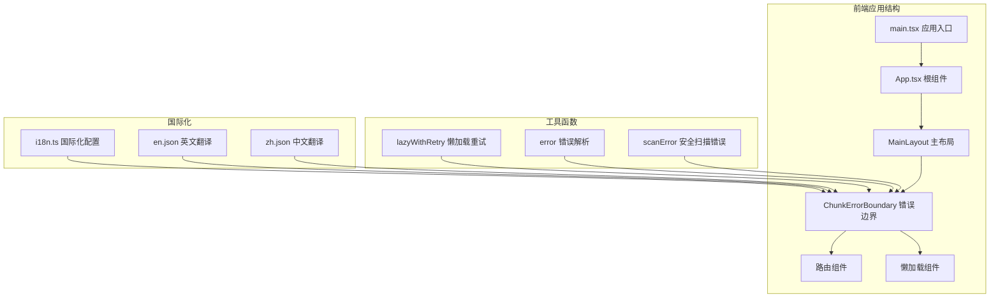
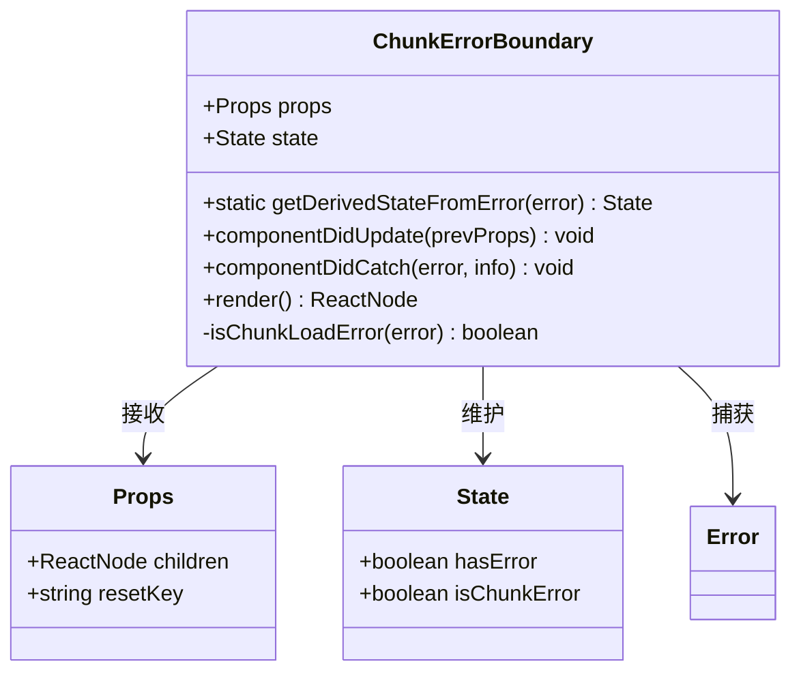
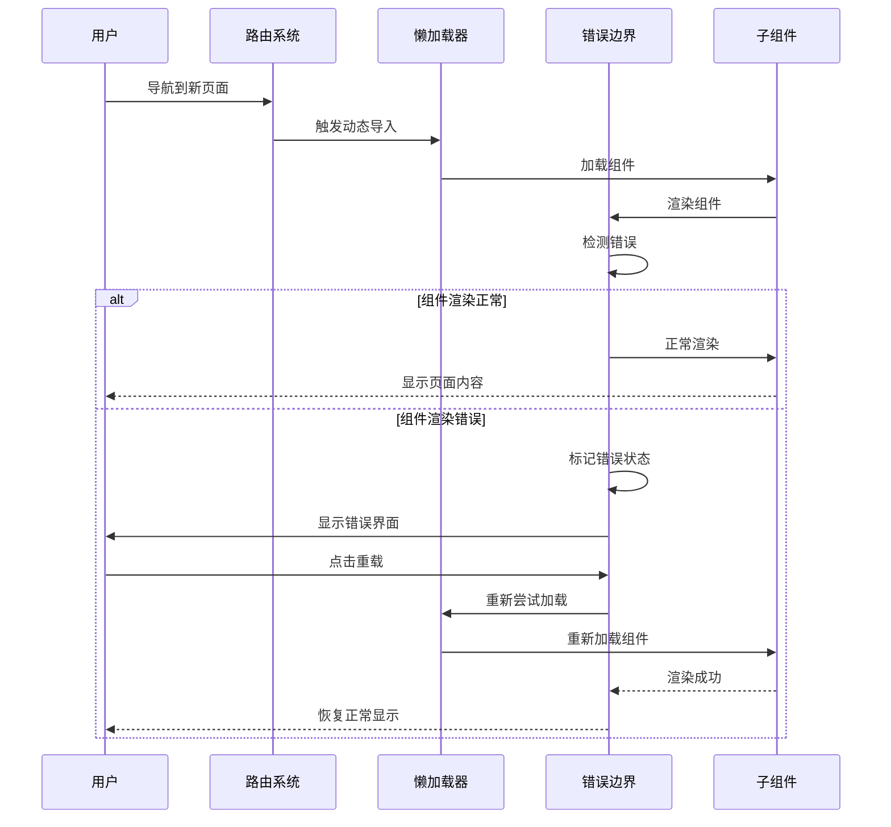
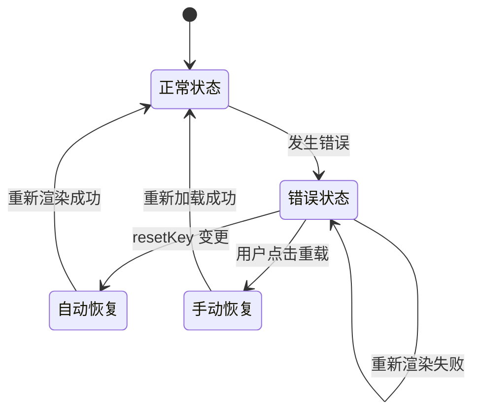
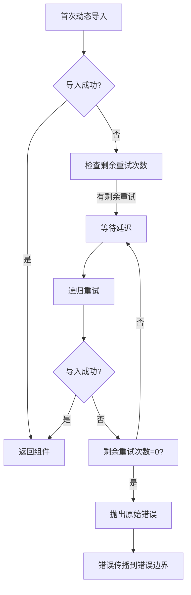
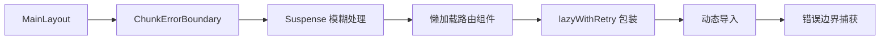
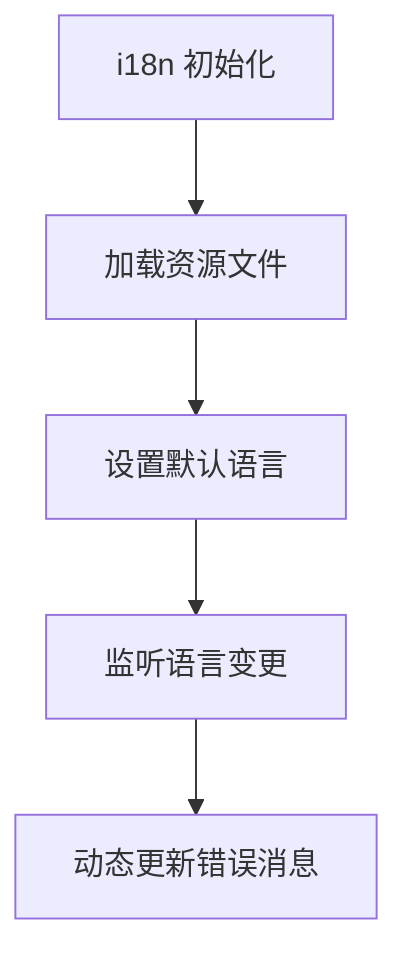
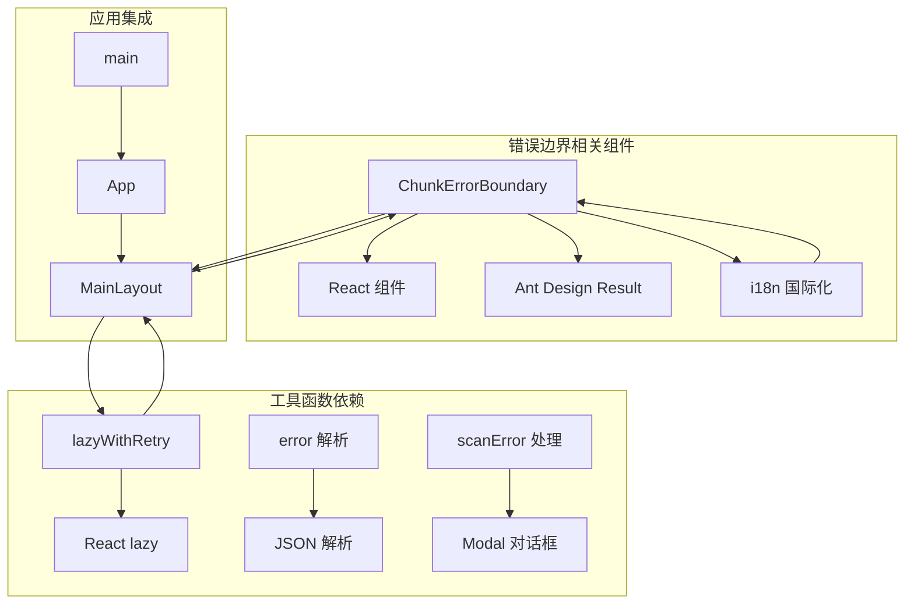
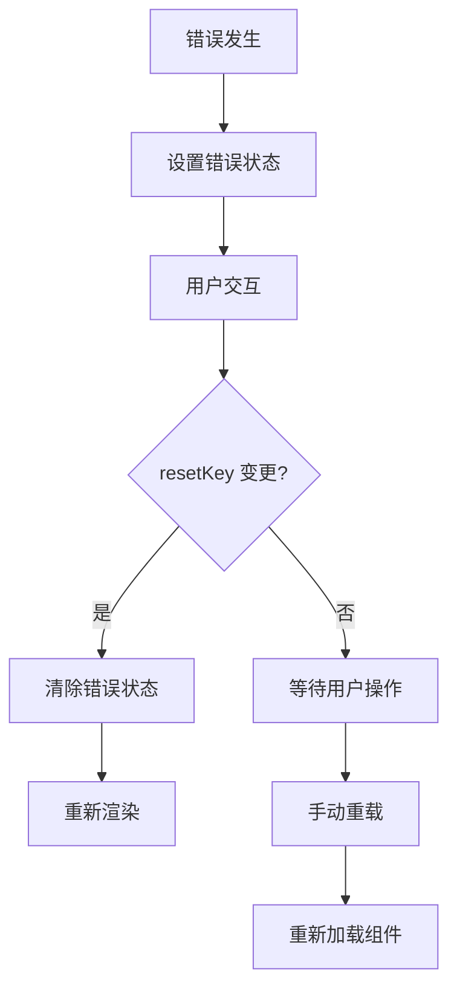
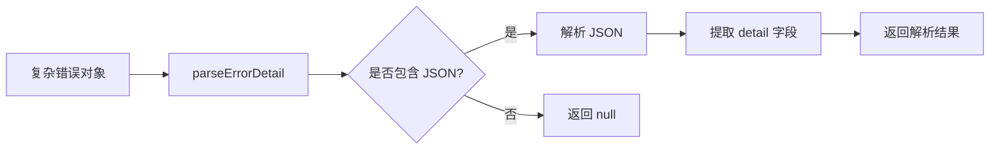

# 错误边界组件

<cite>
**本文档引用的文件**
- [ChunkErrorBoundary.tsx](file://console/src/components/ChunkErrorBoundary.tsx)
- [MainLayout/index.tsx](file://console/src/layouts/MainLayout/index.tsx)
- [lazyWithRetry.ts](file://console/src/utils/lazyWithRetry.ts)
- [error.ts](file://console/src/utils/error.ts)
- [scanError.ts](file://console/src/utils/scanError.ts)
- [App.tsx](file://console/src/App.tsx)
- [main.tsx](file://console/src/main.tsx)
- [i18n.ts](file://console/src/i18n.ts)
- [en.json](file://console/src/locales/en.json)
- [zh.json](file://console/src/locales/zh.json)
</cite>

## 目录
1. [简介](#简介)
2. [项目结构](#项目结构)
3. [核心组件](#核心组件)
4. [架构概览](#架构概览)
5. [详细组件分析](#详细组件分析)
6. [依赖关系分析](#依赖关系分析)
7. [性能考虑](#性能考虑)
8. [故障排除指南](#故障排除指南)
9. [结论](#结论)

## 简介

错误边界组件是前端应用中用于捕获和处理渲染错误的关键组件。它能够防止单个组件的错误导致整个应用崩溃，并提供友好的错误提示和恢复机制。在本项目中，错误边界组件专门针对动态加载的路由模块进行了优化，能够智能区分网络加载错误和其他渲染错误。

## 项目结构

错误边界组件位于前端项目的组件目录中，与主应用结构紧密集成：



**图表来源**
- [main.tsx:1-31](file://console/src/main.tsx#L1-L31)
- [App.tsx:1-228](file://console/src/App.tsx#L1-L228)
- [MainLayout/index.tsx:1-156](file://console/src/layouts/MainLayout/index.tsx#L1-L156)
- [ChunkErrorBoundary.tsx:1-85](file://console/src/components/ChunkErrorBoundary.tsx#L1-L85)

**章节来源**
- [main.tsx:1-31](file://console/src/main.tsx#L1-L31)
- [App.tsx:1-228](file://console/src/App.tsx#L1-L228)
- [MainLayout/index.tsx:1-156](file://console/src/layouts/MainLayout/index.tsx#L1-L156)

## 核心组件

### 错误边界组件架构

错误边界组件采用类组件形式，实现了React的错误边界生命周期方法：



**图表来源**
- [ChunkErrorBoundary.tsx:6-15](file://console/src/components/ChunkErrorBoundary.tsx#L6-L15)

### 错误检测机制

组件具备智能的错误类型识别能力：

```mermaid
flowchart TD
A[组件渲染触发] --> B{是否发生错误?}
B --> |否| C[正常渲染 children]
B --> |是| D[getDerivedStateFromError]
D --> E{错误类型判断}
E --> |动态加载错误| F[标记 isChunkError = true]
E --> |其他渲染错误| G[标记 isChunkError = false]
F --> H[显示特定错误界面]
G --> I[显示通用错误界面]
H --> J[提供重载按钮]
I --> J
J --> K[用户点击重载]
K --> L[window.location.reload()]
```

**图表来源**
- [ChunkErrorBoundary.tsx:44-57](file://console/src/components/ChunkErrorBoundary.tsx#L44-L57)
- [ChunkErrorBoundary.tsx:18-28](file://console/src/components/ChunkErrorBoundary.tsx#L18-L28)

**章节来源**
- [ChunkErrorBoundary.tsx:1-85](file://console/src/components/ChunkErrorBoundary.tsx#L1-L85)

## 架构概览

错误边界组件在整个应用架构中的作用和位置：



**图表来源**
- [MainLayout/index.tsx:108-149](file://console/src/layouts/MainLayout/index.tsx#L108-L149)
- [lazyWithRetry.ts:16-35](file://console/src/utils/lazyWithRetry.ts#L16-L35)
- [ChunkErrorBoundary.tsx:44-83](file://console/src/components/ChunkErrorBoundary.tsx#L44-L83)

## 详细组件分析

### 错误边界实现细节

#### 错误状态管理

错误边界组件维护两个关键状态：

| 状态属性 | 类型 | 描述 | 默认值 |
|---------|------|------|--------|
| hasError | boolean | 是否发生错误 | false |
| isChunkError | boolean | 是否为动态加载错误 | false |

#### 错误类型识别算法

组件使用启发式方法来区分不同类型的错误：

```mermaid
flowchart LR
A[错误对象] --> B{是否为 Error 实例?}
B --> |否| C[返回 false]
B --> |是| D[提取错误消息]
D --> E{包含特定关键词?}
E --> |包含| F[返回 true]
E --> |不包含| G{name === "ChunkLoadError"?}
G --> |是| F
G --> |否| C
```

**图表来源**
- [ChunkErrorBoundary.tsx:18-28](file://console/src/components/ChunkErrorBoundary.tsx#L18-L28)

#### 降级渲染策略

错误边界提供两种不同的降级渲染策略：

| 错误类型 | 标题键 | 副标题键 | 特点 |
|---------|-------|---------|------|
| 动态加载错误 | chunkError.title | chunkError.subTitle | 针对网络/缓存问题的特定提示 |
| 其他渲染错误 | chunkError.genericTitle | chunkError.genericSubTitle | 通用错误处理 |

#### 错误恢复机制

组件提供了自动和手动的恢复机制：



**图表来源**
- [ChunkErrorBoundary.tsx:48-52](file://console/src/components/ChunkErrorBoundary.tsx#L48-L52)
- [ChunkErrorBoundary.tsx:74-76](file://console/src/components/ChunkErrorBoundary.tsx#L74-L76)

**章节来源**
- [ChunkErrorBoundary.tsx:17-85](file://console/src/components/ChunkErrorBoundary.tsx#L17-L85)

### 懒加载与错误边界集成

#### 懒加载重试机制

懒加载工具函数提供了智能的重试机制：



**图表来源**
- [lazyWithRetry.ts:22-35](file://console/src/utils/lazyWithRetry.ts#L22-L35)

#### 集成使用方式

在主布局中，错误边界与懒加载组件的集成方式：



**图表来源**
- [MainLayout/index.tsx:108-149](file://console/src/layouts/MainLayout/index.tsx#L108-L149)
- [MainLayout/index.tsx:16-51](file://console/src/layouts/MainLayout/index.tsx#L16-L51)

**章节来源**
- [lazyWithRetry.ts:1-36](file://console/src/utils/lazyWithRetry.ts#L1-L36)
- [MainLayout/index.tsx:1-156](file://console/src/layouts/MainLayout/index.tsx#L1-L156)

### 国际化与本地化

#### 多语言支持

错误边界组件完全支持国际化，包含以下语言的错误消息：

| 语言 | 标题 | 副标题 | 重载按钮文本 |
|------|------|--------|-------------|
| 英语 | "Failed to load page" | "This may be caused by a network issue or an application update." | "Reload" |
| 中文 | "页面加载失败" | "可能由网络问题或应用更新导致，请稍后重试。" | "刷新页面" |

#### 国际化配置

应用的国际化配置确保了错误消息的正确显示：



**图表来源**
- [i18n.ts:22-29](file://console/src/i18n.ts#L22-L29)
- [en.json:29-35](file://console/src/locales/en.json#L29-L35)
- [zh.json:29-35](file://console/src/locales/zh.json#L29-L35)

**章节来源**
- [i18n.ts:1-32](file://console/src/i18n.ts#L1-L32)
- [en.json:1-1358](file://console/src/locales/en.json#L1-L1358)
- [zh.json:1-1366](file://console/src/locales/zh.json#L1-L1366)

## 依赖关系分析

### 组件间依赖关系



**图表来源**
- [ChunkErrorBoundary.tsx:1-4](file://console/src/components/ChunkErrorBoundary.tsx#L1-L4)
- [MainLayout/index.tsx:1-11](file://console/src/layouts/MainLayout/index.tsx#L1-L11)
- [lazyWithRetry.ts:1-3](file://console/src/utils/lazyWithRetry.ts#L1-L3)
- [error.ts:1-12](file://console/src/utils/error.ts#L1-L12)
- [scanError.ts:1-10](file://console/src/utils/scanError.ts#L1-L10)

### 外部依赖分析

| 依赖包 | 版本 | 用途 | 重要性 |
|--------|------|------|--------|
| react | 最新版 | 核心框架 | 必需 |
| antd | 最新版 | UI 组件库 | 必需 |
| react-i18next | 最新版 | 国际化支持 | 重要 |
| dayjs | 最新版 | 日期处理 | 重要 |

**章节来源**
- [MainLayout/index.tsx:1-11](file://console/src/layouts/MainLayout/index.tsx#L1-L11)
- [App.tsx:1-26](file://console/src/App.tsx#L1-L26)

## 性能考虑

### 懒加载优化

错误边界与懒加载的结合提供了多重性能优势：

1. **代码分割**: 通过动态导入实现按需加载
2. **缓存优化**: 减少初始包体积
3. **错误隔离**: 防止单个模块错误影响整体性能

### 内存管理

组件在错误恢复时会自动清理错误状态，避免内存泄漏：



**图表来源**
- [ChunkErrorBoundary.tsx:48-52](file://console/src/components/ChunkErrorBoundary.tsx#L48-L52)
- [ChunkErrorBoundary.tsx:74-76](file://console/src/components/ChunkErrorBoundary.tsx#L74-L76)

## 故障排除指南

### 常见问题诊断

#### 错误边界不生效

**可能原因**:
1. 错误边界未正确包裹目标组件
2. 错误类型不在识别范围内
3. resetKey 参数未正确传递

**解决方案**:
1. 确保错误边界包裹在正确的层级
2. 检查错误消息内容是否包含识别关键词
3. 验证 resetKey 是否随路由变化而更新

#### 懒加载重试无效

**可能原因**:
1. 网络连接不稳定
2. 服务器响应超时
3. 缓存问题

**解决方案**:
1. 检查网络连接状态
2. 清除浏览器缓存
3. 验证服务器可达性

#### 国际化错误消息不显示

**可能原因**:
1. 语言资源文件缺失
2. i18n 配置错误
3. 键名不匹配

**解决方案**:
1. 确认翻译文件完整性
2. 检查 i18n 初始化配置
3. 验证键名拼写

### 调试支持

#### 控制台日志

错误边界会在控制台输出详细的错误信息：

```typescript
// 输出格式示例
console.error("Chunk load error:", error, errorInfo);
console.error("Render error:", error, errorInfo);
```

#### 错误详情解析

提供辅助函数解析复杂的错误详情：



**图表来源**
- [error.ts:1-12](file://console/src/utils/error.ts#L1-L12)

**章节来源**
- [ChunkErrorBoundary.tsx:54-57](file://console/src/components/ChunkErrorBoundary.tsx#L54-L57)
- [error.ts:1-12](file://console/src/utils/error.ts#L1-L12)

## 结论

错误边界组件在本项目中发挥着至关重要的作用，它不仅提供了强大的错误处理能力，还通过智能化的错误识别和优雅的降级策略提升了用户体验。组件的设计充分考虑了现代前端应用的需求，包括：

1. **智能错误识别**: 能够区分不同类型的错误并提供针对性的处理方案
2. **无缝用户体验**: 通过懒加载重试和自动恢复机制减少用户感知到的故障
3. **国际化支持**: 完整的多语言错误消息支持
4. **性能优化**: 与代码分割和懒加载技术的完美结合
5. **易于维护**: 清晰的架构设计和完善的错误日志记录

通过合理使用错误边界组件，开发者可以构建更加健壮和用户友好的前端应用，有效提升应用的稳定性和可靠性。