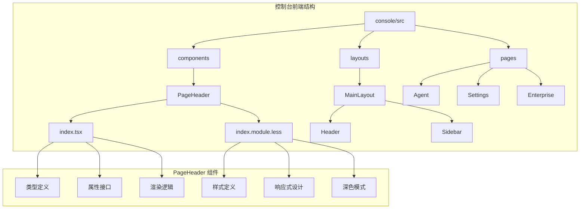
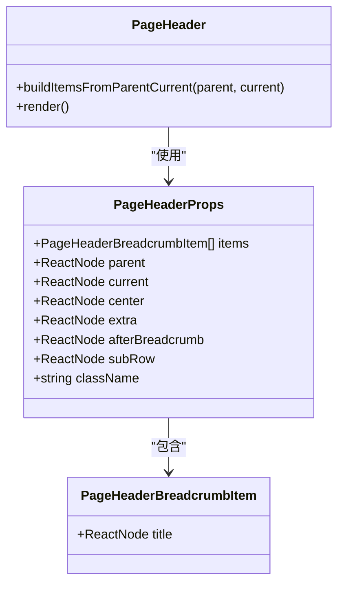
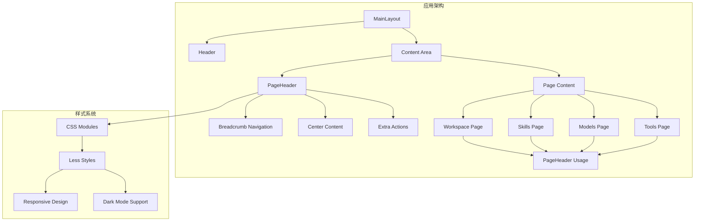
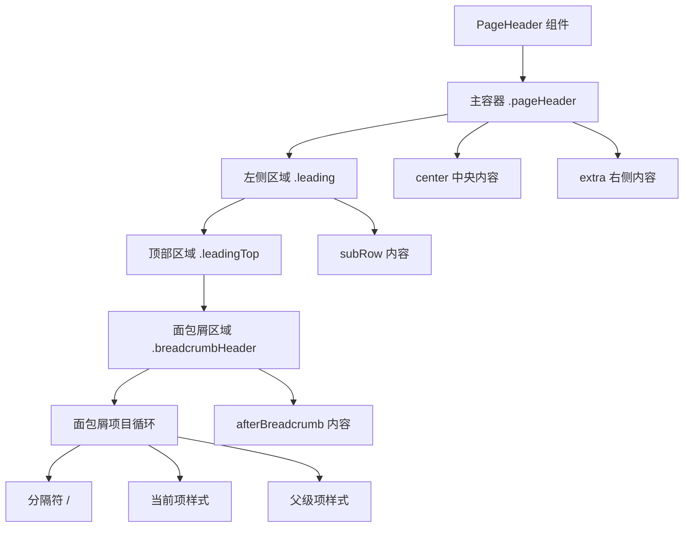
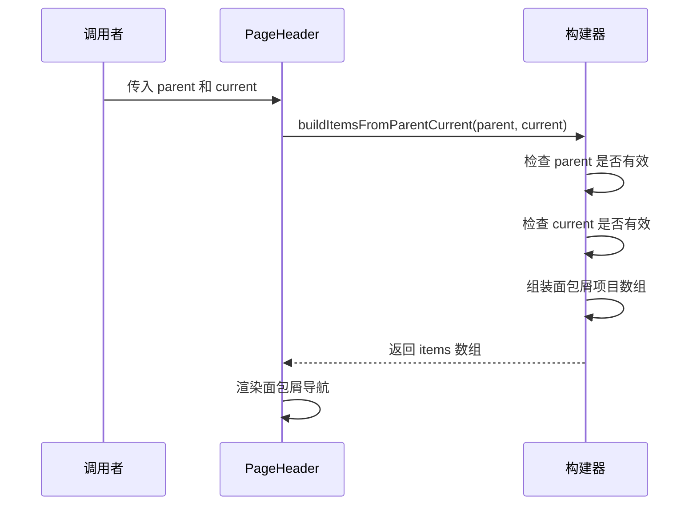
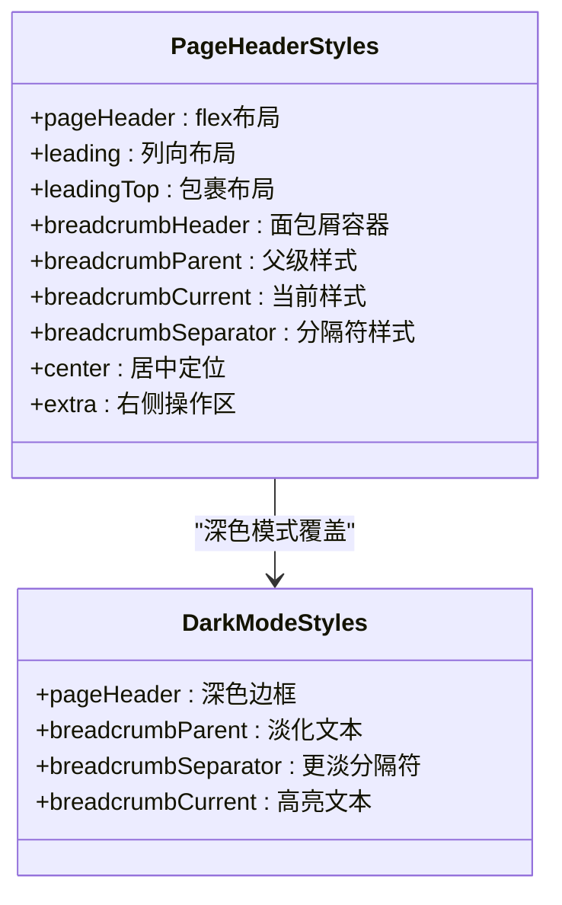
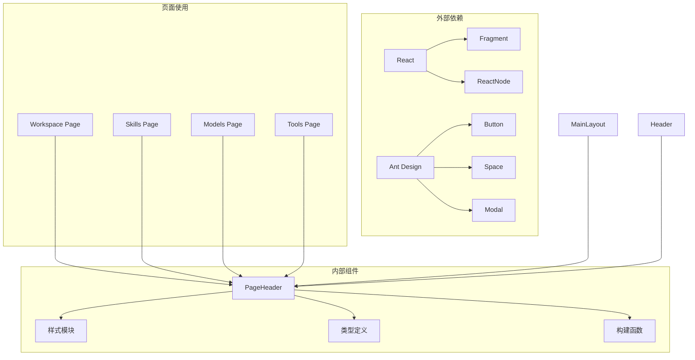

# 页面头部组件

<cite>
**本文档引用的文件**
- [PageHeader/index.tsx](file://console/src/components/PageHeader/index.tsx)
- [PageHeader/index.module.less](file://console/src/components/PageHeader/index.module.less)
- [Header.tsx](file://console/src/layouts/Header.tsx)
- [MainLayout/index.tsx](file://console/src/layouts/MainLayout/index.tsx)
- [Workspace/index.tsx](file://console/src/pages/Agent/Workspace/index.tsx)
- [Skills/index.tsx](file://console/src/pages/Agent/Skills/index.tsx)
- [Models/index.tsx](file://console/src/pages/Settings/Models/index.tsx)
- [Tools/index.tsx](file://console/src/pages/Agent/Tools/index.tsx)
</cite>

## 目录
1. [简介](#简介)
2. [项目结构](#项目结构)
3. [核心组件](#核心组件)
4. [架构概览](#架构概览)
5. [详细组件分析](#详细组件分析)
6. [依赖关系分析](#依赖关系分析)
7. [性能考虑](#性能考虑)
8. [故障排除指南](#故障排除指南)
9. [结论](#结论)
10. [附录](#附录)

## 简介

页面头部组件（PageHeader）是 CoPaw 控制台应用中的核心 UI 组件，负责提供统一的页面标题、面包屑导航和操作区域。该组件采用灵活的插槽机制，支持多种布局配置，能够适应不同页面的需求。

该组件的主要功能包括：
- 统一的页面标题显示
- 面包屑导航路径构建
- 操作区域的灵活配置
- 响应式布局适配
- 深色模式支持
- 自定义内容扩展

## 项目结构

页面头部组件位于控制台前端项目的组件目录中，与页面布局系统紧密集成：

**图表来源**
- [PageHeader/index.tsx:1-77](file://console/src/components/PageHeader/index.tsx#L1-L77)
- [PageHeader/index.module.less:1-85](file://console/src/components/PageHeader/index.module.less#L1-L85)

**章节来源**
- [PageHeader/index.tsx:1-77](file://console/src/components/PageHeader/index.tsx#L1-L77)
- [PageHeader/index.module.less:1-85](file://console/src/components/PageHeader/index.module.less#L1-L85)

## 核心组件

### 组件类型定义

PageHeader 组件提供了完整的 TypeScript 类型定义，确保类型安全和开发体验：

**图表来源**
- [PageHeader/index.tsx:4-19](file://console/src/components/PageHeader/index.tsx#L4-L19)

### 主要属性说明

| 属性名 | 类型 | 必需 | 默认值 | 描述 |
|--------|------|------|--------|------|
| items | PageHeaderBreadcrumbItem[] | 否 | undefined | 完整的面包屑项目数组 |
| parent | ReactNode | 否 | undefined | 父级导航项内容 |
| current | ReactNode | 否 | undefined | 当前页面标题内容 |
| center | ReactNode | 否 | undefined | 中央区域内容 |
| extra | ReactNode | 否 | undefined | 右侧操作区域内容 |
| afterBreadcrumb | ReactNode | 否 | undefined | 面包屑行右侧内容 |
| subRow | ReactNode | 否 | undefined | 面包屑下方子行内容 |
| className | string | 否 | undefined | 自定义 CSS 类名 |

**章节来源**
- [PageHeader/index.tsx:8-19](file://console/src/components/PageHeader/index.tsx#L8-L19)

## 架构概览

PageHeader 组件在整个应用架构中扮演着关键角色，连接页面布局系统和具体业务页面：

**图表来源**
- [MainLayout/index.tsx:94-155](file://console/src/layouts/MainLayout/index.tsx#L94-L155)
- [Header.tsx:52-291](file://console/src/layouts/Header.tsx#L52-L291)

**章节来源**
- [MainLayout/index.tsx:94-155](file://console/src/layouts/MainLayout/index.tsx#L94-L155)
- [Header.tsx:52-291](file://console/src/layouts/Header.tsx#L52-L291)

## 详细组件分析

### 渲染结构分析

PageHeader 组件采用分层渲染结构，支持灵活的内容组织：

**图表来源**
- [PageHeader/index.tsx:46-75](file://console/src/components/PageHeader/index.tsx#L46-L75)
- [PageHeader/index.module.less:11-65](file://console/src/components/PageHeader/index.module.less#L11-L65)

### 面包屑导航逻辑

组件支持两种面包屑构建方式：

1. **完整项目数组**：直接使用 `items` 属性提供的完整面包屑列表
2. **简化模式**：通过 `parent` 和 `current` 属性自动构建两层面包屑

**图表来源**
- [PageHeader/index.tsx:21-29](file://console/src/components/PageHeader/index.tsx#L21-L29)
- [PageHeader/index.tsx:41-44](file://console/src/components/PageHeader/index.tsx#L41-L44)

**章节来源**
- [PageHeader/index.tsx:21-29](file://console/src/components/PageHeader/index.tsx#L21-L29)
- [PageHeader/index.tsx:41-44](file://console/src/components/PageHeader/index.tsx#L41-L44)

### 样式系统设计

PageHeader 采用 CSS Modules 和 Less 预处理器，提供完整的样式体系：

**图表来源**
- [PageHeader/index.module.less:1-85](file://console/src/components/PageHeader/index.module.less#L1-L85)

**章节来源**
- [PageHeader/index.module.less:1-85](file://console/src/components/PageHeader/index.module.less#L1-L85)

### 响应式行为

组件实现了完整的响应式设计，适应不同屏幕尺寸：

- **弹性布局**：使用 `display: flex` 实现自适应布局
- **包裹换行**：面包屑区域支持自动换行
- **绝对定位**：中央内容使用绝对定位保持居中
- **最小宽度**：防止内容溢出的最小宽度设置

**章节来源**
- [PageHeader/index.module.less:20-36](file://console/src/components/PageHeader/index.module.less#L20-L36)
- [PageHeader/index.module.less:54-58](file://console/src/components/PageHeader/index.module.less#L54-L58)

## 依赖关系分析

### 组件间依赖关系

**图表来源**
- [Workspace/index.tsx:8-156](file://console/src/pages/Agent/Workspace/index.tsx#L8-L156)
- [Skills/index.tsx:45-657](file://console/src/pages/Agent/Skills/index.tsx#L45-L657)
- [Models/index.tsx:11-86](file://console/src/pages/Settings/Models/index.tsx#L11-L86)
- [Tools/index.tsx:12-54](file://console/src/pages/Agent/Tools/index.tsx#L12-L54)

### 使用场景分析

PageHeader 在不同页面中有不同的使用模式：

| 页面类型 | 使用方式 | 特殊配置 | 典型用途 |
|----------|----------|----------|----------|
| 工作空间 | 完整 items 数组 | afterBreadcrumb 显示路径 | 文件管理界面 |
| 技能管理 | 完整 items 数组 | extra 提供批量操作 | 技能池管理 |
| 设置页面 | parent/current 简化模式 | 子行显示搜索框 | 设置项配置 |
| 工具管理 | 完整 items 数组 | extra 提供开关控制 | 工具启用管理 |

**章节来源**
- [Workspace/index.tsx:112-156](file://console/src/pages/Agent/Workspace/index.tsx#L112-L156)
- [Skills/index.tsx:528-657](file://console/src/pages/Agent/Skills/index.tsx#L528-L657)
- [Models/index.tsx:69-86](file://console/src/pages/Settings/Models/index.tsx#L69-L86)
- [Tools/index.tsx:41-54](file://console/src/pages/Agent/Tools/index.tsx#L41-L54)

## 性能考虑

### 渲染优化

PageHeader 组件在性能方面采用了多项优化策略：

1. **条件渲染**：仅在存在内容时渲染对应区域
2. **Fragment 使用**：避免额外的 DOM 节点
3. **样式模块化**：减少全局样式冲突
4. **最小化重渲染**：合理使用 props 和状态

### 内存管理

- **无状态组件**：纯函数组件，无内部状态
- **轻量级依赖**：仅依赖 React 和样式模块
- **可选参数**：所有属性都是可选的，减少不必要的计算

## 故障排除指南

### 常见问题及解决方案

#### 面包屑不显示
**问题**：面包屑导航没有正确显示
**原因**：
- `items` 数组为空或未提供
- `parent` 和 `current` 都为 null 或空字符串
- 样式类名冲突

**解决方案**：
1. 确保至少提供一个有效的面包屑项目
2. 检查 `parent` 和 `current` 的值是否为 null 或空字符串
3. 验证 CSS 类名的正确性

#### 中央内容位置异常
**问题**：center 区域内容位置不正确
**原因**：
- 父容器未设置相对定位
- 样式被其他 CSS 覆盖

**解决方案**：
1. 确保父容器具有 `position: relative`
2. 检查是否有其他 CSS 规则影响定位
3. 验证 `left: 50%` 和 `transform: translateX(-50%)` 的应用

#### 响应式问题
**问题**：在小屏幕上布局错乱
**原因**：
- 屏幕尺寸过小导致换行
- 样式优先级问题

**解决方案**：
1. 检查媒体查询和断点设置
2. 验证 `flex-wrap` 属性的应用
3. 确认最小宽度设置的合理性

**章节来源**
- [PageHeader/index.tsx:46-75](file://console/src/components/PageHeader/index.tsx#L46-L75)
- [PageHeader/index.module.less:54-58](file://console/src/components/PageHeader/index.module.less#L54-L58)

## 结论

PageHeader 组件是一个设计精良、功能完整的页面头部组件，具有以下特点：

**优势**：
- 灵活的插槽机制支持多种布局需求
- 完整的 TypeScript 类型定义确保类型安全
- 响应式设计适应不同设备
- 深色模式支持提升用户体验
- 轻量级实现便于维护和扩展

**应用场景**：
- 所有需要统一页面头部的页面
- 需要面包屑导航的层级页面
- 需要操作区域的管理页面
- 支持响应式布局的界面

该组件为 CoPaw 应用提供了统一的视觉和交互标准，是构建一致用户体验的重要基础。

## 附录

### 设计规范

#### 颜色规范
- **浅色主题**：面包屑父级项 #999，当前项 #333，分隔符 #ccc
- **深色主题**：面包屑父级项 rgba(255,255,255,0.35)，当前项 rgba(255,255,255,0.85)，分隔符 rgba(255,255,255,0.2)

#### 字体规范
- **面包屑字体大小**：16px
- **当前项字体大小**：20px
- **字体权重**：父级项 400，当前项 600

#### 间距规范
- **面包屑项间距**：8px
- **整体内边距**：20px
- **行间距**：4px

### 用户体验优化

#### 可访问性
- 支持键盘导航
- 语义化的 HTML 结构
- 适当的 ARIA 属性
- 高对比度模式支持

#### 交互反馈
- 悬停状态的视觉反馈
- 点击状态的明确指示
- 加载状态的进度提示
- 错误状态的清晰提示

### 最佳实践

#### 组件使用建议
1. **优先使用 items 属性**：当需要复杂面包屑时使用 items
2. **合理使用 extra 区域**：放置主要的操作按钮
3. **谨慎使用 center 区域**：仅用于重要的标题内容
4. **利用 afterBreadcrumb**：添加辅助信息如路径显示

#### 样式定制
1. **通过 className 扩展**：使用自定义类名进行样式覆盖
2. **遵循设计系统**：保持与整体设计风格一致
3. **测试响应式效果**：确保在各种设备上都有良好表现