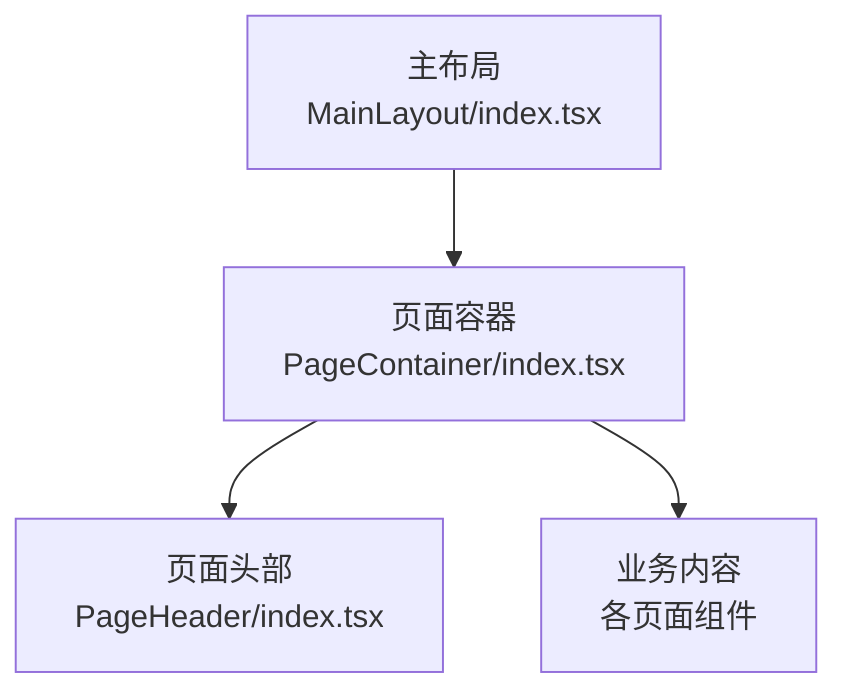
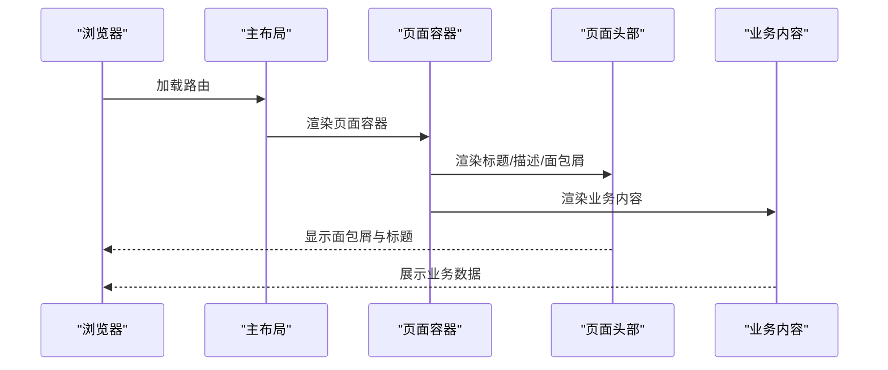
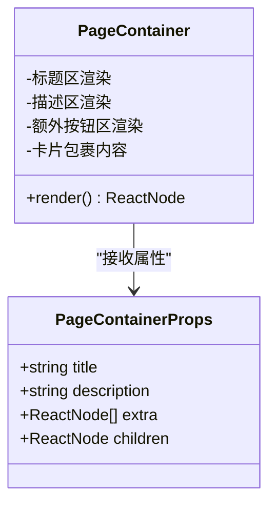
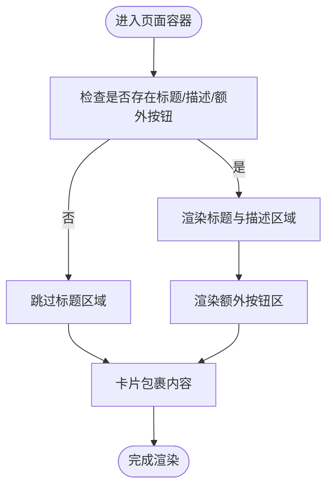
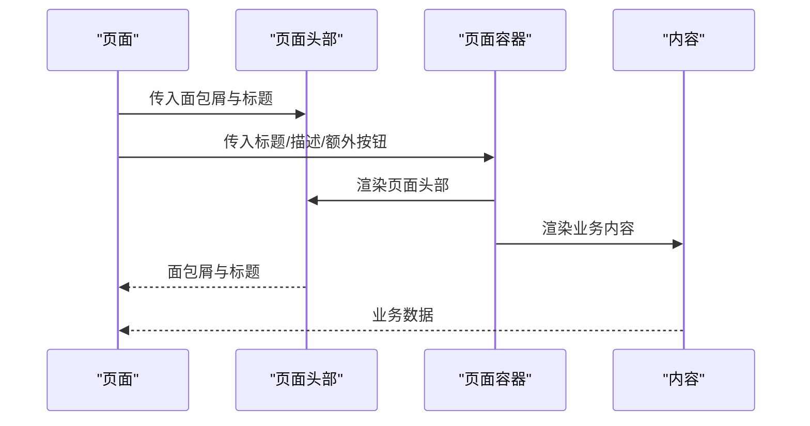
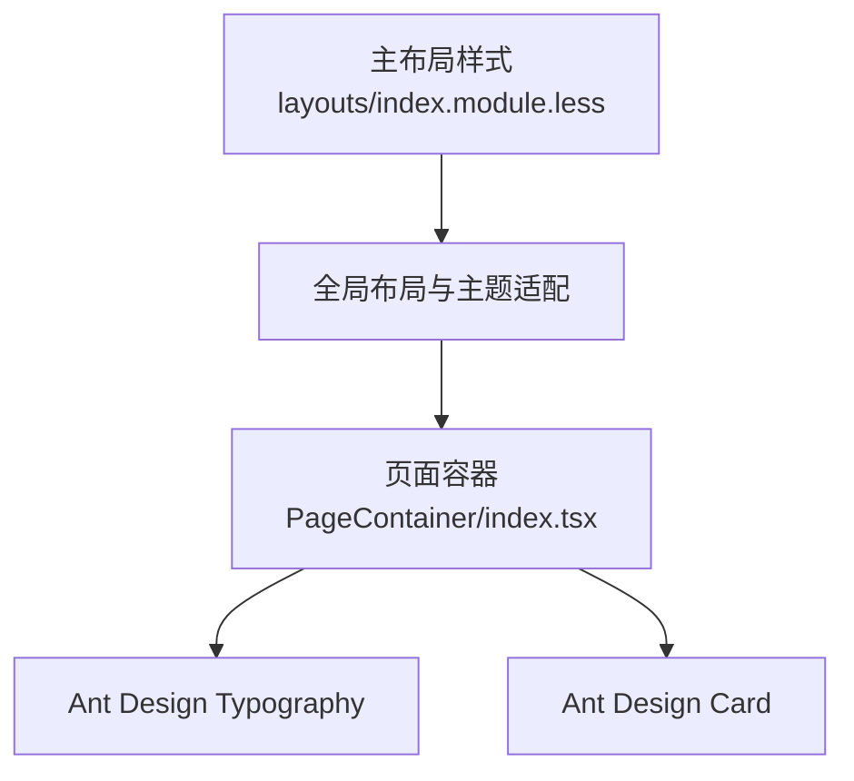

# 页面容器组件

<cite>
**本文档引用的文件**
- [PageContainer/index.tsx](file://console/src/components/PageContainer/index.tsx)
- [MainLayout/index.tsx](file://console/src/layouts/MainLayout/index.tsx)
- [PageHeader/index.tsx](file://console/src/components/PageHeader/index.tsx)
- [Dify/Connectors.tsx](file://console/src/pages/Enterprise/Dify/Connectors.tsx)
- [Models/index.tsx](file://console/src/pages/Settings/Models/index.tsx)
- [Environments/index.tsx](file://console/src/pages/Settings/Environments/index.tsx)
- [Chat/index.tsx](file://console/src/pages/Chat/index.tsx)
- [layouts/index.module.less](file://console/src/layouts/index.module.less)
- [styles/layout.css](file://console/src/styles/layout.css)
- [constants.ts](file://console/src/layouts/constants.ts)
- [SiteLayout.tsx](file://website/src/components/SiteLayout.tsx)
</cite>

## 目录
1. [简介](#简介)
2. [项目结构](#项目结构)
3. [核心组件](#核心组件)
4. [架构总览](#架构总览)
5. [详细组件分析](#详细组件分析)
6. [依赖分析](#依赖分析)
7. [性能考虑](#性能考虑)
8. [故障排除指南](#故障排除指南)
9. [结论](#结论)
10. [附录](#附录)

## 简介
页面容器组件是控制台前端页面布局的基础容器，负责统一承载页面标题区、描述区与操作区，并以卡片形式包裹页面主体内容。它与主布局系统协同工作，提供一致的视觉与交互体验，同时支持响应式布局与主题适配。

## 项目结构
页面容器组件位于控制台前端组件库中，配合主布局系统与页面头部组件共同构成页面骨架。其典型使用路径如下：
- 主布局在内容区域渲染页面容器
- 页面容器内部根据传入参数渲染标题、描述与额外操作按钮
- 页面容器以卡片包裹具体业务内容

图表来源
- [MainLayout/index.tsx:100-155](file://console/src/layouts/MainLayout/index.tsx#L100-L155)
- [PageContainer/index.tsx:13-52](file://console/src/components/PageContainer/index.tsx#L13-L52)
- [PageHeader/index.tsx:31-76](file://console/src/components/PageHeader/index.tsx#L31-L76)

章节来源
- [MainLayout/index.tsx:100-155](file://console/src/layouts/MainLayout/index.tsx#L100-L155)
- [PageContainer/index.tsx:13-52](file://console/src/components/PageContainer/index.tsx#L13-L52)
- [PageHeader/index.tsx:31-76](file://console/src/components/PageHeader/index.tsx#L31-L76)

## 核心组件
页面容器组件的核心职责包括：
- 统一的页面标题与描述展示
- 右侧额外操作按钮区（extra）
- 内容卡片化封装，提升视觉层次
- 响应式布局与主题适配

接口定义与行为要点：
- 支持可选的标题、描述与额外操作按钮数组
- 当存在标题或描述或额外按钮时，顶部区域会显示一个自适应的行布局
- 内容区域以卡片包裹，确保阴影与内边距的一致性
- 使用 Ant Design 的 Typography 与 Card 组件进行语义化与样式封装

章节来源
- [PageContainer/index.tsx:6-11](file://console/src/components/PageContainer/index.tsx#L6-L11)
- [PageContainer/index.tsx:13-52](file://console/src/components/PageContainer/index.tsx#L13-L52)

## 架构总览
页面容器组件与主布局系统的协作关系如下：
- 主布局负责整体框架（头部、侧边栏、内容区）
- 页面容器在内容区内提供统一的页面骨架
- 页面头部组件用于面包屑与标题展示
- 页面容器与页面头部组合，形成标准页面结构

图表来源
- [MainLayout/index.tsx:119-148](file://console/src/layouts/MainLayout/index.tsx#L119-L148)
- [PageContainer/index.tsx:19-51](file://console/src/components/PageContainer/index.tsx#L19-L51)
- [PageHeader/index.tsx:46-75](file://console/src/components/PageHeader/index.tsx#L46-L75)

章节来源
- [MainLayout/index.tsx:119-148](file://console/src/layouts/MainLayout/index.tsx#L119-L148)
- [PageContainer/index.tsx:19-51](file://console/src/components/PageContainer/index.tsx#L19-L51)
- [PageHeader/index.tsx:46-75](file://console/src/components/PageHeader/index.tsx#L46-L75)

## 详细组件分析

### 页面容器组件类图
页面容器组件采用函数式组件设计，接收标题、描述、额外按钮与子节点等属性，内部通过 Flex 布局实现标题区与操作区的自适应排列。

图表来源
- [PageContainer/index.tsx:6-11](file://console/src/components/PageContainer/index.tsx#L6-L11)
- [PageContainer/index.tsx:13-52](file://console/src/components/PageContainer/index.tsx#L13-L52)

章节来源
- [PageContainer/index.tsx:6-11](file://console/src/components/PageContainer/index.tsx#L6-L11)
- [PageContainer/index.tsx:13-52](file://console/src/components/PageContainer/index.tsx#L13-L52)

### 页面容器使用流程图
页面容器在渲染时遵循以下流程：当存在标题、描述或额外按钮时，顶部区域会显示；随后内容以卡片包裹。

图表来源
- [PageContainer/index.tsx:19-51](file://console/src/components/PageContainer/index.tsx#L19-L51)

章节来源
- [PageContainer/index.tsx:19-51](file://console/src/components/PageContainer/index.tsx#L19-L51)

### 页面容器与页面头部的组合使用
页面容器常与页面头部组件配合使用，页面头部负责面包屑与标题展示，页面容器负责内容卡片化与标题区布局。

图表来源
- [PageHeader/index.tsx:31-76](file://console/src/components/PageHeader/index.tsx#L31-L76)
- [PageContainer/index.tsx:19-51](file://console/src/components/PageContainer/index.tsx#L19-L51)

章节来源
- [PageHeader/index.tsx:31-76](file://console/src/components/PageHeader/index.tsx#L31-L76)
- [PageContainer/index.tsx:19-51](file://console/src/components/PageContainer/index.tsx#L19-L51)

### 典型页面使用示例
- 企业级 Dify 连接器管理页面使用页面容器包裹表格与表单，顶部展示标题、描述与创建按钮。
- 设置类页面（如模型与环境）通常结合页面头部与页面容器，形成清晰的页面结构。

章节来源
- [Dify/Connectors.tsx:142-198](file://console/src/pages/Enterprise/Dify/Connectors.tsx#L142-L198)
- [Models/index.tsx:68-148](file://console/src/pages/Settings/Models/index.tsx#L68-L148)
- [Environments/index.tsx:261-322](file://console/src/pages/Settings/Environments/index.tsx#L261-L322)

## 依赖分析
页面容器组件的依赖关系与样式影响：
- 组件依赖 Ant Design 的 Typography（Title、Paragraph）与 Card
- 主布局样式文件提供全局布局与主题适配（深色模式、卡片背景等）
- 页面容器的卡片样式受全局样式影响，确保在不同主题下具有一致的外观

图表来源
- [PageContainer/index.tsx:1-2](file://console/src/components/PageContainer/index.tsx#L1-L2)
- [layouts/index.module.less:1-635](file://console/src/layouts/index.module.less#L1-L635)

章节来源
- [PageContainer/index.tsx:1-2](file://console/src/components/PageContainer/index.tsx#L1-L2)
- [layouts/index.module.less:1-635](file://console/src/layouts/index.module.less#L1-L635)

## 性能考虑
- 按需渲染：仅在存在标题、描述或额外按钮时渲染顶部区域，避免不必要的 DOM 节点
- 卡片化内容：通过卡片包裹减少页面层级复杂度，提升渲染效率
- 主题切换：利用全局样式变量与深色模式类名，避免重复计算与重绘
- 与主布局配合：主布局已对内容区进行懒加载与错误边界处理，页面容器无需重复实现

章节来源
- [MainLayout/index.tsx:108-149](file://console/src/layouts/MainLayout/index.tsx#L108-L149)
- [styles/layout.css:1-55](file://console/src/styles/layout.css#L1-L55)

## 故障排除指南
- 标题不显示：确认是否传入了标题或描述，或额外按钮数组非空
- 按钮未对齐：检查额外按钮数组是否为空或元素数量是否合理
- 卡片样式异常：检查全局样式文件是否正确引入，以及深色模式类名是否生效
- 页面头部冲突：若同时使用页面头部与页面容器标题区，请保持语义清晰，避免重复展示

章节来源
- [PageContainer/index.tsx:19-51](file://console/src/components/PageContainer/index.tsx#L19-L51)
- [styles/layout.css:35-55](file://console/src/styles/layout.css#L35-L55)

## 结论
页面容器组件通过简洁的接口与卡片化封装，为控制台页面提供了统一的布局骨架。它与主布局系统、页面头部组件协同工作，既保证了视觉一致性，又具备良好的可扩展性与性能表现。在实际使用中，建议遵循“标题/描述/额外按钮”的组合模式，并结合全局样式与主题机制，确保跨页面的一致体验。

## 附录
- 与网站布局的区别：网站侧使用独立的站点布局组件，采用 Outlet 与 Suspense 提供页面级懒加载与骨架占位，而控制台页面容器更偏向于页面级内容容器与卡片化封装。
- 最佳实践建议：
  - 将页面标题与描述与页面头部的面包屑信息保持一致
  - 在额外按钮区放置关键操作，避免过多按钮导致拥挤
  - 在深色模式下确保卡片与文本对比度符合可访问性要求
  - 对复杂页面进行模块化拆分，保持页面容器内的内容聚焦

章节来源
- [SiteLayout.tsx:29-39](file://website/src/components/SiteLayout.tsx#L29-L39)
- [PageContainer/index.tsx:19-51](file://console/src/components/PageContainer/index.tsx#L19-L51)