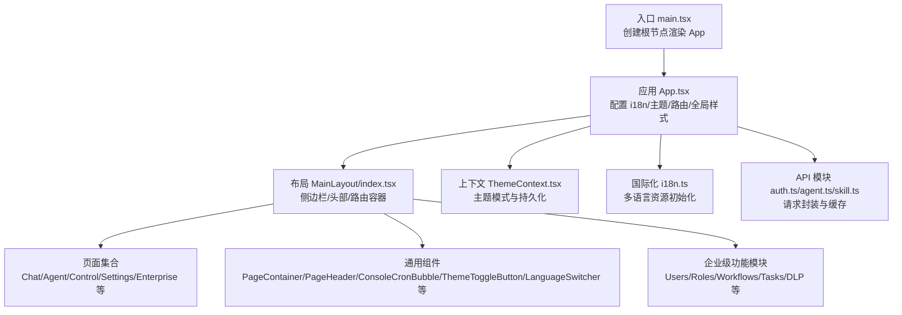
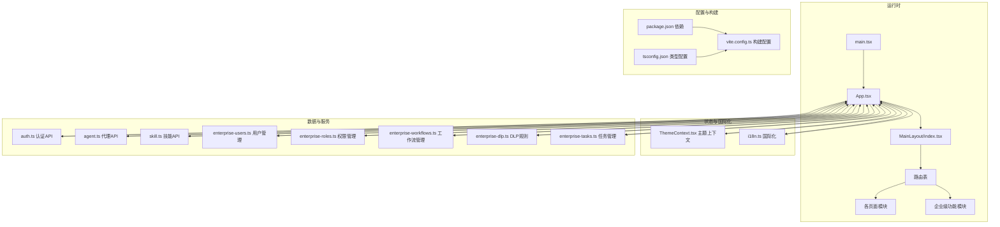
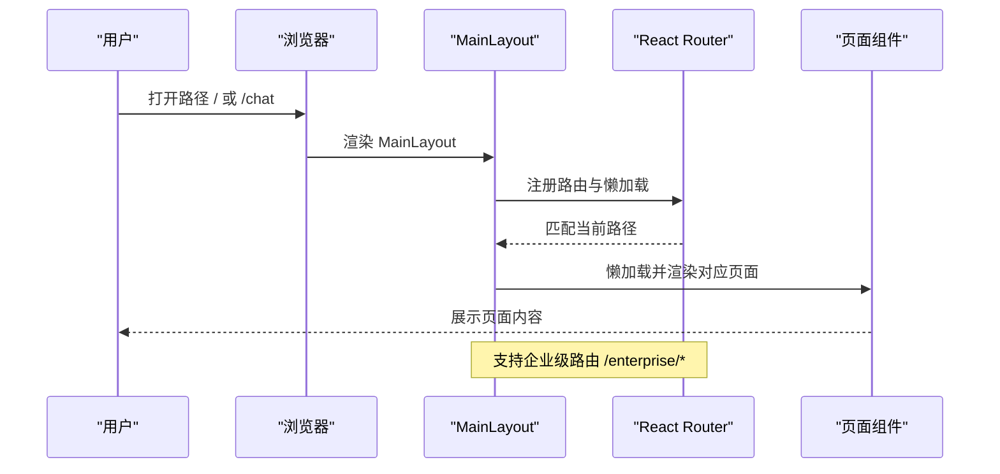
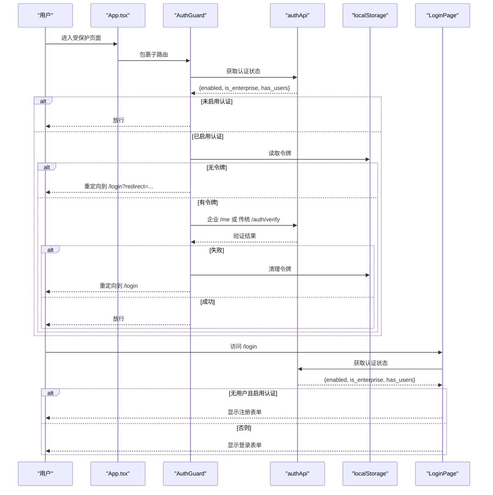
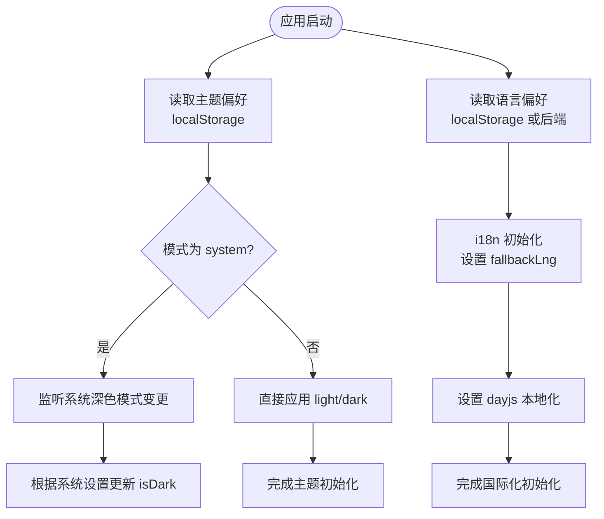
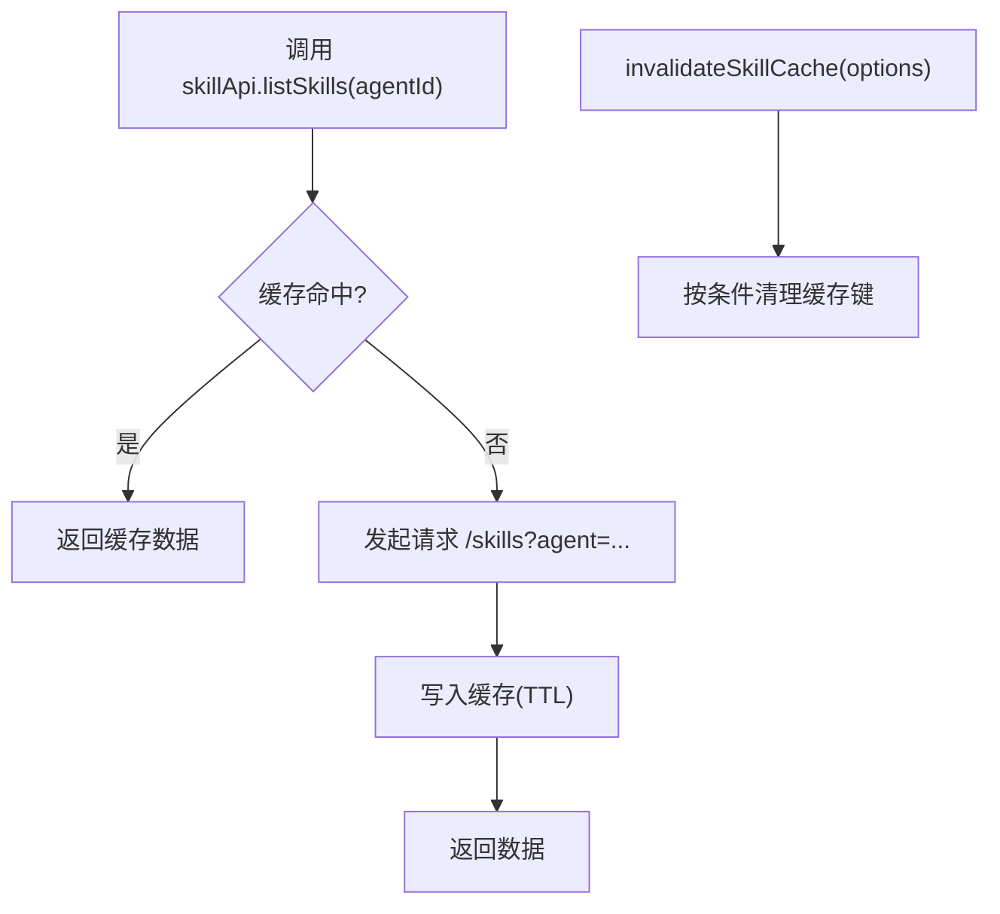
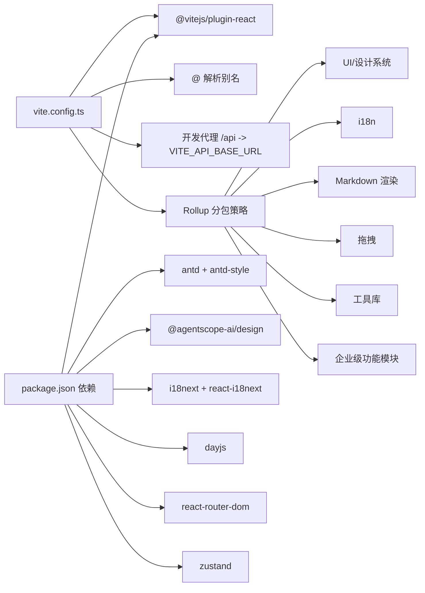

# 前端控制台

<cite>
**本文引用的文件**
- [console/src/main.tsx](file://console/src/main.tsx)
- [console/src/App.tsx](file://console/src/App.tsx)
- [console/package.json](file://console/package.json)
- [console/vite.config.ts](file://console/vite.config.ts)
- [console/tsconfig.json](file://console/tsconfig.json)
- [console/src/layouts/MainLayout/index.tsx](file://console/src/layouts/MainLayout/index.tsx)
- [console/src/layouts/Sidebar.tsx](file://console/src/layouts/Sidebar.tsx)
- [console/src/contexts/ThemeContext.tsx](file://console/src/contexts/ThemeContext.tsx)
- [console/src/i18n.ts](file://console/src/i18n.ts)
- [console/src/pages/Login/index.tsx](file://console/src/pages/Login/index.tsx)
- [console/src/components/PageContainer/index.tsx](file://console/src/components/PageContainer/index.tsx)
- [console/src/components/PageHeader/index.tsx](file://console/src/components/PageHeader/index.tsx)
- [console/src/components/ConsoleCronBubble/index.tsx](file://console/src/components/ConsoleCronBubble/index.tsx)
- [console/src/components/ThemeToggleButton/index.tsx](file://console/src/components/ThemeToggleButton/index.tsx)
- [console/src/components/LanguageSwitcher/index.tsx](file://console/src/components/LanguageSwitcher/index.tsx)
- [console/src/api/modules/auth.ts](file://console/src/api/modules/auth.ts)
- [console/src/api/modules/agent.ts](file://console/src/api/modules/agent.ts)
- [console/src/api/modules/skill.ts](file://console/src/api/modules/skill.ts)
- [console/src/api/modules/enterprise-users.ts](file://console/src/api/modules/enterprise-users.ts)
- [console/src/api/modules/enterprise-roles.ts](file://console/src/api/modules/enterprise-roles.ts)
- [console/src/api/modules/enterprise-workflows.ts](file://console/src/api/modules/enterprise-workflows.ts)
- [console/src/api/modules/enterprise-dlp.ts](file://console/src/api/modules/enterprise-dlp.ts)
- [console/src/api/modules/enterprise-tasks.ts](file://console/src/api/modules/enterprise-tasks.ts)
</cite>

## 更新摘要
**所做更改**
- 完全重构了企业级功能架构，新增用户管理、权限管理、工作流管理、任务管理等核心企业功能
- 新增 PageContainer 和 PageHeader 组件，提供标准化页面容器和面包屑导航
- 增强了侧边栏导航结构，支持企业级功能分组
- 扩展了认证守卫逻辑，支持企业版和传统版双重认证路径
- 新增 ConsoleCronBubble 实时推送通知组件
- 完善了企业级 API 模块，包括用户、角色、工作流、DLP 规则等

## 目录
1. [简介](#简介)
2. [项目结构](#项目结构)
3. [核心组件](#核心组件)
4. [架构总览](#架构总览)
5. [详细组件分析](#详细组件分析)
6. [企业级功能模块](#企业级功能模块)
7. [依赖关系分析](#依赖关系分析)
8. [性能考量](#性能考量)
9. [故障排查指南](#故障排查指南)
10. [结论](#结论)
11. [附录](#附录)

## 简介
本文件面向 CoPaw 前端控制台（React + TypeScript）提供系统化、可操作的架构与组件文档。经过完全重构后，控制台现已支持企业级功能导航、用户管理、权限管理、任务管理、工作流管理等核心企业功能。内容覆盖应用入口、路由与布局、国际化与主题、状态管理策略、页面与组件设计模式、API 模块、样式与响应式、以及可扩展性与无障碍支持现状。目标是帮助开发者快速理解并高效扩展控制台功能。

## 项目结构
控制台位于 console 子目录，采用 Vite 构建、React 18 + TypeScript 开发、Ant Design 作为基础 UI 组件库，并集成 @agentscope-ai/design 设计系统。项目通过懒加载与分包策略优化首屏与交互体验；国际化资源集中于 locales；主题与语言偏好存储在本地存储中；路由采用 React Router DOM v7。

**图表来源**
- [console/src/main.tsx:1-31](file://console/src/main.tsx#L1-L31)
- [console/src/App.tsx:1-228](file://console/src/App.tsx#L1-L228)
- [console/src/layouts/MainLayout/index.tsx:1-156](file://console/src/layouts/MainLayout/index.tsx#L1-L156)
- [console/src/contexts/ThemeContext.tsx:1-105](file://console/src/contexts/ThemeContext.tsx#L1-L105)
- [console/src/i18n.ts:1-32](file://console/src/i18n.ts#L1-L32)
- [console/src/api/modules/auth.ts:1-76](file://console/src/api/modules/auth.ts#L1-L76)
- [console/src/api/modules/agent.ts:1-86](file://console/src/api/modules/agent.ts#L1-L86)
- [console/src/api/modules/skill.ts:1-551](file://console/src/api/modules/skill.ts#L1-L551)

**章节来源**
- [console/src/main.tsx:1-31](file://console/src/main.tsx#L1-L31)
- [console/src/App.tsx:1-228](file://console/src/App.tsx#L1-L228)
- [console/package.json:1-63](file://console/package.json#L1-L63)
- [console/vite.config.ts:1-118](file://console/vite.config.ts#L1-L118)
- [console/tsconfig.json:1-8](file://console/tsconfig.json#L1-L8)

## 核心组件
- 应用入口与全局配置：负责创建根节点、引入国际化、屏蔽特定控制台警告、挂载 App。
- 应用外壳与路由：统一配置 Ant Design 主题、前缀、语言环境、日志相对时间插件、BrowserRouter、路由守卫与登录页。
- 主布局：提供 Header/Sidebar/Content 区域，按路径注册路由，支持错误边界与加载骨架。
- 主题上下文：提供 light/dark/system 三种模式，持久化到 localStorage，监听系统主题变化。
- 国际化：i18next 初始化，支持中/英/日/俄，自动回退与本地存储偏好。
- 登录页：根据后端认证状态决定登录/注册流程，支持企业版与传统版认证。
- 通用组件：PageContainer 提供标题/描述/额外操作区与卡片容器；PageHeader 支持面包屑导航；ConsoleCronBubble 提供实时推送通知；主题切换按钮；语言切换器。
- API 模块：auth/agent/skill 等模块封装请求、鉴权头、缓存与流式处理。
- 企业级功能：用户管理、权限管理、工作流管理、任务管理、DLP 规则管理等。

**章节来源**
- [console/src/main.tsx:1-31](file://console/src/main.tsx#L1-L31)
- [console/src/App.tsx:1-228](file://console/src/App.tsx#L1-L228)
- [console/src/layouts/MainLayout/index.tsx:1-156](file://console/src/layouts/MainLayout/index.tsx#L1-L156)
- [console/src/contexts/ThemeContext.tsx:1-105](file://console/src/contexts/ThemeContext.tsx#L1-L105)
- [console/src/i18n.ts:1-32](file://console/src/i18n.ts#L1-L32)
- [console/src/pages/Login/index.tsx:1-234](file://console/src/pages/Login/index.tsx#L1-L234)
- [console/src/components/PageContainer/index.tsx:1-55](file://console/src/components/PageContainer/index.tsx#L1-L55)
- [console/src/components/PageHeader/index.tsx:1-77](file://console/src/components/PageHeader/index.tsx#L1-L77)
- [console/src/components/ConsoleCronBubble/index.tsx:1-132](file://console/src/components/ConsoleCronBubble/index.tsx#L1-L132)
- [console/src/components/ThemeToggleButton/index.tsx:1-53](file://console/src/components/ThemeToggleButton/index.tsx#L1-L53)
- [console/src/components/LanguageSwitcher/index.tsx:1-69](file://console/src/components/LanguageSwitcher/index.tsx#L1-L69)
- [console/src/api/modules/auth.ts:1-76](file://console/src/api/modules/auth.ts#L1-L76)
- [console/src/api/modules/agent.ts:1-86](file://console/src/api/modules/agent.ts#L1-L86)
- [console/src/api/modules/skill.ts:1-551](file://console/src/api/modules/skill.ts#L1-L551)

## 架构总览
控制台采用"入口 -> 应用外壳 -> 布局 -> 页面"的分层结构。路由守卫在进入受保护页面前检查认证状态；国际化与主题在应用启动时初始化；API 层以模块化方式组织，结合请求封装与缓存提升性能。新增的企业级功能通过专门的 API 模块和页面组件提供完整的管理能力。

**图表来源**
- [console/src/main.tsx:1-31](file://console/src/main.tsx#L1-L31)
- [console/src/App.tsx:1-228](file://console/src/App.tsx#L1-L228)
- [console/src/layouts/MainLayout/index.tsx:1-156](file://console/src/layouts/MainLayout/index.tsx#L1-L156)
- [console/src/contexts/ThemeContext.tsx:1-105](file://console/src/contexts/ThemeContext.tsx#L1-L105)
- [console/src/i18n.ts:1-32](file://console/src/i18n.ts#L1-L32)
- [console/src/api/modules/auth.ts:1-76](file://console/src/api/modules/auth.ts#L1-L76)
- [console/src/api/modules/agent.ts:1-86](file://console/src/api/modules/agent.ts#L1-L86)
- [console/src/api/modules/skill.ts:1-551](file://console/src/api/modules/skill.ts#L1-L551)
- [console/src/api/modules/enterprise-users.ts:1-86](file://console/src/api/modules/enterprise-users.ts#L1-L86)
- [console/src/api/modules/enterprise-roles.ts:1-74](file://console/src/api/modules/enterprise-roles.ts#L1-L74)
- [console/src/api/modules/enterprise-workflows.ts:1-98](file://console/src/api/modules/enterprise-workflows.ts#L1-L98)
- [console/src/api/modules/enterprise-dlp.ts:1-65](file://console/src/api/modules/enterprise-dlp.ts#L1-L65)
- [console/src/api/modules/enterprise-tasks.ts:1-56](file://console/src/api/modules/enterprise-tasks.ts#L1-L56)
- [console/package.json:1-63](file://console/package.json#L1-L63)
- [console/vite.config.ts:1-118](file://console/vite.config.ts#L1-L118)
- [console/tsconfig.json:1-8](file://console/tsconfig.json#L1-L8)

## 详细组件分析

### 路由与布局（MainLayout）
- 路由守卫：在进入受保护页面前进行认证状态检查，支持企业版与传统版认证路径。
- 路由注册：默认加载 Chat 为主页；其余页面采用懒加载并带重试机制，提升首屏性能。
- 错误边界：页面级代码分割错误边界，避免单个模块失败影响整体。
- 侧边栏与头部：根据当前路径高亮选中项，支持企业级功能分组导航。
- 企业级路由：新增 /enterprise/* 路由，支持用户管理、权限管理、工作流管理、任务管理等功能。

**图表来源**
- [console/src/layouts/MainLayout/index.tsx:117-146](file://console/src/layouts/MainLayout/index.tsx#L117-L146)

**章节来源**
- [console/src/layouts/MainLayout/index.tsx:1-156](file://console/src/layouts/MainLayout/index.tsx#L1-L156)

### 认证与登录（AuthGuard 与 LoginPage）
- 认证守卫：检测后端认证开关、令牌有效性（优先企业版 /me，再回退传统 /auth/verify），异常时清理令牌并跳转登录。
- 登录页：根据后端返回的认证状态决定显示登录或注册；支持企业版与传统版登录/注册；保存令牌并跳转至重定向地址。

**图表来源**
- [console/src/App.tsx:49-136](file://console/src/App.tsx#L49-L136)
- [console/src/pages/Login/index.tsx:24-57](file://console/src/pages/Login/index.tsx#L24-L57)
- [console/src/api/modules/auth.ts:45-49](file://console/src/api/modules/auth.ts#L45-L49)

**章节来源**
- [console/src/App.tsx:49-136](file://console/src/App.tsx#L49-L136)
- [console/src/pages/Login/index.tsx:1-234](file://console/src/pages/Login/index.tsx#L1-L234)
- [console/src/api/modules/auth.ts:1-76](file://console/src/api/modules/auth.ts#L1-L76)

### 主题与国际化
- 主题：支持 light/dark/system 三态，持久化到 localStorage，监听系统主题变化；通过 HTML 元素类名切换实现全局样式变量覆盖。
- 国际化：i18next 初始化，支持中/英/日/俄；根据用户语言偏好设置 Ant Design 语言与 dayjs 本地化；支持动态切换语言并保存到本地存储。

**图表来源**
- [console/src/contexts/ThemeContext.tsx:32-91](file://console/src/contexts/ThemeContext.tsx#L32-L91)
- [console/src/i18n.ts:22-29](file://console/src/i18n.ts#L22-L29)
- [console/src/App.tsx:151-181](file://console/src/App.tsx#L151-L181)

**章节来源**
- [console/src/contexts/ThemeContext.tsx:1-105](file://console/src/contexts/ThemeContext.tsx#L1-L105)
- [console/src/i18n.ts:1-32](file://console/src/i18n.ts#L1-L32)
- [console/src/App.tsx:142-181](file://console/src/App.tsx#L142-L181)

### 通用组件与工具
- PageContainer：提供标题、描述、额外操作区与卡片容器，便于页面快速搭建一致的结构。
- PageHeader：支持面包屑导航、中心内容、额外操作区等，提供标准页面头部布局。
- ConsoleCronBubble：实时推送通知组件，支持定时轮询、自动消失、标题闪烁提醒等功能。
- ThemeToggleButton：下拉菜单切换主题模式，图标随当前模式变化。
- LanguageSwitcher：下拉菜单切换语言，同时调用后端接口保存偏好。

**章节来源**
- [console/src/components/PageContainer/index.tsx:1-55](file://console/src/components/PageContainer/index.tsx#L1-L55)
- [console/src/components/PageHeader/index.tsx:1-77](file://console/src/components/PageHeader/index.tsx#L1-L77)
- [console/src/components/ConsoleCronBubble/index.tsx:1-132](file://console/src/components/ConsoleCronBubble/index.tsx#L1-L132)
- [console/src/components/ThemeToggleButton/index.tsx:1-53](file://console/src/components/ThemeToggleButton/index.tsx#L1-L53)
- [console/src/components/LanguageSwitcher/index.tsx:1-69](file://console/src/components/LanguageSwitcher/index.tsx#L1-L69)

### API 模块与状态管理策略
- 请求封装：统一的 request 封装与鉴权头生成，减少重复逻辑。
- 缓存策略：技能相关 API 使用内存缓存（TTL），支持按 agentId/workspaces/pool 精准失效。
- 流式处理：技能 AI 优化支持流式返回，逐块解析并回调。
- 状态管理：采用 React Hooks 与 Context 管理主题与语言；页面内局部状态通过 useState/useEffect 管理；全局状态建议使用 Zustand（依赖已引入）以降低耦合。
- 企业级 API：用户管理、权限管理、工作流管理、任务管理、DLP 规则等完整的企业级功能 API。

**图表来源**
- [console/src/api/modules/skill.ts:113-123](file://console/src/api/modules/skill.ts#L113-L123)
- [console/src/api/modules/skill.ts:34-61](file://console/src/api/modules/skill.ts#L34-L61)

**章节来源**
- [console/src/api/modules/skill.ts:1-551](file://console/src/api/modules/skill.ts#L1-L551)
- [console/package.json:42](file://console/package.json#L42)

## 企业级功能模块

### 用户管理（Enterprise Users）
- 功能概述：提供完整的用户生命周期管理，包括用户查询、创建、更新、删除、角色分配等。
- 核心 API：
  - 用户列表查询：支持搜索、状态过滤、部门过滤
  - 用户 CRUD 操作：创建、获取、更新、删除用户
  - 角色管理：获取用户角色、批量分配角色
- 数据模型：User 接口定义了用户的基本信息、状态、MFA 等属性。

### 权限管理（Enterprise Roles & Permissions）
- 功能概述：基于角色的权限控制系统，支持角色层级、权限分配、系统角色管理。
- 核心 API：
  - 角色管理：角色查询、创建、更新、删除
  - 权限管理：权限查询、创建、角色权限分配
  - 权限树：支持父子角色关系和权限继承
- 数据模型：Role 和 Permission 接口定义了角色和权限的结构。

### 工作流管理（Enterprise Workflows）
- 功能概述：支持多种类型的工作流定义、执行和监控，包括 Dify 集成。
- 核心 API：
  - 工作流 CRUD：创建、获取、更新、删除工作流
  - 工作流执行：触发执行、获取执行状态
  - 执行历史：查询执行记录、状态过滤
- 数据模型：Workflow 和 WorkflowExecution 接口支持不同类型的工作流分类。

### 任务管理（Enterprise Tasks）
- 功能概述：企业级任务管理系统，支持任务创建、分配、状态跟踪。
- 核心 API：
  - 任务列表：支持按负责人、状态、优先级、工作流过滤
  - 任务 CRUD：创建、获取、更新任务
  - 任务元数据：支持自定义字段和关联信息
- 数据模型：Task 接口定义了任务的状态、优先级、截止日期等属性。

### DLP 规则管理（Enterprise DLP）
- 功能概述：数据丢失防护规则管理，支持正则表达式匹配、多种处理动作。
- 核心 API：
  - 规则管理：内置规则、自定义规则的查询、创建、更新、删除
  - 事件监控：规则触发事件的查询和统计
  - 动作配置：掩码、告警、阻止等不同处理策略
- 数据模型：DLPRule 和 DLPEvent 接口支持规则定义和事件记录。

**章节来源**
- [console/src/api/modules/enterprise-users.ts:1-86](file://console/src/api/modules/enterprise-users.ts#L1-L86)
- [console/src/api/modules/enterprise-roles.ts:1-74](file://console/src/api/modules/enterprise-roles.ts#L1-L74)
- [console/src/api/modules/enterprise-workflows.ts:1-98](file://console/src/api/modules/enterprise-workflows.ts#L1-L98)
- [console/src/api/modules/enterprise-tasks.ts:1-56](file://console/src/api/modules/enterprise-tasks.ts#L1-L56)
- [console/src/api/modules/enterprise-dlp.ts:1-65](file://console/src/api/modules/enterprise-dlp.ts#L1-L65)

## 依赖关系分析
- 构建与打包：Vite 配置启用 React 插件、Less 预处理器、路径别名、开发代理与手动分包策略，将 UI、i18n、Markdown、DnD、工具库等拆分为独立 chunk。
- 运行时依赖：React 18、Ant Design、@agentscope-ai/design、i18next、dayjs、react-router-dom、zustand 等。
- 类型配置：双引用 tsconfig，分别指向应用与 Node 工具链类型配置。
- 企业级依赖：新增企业级功能所需的额外 API 模块和组件依赖。

**图表来源**
- [console/vite.config.ts:17-117](file://console/vite.config.ts#L17-L117)
- [console/package.json:19-42](file://console/package.json#L19-L42)

**章节来源**
- [console/vite.config.ts:1-118](file://console/vite.config.ts#L1-L118)
- [console/package.json:1-63](file://console/package.json#L1-L63)
- [console/tsconfig.json:1-8](file://console/tsconfig.json#L1-L8)

## 性能考量
- 代码分割与懒加载：主布局对多数页面采用懒加载与重试，显著降低首屏体积与白屏时间。
- 分包策略：手动拆分 react-vendor、ui-vendor、i18n-vendor、markdown-vendor、dnd-vendor、utils-vendor，避免重复依赖与循环依赖。
- 缓存：技能 API 内置 TTL 缓存，刷新与池操作后精准失效，减少网络往返。
- 构建优化：CSS 代码分割、Source Map 控制、chunkSize 警告阈值调整。
- 企业级功能优化：企业级 API 采用分页查询、条件过滤，避免大数据量传输。
- 实时通知：ConsoleCronBubble 采用定时轮询和智能去重，控制通知数量和频率。
- 建议：对高频交互页面（如聊天）可考虑预取关键数据；对大列表使用虚拟滚动；对图片与媒体资源启用压缩与懒加载。

## 故障排查指南
- 控制台告警过滤：入口处屏蔽特定伪类与潜在不安全提示，避免干扰正常调试。
- 登录失败：检查后端认证状态接口与令牌有效期；确认企业版与传统版认证路径可用性。
- 路由跳转异常：确认 basename 判断逻辑与实际部署路径一致；检查 AuthGuard 返回的重定向地址。
- 国际化/主题不生效：确认 localStorage 中的语言与主题键值；检查 dayjs 与 Ant Design 语言是否同步更新。
- 技能操作失败：查看技能 API 返回的错误信息；必要时清理缓存后重试；检查上传文件格式与大小限制。
- 企业级功能异常：检查企业 API 端点可用性、用户权限、网络连接；查看 ConsoleCronBubble 是否正常轮询。
- 侧边栏导航问题：确认企业级路由配置、权限验证、面包屑导航显示。

**章节来源**
- [console/src/main.tsx:5-28](file://console/src/main.tsx#L5-L28)
- [console/src/App.tsx:138-140](file://console/src/App.tsx#L138-L140)
- [console/src/api/modules/skill.ts:113-123](file://console/src/api/modules/skill.ts#L113-L123)

## 结论
该控制台经过完全重构后，以清晰的分层架构、完善的路由与布局、可扩展的主题与国际化体系为基础，结合 API 模块化与缓存策略，成功集成了企业级功能模块。新增的用户管理、权限管理、工作流管理、任务管理、DLP 规则等功能为企业用户提供完整的管理能力。建议后续在全局状态管理、无障碍支持与响应式细节上持续完善，以进一步提升可维护性与用户体验。

## 附录
- 组件自定义与扩展指导
  - 新增页面：在 MainLayout 中注册路由与懒加载导入；使用 PageContainer 快速搭建页面结构；如需面包屑导航使用 PageHeader 组件。
  - 新增 API：在 api/modules 下新增模块文件，遵循现有命名与导出规范；在需要时加入缓存与流式处理；为企业级功能添加相应的 TypeScript 类型定义。
  - 主题扩展：通过 ThemeContext 提供的 setThemeMode/toggleTheme 扩展 UI；确保全局样式变量覆盖正确。
  - 国际化扩展：在 locales 新增词条并在 i18n 初始化中注册；页面中使用 useTranslation 获取文案；企业级功能的导航文本在 Sidebar 中维护。
  - 无障碍与响应式：遵循 Ant Design 的无障碍实践；在 Less 中使用响应式断点；对交互元素提供键盘可达性与语义化标签。
  - 企业级功能扩展：按照现有企业 API 模块的模式创建新的功能模块；确保与现有的认证和权限系统集成。
- 样式系统与主题
  - Ant Design ConfigProvider 配置前缀与主题算法；全局样式通过 createGlobalStyle 统一；页面样式使用 CSS Modules。
  - 主题切换通过 HTML 元素类名控制，配合设计系统的 CSS 变量实现深浅色切换。
  - 企业级功能使用独立的样式模块，避免与核心功能样式冲突。
- 路由与导航
  - basename 自动识别 /console 前缀；侧边栏 key 与路径映射保证导航一致性；登录页支持 redirect 参数。
  - 企业级功能使用 /enterprise 前缀，支持多级嵌套导航。
  - ConsoleCronBubble 提供实时通知，增强用户体验。