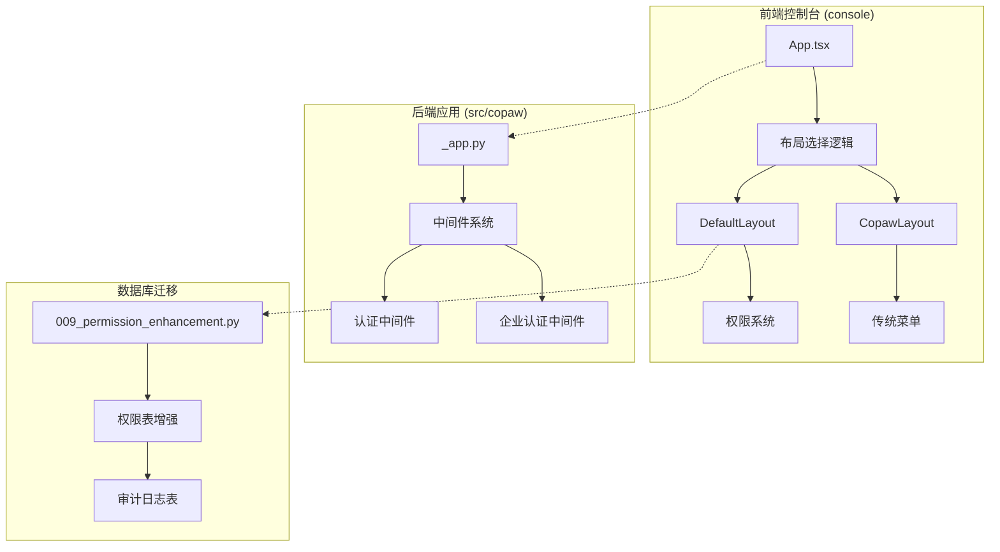
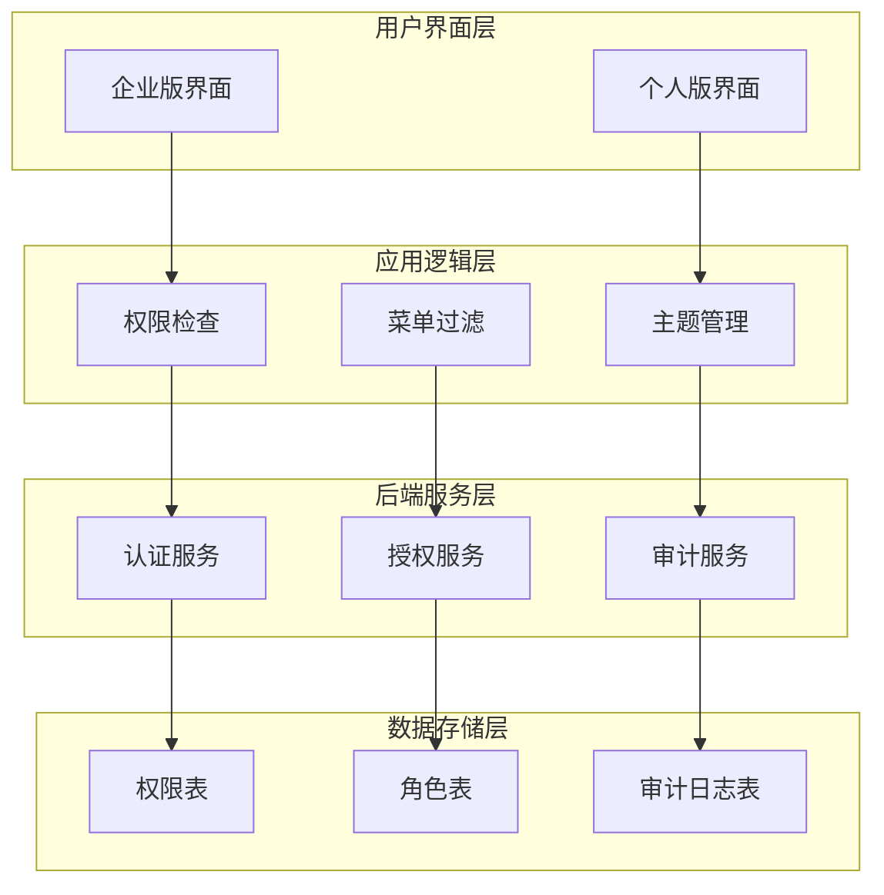
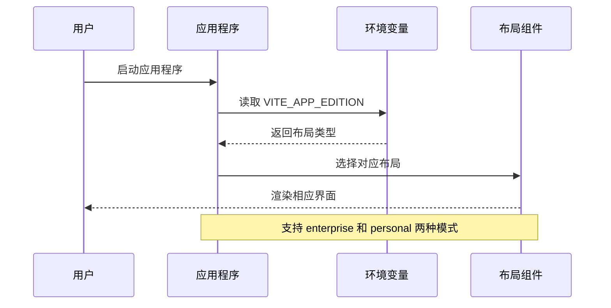
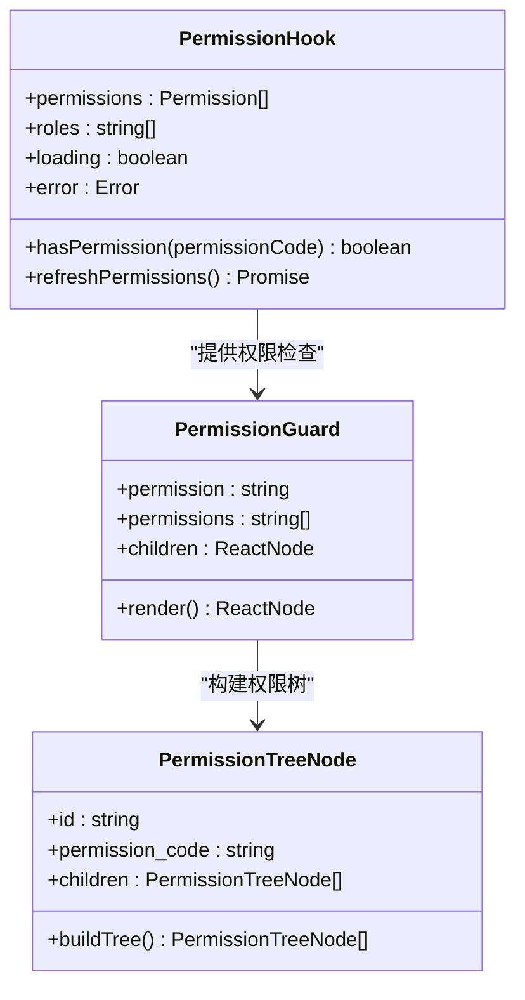
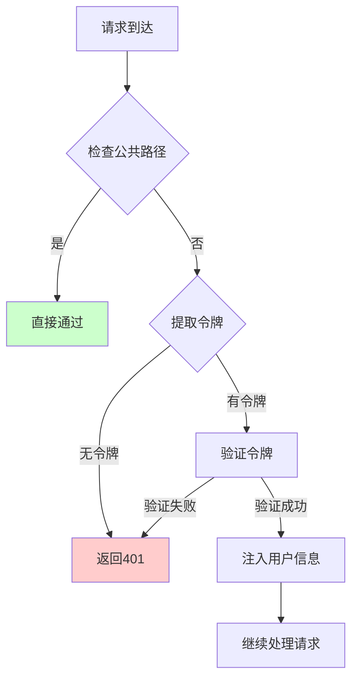
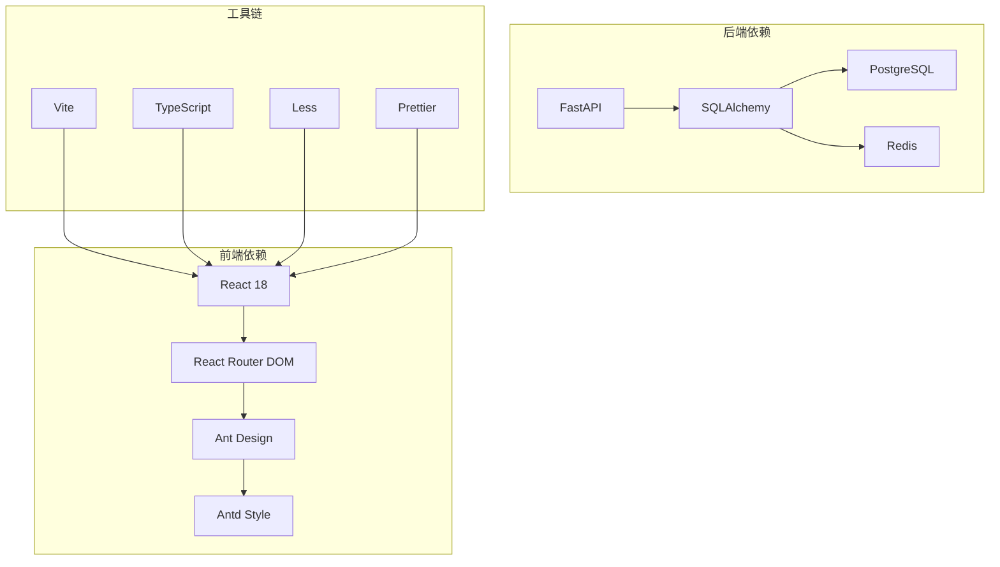

# 双布局架构系统

<cite>
**本文档引用的文件**
- [dual-layout-architecture.md](file://docs/dual-layout-architecture.md)
- [App.tsx](file://console/src/App.tsx)
- [CopawLayout/index.tsx](file://console/src/layouts/copaw/index.tsx)
- [_app.py](file://src/copaw/app/_app.py)
- [usePermissions.ts](file://console/src/hooks/usePermissions.ts)
- [PermissionGuard.tsx](file://console/src/components/PermissionGuard.tsx)
- [DefaultLayout/index.tsx](file://console/src/layouts/default/index.tsx)
- [DefaultLayout/constants.tsx](file://console/src/layouts/default/constants.tsx)
- [CopawLayout/constants.ts](file://console/src/layouts/copaw/constants.ts)
- [ThemeContext.tsx](file://console/src/contexts/ThemeContext.tsx)
- [009_permission_enhancement.py](file://alembic/versions/009_permission_enhancement.py)
- [package.json](file://console/package.json)
- [middleware.py](file://src/copaw/enterprise/middleware.py)
- [auth.py](file://src/copaw/app/auth.py)
</cite>

## 目录
1. [简介](#简介)
2. [项目结构](#项目结构)
3. [核心组件](#核心组件)
4. [架构概览](#架构概览)
5. [详细组件分析](#详细组件分析)
6. [依赖关系分析](#依赖关系分析)
7. [性能考虑](#性能考虑)
8. [故障排除指南](#故障排除指南)
9. [结论](#结论)

## 简介

双布局架构系统是 CoPaw 项目中引入的一种创新设计，旨在同时支持两种不同版本的用户界面布局：企业版（Default Layout）和个人版（Copaw Layout）。这种架构设计的核心目标是在保持功能完整性的同时，为不同用户群体提供最适合的使用体验。

该系统通过环境变量驱动的布局选择机制，实现了动态布局切换，无需修改代码即可在两种布局模式间无缝切换。企业版布局提供了完整的权限控制系统，而个人版布局则专注于简洁性和易用性。

## 项目结构

双布局架构系统主要分布在三个核心目录中：

**图表来源**
- [App.tsx:152-157](file://console/src/App.tsx#L152-L157)
- [CopawLayout/index.tsx:100-162](file://console/src/layouts/copaw/index.tsx#L100-L162)
- [_app.py:504-552](file://src/copaw/app/_app.py#L504-L552)

**章节来源**
- [dual-layout-architecture.md:12-32](file://docs/dual-layout-architecture.md#L12-L32)
- [package.json:1-63](file://console/package.json#L1-L63)

## 核心组件

双布局架构系统包含以下核心组件：

### 1. 布局选择器
基于环境变量的动态布局选择机制，支持企业版和个性版的无缝切换。

### 2. 权限控制系统
为企业版提供的完整权限管理框架，包括权限检查、权限过滤和审计日志。

### 3. 中间件层
后端的认证和授权中间件，支持多租户和会话管理。

### 4. 数据库迁移
权限系统的数据库结构增强，支持细粒度权限控制。

**章节来源**
- [dual-layout-architecture.md:74-134](file://docs/dual-layout-architecture.md#L74-L134)

## 架构概览

双布局架构采用分层设计，确保了系统的可扩展性和维护性：

**图表来源**
- [App.tsx:152-157](file://console/src/App.tsx#L152-L157)
- [usePermissions.ts:68-208](file://console/src/hooks/usePermissions.ts#L68-L208)
- [009_permission_enhancement.py:20-113](file://alembic/versions/009_permission_enhancement.py#L20-L113)

## 详细组件分析

### 布局选择机制

布局选择机制是双布局架构的核心，通过环境变量实现动态切换：

**图表来源**
- [App.tsx:152-157](file://console/src/App.tsx#L152-L157)
- [dual-layout-architecture.md:139-153](file://docs/dual-layout-architecture.md#L139-L153)

### 权限系统架构

企业版布局的权限系统提供了完整的权限控制能力：

**图表来源**
- [usePermissions.ts:68-208](file://console/src/hooks/usePermissions.ts#L68-L208)
- [PermissionGuard.tsx:53-88](file://console/src/components/PermissionGuard.tsx#L53-L88)

**章节来源**
- [usePermissions.ts:17-54](file://console/src/hooks/usePermissions.ts#L17-L54)
- [PermissionGuard.tsx:31-42](file://console/src/components/PermissionGuard.tsx#L31-L42)

### 中间件认证流程

后端的认证中间件提供了安全的访问控制：

**图表来源**
- [middleware.py:69-106](file://src/copaw/enterprise/middleware.py#L69-L106)
- [auth.py:371-441](file://src/copaw/app/auth.py#L371-L441)

**章节来源**
- [middleware.py:28-46](file://src/copaw/enterprise/middleware.py#L28-L46)
- [auth.py:48-63](file://src/copaw/app/auth.py#L48-L63)

### 数据库权限增强

权限系统的数据库结构经过专门设计以支持复杂的权限管理：

| 数据表 | 字段 | 描述 | 约束 |
|--------|------|------|------|
| sys_permissions | permission_code | 权限代码 | 唯一索引 |
| sys_permissions | resource_path | 资源路径 | 可选 |
| sys_permissions | permission_type | 权限类型 | menu/api/button/data |
| sys_permissions | parent_id | 父权限ID | 外键约束 |
| sys_permissions | sort_order | 排序顺序 | 整数 |
| sys_permissions | icon | 图标标识 | 可选 |
| sys_permissions | is_visible | 是否可见 | 布尔值 |
| sys_audit_logs | operation_type | 操作类型 | 枚举值 |
| sys_audit_logs | user_id | 用户ID | 外键约束 |

**章节来源**
- [009_permission_enhancement.py:25-100](file://alembic/versions/009_permission_enhancement.py#L25-L100)
- [009_permission_enhancement.py:129-193](file://alembic/versions/009_permission_enhancement.py#L129-L193)

## 依赖关系分析

双布局架构系统的依赖关系体现了清晰的分层设计：

**图表来源**
- [package.json:19-43](file://console/package.json#L19-L43)
- [_app.py:1-50](file://src/copaw/app/_app.py#L1-L50)

**章节来源**
- [package.json:44-63](file://console/package.json#L44-L63)
- [_app.py:26-33](file://src/copaw/app/_app.py#L26-L33)

## 性能考虑

双布局架构在设计时充分考虑了性能优化：

### 1. 懒加载策略
- 非聊天页面采用懒加载，提升首屏加载速度
- 聊天页面作为默认页面进行预加载

### 2. 权限缓存机制
- 权限数据在组件生命周期内缓存
- 提供手动刷新权限的方法

### 3. 主题系统优化
- 支持系统主题跟随
- 本地存储主题偏好设置

### 4. 中间件性能
- JWT令牌验证在内存中完成
- 避免不必要的数据库查询

## 故障排除指南

### 常见问题及解决方案

#### 1. 布局切换问题
**症状**: 布局无法按预期切换
**解决方案**:
- 检查环境变量 `VITE_APP_EDITION` 设置
- 确认 `.env` 文件配置正确
- 验证浏览器控制台是否有错误信息

#### 2. 权限系统问题
**症状**: 权限检查失败或菜单显示异常
**解决方案**:
- 检查 `/api/v1/auth/permissions` API 是否正常
- 验证用户令牌有效性
- 确认数据库权限表结构完整

#### 3. 认证问题
**症状**: 登录失败或会话超时
**解决方案**:
- 检查后端认证中间件配置
- 验证JWT密钥设置
- 确认数据库连接正常

**章节来源**
- [dual-layout-architecture.md:240-271](file://docs/dual-layout-architecture.md#L240-L271)

## 结论

双布局架构系统通过精心设计的分层结构和灵活的配置机制，成功实现了企业版和个人版的统一管理。该系统的主要优势包括：

1. **灵活性**: 通过环境变量实现动态布局切换
2. **安全性**: 企业版提供完整的权限控制和审计功能
3. **可扩展性**: 清晰的架构设计便于功能扩展
4. **用户体验**: 针对不同用户群体提供最佳界面体验

该架构为 CoPaw 项目的发展奠定了坚实的基础，既满足了企业用户的复杂需求，又保持了个人用户的简洁易用性。通过持续的优化和完善，双布局架构系统将继续为用户提供优秀的使用体验。