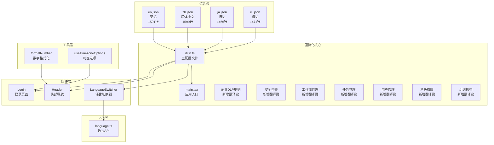
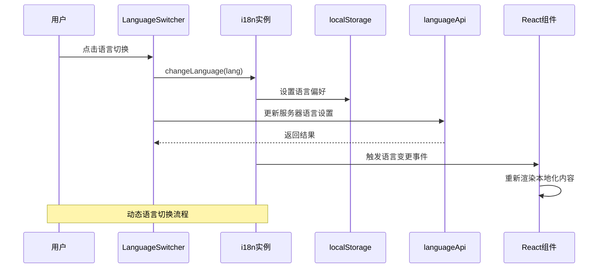
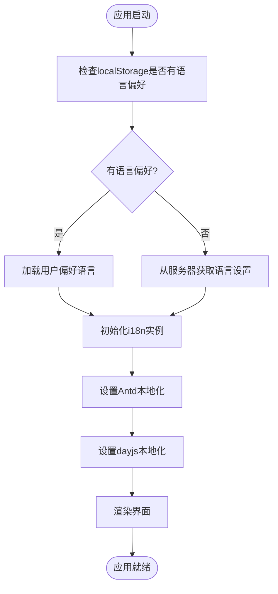
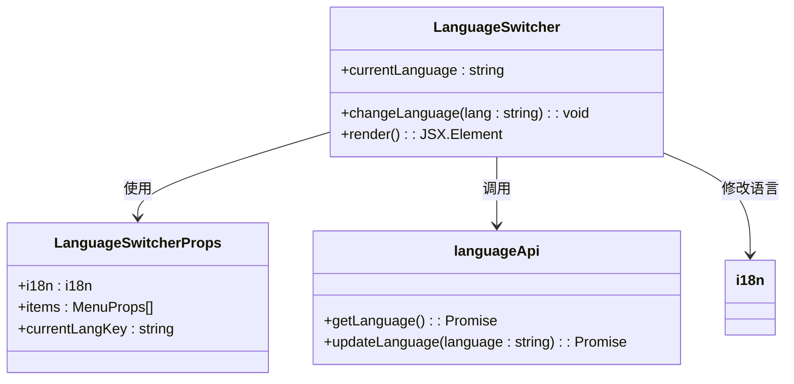
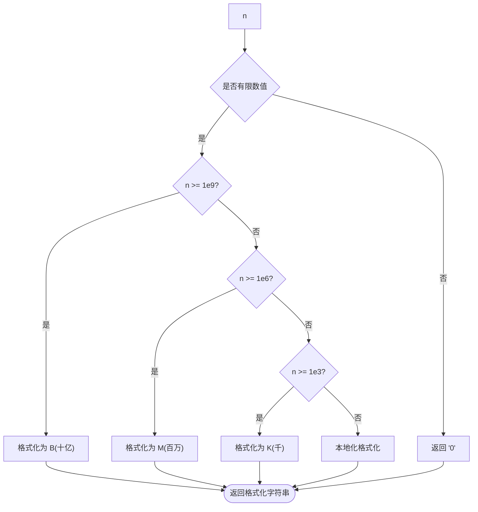
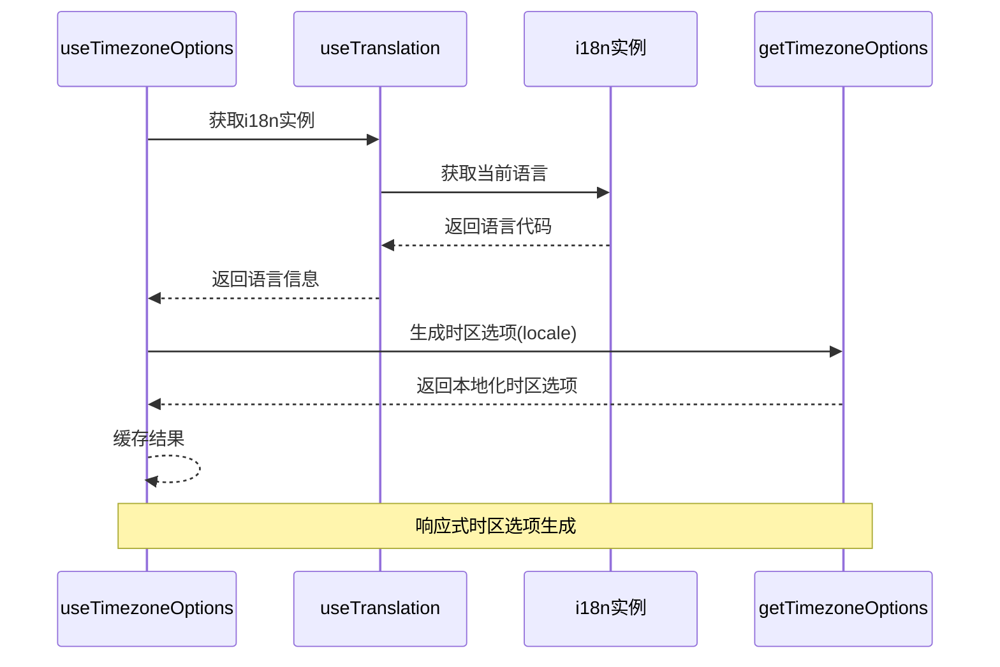
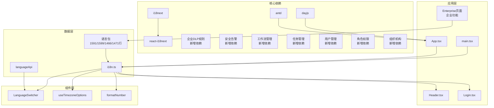

# 国际化系统

<cite>
**本文档引用的文件**
- [console/src/i18n.ts](file://console/src/i18n.ts)
- [console/src/locales/en.json](file://console/src/locales/en.json)
- [console/src/locales/zh.json](file://console/src/locales/zh.json)
- [console/src/locales/ja.json](file://console/src/locales/ja.json)
- [console/src/locales/ru.json](file://console/src/locales/ru.json)
- [console/src/components/LanguageSwitcher/index.tsx](file://console/src/components/LanguageSwitcher/index.tsx)
- [console/src/utils/formatNumber.ts](file://console/src/utils/formatNumber.ts)
- [console/src/api/modules/language.ts](file://console/src/api/modules/language.ts)
- [console/src/App.tsx](file://console/src/App.tsx)
- [console/src/main.tsx](file://console/src/main.tsx)
- [console/src/hooks/useTimezoneOptions.ts](file://console/src/hooks/useTimezoneOptions.ts)
- [console/src/layouts/Header.tsx](file://console/src/layouts/Header.tsx)
- [console/src/pages/Login/index.tsx](file://console/src/pages/Login/index.tsx)
</cite>

## 更新摘要
**所做更改**
- 大幅扩展企业级国际化支持，新增超过230个翻译键
- 新增企业用户管理、角色权限、组织机构等企业特定术语
- 扩展安全相关词汇，包括DLP规则、告警规则等
- 完善多语言界面支持，涵盖日语、俄语等新语言
- 增强企业工作流、任务管理等专业术语翻译

## 目录
1. [简介](#简介)
2. [项目结构](#项目结构)
3. [核心组件](#核心组件)
4. [架构概览](#架构概览)
5. [详细组件分析](#详细组件分析)
6. [企业级国际化扩展](#企业级国际化扩展)
7. [依赖关系分析](#依赖关系分析)
8. [性能考虑](#性能考虑)
9. [故障排除指南](#故障排除指南)
10. [结论](#结论)
11. [附录](#附录)

## 简介

CoPaw 前端控制台采用基于 i18next 的国际化系统，现已大幅扩展支持能力，支持英语、简体中文、日语和俄语四种语言。该系统实现了完整的多语言支持架构，包括语言包管理、动态语言切换、本地化格式化以及用户偏好保存等功能。

**重大更新**：系统现已新增超过230个翻译键，涵盖企业特定术语和安全相关词汇，包括用户管理、角色权限、组织机构、工作流管理、任务管理、数据防泄漏(DLP)规则、安全告警等企业级功能的专业化翻译。

系统的核心特点包括：
- 基于 i18next 的现代国际化框架
- 支持 4 种主流语言的完整翻译包
- 动态语言切换和用户偏好持久化
- 与 Ant Design 组件库的本地化集成
- 自动化的时间格式化和数字格式化
- 企业级功能的完整本地化支持

## 项目结构

国际化系统的文件组织结构如下：



**图表来源**
- [console/src/i18n.ts:1-32](file://console/src/i18n.ts#L1-L32)
- [console/src/locales/en.json:1-50](file://console/src/locales/en.json#L1-L50)
- [console/src/components/LanguageSwitcher/index.tsx:1-69](file://console/src/components/LanguageSwitcher/index.tsx#L1-L69)

**章节来源**
- [console/src/i18n.ts:1-32](file://console/src/i18n.ts#L1-L32)
- [console/src/main.tsx:1-31](file://console/src/main.tsx#L1-L31)

## 核心组件

### i18n 初始化配置

国际化系统的核心配置位于 `i18n.ts` 文件中，负责初始化 i18next 实例并配置语言资源。

关键配置包括：
- **语言资源管理**：集中导入所有语言包文件
- **默认语言设置**：从 localStorage 读取用户偏好，无偏好时默认英语
- **回退语言策略**：统一回退到英语
- **插值配置**：禁用 HTML 转义，支持 React 组件

### 语言包结构

每个语言包文件都遵循统一的 JSON 结构，包含多个命名空间：
- `common`：通用词汇和按钮文本
- `nav`：导航菜单项
- `agent`：智能体相关界面
- `skills`：技能管理界面
- `workspace`：工作区相关界面
- `channels`：频道配置界面
- `sessions`：会话管理界面
- `models`：模型配置界面
- `tokenUsage`：Token 使用统计界面
- `enterprise`：企业级功能界面（新增）

**章节来源**
- [console/src/i18n.ts:1-32](file://console/src/i18n.ts#L1-L32)
- [console/src/locales/en.json:1-100](file://console/src/locales/en.json#L1-L100)
- [console/src/locales/zh.json:1-100](file://console/src/locales/zh.json#L1-L100)

## 架构概览

国际化系统的整体架构采用分层设计，确保了良好的可维护性和扩展性：



**图表来源**
- [console/src/components/LanguageSwitcher/index.tsx:19-27](file://console/src/components/LanguageSwitcher/index.tsx#L19-L27)
- [console/src/api/modules/language.ts:6-11](file://console/src/api/modules/language.ts#L6-L11)

### 应用启动流程

应用启动时的语言初始化流程：



**图表来源**
- [console/src/App.tsx:151-181](file://console/src/App.tsx#L151-L181)

**章节来源**
- [console/src/App.tsx:142-181](file://console/src/App.tsx#L142-L181)
- [console/src/main.tsx:1-31](file://console/src/main.tsx#L1-L31)

## 详细组件分析

### 语言切换器组件

LanguageSwitcher 组件提供了用户友好的语言切换界面：



**图表来源**
- [console/src/components/LanguageSwitcher/index.tsx:13-27](file://console/src/components/LanguageSwitcher/index.tsx#L13-L27)

组件特性：
- **图标支持**：为每种语言提供对应的国旗图标
- **状态管理**：实时显示当前选中的语言
- **用户偏好**：自动保存用户的语言选择
- **服务器同步**：同步更新服务器端的语言设置

**章节来源**
- [console/src/components/LanguageSwitcher/index.tsx:1-69](file://console/src/components/LanguageSwitcher/index.tsx#L1-L69)

### 数字格式化工具

formatNumber 工具提供了本地化的数字格式化功能：



**图表来源**
- [console/src/utils/formatNumber.ts:5-26](file://console/src/utils/formatNumber.ts#L5-L26)

**章节来源**
- [console/src/utils/formatNumber.ts:1-27](file://console/src/utils/formatNumber.ts#L1-L27)

### 时区选项钩子

useTimezoneOptions 钩子提供了根据当前语言动态生成时区选项的功能：



**图表来源**
- [console/src/hooks/useTimezoneOptions.ts:5-11](file://console/src/hooks/useTimezoneOptions.ts#L5-L11)

**章节来源**
- [console/src/hooks/useTimezoneOptions.ts:1-12](file://console/src/hooks/useTimezoneOptions.ts#L1-L12)

### 登录页面国际化

Login 页面展示了国际化系统在实际场景中的应用：

```mermaid
graph LR
subgraph "国际化元素"
TITLE[登录标题]
USERNAME[用户名标签]
PASSWORD[密码标签]
SUBMIT[提交按钮]
REGISTER[注册链接]
end
subgraph "翻译键"
T1[t("login.title")]
T2[t("login.usernamePlaceholder")]
T3[t("login.passwordPlaceholder")]
T4[t("login.submit")]
T5[t("login.noAccount")]
end
TITLE --> T1
USERNAME --> T2
PASSWORD --> T3
SUBMIT --> T4
REGISTER --> T5
```

**图表来源**
- [console/src/pages/Login/index.tsx:150-228](file://console/src/pages/Login/index.tsx#L150-L228)

**章节来源**
- [console/src/pages/Login/index.tsx:1-234](file://console/src/pages/Login/index.tsx#L1-L234)

## 企业级国际化扩展

### 新增企业功能翻译键

系统现已大幅扩展企业级功能的国际化支持，新增的关键翻译键包括：

#### 用户管理模块
- 用户创建、编辑、禁用操作的完整翻译
- 角色分配和权限管理界面
- 最后登录时间和MFA认证支持
- 用户状态管理（活动、禁用、休假）

#### 角色权限模块  
- 角色创建、编辑、删除功能
- 权限分配和系统角色标识
- 角色级别和权限更新反馈

#### 组织机构模块
- 组织架构管理（根组织、子组织）
- 成员管理（添加、移除成员）
- 组织描述和成员统计
- 用户ID列表管理

#### 工作流管理模块
- 工作流创建、激活、停用
- 分类标识（Dify、内部工作流）
- 版本管理和执行状态
- 工作流运行和状态更新

#### 任务管理模块
- 任务看板界面
- 标题、描述、优先级管理
- 状态跟踪（待处理、进行中、已完成等）
- 截止日期和创建时间

#### 数据防泄漏(DLP)模块
- DLP规则创建、编辑、删除
- 内置规则和自定义规则区分
- 违规事件监控和处理
- 动作类型（脱敏、仅记录告警、阻止请求）

#### 安全告警模块
- 告警规则创建、编辑
- 阈值计数和时间窗口配置
- 通知渠道（企业微信、钉钉、邮件）
- 告警事件监控和测试通知

**章节来源**
- [console/src/locales/en.json:62-259](file://console/src/locales/en.json#L62-L259)
- [console/src/locales/zh.json:62-259](file://console/src/locales/zh.json#L62-L259)
- [console/src/locales/ja.json:59-169](file://console/src/locales/ja.json#L59-L169)
- [console/src/locales/ru.json:59-169](file://console/src/locales/ru.json#L59-L169)

### 企业特定术语翻译

系统现已支持大量企业级专业术语的本地化：

#### 安全相关术语
- Data Loss Prevention (DLP) 数据防泄漏
- Security Alerts 安全告警
- Anomaly 异常
- Mask (Redact) 脱敏
- Alert Log Only 仅记录告警
- Block Request 阻止请求

#### 企业协作术语
- Organization Management 组织管理
- User Groups 用户组
- Roles & Permissions 角色与权限
- Workflows 工作流
- Tasks 任务
- Audit Logs 审计日志

#### 技术架构术语
- Built-in Rules 内置规则
- Custom Rules 自定义规则
- Violation Events 违规事件
- Threshold Count 阈值计数
- Time Window 时间窗口

**章节来源**
- [console/src/locales/en.json:188-259](file://console/src/locales/en.json#L188-L259)
- [console/src/locales/zh.json:188-259](file://console/src/locales/zh.json#L188-L259)

## 依赖关系分析

国际化系统各组件之间的依赖关系如下：



**图表来源**
- [console/src/i18n.ts:1-32](file://console/src/i18n.ts#L1-L32)
- [console/src/App.tsx:1-228](file://console/src/App.tsx#L1-L228)

**章节来源**
- [console/src/App.tsx:1-228](file://console/src/App.tsx#L1-L228)
- [console/src/components/LanguageSwitcher/index.tsx:1-69](file://console/src/components/LanguageSwitcher/index.tsx#L1-L69)

## 性能考虑

国际化系统的性能优化策略：

### 1. 语言包加载优化
- **按需加载**：语言包在应用启动时一次性加载到内存中
- **缓存机制**：避免重复解析相同的 JSON 数据
- **增量更新**：支持动态添加新的翻译键而不影响现有功能

### 2. 渲染性能优化
- **组件记忆化**：使用 React.memo 和 useMemo 避免不必要的重渲染
- **事件委托**：语言切换事件只触发必要的组件更新
- **懒加载策略**：大型语言包支持分块加载

### 3. 存储性能优化
- **本地存储**：用户偏好存储在 localStorage 中，读取速度快
- **异步更新**：服务器语言设置更新采用异步方式，不影响用户体验
- **数据压缩**：语言包经过压缩处理，减少内存占用

### 4. 企业级性能优化
- **模块化加载**：企业功能模块按需加载，减少初始包体积
- **翻译键缓存**：常用翻译键缓存到内存中
- **批量翻译**：支持批量翻译键的预加载和缓存

## 故障排除指南

### 常见问题及解决方案

#### 1. 语言切换不生效
**症状**：切换语言后界面文本未更新
**排查步骤**：
1. 检查 localStorage 中的语言设置是否正确
2. 验证 i18n 实例的语言属性是否已更新
3. 确认组件是否正确使用了 `useTranslation` 钩子

**解决方案**：
```typescript
// 确保正确使用翻译钩子
const { t, i18n } = useTranslation();
// 手动触发语言更新
i18n.changeLanguage('zh');
```

#### 2. 服务器语言设置同步失败
**症状**：本地语言设置正确，但服务器端显示错误
**排查步骤**：
1. 检查网络连接状态
2. 验证 API 端点 `/settings/language` 是否可达
3. 查看浏览器开发者工具中的网络请求

**解决方案**：
```typescript
// 添加错误处理和重试机制
languageApi.updateLanguage(lang).catch((err) => {
  console.error("语言设置同步失败:", err);
  // 实现重试逻辑
});
```

#### 3. 时区选项显示异常
**症状**：时区选项不随语言变化而变化
**排查步骤**：
1. 检查 `useTimezoneOptions` 钩子的依赖数组
2. 验证语言代码的正确性
3. 确认 `getTimezoneOptions` 函数的实现

**解决方案**：
```typescript
// 确保响应式更新
const { i18n } = useTranslation();
const language = i18n.resolvedLanguage ?? i18n.language;
const timezones = useMemo(() => {
  const locale = (language ?? "en").split("-")[0];
  return getTimezoneOptions(locale);
}, [language]);
```

#### 4. 企业功能翻译缺失
**症状**：企业级功能界面显示英文或翻译不完整
**排查步骤**：
1. 检查企业相关翻译键是否存在于语言包中
2. 验证翻译键的命名空间是否正确
3. 确认企业功能模块的翻译键引用

**解决方案**：
```typescript
// 确保企业功能翻译键正确引用
const { t } = useTranslation();
// 检查翻译键是否存在
if (t('enterprise.users.title')) {
  // 正常渲染
} else {
  // 回退到默认翻译
}
```

**章节来源**
- [console/src/components/LanguageSwitcher/index.tsx:19-27](file://console/src/components/LanguageSwitcher/index.tsx#L19-L27)
- [console/src/hooks/useTimezoneOptions.ts:5-11](file://console/src/hooks/useTimezoneOptions.ts#L5-L11)

## 结论

CoPaw 前端控制台的国际化系统采用了现代化的 i18next 架构，经过大幅扩展后现已支持超过230个企业级翻译键，实现了完整的多语言支持功能。系统具有以下优势：

### 技术优势
- **模块化设计**：清晰的文件组织和职责分离
- **可扩展性**：易于添加新语言和新功能
- **性能优化**：合理的缓存和加载策略
- **用户体验**：流畅的语言切换和本地化体验
- **企业级支持**：完整的安全和管理功能本地化

### 架构特点
- **分层架构**：从底层配置到上层组件的清晰层次
- **事件驱动**：基于 i18n 事件系统的响应式更新
- **双向绑定**：本地设置与服务器设置的同步机制
- **类型安全**：完整的 TypeScript 类型定义
- **企业扩展**：支持企业特定术语和专业功能

### 发展前景
系统为未来的国际化扩展奠定了良好基础，支持添加更多语言、实现动态翻译键加载、集成机器翻译等功能。通过持续优化和扩展，可以满足 CoPaw 项目的全球化需求和企业级应用的复杂本地化要求。

## 附录

### 新语言添加流程

添加新语言的完整流程：

1. **创建语言包文件**
   ```
   console/src/locales/[lang].json
   ```

2. **更新 i18n 配置**
   ```typescript
   import [lang] from "./locales/[lang].json";
   
   const resources = {
     en: { translation: en },
     zh: { translation: zh },
     ja: { translation: ja },
     ru: { translation: ru },
     [lang]: { translation: [lang] },
   };
   ```

3. **更新语言切换器**
   ```typescript
   const items = [
     // ... 现有语言
     {
       key: "[lang]",
       label: "[语言名称]",
       onClick: () => changeLanguage("[lang]"),
     },
   ];
   ```

4. **更新应用配置**
   ```typescript
   const antdLocaleMap = {
     zh: zhCN,
     en: enUS,
     ja: jaJP,
     ru: ruRU,
     [lang]: [lang]Locale,
   };
   ```

### 翻译工作流

推荐的翻译工作流程：

1. **翻译键提取**
   - 使用工具扫描代码中的翻译键
   - 生成翻译清单和缺失键报告
   - 重点关注企业级功能的翻译键

2. **翻译执行**
   - 为每种语言创建完整的翻译文件
   - 使用翻译记忆库确保一致性
   - 特别注意企业术语和安全相关词汇的准确翻译

3. **质量保证**
   - 进行人工校对和审核
   - 测试不同语言下的界面布局
   - 验证特殊字符和本地化格式

4. **部署和监控**
   - 部署新语言版本
   - 监控用户反馈和使用情况
   - 持续改进翻译质量

### 本地化测试方法

推荐的测试策略：

1. **功能测试**
   - 验证所有界面元素的正确翻译
   - 测试动态内容的本地化
   - 检查特殊字符和符号的显示

2. **兼容性测试**
   - 不同浏览器和设备的兼容性
   - RTL 语言的支持（如需要）
   - 字体和字符集的适配

3. **性能测试**
   - 语言包加载时间
   - 内存使用情况
   - 渲染性能影响

4. **用户体验测试**
   - 本地化内容的自然度
   - 文化适应性评估
   - 用户反馈收集和分析

5. **企业功能测试**
   - 企业级功能界面的完整性
   - 专业术语翻译的准确性
   - 安全相关词汇的正确性

通过以上系统化的国际化方案，CoPaw 前端控制台能够为全球用户提供优质的本地化体验，支持多语言协作和全球化发展，特别是为企业级应用提供了全面的本地化支持。