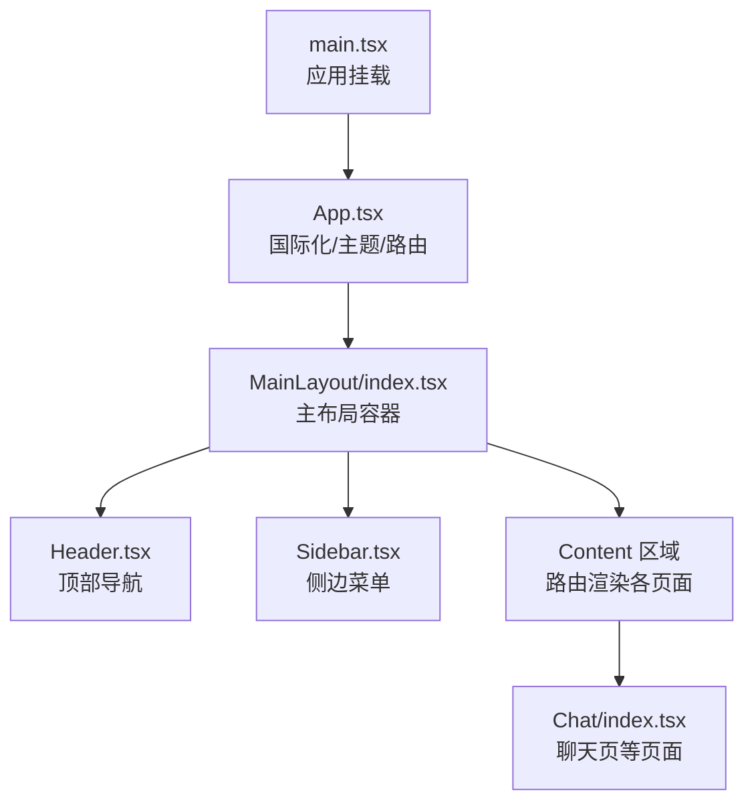
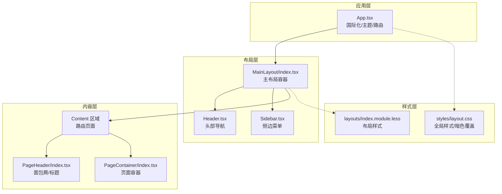
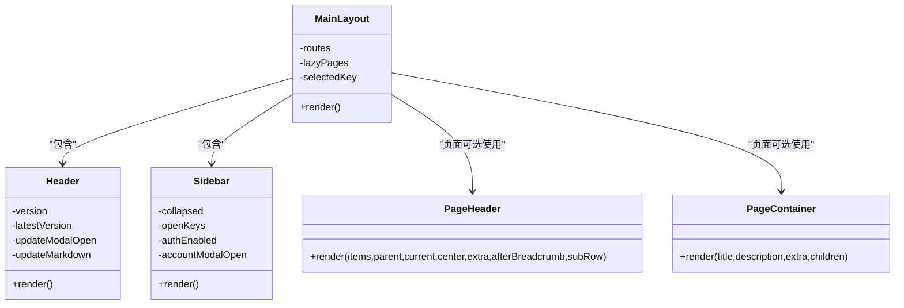
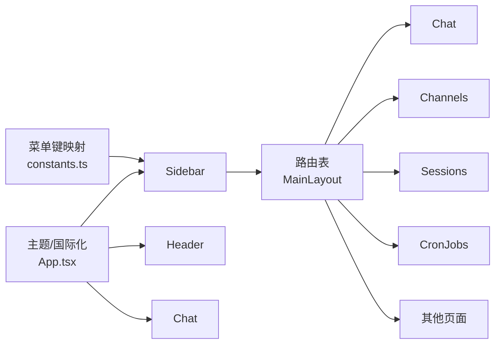

# 布局系统

<cite>
**本文引用的文件**
- [MainLayout/index.tsx](file://console/src/layouts/MainLayout/index.tsx)
- [Header.tsx](file://console/src/layouts/Header.tsx)
- [Sidebar.tsx](file://console/src/layouts/Sidebar.tsx)
- [constants.ts](file://console/src/layouts/constants.ts)
- [index.module.less](file://console/src/layouts/index.module.less)
- [layout.css](file://console/src/styles/layout.css)
- [App.tsx](file://console/src/App.tsx)
- [main.tsx](file://console/src/main.tsx)
- [PageHeader/index.tsx](file://console/src/components/PageHeader/index.tsx)
- [PageHeader/index.module.less](file://console/src/components/PageHeader/index.module.less)
- [PageContainer/index.tsx](file://console/src/components/PageContainer/index.tsx)
- [Chat/index.tsx](file://console/src/pages/Chat/index.tsx)
- [Chat/index.module.less](file://console/src/pages/Chat/index.module.less)
</cite>

## 目录
1. [简介](#简介)
2. [项目结构](#项目结构)
3. [核心组件](#核心组件)
4. [架构总览](#架构总览)
5. [详细组件分析](#详细组件分析)
6. [依赖关系分析](#依赖关系分析)
7. [性能考量](#性能考量)
8. [故障排查指南](#故障排查指南)
9. [结论](#结论)
10. [附录](#附录)

## 简介
本文件面向 CoPaw 前端控制台的布局系统，围绕基于 Ant Design 的响应式布局进行深入解析。重点覆盖主布局组件、头部导航、侧边栏菜单与内容区域的组织结构；详细说明布局断点、网格系统、导航层级与面包屑导航的实现；解释布局组件的属性配置、样式定制与交互行为，并提供移动端适配、屏幕尺寸响应与用户体验优化的实现细节。

## 项目结构
控制台采用“路由驱动 + 布局嵌套”的组织方式：
- 应用入口在根组件中配置国际化、主题与全局样式，再包裹主布局。
- 主布局负责整体容器、头部、侧边栏与内容区的组合。
- 内容区通过路由按需加载页面组件，支持错误边界与加载态。

图表来源
- [main.tsx:1-31](file://console/src/main.tsx#L1-L31)
- [App.tsx:182-217](file://console/src/App.tsx#L182-L217)
- [MainLayout/index.tsx:94-156](file://console/src/layouts/MainLayout/index.tsx#L94-L156)

章节来源
- [main.tsx:1-31](file://console/src/main.tsx#L1-L31)
- [App.tsx:182-217](file://console/src/App.tsx#L182-L217)
- [MainLayout/index.tsx:94-156](file://console/src/layouts/MainLayout/index.tsx#L94-L156)

## 核心组件
- 主布局容器：负责整体高度、滚动与内容区占位，承载头部与侧边栏。
- 头部导航：包含 Logo、版本徽章、外部链接按钮、语言切换与主题切换。
- 侧边栏菜单：支持折叠、手风琴式子菜单、认证相关动作与账户设置弹窗。
- 内容区：路由按需加载页面，提供错误边界与加载态，页面内可使用 PageHeader 与 PageContainer 组织内容。

章节来源
- [MainLayout/index.tsx:94-156](file://console/src/layouts/MainLayout/index.tsx#L94-L156)
- [Header.tsx:52-291](file://console/src/layouts/Header.tsx#L52-L291)
- [Sidebar.tsx:57-639](file://console/src/layouts/Sidebar.tsx#L57-L639)
- [PageHeader/index.tsx:31-77](file://console/src/components/PageHeader/index.tsx#L31-L77)
- [PageContainer/index.tsx:13-55](file://console/src/components/PageContainer/index.tsx#L13-L55)

## 架构总览
布局系统以 Ant Design 的 Layout 为基础，结合自定义样式与主题上下文，形成统一的视觉与交互体验。整体采用“固定头部 + 自适应侧边 + 滚动内容”的三段式布局，配合暗色主题与多语言支持，满足企业级控制台的可用性与一致性要求。

图表来源
- [App.tsx:182-217](file://console/src/App.tsx#L182-L217)
- [MainLayout/index.tsx:94-156](file://console/src/layouts/MainLayout/index.tsx#L94-L156)
- [Header.tsx:52-291](file://console/src/layouts/Header.tsx#L52-L291)
- [Sidebar.tsx:57-639](file://console/src/layouts/Sidebar.tsx#L57-L639)
- [index.module.less:1-635](file://console/src/layouts/index.module.less#L1-L635)
- [layout.css:1-800](file://console/src/styles/layout.css#L1-L800)

## 详细组件分析

### 主布局容器（MainLayout）
- 职责：作为 Ant Design Layout 的根容器，承载 Header、Sidebar 与 Content；管理路由与懒加载页面；提供错误边界与加载态。
- 关键点：
  - 使用路由表映射路径到页面组件，部分页面采用带重试的懒加载策略。
  - 通过路径到键值映射计算当前选中的侧边栏菜单项，用于高亮与状态同步。
  - Content 区域包裹 ConsoleCronBubble 与页面内容，提供统一的页面容器类名以便样式继承。

章节来源
- [MainLayout/index.tsx:94-156](file://console/src/layouts/MainLayout/index.tsx#L94-L156)
- [MainLayout/index.tsx:64-92](file://console/src/layouts/MainLayout/index.tsx#L64-L92)

### 头部导航（Header）
- 职责：展示 Logo、版本徽章与外部链接按钮；提供语言切换与主题切换；处理版本更新提示与弹窗。
- 关键点：
  - 版本徽章根据本地版本与 PyPI 最新稳定版比较，若存在更新则显示小红点与点击跳转。
  - 更新弹窗支持 Markdown 渲染，内置复制代码块能力与内联代码样式。
  - 外部链接通过桌面环境提供的 API 打开，否则回退到新窗口打开。
  - 支持暗色主题下的颜色覆盖与按钮悬停效果。

章节来源
- [Header.tsx:52-291](file://console/src/layouts/Header.tsx#L52-L291)
- [constants.ts:87-134](file://console/src/layouts/constants.ts#L87-L134)

### 侧边栏菜单（Sidebar）
- 职责：提供导航菜单、折叠/展开、手风琴子菜单、认证相关动作与账户设置弹窗。
- 关键点：
  - 折叠模式下仅显示图标，非折叠模式显示完整菜单与分组标签。
  - 手风琴模式：同一时间仅展开一个子菜单，避免层级过深导致的视觉混乱。
  - 认证启用时显示账户设置与退出登录按钮，支持修改用户名/密码并强制重新登录。
  - 菜单项与路径映射由常量维护，保证菜单点击与路由一致。

章节来源
- [Sidebar.tsx:57-639](file://console/src/layouts/Sidebar.tsx#L57-L639)
- [constants.ts:21-49](file://console/src/layouts/constants.ts#L21-L49)

### 内容区与页面组织
- 页面容器（PageContainer）：提供标题、描述与额外操作区，内部使用卡片容器承载页面内容。
- 页面头部（PageHeader）：支持父级/当前级构建面包屑，或直接传入自定义条目；支持中心与右侧扩展区域。
- 聊天页（Chat）：作为默认首页，集成会话管理、模型选择、附件上传与命令建议等。

章节来源
- [PageContainer/index.tsx:13-55](file://console/src/components/PageContainer/index.tsx#L13-L55)
- [PageHeader/index.tsx:31-77](file://console/src/components/PageHeader/index.tsx#L31-L77)
- [Chat/index.tsx:400-894](file://console/src/pages/Chat/index.tsx#L400-L894)

### 样式与主题
- 布局样式（index.module.less）：定义主布局、头部、侧边栏、折叠菜单、更新弹窗、代码块与复制按钮等局部样式；提供暗色主题覆盖。
- 全局样式（layout.css）：设置 html/body 高度与滚动、Ant Design 布局背景、暗色主题全局覆盖、表格/输入/模态框等组件的深色变体。

章节来源
- [index.module.less:1-635](file://console/src/layouts/index.module.less#L1-L635)
- [layout.css:1-800](file://console/src/styles/layout.css#L1-L800)

### 类图（代码级）

图表来源
- [MainLayout/index.tsx:94-156](file://console/src/layouts/MainLayout/index.tsx#L94-L156)
- [Header.tsx:52-291](file://console/src/layouts/Header.tsx#L52-L291)
- [Sidebar.tsx:57-639](file://console/src/layouts/Sidebar.tsx#L57-L639)
- [PageHeader/index.tsx:31-77](file://console/src/components/PageHeader/index.tsx#L31-L77)
- [PageContainer/index.tsx:13-55](file://console/src/components/PageContainer/index.tsx#L13-L55)

## 依赖关系分析
- 路由与懒加载：MainLayout 通过路由表将路径映射到页面组件，部分页面采用带重试的懒加载策略，提升首屏性能与稳定性。
- 导航与菜单：Sidebar 依赖常量映射将菜单键转换为路径，确保点击与路由一致；同时根据当前路径高亮选中项。
- 主题与国际化：App 统一配置 Ant Design 国际化与主题算法，Header/Sidebar/Chat 等组件读取主题上下文与翻译资源。
- 错误边界与加载态：MainLayout 在内容区外层包裹错误边界与加载态，保障页面异常时的用户体验。

图表来源
- [MainLayout/index.tsx:12-61](file://console/src/layouts/MainLayout/index.tsx#L12-L61)
- [constants.ts:21-49](file://console/src/layouts/constants.ts#L21-L49)
- [App.tsx:182-217](file://console/src/App.tsx#L182-L217)

章节来源
- [MainLayout/index.tsx:12-61](file://console/src/layouts/MainLayout/index.tsx#L12-L61)
- [constants.ts:21-49](file://console/src/layouts/constants.ts#L21-L49)
- [App.tsx:182-217](file://console/src/App.tsx#L182-L217)

## 性能考量
- 懒加载与重试：对非首页页面采用带重试的懒加载，降低首屏负载并提升网络失败后的可用性。
- 加载态与骨架：内容区提供加载态指示器，改善页面切换时的感知性能。
- 滚动与高度：全局样式限制 html/body 高度与滚动，布局容器使用固定高度与溢出隐藏，避免不必要的重排。
- 暗色主题：通过全局样式覆盖 Ant Design 组件的深色变体，减少重复注入样式带来的开销。

章节来源
- [MainLayout/index.tsx:12-61](file://console/src/layouts/MainLayout/index.tsx#L12-L61)
- [layout.css:1-800](file://console/src/styles/layout.css#L1-L800)

## 故障排查指南
- 版本更新弹窗不显示或内容为空：检查网络访问与 Markdown 获取逻辑；确认语言与缓存策略。
- 菜单点击无反应：确认菜单键是否存在于映射表，以及路由路径是否正确。
- 暗色主题样式异常：检查全局样式覆盖顺序与主题上下文是否生效。
- 页面切换闪烁或白屏：检查懒加载与错误边界配置，确认 Suspense fallback 是否合理。
- 移动端体验差：检查侧边栏折叠逻辑与菜单项图标尺寸，确保触摸目标足够大。

章节来源
- [Header.tsx:111-139](file://console/src/layouts/Header.tsx#L111-L139)
- [constants.ts:21-49](file://console/src/layouts/constants.ts#L21-L49)
- [index.module.less:90-128](file://console/src/layouts/index.module.less#L90-L128)

## 结论
CoPaw 控制台布局系统以 Ant Design 为基础，结合自定义样式与主题上下文，实现了统一、可扩展且具备良好暗色主题支持的响应式布局。通过路由驱动的页面组织、菜单键映射与懒加载策略，系统在性能与可维护性之间取得平衡；通过头部导航、侧边栏菜单与页面容器的协同，提供了清晰的信息架构与一致的交互体验。

## 附录

### 响应式与断点说明
- 布局采用固定头部与自适应侧边栏，内容区滚动，整体高度由视口决定。
- 侧边栏支持折叠，折叠后仅显示图标，适合窄屏设备；非折叠模式下菜单项与分组标签清晰可见。
- 暗色主题覆盖了主要组件的样式，确保在不同背景下的一致性。

章节来源
- [index.module.less:30-194](file://console/src/layouts/index.module.less#L30-L194)
- [layout.css:786-800](file://console/src/styles/layout.css#L786-L800)

### 面包屑导航实现
- PageHeader 支持两种方式构建面包屑：传入父级/当前级节点，或直接传入自定义条目数组。
- 当前项样式与分隔符样式在暗色主题下有相应覆盖，确保可读性。

章节来源
- [PageHeader/index.tsx:21-77](file://console/src/components/PageHeader/index.tsx#L21-L77)
- [PageHeader/index.module.less:28-52](file://console/src/components/PageHeader/index.module.less#L28-L52)

### 交互行为与用户反馈
- 版本更新弹窗：点击版本徽章触发，支持 Markdown 渲染与复制代码块。
- 菜单折叠切换：点击折叠按钮在展开/折叠间切换，折叠时菜单项居中显示。
- 账户设置弹窗：支持修改用户名/密码，提交后清理令牌并强制跳转登录。

章节来源
- [Header.tsx:111-139](file://console/src/layouts/Header.tsx#L111-L139)
- [Sidebar.tsx:557-639](file://console/src/layouts/Sidebar.tsx#L557-L639)