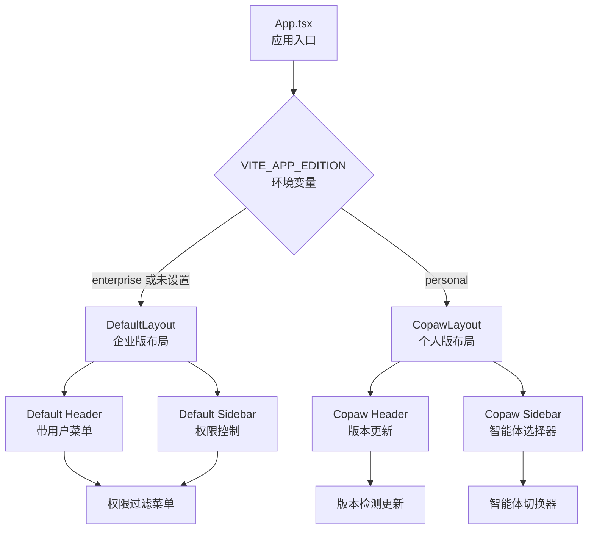
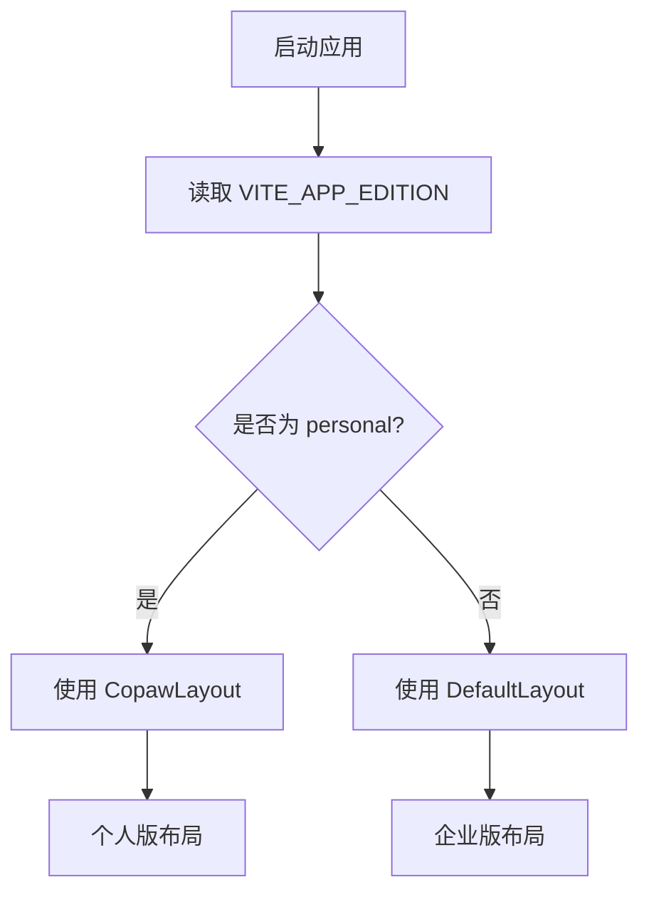
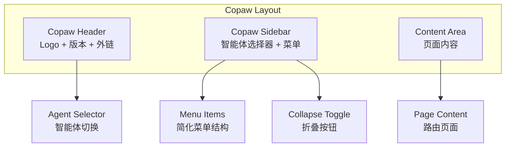
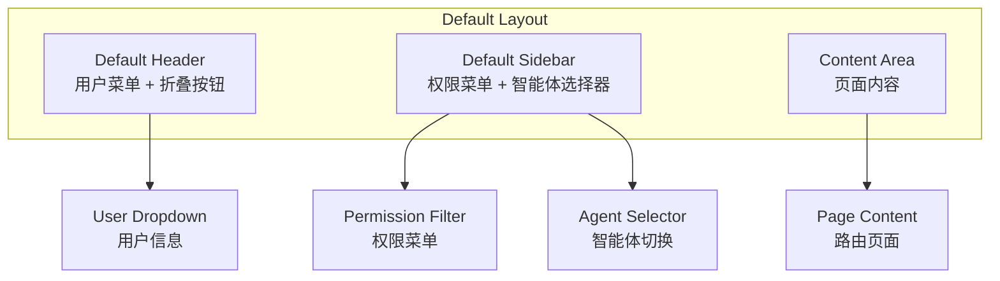
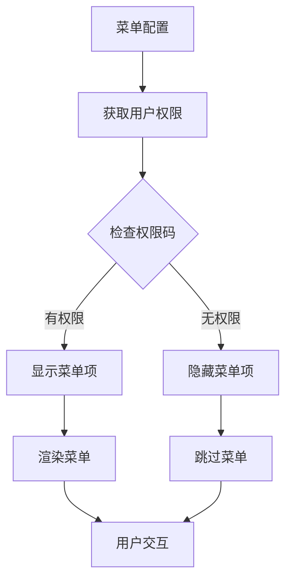
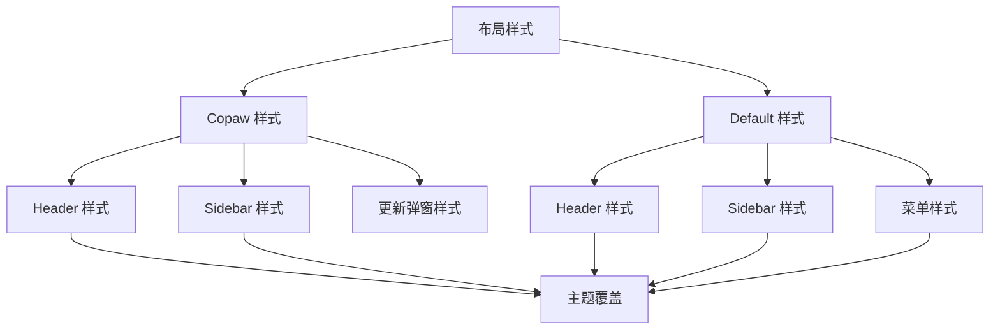

# 布局系统

<cite>
**本文引用的文件**
- [App.tsx](file://console/src/App.tsx)
- [MainLayout/index.tsx](file://console/src/layouts/MainLayout/index.tsx)
- [copaw/index.tsx](file://console/src/layouts/copaw/index.tsx)
- [default/index.tsx](file://console/src/layouts/default/index.tsx)
- [copaw/Header.tsx](file://console/src/layouts/copaw/Header.tsx)
- [copaw/Sidebar.tsx](file://console/src/layouts/copaw/Sidebar.tsx)
- [default/Header.tsx](file://console/src/layouts/default/Header.tsx)
- [default/Sidebar.tsx](file://console/src/layouts/default/Sidebar.tsx)
- [copaw/constants.ts](file://console/src/layouts/copaw/constants.ts)
- [default/constants.tsx](file://console/src/layouts/default/constants.tsx)
- [copaw/index.module.less](file://console/src/layouts/copaw/index.module.less)
- [default/index.module.less](file://console/src/layouts/default/index.module.less)
- [layout.css](file://console/src/styles/layout.css)
- [PageHeader/index.tsx](file://console/src/components/PageHeader/index.tsx)
- [PageHeader/index.module.less](file://console/src/components/PageHeader/index.module.less)
- [PageContainer/index.tsx](file://console/src/components/PageContainer/index.tsx)
- [Chat/index.tsx](file://console/src/pages/Chat/index.tsx)
</cite>

## 更新摘要
**所做更改**
- 新增双布局架构文档，包含 copaw 和 default 两种布局模式
- 更新布局组件结构，从单一 MainLayout 迁移到双布局系统
- 新增企业版权限控制布局和个性化布局的详细说明
- 更新布局选择机制和环境变量配置说明
- 新增权限过滤菜单和智能体选择器的实现细节

## 目录
1. [简介](#简介)
2. [双布局架构概览](#双布局架构概览)
3. [布局选择机制](#布局选择机制)
4. [Copaw 个人版布局](#copaw-个人版布局)
5. [Default 企业版布局](#default-企业版布局)
6. [核心组件对比分析](#核心组件对比分析)
7. [权限控制系统](#权限控制系统)
8. [样式系统与主题](#样式系统与主题)
9. [响应式设计与用户体验](#响应式设计与用户体验)
10. [迁移指南](#迁移指南)
11. [故障排查](#故障排查)
12. [结论](#结论)

## 简介
CoPaw 前端控制台已从单一布局架构重构为双布局架构，提供 Copaw 个人版布局（copaw）和 Default 企业版布局（default）两种模式。这种设计允许系统根据部署环境自动选择合适的布局模式，个人版专注于简洁易用，企业版强调权限控制和功能完整性。

## 双布局架构概览
双布局架构通过环境变量 VITE_APP_EDITION 自动选择布局模式：



**图表来源**
- [App.tsx:152-157](file://console/src/App.tsx#L152-L157)
- [default/index.tsx:101-172](file://console/src/layouts/default/index.tsx#L101-L172)
- [copaw/index.tsx:100-161](file://console/src/layouts/copaw/index.tsx#L100-L161)

## 布局选择机制
布局选择基于环境变量 VITE_APP_EDITION：

- **enterprise** 或未设置：选择 DefaultLayout（企业版）
- **personal**：选择 CopawLayout（个人版）



**图表来源**
- [App.tsx:152-157](file://console/src/App.tsx#L152-L157)

**章节来源**
- [App.tsx:152-157](file://console/src/App.tsx#L152-L157)

## Copaw 个人版布局
Copaw 个人版布局专为个人用户设计，提供简洁直观的操作界面：

### 核心特性
- **简化菜单结构**：去除权限控制，菜单项直接展示
- **智能体选择器**：顶部集成智能体切换功能
- **版本更新系统**：内置版本检测和更新提示
- **个性化主题**：支持亮色和暗色主题切换

### 布局结构


**图表来源**
- [copaw/index.tsx:100-161](file://console/src/layouts/copaw/index.tsx#L100-L161)
- [copaw/Header.tsx:52-291](file://console/src/layouts/copaw/Header.tsx#L52-L291)
- [copaw/Sidebar.tsx:57-639](file://console/src/layouts/copaw/Sidebar.tsx#L57-L639)

**章节来源**
- [copaw/index.tsx:100-161](file://console/src/layouts/copaw/index.tsx#L100-L161)
- [copaw/Header.tsx:52-291](file://console/src/layouts/copaw/Header.tsx#L52-L291)
- [copaw/Sidebar.tsx:57-639](file://console/src/layouts/copaw/Sidebar.tsx#L57-L639)

## Default 企业版布局
Default 企业版布局提供完整的权限控制和管理功能：

### 核心特性
- **权限控制**：基于 RBAC 的菜单权限过滤
- **用户管理**：完整的用户认证和权限系统
- **企业功能**：组织管理、工作流、审计日志等
- **折叠菜单**：支持侧边栏折叠，节省空间

### 布局结构


**图表来源**
- [default/index.tsx:101-172](file://console/src/layouts/default/index.tsx#L101-L172)
- [default/Header.tsx:41-127](file://console/src/layouts/default/Header.tsx#L41-L127)
- [default/Sidebar.tsx:37-211](file://console/src/layouts/default/Sidebar.tsx#L37-L211)

**章节来源**
- [default/index.tsx:101-172](file://console/src/layouts/default/index.tsx#L101-L172)
- [default/Header.tsx:41-127](file://console/src/layouts/default/Header.tsx#L41-L127)
- [default/Sidebar.tsx:37-211](file://console/src/layouts/default/Sidebar.tsx#L37-L211)

## 核心组件对比分析

### 头部组件对比
| 特性 | Copaw Header | Default Header |
|------|-------------|----------------|
| Logo 显示 | 个人版 Logo + 版本徽章 | 企业版 Logo + 标题 |
| 功能按钮 | 文档、FAQ、GitHub、更新提示 | 折叠按钮、用户菜单 |
| 版本管理 | 内置版本检测和更新 | 简化版本显示 |
| 用户交互 | 版本更新弹窗 | 用户下拉菜单 |

### 侧边栏组件对比
| 特性 | Copaw Sidebar | Default Sidebar |
|------|--------------|-----------------|
| 智能体选择器 | 顶部固定显示 | 顶部固定显示 |
| 菜单结构 | 简化分组 | 权限分组 |
| 折叠功能 | 图标模式 | 完整菜单模式 |
| 权限控制 | 无权限过滤 | RBAC 权限过滤 |
| 用户操作 | 账户设置、退出登录 | 用户菜单、设置 |

**章节来源**
- [copaw/Header.tsx:52-291](file://console/src/layouts/copaw/Header.tsx#L52-L291)
- [default/Header.tsx:41-127](file://console/src/layouts/default/Header.tsx#L41-L127)
- [copaw/Sidebar.tsx:57-639](file://console/src/layouts/copaw/Sidebar.tsx#L57-L639)
- [default/Sidebar.tsx:37-211](file://console/src/layouts/default/Sidebar.tsx#L37-L211)

## 权限控制系统
企业版布局采用 RBAC 权限控制，通过权限码过滤菜单项：

### 权限配置结构
```typescript
interface MenuItem {
  key: string;
  label: string;
  icon?: React.ReactNode;
  path?: string;
  permission?: string;  // 权限码
  children?: MenuItem[];
}
```

### 权限过滤流程


**图表来源**
- [default/constants.tsx:32-39](file://console/src/layouts/default/constants.tsx#L32-L39)
- [default/Sidebar.tsx:68-76](file://console/src/layouts/default/Sidebar.tsx#L68-L76)

**章节来源**
- [default/constants.tsx:45-269](file://console/src/layouts/default/constants.tsx#L45-L269)
- [default/Sidebar.tsx:68-76](file://console/src/layouts/default/Sidebar.tsx#L68-L76)

## 样式系统与主题
双布局系统采用模块化样式设计，支持亮色和暗色主题：

### 样式架构


### 主题系统
- **颜色方案**：统一使用 #FF7F16 橙色主题色
- **暗色模式**：完整的暗色主题覆盖
- **响应式设计**：适配不同屏幕尺寸

**图表来源**
- [copaw/index.module.less:1-635](file://console/src/layouts/copaw/index.module.less#L1-L635)
- [default/index.module.less:1-394](file://console/src/layouts/default/index.module.less#L1-L394)

**章节来源**
- [copaw/index.module.less:1-635](file://console/src/layouts/copaw/index.module.less#L1-L635)
- [default/index.module.less:1-394](file://console/src/layouts/default/index.module.less#L1-L394)

## 响应式设计与用户体验
双布局系统提供优秀的响应式设计和用户体验：

### 响应式特性
- **自适应布局**：根据屏幕尺寸调整布局
- **折叠菜单**：支持侧边栏折叠，节省空间
- **主题适配**：自动适配亮色和暗色主题
- **动画过渡**：流畅的布局切换动画

### 用户体验优化
- **智能体切换**：顶部智能体选择器快速切换
- **权限透明**：权限不足时自动隐藏相关功能
- **版本更新**：自动检测版本更新并提示
- **多语言支持**：完整的国际化支持

**章节来源**
- [copaw/Sidebar.tsx:66-639](file://console/src/layouts/copaw/Sidebar.tsx#L66-L639)
- [default/Sidebar.tsx:46-211](file://console/src/layouts/default/Sidebar.tsx#L46-L211)

## 迁移指南
从旧布局系统迁移到双布局架构：

### 1. 环境配置
```bash
# 个人版
VITE_APP_EDITION=personal

# 企业版
VITE_APP_EDITION=enterprise
```

### 2. 组件迁移
- 删除 MainLayout 组件
- 使用 CopawLayout 替代个人版布局
- 使用 DefaultLayout 替代企业版布局

### 3. 样式调整
- 更新样式文件引用
- 调整主题配置
- 适配新的布局结构

### 4. 权限配置
- 配置权限码
- 设置菜单权限
- 测试权限过滤

## 故障排查
### 常见问题及解决方案

#### 布局选择错误
**问题**：应用选择了错误的布局模式
**解决**：检查 VITE_APP_EDITION 环境变量设置

#### 权限菜单不显示
**问题**：权限菜单项未正确显示
**解决**：验证权限码配置和用户权限状态

#### 样式异常
**问题**：布局样式显示异常
**解决**：检查样式文件导入和主题配置

#### 智能体切换失效
**问题**：智能体选择器无法正常工作
**解决**：验证智能体 API 配置和权限

**章节来源**
- [App.tsx:152-157](file://console/src/App.tsx#L152-L157)
- [default/Sidebar.tsx:68-76](file://console/src/layouts/default/Sidebar.tsx#L68-L76)

## 结论
CoPaw 双布局架构通过 Copaw 个人版和 Default 企业版的分离设计，为不同用户群体提供了最优的使用体验。个人版注重简洁易用，企业版强调功能完整性和安全性。这种架构设计不仅提升了系统的灵活性和可维护性，也为未来的功能扩展奠定了坚实基础。

双布局系统的核心优势在于：
- **灵活部署**：根据环境自动选择合适布局
- **功能分离**：个人版和企业版功能独立演进
- **权限安全**：企业版提供完整的权限控制
- **用户体验**：针对不同用户群体优化界面设计

通过模块化的样式系统和响应式设计，双布局架构为 CoPaw 控制台提供了现代化、可扩展的前端基础设施。