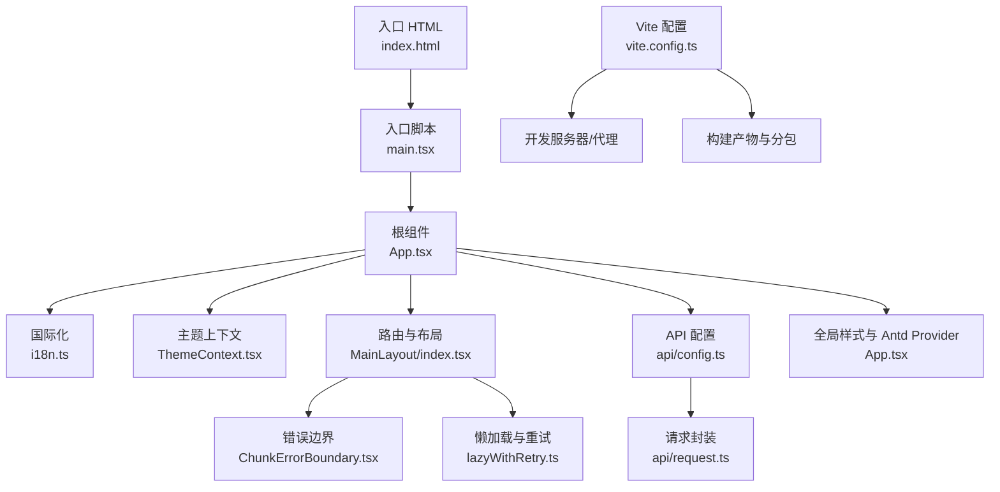
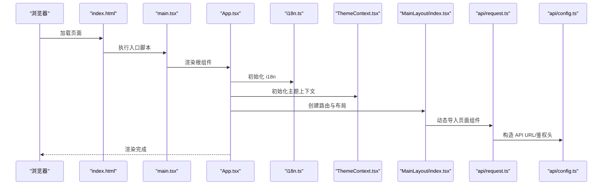
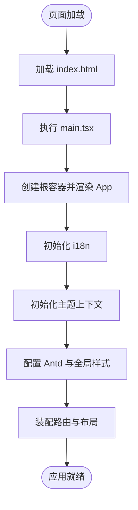
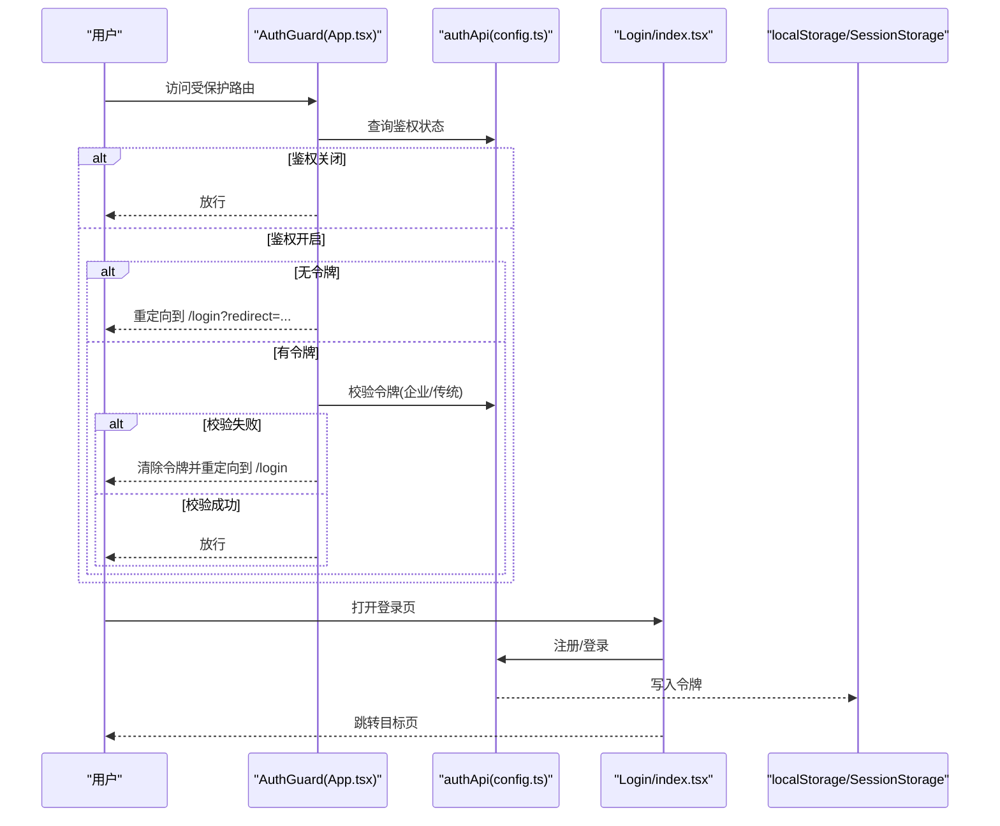
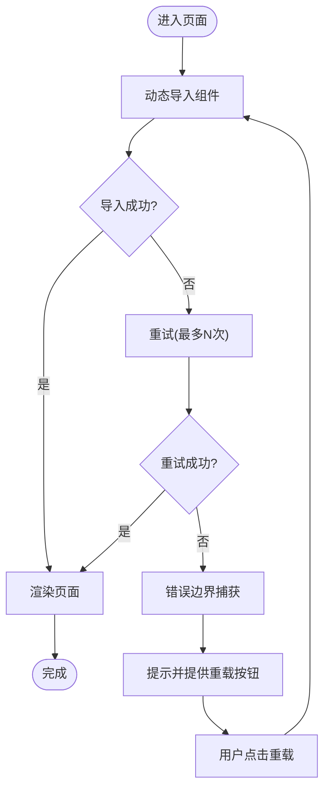
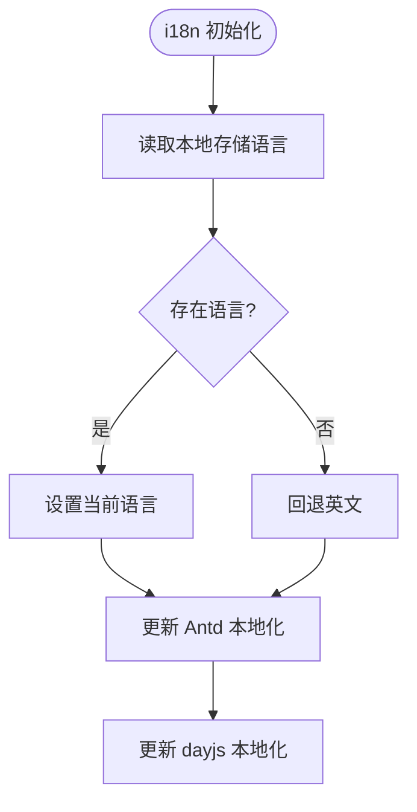
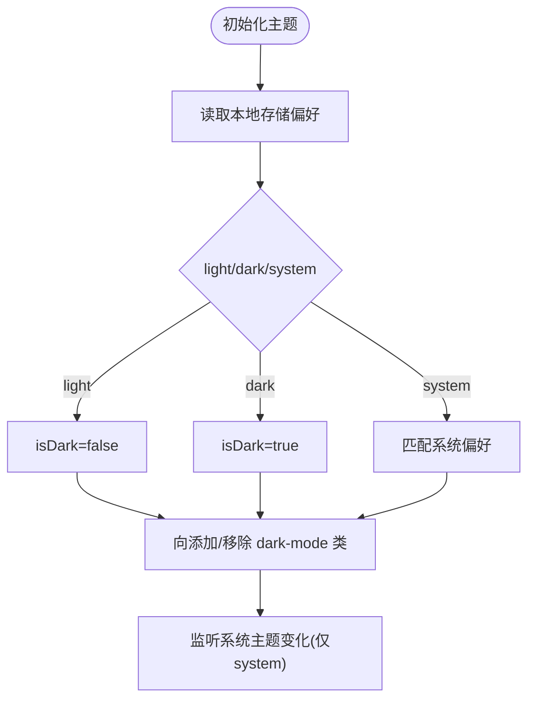
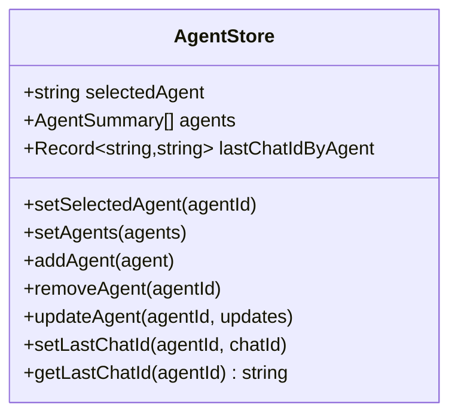
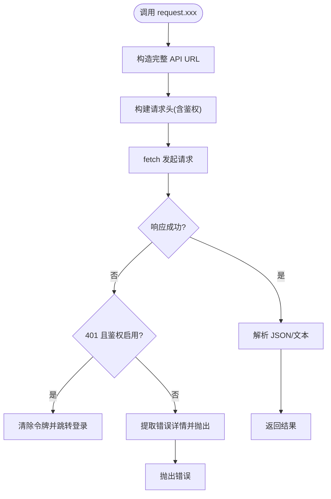
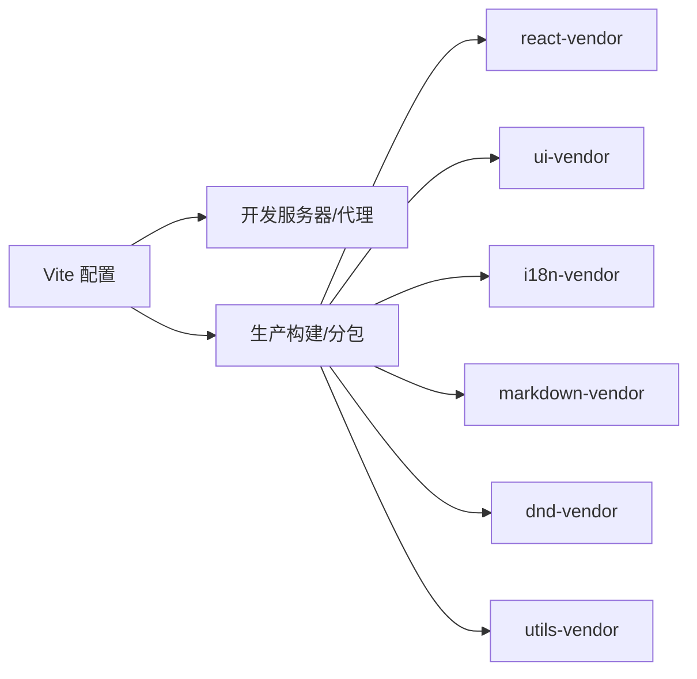

# 应用架构

<cite>
**本文引用的文件**
- [console/src/main.tsx](file://console/src/main.tsx)
- [console/src/App.tsx](file://console/src/App.tsx)
- [console/vite.config.ts](file://console/vite.config.ts)
- [console/package.json](file://console/package.json)
- [console/tsconfig.json](file://console/tsconfig.json)
- [console/src/i18n.ts](file://console/src/i18n.ts)
- [console/src/contexts/ThemeContext.tsx](file://console/src/contexts/ThemeContext.tsx)
- [console/src/layouts/MainLayout/index.tsx](file://console/src/layouts/MainLayout/index.tsx)
- [console/src/components/ChunkErrorBoundary.tsx](file://console/src/components/ChunkErrorBoundary.tsx)
- [console/src/utils/lazyWithRetry.ts](file://console/src/utils/lazyWithRetry.ts)
- [console/src/api/config.ts](file://console/src/api/config.ts)
- [console/src/api/request.ts](file://console/src/api/request.ts)
- [console/src/stores/agentStore.ts](file://console/src/stores/agentStore.ts)
- [console/src/pages/Login/index.tsx](file://console/src/pages/Login/index.tsx)
- [console/index.html](file://console/index.html)
</cite>

## 目录
1. [引言](#引言)
2. [项目结构](#项目结构)
3. [核心组件](#核心组件)
4. [架构总览](#架构总览)
5. [详细组件分析](#详细组件分析)
6. [依赖分析](#依赖分析)
7. [性能考虑](#性能考虑)
8. [故障排查指南](#故障排查指南)
9. [结论](#结论)
10. [附录](#附录)

## 引言
本文件面向 CoPaw 前端控制台（console），系统性阐述基于 React 18 + TypeScript 的现代前端架构：应用初始化流程、路由与布局、国际化与主题系统、全局状态管理、错误边界与容错策略、以及 Vite 构建与开发服务器配置。文档同时覆盖启动过程、全局状态管理、错误边界处理、性能优化策略、生命周期与资源清理最佳实践，帮助开发者快速理解并高效迭代。

## 项目结构
控制台采用“模块化 + 分层”的组织方式：
- 入口与根组件：入口脚本负责挂载根组件；根组件负责国际化、主题、路由与全局样式注入。
- 路由与布局：主布局负责侧边栏、头部与内容区，结合 React Router 实现页面级懒加载与错误边界包裹。
- 国际化与主题：独立的 i18n 初始化与主题上下文，提供语言切换与深色/浅色模式支持。
- API 与请求封装：统一的 API 配置与请求工具，内置鉴权头、错误解析与 401 处理。
- 状态管理：轻量的 Zustand 存储，持久化到 sessionStorage，用于代理选择等场景。
- 构建与运行：Vite 提供开发服务器与生产构建，配合 TypeScript 与 ESLint/Prettier。

图表来源
- [console/index.html:1-20](file://console/index.html#L1-L20)
- [console/src/main.tsx:1-31](file://console/src/main.tsx#L1-L31)
- [console/src/App.tsx:1-228](file://console/src/App.tsx#L1-L228)
- [console/src/i18n.ts:1-32](file://console/src/i18n.ts#L1-L32)
- [console/src/contexts/ThemeContext.tsx:1-105](file://console/src/contexts/ThemeContext.tsx#L1-L105)
- [console/src/layouts/MainLayout/index.tsx:1-154](file://console/src/layouts/MainLayout/index.tsx#L1-L154)
- [console/src/components/ChunkErrorBoundary.tsx:1-85](file://console/src/components/ChunkErrorBoundary.tsx#L1-L85)
- [console/src/utils/lazyWithRetry.ts:1-36](file://console/src/utils/lazyWithRetry.ts#L1-L36)
- [console/src/api/config.ts:1-68](file://console/src/api/config.ts#L1-L68)
- [console/src/api/request.ts:1-136](file://console/src/api/request.ts#L1-L136)
- [console/vite.config.ts:1-118](file://console/vite.config.ts#L1-L118)

章节来源
- [console/index.html:1-20](file://console/index.html#L1-L20)
- [console/src/main.tsx:1-31](file://console/src/main.tsx#L1-L31)
- [console/src/App.tsx:1-228](file://console/src/App.tsx#L1-L228)
- [console/vite.config.ts:1-118](file://console/vite.config.ts#L1-L118)

## 核心组件
- 应用入口与初始化
  - 入口 HTML 挂载根节点，入口脚本创建根容器并渲染根组件。
  - 启动时对浏览器 console 的部分警告进行过滤，避免无意义噪音干扰。
- 根组件与全局配置
  - 注入全局样式、Ant Design ConfigProvider 与自定义主题变量。
  - 统一国际化与语言偏好持久化，按语言切换 Antd 本地化与 dayjs 本地化。
  - 基于路由 basename 支持子路径部署。
- 主布局与路由
  - 主布局包含头部、侧边栏与内容区，使用 Suspense 与错误边界包裹懒加载页面。
  - 默认进入聊天页，其余页面通过动态导入与自动重试提升健壮性。
- 国际化系统
  - i18n 初始化多语言资源，优先读取本地存储的语言偏好，回退英文。
- 主题管理
  - 主题上下文支持 light/dark/system 三种模式，自动监听系统主题变化，持久化用户选择。
- 请求与鉴权
  - 统一的 API URL 构造与鉴权头注入，401 自动清除令牌并跳转登录（在启用鉴权时）。
  - 支持企业版与传统鉴权的兼容检查。
- 错误边界与容错
  - 针对动态导入失败的启发式识别与友好提示，支持自动重载。
- 状态管理
  - 使用 Zustand 管理代理相关状态，并以 sessionStorage 进行持久化，避免跨标签页冲突。

章节来源
- [console/src/main.tsx:1-31](file://console/src/main.tsx#L1-L31)
- [console/src/App.tsx:1-228](file://console/src/App.tsx#L1-L228)
- [console/src/i18n.ts:1-32](file://console/src/i18n.ts#L1-L32)
- [console/src/contexts/ThemeContext.tsx:1-105](file://console/src/contexts/ThemeContext.tsx#L1-L105)
- [console/src/layouts/MainLayout/index.tsx:1-154](file://console/src/layouts/MainLayout/index.tsx#L1-L154)
- [console/src/components/ChunkErrorBoundary.tsx:1-85](file://console/src/components/ChunkErrorBoundary.tsx#L1-L85)
- [console/src/utils/lazyWithRetry.ts:1-36](file://console/src/utils/lazyWithRetry.ts#L1-L36)
- [console/src/api/config.ts:1-68](file://console/src/api/config.ts#L1-L68)
- [console/src/api/request.ts:1-136](file://console/src/api/request.ts#L1-L136)
- [console/src/stores/agentStore.ts:1-89](file://console/src/stores/agentStore.ts#L1-L89)

## 架构总览
下图展示从浏览器加载到页面渲染的关键调用链路，涵盖初始化、鉴权守卫、路由与布局、国际化与主题、API 请求与错误处理。

图表来源
- [console/index.html:1-20](file://console/index.html#L1-L20)
- [console/src/main.tsx:1-31](file://console/src/main.tsx#L1-L31)
- [console/src/App.tsx:1-228](file://console/src/App.tsx#L1-L228)
- [console/src/i18n.ts:1-32](file://console/src/i18n.ts#L1-L32)
- [console/src/contexts/ThemeContext.tsx:1-105](file://console/src/contexts/ThemeContext.tsx#L1-L105)
- [console/src/layouts/MainLayout/index.tsx:1-154](file://console/src/layouts/MainLayout/index.tsx#L1-L154)
- [console/src/api/request.ts:1-136](file://console/src/api/request.ts#L1-L136)
- [console/src/api/config.ts:1-68](file://console/src/api/config.ts#L1-L68)

## 详细组件分析

### 应用初始化与启动流程
- 入口 HTML 仅包含根节点与基础 meta，脚本按需加载入口。
- 入口脚本创建根容器并渲染根组件；同时对控制台输出进行过滤，屏蔽无关告警。
- 根组件执行国际化初始化、主题上下文注入、Antd 全局配置与路由装配。

图表来源
- [console/index.html:1-20](file://console/index.html#L1-L20)
- [console/src/main.tsx:1-31](file://console/src/main.tsx#L1-L31)
- [console/src/App.tsx:1-228](file://console/src/App.tsx#L1-L228)

章节来源
- [console/index.html:1-20](file://console/index.html#L1-L20)
- [console/src/main.tsx:1-31](file://console/src/main.tsx#L1-L31)
- [console/src/App.tsx:1-228](file://console/src/App.tsx#L1-L228)

### 鉴权守卫与登录流程
- 鉴权守卫在首次访问时检测后端鉴权状态，决定是否需要登录或允许匿名访问。
- 登录页根据后端返回的鉴权模式与是否存在用户，自动切换注册/登录流程，并支持企业版与传统鉴权。
- 登录成功后写入令牌并跳转至目标页面。

图表来源
- [console/src/App.tsx:49-136](file://console/src/App.tsx#L49-L136)
- [console/src/api/config.ts:1-68](file://console/src/api/config.ts#L1-L68)
- [console/src/pages/Login/index.tsx:1-234](file://console/src/pages/Login/index.tsx#L1-L234)

章节来源
- [console/src/App.tsx:49-136](file://console/src/App.tsx#L49-L136)
- [console/src/api/config.ts:1-68](file://console/src/api/config.ts#L1-L68)
- [console/src/pages/Login/index.tsx:1-234](file://console/src/pages/Login/index.tsx#L1-L234)

### 路由、懒加载与错误边界
- 主布局使用 React Router v6 装配路由，首页默认进入聊天页。
- 页面组件采用 React.lazy 动态导入，并通过自定义重试包装器提升稳定性。
- 错误边界对动态导入失败进行启发式识别，提供重载按钮；其他渲染错误保持应用可用。

图表来源
- [console/src/layouts/MainLayout/index.tsx:1-154](file://console/src/layouts/MainLayout/index.tsx#L1-L154)
- [console/src/utils/lazyWithRetry.ts:1-36](file://console/src/utils/lazyWithRetry.ts#L1-L36)
- [console/src/components/ChunkErrorBoundary.tsx:1-85](file://console/src/components/ChunkErrorBoundary.tsx#L1-L85)

章节来源
- [console/src/layouts/MainLayout/index.tsx:1-154](file://console/src/layouts/MainLayout/index.tsx#L1-L154)
- [console/src/utils/lazyWithRetry.ts:1-36](file://console/src/utils/lazyWithRetry.ts#L1-L36)
- [console/src/components/ChunkErrorBoundary.tsx:1-85](file://console/src/components/ChunkErrorBoundary.tsx#L1-L85)

### 国际化系统
- i18n 初始化多语言资源，优先使用本地存储的语言键值，否则回退英文。
- 应用内监听语言变更事件，动态更新 Antd 本地化与 dayjs 本地化。

图表来源
- [console/src/i18n.ts:1-32](file://console/src/i18n.ts#L1-L32)
- [console/src/App.tsx:151-181](file://console/src/App.tsx#L151-L181)

章节来源
- [console/src/i18n.ts:1-32](file://console/src/i18n.ts#L1-L32)
- [console/src/App.tsx:151-181](file://console/src/App.tsx#L151-L181)

### 主题管理机制
- 支持 light/dark/system 三种模式，系统模式自动监听 prefers-color-scheme。
- 用户选择持久化到本地存储，应用通过向 <html> 添加/移除类名实现全局样式变量切换。

图表来源
- [console/src/contexts/ThemeContext.tsx:1-105](file://console/src/contexts/ThemeContext.tsx#L1-L105)

章节来源
- [console/src/contexts/ThemeContext.tsx:1-105](file://console/src/contexts/ThemeContext.tsx#L1-L105)

### 全局状态管理（Zustand）
- 使用 Zustand 管理代理选择、代理列表与各代理最后会话 ID 映射。
- 采用 sessionStorage 持久化，异常时自动清理损坏数据，保证健壮性。

图表来源
- [console/src/stores/agentStore.ts:1-89](file://console/src/stores/agentStore.ts#L1-L89)

章节来源
- [console/src/stores/agentStore.ts:1-89](file://console/src/stores/agentStore.ts#L1-L89)

### API 请求与错误处理
- 统一封装 fetch 请求，自动注入鉴权头与 Content-Type。
- 对 401 进行特殊处理：清除令牌并在启用鉴权时跳转登录。
- 解析响应体中的错误字段，提供更友好的错误信息。

图表来源
- [console/src/api/request.ts:1-136](file://console/src/api/request.ts#L1-L136)
- [console/src/api/config.ts:1-68](file://console/src/api/config.ts#L1-L68)

章节来源
- [console/src/api/request.ts:1-136](file://console/src/api/request.ts#L1-L136)
- [console/src/api/config.ts:1-68](file://console/src/api/config.ts#L1-L68)

## 依赖分析
- 构建与运行
  - Vite 提供开发服务器与生产构建，支持环境变量注入、CSS Modules、Less 预处理、路径别名与代理。
  - Rollup 手动分包策略将 React、Antd、i18n、Markdown、拖拽与通用工具库拆分为独立 chunk，优化缓存与加载。
- 依赖清单
  - React 18、React Router DOM v7、Ant Design 5、Ant Design X Markdown、i18next、dayjs、zustand、@dnd-kit 等。

图表来源
- [console/vite.config.ts:1-118](file://console/vite.config.ts#L1-L118)
- [console/package.json:1-63](file://console/package.json#L1-L63)

章节来源
- [console/vite.config.ts:1-118](file://console/vite.config.ts#L1-L118)
- [console/package.json:1-63](file://console/package.json#L1-L63)

## 性能考虑
- 代码分割与懒加载
  - 主页（聊天）直接引入，其他页面使用 React.lazy 并结合重试逻辑，降低首屏体积与提升稳定性。
- 分包策略
  - 通过手动分包将核心依赖拆分为独立 chunk，减少重复依赖与缓存失效影响。
- 缓存与预加载
  - 静态资源与字体通过 HTML 预连接，减少网络往返。
- 构建优化
  - 生产构建开启 CSS 代码分割与 Source Map 控制，限制 chunk 警告阈值，平衡调试与体积。
- 运行时优化
  - 主题切换与国际化切换均采用最小化副作用，避免不必要的重渲染。

章节来源
- [console/src/layouts/MainLayout/index.tsx:1-154](file://console/src/layouts/MainLayout/index.tsx#L1-L154)
- [console/src/utils/lazyWithRetry.ts:1-36](file://console/src/utils/lazyWithRetry.ts#L1-L36)
- [console/vite.config.ts:50-117](file://console/vite.config.ts#L50-L117)
- [console/index.html:1-20](file://console/index.html#L1-L20)

## 故障排查指南
- 动态导入失败
  - 现象：页面空白或报错“加载 chunk 失败”。
  - 排查：确认网络连通、CDN 缓存是否陈旧；查看错误边界提示并尝试重载。
- 鉴权问题
  - 现象：频繁跳转登录或 401。
  - 排查：检查令牌是否过期或被清除；确认后端鉴权状态与企业版接口可用性。
- 语言/主题不生效
  - 现象：界面语言或主题未按预期切换。
  - 排查：确认本地存储键值正确；系统主题监听仅在“system”模式下生效。
- 构建/开发问题
  - 现象：开发服务器无法代理、样式编译失败。
  - 排查：检查 Vite 环境变量与代理配置；确认 Less 预处理器启用与路径别名正确。

章节来源
- [console/src/components/ChunkErrorBoundary.tsx:1-85](file://console/src/components/ChunkErrorBoundary.tsx#L1-L85)
- [console/src/api/request.ts:74-94](file://console/src/api/request.ts#L74-L94)
- [console/src/contexts/ThemeContext.tsx:57-77](file://console/src/contexts/ThemeContext.tsx#L57-L77)
- [console/vite.config.ts:34-46](file://console/vite.config.ts#L34-L46)

## 结论
该控制台采用清晰的分层架构与现代化工具链：以 React 18 为基础，结合 React Router v7、Ant Design 5 与自研设计系统，实现高可维护性的 UI 层；通过 i18n 与主题上下文提供一致的国际化与主题体验；借助 Vite 的工程化能力与合理的分包策略，兼顾开发效率与运行性能；配合鉴权守卫、错误边界与请求封装，确保应用在复杂场景下的稳定性与可运维性。

## 附录
- 开发与构建命令
  - 开发：支持本地与联调两种模式，分别通过环境变量指定后端地址。
  - 构建：区分生产与测试模式，生成 Source Map 与分包产物。
- TypeScript 配置
  - 采用复合项目结构，分别管理应用与 Node 工具链配置。

章节来源
- [console/package.json:6-17](file://console/package.json#L6-L17)
- [console/tsconfig.json:1-8](file://console/tsconfig.json#L1-L8)