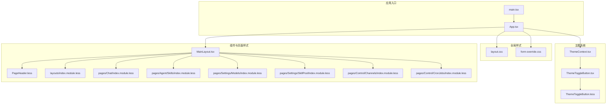
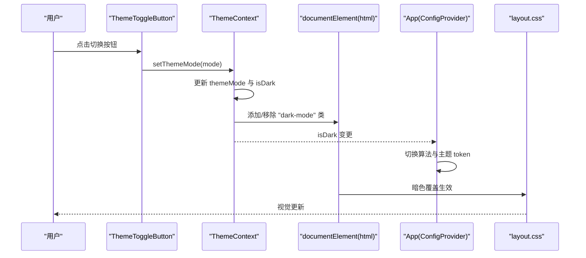
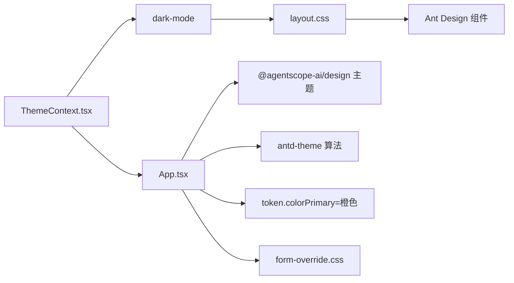

# 样式与主题

<cite>
**本文引用的文件**
- [ThemeContext.tsx](file://console/src/contexts/ThemeContext.tsx)
- [ThemeToggleButton.tsx](file://console/src/components/ThemeToggleButton/index.tsx)
- [ThemeToggleButton.less](file://console/src/components/ThemeToggleButton/index.module.less)
- [layout.css](file://console/src/styles/layout.css)
- [form-override.css](file://console/src/styles/form-override.css)
- [App.tsx](file://console/src/App.tsx)
- [main.tsx](file://console/src/main.tsx)
- [PageHeader.less](file://console/src/components/PageHeader/index.module.less)
- [MainLayout.tsx](file://console/src/layouts/MainLayout/index.tsx)
- [index.module.less（布局）](file://console/src/layouts/index.module.less)
- [index.module.less（聊天页）](file://console/src/pages/Chat/index.module.less)
- [index.module.less（技能页）](file://console/src/pages/Agent/Skills/index.module.less)
- [index.module.less（模型设置页）](file://console/src/pages/Settings/Models/index.module.less)
- [index.module.less（技能池页）](file://console/src/pages/Settings/SkillPool/index.module.less)
- [index.module.less（控制台频道页）](file://console/src/pages/Control/Channels/index.module.less)
- [index.module.less（控制台定时任务页）](file://console/src/pages/Control/CronJobs/index.module.less)
- [index.module.less（页面容器）](file://console/src/components/PageContainer/index.tsx)
- [index.module.less（语言切换器）](file://console/src/components/LanguageSwitcher/index.module.less)
- [index.module.less（Markdown 复制）](file://console/src/components/MarkdownCopy/index.module.less)
- [index.module.less（控制台气泡）](file://console/src/components/ConsoleCronBubble/index.module.less)
- [index.module.less（页脚）](file://console/src/components/Footer/index.tsx)
- [index.module.less（表单覆盖样式）](file://console/src/styles/form-override.css)
- [index.module.less（布局样式）](file://console/src/styles/layout.css)
- [package.json（控制台）](file://console/package.json)
- [vite.config.ts（控制台）](file://console/vite.config.ts)
- [pnpm-lock.yaml（控制台）](file://console/pnpm-lock.yaml)
</cite>

## 目录
1. [简介](#简介)
2. [项目结构](#项目结构)
3. [核心组件](#核心组件)
4. [架构总览](#架构总览)
5. [详细组件分析](#详细组件分析)
6. [依赖关系分析](#依赖关系分析)
7. [性能考量](#性能考量)
8. [故障排查指南](#故障排查指南)
9. [结论](#结论)
10. [附录](#附录)

## 简介
本文件面向 CoPaw 前端控制台的样式与主题系统，系统采用“CSS-in-JS + CSS 变量”的混合架构：通过 React 上下文提供主题模式（浅色/深色/跟随系统），在全局注入暗色类名以驱动 CSS 变量与第三方组件库（Ant Design、@agentscope-ai/design）的深色适配；同时使用模块化 CSS（Less）进行组件级样式隔离与局部主题覆盖。文档将从主题切换机制、颜色与字体体系、样式组织、全局与组件样式隔离、媒体查询与响应式策略、性能优化、浏览器兼容与可访问性等方面进行全面说明。

## 项目结构
控制台样式与主题相关的关键位置如下：
- 主题上下文与切换逻辑：console/src/contexts/ThemeContext.tsx
- 全局样式与第三方组件覆盖：console/src/styles/
- 应用入口与主题注入：console/src/App.tsx
- 组件级样式与主题覆盖：console/src/components/*/index.module.less
- 页面级样式与响应式：console/src/pages/*/index.module.less
- 布局与容器：console/src/layouts/ 与 console/src/components/PageContainer/

图表来源
- [App.tsx:142-217](file://console/src/App.tsx#L142-L217)
- [ThemeContext.tsx:51-100](file://console/src/contexts/ThemeContext.tsx#L51-L100)
- [ThemeToggleButton.tsx:18-52](file://console/src/components/ThemeToggleButton/index.tsx#L18-L52)
- [ThemeToggleButton.less:1-86](file://console/src/components/ThemeToggleButton/index.module.less#L1-L86)
- [layout.css:1-1032](file://console/src/styles/layout.css#L1-L1032)
- [form-override.css:1-16](file://console/src/styles/form-override.css#L1-L16)
- [MainLayout.tsx:94-155](file://console/src/layouts/MainLayout/index.tsx#L94-L155)
- [PageHeader.less:1-85](file://console/src/components/PageHeader/index.module.less#L1-L85)

章节来源
- [App.tsx:142-217](file://console/src/App.tsx#L142-L217)
- [ThemeContext.tsx:51-100](file://console/src/contexts/ThemeContext.tsx#L51-L100)
- [ThemeToggleButton.tsx:18-52](file://console/src/components/ThemeToggleButton/index.tsx#L18-L52)
- [ThemeToggleButton.less:1-86](file://console/src/components/ThemeToggleButton/index.module.less#L1-L86)
- [layout.css:1-1032](file://console/src/styles/layout.css#L1-L1032)
- [form-override.css:1-16](file://console/src/styles/form-override.css#L1-L16)
- [MainLayout.tsx:94-155](file://console/src/layouts/MainLayout/index.tsx#L94-L155)
- [PageHeader.less:1-85](file://console/src/components/PageHeader/index.module.less#L1-L85)

## 核心组件
- 主题上下文（ThemeContext）
  - 提供主题模式（light/dark/system）、最终深色状态、切换函数与便捷切换函数
  - 将 isDark 结果映射到 <html> 的 dark-mode 类，用于全局 CSS 变量与第三方组件的深色覆盖
  - 支持本地存储持久化与系统偏好监听
- 主题切换按钮（ThemeToggleButton）
  - 使用 Ant Design 下拉菜单展示三种模式，并根据当前模式选择图标
  - 通过模块化 Less 进行基础样式与暗色覆盖
- 全局样式与第三方组件覆盖
  - layout.css：重置与基础布局、暗色模式下的全局覆盖（Ant Design、自定义前缀等）
  - form-override.css：保护第三方表单必填星号样式不被 CSS-in-JS 覆盖
- 应用入口（App.tsx）
  - 注入全局样式与第三方组件库主题配置
  - 根据 isDark 切换算法，设置主色调为品牌橙色
  - 集成国际化与路由守卫

章节来源
- [ThemeContext.tsx:10-105](file://console/src/contexts/ThemeContext.tsx#L10-L105)
- [ThemeToggleButton.tsx:12-52](file://console/src/components/ThemeToggleButton/index.tsx#L12-L52)
- [ThemeToggleButton.less:1-86](file://console/src/components/ThemeToggleButton/index.module.less#L1-L86)
- [layout.css:1-1032](file://console/src/styles/layout.css#L1-L1032)
- [form-override.css:1-16](file://console/src/styles/form-override.css#L1-L16)
- [App.tsx:183-200](file://console/src/App.tsx#L183-L200)

## 架构总览
主题系统的核心流程如下：

图表来源
- [ThemeToggleButton.tsx:18-52](file://console/src/components/ThemeToggleButton/index.tsx#L18-L52)
- [ThemeContext.tsx:51-100](file://console/src/contexts/ThemeContext.tsx#L51-L100)
- [App.tsx:183-200](file://console/src/App.tsx#L183-L200)
- [layout.css:14-40](file://console/src/styles/layout.css#L14-L40)

## 详细组件分析

### 主题上下文与切换
- 模式与解析
  - 支持 light/dark/system；当为 system 时监听 prefers-color-scheme 媒体查询变化
  - 初始值优先读取本地存储，兜底为 system
- 状态与副作用
  - isDark 决定 <html> 是否添加 dark-mode 类
  - setThemeMode 同步更新本地存储并触发 DOM 类变更
- 与第三方组件的协作
  - App 中通过 ConfigProvider 的 theme.algorithm 根据 isDark 切换算法
  - 品牌主色通过 token.colorPrimary 固定为橙色

章节来源
- [ThemeContext.tsx:32-100](file://console/src/contexts/ThemeContext.tsx#L32-L100)
- [App.tsx:183-200](file://console/src/App.tsx#L183-L200)

### 主题切换按钮
- 功能
  - 展示 light/dark/system 三态菜单，点击即时切换
  - 图标随当前模式或系统偏好动态显示
- 样式
  - 基础悬停与颜色过渡
  - 暗色模式下对下拉菜单项与边框阴影进行覆盖，确保对比度与一致性

章节来源
- [ThemeToggleButton.tsx:18-52](file://console/src/components/ThemeToggleButton/index.tsx#L18-L52)
- [ThemeToggleButton.less:1-86](file://console/src/components/ThemeToggleButton/index.module.less#L1-L86)

### 全局样式与第三方组件覆盖
- layout.css
  - 重置与基础布局（html/body、Ant Design 布局、内容区背景）
  - 通过 .dark-mode 选择器对大量组件（卡片、表格、表单、模态框、抽屉、日期选择器、滑块、Tooltip 等）进行暗色覆盖
  - 对特定场景（如聊天输入禁用遮罩、消息内容）进行针对性覆盖
- form-override.css
  - 保护第三方表单必填星号与自定义标记元素的颜色，避免被 CSS-in-JS 覆盖

章节来源
- [layout.css:1-1032](file://console/src/styles/layout.css#L1-L1032)
- [form-override.css:1-16](file://console/src/styles/form-override.css#L1-L16)

### 应用入口与主题注入
- 全局样式
  - 引入 layout.css 与 form-override.css，保证全局覆盖与第三方组件样式稳定
- 主题注入
  - 使用 createGlobalStyle 设置基础盒模型与全局样式
  - ConfigProvider 接入 @agentscope-ai/design 的 bailianTheme，并根据 isDark 切换算法
  - 主色调固定为品牌橙色，确保视觉一致

章节来源
- [App.tsx:25-26](file://console/src/App.tsx#L25-L26)
- [App.tsx:183-200](file://console/src/App.tsx#L183-L200)

### 布局与页面样式组织
- 布局
  - MainLayout 负责路由与页面容器，页面内容统一挂载在 .page-content 容器中
  - 布局样式通过模块化 Less 控制容器尺寸与滚动
- 页面级样式
  - 各页面（聊天、技能、模型、技能池、控制台频道/定时任务等）均使用模块化 Less，按需引入
  - 在 Less 文件中使用 :global(.dark-mode) 进行暗色覆盖，保持与全局策略一致

章节来源
- [MainLayout.tsx:94-155](file://console/src/layouts/MainLayout/index.tsx#L94-L155)
- [index.module.less（布局）](file://console/src/layouts/index.module.less)
- [index.module.less（聊天页）](file://console/src/pages/Chat/index.module.less)
- [index.module.less（技能页）](file://console/src/pages/Agent/Skills/index.module.less)
- [index.module.less（模型设置页）](file://console/src/pages/Settings/Models/index.module.less)
- [index.module.less（技能池页）](file://console/src/pages/Settings/SkillPool/index.module.less)
- [index.module.less（控制台频道页）](file://console/src/pages/Control/Channels/index.module.less)
- [index.module.less（控制台定时任务页）](file://console/src/pages/Control/CronJobs/index.module.less)

### 组件级样式与主题隔离
- PageHeader
  - 使用模块化 Less 控制标题栏、面包屑与额外操作区域
  - 在暗色模式下对边框、文字颜色进行覆盖，确保对比度
- PageContainer
  - 作为页面容器，承载各页面内容，配合全局 .page-content 实现一致的背景与边框
- 语言切换器、Markdown 复制、控制台气泡等
  - 均采用模块化样式，必要时在暗色模式下进行覆盖

章节来源
- [PageHeader.less:1-85](file://console/src/components/PageHeader/index.module.less#L1-L85)
- [index.module.less（页面容器）](file://console/src/components/PageContainer/index.tsx)
- [index.module.less（语言切换器）](file://console/src/components/LanguageSwitcher/index.module.less)
- [index.module.less（Markdown 复制）](file://console/src/components/MarkdownCopy/index.module.less)
- [index.module.less（控制台气泡）](file://console/src/components/ConsoleCronBubble/index.module.less)

### 响应式与媒体查询
- 页面级 Less 中广泛使用 @media (max-width: 768px) 对移动端进行断点适配
- 示例断点位置
  - 技能页：index.module.less（约 L631）
  - 模型设置页：index.module.less（约 L567、L581、L1171）
  - 技能池页：index.module.less（约 L1031）

章节来源
- [index.module.less（技能页）:631-631](file://console/src/pages/Agent/Skills/index.module.less#L631-L631)
- [index.module.less（模型设置页）:567-581](file://console/src/pages/Settings/Models/index.module.less#L567-L581)
- [index.module.less（模型设置页）:1171-1171](file://console/src/pages/Settings/Models/index.module.less#L1171-L1171)
- [index.module.less（技能池页）:1031-1031](file://console/src/pages/Settings/SkillPool/index.module.less#L1031-L1031)

## 依赖关系分析
- 主题系统依赖
  - ThemeContext 依赖 localStorage 与 window.matchMedia
  - App 依赖 @agentscope-ai/design 与 antd-theme 算法
  - 全局样式依赖 Ant Design 组件类名与自定义前缀（copaw）
- 样式组织依赖
  - 模块化 Less 与 :global(.dark-mode) 用于组件级覆盖
  - form-override.css 保护第三方组件关键样式

图表来源
- [ThemeContext.tsx:51-100](file://console/src/contexts/ThemeContext.tsx#L51-L100)
- [App.tsx:183-200](file://console/src/App.tsx#L183-L200)
- [layout.css:14-40](file://console/src/styles/layout.css#L14-L40)
- [form-override.css:1-16](file://console/src/styles/form-override.css#L1-L16)

章节来源
- [ThemeContext.tsx:51-100](file://console/src/contexts/ThemeContext.tsx#L51-L100)
- [App.tsx:183-200](file://console/src/App.tsx#L183-L200)
- [layout.css:14-40](file://console/src/styles/layout.css#L14-L40)
- [form-override.css:1-16](file://console/src/styles/form-override.css#L1-L16)

## 性能考量
- 样式加载与打包
  - 控制台使用 Vite 构建，建议开启 CSS 分包与按需加载，减少首屏样式体积
  - 将第三方组件覆盖样式集中于 layout.css，避免重复注入
- 主题切换性能
  - 仅通过 <html> 类名切换，避免大规模 DOM 重排
  - 本地存储持久化减少每次刷新的 IO
- 组件样式隔离
  - 模块化 Less 生成作用域类名，避免全局污染，提升渲染稳定性
- 建议
  - 对大型页面（如技能池、模型设置）拆分 Less 文件，结合媒体查询按需加载
  - 使用 CSS-in-JS 的组件尽量复用主题 token，减少重复计算

## 故障排查指南
- 暗色模式不生效
  - 检查 ThemeContext 是否正确写入 dark-mode 类到 <html>
  - 确认 App 中 isDark 已影响 ConfigProvider 的算法与 token
  - 核对 layout.css 中对应组件的选择器是否匹配
- 第三方组件样式异常
  - 检查 form-override.css 是否正确保护必填星号与自定义标记
  - 若仍异常，确认组件前缀（如 copaw-）与全局覆盖选择器一致
- 响应式断点无效
  - 确认 Less 中 @media 断点范围与设备宽度一致
  - 检查页面是否正确引入对应 index.module.less
- 构建与运行问题
  - 检查 Vite 配置与依赖版本，确保 Less 与 CSS-in-JS 插件正常工作
  - 关注 pnpm-lock.yaml 中 @emotion/* 与 antd 相关依赖版本

章节来源
- [ThemeContext.tsx:51-100](file://console/src/contexts/ThemeContext.tsx#L51-L100)
- [App.tsx:183-200](file://console/src/App.tsx#L183-L200)
- [layout.css:14-40](file://console/src/styles/layout.css#L14-L40)
- [form-override.css:1-16](file://console/src/styles/form-override.css#L1-L16)
- [vite.config.ts（控制台）](file://console/vite.config.ts)
- [pnpm-lock.yaml（控制台）](file://console/pnpm-lock.yaml)

## 结论
CoPaw 控制台的样式与主题系统通过“上下文 + 全局 CSS + 组件模块化样式”的组合，实现了稳定的浅/深色主题切换与第三方组件的深度适配。该方案在可维护性、可扩展性与性能之间取得平衡：主题切换轻量、覆盖集中、样式隔离明确。建议在后续迭代中继续完善媒体查询断点、优化大型页面的样式拆分，并持续关注浏览器兼容与可访问性指标。

## 附录
- 主题变量与颜色体系
  - 品牌主色：橙色（token.colorPrimary）
  - 暗色模式：通过 .dark-mode 与全局覆盖实现
- 字体与排版
  - 字体族与字号由 Ant Design 与 @agentscope-ai/design 统一提供，组件内无需重复定义
- 媒体查询与响应式
  - 页面级 Less 使用 @media (max-width: 768px) 进行移动端适配
- 浏览器兼容与可访问性
  - 依赖现代浏览器的 CSS-in-JS 与媒体查询能力；建议在企业环境中统一浏览器版本，确保一致体验