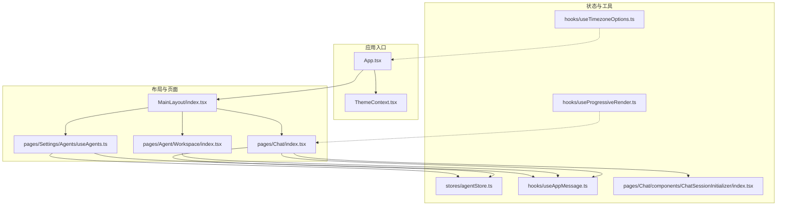
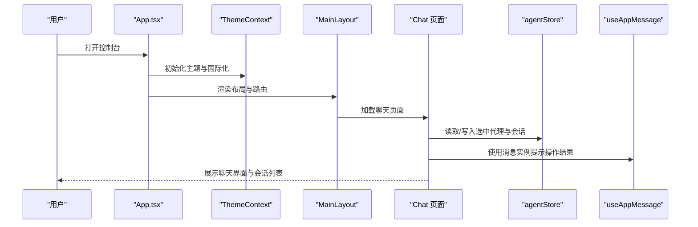
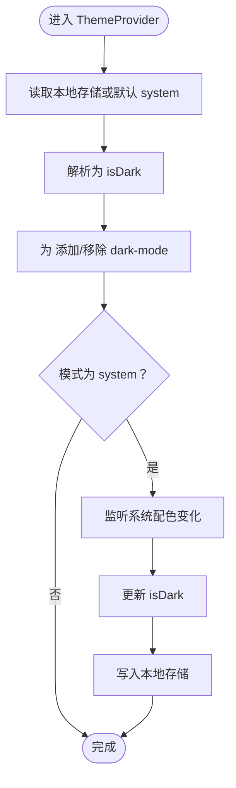
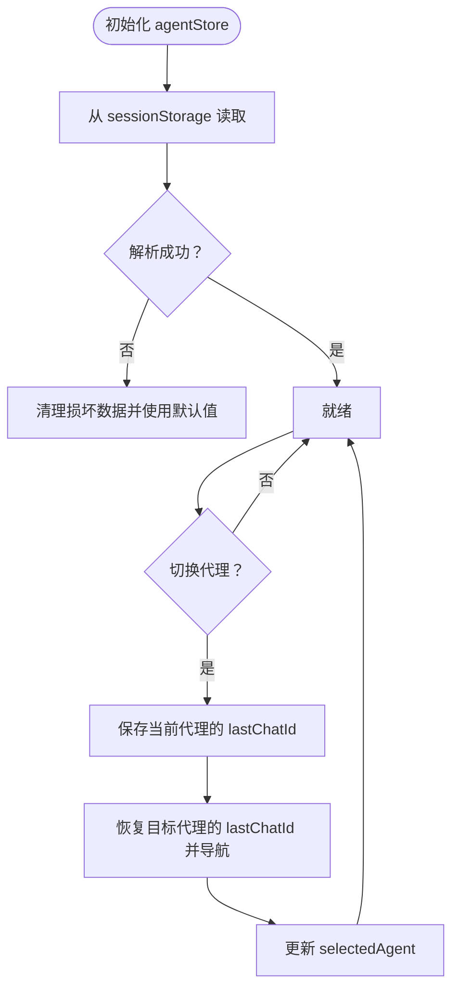
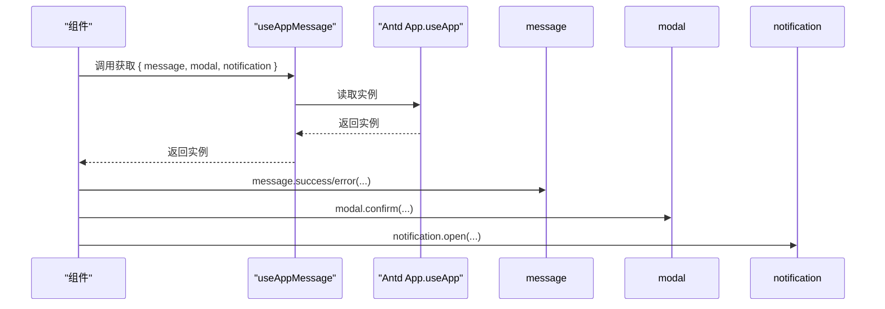
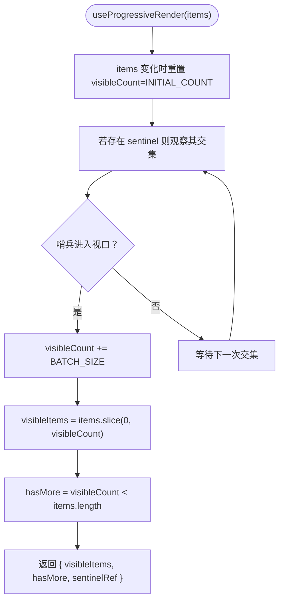
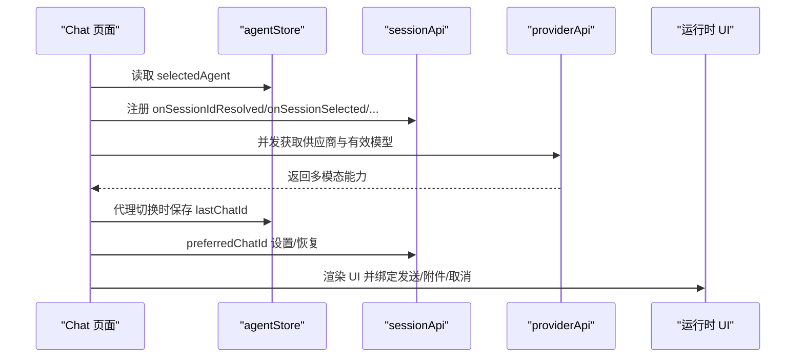
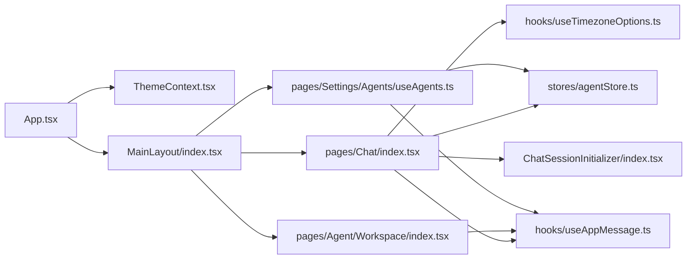

# 状态管理

<cite>
**本文引用的文件**
- [ThemeContext.tsx](file://console/src/contexts/ThemeContext.tsx)
- [useAppMessage.ts](file://console/src/hooks/useAppMessage.ts)
- [useProgressiveRender.ts](file://console/src/hooks/useProgressiveRender.ts)
- [agentStore.ts](file://console/src/stores/agentStore.ts)
- [App.tsx](file://console/src/App.tsx)
- [MainLayout/index.tsx](file://console/src/layouts/MainLayout/index.tsx)
- [pages/Chat/index.tsx](file://console/src/pages/Chat/index.tsx)
- [pages/Agent/Workspace/index.tsx](file://console/src/pages/Agent/Workspace/index.tsx)
- [pages/Settings/Agents/useAgents.ts](file://console/src/pages/Settings/Agents/useAgents.ts)
- [pages/Chat/components/ChatSessionInitializer/index.tsx](file://console/src/pages/Chat/components/ChatSessionInitializer/index.tsx)
- [hooks/useTimezoneOptions.ts](file://console/src/hooks/useTimezoneOptions.ts)
</cite>

## 目录
1. [简介](#简介)
2. [项目结构](#项目结构)
3. [核心组件](#核心组件)
4. [架构总览](#架构总览)
5. [详细组件分析](#详细组件分析)
6. [依赖关系分析](#依赖关系分析)
7. [性能考量](#性能考量)
8. [故障排查指南](#故障排查指南)
9. [结论](#结论)

## 简介
本文件系统性梳理 CoPaw 前端控制台的状态管理方案，围绕 React Hooks 与 Context 的组合，结合轻量状态库（Zustand）实现“全局状态 + 局部状态 + 组件间通信”的统一架构。重点覆盖以下方面：
- 全局状态：主题模式、代理选择与会话恢复、国际化语言与时区选项等
- 局部状态：列表懒加载与滚动触底增量渲染、聊天输入法组合事件处理、模型能力探测等
- 组件间通信：路由与会话上下文联动、消息通知桥接、主题与配置提供器
- 性能优化：IntersectionObserver 渐进渲染、useMemo/useCallback 避免重渲染、持久化存储与错误兜底
- 异步与副作用：鉴权守卫、消息通知、文件上传下载、多模型能力探测

## 项目结构
控制台采用分层组织：入口应用负责全局配置与守卫；布局层承载导航与页面容器；页面层按功能域拆分；Hooks 提供可复用的状态逻辑；Context 提供主题与配置注入；Zustand 负责跨页面的轻量全局状态。

**图表来源**
- [App.tsx:142-227](file://console/src/App.tsx#L142-L227)
- [ThemeContext.tsx:51-100](file://console/src/contexts/ThemeContext.tsx#L51-L100)
- [MainLayout/index.tsx:94-155](file://console/src/layouts/MainLayout/index.tsx#L94-L155)
- [pages/Chat/index.tsx:400-800](file://console/src/pages/Chat/index.tsx#L400-L800)
- [pages/Agent/Workspace/index.tsx:11-186](file://console/src/pages/Agent/Workspace/index.tsx#L11-L186)
- [pages/Settings/Agents/useAgents.ts:18-89](file://console/src/pages/Settings/Agents/useAgents.ts#L18-L89)
- [stores/agentStore.ts:19-88](file://console/src/stores/agentStore.ts#L19-L88)
- [hooks/useAppMessage.ts:12-16](file://console/src/hooks/useAppMessage.ts#L12-L16)
- [hooks/useProgressiveRender.ts:17-52](file://console/src/hooks/useProgressiveRender.ts#L17-L52)
- [hooks/useTimezoneOptions.ts:5-12](file://console/src/hooks/useTimezoneOptions.ts#L5-L12)
- [pages/Chat/components/ChatSessionInitializer/index.tsx:12-39](file://console/src/pages/Chat/components/ChatSessionInitializer/index.tsx#L12-L39)

**章节来源**
- [App.tsx:142-227](file://console/src/App.tsx#L142-L227)
- [MainLayout/index.tsx:94-155](file://console/src/layouts/MainLayout/index.tsx#L94-L155)

## 核心组件
- 主题上下文与持久化：通过 Context 暴露主题模式与切换函数，并持久化到本地存储；同时监听系统配色偏好变化，支持 light/dark/system 三种模式。
- 全局代理状态：Zustand 存储当前选中代理、代理列表与“按代理记忆的最后会话 ID”，并持久化到 sessionStorage，用于代理切换时自动恢复会话。
- 应用消息桥接：自定义 Hook 获取 Ant Design 的 App.useApp 实例中的 message/notification/modal，确保与 ConfigProvider 的前缀一致。
- 渐进渲染 Hook：对长列表进行分批渲染，使用 IntersectionObserver 在哨兵元素进入视口时触发加载更多，保持现有布局不变。
- 时区选项 Hook：根据当前语言动态生成时区选项，避免重复计算。
- 路由与会话初始化：在聊天页根据 URL 中的会话 ID 同步到运行时会话上下文，避免双向同步导致的循环刷新。

**章节来源**
- [ThemeContext.tsx:15-104](file://console/src/contexts/ThemeContext.tsx#L15-L104)
- [agentStore.ts:5-88](file://console/src/stores/agentStore.ts#L5-L88)
- [useAppMessage.ts:12-16](file://console/src/hooks/useAppMessage.ts#L12-L16)
- [useProgressiveRender.ts:17-52](file://console/src/hooks/useProgressiveRender.ts#L17-L52)
- [hooks/useTimezoneOptions.ts:5-12](file://console/src/hooks/useTimezoneOptions.ts#L5-L12)
- [pages/Chat/components/ChatSessionInitializer/index.tsx:12-39](file://console/src/pages/Chat/components/ChatSessionInitializer/index.tsx#L12-L39)

## 架构总览
整体采用“Context 注入 + Zustand 全局 + Hooks 抽象 + 页面组件”的分层设计。主题与国际化在应用入口集中处理；聊天与工作区等页面通过自定义 Hook 将复杂状态与副作用封装，降低组件负担。

**图表来源**
- [App.tsx:142-227](file://console/src/App.tsx#L142-L227)
- [ThemeContext.tsx:51-100](file://console/src/contexts/ThemeContext.tsx#L51-L100)
- [MainLayout/index.tsx:94-155](file://console/src/layouts/MainLayout/index.tsx#L94-L155)
- [pages/Chat/index.tsx:400-560](file://console/src/pages/Chat/index.tsx#L400-L560)
- [stores/agentStore.ts:19-88](file://console/src/stores/agentStore.ts#L19-L88)
- [hooks/useAppMessage.ts:12-16](file://console/src/hooks/useAppMessage.ts#L12-L16)

## 详细组件分析

### 主题状态管理（ThemeContext）
- 设计要点
  - 模式类型：light/dark/system；解析后得到最终深色布尔值
  - 持久化：将用户选择写入本地存储，刷新后仍生效
  - 系统联动：当模式为 system 时监听系统配色变更，实时更新
  - 全局样式：向 <html> 添加/移除 dark-mode 类名，驱动全局 CSS 变量
- 关键行为
  - 切换主题：更新模式与解析后的深色状态，并持久化
  - 切换按钮：在 light/dark 之间切换（跳过 system）
  - 外观同步：通过 useEffect 将 isDark 映射到 DOM 类名

**图表来源**
- [ThemeContext.tsx:51-100](file://console/src/contexts/ThemeContext.tsx#L51-L100)

**章节来源**
- [ThemeContext.tsx:15-104](file://console/src/contexts/ThemeContext.tsx#L15-L104)

### 全局代理状态（Zustand）
- 数据模型
  - selectedAgent：当前选中代理 ID
  - agents：代理列表
  - lastChatIdByAgent：记录每个代理最近一次活跃会话 ID，用于切换恢复
- 持久化策略
  - 使用 persist 中间件，存储到 sessionStorage
  - 自定义 storage：getItem/setItem/removeItem 包裹异常，解析失败时清理损坏数据
- 更新策略
  - 增删改查代理：原子更新 agents 数组与 selectedAgent
  - 记忆与恢复：切换代理时保存当前会话，切换回该代理时恢复

**图表来源**
- [agentStore.ts:19-88](file://console/src/stores/agentStore.ts#L19-L88)

**章节来源**
- [agentStore.ts:5-88](file://console/src/stores/agentStore.ts#L5-L88)

### 应用消息处理（useAppMessage）
- 目标：获取 Ant Design App.useApp 返回的消息/模态/通知实例，确保与 ConfigProvider 的 prefixCls 一致
- 使用场景：工作区上传/下载、设置页增删改、聊天页复制/停止等操作反馈

**图表来源**
- [hooks/useAppMessage.ts:12-16](file://console/src/hooks/useAppMessage.ts#L12-L16)

**章节来源**
- [hooks/useAppMessage.ts:12-16](file://console/src/hooks/useAppMessage.ts#L12-L16)
- [pages/Agent/Workspace/index.tsx:36-104](file://console/src/pages/Agent/Workspace/index.tsx#L36-L104)
- [pages/Settings/Agents/useAgents.ts:31-73](file://console/src/pages/Settings/Agents/useAgents.ts#L31-L73)

### 渐进渲染（useProgressiveRender）
- 功能：对超长列表进行分批渲染，初始显示固定数量，滚动接近底部时继续加载
- 机制：使用 IntersectionObserver 观察哨兵元素，rootMargin 提前触发，避免空窗
- 行为：源列表变化时重置可见数量；返回 visibleItems、hasMore 与 sentinelRef 回调 ref 设置器

**图表来源**
- [hooks/useProgressiveRender.ts:17-52](file://console/src/hooks/useProgressiveRender.ts#L17-L52)

**章节来源**
- [hooks/useProgressiveRender.ts:17-52](file://console/src/hooks/useProgressiveRender.ts#L17-L52)

### 时区选项（useTimezoneOptions）
- 功能：根据当前语言生成时区选项数组，避免每次渲染重复计算
- 依赖：i18n 解析语言，截取主语言代码映射到时区选项

**章节来源**
- [hooks/useTimezoneOptions.ts:5-12](file://console/src/hooks/useTimezoneOptions.ts#L5-L12)

### 聊天会话初始化（ChatSessionInitializer）
- 功能：将 URL 中的 chatId 同步到运行时会话上下文中，避免双向同步导致的循环刷新
- 关键点：仅响应 URL 或会话列表变化；通过 ref 读取 currentSessionId，避免 effect 依赖环

**章节来源**
- [pages/Chat/components/ChatSessionInitializer/index.tsx:12-39](file://console/src/pages/Chat/components/ChatSessionInitializer/index.tsx#L12-L39)

### 聊天页状态与副作用（pages/Chat/index.tsx）
- 输入法组合事件：拦截 IME composition 期间的 Enter 提交，防止误触发
- 多模态能力探测：并发拉取供应商与有效模型，解析当前模型是否支持图像/视频/多模态
- 会话 URL 同步：注册 sessionApi 的回调，处理会话创建/删除/选择/解析，维护 lastSessionIdRef 与 staleAutoSelectedIdRef，抑制延迟回调
- 代理切换恢复：监听 selectedAgent 变化，保存当前会话至 lastChatIdByAgent，并尝试恢复目标代理的 lastChatId
- 文件上传：校验大小与类型，调用 chatApi.uploadFile，进度与预览处理
- 自定义 fetch：构建请求体，附加认证头与会话信息，流式响应接入运行时 UI

**图表来源**
- [pages/Chat/index.tsx:400-800](file://console/src/pages/Chat/index.tsx#L400-L800)
- [stores/agentStore.ts:19-88](file://console/src/stores/agentStore.ts#L19-L88)
- [pages/Chat/components/ChatSessionInitializer/index.tsx:12-39](file://console/src/pages/Chat/components/ChatSessionInitializer/index.tsx#L12-L39)

**章节来源**
- [pages/Chat/index.tsx:400-800](file://console/src/pages/Chat/index.tsx#L400-L800)

### 工作区页面（pages/Agent/Workspace/index.tsx）
- 功能：展示与编辑工作区文件，支持 ZIP 上传/下载、启用/禁用文件、拖拽排序
- 状态：通过 useAgentsData（未在本文件直接实现）管理文件列表、选中项、内容与变更状态
- 交互：使用 useAppMessage 进行上传/下载成功/失败提示

**章节来源**
- [pages/Agent/Workspace/index.tsx:11-186](file://console/src/pages/Agent/Workspace/index.tsx#L11-L186)

### 设置-代理页（pages/Settings/Agents/useAgents.ts）
- 功能：列出、删除、启停代理；加载过程中维护 loading/error；更新本地状态与全局代理存储
- 交互：使用 useAppMessage 提示操作结果；删除/启停后重新加载列表

**章节来源**
- [pages/Settings/Agents/useAgents.ts:18-89](file://console/src/pages/Settings/Agents/useAgents.ts#L18-L89)

## 依赖关系分析
- 组件耦合
  - Chat 页面强依赖 agentStore 与 useAppMessage，弱依赖 ThemeContext 与 sessionApi
  - MainLayout 作为路由容器，不直接持有业务状态，但承载懒加载与错误边界
  - ThemeContext 与 App.tsx 高内聚，负责全局主题与国际化
- 外部依赖
  - Ant Design 与 @agentscope-ai/chat 提供 UI 与运行时聊天组件
  - Zustand 提供轻量全局状态与持久化
  - dayjs 与 i18n 负责时间格式与时区/语言

**图表来源**
- [App.tsx:142-227](file://console/src/App.tsx#L142-L227)
- [ThemeContext.tsx:51-100](file://console/src/contexts/ThemeContext.tsx#L51-L100)
- [MainLayout/index.tsx:94-155](file://console/src/layouts/MainLayout/index.tsx#L94-L155)
- [pages/Chat/index.tsx:400-800](file://console/src/pages/Chat/index.tsx#L400-L800)
- [pages/Agent/Workspace/index.tsx:11-186](file://console/src/pages/Agent/Workspace/index.tsx#L11-L186)
- [pages/Settings/Agents/useAgents.ts:18-89](file://console/src/pages/Settings/Agents/useAgents.ts#L18-L89)
- [stores/agentStore.ts:19-88](file://console/src/stores/agentStore.ts#L19-L88)
- [hooks/useAppMessage.ts:12-16](file://console/src/hooks/useAppMessage.ts#L12-L16)
- [hooks/useTimezoneOptions.ts:5-12](file://console/src/hooks/useTimezoneOptions.ts#L5-L12)
- [pages/Chat/components/ChatSessionInitializer/index.tsx:12-39](file://console/src/pages/Chat/components/ChatSessionInitializer/index.tsx#L12-L39)

## 性能考量
- 渐进渲染：useProgressiveRender 通过分批渲染与哨兵观察减少首屏压力，适合大列表场景
- 计算缓存：useMemo/useCallback 广泛使用，避免不必要的重渲染（如多模态能力、主题算法、路由 basename）
- 持久化与容错：agentStore 的持久化 storage 对异常进行捕获与清理，避免损坏数据反复报错
- 事件监听：ThemeContext 对系统配色监听在模式非 system 时不绑定，减少无意义事件
- 资源懒加载：MainLayout 对大部分页面采用懒加载与自动重试，降低首屏体积

[本节为通用性能建议，无需特定文件引用]

## 故障排查指南
- 主题不生效
  - 检查 <html> 是否存在 dark-mode 类名；确认本地存储键值是否被篡改
  - 若系统模式切换无效，检查媒体查询监听是否绑定
- 代理切换未恢复会话
  - 确认 sessionStorage 中是否存在对应代理的 lastChatId
  - 检查 Chat 页面代理变化 effect 是否执行，preferredChatId 是否正确设置
- 上传/下载失败
  - 查看 useAppMessage 的错误提示；确认文件大小与类型限制
  - 检查后端接口返回与网络状态
- 聊天无法发送或附件受限
  - 检查多模态能力探测是否成功；确认模型支持范围
  - 若 IME 组合期间无法提交，确认 composition 事件拦截逻辑
- 会话 URL 不同步
  - 检查 ChatSessionInitializer 是否在 URL 或会话列表变化时触发
  - 排查 staleAutoSelectedIdRef 的抑制逻辑是否误杀

**章节来源**
- [ThemeContext.tsx:57-77](file://console/src/contexts/ThemeContext.tsx#L57-L77)
- [stores/agentStore.ts:61-87](file://console/src/stores/agentStore.ts#L61-L87)
- [pages/Chat/index.tsx:526-552](file://console/src/pages/Chat/index.tsx#L526-L552)
- [pages/Agent/Workspace/index.tsx:36-104](file://console/src/pages/Agent/Workspace/index.tsx#L36-L104)
- [pages/Chat/index.tsx:644-686](file://console/src/pages/Chat/index.tsx#L644-L686)
- [pages/Chat/components/ChatSessionInitializer/index.tsx:25-34](file://console/src/pages/Chat/components/ChatSessionInitializer/index.tsx#L25-L34)

## 结论
CoPaw 控制台的状态管理以 Context 与 Zustand 为核心，结合自定义 Hooks 将复杂状态与副作用模块化，实现了主题、代理、国际化、聊天会话等关键状态的统一治理。通过渐进渲染、持久化与错误兜底等手段，在保证用户体验的同时兼顾了性能与稳定性。后续可在以下方向持续优化：
- 将更多页面级状态迁移至 Zustand，减少 props drilling
- 对高频更新的状态引入 selector 优化订阅粒度
- 增加状态快照与回放能力，提升调试效率
- 完善离线场景下的状态同步策略